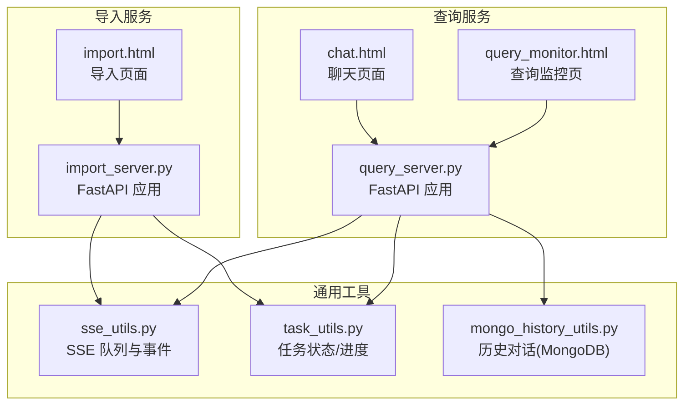
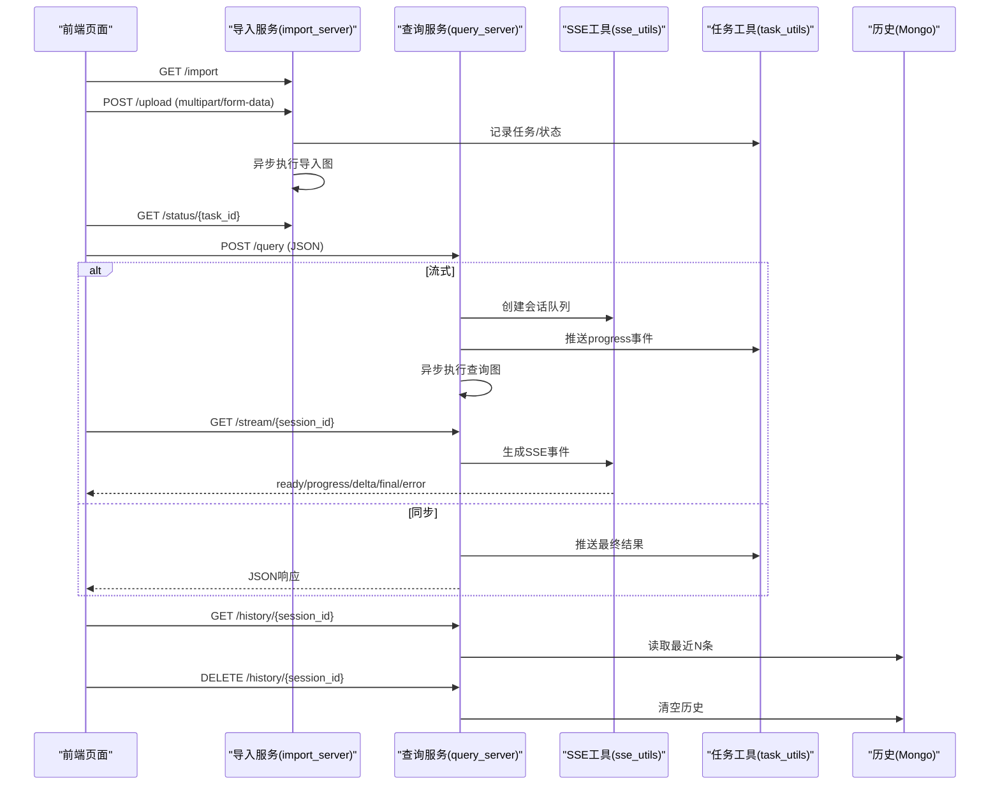
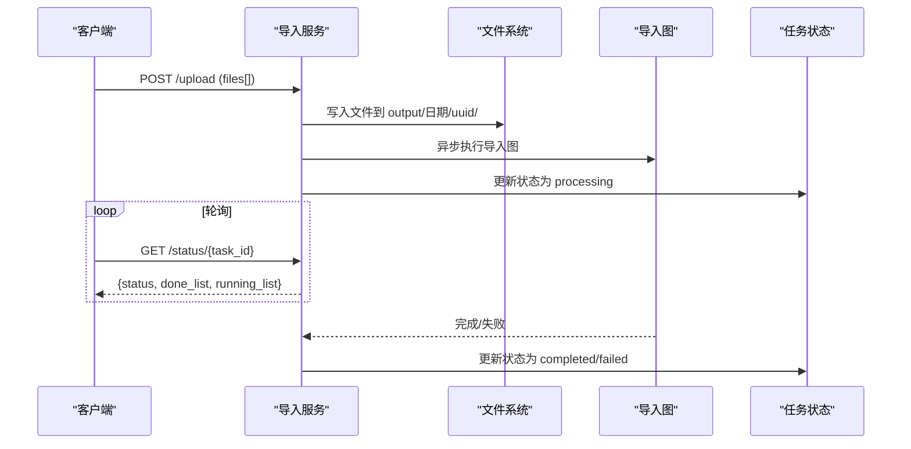
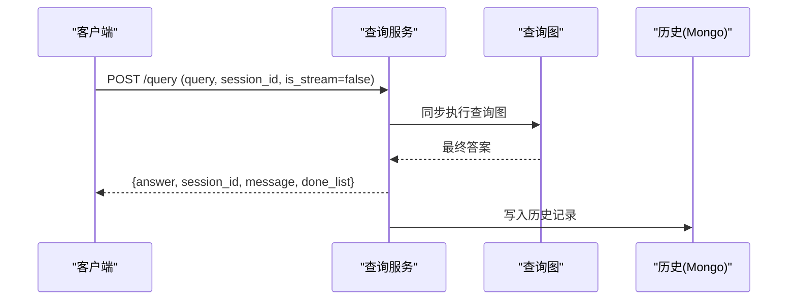
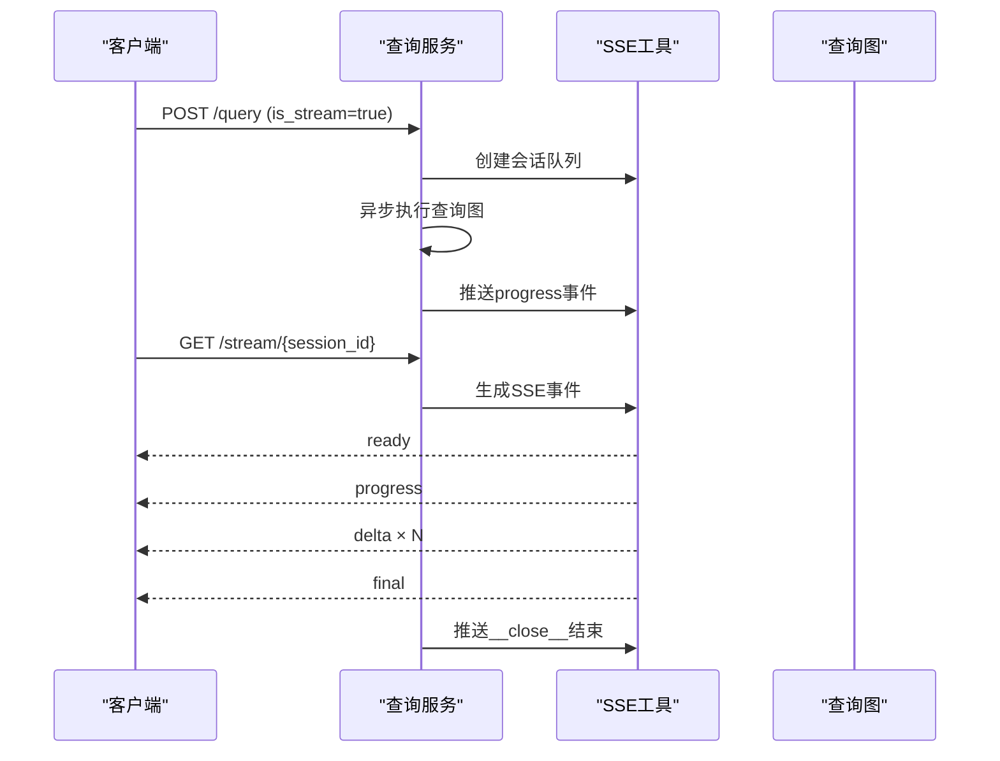
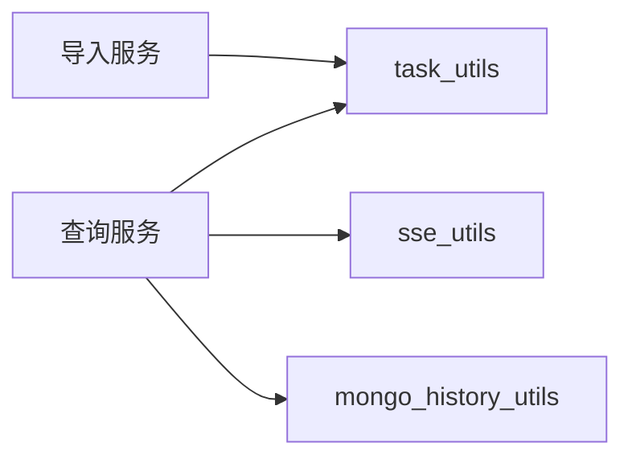

# API接口文档

<cite>
**本文引用的文件**
- [app/import_process/api/import_server.py](file://app/import_process/api/import_server.py)
- [app/query_process/api/query_server.py](file://app/query_process/api/query_server.py)
- [app/utils/sse_utils.py](file://app/utils/sse_utils.py)
- [app/utils/task_utils.py](file://app/utils/task_utils.py)
- [app/clients/mongo_history_utils.py](file://app/clients/mongo_history_utils.py)
- [app/import_process/page/import.html](file://app/import_process/page/import.html)
- [app/query_process/page/chat.html](file://app/query_process/page/chat.html)
- [app/query_process/page/query_monitor.html](file://app/query_process/page/query_monitor.html)
</cite>

## 目录
1. [简介](#简介)
2. [项目结构](#项目结构)
3. [核心组件](#核心组件)
4. [架构总览](#架构总览)
5. [详细组件分析](#详细组件分析)
6. [依赖分析](#依赖分析)
7. [性能考量](#性能考量)
8. [故障排查指南](#故障排查指南)
9. [结论](#结论)
10. [附录](#附录)

## 简介
本文件为 RAG Agent 项目的完整 API 接口文档，覆盖两类核心服务：
- 导入服务：文件上传、导入状态查询与进度监控
- 查询服务：问答接口、实时流式响应（SSE）、历史查询与清理

文档包含：
- 所有 RESTful 端点的 HTTP 方法、URL 模式、请求参数与响应格式
- 导入 API 的文件上传、状态查询与进度监控机制
- 查询 API 的问答接口、SSE 流式响应、历史对话与清理
- 认证与安全注意事项
- 请求/响应示例与错误码说明
- SSE 消息格式与事件类型
- API 版本管理与向后兼容策略
- 最佳实践与性能优化建议

## 项目结构
系统采用 FastAPI 提供 REST API，前端页面位于各自服务的 page 目录，SSE 与任务状态管理通过内存队列与任务工具模块实现。

图表来源
- [app/import_process/api/import_server.py:1-172](file://app/import_process/api/import_server.py#L1-L172)
- [app/query_process/api/query_server.py:1-164](file://app/query_process/api/query_server.py#L1-L164)
- [app/utils/sse_utils.py:1-108](file://app/utils/sse_utils.py#L1-L108)
- [app/utils/task_utils.py:1-187](file://app/utils/task_utils.py#L1-L187)
- [app/clients/mongo_history_utils.py:1-242](file://app/clients/mongo_history_utils.py#L1-L242)
- [app/import_process/page/import.html:1-351](file://app/import_process/page/import.html#L1-L351)
- [app/query_process/page/chat.html:1-896](file://app/query_process/page/chat.html#L1-L896)
- [app/query_process/page/query_monitor.html:1-142](file://app/query_process/page/query_monitor.html#L1-L142)

章节来源
- [app/import_process/api/import_server.py:1-172](file://app/import_process/api/import_server.py#L1-L172)
- [app/query_process/api/query_server.py:1-164](file://app/query_process/api/query_server.py#L1-L164)

## 核心组件
- 导入服务（/import 与 /upload）
  - 提供导入页面与文件上传接口，异步执行导入流程并通过任务状态接口反馈进度
- 查询服务（/query、/stream/{session_id}、/history/{session_id}、/history/{session_id}）
  - 支持同步/流式问答，SSE 实时推送阶段进度与增量回答，提供历史查询与清理
- SSE 工具（SSEEvent、队列与生成器）
  - 统一的 SSE 事件类型与消息打包，支持 ready、progress、delta、final、error、__close__
- 任务状态工具（task_utils）
  - 内存态任务追踪：状态、已完成/进行中节点列表、结果存储与推送
- 历史对话工具（mongo_history_utils）
  - 基于 MongoDB 的历史对话读写与清理

章节来源
- [app/utils/sse_utils.py:1-108](file://app/utils/sse_utils.py#L1-L108)
- [app/utils/task_utils.py:1-187](file://app/utils/task_utils.py#L1-L187)
- [app/clients/mongo_history_utils.py:1-242](file://app/clients/mongo_history_utils.py#L1-L242)

## 架构总览
导入与查询两条服务线并行运行，共享 SSE 与任务状态工具，查询服务还集成 MongoDB 历史存储。

图表来源
- [app/import_process/api/import_server.py:44-166](file://app/import_process/api/import_server.py#L44-L166)
- [app/query_process/api/query_server.py:32-160](file://app/query_process/api/query_server.py#L32-L160)
- [app/utils/sse_utils.py:54-108](file://app/utils/sse_utils.py#L54-L108)
- [app/utils/task_utils.py:174-179](file://app/utils/task_utils.py#L174-L179)
- [app/clients/mongo_history_utils.py:193-221](file://app/clients/mongo_history_utils.py#L193-L221)

## 详细组件分析

### 导入服务 API

- 端点：GET /import
  - 功能：返回导入页面
  - 认证：无需
  - 响应：HTML 页面
  - 示例：浏览器访问 http://host:port/import

- 端点：POST /upload
  - 功能：接收文件并开启异步导入流程
  - 认证：无需
  - 请求头：multipart/form-data
  - 请求体字段：
    - files: 文件数组（支持多文件）
  - 成功响应字段：
    - code: 数字（200 表示成功）
    - message: 字符串（简要说明）
    - task_ids: 字符串数组（每个文件对应一个任务ID）
  - 错误响应：HTTP 400/500，包含错误信息
  - 说明：
    - 服务器将文件保存至 output/年月日/uuid/文件名
    - 异步执行导入图，期间可通过 /status/{task_id} 查询进度

- 端点：GET /status/{task_id}
  - 功能：查询单个任务的处理进度与状态
  - 认证：无需
  - 路径参数：
    - task_id: 字符串（上传接口返回的任务ID）
  - 成功响应字段：
    - code: 数字（200）
    - task_id: 字符串
    - status: 字符串（pending/processing/completed/failed）
    - done_list: 字符串数组（已完成节点中文名列表）
    - running_list: 字符串数组（进行中节点中文名列表）
  - 说明：前端可定时轮询（如每秒一次）

章节来源
- [app/import_process/api/import_server.py:44-166](file://app/import_process/api/import_server.py#L44-L166)
- [app/import_process/page/import.html:241-346](file://app/import_process/page/import.html#L241-L346)

#### 导入流程时序图

图表来源
- [app/import_process/api/import_server.py:98-138](file://app/import_process/api/import_server.py#L98-L138)
- [app/import_process/api/import_server.py:146-166](file://app/import_process/api/import_server.py#L146-L166)

### 查询服务 API

- 健康检查：GET /health
  - 功能：健康状态检查
  - 响应：{"status":"ok"}

- 页面：GET /chat.html
  - 功能：返回聊天页面

- 端点：POST /query
  - 功能：发起问答（同步或流式）
  - 认证：无需
  - 请求体（JSON）：
    - query: 字符串（必填）
    - session_id: 字符串（可选，未提供则自动生成）
    - is_stream: 布尔（可选，默认false）
  - 同步响应字段：
    - answer: 字符串（最终答案）
    - session_id: 字符串
    - message: 字符串（处理完成提示）
    - done_list: 字符串数组（空数组）
  - 流式响应字段：
    - session_id: 字符串（立即返回）
    - message: 字符串（处理中提示）

- 端点：GET /stream/{session_id}
  - 功能：SSE 实时流式响应
  - 认证：无需
  - 响应：text/event-stream
  - 事件类型：
    - ready：连接建立
    - progress：阶段进度（包含 status、done_list、running_list）
    - delta：LLM 增量输出
    - final：最终完整答案
    - error：错误信息
    - __close__：关闭连接信号（内部使用）

- 端点：GET /history/{session_id}
  - 功能：查询最近 N 条历史对话
  - 认证：无需
  - 查询参数：
    - limit: 整数（默认10）
  - 响应字段：
    - session_id: 字符串
    - items: 数组（每项为原始消息字典）

- 端点：DELETE /history/{session_id}
  - 功能：清空指定会话的历史对话
  - 认证：无需
  - 响应字段：
    - deleted_count: 整数（删除数量）
    - message: 字符串（操作结果）

- 端点：GET /query/monitor/recent
  - 功能：查询最近请求摘要（监控页使用）
  - 认证：无需
  - 查询参数：
    - limit: 整数（默认200）
  - 响应字段：
    - summary: 统计摘要
    - items: 数组（每项包含 session_id、status、query、latency_ms、done_count、running_count、answer_len、updated_at）

- 端点：GET /query/monitor/{session_id}
  - 功能：查询指定会话的详细监控信息
  - 认证：无需
  - 响应字段：
    - session_id: 字符串
    - status: 字符串
    - query: 字符串
    - latency_ms: 数字
    - done_list: 字符串数组
    - running_list: 字符串数组
    - error: 字符串（可选）

章节来源
- [app/query_process/api/query_server.py:32-160](file://app/query_process/api/query_server.py#L32-L160)
- [app/query_process/page/chat.html:687-800](file://app/query_process/page/chat.html#L687-L800)
- [app/query_process/page/query_monitor.html:96-139](file://app/query_process/page/query_monitor.html#L96-L139)
- [app/clients/mongo_history_utils.py:193-221](file://app/clients/mongo_history_utils.py#L193-L221)

#### 查询流程时序图（同步）

图表来源
- [app/query_process/api/query_server.py:78-112](file://app/query_process/api/query_server.py#L78-L112)
- [app/clients/mongo_history_utils.py:109-160](file://app/clients/mongo_history_utils.py#L109-L160)

#### 查询流程时序图（流式）

图表来源
- [app/query_process/api/query_server.py:78-99](file://app/query_process/api/query_server.py#L78-L99)
- [app/query_process/api/query_server.py:115-126](file://app/query_process/api/query_server.py#L115-L126)
- [app/utils/sse_utils.py:54-108](file://app/utils/sse_utils.py#L54-L108)

### SSE 消息格式与事件类型
- 事件类型定义（SSEEvent）：
  - ready：连接建立
  - progress：任务节点进度
  - delta：LLM 流式输出增量
  - final：最终完整答案
  - error：错误信息
  - __close__：关闭连接信号
- 消息格式：
  - 每条消息由 event 与 data 两部分组成，data 为 JSON 字符串
  - 前端通过 EventSource 接收并解析

章节来源
- [app/utils/sse_utils.py:8-42](file://app/utils/sse_utils.py#L8-L42)
- [app/utils/sse_utils.py:54-98](file://app/utils/sse_utils.py#L54-L98)

## 依赖分析
- 组件耦合
  - 导入服务与查询服务分别依赖 task_utils 与 sse_utils
  - 查询服务额外依赖 mongo_history_utils
- 任务状态与进度
  - task_utils 提供内存态任务追踪与事件推送
- SSE 队列
  - sse_utils 维护按 session_id 分组的队列，支持并发会话

图表来源
- [app/import_process/api/import_server.py:14-24](file://app/import_process/api/import_server.py#L14-L24)
- [app/query_process/api/query_server.py:14-17](file://app/query_process/api/query_server.py#L14-L17)

章节来源
- [app/utils/task_utils.py:1-187](file://app/utils/task_utils.py#L1-L187)
- [app/utils/sse_utils.py:1-108](file://app/utils/sse_utils.py#L1-L108)
- [app/clients/mongo_history_utils.py:1-242](file://app/clients/mongo_history_utils.py#L1-L242)

## 性能考量
- 导入服务
  - 文件写入与异步图执行分离，避免阻塞请求
  - 前端轮询频率建议：每 1–2 秒一次，避免过度请求
- 查询服务
  - 流式响应使用 SSE，降低前端等待时间
  - 历史查询默认 limit=10，避免一次性拉取过多数据
  - 建议对 /query 接口增加速率限制（rate_limit_utils 已存在，可按需启用）
- 数据库
  - 历史表已建立复合索引，查询性能良好
- 并发
  - SSE 队列按 session_id 分离，支持多会话并发

[本节为通用性能建议，不直接分析具体文件]

## 故障排查指南
- 常见错误码
  - 404：导入页面或查询页面不存在
  - 400：请求参数缺失或格式错误
  - 500：服务内部异常
- 日志定位
  - 导入/查询异常均会记录日志，便于定位
- 前端调试
  - chat.html 与 import.html 内置基础错误提示与状态显示
  - query_monitor.html 提供查询监控与详情查看

章节来源
- [app/import_process/api/import_server.py:46-50](file://app/import_process/api/import_server.py#L46-L50)
- [app/query_process/api/query_server.py:42-45](file://app/query_process/api/query_server.py#L42-L45)
- [app/query_process/page/chat.html:768-800](file://app/query_process/page/chat.html#L768-L800)

## 结论
本 API 文档覆盖了导入与查询两大核心能力，提供了清晰的端点定义、请求/响应示例与错误处理建议。通过 SSE 实现实时流式交互，结合内存态任务状态与 MongoDB 历史存储，满足 RAG Agent 的典型使用场景。建议在生产环境中完善认证与限流策略，并持续监控查询延迟与成功率。

[本节为总结性内容，不直接分析具体文件]

## 附录

### API 认证与安全
- 当前实现
  - 未内置认证/鉴权中间件
  - CORS 允许所有来源（开发便利，生产环境建议限定）
- 生产建议
  - 引入 JWT/OAuth2 中间件
  - 限定 CORS 源与方法
  - 对 /query 与 /upload 接口增加速率限制
  - 对外部暴露的端口进行防火墙控制

章节来源
- [app/import_process/api/import_server.py:35-41](file://app/import_process/api/import_server.py#L35-L41)
- [app/query_process/api/query_server.py:24-29](file://app/query_process/api/query_server.py#L24-L29)

### API 版本管理与向后兼容
- 版本策略
  - 当前未使用 URL 版本号（如 /v1/）
  - 建议在路由前缀增加版本号（/v1/），以便未来演进
- 兼容性
  - 保持现有响应字段稳定，新增字段向后兼容
  - SSE 事件类型变更需谨慎，建议新增事件而非删除既有事件

[本节为通用策略建议，不直接分析具体文件]

### 最佳实践与性能优化建议
- 导入
  - 控制单次上传文件数量，避免超大体积文件
  - 前端轮询间隔建议 1–2 秒，避免频繁 IO
- 查询
  - 优先使用流式响应，提升用户体验
  - 限制历史查询的 limit，避免高延迟
  - 对高频接口增加缓存与限流
- 监控
  - 使用 query_monitor.html 观察成功率与延迟
  - 结合日志与告警机制

[本节为通用建议，不直接分析具体文件]