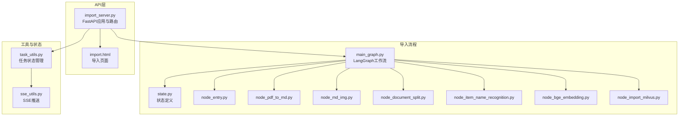
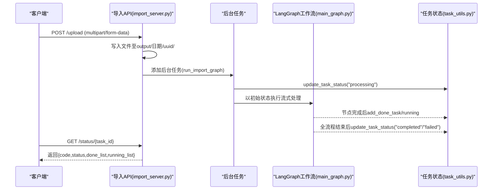
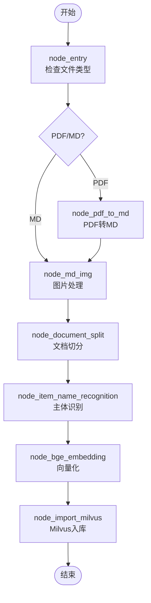
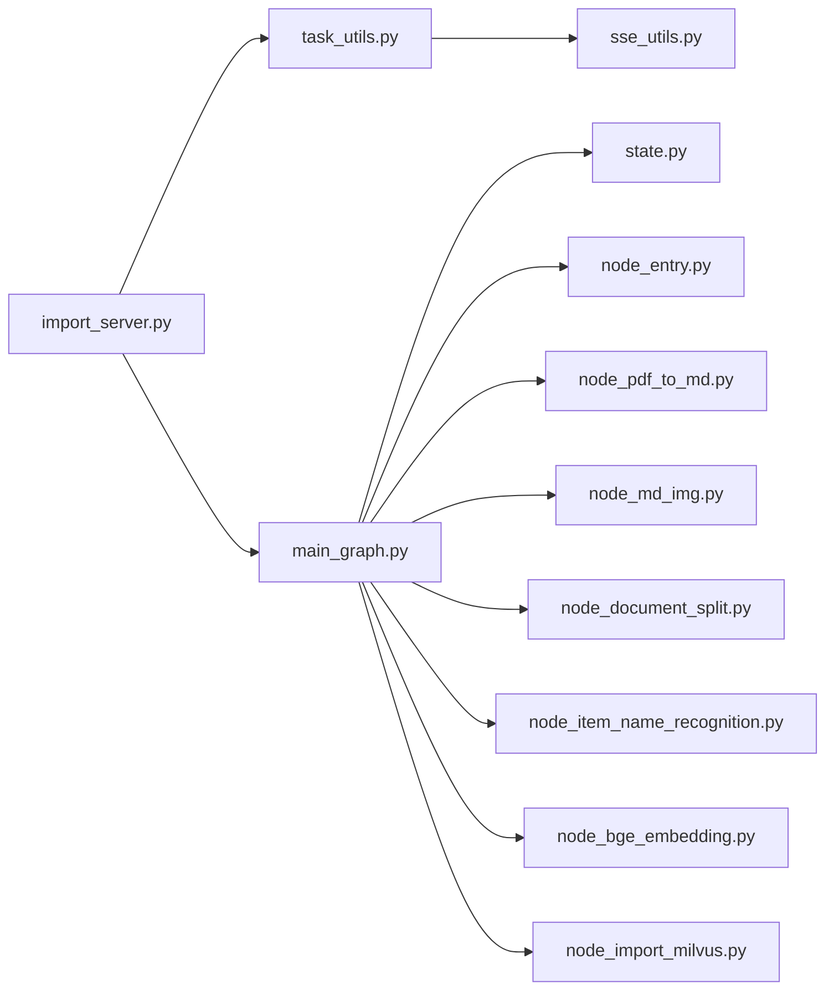

# 导入API接口

<cite>
**本文引用的文件**
- [import_server.py](file://app/import_process/api/import_server.py)
- [import.html](file://app/import_process/page/import.html)
- [task_utils.py](file://app/utils/task_utils.py)
- [main_graph.py](file://app/import_process/agent/main_graph.py)
- [state.py](file://app/import_process/agent/state.py)
- [node_entry.py](file://app/import_process/agent/nodes/node_entry.py)
- [node_pdf_to_md.py](file://app/import_process/agent/nodes/node_pdf_to_md.py)
- [node_md_img.py](file://app/import_process/agent/nodes/node_md_img.py)
- [node_document_split.py](file://app/import_process/agent/nodes/node_document_split.py)
- [node_item_name_recognition.py](file://app/import_process/agent/nodes/node_item_name_recognition.py)
- [node_bge_embedding.py](file://app/import_process/agent/nodes/node_bge_embedding.py)
- [node_import_milvus.py](file://app/import_process/agent/nodes/node_import_milvus.py)
- [sse_utils.py](file://app/utils/sse_utils.py)
</cite>

## 目录
1. [简介](#简介)
2. [项目结构](#项目结构)
3. [核心组件](#核心组件)
4. [架构总览](#架构总览)
5. [详细组件分析](#详细组件分析)
6. [依赖分析](#依赖分析)
7. [性能考量](#性能考量)
8. [故障排查指南](#故障排查指南)
9. [结论](#结论)
10. [附录](#附录)

## 简介
本文档面向RAG Agent的导入API接口，涵盖以下能力：
- 文件上传接口：POST /upload，支持多文件上传，返回任务ID列表并异步执行导入流程
- 任务状态查询接口：GET /status/{task_id}，轮询获取任务全局状态与节点执行清单
- 导入页面接口：GET /import，提供前端页面，演示如何调用上传与状态查询接口
- 异步任务处理流程与状态管理机制：基于内存态任务追踪与LangGraph工作流
- 错误处理与最佳实践：包括常见错误码、轮询策略、前端集成要点与性能优化建议

## 项目结构
导入API位于导入流程模块中，核心文件组织如下：
- API层：FastAPI应用、路由与接口实现
- 导入流程：LangGraph工作流与节点实现
- 工具与状态：任务状态管理、SSE推送、路径与配置工具
- 前端页面：导入页面，演示上传与轮询

图表来源
- [import_server.py:1-172](file://app/import_process/api/import_server.py#L1-L172)
- [import.html:1-351](file://app/import_process/page/import.html#L1-L351)
- [main_graph.py:1-134](file://app/import_process/agent/main_graph.py#L1-L134)
- [state.py:1-99](file://app/import_process/agent/state.py#L1-L99)
- [task_utils.py:1-187](file://app/utils/task_utils.py#L1-L187)
- [sse_utils.py:1-108](file://app/utils/sse_utils.py#L1-L108)

章节来源
- [import_server.py:1-172](file://app/import_process/api/import_server.py#L1-L172)
- [import.html:1-351](file://app/import_process/page/import.html#L1-L351)
- [main_graph.py:1-134](file://app/import_process/agent/main_graph.py#L1-L134)
- [state.py:1-99](file://app/import_process/agent/state.py#L1-L99)
- [task_utils.py:1-187](file://app/utils/task_utils.py#L1-L187)
- [sse_utils.py:1-108](file://app/utils/sse_utils.py#L1-L108)

## 核心组件
- FastAPI应用与路由
  - 跨域中间件配置
  - 导入页面路由：GET /import
  - 文件上传路由：POST /upload
  - 任务状态查询路由：GET /status/{task_id}
- LangGraph导入工作流
  - 节点：入口、PDF转MD、MD图片处理、文档切分、主体识别、向量化、Milvus入库
  - 状态：ImportGraphState，承载任务ID、文件路径、中间产物与向量数据
- 任务状态管理
  - 内存态任务追踪：running/done列表与全局状态
  - 中文节点名映射：用于前端展示
  - SSE推送：可扩展为实时进度推送
- 前端导入页面
  - 拖拽/选择文件
  - 上传与轮询状态
  - 展示日志与进度

章节来源
- [import_server.py:27-171](file://app/import_process/api/import_server.py#L27-L171)
- [main_graph.py:19-65](file://app/import_process/agent/main_graph.py#L19-L65)
- [state.py:5-90](file://app/import_process/agent/state.py#L5-L90)
- [task_utils.py:4-187](file://app/utils/task_utils.py#L4-L187)
- [import.html:162-351](file://app/import_process/page/import.html#L162-L351)

## 架构总览
导入API采用“同步上传 + 异步处理”的设计：
- 客户端调用POST /upload，服务端立即返回任务ID列表，并在后台任务中执行LangGraph导入流程
- 客户端轮询GET /status/{task_id}，获取任务全局状态与已完成/进行中节点列表
- 导入流程由LangGraph串联多个节点，每个节点在执行前后更新任务状态

图表来源
- [import_server.py:98-138](file://app/import_process/api/import_server.py#L98-L138)
- [import_server.py:146-166](file://app/import_process/api/import_server.py#L146-L166)
- [main_graph.py:65-65](file://app/import_process/agent/main_graph.py#L65-L65)
- [task_utils.py:161-179](file://app/utils/task_utils.py#L161-L179)

## 详细组件分析

### 文件上传接口：POST /upload
- 请求方式与路径
  - 方法：POST
  - 路径：/upload
- 请求参数
  - Content-Type：multipart/form-data
  - 参数：files（UploadFile，支持多文件）
- 处理流程
  - 生成任务ID（UUID）
  - 在output/年月日/uuid/目录下保存上传文件
  - 异步调用run_import_graph执行LangGraph导入流程
  - 记录节点“upload_file”为已完成
- 响应格式
  - JSON对象，包含：
    - code：200
    - message：描述信息
    - task_ids：任务ID数组（与上传文件一一对应）

请求示例（curl）
- curl -X POST "http://127.0.0.1:8000/upload" -F "files=@/path/to/file1.pdf" -F "files=@/path/to/file2.md"

响应示例
- {
  "code": 200,
  "message": "完成了文件上传，并开启了异步任务！文件数量为: 2",
  "task_ids": ["a1b2c3d4-e5f6-7890-abcd-ef1234567890", "b2c3d4e5-f678-9012-cdef-1234567890ab"]
}

章节来源
- [import_server.py:98-138](file://app/import_process/api/import_server.py#L98-L138)

### 任务状态查询接口：GET /status/{task_id}
- 请求方式与路径
  - 方法：GET
  - 路径：/status/{task_id}
- 路径参数
  - task_id：任务ID（由POST /upload返回）
- 响应格式
  - JSON对象，包含：
    - code：200
    - task_id：任务ID
    - status：任务全局状态（pending/processing/completed/failed）
    - done_list：已完成节点列表（中文展示）
    - running_list：进行中节点列表（中文展示）
- 状态码
  - 200：查询成功
  - 404：导入页面不存在（仅影响GET /import）
- 轮询策略
  - 建议：每2秒轮询一次
  - 当status为completed或failed时停止轮询
  - 前端示例：import.html中使用setInterval(2000)轮询

请求示例（curl）
- curl "http://127.0.0.1:8000/status/a1b2c3d4-e5f6-7890-abcd-ef1234567890"

响应示例
- {
  "code": 200,
  "task_id": "a1b2c3d4-e5f6-7890-abcd-ef1234567890",
  "status": "processing",
  "done_list": ["开始上传文件"],
  "running_list": ["检查文件", "PDF转Markdown"]
}

章节来源
- [import_server.py:146-166](file://app/import_process/api/import_server.py#L146-L166)
- [import.html:315-346](file://app/import_process/page/import.html#L315-L346)

### 导入页面接口：GET /import
- 请求方式与路径
  - 方法：GET
  - 路径：/import
- 功能
  - 返回导入页面HTML，内置拖拽上传、文件列表、进度条与日志展示
  - 页面脚本演示调用POST /upload与GET /status/{task_id}
- 前端集成要点
  - 通过FormData上传文件
  - 上传成功后轮询status接口
  - 根据done_list/running_list渲染日志与进度

章节来源
- [import_server.py:44-50](file://app/import_process/api/import_server.py#L44-L50)
- [import.html:162-351](file://app/import_process/page/import.html#L162-L351)

### 异步任务处理流程与状态管理
- LangGraph工作流
  - 节点顺序：node_entry → node_pdf_to_md 或 node_md_img → node_document_split → node_item_name_recognition → node_bge_embedding → node_import_milvus → END
  - 节点执行时通过add_running_task/add_done_task更新任务状态
- 任务状态管理
  - 全局状态：pending/processing/completed/failed
  - 节点列表：done_list/running_list（中文名映射）
  - SSE推送：task_push_queue可将进度推送到SSE会话

图表来源
- [main_graph.py:30-62](file://app/import_process/agent/main_graph.py#L30-L62)
- [node_entry.py:10-59](file://app/import_process/agent/nodes/node_entry.py#L10-L59)
- [node_pdf_to_md.py:260-305](file://app/import_process/agent/nodes/node_pdf_to_md.py#L260-L305)
- [node_md_img.py:310-358](file://app/import_process/agent/nodes/node_md_img.py#L310-L358)
- [node_document_split.py:262-300](file://app/import_process/agent/nodes/node_document_split.py#L262-L300)
- [node_item_name_recognition.py:252-287](file://app/import_process/agent/nodes/node_item_name_recognition.py#L252-L287)
- [node_bge_embedding.py:10-84](file://app/import_process/agent/nodes/node_bge_embedding.py#L10-L84)
- [node_import_milvus.py:114-149](file://app/import_process/agent/nodes/node_import_milvus.py#L114-L149)

章节来源
- [main_graph.py:19-65](file://app/import_process/agent/main_graph.py#L19-L65)
- [task_utils.py:68-110](file://app/utils/task_utils.py#L68-L110)
- [task_utils.py:161-179](file://app/utils/task_utils.py#L161-L179)

## 依赖分析
- 组件耦合
  - API层依赖任务状态管理与LangGraph工作流
  - LangGraph节点依赖状态与工具模块
  - 任务状态管理依赖SSE推送（可选）
- 外部依赖
  - FastAPI、uvicorn（Web框架）
  - MinIO、Milvus（对象存储与向量数据库）
  - BGE-M3嵌入模型（向量化）
  - MinERU（PDF转MD服务）
- 潜在风险
  - 内存态任务状态仅适用于单进程，生产环境需持久化
  - PDF转MD依赖第三方服务，需考虑超时与重试

图表来源
- [import_server.py:14-24](file://app/import_process/api/import_server.py#L14-L24)
- [task_utils.py:1-3](file://app/utils/task_utils.py#L1-L3)
- [main_graph.py:1-17](file://app/import_process/agent/main_graph.py#L1-L17)

章节来源
- [import_server.py:1-25](file://app/import_process/api/import_server.py#L1-L25)
- [task_utils.py:1-3](file://app/utils/task_utils.py#L1-L3)
- [main_graph.py:1-17](file://app/import_process/agent/main_graph.py#L1-L17)

## 性能考量
- 上传与I/O
  - 上传文件写入磁盘，建议使用SSD与合适的磁盘空间规划
- LangGraph节点
  - PDF转MD与向量化为IO密集型，注意并发与超时控制
  - 文档切分与向量化支持批处理，建议合理设置批大小
- 任务状态
  - 内存态状态适合轻量场景，建议结合持久化方案（如Redis/MongoDB）以支持多实例部署
- SSE推送
  - SSE适用于实时进度，但需关注连接数与队列积压

## 故障排查指南
- 常见错误与定位
  - 404：/import页面不存在（检查文件路径）
  - 上传失败：检查文件类型与路径权限
  - 状态查询异常：确认task_id正确且任务仍在内存态中
- 节点异常
  - PDF转MD：检查MinERU服务连通性与鉴权
  - 向量化：检查嵌入模型服务与批大小
  - Milvus入库：检查集合创建、索引与连接参数
- 建议
  - 前端轮询间隔建议2秒，避免频繁请求
  - 在节点执行前后记录日志，便于定位问题
  - 对关键节点增加重试与超时控制

章节来源
- [import_server.py:44-50](file://app/import_process/api/import_server.py#L44-L50)
- [node_pdf_to_md.py:96-181](file://app/import_process/agent/nodes/node_pdf_to_md.py#L96-L181)
- [node_bge_embedding.py:27-84](file://app/import_process/agent/nodes/node_bge_embedding.py#L27-L84)
- [node_import_milvus.py:127-149](file://app/import_process/agent/nodes/node_import_milvus.py#L127-L149)

## 结论
导入API提供了简洁高效的文件导入与状态查询能力，结合LangGraph工作流实现了从PDF/MD解析、切分、向量化到Milvus入库的完整链路。通过内存态任务状态与前端轮询，用户可快速集成并获得良好的体验。生产环境中建议引入持久化存储、SSE推送与完善的错误处理机制，以提升稳定性与可观测性。

## 附录

### 请求与响应示例（摘要）
- POST /upload
  - 请求：multipart/form-data，files参数
  - 响应：包含code、message、task_ids
- GET /status/{task_id}
  - 响应：包含code、task_id、status、done_list、running_list

### 最佳实践
- 前端轮询策略：每2秒一次，完成后停止
- 错误处理：对404、5xx进行友好提示与重试
- 并发控制：限制同时上传文件数量，避免磁盘与网络瓶颈
- 日志与监控：记录关键节点开始/结束与异常堆栈，便于问题定位