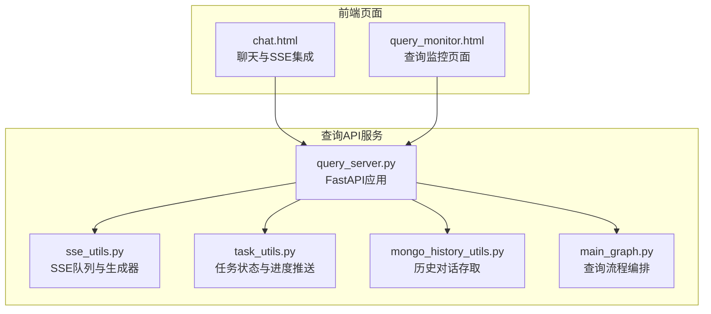
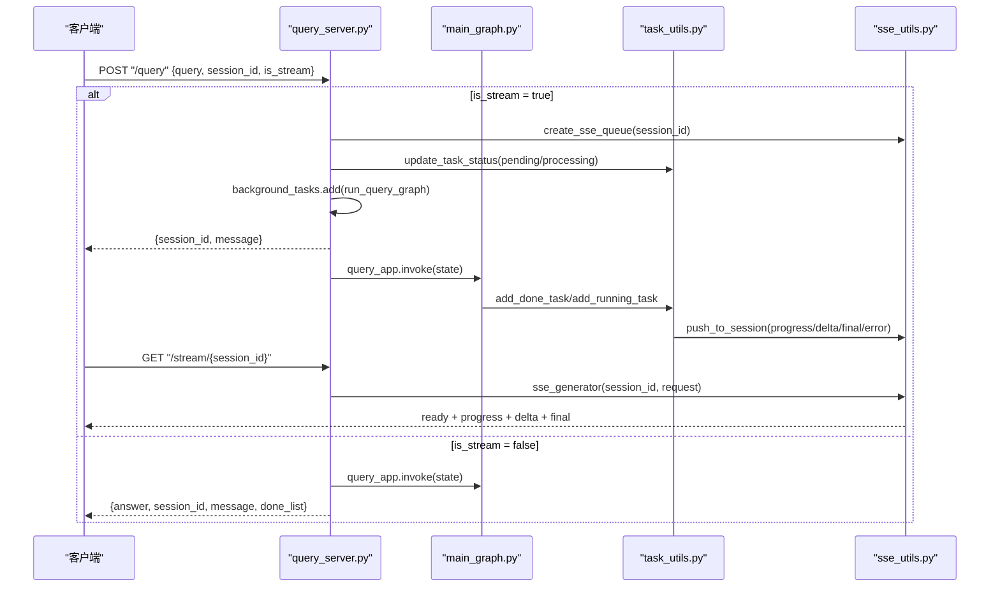
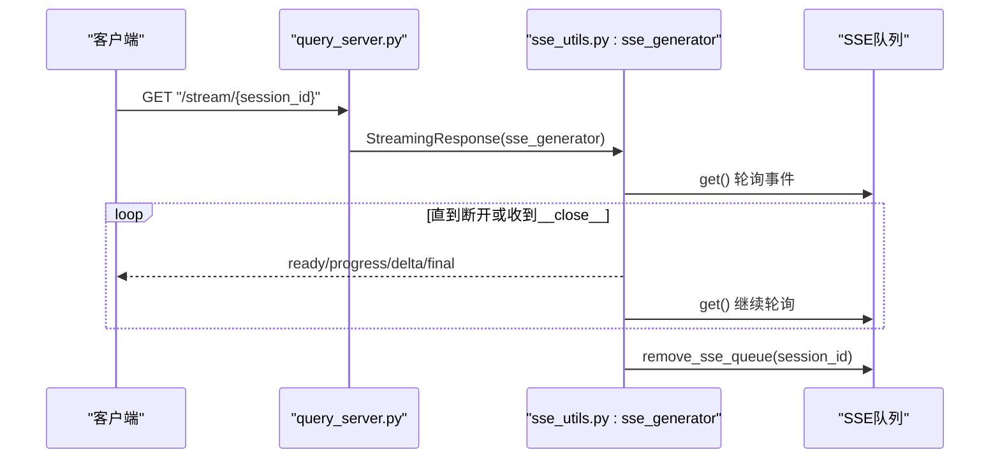
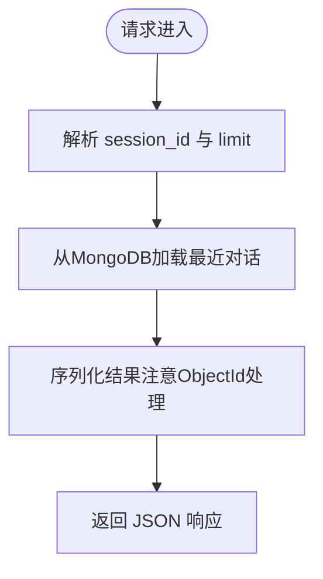
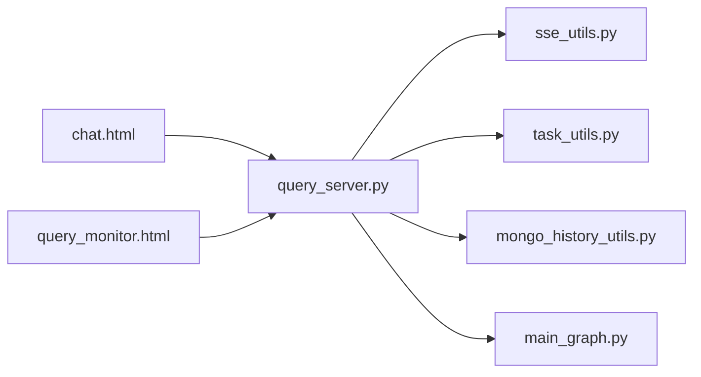

# 查询API接口

<cite>
**本文档引用的文件**
- [query_server.py](file://app/query_process/api/query_server.py)
- [sse_utils.py](file://app/utils/sse_utils.py)
- [task_utils.py](file://app/utils/task_utils.py)
- [mongo_history_utils.py](file://app/clients/mongo_history_utils.py)
- [main_graph.py](file://app/query_process/agent/main_graph.py)
- [chat.html](file://app/query_process/page/chat.html)
- [query_monitor.html](file://app/query_process/page/query_monitor.html)
</cite>

## 目录
1. [简介](#简介)
2. [项目结构](#项目结构)
3. [核心组件](#核心组件)
4. [架构总览](#架构总览)
5. [详细组件分析](#详细组件分析)
6. [依赖关系分析](#依赖关系分析)
7. [性能考虑](#性能考虑)
8. [故障排查指南](#故障排查指南)
9. [结论](#结论)
10. [附录](#附录)

## 简介
本文件面向RAG Agent的查询API接口，提供完整的技术文档，覆盖以下方面：
- 问答接口的HTTP方法、URL模式、请求参数与响应格式
- 实时流式响应（Server-Sent Events，SSE）的连接处理、消息格式与事件类型
- 历史查询接口与历史清理接口的使用方法
- 查询监控接口的使用方法（前端页面）
- SSE流式传输协议规范、客户端集成示例与错误处理策略
- 查询性能优化建议与并发处理注意事项

## 项目结构
查询API位于应用的查询处理模块中，主要由FastAPI服务、SSE工具、任务状态管理、历史记录工具与前端页面组成。

**图表来源**
- [query_server.py:1-164](file://app/query_process/api/query_server.py#L1-L164)
- [sse_utils.py:1-108](file://app/utils/sse_utils.py#L1-L108)
- [task_utils.py:1-187](file://app/utils/task_utils.py#L1-L187)
- [mongo_history_utils.py:1-242](file://app/clients/mongo_history_utils.py#L1-L242)
- [main_graph.py:1-47](file://app/query_process/agent/main_graph.py#L1-L47)
- [chat.html:1-896](file://app/query_process/page/chat.html#L1-L896)
- [query_monitor.html:1-142](file://app/query_process/page/query_monitor.html#L1-L142)

**章节来源**
- [query_server.py:1-164](file://app/query_process/api/query_server.py#L1-L164)
- [chat.html:1-896](file://app/query_process/page/chat.html#L1-L896)
- [query_monitor.html:1-142](file://app/query_process/page/query_monitor.html#L1-L142)

## 核心组件
- FastAPI查询服务：提供健康检查、页面返回、发起查询、SSE流式输出、历史查询与清理等接口。
- SSE工具：维护每个会话的事件队列，封装SSE事件打包与生成器。
- 任务状态管理：维护任务状态、完成/运行节点列表，并在流式场景推送进度事件。
- 历史记录工具：基于MongoDB的会话历史存取与清理。
- 查询流程编排：LangGraph定义的查询节点与路由。

**章节来源**
- [query_server.py:1-164](file://app/query_process/api/query_server.py#L1-L164)
- [sse_utils.py:1-108](file://app/utils/sse_utils.py#L1-L108)
- [task_utils.py:1-187](file://app/utils/task_utils.py#L1-L187)
- [mongo_history_utils.py:1-242](file://app/clients/mongo_history_utils.py#L1-L242)
- [main_graph.py:1-47](file://app/query_process/agent/main_graph.py#L1-L47)

## 架构总览
查询API采用同步/异步双模式：
- 同步模式：直接执行查询流程，完成后一次性返回答案。
- 异步/流式模式：后台异步执行，通过SSE逐步推送进度与增量回答。

**图表来源**
- [query_server.py:48-160](file://app/query_process/api/query_server.py#L48-L160)
- [main_graph.py:12-47](file://app/query_process/agent/main_graph.py#L12-L47)
- [task_utils.py:68-179](file://app/utils/task_utils.py#L68-L179)
- [sse_utils.py:54-108](file://app/utils/sse_utils.py#L54-L108)

## 详细组件分析

### 问答接口（POST /query）
- 方法与URL：POST /query
- 请求体参数（JSON）：
  - query: string，必填，查询内容
  - session_id: string，可选，会话ID；未提供时由后端生成UUID
  - is_stream: boolean，默认false，是否启用流式返回
- 响应：
  - 同步模式：返回answer、session_id、message、done_list
  - 异步模式：立即返回session_id与处理中提示，后台继续推进流程并通过SSE推送结果
- 控制流要点：
  - is_stream=true时，创建SSE队列并异步执行查询图
  - is_stream=false时，同步执行并返回最终答案

**章节来源**
- [query_server.py:48-113](file://app/query_process/api/query_server.py#L48-L113)
- [task_utils.py:161-179](file://app/utils/task_utils.py#L161-L179)

### SSE流式输出（GET /stream/{session_id}）
- 方法与URL：GET /stream/{session_id}
- 功能：建立SSE长连接，向客户端推送事件
- 事件类型（SSEEvent）：
  - ready：连接建立通知
  - progress：任务节点进度（包含status、done_list、running_list）
  - delta：LLM增量输出
  - final：最终完整答案
  - error：错误信息
  - __close__：内部关闭信号
- 协议细节：
  - 消息格式：每条事件为“event: <type>\ndata: <JSON>\n\n”
  - 断连检测：通过request.is_disconnected()及时退出
  - 队列轮询：使用run_in_executor避免阻塞事件循环
- 客户端集成要点：
  - 使用浏览器EventSource连接
  - 监听progress/delta/final事件，按事件类型更新UI
  - 在progress事件中，当状态变为completed时可提前结束“输入中”动画

**图表来源**
- [query_server.py:115-126](file://app/query_process/api/query_server.py#L115-L126)
- [sse_utils.py:54-108](file://app/utils/sse_utils.py#L54-L108)

**章节来源**
- [query_server.py:115-126](file://app/query_process/api/query_server.py#L115-L126)
- [sse_utils.py:8-15](file://app/utils/sse_utils.py#L8-L15)
- [sse_utils.py:54-108](file://app/utils/sse_utils.py#L54-L108)

### 历史查询与清理接口
- 历史查询（GET /history/{session_id}）
  - 参数：session_id（路径）、limit（查询条数，默认10）
  - 响应：session_id与items（历史对话列表）
- 历史清理（DELETE /history/{session_id}）
  - 响应：deleted_count与消息

**图表来源**
- [query_server.py:129-160](file://app/query_process/api/query_server.py#L129-L160)
- [mongo_history_utils.py:193-221](file://app/clients/mongo_history_utils.py#L193-L221)

**章节来源**
- [query_server.py:129-160](file://app/query_process/api/query_server.py#L129-L160)
- [mongo_history_utils.py:87-106](file://app/clients/mongo_history_utils.py#L87-L106)
- [mongo_history_utils.py:193-221](file://app/clients/mongo_history_utils.py#L193-L221)

### 查询监控接口（前端页面）
- 页面：query_monitor.html
- 功能：展示查询统计、按会话过滤、详情查看
- 接口使用：
  - 列表：GET /query/monitor/recent?limit=200
  - 详情：GET /query/monitor/{sessionId}

**章节来源**
- [query_monitor.html:96-139](file://app/query_process/page/query_monitor.html#L96-L139)

### 健康检查与页面接口
- 健康检查：GET /health
- 聊天页面：GET /chat.html

**章节来源**
- [query_server.py:32-45](file://app/query_process/api/query_server.py#L32-L45)

## 依赖关系分析

**图表来源**
- [query_server.py:14-17](file://app/query_process/api/query_server.py#L14-L17)
- [chat.html:687-728](file://app/query_process/page/chat.html#L687-L728)
- [query_monitor.html:96-122](file://app/query_process/page/query_monitor.html#L96-L122)

**章节来源**
- [query_server.py:14-17](file://app/query_process/api/query_server.py#L14-L17)
- [chat.html:687-728](file://app/query_process/page/chat.html#L687-L728)
- [query_monitor.html:96-122](file://app/query_process/page/query_monitor.html#L96-L122)

## 性能考虑
- SSE轮询与阻塞规避
  - 使用run_in_executor避免阻塞事件循环，降低延迟抖动
  - 队列轮询设置超时，避免长时间阻塞
- 任务状态与进度推送
  - 仅在状态变化或节点变更时推送progress，减少冗余事件
- 数据库存取
  - 历史查询按session_id+ts复合索引查询，limit控制返回量
- 并发与资源清理
  - 生成器断连时及时清理SSE队列，避免内存泄漏
  - 任务结束后清理任务状态与结果存储

**章节来源**
- [sse_utils.py:78-108](file://app/utils/sse_utils.py#L78-L108)
- [task_utils.py:174-179](file://app/utils/task_utils.py#L174-L179)
- [mongo_history_utils.py:45-48](file://app/clients/mongo_history_utils.py#L45-L48)
- [query_server.py:75-76](file://app/query_process/api/query_server.py#L75-L76)

## 故障排查指南
- SSE连接问题
  - 检查session_id是否存在对应队列；若无队列，生成器会直接结束
  - 观察客户端断连日志，确认是否因网络中断导致连接丢失
- 错误事件推送
  - 当查询流程异常时，会推送error事件；客户端应显示错误并允许重试
- 历史查询异常
  - MongoDB连接失败或查询异常时返回空列表；检查环境变量与连接地址
- 前端集成问题
  - 确认EventSource监听的事件类型与数据结构一致
  - 在progress事件中，当状态为completed时及时停止“输入中”动画

**章节来源**
- [sse_utils.py:60-63](file://app/utils/sse_utils.py#L60-L63)
- [query_server.py:70-76](file://app/query_process/api/query_server.py#L70-L76)
- [mongo_history_utils.py:52-56](file://app/clients/mongo_history_utils.py#L52-L56)
- [chat.html:772-800](file://app/query_process/page/chat.html#L772-L800)

## 结论
本文档系统梳理了RAG Agent查询API的接口设计、SSE流式协议与前端集成方式，并提供了性能优化与故障排查建议。通过同步/异步双模式与完善的事件推送机制，系统能够兼顾交互体验与后端吞吐能力。

## 附录

### API一览表
- GET /health：健康检查
- GET /chat.html：返回聊天页面
- POST /query：发起查询
- GET /stream/{session_id}：SSE流式输出
- GET /history/{session_id}：查询历史对话
- DELETE /history/{session_id}：清理历史对话
- GET /query/monitor/recent?limit=200：查询监控列表（前端页面使用）
- GET /query/monitor/{sessionId}：查询监控详情（前端页面使用）

**章节来源**
- [query_server.py:32-160](file://app/query_process/api/query_server.py#L32-L160)
- [query_monitor.html:96-122](file://app/query_process/page/query_monitor.html#L96-L122)