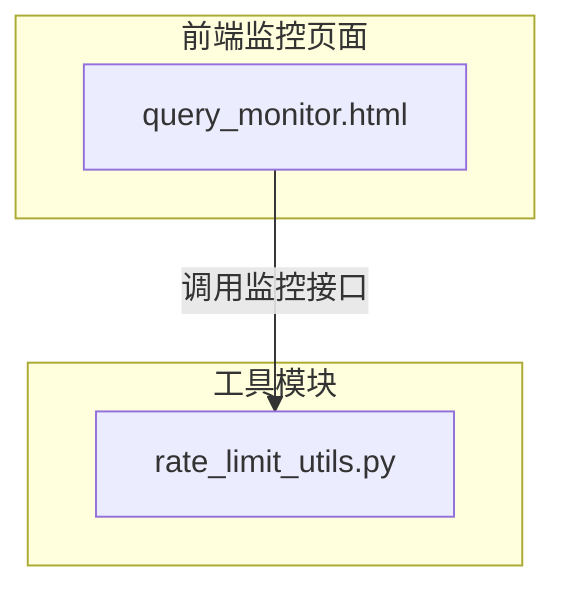
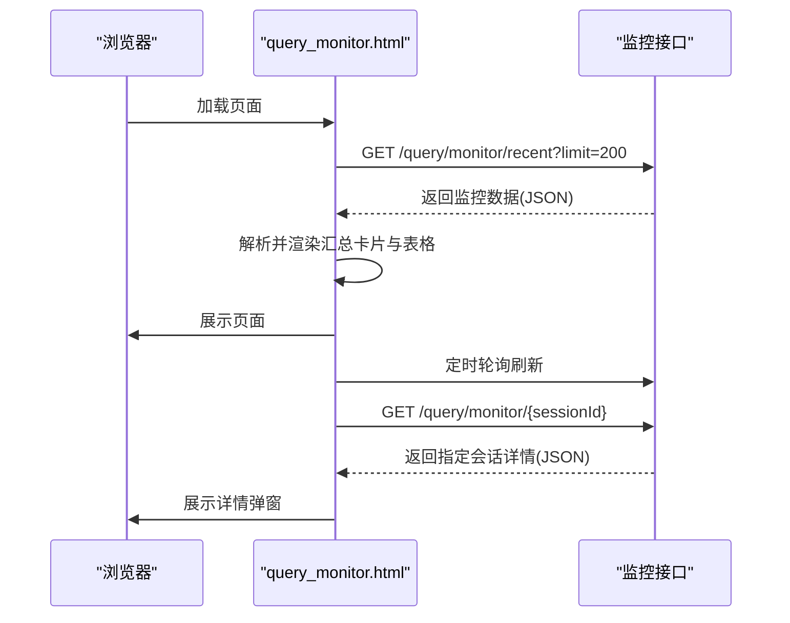
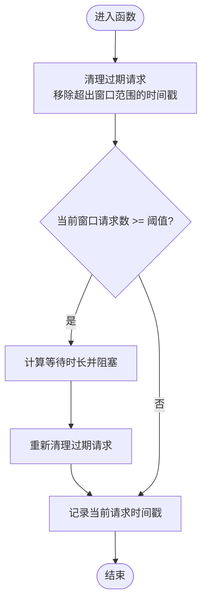
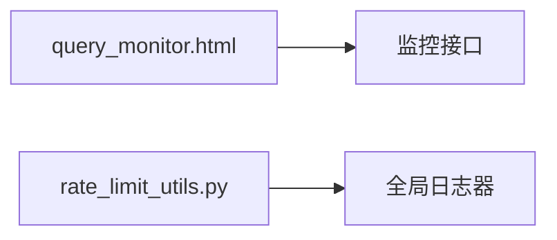

# 监控API接口

<cite>
**本文档引用的文件**
- [query_monitor.html](file://app/query_process/page/query_monitor.html)
- [rate_limit_utils.py](file://app/utils/rate_limit_utils.py)
</cite>

## 目录
1. [简介](#简介)
2. [项目结构](#项目结构)
3. [核心组件](#核心组件)
4. [架构概览](#架构概览)
5. [详细组件分析](#详细组件分析)
6. [依赖关系分析](#依赖关系分析)
7. [性能考虑](#性能考虑)
8. [故障排查指南](#故障排查指南)
9. [结论](#结论)
10. [附录](#附录)

## 简介
本文件面向RAG Agent的监控API接口，聚焦于查询流程的运行状态监控、性能指标查询、错误日志获取与系统健康检查等能力。基于现有代码库中的查询监控页面与速率限制工具，本文档梳理了监控接口的调用方式、参数与响应字段，并给出可视化展示、告警配置建议、最佳实践与故障排查指引。

## 项目结构
与监控API相关的核心位置如下：
- 前端监控页面位于查询流程页面目录，负责拉取监控数据并进行可视化展示
- 速率限制工具用于控制对外部服务的调用频率，间接影响查询性能与稳定性

图表来源
- [query_monitor.html:73-138](file://app/query_process/page/query_monitor.html#L73-L138)
- [rate_limit_utils.py:1-37](file://app/utils/rate_limit_utils.py#L1-L37)

章节来源
- [query_monitor.html:1-142](file://app/query_process/page/query_monitor.html#L1-L142)
- [rate_limit_utils.py:1-37](file://app/utils/rate_limit_utils.py#L1-L37)

## 核心组件
- 查询监控页面（query_monitor.html）：提供最近查询任务的汇总统计与列表展示，支持按关键词过滤与定时刷新；通过HTTP接口获取监控数据并渲染到页面。
- 速率限制工具（rate_limit_utils.py）：提供滑动窗口式的API速率限制能力，用于控制对外部服务的调用频率，保障系统稳定性和合规性。

章节来源
- [query_monitor.html:49-138](file://app/query_process/page/query_monitor.html#L49-L138)
- [rate_limit_utils.py:7-37](file://app/utils/rate_limit_utils.py#L7-L37)

## 架构概览
下图展示了监控页面与后端接口之间的交互关系，以及页面侧的数据处理流程。

图表来源
- [query_monitor.html:96-138](file://app/query_process/page/query_monitor.html#L96-L138)

章节来源
- [query_monitor.html:73-138](file://app/query_process/page/query_monitor.html#L73-L138)

## 详细组件分析

### 查询监控页面（query_monitor.html）
- 功能概述
  - 汇总展示：总请求、成功、失败、处理中、成功率、P95延迟等关键指标
  - 列表展示：按状态、Session ID、问题、延迟、进度、答案长度、更新时间排序
  - 过滤与刷新：支持关键词过滤与定时刷新（默认每3秒）
  - 详情查看：点击“详情”按钮获取指定会话的完整信息（状态、问题、延迟、已完成/运行中节点、错误信息）

- 接口调用
  - 获取最近任务列表：GET /query/monitor/recent?limit=N
  - 获取指定会话详情：GET /query/monitor/{sessionId}

- 参数与响应字段
  - GET /query/monitor/recent?limit=N
    - 路径参数
      - sessionId: 字符串，会话标识
    - 查询参数
      - limit: 整数，返回最近的任务条目数量上限
    - 响应体字段（示例）
      - summary: 对象，包含以下键
        - total: 总请求计数
        - completed: 成功计数
        - failed: 失败计数
        - processing: 处理中计数
        - success_rate: 成功率百分比
        - p95_latency_ms: P95延迟（毫秒）
      - items: 数组，每项包含以下键
        - session_id: 会话标识
        - query: 用户问题文本
        - status: 任务状态（completed/failed/processing）
        - latency_ms: 延迟（毫秒）
        - done_count: 已完成节点数
        - running_count: 正在运行节点数
        - answer_len: 答案文本长度
        - updated_at: 更新时间戳（秒）
  - GET /query/monitor/{sessionId}
    - 路径参数
      - sessionId: 字符串，会话标识
    - 响应体字段（示例）
      - session_id: 会话标识
      - status: 任务状态
      - query: 用户问题
      - latency_ms: 延迟（毫秒）
      - done_list: 已完成节点列表
      - running_list: 正在运行节点列表
      - error: 错误信息（如有）

- 可视化与交互
  - 汇总卡片：实时显示关键指标
  - 表格：支持关键词过滤（问题或Session ID）
  - 定时刷新：默认每3秒刷新一次
  - 详情弹窗：展示节点执行链路与错误信息

章节来源
- [query_monitor.html:49-138](file://app/query_process/page/query_monitor.html#L49-L138)

### 速率限制工具（rate_limit_utils.py）
- 功能概述
  - 提供滑动窗口式API速率限制，防止短时间内过多请求触发第三方服务限流
  - 维护请求时间戳队列，按窗口大小动态清理过期请求
  - 当达到阈值时进行等待，确保在窗口期内不超过最大请求数

- 关键参数
  - request_times: 双端队列，存储请求发生的时间戳
  - max_requests: 窗口内的最大请求数
  - window_seconds: 窗口时长（秒），默认60秒

- 处理逻辑
  - 清理过期请求：移除超出窗口范围的时间戳
  - 判断是否超限：若队列长度达到阈值，则计算剩余等待时间并阻塞
  - 记录当前请求：将当前时间戳加入队列尾部

图表来源
- [rate_limit_utils.py:20-36](file://app/utils/rate_limit_utils.py#L20-L36)

章节来源
- [rate_limit_utils.py:7-37](file://app/utils/rate_limit_utils.py#L7-L37)

## 依赖关系分析
- 页面对接口的依赖
  - query_monitor.html依赖后端提供的监控接口以获取任务列表与会话详情
- 工具对日志的依赖
  - rate_limit_utils.py依赖项目全局日志器进行调试输出

图表来源
- [query_monitor.html:96-138](file://app/query_process/page/query_monitor.html#L96-L138)
- [rate_limit_utils.py:4-36](file://app/utils/rate_limit_utils.py#L4-L36)

章节来源
- [query_monitor.html:96-138](file://app/query_process/page/query_monitor.html#L96-L138)
- [rate_limit_utils.py:4-36](file://app/utils/rate_limit_utils.py#L4-L36)

## 性能考虑
- 刷新频率
  - 页面默认每3秒刷新一次，适合实时观测但可能增加后端压力；可根据实际负载调整刷新间隔
- 数据量控制
  - recent接口通过limit参数限制返回条目数量，建议结合业务峰值合理设置
- 速率限制
  - 使用滑动窗口限流可有效避免对外部服务的突发冲击，建议在高频调用场景启用

章节来源
- [query_monitor.html:137-138](file://app/query_process/page/query_monitor.html#L137-L138)
- [rate_limit_utils.py:7-18](file://app/utils/rate_limit_utils.py#L7-L18)

## 故障排查指南
- 页面无法加载或无数据
  - 检查后端监控接口是否可用，确认接口URL与端口正确
  - 查看浏览器网络面板，定位请求失败原因（如404、500等）
- 数据不更新
  - 确认页面定时刷新机制是否正常工作（默认3秒）
  - 检查recent接口的limit参数是否过大导致响应缓慢
- 详情页为空
  - 确认传入的sessionId是否正确且存在
  - 检查后端是否返回了该会话的监控数据
- 性能抖动或延迟升高
  - 检查是否存在大量并发请求，适当降低刷新频率
  - 若涉及外部服务调用，评估并启用速率限制工具以平滑流量
- 日志与告警
  - 页面侧可通过全局日志器输出调试信息，便于定位问题
  - 建议在后端为监控接口增加访问日志与错误日志，配合告警规则（如成功率低于阈值、P95延迟超限）进行自动化通知

章节来源
- [query_monitor.html:96-138](file://app/query_process/page/query_monitor.html#L96-L138)
- [rate_limit_utils.py:29-36](file://app/utils/rate_limit_utils.py#L29-L36)

## 结论
本文档基于现有代码库梳理了查询监控页面与速率限制工具的监控能力与使用方式，明确了监控接口的调用路径、参数与响应字段，并提供了可视化展示、告警配置建议、最佳实践与故障排查指引。后续可在后端完善监控接口的实现细节与数据持久化策略，以支撑更全面的运维监控体系。

## 附录
- 监控数据收集频率与存储策略（建议）
  - 收集频率：根据业务峰值与页面刷新需求设定，建议采用滑动窗口聚合（如1分钟粒度）
  - 存储策略：短期保留最新N条记录（用于页面展示），长期归档历史数据（用于趋势分析与报表）
  - 指标维度：请求总量、成功/失败计数、成功率、延迟分布（含P95）、节点执行进度等
- 告警配置建议
  - 成功率阈值：如连续5分钟平均成功率低于阈值触发告警
  - 延迟阈值：P95延迟持续超过阈值触发告警
  - 异常比例：失败请求占比异常升高触发告警
  - 节点卡顿：特定节点长时间处于运行态触发告警