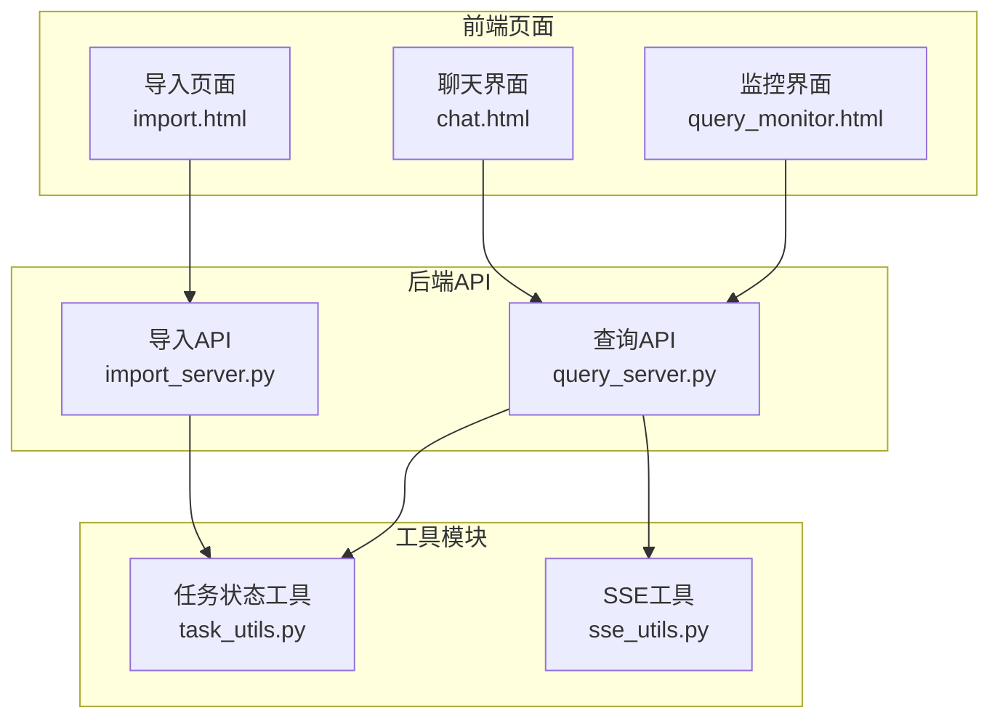
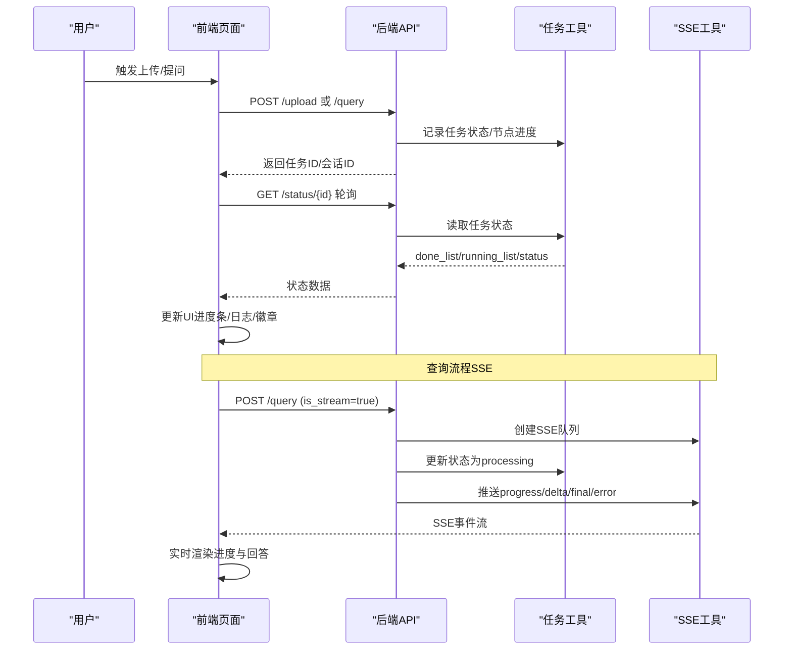
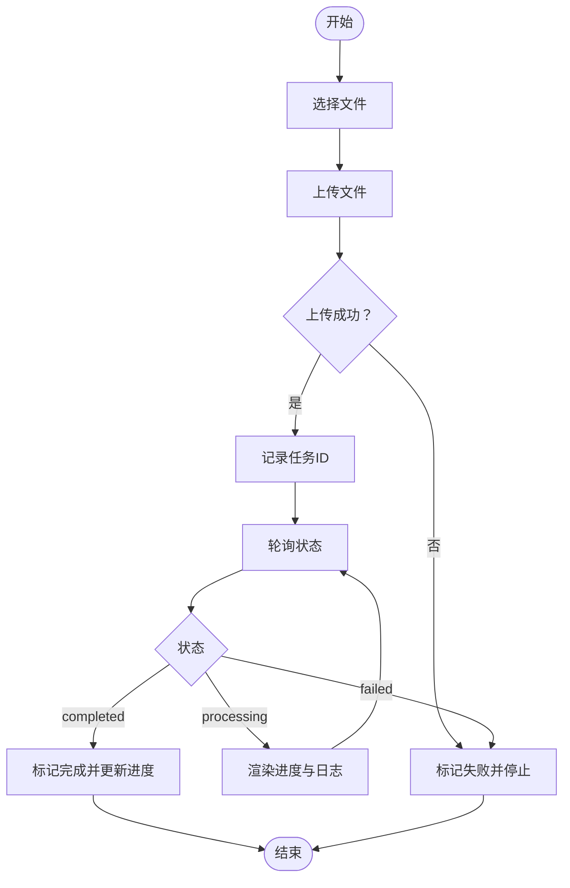
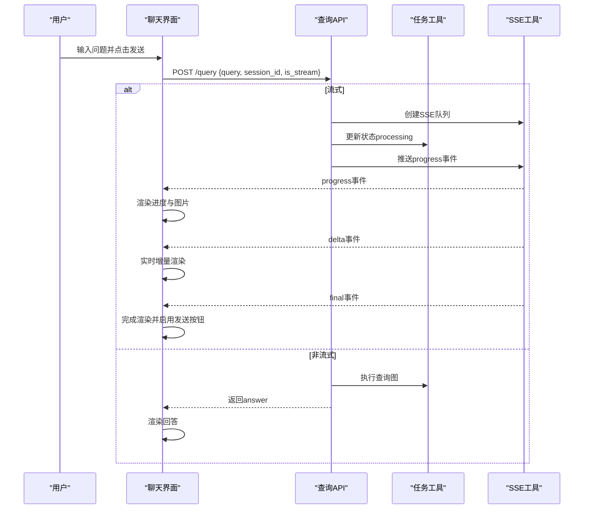
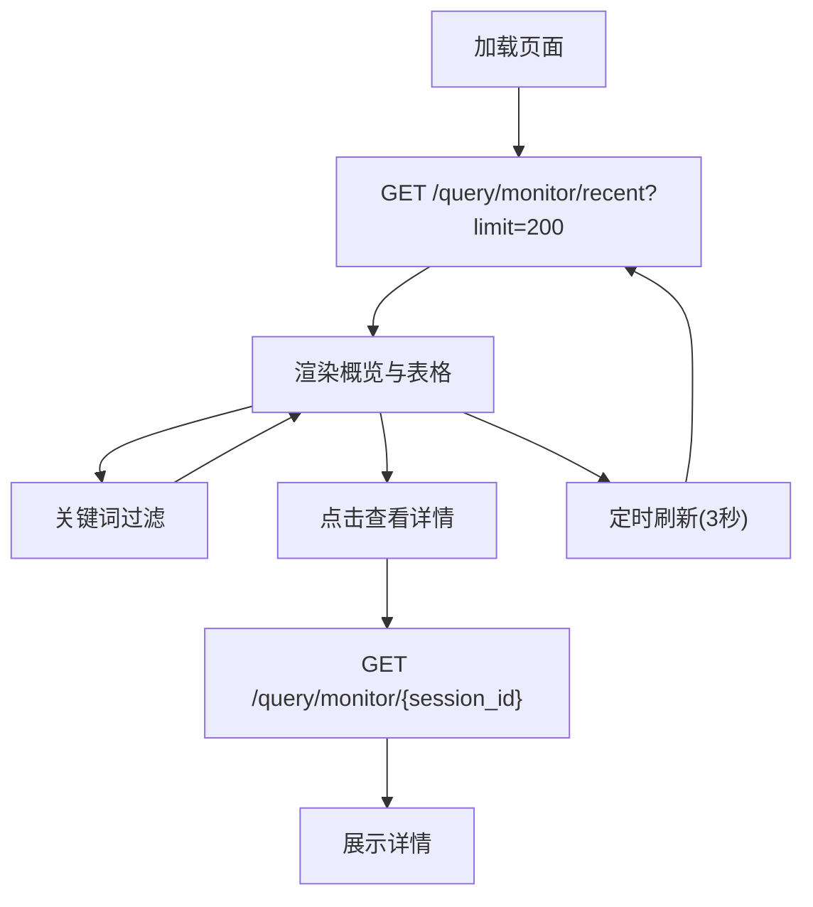
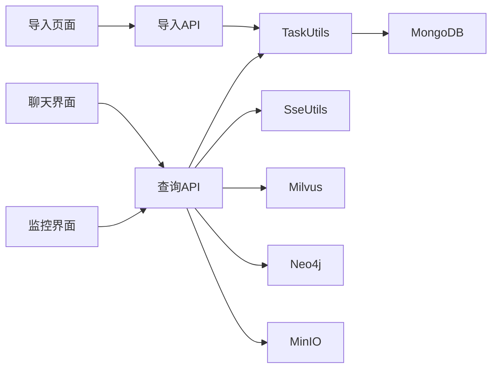

# 前端界面组件

<cite>
**本文档引用的文件**
- [import.html](file://app/import_process/page/import.html)
- [chat.html](file://app/query_process/page/chat.html)
- [query_monitor.html](file://app/query_process/page/query_monitor.html)
- [import_server.py](file://app/import_process/api/import_server.py)
- [query_server.py](file://app/query_process/api/query_server.py)
- [task_utils.py](file://app/utils/task_utils.py)
- [sse_utils.py](file://app/utils/sse_utils.py)
- [CLAUDE.md](file://CLAUDE.md)
</cite>

## 目录
1. [简介](#简介)
2. [项目结构](#项目结构)
3. [核心组件](#核心组件)
4. [架构概览](#架构概览)
5. [详细组件分析](#详细组件分析)
6. [依赖关系分析](#依赖关系分析)
7. [性能考虑](#性能考虑)
8. [故障排查指南](#故障排查指南)
9. [结论](#结论)
10. [附录](#附录)

## 简介
本文件面向前端界面组件，系统性梳理三个核心页面的设计与实现：
- 文件导入页面：支持拖拽/点击上传、进度可视化、日志展示与错误处理
- 聊天界面：问答输入、实时响应显示、历史记录展示与SSE流式输出
- 监控界面：系统状态展示、性能指标可视化与任务管理

文档同时说明前端与后端API的集成方式、数据交互模式、响应式设计与跨浏览器兼容性方案、用户交互优化与无障碍访问支持，以及组件的自定义与扩展指南。

## 项目结构
前端页面位于 `app/import_process/page` 和 `app/query_process/page`，分别对应导入、聊天与监控界面。后端API通过FastAPI提供REST接口与SSE流式输出，任务状态与SSE队列由工具模块维护。

图表来源
- [import.html:1-351](file://app/import_process/page/import.html#L1-L351)
- [chat.html:1-896](file://app/query_process/page/chat.html#L1-L896)
- [query_monitor.html:1-142](file://app/query_process/page/query_monitor.html#L1-L142)
- [import_server.py:1-172](file://app/import_process/api/import_server.py#L1-L172)
- [query_server.py:1-164](file://app/query_process/api/query_server.py#L1-L164)
- [task_utils.py:1-187](file://app/utils/task_utils.py#L1-L187)
- [sse_utils.py:1-108](file://app/utils/sse_utils.py#L1-L108)

章节来源
- [import.html:1-351](file://app/import_process/page/import.html#L1-L351)
- [chat.html:1-896](file://app/query_process/page/chat.html#L1-L896)
- [query_monitor.html:1-142](file://app/query_process/page/query_monitor.html#L1-L142)
- [import_server.py:1-172](file://app/import_process/api/import_server.py#L1-L172)
- [query_server.py:1-164](file://app/query_process/api/query_server.py#L1-L164)
- [task_utils.py:1-187](file://app/utils/task_utils.py#L1-L187)
- [sse_utils.py:1-108](file://app/utils/sse_utils.py#L1-L108)

## 核心组件
- 导入页面组件
  - 上传区域：拖拽/点击触发文件选择
  - 文件列表：逐项展示文件名、大小、进度条与日志
  - 状态徽章：上传中/处理中/已完成/失败
  - 轮询机制：定时查询任务状态，更新UI
- 聊天界面组件
  - 输入区：文本域与发送按钮，支持快捷键
  - 消息气泡：用户消息与机器人回复，支持图片渲染
  - 实时进度：阶段进度展示与SSE流式输出
  - 历史记录：从MongoDB加载与清空
- 监控界面组件
  - 概览卡片：总请求、成功、失败、处理中、成功率、P95延迟
  - 任务表格：按状态筛选、Session过滤、详情查看
  - 自动刷新：定时轮询最新监控数据

章节来源
- [import.html:151-351](file://app/import_process/page/import.html#L151-L351)
- [chat.html:282-896](file://app/query_process/page/chat.html#L282-L896)
- [query_monitor.html:49-142](file://app/query_process/page/query_monitor.html#L49-L142)

## 架构概览
前端通过REST与SSE与后端交互，导入流程采用轮询查询任务状态，查询流程支持SSE流式输出。任务状态与SSE队列在内存中维护，便于快速响应与低延迟展示。

图表来源
- [import_server.py:98-166](file://app/import_process/api/import_server.py#L98-L166)
- [query_server.py:78-126](file://app/query_process/api/query_server.py#L78-L126)
- [task_utils.py:68-179](file://app/utils/task_utils.py#L68-L179)
- [sse_utils.py:54-108](file://app/utils/sse_utils.py#L54-L108)

## 详细组件分析

### 导入页面组件分析
- 设计要点
  - 上传区域：支持拖拽覆盖高亮与点击选择
  - 文件列表：每项包含文件名、大小、进度条、日志详情
  - 状态徽章：不同状态使用不同颜色标识
  - 日志展示：可展开/收起，汇总已完成与进行中节点
- 交互流程
  - 用户选择文件后，构建FormData并POST到上传接口
  - 上传完成后，记录任务ID并启动轮询
  - 轮询接口返回done_list/running_list/status，前端更新UI
  - 错误处理：捕获异常，状态徽章切换为失败
- 数据流
  - 前端：文件选择 → 上传 → 轮询 → 渲染
  - 后端：接收文件 → 异步执行导入图 → 维护任务状态 → 返回状态

图表来源
- [import.html:203-346](file://app/import_process/page/import.html#L203-L346)
- [import_server.py:98-166](file://app/import_process/api/import_server.py#L98-L166)

章节来源
- [import.html:151-351](file://app/import_process/page/import.html#L151-L351)
- [import_server.py:98-166](file://app/import_process/api/import_server.py#L98-L166)

### 聊天界面组件分析
- 设计要点
  - 消息气泡：用户消息右对齐，机器人消息左对齐
  - 图片渲染：从文本中提取URL并懒加载，错误时隐藏
  - 实时进度：阶段进度以details形式展示，支持展开/收起
  - 历史记录：从MongoDB加载，支持清空
  - 快捷键：Enter发送，Shift+Enter换行
- 交互流程
  - 用户输入问题，POST到查询接口
  - 非流式：一次性返回结果
  - 流式：建立SSE连接，接收progress/delta/final事件
  - 轮询：若未使用SSE，前端定时轮询状态接口
  - 历史：加载/清空，本地持久化会话ID
- 数据流
  - 前端：输入 → 提交 → SSE/轮询 → 渲染进度与回答
  - 后端：接收请求 → 异步执行查询图 → SSE推送事件 → 保存历史

图表来源
- [chat.html:687-800](file://app/query_process/page/chat.html#L687-L800)
- [query_server.py:78-126](file://app/query_process/api/query_server.py#L78-L126)
- [task_utils.py:68-179](file://app/utils/task_utils.py#L68-L179)
- [sse_utils.py:54-108](file://app/utils/sse_utils.py#L54-L108)

章节来源
- [chat.html:282-896](file://app/query_process/page/chat.html#L282-L896)
- [query_server.py:78-126](file://app/query_process/api/query_server.py#L78-L126)

### 监控界面组件分析
- 设计要点
  - 概览卡片：总请求、成功、失败、处理中、成功率、P95延迟
  - 任务表格：按状态/关键词过滤，展示Session、问题、延迟、进度、答案长度、更新时间
  - 详情面板：点击“详情”展示状态、问题、延迟、完成/进行中节点、错误信息
- 交互流程
  - 页面加载时拉取最近任务列表
  - 支持手动刷新与定时自动刷新
  - 输入框过滤：按Session或问题关键词筛选
- 数据流
  - 前端：定时请求 → 渲染概览与表格 → 展示详情
  - 后端：聚合统计与最近任务 → 返回summary/items

图表来源
- [query_monitor.html:96-139](file://app/query_process/page/query_monitor.html#L96-L139)
- [query_server.py:1-164](file://app/query_process/api/query_server.py#L1-L164)

章节来源
- [query_monitor.html:49-142](file://app/query_process/page/query_monitor.html#L49-L142)
- [query_server.py:1-164](file://app/query_process/api/query_server.py#L1-L164)

## 依赖关系分析
- 组件耦合
  - 导入页面与查询页面均依赖后端API提供的REST接口与SSE能力
  - 任务状态工具与SSE工具为共享模块，负责维护任务状态与事件队列
- 外部依赖
  - FastAPI提供REST与SSE接口
  - MongoDB用于历史对话存储
  - MinIO用于文件/图片存储
  - Milvus/Neo4j用于向量与知识图谱

图表来源
- [import_server.py:1-172](file://app/import_process/api/import_server.py#L1-L172)
- [query_server.py:1-164](file://app/query_process/api/query_server.py#L1-L164)
- [task_utils.py:1-187](file://app/utils/task_utils.py#L1-L187)
- [sse_utils.py:1-108](file://app/utils/sse_utils.py#L1-L108)
- [CLAUDE.md:103-112](file://CLAUDE.md#L103-L112)

章节来源
- [import_server.py:1-172](file://app/import_process/api/import_server.py#L1-L172)
- [query_server.py:1-164](file://app/query_process/api/query_server.py#L1-L164)
- [task_utils.py:1-187](file://app/utils/task_utils.py#L1-L187)
- [sse_utils.py:1-108](file://app/utils/sse_utils.py#L1-L108)
- [CLAUDE.md:103-112](file://CLAUDE.md#L103-L112)

## 性能考虑
- 轮询策略
  - 导入页面：每2秒轮询一次，平衡实时性与服务器压力
  - 监控界面：每3秒自动刷新，减少频繁请求
- SSE流式输出
  - 查询流程使用SSE，避免轮询带来的延迟与开销
  - 事件类型区分：progress/delta/final/error，前端按需渲染
- 图片懒加载与错误处理
  - 图片采用懒加载与错误回退，提升首屏渲染性能
- 本地存储
  - 会话ID存储于localStorage，避免重复创建会话

## 故障排查指南
- API连通性
  - 聊天界面顶部“API: 未连接/已连接”提示，可通过健康检查接口验证
- 任务状态异常
  - 导入/查询任务状态为failed时，检查后端日志与任务工具状态
  - 确认SSE队列是否存在，事件是否正确推送
- 前端交互问题
  - 检查浏览器控制台是否有网络错误或跨域问题
  - 确认API_BASE地址与后端端口一致
- 图片加载失败
  - 检查URL是否有效，图片存储服务是否可用

章节来源
- [chat.html:656-664](file://app/query_process/page/chat.html#L656-L664)
- [import_server.py:146-166](file://app/import_process/api/import_server.py#L146-L166)
- [query_server.py:31-35](file://app/query_process/api/query_server.py#L31-L35)
- [task_utils.py:161-179](file://app/utils/task_utils.py#L161-L179)
- [sse_utils.py:54-108](file://app/utils/sse_utils.py#L54-L108)

## 结论
该前端界面组件围绕导入、聊天与监控三大场景，采用REST与SSE相结合的方式实现高效的数据交互。通过任务状态工具与SSE工具的内存态维护，实现了低延迟的进度展示与实时回答。整体设计注重用户体验与可维护性，具备良好的扩展空间。

## 附录

### 响应式设计与跨浏览器兼容性
- 响应式布局
  - 使用CSS Grid与Flexbox适配不同屏幕尺寸
  - 最大宽度与高度约束，保证在小屏设备上的可读性
- 跨浏览器兼容
  - 使用标准CSS属性与现代浏览器特性
  - 通过条件判断与降级策略处理旧版浏览器差异

### 用户交互优化与无障碍访问
- 交互优化
  - 快捷键提示与行为一致
  - 按钮禁用状态反馈，避免重复提交
  - 滚动到底部，确保最新消息可见
- 无障碍支持
  - 语义化标签与可访问性属性
  - 键盘导航支持
  - 屏幕阅读器友好

### 前端组件自定义与扩展指南
- 导入页面
  - 新增文件类型支持：修改accept属性与后端校验逻辑
  - 自定义进度条样式：调整CSS变量与动画
  - 扩展日志展示：增加更多节点状态映射
- 聊天界面
  - 新增消息类型：扩展消息气泡与渲染逻辑
  - 自定义SSE事件：新增事件类型与前端处理分支
  - 历史记录扩展：支持更多筛选与排序维度
- 监控界面
  - 新增指标卡片：扩展概览统计字段
  - 表格列扩展：新增列与排序逻辑
  - 详情面板增强：展示更多任务上下文信息