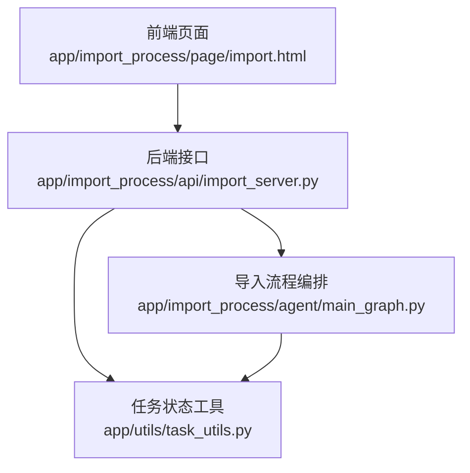
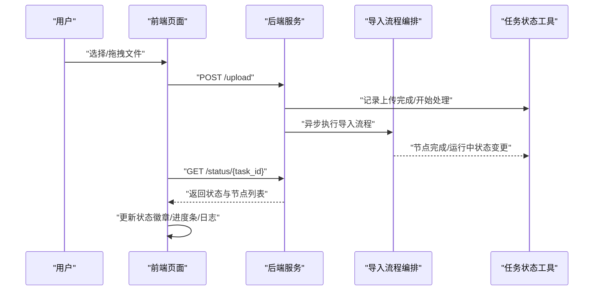
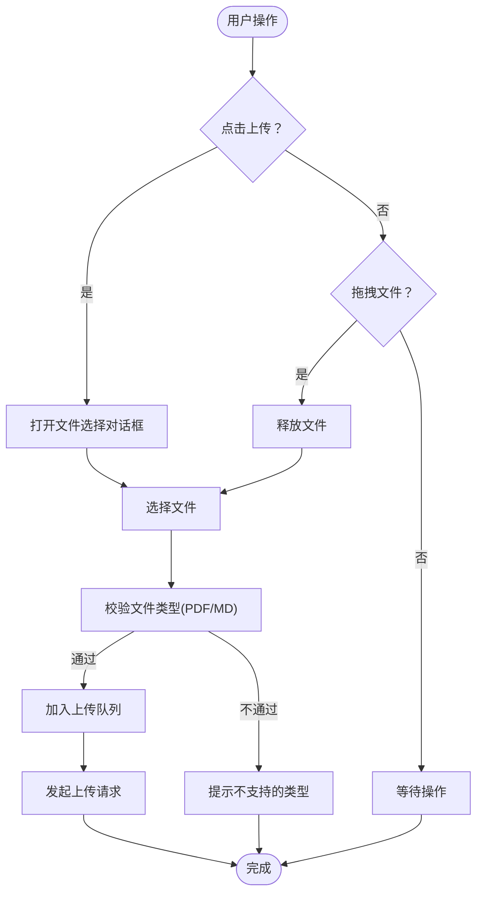
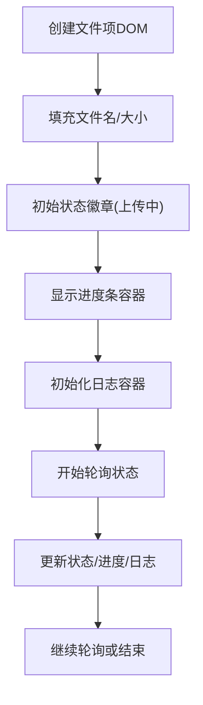
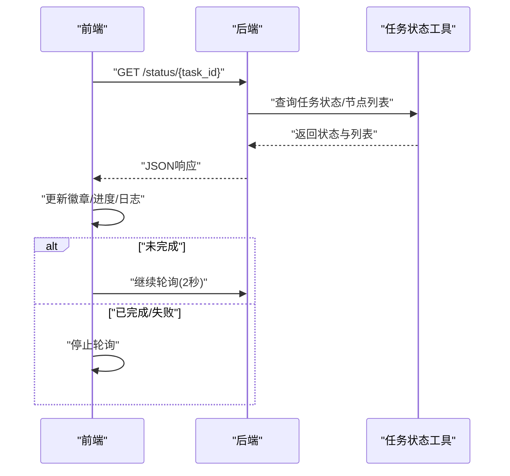
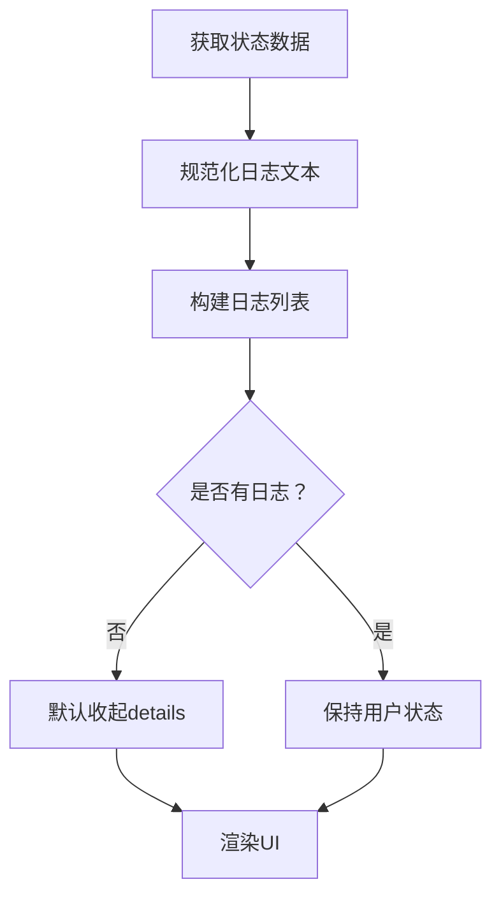
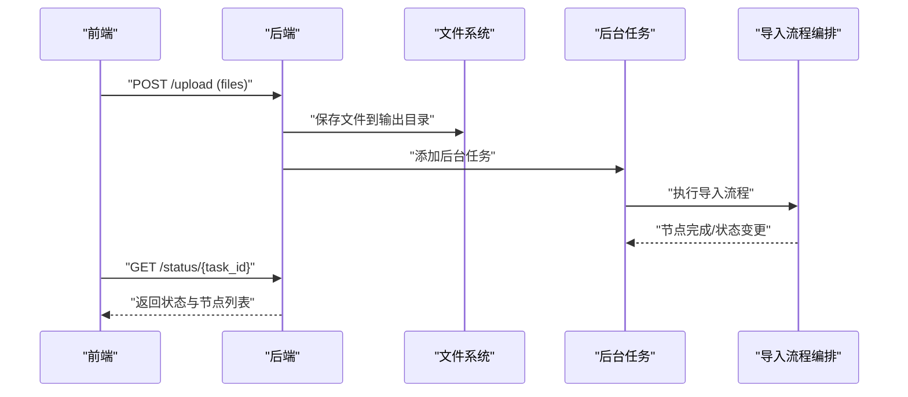

# 导入页面界面

<cite>
**本文引用的文件**
- [import.html](file://app/import_process/page/import.html)
- [import_server.py](file://app/import_process/api/import_server.py)
- [task_utils.py](file://app/utils/task_utils.py)
- [main_graph.py](file://app/import_process/agent/main_graph.py)
</cite>

## 目录
1. [简介](#简介)
2. [项目结构](#项目结构)
3. [核心组件](#核心组件)
4. [架构总览](#架构总览)
5. [详细组件分析](#详细组件分析)
6. [依赖分析](#依赖分析)
7. [性能考量](#性能考量)
8. [故障排查指南](#故障排查指南)
9. [结论](#结论)
10. [附录](#附录)

## 简介
本文件面向导入页面界面，围绕文件上传区域的设计与交互、文件列表展示逻辑、实时状态更新机制、任务日志展开收起与渲染、前后端API集成方式（上传接口与状态轮询）、响应式设计与跨浏览器兼容性，以及用户交互优化与错误处理最佳实践进行系统化说明。目标读者包括产品经理、前端工程师、后端工程师与测试工程师。

## 项目结构
导入页面位于前端静态页面，后端通过FastAPI提供上传与状态查询接口，任务状态在内存中维护并通过工具模块统一管理。LangGraph负责编排导入流程，节点状态变更驱动前端状态与日志展示。



图表来源
- [import.html:1-351](file://app/import_process/page/import.html#L1-L351)
- [import_server.py:1-172](file://app/import_process/api/import_server.py#L1-L172)
- [task_utils.py:1-187](file://app/utils/task_utils.py#L1-L187)
- [main_graph.py:1-134](file://app/import_process/agent/main_graph.py#L1-L134)

章节来源
- [import.html:1-351](file://app/import_process/page/import.html#L1-L351)
- [import_server.py:1-172](file://app/import_process/api/import_server.py#L1-L172)

## 核心组件
- 前端上传区域与交互：支持点击与拖拽两种上传入口，文件类型限制为PDF与MD，具备进度条与状态徽章。
- 文件列表渲染：逐项展示文件名、大小、状态徽章、进度条与任务日志（可展开/收起）。
- 实时状态更新：上传完成后进入处理中状态，前端定时轮询后端状态接口，动态刷新状态与日志。
- 任务日志渲染：将已完成与进行中的节点名称规范化后渲染至日志列表，summary显示统计信息。
- 后端API集成：提供上传接口与状态查询接口，后台异步执行导入流程并维护任务状态。

章节来源
- [import.html:162-347](file://app/import_process/page/import.html#L162-L347)
- [import_server.py:98-166](file://app/import_process/api/import_server.py#L98-L166)
- [task_utils.py:127-179](file://app/utils/task_utils.py#L127-L179)

## 架构总览
前端通过Fetch调用后端接口，上传完成后立即轮询状态接口，后端根据LangGraph执行状态返回任务全局状态与节点列表，前端据此更新UI。



图表来源
- [import.html:203-264](file://app/import_process/page/import.html#L203-L264)
- [import_server.py:98-166](file://app/import_process/api/import_server.py#L98-L166)
- [task_utils.py:127-179](file://app/utils/task_utils.py#L127-L179)
- [main_graph.py:19-65](file://app/import_process/agent/main_graph.py#L19-L65)

## 详细组件分析

### 文件上传区域与交互
- 设计要点
  - 上传区域采用虚线边框与高亮悬停效果，提升可发现性。
  - 支持点击触发隐藏的文件输入控件与拖拽放置两种方式。
  - 文件类型限制为PDF与MD，避免不支持格式进入后续流程。
- 交互流程
  - 点击：触发文件选择对话框。
  - 拖拽：在区域内拖放文件，释放时自动触发上传。
  - 进度条：上传阶段显示进度条容器，模拟进度变化。
- 错误处理
  - 上传失败时状态徽章切换为失败样式并记录错误日志。



图表来源
- [import.html:151-188](file://app/import_process/page/import.html#L151-L188)
- [import.html:190-201](file://app/import_process/page/import.html#L190-L201)

章节来源
- [import.html:151-188](file://app/import_process/page/import.html#L151-L188)
- [import.html:190-201](file://app/import_process/page/import.html#L190-L201)

### 文件列表展示逻辑
- 单项结构
  - 文件信息区：文件名、文件大小。
  - 状态徽章：上传中、处理中、已完成、失败四类状态样式区分。
  - 进度条：上传阶段显示容器，完成后填充至100%。
  - 任务日志：details容器，summary显示统计，ul列表逐条渲染。
- 日志渲染规则
  - 已完成节点：统一追加“已完成”后缀。
  - 进行中节点：统一前缀“正在进行”，并追加省略号。
  - 无日志时默认收起details容器。
- 性能与可用性
  - 使用insertAdjacentHTML批量插入DOM，减少回流。
  - 进度条宽度与颜色随百分比动态变化，增强反馈。



图表来源
- [import.html:206-222](file://app/import_process/page/import.html#L206-L222)
- [import.html:279-313](file://app/import_process/page/import.html#L279-L313)
- [import.html:315-346](file://app/import_process/page/import.html#L315-L346)

章节来源
- [import.html:206-222](file://app/import_process/page/import.html#L206-L222)
- [import.html:279-313](file://app/import_process/page/import.html#L279-L313)
- [import.html:315-346](file://app/import_process/page/import.html#L315-L346)

### 实时状态更新机制
- 状态枚举
  - processing：处理中。
  - completed：已完成。
  - failed：失败。
- 前端轮询策略
  - 每2秒请求一次状态接口，直到任务完成或失败。
  - 成功时更新徽章文本与样式，进度条置满。
  - 失败时停止轮询并标记失败。
- 后端状态来源
  - 任务状态与节点列表来自内存态工具模块，保证低延迟查询。



图表来源
- [import.html:315-346](file://app/import_process/page/import.html#L315-L346)
- [import_server.py:146-166](file://app/import_process/api/import_server.py#L146-L166)
- [task_utils.py:127-179](file://app/utils/task_utils.py#L127-L179)

章节来源
- [import.html:315-346](file://app/import_process/page/import.html#L315-L346)
- [import_server.py:146-166](file://app/import_process/api/import_server.py#L146-L166)
- [task_utils.py:127-179](file://app/utils/task_utils.py#L127-L179)

### 任务日志的展开收起与渲染
- 展开/收起
  - 使用details/summary实现，summary显示“已完成/进行中”统计。
  - 无日志时默认收起，避免干扰。
- 渲染逻辑
  - 规范化已完成与进行中节点名称，逐条生成li并插入ul。
  - 当存在日志时保持用户展开状态不变。
- 用户体验
  - 日志滚动与折叠不影响整体布局，便于快速定位问题。



图表来源
- [import.html:266-277](file://app/import_process/page/import.html#L266-L277)
- [import.html:279-313](file://app/import_process/page/import.html#L279-L313)

章节来源
- [import.html:266-277](file://app/import_process/page/import.html#L266-L277)
- [import.html:279-313](file://app/import_process/page/import.html#L279-L313)

### 前端与后端API集成
- 上传接口
  - 方法：POST
  - 路径：/upload
  - 请求体：multipart/form-data，字段名为files（支持多文件）
  - 响应：包含任务ID数组，前端据此轮询状态
- 状态轮询接口
  - 方法：GET
  - 路径：/status/{task_id}
  - 响应：包含任务状态与已完成/进行中节点列表
- 后端行为
  - 接收文件后写入本地输出目录，生成任务ID并异步执行导入流程。
  - 任务状态与节点列表在内存中维护，查询高效稳定。



图表来源
- [import_server.py:98-138](file://app/import_process/api/import_server.py#L98-L138)
- [import_server.py:146-166](file://app/import_process/api/import_server.py#L146-L166)
- [main_graph.py:19-65](file://app/import_process/agent/main_graph.py#L19-L65)

章节来源
- [import_server.py:98-138](file://app/import_process/api/import_server.py#L98-L138)
- [import_server.py:146-166](file://app/import_process/api/import_server.py#L146-L166)

### 响应式设计与跨浏览器兼容性
- 响应式布局
  - 页面最大宽度限制与居中容器，适配不同屏幕尺寸。
  - 上传区域与列表项在小屏设备上保持良好可读性。
- 兼容性考虑
  - 使用标准HTML与CSS，现代浏览器普遍支持。
  - 拖拽事件与FormData在主流浏览器中可用。
  - details/summary元素在现代浏览器中表现稳定，旧版IE不支持时可降级为普通段落（建议在生产环境提供降级提示）。

章节来源
- [import.html:16-23](file://app/import_process/page/import.html#L16-L23)
- [import.html:30-48](file://app/import_process/page/import.html#L30-L48)
- [import.html:125-144](file://app/import_process/page/import.html#L125-L144)

### 用户交互优化与错误处理最佳实践
- 交互优化
  - 上传中禁用按钮，避免重复提交。
  - 进度条颜色随阶段变化（上传阶段橙色，完成阶段蓝色）。
  - 日志默认收起，仅在有内容时展开，减少视觉噪音。
- 错误处理
  - 上传失败：状态徽章显示失败，记录错误日志。
  - 轮询异常：捕获错误并继续轮询，避免中断。
  - 类型限制：前端限制文件类型，后端同样进行校验与拒绝。

章节来源
- [import.html:62-65](file://app/import_process/page/import.html#L62-L65)
- [import.html:194-201](file://app/import_process/page/import.html#L194-L201)
- [import.html:259-264](file://app/import_process/page/import.html#L259-L264)
- [import.html:342-345](file://app/import_process/page/import.html#L342-L345)

## 依赖分析
- 前端对后端的依赖
  - 上传接口：/upload（POST）
  - 状态接口：/status/{task_id}（GET）
- 后端对工具模块的依赖
  - 任务状态与节点列表：通过内存态工具模块维护
- 流程编排依赖
  - LangGraph定义导入流程与节点路由，驱动任务状态变更

```mermaid
graph LR
FE["前端页面"] --> |POST /upload| API["后端服务"]
FE --> |GET /status/{task_id}| API
API --> TU["任务状态工具"]
API --> LG["导入流程编排"]
LG --> TU
```

图表来源
- [import.html:241-244](file://app/import_process/page/import.html#L241-L244)
- [import.html:321-322](file://app/import_process/page/import.html#L321-L322)
- [import_server.py:98-138](file://app/import_process/api/import_server.py#L98-L138)
- [import_server.py:146-166](file://app/import_process/api/import_server.py#L146-L166)
- [task_utils.py:127-179](file://app/utils/task_utils.py#L127-L179)
- [main_graph.py:19-65](file://app/import_process/agent/main_graph.py#L19-L65)

章节来源
- [import.html:241-244](file://app/import_process/page/import.html#L241-L244)
- [import.html:321-322](file://app/import_process/page/import.html#L321-L322)
- [import_server.py:98-138](file://app/import_process/api/import_server.py#L98-L138)
- [import_server.py:146-166](file://app/import_process/api/import_server.py#L146-L166)
- [task_utils.py:127-179](file://app/utils/task_utils.py#L127-L179)
- [main_graph.py:19-65](file://app/import_process/agent/main_graph.py#L19-L65)

## 性能考量
- 前端
  - 使用FormData与二进制传输，避免Base64编码带来的体积膨胀。
  - 轮询间隔2秒平衡实时性与服务器压力。
  - DOM操作尽量批量进行，减少重绘与回流。
- 后端
  - 状态查询基于内存字典，避免磁盘IO，响应迅速。
  - 异步执行导入流程，不阻塞HTTP请求。
- 可扩展性
  - 任务状态与节点列表可扩展为持久化存储，支持重启后恢复。
  - 日志渲染可接入SSE或WebSocket实现实时推送。

## 故障排查指南
- 上传失败
  - 检查后端日志与网络连接，确认上传接口可达。
  - 前端控制台查看错误信息，确认文件类型与大小限制。
- 状态不更新
  - 确认轮询是否仍在进行，检查后端状态接口返回值。
  - 核对任务ID是否正确传递。
- 日志为空
  - 确认LangGraph流程是否正常推进，节点状态是否正确变更。
  - 检查任务状态工具模块是否初始化对应任务ID。

章节来源
- [import.html:259-264](file://app/import_process/page/import.html#L259-L264)
- [import.html:342-345](file://app/import_process/page/import.html#L342-L345)
- [import_server.py:146-166](file://app/import_process/api/import_server.py#L146-L166)
- [task_utils.py:127-179](file://app/utils/task_utils.py#L127-L179)

## 结论
该导入页面界面通过简洁的上传区域与清晰的文件列表展示，结合前后端协作的实时状态轮询与日志渲染，实现了从文件上传到导入完成的完整可视化流程。前端注重用户体验与反馈，后端以内存态任务工具提供高性能状态查询，LangGraph保障流程编排的稳定性。建议在生产环境中进一步完善错误提示、日志持久化与跨浏览器兼容性降级方案。

## 附录
- API定义摘要
  - 上传接口
    - 方法：POST
    - 路径：/upload
    - 请求体：multipart/form-data，字段名files（多文件）
    - 响应：包含任务ID数组
  - 状态查询接口
    - 方法：GET
    - 路径：/status/{task_id}
    - 响应：包含任务状态与已完成/进行中节点列表

章节来源
- [import_server.py:98-138](file://app/import_process/api/import_server.py#L98-L138)
- [import_server.py:146-166](file://app/import_process/api/import_server.py#L146-L166)