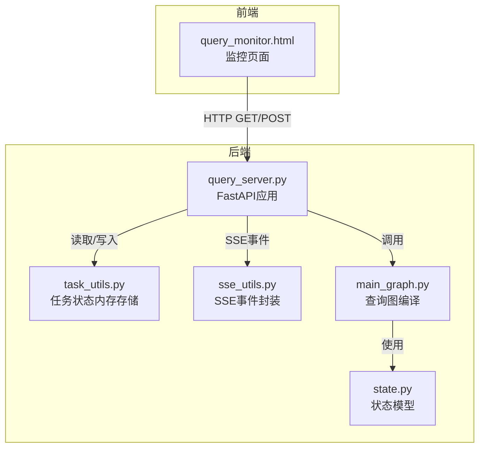
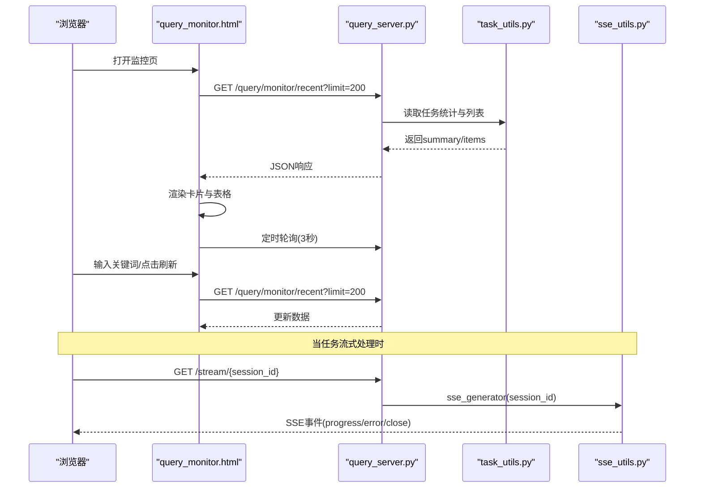
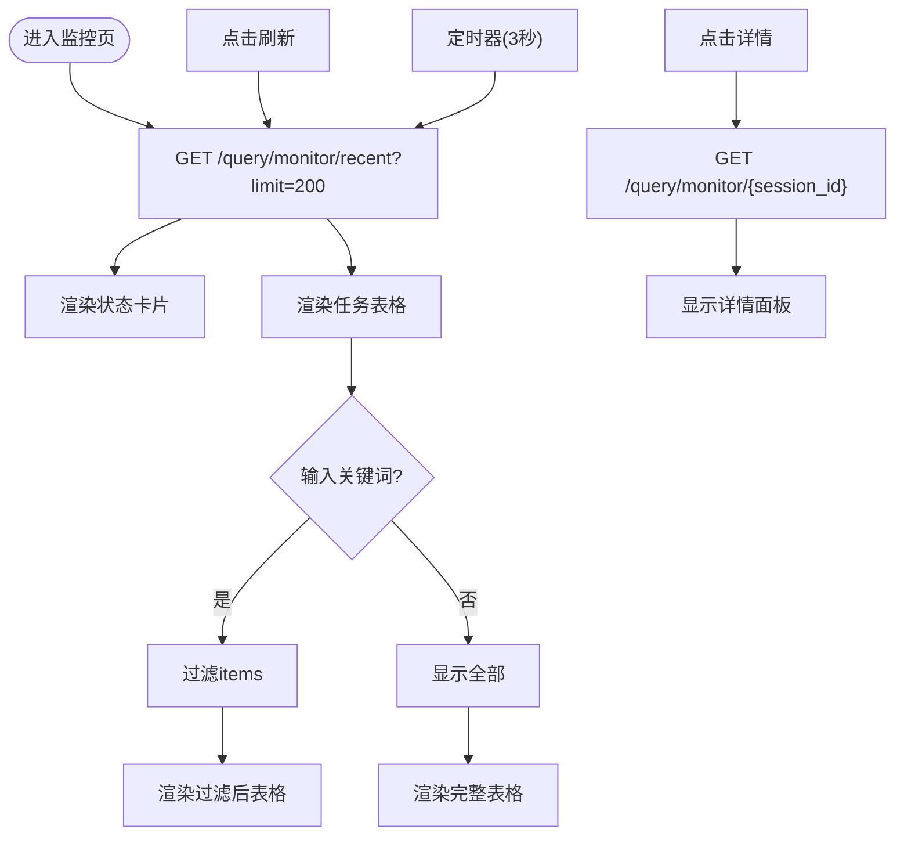
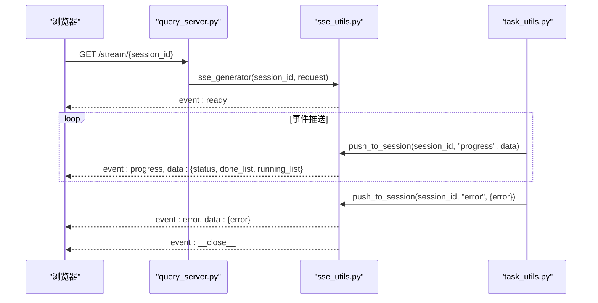
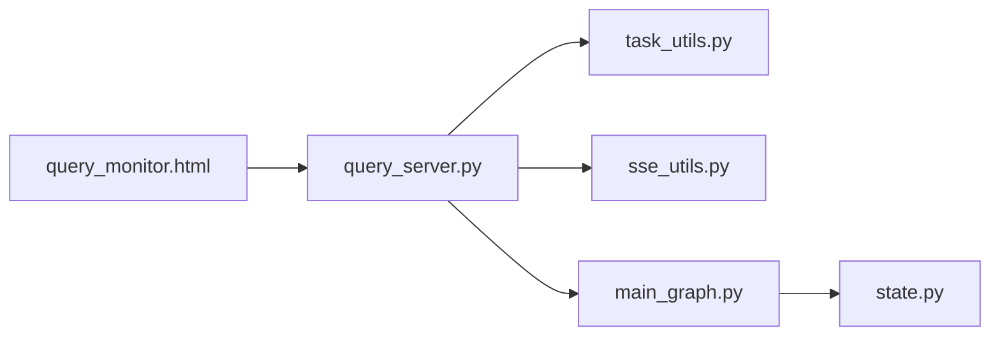

# 监控界面

<cite>
**本文引用的文件**
- [query_monitor.html](file://app/query_process/page/query_monitor.html)
- [query_server.py](file://app/query_process/api/query_server.py)
- [task_utils.py](file://app/utils/task_utils.py)
- [sse_utils.py](file://app/utils/sse_utils.py)
- [main_graph.py](file://app/query_process/agent/main_graph.py)
- [state.py](file://app/query_process/agent/state.py)
- [sse_step_1.py](file://app/query_process/sse/sse_step_1.py)
- [sse_step_2.py](file://app/query_process/sse/sse_step_2.py)
</cite>

## 目录
1. [简介](#简介)
2. [项目结构](#项目结构)
3. [核心组件](#核心组件)
4. [架构总览](#架构总览)
5. [组件详解](#组件详解)
6. [依赖关系分析](#依赖关系分析)
7. [性能考量](#性能考量)
8. [故障排查指南](#故障排查指南)
9. [结论](#结论)
10. [附录](#附录)

## 简介
本文件面向监控界面的使用者与维护者，系统化阐述监控页面的设计与实现，涵盖以下主题：
- 系统状态展示区：实时状态卡片、任务列表表格、任务详情面板
- 任务管理能力：任务状态筛选、批量操作入口与建议
- 性能指标可视化：成功率、P95延迟等关键指标
- 实时数据更新机制：基于轮询与SSE的刷新策略
- 权限与访问控制：当前实现与加固建议
- 图表组件配置与定制：样式、过滤与交互
- 监控数据存储与查询：内存态聚合与持久化扩展
- 故障预警与通知：事件类型与告警策略

## 项目结构
监控界面由前端HTML页面与后端FastAPI服务共同组成，后端负责任务状态聚合、SSE事件推送与历史对话查询。

**图示来源**
- [query_monitor.html:1-142](file://app/query_process/page/query_monitor.html#L1-L142)
- [query_server.py:1-164](file://app/query_process/api/query_server.py#L1-L164)
- [task_utils.py:1-187](file://app/utils/task_utils.py#L1-L187)
- [sse_utils.py:1-108](file://app/utils/sse_utils.py#L1-L108)
- [main_graph.py:1-47](file://app/query_process/agent/main_graph.py#L1-L47)
- [state.py:1-97](file://app/query_process/agent/state.py#L1-L97)

**章节来源**
- [query_monitor.html:1-142](file://app/query_process/page/query_monitor.html#L1-L142)
- [query_server.py:1-164](file://app/query_process/api/query_server.py#L1-L164)

## 核心组件
- 监控页面（query_monitor.html）
  - 实时状态卡片：总请求、成功、失败、处理中、成功率、P95延迟
  - 任务列表表格：状态、Session、问题、延迟、Done/Running、答案长度、更新时间、操作
  - 任务详情面板：展示Session、状态、问题、延迟、完成节点、运行节点、错误
  - 过滤与刷新：关键词过滤（query/session_id）、手动刷新按钮、定时轮询
- 后端API（query_server.py）
  - 健康检查、发起查询、SSE流式推送、历史查询、清空历史
- 任务状态管理（task_utils.py）
  - 内存态任务跟踪：进行中/已完成节点列表、状态、结果
  - 事件推送：progress、error等事件类型
- SSE工具（sse_utils.py）
  - 会话队列管理、事件打包、异步生成器、断连处理与清理
- 查询图（main_graph.py、state.py）
  - 查询流程编译、状态模型定义

**章节来源**
- [query_monitor.html:49-139](file://app/query_process/page/query_monitor.html#L49-L139)
- [query_server.py:32-161](file://app/query_process/api/query_server.py#L32-L161)
- [task_utils.py:1-187](file://app/utils/task_utils.py#L1-L187)
- [sse_utils.py:17-108](file://app/utils/sse_utils.py#L17-L108)
- [main_graph.py:12-47](file://app/query_process/agent/main_graph.py#L12-L47)
- [state.py:5-61](file://app/query_process/agent/state.py#L5-L61)

## 架构总览
监控界面采用“前端轮询 + 后端聚合”的模式，结合SSE实现事件驱动的增量更新。查询流程通过LangGraph执行，状态在内存中维护并通过SSE推送。

**图示来源**
- [query_monitor.html:96-139](file://app/query_process/page/query_monitor.html#L96-L139)
- [query_server.py:115-126](file://app/query_process/api/query_server.py#L115-L126)
- [task_utils.py:174-179](file://app/utils/task_utils.py#L174-L179)
- [sse_utils.py:54-108](file://app/utils/sse_utils.py#L54-L108)

## 组件详解

### 系统状态展示区
- 实时状态卡片
  - 字段：总请求、成功、失败、处理中、成功率、P95延迟
  - 更新方式：每次加载时设置
- 任务列表表格
  - 字段：状态标签、Session、问题、延迟、Done/Running、答案长度、更新时间、操作
  - 过滤：支持按问题或Session ID关键词过滤
  - 刷新：手动刷新按钮与定时轮询（3秒）
- 任务详情面板
  - 展示：Session、状态、问题、延迟、完成节点、运行节点、错误
  - 触发：点击“详情”按钮后拉取对应详情接口

**图示来源**
- [query_monitor.html:96-139](file://app/query_process/page/query_monitor.html#L96-L139)

**章节来源**
- [query_monitor.html:49-139](file://app/query_process/page/query_monitor.html#L49-L139)

### 任务管理功能
- 任务列表展示
  - 字段齐全，便于快速概览
- 任务状态筛选
  - 前端关键词过滤（query/session_id）
- 批量操作
  - 当前页面未提供批量勾选与操作按钮
  - 建议：增加全选/反选、批量删除、批量导出等入口，并在后端提供相应接口

**章节来源**
- [query_monitor.html:100-117](file://app/query_process/page/query_monitor.html#L100-L117)

### 性能指标可视化
- 成功率与P95延迟
  - 由后端聚合返回，前端直接渲染
- 响应时间与并发
  - 响应时间以“延迟(ms)”呈现
  - 并发可通过“处理中”卡片与“运行节点”比例观察

**章节来源**
- [query_monitor.html:87-94](file://app/query_process/page/query_monitor.html#L87-L94)

### 任务详情面板
- 内容字段
  - Session、状态、问题、延迟、完成节点、运行节点、错误
- 数据来源
  - 通过详情接口获取并渲染

**章节来源**
- [query_monitor.html:120-133](file://app/query_process/page/query_monitor.html#L120-L133)

### 实时数据更新机制
- 轮询策略
  - 页面加载后立即请求一次，随后每3秒轮询一次
  - 支持手动刷新按钮
- SSE事件推送
  - 任务流式处理时，前端通过SSE接收progress/error/close事件
  - 事件类型定义于SSEEvent枚举，包含ready、progress、delta、final、error、close

**图示来源**
- [query_server.py:115-126](file://app/query_process/api/query_server.py#L115-L126)
- [sse_utils.py:54-108](file://app/utils/sse_utils.py#L54-L108)
- [task_utils.py:174-179](file://app/utils/task_utils.py#L174-L179)

**章节来源**
- [query_monitor.html:135-139](file://app/query_process/page/query_monitor.html#L135-L139)
- [query_server.py:115-126](file://app/query_process/api/query_server.py#L115-L126)
- [sse_utils.py:8-15](file://app/utils/sse_utils.py#L8-L15)

### 用户权限控制与访问限制
- 当前实现
  - 后端启用CORS（允许任意源），未内置鉴权与授权
  - 健康检查接口未限制访问
- 建议
  - 引入认证中间件（如API Key、JWT）
  - 为敏感接口增加权限校验
  - 限制轮询频率，防止滥用

**章节来源**
- [query_server.py:24-29](file://app/query_process/api/query_server.py#L24-L29)

### 图表组件的配置与定制
- 卡片网格
  - 6列自适应布局，适合展示关键指标
- 表格列宽与截断
  - Session与问题列设置最大宽度与省略号，提升可读性
- 过滤与刷新
  - 输入框与按钮组合，支持即时过滤与手动刷新
- 定制建议
  - 增加筛选下拉（状态、时间范围）
  - 支持列拖拽排序与自定义显示列
  - 增加导出CSV按钮

**章节来源**
- [query_monitor.html:17-36](file://app/query_process/page/query_monitor.html#L17-L36)
- [query_monitor.html:100-117](file://app/query_process/page/query_monitor.html#L100-L117)

### 监控数据的存储与查询机制
- 内存态聚合
  - 任务状态、完成/进行中节点列表、结果均保存在内存字典中
  - 适用于单进程场景，重启丢失
- 后端聚合接口
  - /query/monitor/recent：返回summary与items
  - /query/monitor/{session_id}：返回指定会话详情
- 持久化建议
  - 引入数据库（如MongoDB/PostgreSQL）存储任务元数据与指标
  - 增加指标采集与落库（成功率、P95延迟、吞吐）

**章节来源**
- [task_utils.py:7-18](file://app/utils/task_utils.py#L7-L18)
- [query_monitor.html:96-117](file://app/query_process/page/query_monitor.html#L96-L117)

### 故障预警与通知
- 事件类型
  - ready：连接建立
  - progress：节点进度变化
  - error：任务异常
  - close：结束信号
- 告警策略建议
  - P95延迟超阈值告警
  - 连续失败率升高告警
  - SSE断连次数过多告警
  - 前端弹窗或徽章提示

**章节来源**
- [sse_utils.py:8-15](file://app/utils/sse_utils.py#L8-L15)
- [task_utils.py:76-109](file://app/utils/task_utils.py#L76-L109)

## 依赖关系分析
- 前端依赖
  - query_monitor.html依赖后端REST接口与SSE
- 后端依赖
  - query_server.py依赖task_utils与sse_utils，调用LangGraph执行查询
- 数据流
  - 任务状态变更通过task_utils更新，SSE推送至前端
  - 监控页面轮询获取聚合数据

**图示来源**
- [query_monitor.html:1-142](file://app/query_process/page/query_monitor.html#L1-L142)
- [query_server.py:1-164](file://app/query_process/api/query_server.py#L1-L164)
- [task_utils.py:1-187](file://app/utils/task_utils.py#L1-L187)
- [sse_utils.py:1-108](file://app/utils/sse_utils.py#L1-L108)
- [main_graph.py:1-47](file://app/query_process/agent/main_graph.py#L1-L47)
- [state.py:1-97](file://app/query_process/agent/state.py#L1-L97)

**章节来源**
- [query_server.py:14-17](file://app/query_process/api/query_server.py#L14-L17)
- [main_graph.py:12-47](file://app/query_process/agent/main_graph.py#L12-L47)

## 性能考量
- 轮询频率
  - 3秒间隔平衡实时性与服务器压力
- SSE优势
  - 事件驱动，减少轮询开销
- 内存存储
  - 单机适用，建议引入缓存/数据库以支撑横向扩展
- 前端渲染
  - 大列表过滤与渲染需注意性能，可考虑虚拟滚动

[本节为通用指导，无需特定文件来源]

## 故障排查指南
- 页面无法加载或空白
  - 检查后端服务是否启动，健康检查接口是否可用
- 任务列表不刷新
  - 确认轮询是否生效，网络是否阻断
- 详情面板不显示
  - 检查详情接口返回与前端渲染逻辑
- SSE不断连
  - 检查客户端断连处理与队列清理逻辑
- 权限相关问题
  - CORS已放开，如需限制请增加认证中间件

**章节来源**
- [query_monitor.html:135-139](file://app/query_process/page/query_monitor.html#L135-L139)
- [query_server.py:32-35](file://app/query_process/api/query_server.py#L32-L35)
- [sse_utils.py:67-108](file://app/utils/sse_utils.py#L67-L108)

## 结论
该监控界面以简洁的卡片与表格呈现关键指标，结合轮询与SSE实现近实时更新。任务状态在内存中维护，适合单实例部署；生产环境建议引入持久化与鉴权机制，并扩展批量操作与更丰富的筛选条件。

[本节为总结性内容，无需特定文件来源]

## 附录

### API一览（与监控相关）
- GET /health：健康检查
- GET /query/monitor/recent?limit=N：获取最近N条任务摘要与列表
- GET /query/monitor/{session_id}：获取指定会话详情
- GET /stream/{session_id}：SSE事件流
- POST /query：发起查询（可选择流式）

**章节来源**
- [query_server.py:32-161](file://app/query_process/api/query_server.py#L32-L161)

### SSE示例与优化
- 示例脚本展示了基础SSE与基于队列的优化实现
- 优化要点：会话专属队列、阻塞等待、结束标记、断连清理

**章节来源**
- [sse_step_1.py:16-29](file://app/query_process/sse/sse_step_1.py#L16-L29)
- [sse_step_2.py:37-52](file://app/query_process/sse/sse_step_2.py#L37-L52)