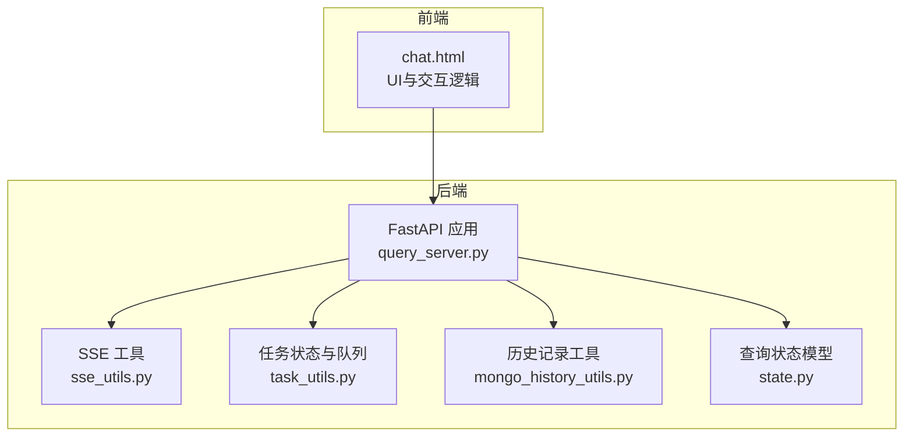
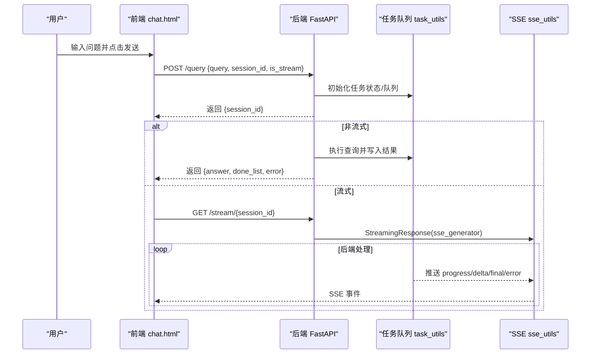
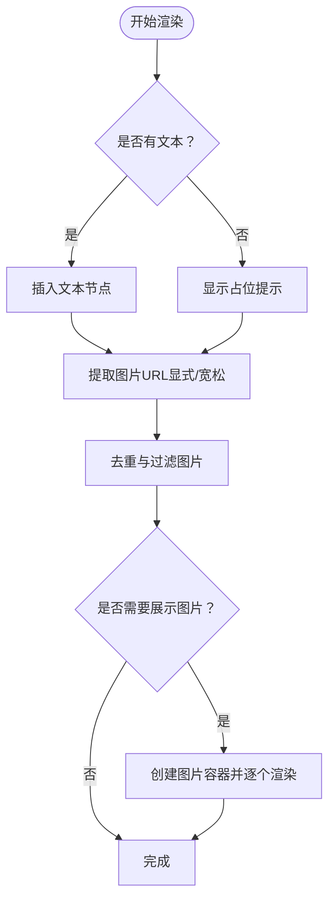
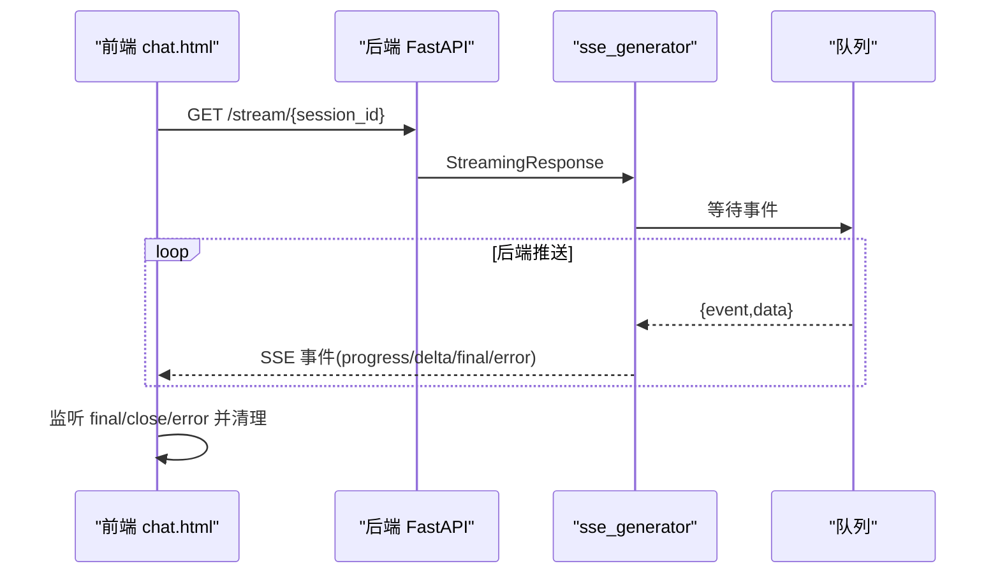
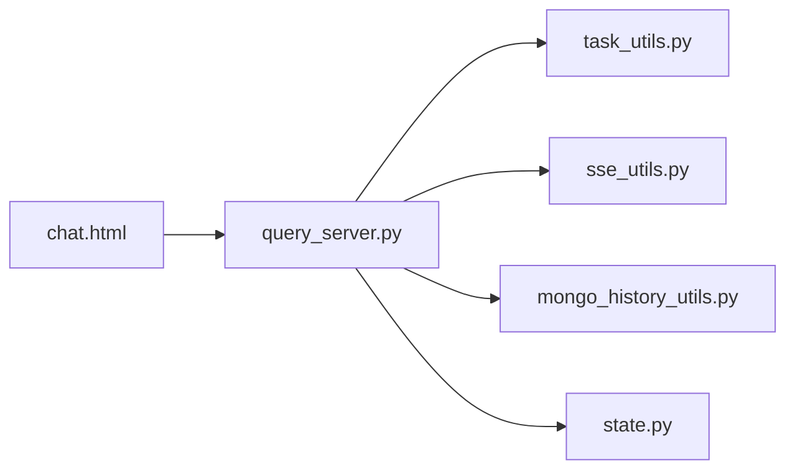

# 聊天界面

<cite>
**本文引用的文件**
- [chat.html](file://app/query_process/page/chat.html)
- [query_server.py](file://app/query_process/api/query_server.py)
- [sse_utils.py](file://app/utils/sse_utils.py)
- [task_utils.py](file://app/utils/task_utils.py)
- [mongo_history_utils.py](file://app/clients/mongo_history_utils.py)
- [state.py](file://app/query_process/agent/state.py)
- [sse_step_1.html](file://app/query_process/sse/sse_step_1.html)
- [sse_step_1.py](file://app/query_process/sse/sse_step_1.py)
- [sse_step_2.html](file://app/query_process/sse/sse_step_2.html)
- [sse_step_2.py](file://app/query_process/sse/sse_step_2.py)
</cite>

## 目录
1. [简介](#简介)
2. [项目结构](#项目结构)
3. [核心组件](#核心组件)
4. [架构总览](#架构总览)
5. [详细组件分析](#详细组件分析)
6. [依赖分析](#依赖分析)
7. [性能考虑](#性能考虑)
8. [故障排查指南](#故障排查指南)
9. [结论](#结论)
10. [附录](#附录)

## 简介
本文件面向“聊天界面”的实现与使用，围绕以下目标展开：
- 问答输入区域设计：文本输入框、发送按钮与快捷操作
- 实时响应显示机制：流式响应处理、消息气泡样式与滚动行为
- 历史记录展示：消息时间戳、用户与AI消息区分显示
- SSE（Server-Sent Events）实时通信：连接建立、事件监听与断线处理
- 前后端数据交互模式：消息发送、接收与状态同步
- 消息格式规范与数据序列化
- 响应式布局与移动端适配
- 错误处理与异常情况的用户提示

## 项目结构
聊天界面由前端页面与后端服务共同组成，前端负责UI与交互，后端提供API与SSE通道，并通过内存态任务队列与MongoDB历史记录实现状态持久化。

图表来源
- [chat.html:1-896](file://app/query_process/page/chat.html#L1-L896)
- [query_server.py:1-164](file://app/query_process/api/query_server.py#L1-L164)
- [sse_utils.py:1-108](file://app/utils/sse_utils.py#L1-L108)
- [task_utils.py:1-187](file://app/utils/task_utils.py#L1-L187)
- [mongo_history_utils.py:1-242](file://app/clients/mongo_history_utils.py#L1-L242)
- [state.py:1-97](file://app/query_process/agent/state.py#L1-L97)

章节来源
- [chat.html:1-896](file://app/query_process/page/chat.html#L1-L896)
- [query_server.py:1-164](file://app/query_process/api/query_server.py#L1-L164)

## 核心组件
- 前端页面与交互
  - 输入区：文本输入框与发送按钮，支持 Enter 发送、Shift+Enter 换行
  - 实时显示：用户消息气泡、AI消息骨架（打字动画+阶段进度）、图片渲染
  - 历史加载：按会话ID拉取历史并渲染
  - 控制项：流式输出开关、清空对话、API健康指示
- 后端服务
  - 健康检查、页面返回、发起查询、SSE流、历史查询与清空
  - 任务状态管理：运行中/已完成/失败，进度与最终答案推送
  - SSE队列：按会话维护事件队列，支持断线自动清理
  - 历史记录：MongoDB存储，按会话与时间戳查询

章节来源
- [chat.html:293-298](file://app/query_process/page/chat.html#L293-L298)
- [query_server.py:31-161](file://app/query_process/api/query_server.py#L31-L161)
- [task_utils.py:68-179](file://app/utils/task_utils.py#L68-L179)
- [sse_utils.py:17-53](file://app/utils/sse_utils.py#L17-L53)
- [mongo_history_utils.py:193-221](file://app/clients/mongo_history_utils.py#L193-L221)

## 架构总览
前端通过HTTP接口与后端交互，查询接口返回会话ID；若启用流式，则前端建立SSE连接，后端通过队列推送进度、增量与最终结果；历史接口支持按会话拉取与清空。

图表来源
- [chat.html:687-858](file://app/query_process/page/chat.html#L687-L858)
- [query_server.py:78-127](file://app/query_process/api/query_server.py#L78-L127)
- [task_utils.py:174-179](file://app/utils/task_utils.py#L174-L179)
- [sse_utils.py:54-108](file://app/utils/sse_utils.py#L54-L108)

## 详细组件分析

### 输入区域与快捷操作
- 文本输入框
  - 支持多行输入，最大高度限制，自动聚焦
  - Enter 发送，Shift+Enter 换行
- 发送按钮
  - 禁用状态与错误恢复
- 快捷操作
  - 流式输出开关：控制是否走SSE流式
  - 清空对话：删除后端历史并清空前端显示
  - API健康指示：周期性检查后端健康状态

章节来源
- [chat.html:293-298](file://app/query_process/page/chat.html#L293-L298)
- [chat.html:860-885](file://app/query_process/page/chat.html#L860-L885)
- [chat.html:656-664](file://app/query_process/page/chat.html#L656-L664)

### 实时响应显示机制
- 消息气泡
  - 用户消息：右对齐，蓝色主题
  - AI消息：左对齐，白色背景，带打字动画与阶段进度
- 图片渲染
  - 从答案文本与显式标记中提取图片URL，懒加载并错误隐藏
- 滚动行为
  - 自动滚动至底部，确保最新消息可见
- 流式处理
  - progress：渲染已完成/进行中节点列表
  - delta：增量拼接并尝试渲染图片
  - final/final_answer：最终答案，关闭进度与打字动画

图表来源
- [chat.html:411-445](file://app/query_process/page/chat.html#L411-L445)
- [chat.html:457-518](file://app/query_process/page/chat.html#L457-L518)

章节来源
- [chat.html:520-566](file://app/query_process/page/chat.html#L520-L566)
- [chat.html:590-654](file://app/query_process/page/chat.html#L590-L654)
- [chat.html:768-858](file://app/query_process/page/chat.html#L768-L858)

### 历史记录展示
- 历史接口
  - 按会话ID查询最近N条记录，按时间升序返回
- 渲染策略
  - 保留首条欢迎消息，其余替换为历史记录
  - 用户与AI消息分别渲染，时间戳格式化
- 清空历史
  - 调用后端DELETE接口，失败时仅清空前端显示并提示

章节来源
- [query_server.py:129-161](file://app/query_process/api/query_server.py#L129-L161)
- [mongo_history_utils.py:193-221](file://app/clients/mongo_history_utils.py#L193-L221)
- [chat.html:666-685](file://app/query_process/page/chat.html#L666-L685)
- [chat.html:867-885](file://app/query_process/page/chat.html#L867-L885)

### SSE 实时通信实现
- 连接建立
  - 前端在非流式返回后获取session_id，再发起GET /stream/{session_id}
- 事件监听
  - progress：更新阶段进度列表与状态
  - delta：增量拼接到答案并尝试渲染图片
  - final/final_answer：最终答案，关闭进度与打字动画
  - error：错误提示，关闭连接并恢复按钮
- 断线与清理
  - 生成器检测客户端断开，自动清理队列
  - 前端错误分支兜底，显示失败原因

图表来源
- [chat.html:768-858](file://app/query_process/page/chat.html#L768-L858)
- [query_server.py:115-127](file://app/query_process/api/query_server.py#L115-L127)
- [sse_utils.py:54-108](file://app/utils/sse_utils.py#L54-L108)

章节来源
- [chat.html:768-858](file://app/query_process/page/chat.html#L768-L858)
- [query_server.py:115-127](file://app/query_process/api/query_server.py#L115-L127)
- [sse_utils.py:54-108](file://app/utils/sse_utils.py#L54-L108)

### 前后端数据交互模式
- 发起查询
  - POST /query：返回session_id或直接返回结果
- 状态轮询（非流式）
  - 轮询 /status/{task_id} 更新进度
- 流式SSE
  - /stream/{session_id} 推送 progress/delta/final
- 历史交互
  - GET /history/{session_id} 拉取历史
  - DELETE /history/{session_id} 清空历史

章节来源
- [chat.html:687-728](file://app/query_process/page/chat.html#L687-L728)
- [query_server.py:78-161](file://app/query_process/api/query_server.py#L78-L161)

### 消息格式规范与序列化
- 请求体（POST /query）
  - 字段：query（必填）、session_id（可选）、is_stream（布尔）
- 响应体（POST /query）
  - 非流式：answer、session_id、message、done_list
  - 流式：session_id、message
- SSE事件
  - progress：status、done_list、running_list
  - delta：delta（增量文本）
  - final/final_answer：answer（完整答案）、image_urls（可选）
  - error：error（错误信息）
- 历史记录
  - items：数组，元素包含role、text、image_urls、ts等

章节来源
- [query_server.py:48-113](file://app/query_process/api/query_server.py#L48-L113)
- [task_utils.py:174-179](file://app/utils/task_utils.py#L174-L179)
- [chat.html:772-858](file://app/query_process/page/chat.html#L772-L858)
- [mongo_history_utils.py:193-221](file://app/clients/mongo_history_utils.py#L193-L221)

### 响应式布局与移动端适配
- 视口与字体
  - 移动端 viewport 配置，系统字体链保证可读性
- 布局结构
  - 顶部栏、聊天区域、输入区三段式布局
  - 聊天区域自适应滚动，消息气泡宽度随内容调整
- 交互细节
  - 输入框最小/最大高度限制，按钮尺寸适中
  - 打字动画与进度面板在小屏上保持清晰

章节来源
- [chat.html:1-896](file://app/query_process/page/chat.html#L1-L896)

### 错误处理与异常提示
- 前端
  - 输入为空、发送失败、SSE错误均给出明确提示
  - 清空历史失败时提示仅清空本地
- 后端
  - 任务异常写入ERROR事件并关闭连接
  - 客户端断开自动清理队列，避免资源泄漏

章节来源
- [chat.html:832-858](file://app/query_process/page/chat.html#L832-L858)
- [query_server.py:70-76](file://app/query_process/api/query_server.py#L70-L76)
- [sse_utils.py:99-108](file://app/utils/sse_utils.py#L99-L108)

## 依赖分析
- 前端对后端API的依赖
  - /health：健康检查
  - /query：发起查询
  - /stream/{session_id}：SSE流
  - /history/{session_id}：历史查询/清空
- 后端内部依赖
  - query_server.py 依赖 task_utils（任务状态与队列）、sse_utils（SSE生成器）、mongo_history_utils（历史存储）、state（状态模型）

图表来源
- [query_server.py:1-18](file://app/query_process/api/query_server.py#L1-L18)
- [task_utils.py:1-3](file://app/utils/task_utils.py#L1-L3)
- [sse_utils.py:1-6](file://app/utils/sse_utils.py#L1-L6)
- [mongo_history_utils.py:1-16](file://app/clients/mongo_history_utils.py#L1-L16)
- [state.py:1-4](file://app/query_process/agent/state.py#L1-L4)

章节来源
- [query_server.py:1-18](file://app/query_process/api/query_server.py#L1-L18)

## 性能考虑
- 流式传输
  - 使用SSE增量推送，降低首字节延迟
  - 前端增量拼接并尝试渲染图片，减少整体重绘
- 队列与并发
  - 以会话为单位维护队列，避免共享锁竞争
  - 生成器检测断开快速退出，释放资源
- 历史查询
  - 按会话+时间戳复合索引，限制返回条数，避免全表扫描

章节来源
- [task_utils.py:68-109](file://app/utils/task_utils.py#L68-L109)
- [mongo_history_utils.py:45-48](file://app/clients/mongo_history_utils.py#L45-L48)
- [sse_utils.py:71-108](file://app/utils/sse_utils.py#L71-L108)

## 故障排查指南
- 无法连接后端
  - 检查 /health 是否返回ok
  - 确认CORS配置与端口
- 发送按钮无响应
  - 检查输入是否为空
  - 查看API健康指示与按钮禁用状态
- 无流式响应
  - 确认is_stream开关
  - 检查SSE连接是否建立，事件是否到达
- 历史记录不显示
  - 确认session_id正确
  - 检查MongoDB连接与索引
- 清空历史失败
  - 查看后端返回状态码与日志
  - 前端会提示仅清空本地

章节来源
- [chat.html:656-664](file://app/query_process/page/chat.html#L656-L664)
- [chat.html:867-885](file://app/query_process/page/chat.html#L867-L885)
- [query_server.py:31-35](file://app/query_process/api/query_server.py#L31-L35)
- [mongo_history_utils.py:32-56](file://app/clients/mongo_history_utils.py#L32-L56)

## 结论
该聊天界面以简洁的前端与稳健的后端配合，实现了从输入到实时流式响应的完整闭环。通过SSE与任务队列，系统在保证用户体验的同时具备良好的可扩展性与可维护性。建议在生产环境中进一步完善错误上报、重连策略与历史记录的分页加载。

## 附录

### 示例：SSE基础与异步任务演示
- 基础SSE：固定消息推送
- 异步任务+SSE：提交任务后通过SSE接收处理结果

章节来源
- [sse_step_1.html:1-22](file://app/query_process/sse/sse_step_1.html#L1-L22)
- [sse_step_1.py:15-29](file://app/query_process/sse/sse_step_1.py#L15-L29)
- [sse_step_2.html:17-30](file://app/query_process/sse/sse_step_2.html#L17-L30)
- [sse_step_2.py:13-52](file://app/query_process/sse/sse_step_2.py#L13-L52)