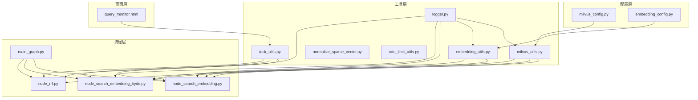
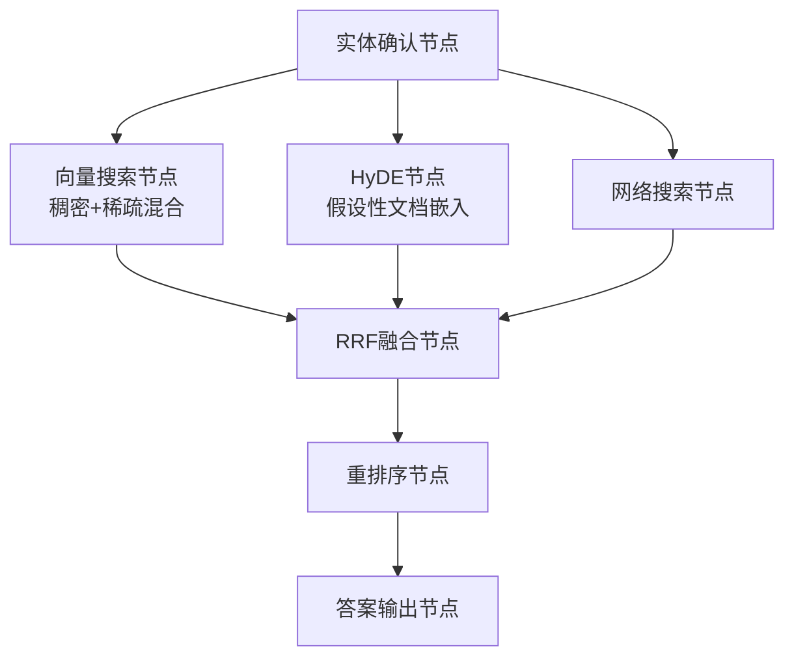
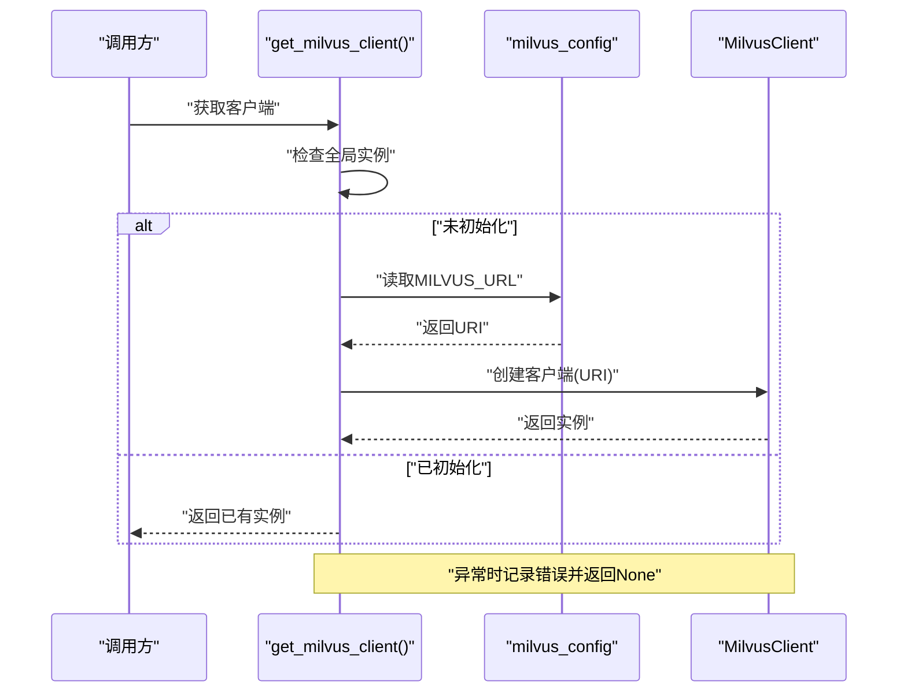
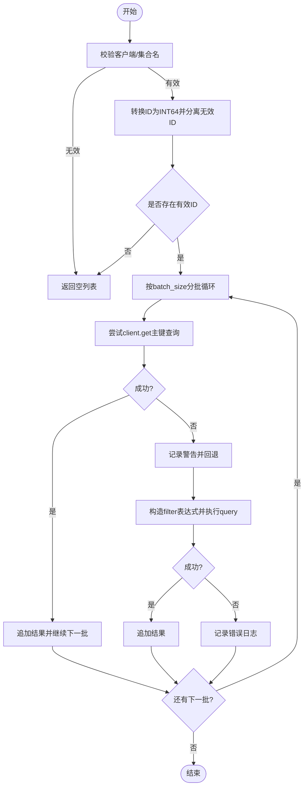
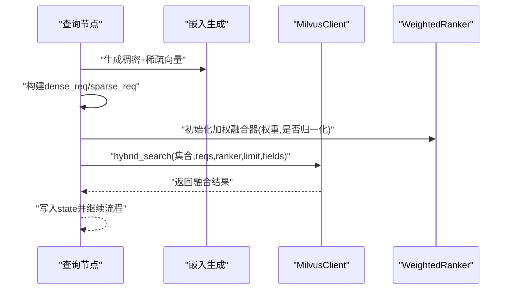
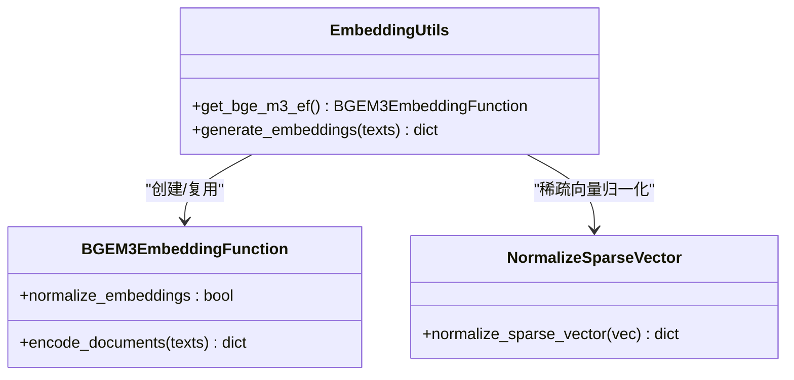
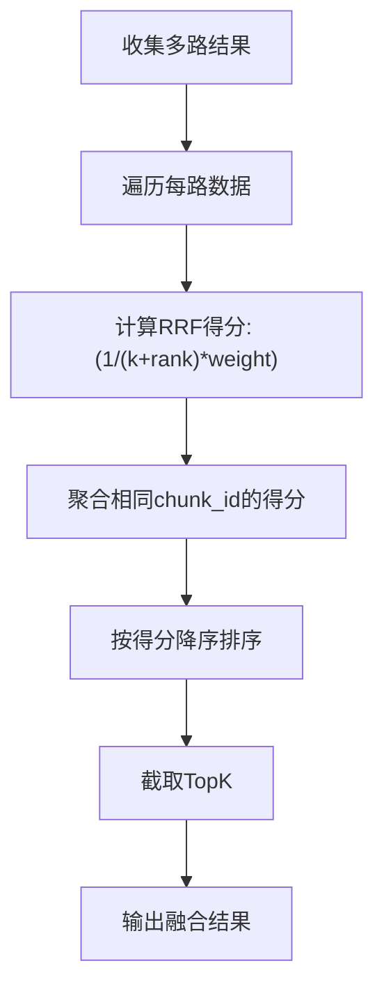
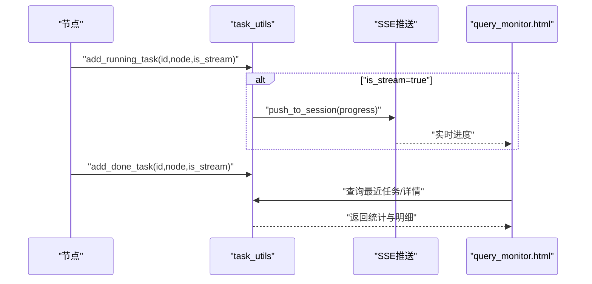
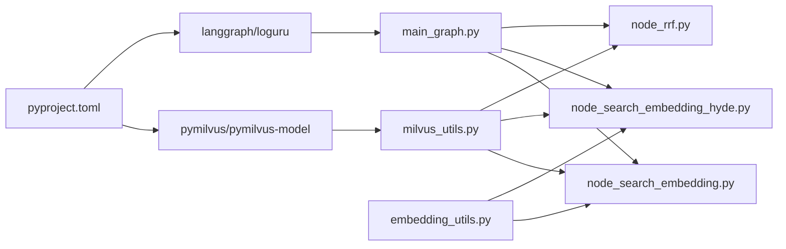

# Milvus向量数据库集成

<cite>
**本文引用的文件**
- [milvus_utils.py](file://app/clients/milvus_utils.py)
- [milvus_config.py](file://app/conf/milvus_config.py)
- [embedding_utils.py](file://app/lm/embedding_utils.py)
- [embedding_config.py](file://app/conf/embedding_config.py)
- [normalize_sparse_vector.py](file://app/utils/normalize_sparse_vector.py)
- [node_search_embedding.py](file://app/query_process/agent/nodes/node_search_embedding.py)
- [node_search_embedding_hyde.py](file://app/query_process/agent/nodes/node_search_embedding_hyde.py)
- [node_rrf.py](file://app/query_process/agent/nodes/node_rrf.py)
- [main_graph.py](file://app/query_process/agent/main_graph.py)
- [logger.py](file://app/core/logger.py)
- [rate_limit_utils.py](file://app/utils/rate_limit_utils.py)
- [task_utils.py](file://app/utils/task_utils.py)
- [pyproject.toml](file://pyproject.toml)
- [query_monitor.html](file://app/query_process/page/query_monitor.html)
</cite>

## 目录
1. [简介](#简介)
2. [项目结构](#项目结构)
3. [核心组件](#核心组件)
4. [架构总览](#架构总览)
5. [详细组件分析](#详细组件分析)
6. [依赖分析](#依赖分析)
7. [性能考虑](#性能考虑)
8. [故障排查指南](#故障排查指南)
9. [结论](#结论)
10. [附录](#附录)

## 简介
本技术文档面向Milvus向量数据库在RAG流程中的集成，重点阐述以下方面：
- Milvus客户端单例模式与连接管理策略
- 混合向量搜索（稠密+稀疏）的架构设计与权重融合算法
- 批量查询与ID转换机制的实现细节
- 连接池配置、性能优化策略与错误处理机制
- 向量搜索参数配置、索引选择与查询优化最佳实践
- 连接失败重试、监控告警与故障转移的实现方案

## 项目结构
该项目采用“配置-工具-流程-页面”的分层组织方式：
- 配置层：Milvus与Embedding配置类，集中管理环境变量与默认值
- 工具层：Milvus客户端工具、嵌入生成工具、稀疏向量归一化、速率限制、任务追踪
- 流程层：LangGraph编排的查询工作流，串联实体确认、向量搜索、HyDE、网络搜索、RRF融合与重排序
- 页面层：查询监控页面，提供实时统计与详情查看

**图表来源**
- [milvus_config.py:12-26](file://app/conf/milvus_config.py#L12-L26)
- [embedding_config.py:9-24](file://app/conf/embedding_config.py#L9-L24)
- [milvus_utils.py:10-31](file://app/clients/milvus_utils.py#L10-L31)
- [embedding_utils.py:8-48](file://app/lm/embedding_utils.py#L8-L48)
- [main_graph.py:12-47](file://app/query_process/agent/main_graph.py#L12-L47)
- [node_search_embedding.py:12-72](file://app/query_process/agent/nodes/node_search_embedding.py#L12-L72)
- [node_search_embedding_hyde.py:70-92](file://app/query_process/agent/nodes/node_search_embedding_hyde.py#L70-L92)
- [node_rrf.py:50-76](file://app/query_process/agent/nodes/node_rrf.py#L50-L76)
- [task_utils.py:68-109](file://app/utils/task_utils.py#L68-L109)
- [logger.py:46-83](file://app/core/logger.py#L46-L83)
- [query_monitor.html:1-142](file://app/query_process/page/query_monitor.html#L1-L142)

**章节来源**
- [milvus_config.py:12-26](file://app/conf/milvus_config.py#L12-L26)
- [embedding_config.py:9-24](file://app/conf/embedding_config.py#L9-L24)
- [milvus_utils.py:10-31](file://app/clients/milvus_utils.py#L10-L31)
- [embedding_utils.py:8-48](file://app/lm/embedding_utils.py#L8-L48)
- [main_graph.py:12-47](file://app/query_process/agent/main_graph.py#L12-L47)
- [node_search_embedding.py:12-72](file://app/query_process/agent/nodes/node_search_embedding.py#L12-L72)
- [node_search_embedding_hyde.py:70-92](file://app/query_process/agent/nodes/node_search_embedding_hyde.py#L70-L92)
- [node_rrf.py:50-76](file://app/query_process/agent/nodes/node_rrf.py#L50-L76)
- [task_utils.py:68-109](file://app/utils/task_utils.py#L68-L109)
- [logger.py:46-83](file://app/core/logger.py#L46-L83)
- [query_monitor.html:1-142](file://app/query_process/page/query_monitor.html#L1-L142)

## 核心组件
- Milvus客户端单例与连接管理：全局唯一客户端实例，首次访问时建立连接，异常时返回None并记录日志
- 混合向量搜索：构建稠密/稀疏AnnSearchRequest，使用WeightedRanker进行加权融合
- 批量查询与ID转换：将chunk_id转换为INT64，分批查询，优先get主键直查，失败回退query过滤
- 嵌入生成：BGE-M3模型单例，原生L2归一化，稀疏向量字典化，适配JSON序列化
- 稀疏向量归一化：对稀疏向量按非零维度做L2归一化
- 任务追踪与监控：内存态任务列表、状态推送、前端监控页
- 日志系统：基于loguru，支持.env控制台/文件输出、自动清理、异步安全

**章节来源**
- [milvus_utils.py:10-31](file://app/clients/milvus_utils.py#L10-L31)
- [milvus_utils.py:52-114](file://app/clients/milvus_utils.py#L52-L114)
- [milvus_utils.py:117-155](file://app/clients/milvus_utils.py#L117-L155)
- [milvus_utils.py:158-198](file://app/clients/milvus_utils.py#L158-L198)
- [embedding_utils.py:8-48](file://app/lm/embedding_utils.py#L8-L48)
- [embedding_utils.py:51-96](file://app/lm/embedding_utils.py#L51-L96)
- [normalize_sparse_vector.py:1-23](file://app/utils/normalize_sparse_vector.py#L1-L23)
- [task_utils.py:68-109](file://app/utils/task_utils.py#L68-L109)
- [logger.py:46-83](file://app/core/logger.py#L46-L83)

## 架构总览
整体架构围绕LangGraph工作流展开，查询阶段包括：
- 实体确认 → 向量搜索（BGE-M3稠密+稀疏）→ HyDE（假设性文档嵌入）→ 网络搜索 → RRF融合 → 重排序 → 输出答案

**图表来源**
- [main_graph.py:12-47](file://app/query_process/agent/main_graph.py#L12-L47)
- [node_search_embedding.py:12-72](file://app/query_process/agent/nodes/node_search_embedding.py#L12-L72)
- [node_search_embedding_hyde.py:70-92](file://app/query_process/agent/nodes/node_search_embedding_hyde.py#L70-L92)
- [node_rrf.py:50-76](file://app/query_process/agent/nodes/node_rrf.py#L50-L76)

**章节来源**
- [main_graph.py:12-47](file://app/query_process/agent/main_graph.py#L12-L47)
- [node_search_embedding.py:12-72](file://app/query_process/agent/nodes/node_search_embedding.py#L12-L72)
- [node_search_embedding_hyde.py:70-92](file://app/query_process/agent/nodes/node_search_embedding_hyde.py#L70-L92)
- [node_rrf.py:50-76](file://app/query_process/agent/nodes/node_rrf.py#L50-L76)

## 详细组件分析

### Milvus客户端单例与连接管理
- 单例模式：全局变量保存MilvusClient实例，首次调用get_milvus_client时依据配置创建连接
- 连接校验：若缺少连接地址，记录错误并返回None
- 异常处理：捕获连接异常，记录错误日志并返回None，避免上游崩溃
- 使用建议：在应用启动时预热连接，或在首次查询前显式调用以尽早暴露连接问题

**图表来源**
- [milvus_utils.py:10-31](file://app/clients/milvus_utils.py#L10-L31)
- [milvus_config.py:21-26](file://app/conf/milvus_config.py#L21-L26)

**章节来源**
- [milvus_utils.py:10-31](file://app/clients/milvus_utils.py#L10-L31)
- [milvus_config.py:21-26](file://app/conf/milvus_config.py#L21-L26)

### 批量查询与ID转换机制
- ID转换：将传入的chunk_id列表转换为INT64，分离无效ID并记录警告
- 分批查询：按batch_size切分ID，逐批执行查询
- 优先策略：优先使用client.get主键直查，失败则回退到filter表达式query
- 输出字段：默认返回核心切片字段，支持自定义扩展

**图表来源**
- [milvus_utils.py:52-114](file://app/clients/milvus_utils.py#L52-L114)

**章节来源**
- [milvus_utils.py:52-114](file://app/clients/milvus_utils.py#L52-L114)

### 混合向量搜索与权重融合
- 请求构建：分别针对稠密与稀疏向量创建AnnSearchRequest，字段分别为dense_vector与sparse_vector
- 搜索参数：稠密默认COSINE，稀疏默认IP，支持自定义expr过滤与limit
- 融合策略：使用WeightedRanker对两路结果进行加权融合，支持归一化评分后再融合
- 输出字段：默认返回文档标识字段，支持自定义扩展

**图表来源**
- [node_search_embedding.py:36-51](file://app/query_process/agent/nodes/node_search_embedding.py#L36-L51)
- [milvus_utils.py:117-155](file://app/clients/milvus_utils.py#L117-L155)
- [milvus_utils.py:158-198](file://app/clients/milvus_utils.py#L158-L198)

**章节来源**
- [node_search_embedding.py:36-51](file://app/query_process/agent/nodes/node_search_embedding.py#L36-L51)
- [milvus_utils.py:117-155](file://app/clients/milvus_utils.py#L117-L155)
- [milvus_utils.py:158-198](file://app/clients/milvus_utils.py#L158-L198)

### 嵌入生成与稀疏向量归一化
- BGE-M3模型单例：避免重复初始化，支持设备与半精度配置
- 原生归一化：开启normalize_embeddings=True，使稠密与稀疏向量均处于单位范数，适配IP内积检索
- 稀疏向量格式：将CSR索引与权重转换为Python原生类型，便于JSON序列化与Milvus入库
- 稀疏向量归一化：对非零维度做L2归一化，零维度保持不变

**图表来源**
- [embedding_utils.py:8-48](file://app/lm/embedding_utils.py#L8-L48)
- [embedding_utils.py:51-96](file://app/lm/embedding_utils.py#L51-L96)
- [normalize_sparse_vector.py:1-23](file://app/utils/normalize_sparse_vector.py#L1-L23)

**章节来源**
- [embedding_utils.py:8-48](file://app/lm/embedding_utils.py#L8-L48)
- [embedding_utils.py:51-96](file://app/lm/embedding_utils.py#L51-L96)
- [normalize_sparse_vector.py:1-23](file://app/utils/normalize_sparse_vector.py#L1-L23)

### RRF融合与多路召回
- 多路数据：向量、HyDE、网络搜索等
- 融合公式：对每条chunk按其在各路中的rank计算加权得分，采用RRF公式
- 去重与排序：以chunk_id为键聚合，按最终得分降序取TopK

**图表来源**
- [node_rrf.py:7-48](file://app/query_process/agent/nodes/node_rrf.py#L7-L48)

**章节来源**
- [node_rrf.py:7-48](file://app/query_process/agent/nodes/node_rrf.py#L7-L48)

### 任务追踪与监控
- 内存态追踪：维护任务运行/完成列表、状态与结果
- 中文展示映射：节点名到中文描述的映射表，便于前端展示
- SSE推送：支持流式推送任务进度
- 前端监控页：展示任务总数、成功率、处理中、P95延迟与明细

**图表来源**
- [task_utils.py:68-109](file://app/utils/task_utils.py#L68-L109)
- [task_utils.py:174-179](file://app/utils/task_utils.py#L174-L179)
- [query_monitor.html:73-139](file://app/query_process/page/query_monitor.html#L73-L139)

**章节来源**
- [task_utils.py:68-109](file://app/utils/task_utils.py#L68-L109)
- [task_utils.py:174-179](file://app/utils/task_utils.py#L174-L179)
- [query_monitor.html:73-139](file://app/query_process/page/query_monitor.html#L73-L139)

## 依赖分析
- 外部依赖：pymilvus、pymilvus-model、loguru、langgraph等
- 内部依赖：配置类被工具与节点模块引用；工具模块被流程节点引用；日志模块贯穿各层

**图表来源**
- [pyproject.toml:9-35](file://pyproject.toml#L9-L35)
- [milvus_utils.py:1-4](file://app/clients/milvus_utils.py#L1-L4)
- [main_graph.py:1-10](file://app/query_process/agent/main_graph.py#L1-L10)
- [node_search_embedding.py:4-10](file://app/query_process/agent/nodes/node_search_embedding.py#L4-L10)
- [node_search_embedding_hyde.py:6-13](file://app/query_process/agent/nodes/node_search_embedding_hyde.py#L6-L13)
- [node_rrf.py:1-5](file://app/query_process/agent/nodes/node_rrf.py#L1-L5)
- [embedding_utils.py:1-4](file://app/lm/embedding_utils.py#L1-L4)

**章节来源**
- [pyproject.toml:9-35](file://pyproject.toml#L9-L35)
- [milvus_utils.py:1-4](file://app/clients/milvus_utils.py#L1-L4)
- [main_graph.py:1-10](file://app/query_process/agent/main_graph.py#L1-L10)
- [node_search_embedding.py:4-10](file://app/query_process/agent/nodes/node_search_embedding.py#L4-L10)
- [node_search_embedding_hyde.py:6-13](file://app/query_process/agent/nodes/node_search_embedding_hyde.py#L6-L13)
- [node_rrf.py:1-5](file://app/query_process/agent/nodes/node_rrf.py#L1-L5)
- [embedding_utils.py:1-4](file://app/lm/embedding_utils.py#L1-L4)

## 性能考虑
- 客户端复用：单例模式避免重复创建连接，降低握手与资源消耗
- 查询优化：
  - 优先get主键直查，失败回退query，减少过滤开销
  - 分批查询，避免单次请求过大
  - 混合搜索使用WeightedRanker融合，合理设置权重与归一化
- 嵌入优化：
  - BGE-M3开启原生L2归一化，适配IP内积检索，提升相似度计算效率
  - 稀疏向量字典化，避免大零矩阵存储与传输
- 日志与监控：
  - 异步安全日志，避免IO阻塞
  - SSE推送与前端监控，便于观测延迟与成功率

**章节来源**
- [milvus_utils.py:10-31](file://app/clients/milvus_utils.py#L10-L31)
- [milvus_utils.py:52-114](file://app/clients/milvus_utils.py#L52-L114)
- [milvus_utils.py:158-198](file://app/clients/milvus_utils.py#L158-L198)
- [embedding_utils.py:36-44](file://app/lm/embedding_utils.py#L36-L44)
- [logger.py:46-83](file://app/core/logger.py#L46-L83)
- [task_utils.py:174-179](file://app/utils/task_utils.py#L174-L179)
- [query_monitor.html:73-139](file://app/query_process/page/query_monitor.html#L73-L139)

## 故障排查指南
- 连接失败
  - 现象：get_milvus_client返回None，日志记录连接异常
  - 排查：检查MILVUS_URL环境变量、网络连通性、Milvus服务状态
- 查询异常
  - 现象：get失败回退query仍失败，记录错误日志
  - 排查：确认集合名、字段名、过滤表达式语法；检查ID类型与范围
- 融合异常
  - 现象：hybrid_search返回None
  - 排查：核对dense/sparse字段名、向量维度、metric类型；检查ranker权重与归一化设置
- 嵌入异常
  - 现象：generate_embeddings抛出异常
  - 排查：确认输入为非空列表；检查模型路径、设备与半精度配置；查看loguru日志堆栈
- 监控与告警
  - 使用query_monitor.html观察任务状态与延迟
  - 结合task_utils的SSE推送，实现前端实时反馈

**章节来源**
- [milvus_utils.py:22-31](file://app/clients/milvus_utils.py#L22-L31)
- [milvus_utils.py:97-113](file://app/clients/milvus_utils.py#L97-L113)
- [milvus_utils.py:194-198](file://app/clients/milvus_utils.py#L194-L198)
- [embedding_utils.py:58-61](file://app/lm/embedding_utils.py#L58-L61)
- [embedding_utils.py:94-96](file://app/lm/embedding_utils.py#L94-L96)
- [task_utils.py:174-179](file://app/utils/task_utils.py#L174-L179)
- [query_monitor.html:73-139](file://app/query_process/page/query_monitor.html#L73-L139)

## 结论
本集成以单例客户端为核心，结合BGE-M3原生归一化与混合向量搜索，配合RRF融合与任务监控，形成高效稳定的RAG查询链路。通过分批查询、主键直查与权重融合等策略，在保证召回质量的同时兼顾性能与可运维性。

## 附录

### 连接池配置与重试策略
- 连接池：当前实现为单例客户端，未显式配置连接池参数
- 重试建议：可在get_milvus_client中增加指数退避重试与最大重试次数，失败时记录并上报
- 连接健康检查：定期探测Milvus服务状态，异常时主动释放旧实例并重建

### 监控告警与故障转移
- 监控指标：任务总数、成功率、处理中、P95延迟、错误率
- 告警阈值：延迟P95超阈、成功率持续下降、错误率突增
- 故障转移：多Milvus副本部署时，可通过环境变量切换URI或引入负载均衡

### 参数配置与最佳实践
- 向量搜索参数
  - metric_type：稠密COSINE、稀疏IP
  - topk/ef：根据召回质量与延迟权衡调整
- 索引选择
  - 稠密向量：推荐IVF/FSJ等近似索引
  - 稀疏向量：根据数据分布选择合适索引
- 输出字段：仅返回必要字段，减少网络与反序列化开销