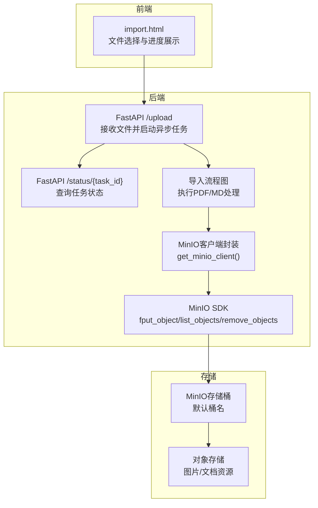
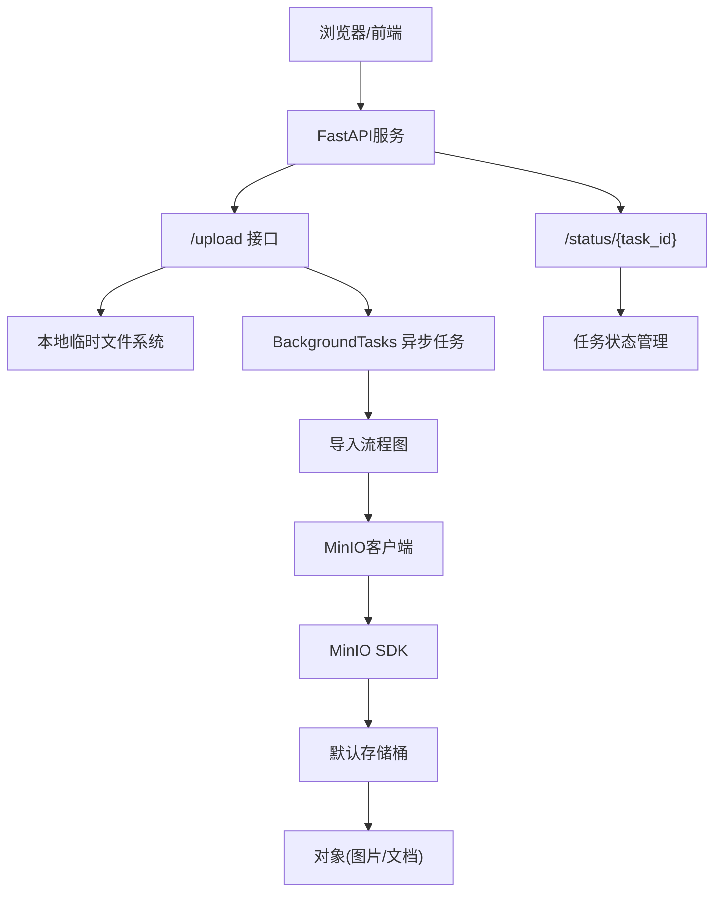
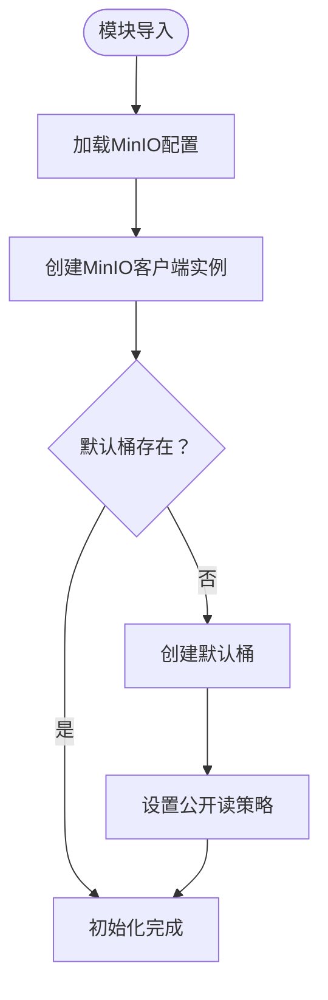
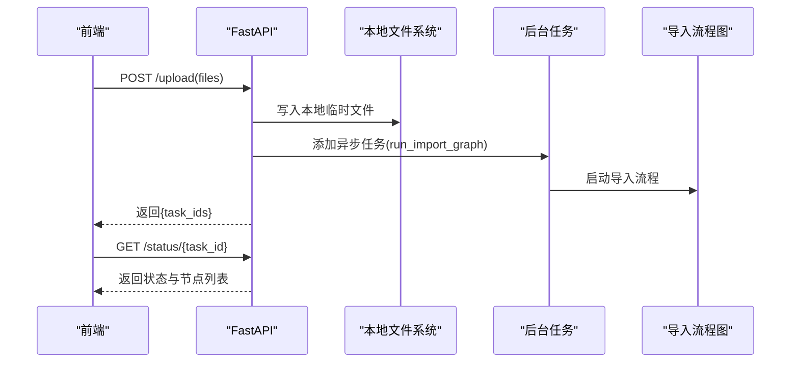
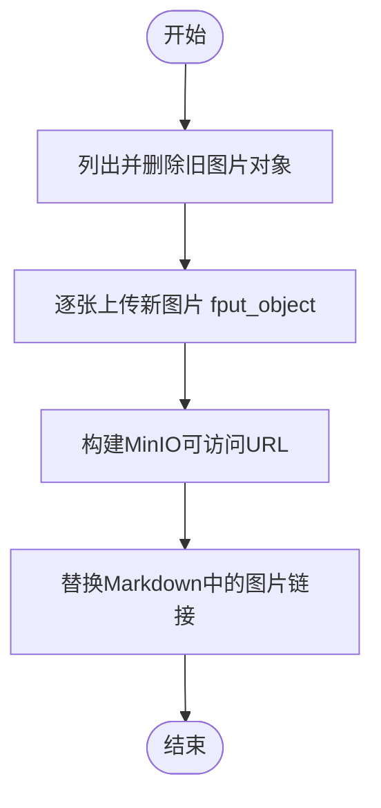
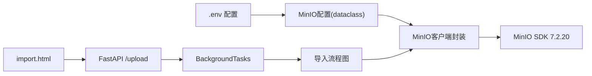

# MinIO对象存储集成

<cite>
**本文引用的文件**
- [app/clients/minio_utils.py](file://app/clients/minio_utils.py)
- [app/conf/minio_config.py](file://app/conf/minio_config.py)
- [app/import_process/api/import_server.py](file://app/import_process/api/import_server.py)
- [app/import_process/page/import.html](file://app/import_process/page/import.html)
- [app/import_process/agent/nodes/node_md_img.py](file://app/import_process/agent/nodes/node_md_img.py)
- [app/utils/task_utils.py](file://app/utils/task_utils.py)
- [app/utils/rate_limit_utils.py](file://app/utils/rate_limit_utils.py)
- [uv.lock](file://uv.lock)
- [CLAUDE.md](file://CLAUDE.md)
</cite>

## 目录
1. [简介](#简介)
2. [项目结构](#项目结构)
3. [核心组件](#核心组件)
4. [架构概览](#架构概览)
5. [详细组件分析](#详细组件分析)
6. [依赖分析](#依赖分析)
7. [性能考虑](#性能考虑)
8. [故障排查指南](#故障排查指南)
9. [结论](#结论)
10. [附录](#附录)

## 简介
本文件面向MinIO对象存储在RAG系统中的集成，围绕以下目标展开：初始化与连接管理、文件上传/下载/删除流程、存储桶管理与权限控制、安全配置、分片上传与断点续传策略、并发上传优化、存储策略与生命周期管理、成本优化建议、错误处理与重试机制、监控与告警方案。本文基于仓库现有实现进行技术文档化，重点聚焦于MinIO客户端封装、上传流程、图片资源上传与替换、以及任务状态与进度监控。

## 项目结构
MinIO集成主要涉及三部分：
- 客户端封装与配置：在客户端层提供单例MinIO客户端，并在启动时自动创建桶与设置公开读策略。
- 上传流程与前端交互：后端FastAPI提供上传接口，前端页面负责文件选择与进度展示，后端将文件落地后再异步执行导入图。
- 资源上传与替换：在导入流程中，将文档内图片上传至MinIO并替换为可访问URL。

图表来源
- [app/import_process/api/import_server.py:98-166](file://app/import_process/api/import_server.py#L98-L166)
- [app/clients/minio_utils.py:42-43](file://app/clients/minio_utils.py#L42-L43)
- [app/import_process/page/import.html:241-257](file://app/import_process/page/import.html#L241-L257)

章节来源
- [app/import_process/api/import_server.py:1-171](file://app/import_process/api/import_server.py#L1-L171)
- [app/clients/minio_utils.py:1-43](file://app/clients/minio_utils.py#L1-L43)
- [app/import_process/page/import.html:176-275](file://app/import_process/page/import.html#L176-L275)

## 核心组件
- MinIO客户端封装与初始化
  - 在模块加载时创建MinIO客户端实例，使用配置文件中的endpoint/access_key/secret_key等参数。
  - 若默认桶不存在，则自动创建并设置公开读策略（允许匿名GetObject）。
  - 提供get_minio_client()单例方法供其他模块使用。
- MinIO配置
  - 通过dotenv提前加载.env，使用dataclass定义配置项，包括endpoint、access_key、secret_key、bucket_name、minio_img_dir、minio_secure。
- 上传接口与任务状态
  - FastAPI提供POST /upload接收文件，写入本地临时目录后异步启动导入流程。
  - 提供GET /status/{task_id}查询任务状态，结合内存中的任务管理工具进行进度追踪。
- 图片资源上传与替换
  - 在导入流程中，列出并删除旧图片对象，随后将新图片以fput_object上传至指定目录，最后替换Markdown中的图片链接为MinIO可访问URL。

章节来源
- [app/clients/minio_utils.py:13-43](file://app/clients/minio_utils.py#L13-L43)
- [app/conf/minio_config.py:11-29](file://app/conf/minio_config.py#L11-L29)
- [app/import_process/api/import_server.py:98-166](file://app/import_process/api/import_server.py#L98-L166)
- [app/import_process/agent/nodes/node_md_img.py:219-281](file://app/import_process/agent/nodes/node_md_img.py#L219-L281)

## 架构概览
MinIO在系统中的角色是作为对象存储后端，支撑文档与图片资源的持久化。整体架构如下：

图表来源
- [app/import_process/api/import_server.py:98-166](file://app/import_process/api/import_server.py#L98-L166)
- [app/utils/task_utils.py:71-187](file://app/utils/task_utils.py#L71-L187)
- [app/clients/minio_utils.py:13-43](file://app/clients/minio_utils.py#L13-L43)

## 详细组件分析

### MinIO客户端初始化与连接管理
- 初始化流程
  - 在模块导入时，依据配置创建MinIO客户端实例，使用secure参数控制是否启用HTTPS。
  - 自检默认桶是否存在，不存在则创建并设置公开读策略（允许匿名GetObject）。
- 连接特性
  - 当前实现未显式设置超时、重试、连接池等高级参数，属于基础连接。
  - secure参数来源于配置，若minio_secure为True则使用HTTPS，否则HTTP。

图表来源
- [app/clients/minio_utils.py:13-43](file://app/clients/minio_utils.py#L13-L43)
- [app/conf/minio_config.py:22-29](file://app/conf/minio_config.py#L22-L29)

章节来源
- [app/clients/minio_utils.py:13-43](file://app/clients/minio_utils.py#L13-L43)
- [app/conf/minio_config.py:11-29](file://app/conf/minio_config.py#L11-L29)

### 文件上传流程（后端）
- 接口行为
  - POST /upload接收文件，为每个文件生成task_id，写入本地临时目录，然后通过BackgroundTasks异步启动导入流程。
  - 返回包含task_ids的JSON响应，前端据此轮询状态。
- 任务状态
  - GET /status/{task_id}返回任务全局状态、已完成节点列表、运行中节点列表，便于前端展示进度。

图表来源
- [app/import_process/api/import_server.py:98-166](file://app/import_process/api/import_server.py#L98-L166)
- [app/import_process/page/import.html:241-257](file://app/import_process/page/import.html#L241-L257)

章节来源
- [app/import_process/api/import_server.py:98-166](file://app/import_process/api/import_server.py#L98-L166)
- [app/import_process/page/import.html:241-257](file://app/import_process/page/import.html#L241-L257)

### 图片上传与替换（导入流程节点）
- 功能概述
  - 在导入流程中，先列出并删除与当前文档关联的旧图片对象，再将新图片以fput_object上传至指定目录（桶/目录/文件名），最后替换Markdown中的图片链接为MinIO可访问URL。
- 关键点
  - 使用get_minio_client()获取客户端实例。
  - 通过list_objects与remove_objects批量清理旧对象。
  - 上传时指定content_type为image/jpeg，便于浏览器正确渲染。
  - 生成URL时使用配置中的endpoint、bucket_name与minio_img_dir组合。

图表来源
- [app/import_process/agent/nodes/node_md_img.py:219-281](file://app/import_process/agent/nodes/node_md_img.py#L219-L281)
- [app/clients/minio_utils.py:42-43](file://app/clients/minio_utils.py#L42-L43)

章节来源
- [app/import_process/agent/nodes/node_md_img.py:219-281](file://app/import_process/agent/nodes/node_md_img.py#L219-L281)

### 存储桶管理与权限控制
- 桶创建与策略
  - 若默认桶不存在，自动创建并设置公开读策略（允许匿名GetObject），便于前端直接访问图片。
- 安全建议
  - 当前策略为公开读，适用于演示或内网环境；生产环境建议收紧策略，仅授予必要权限并启用TLS与强认证。

章节来源
- [app/clients/minio_utils.py:27-40](file://app/clients/minio_utils.py#L27-L40)

### 下载与删除操作
- 删除
  - 通过list_objects列出目标前缀下的对象，构造DeleteObject列表，调用remove_objects批量删除。
- 下载
  - 当前实现未提供专门的下载接口；公开读策略允许直接通过URL访问对象，前端可直接使用生成的URL进行访问。

章节来源
- [app/import_process/agent/nodes/node_md_img.py:235-246](file://app/import_process/agent/nodes/node_md_img.py#L235-L246)

### 分片上传、断点续传与并发上传
- 现状
  - 代码中使用fput_object进行文件上传，未见分片上传（multipart upload）与断点续传的具体实现。
- 优化建议
  - 对于大文件，建议引入分片上传与并发上传策略，结合任务状态与重试机制提升稳定性与吞吐。
  - 并发上传可通过多线程/多进程或异步I/O实现，配合进度上报与错误恢复。

章节来源
- [app/import_process/agent/nodes/node_md_img.py:254-259](file://app/import_process/agent/nodes/node_md_img.py#L254-L259)

### 存储策略、生命周期与成本优化
- 存储策略
  - 可结合业务对不同目录（如图片/文档）设置不同存储类别与冗余级别。
- 生命周期管理
  - 建议为临时导入目录设置生命周期规则，定期清理过期对象，降低存储成本。
- 成本优化
  - 合理设置对象版本与回收站策略，避免不必要的存储占用。
  - 对静态资源采用CDN加速与缓存策略，减少带宽消耗。

（本节为通用实践建议，不直接分析具体文件）

### 错误处理、重试与监控告警
- 错误处理
  - 图片上传过程中使用try/except捕获异常并记录日志，避免中断流程。
- 重试机制
  - 当前未实现自动重试；可在上传失败时增加指数退避重试与最大重试次数控制。
- 监控与告警
  - 任务状态通过内存字典与SSE推送，前端可展示成功率、处理中数量与延迟等指标。
  - 建议接入外部监控系统，采集上传失败率、平均耗时、对象数量等指标并设置告警。

章节来源
- [app/import_process/agent/nodes/node_md_img.py:264-266](file://app/import_process/agent/nodes/node_md_img.py#L264-L266)
- [app/utils/task_utils.py:71-187](file://app/utils/task_utils.py#L71-L187)

## 依赖分析
- MinIO SDK版本
  - 项目依赖minio==7.2.20，提供对象存储核心能力。
- 环境变量与配置
  - 通过dotenv加载.env，配置项包括MINIO_ENDPOINT、MINIO_ACCESS_KEY、MINIO_SECRET_KEY、MINIO_BUCKET_NAME、MINIO_IMG_DIR、MINIO_SECURE。
- 前后端交互
  - 前端import.html通过fetch调用后端上传接口，后端通过FastAPI提供REST接口与任务状态查询。

图表来源
- [uv.lock:1901-1914](file://uv.lock#L1901-L1914)
- [app/conf/minio_config.py:22-29](file://app/conf/minio_config.py#L22-L29)
- [app/import_process/page/import.html:241-257](file://app/import_process/page/import.html#L241-L257)
- [app/import_process/api/import_server.py:98-166](file://app/import_process/api/import_server.py#L98-L166)

章节来源
- [uv.lock:1901-1914](file://uv.lock#L1901-L1914)
- [app/conf/minio_config.py:22-29](file://app/conf/minio_config.py#L22-L29)
- [app/import_process/page/import.html:241-257](file://app/import_process/page/import.html#L241-L257)
- [app/import_process/api/import_server.py:98-166](file://app/import_process/api/import_server.py#L98-L166)

## 性能考虑
- 连接与传输
  - 当前未设置超时与重试参数，建议在生产环境启用TLS与连接池，提升稳定性。
- 并发与吞吐
  - 对于大文件与高并发场景，建议引入分片上传与并发上传策略，结合进度上报与失败重试。
- 存储与网络
  - 对静态资源启用CDN与缓存，减少带宽与延迟；对临时目录设置生命周期规则，降低长期存储成本。

（本节提供一般性指导，不直接分析具体文件）

## 故障排查指南
- 无法连接MinIO
  - 检查MINIO_ENDPOINT、MINIO_SECURE配置是否正确；确认网络连通性与防火墙策略。
- 上传失败
  - 查看后端日志，定位异常点；对图片上传增加重试与最大重试次数控制。
- 任务状态异常
  - 确认任务状态管理工具正常运行，检查任务ID生成与轮询频率。
- 权限问题
  - 若图片无法访问，检查桶策略是否为公开读；生产环境建议收紧权限并启用鉴权。

章节来源
- [app/import_process/agent/nodes/node_md_img.py:264-266](file://app/import_process/agent/nodes/node_md_img.py#L264-L266)
- [app/utils/task_utils.py:71-187](file://app/utils/task_utils.py#L71-L187)

## 结论
本项目在MinIO集成方面提供了简洁可靠的客户端封装与上传流程，能够满足基本的文档与图片资源存储需求。为进一步提升稳定性与性能，建议引入分片上传、断点续传、并发上传与重试机制，完善权限控制与监控告警体系，并结合生命周期策略与CDN优化实现成本与性能的平衡。

## 附录
- 外部服务参考
  - MinIO服务地址与端口在文档中有明确说明，便于部署与联调。

章节来源
- [CLAUDE.md:105-112](file://CLAUDE.md#L105-L112)