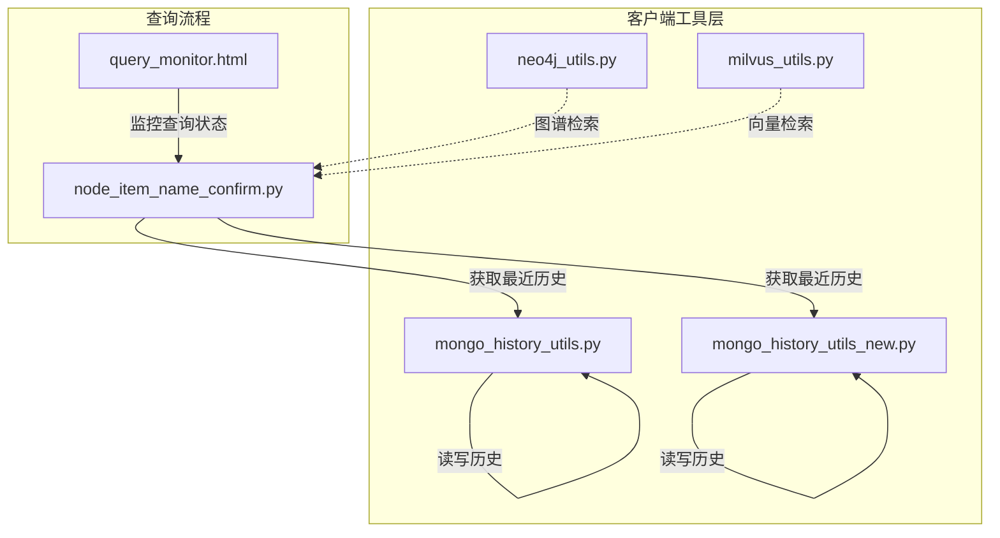
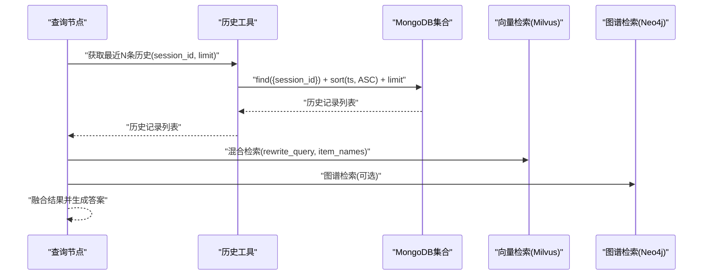
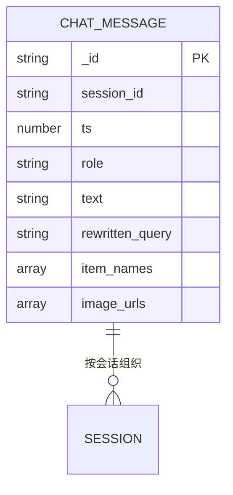
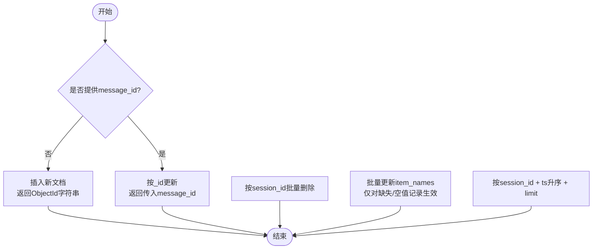
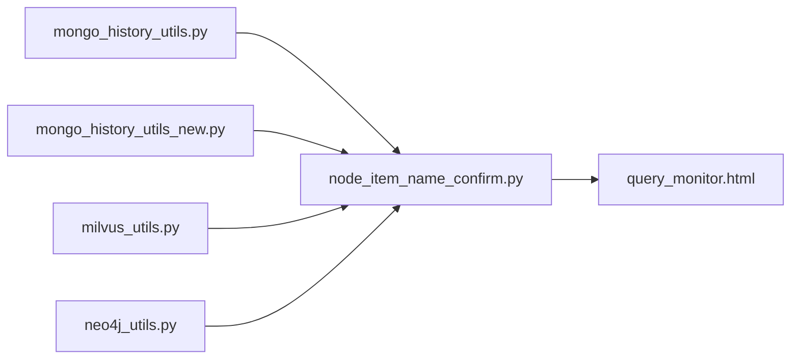

# MongoDB历史数据管理

<cite>
**本文引用的文件**
- [mongo_history_utils.py](file://app/clients/mongo_history_utils.py)
- [mongo_history_utils_new.py](file://app/clients/mongo_history_utils_new.py)
- [neo4j_utils.py](file://app/clients/neo4j_utils.py)
- [milvus_utils.py](file://app/clients/milvus_utils.py)
- [node_item_name_confirm.py](file://app/query_process/agent/nodes/node_item_name_confirm.py)
- [query_monitor.html](file://app/query_process/page/query_monitor.html)
</cite>

## 目录
1. [简介](#简介)
2. [项目结构](#项目结构)
3. [核心组件](#核心组件)
4. [架构总览](#架构总览)
5. [详细组件分析](#详细组件分析)
6. [依赖分析](#依赖分析)
7. [性能考虑](#性能考虑)
8. [故障排查指南](#故障排查指南)
9. [结论](#结论)
10. [附录](#附录)

## 简介
本技术文档围绕MongoDB历史数据管理展开，聚焦对话历史存储的架构设计与数据模型，系统阐述历史记录的增删改查操作、查询优化策略，并覆盖分页查询、时间范围筛选与模糊匹配的扩展能力建议。同时，文档给出历史数据的清理策略、归档机制与存储优化建议，以及连接池配置、事务处理与一致性保障的实现方案。最后，提供历史数据迁移、备份恢复与性能监控的最佳实践。

## 项目结构
本项目采用“按职责分层”的组织方式，历史数据管理位于客户端工具层，负责与MongoDB交互；查询流程中通过历史工具读取最近N条上下文；其他子系统（如Neo4j、Milvus）分别承担图谱与向量检索能力。

图表来源
- [mongo_history_utils.py:1-242](file://app/clients/mongo_history_utils.py#L1-L242)
- [mongo_history_utils_new.py:1-248](file://app/clients/mongo_history_utils_new.py#L1-L248)
- [neo4j_utils.py:1-12](file://app/clients/neo4j_utils.py#L1-L12)
- [milvus_utils.py:164-187](file://app/clients/milvus_utils.py#L164-L187)
- [node_item_name_confirm.py:61-96](file://app/query_process/agent/nodes/node_item_name_confirm.py#L61-L96)
- [query_monitor.html:83-142](file://app/query_process/page/query_monitor.html#L83-L142)

章节来源
- [mongo_history_utils.py:1-242](file://app/clients/mongo_history_utils.py#L1-L242)
- [mongo_history_utils_new.py:1-248](file://app/clients/mongo_history_utils_new.py#L1-L248)
- [neo4j_utils.py:1-12](file://app/clients/neo4j_utils.py#L1-L12)
- [milvus_utils.py:164-187](file://app/clients/milvus_utils.py#L164-L187)
- [node_item_name_confirm.py:61-96](file://app/query_process/agent/nodes/node_item_name_confirm.py#L61-L96)
- [query_monitor.html:83-142](file://app/query_process/page/query_monitor.html#L83-L142)

## 核心组件
- 历史Mongo工具类：封装MongoDB连接、集合初始化与索引创建，提供单例模式避免重复连接。
- 历史读写接口：提供保存、清空、批量更新与最近消息查询等能力。
- 查询流程集成：在查询主流程中调用最近消息接口，作为LLM上下文输入的一部分。

章节来源
- [mongo_history_utils.py:21-83](file://app/clients/mongo_history_utils.py#L21-L83)
- [mongo_history_utils_new.py:21-217](file://app/clients/mongo_history_utils_new.py#L21-L217)
- [node_item_name_confirm.py:61-96](file://app/query_process/agent/nodes/node_item_name_confirm.py#L61-L96)

## 架构总览
历史数据在MongoDB中以集合形式存储，按会话维度组织，使用复合索引加速按会话与时间的查询。查询流程通过最近消息接口获取上下文，结合向量与图谱检索形成最终答案。

图表来源
- [mongo_history_utils.py:193-221](file://app/clients/mongo_history_utils.py#L193-L221)
- [mongo_history_utils_new.py:169-197](file://app/clients/mongo_history_utils_new.py#L169-L197)
- [milvus_utils.py:164-187](file://app/clients/milvus_utils.py#L164-L187)
- [neo4j_utils.py:1-12](file://app/clients/neo4j_utils.py#L1-L12)

## 详细组件分析

### 数据模型与索引设计
- 集合：chat_message
- 关键字段
  - session_id：会话标识，用于按会话聚合与查询
  - ts：时间戳，用于排序与时间范围筛选
  - role：消息角色（user/assistant）
  - text：消息文本
  - rewritten_query：重写查询（检索增强）
  - item_names：关联商品名称列表
  - image_urls：图片URL列表（在旧版本接口中存在）
- 复合索引
  - 索引字段：(session_id, ts)
  - 作用：加速“按会话查询最新记录”的核心场景

图表来源
- [mongo_history_utils.py:134-142](file://app/clients/mongo_history_utils.py#L134-L142)
- [mongo_history_utils.py:45-49](file://app/clients/mongo_history_utils.py#L45-L49)
- [mongo_history_utils_new.py:105-112](file://app/clients/mongo_history_utils_new.py#L105-L112)
- [mongo_history_utils_new.py:46-49](file://app/clients/mongo_history_utils_new.py#L46-L49)

章节来源
- [mongo_history_utils.py:134-142](file://app/clients/mongo_history_utils.py#L134-L142)
- [mongo_history_utils.py:45-49](file://app/clients/mongo_history_utils.py#L45-L49)
- [mongo_history_utils_new.py:105-112](file://app/clients/mongo_history_utils_new.py#L105-L112)
- [mongo_history_utils_new.py:46-49](file://app/clients/mongo_history_utils_new.py#L46-L49)

### 增删改查操作与实现要点
- 保存消息
  - 新增：构造文档并插入，返回ObjectId字符串
  - 更新：按_id更新指定字段
- 清空历史
  - 按session_id批量删除
- 批量更新
  - 仅对item_names为空/不存在/None的记录进行更新
- 最近消息查询
  - 按session_id过滤，按ts升序，限制返回条数

图表来源
- [mongo_history_utils.py:109-160](file://app/clients/mongo_history_utils.py#L109-L160)
- [mongo_history_utils.py:87-107](file://app/clients/mongo_history_utils.py#L87-L107)
- [mongo_history_utils.py:162-191](file://app/clients/mongo_history_utils.py#L162-L191)
- [mongo_history_utils.py:193-221](file://app/clients/mongo_history_utils.py#L193-L221)

章节来源
- [mongo_history_utils.py:109-160](file://app/clients/mongo_history_utils.py#L109-L160)
- [mongo_history_utils.py:87-107](file://app/clients/mongo_history_utils.py#L87-L107)
- [mongo_history_utils.py:162-191](file://app/clients/mongo_history_utils.py#L162-L191)
- [mongo_history_utils.py:193-221](file://app/clients/mongo_history_utils.py#L193-L221)

### 查询优化策略
- 复合索引
  - (session_id, ts)：满足按会话查询与时间排序需求
- 查询模式
  - 使用session_id精确过滤
  - 使用ts升序保证上下文顺序
  - 使用limit控制上下文长度
- 扩展优化建议
  - 时间范围筛选：在查询条件中增加ts范围
  - 模糊匹配：对text字段建立文本索引并使用正则或全文检索
  - 分页查询：基于last_ts与方向参数实现游标分页

章节来源
- [mongo_history_utils.py:45-49](file://app/clients/mongo_history_utils.py#L45-L49)
- [mongo_history_utils.py:193-221](file://app/clients/mongo_history_utils.py#L193-L221)

### 历史数据清理、归档与存储优化
- 清理策略
  - 按会话清空：clear_history(session_id)
  - 按时间阈值清理：可在查询条件中加入ts下界，配合删除操作
- 归档机制
  - 建议定期将历史迁移到独立集合或冷存储，保留索引字段
  - 归档后可删除热存储中的冗余数据
- 存储优化
  - 控制单条消息大小：避免过长text与过多image_urls
  - 合理设置item_names与rewritten_query的必要性
  - 定期压缩与重建索引

章节来源
- [mongo_history_utils.py:87-107](file://app/clients/mongo_history_utils.py#L87-L107)

### 连接池配置、事务与一致性
- 连接池
  - 使用MongoClient默认连接池行为；生产环境建议显式配置连接池参数（如maxPoolSize、minPoolSize、maxIdleTimeMS等）
- 事务
  - MongoDB单文档更新与批量更新具备原子性；跨文档事务需在应用层协调或使用多文档事务
- 一致性
  - 读写分离：查询使用就近副本；强一致读可通过读偏好或直接读主库实现
  - 幂等写：更新接口按_id更新，避免重复写入

章节来源
- [mongo_history_utils.py:32-57](file://app/clients/mongo_history_utils.py#L32-L57)
- [mongo_history_utils_new.py:28-58](file://app/clients/mongo_history_utils_new.py#L28-L58)

### 历史数据迁移、备份与恢复
- 迁移
  - 使用聚合管道或导出导入工具进行结构变更迁移
  - 保持session_id与ts字段不变，逐步引入新字段
- 备份
  - 使用mongodump/mongorestore或云服务备份策略
- 恢复
  - 增量备份结合时间点恢复，确保历史数据可回滚

（本节为通用最佳实践，不直接分析具体文件）

### 性能监控与可观测性
- 查询监控
  - 在查询流程中记录会话ID、延迟、状态等指标
  - 前端监控页面可展示最近查询摘要与详情
- 指标采集
  - 延迟、成功率、吞吐量、错误率
  - 历史查询条数、平均上下文长度

章节来源
- [query_monitor.html:83-142](file://app/query_process/page/query_monitor.html#L83-L142)

## 依赖分析
历史工具与查询流程之间的耦合主要体现在最近消息读取上，其他子系统（Milvus、Neo4j）通过查询流程间接参与最终答案生成。

图表来源
- [mongo_history_utils.py:193-221](file://app/clients/mongo_history_utils.py#L193-L221)
- [mongo_history_utils_new.py:169-197](file://app/clients/mongo_history_utils_new.py#L169-L197)
- [node_item_name_confirm.py:61-96](file://app/query_process/agent/nodes/node_item_name_confirm.py#L61-L96)
- [milvus_utils.py:164-187](file://app/clients/milvus_utils.py#L164-L187)
- [neo4j_utils.py:1-12](file://app/clients/neo4j_utils.py#L1-L12)
- [query_monitor.html:83-142](file://app/query_process/page/query_monitor.html#L83-L142)

章节来源
- [mongo_history_utils.py:193-221](file://app/clients/mongo_history_utils.py#L193-L221)
- [mongo_history_utils_new.py:169-197](file://app/clients/mongo_history_utils_new.py#L169-L197)
- [node_item_name_confirm.py:61-96](file://app/query_process/agent/nodes/node_item_name_confirm.py#L61-L96)
- [milvus_utils.py:164-187](file://app/clients/milvus_utils.py#L164-L187)
- [neo4j_utils.py:1-12](file://app/clients/neo4j_utils.py#L1-L12)
- [query_monitor.html:83-142](file://app/query_process/page/query_monitor.html#L83-L142)

## 性能考虑
- 索引与查询
  - 复合索引支撑按会话与时间的高效查询
  - 上下文长度限制减少网络与内存压力
- 批量操作
  - 批量更新仅对缺失字段记录生效，降低无效写入
- 连接与资源
  - 单例模式避免重复连接
  - 生产环境建议显式配置连接池参数
- 监控与告警
  - 延迟与成功率指标纳入SLA，异常及时告警

（本节提供通用指导，不直接分析具体文件）

## 故障排查指南
- 连接失败
  - 检查MONGO_URL与MONGO_DB_NAME环境变量
  - 查看初始化异常日志
- 查询异常
  - 捕获异常并记录错误日志，返回空列表避免上游崩溃
- 删除与更新异常
  - 记录受影响的会话ID或主键列表，定位问题批次

章节来源
- [mongo_history_utils.py:52-56](file://app/clients/mongo_history_utils.py#L52-L56)
- [mongo_history_utils.py:104-106](file://app/clients/mongo_history_utils.py#L104-L106)
- [mongo_history_utils.py:217-220](file://app/clients/mongo_history_utils.py#L217-L220)

## 结论
本方案以简洁的数据模型与合理的索引设计为基础，结合单例连接与批量操作，实现了高效的历史数据读写与查询。通过明确的清理与归档策略、连接池与一致性保障，以及完善的监控体系，能够满足生产环境对稳定性与性能的要求。未来可在时间范围筛选、模糊匹配与游标分页等方面进一步完善查询能力。

## 附录
- 环境变量
  - MONGO_URL：MongoDB连接地址
  - MONGO_DB_NAME：数据库名称
- 关键接口路径
  - 保存消息：[save_chat_message:109-160](file://app/clients/mongo_history_utils.py#L109-L160)
  - 清空历史：[clear_history:87-107](file://app/clients/mongo_history_utils.py#L87-L107)
  - 批量更新item_names：[update_message_item_names:162-191](file://app/clients/mongo_history_utils.py#L162-L191)
  - 最近消息查询：[get_recent_messages:193-221](file://app/clients/mongo_history_utils.py#L193-L221)