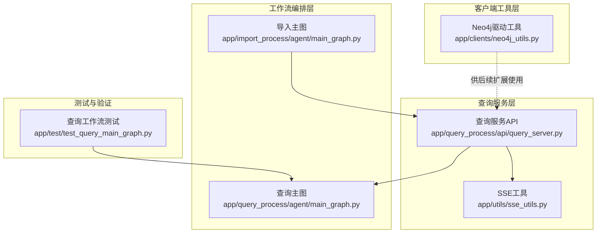
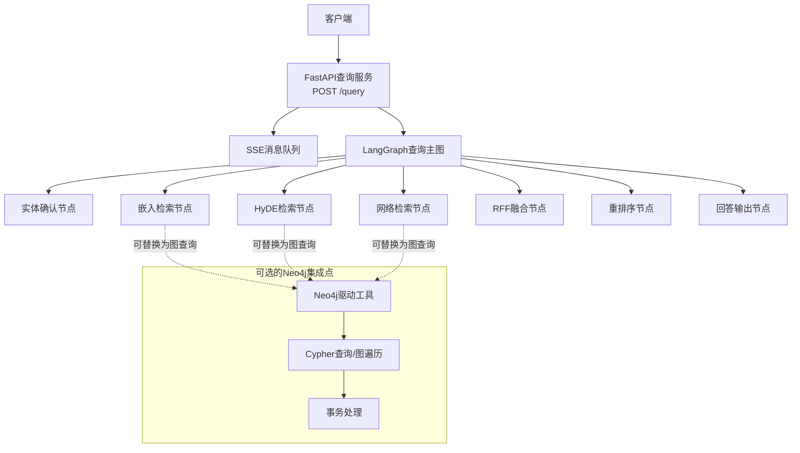
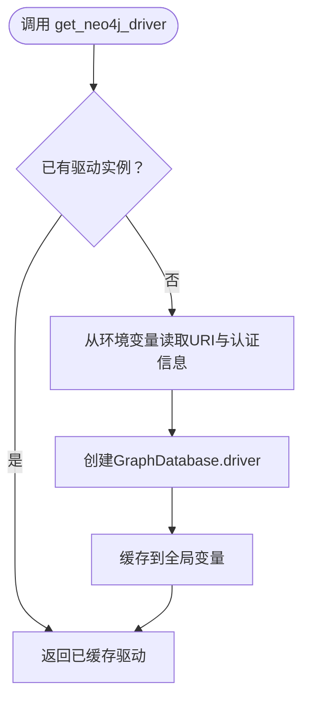
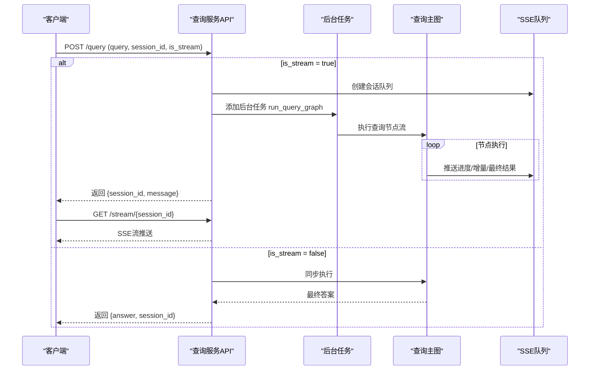
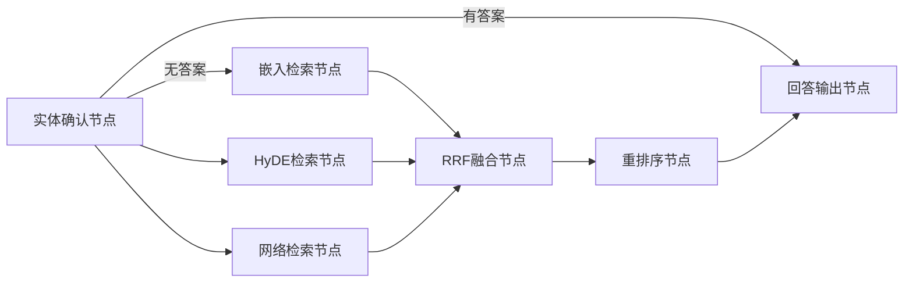
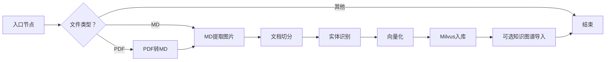
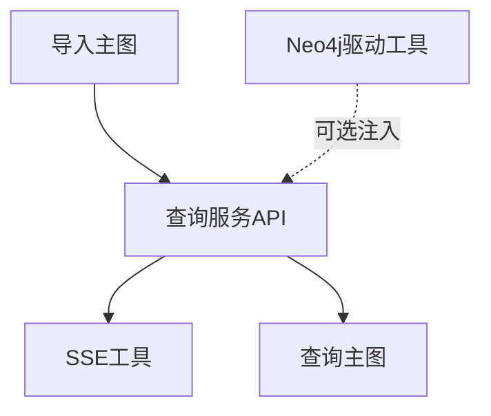

# Neo4j知识图谱集成

<cite>
**本文引用的文件**
- [app/clients/neo4j_utils.py](file://app/clients/neo4j_utils.py)
- [app/query_process/api/query_server.py](file://app/query_process/api/query_server.py)
- [app/utils/sse_utils.py](file://app/utils/sse_utils.py)
- [app/import_process/agent/main_graph.py](file://app/import_process/agent/main_graph.py)
- [app/query_process/agent/main_graph.py](file://app/query_process/agent/main_graph.py)
- [app/test/test_query_main_graph.py](file://app/test/test_query_main_graph.py)
</cite>

## 目录
1. [简介](#简介)
2. [项目结构](#项目结构)
3. [核心组件](#核心组件)
4. [架构概览](#架构概览)
5. [详细组件分析](#详细组件分析)
6. [依赖分析](#依赖分析)
7. [性能考虑](#性能考虑)
8. [故障排查指南](#故障排查指南)
9. [结论](#结论)
10. [附录](#附录)

## 简介
本文件面向Neo4j知识图谱集成场景，基于仓库现有代码进行系统性技术文档梳理。重点覆盖以下方面：
- Neo4j连接管理与会话处理机制
- Cypher查询与图遍历在查询流程中的应用现状
- 实体关系查询、路径查找与图算法的落地位置与扩展建议
- 图数据的增删改查与事务处理策略
- 查询优化、索引配置与性能调优最佳实践
- 图数据同步、缓存策略与监控告警实现方案

说明：当前仓库中仅存在Neo4j驱动的单例初始化工具，未发现显式的Cypher查询、图遍历或图算法实现；查询流程以LangGraph编排为主，涉及Neo4j的部分需在后续扩展中补充。

## 项目结构
围绕Neo4j集成的关键模块分布如下：
- 客户端工具层：提供Neo4j驱动单例初始化与连接参数加载
- 查询服务层：基于FastAPI提供查询接口，支持同步/异步与SSE流式输出
- 工作流编排层：LangGraph定义导入与查询的节点与边，形成可扩展的处理图
- 工具与测试：SSE消息封装、查询工作流测试脚本

**图表来源**
- [app/clients/neo4j_utils.py:1-12](file://app/clients/neo4j_utils.py#L1-L12)
- [app/query_process/api/query_server.py:78-133](file://app/query_process/api/query_server.py#L78-L133)
- [app/utils/sse_utils.py:1-40](file://app/utils/sse_utils.py#L1-L40)
- [app/import_process/agent/main_graph.py:1-134](file://app/import_process/agent/main_graph.py#L1-L134)
- [app/query_process/agent/main_graph.py:1-47](file://app/query_process/agent/main_graph.py#L1-L47)
- [app/test/test_query_main_graph.py:1-26](file://app/test/test_query_main_graph.py#L1-L26)

**章节来源**
- [app/clients/neo4j_utils.py:1-12](file://app/clients/neo4j_utils.py#L1-L12)
- [app/query_process/api/query_server.py:78-133](file://app/query_process/api/query_server.py#L78-L133)
- [app/utils/sse_utils.py:1-40](file://app/utils/sse_utils.py#L1-L40)
- [app/import_process/agent/main_graph.py:1-134](file://app/import_process/agent/main_graph.py#L1-L134)
- [app/query_process/agent/main_graph.py:1-47](file://app/query_process/agent/main_graph.py#L1-L47)
- [app/test/test_query_main_graph.py:1-26](file://app/test/test_query_main_graph.py#L1-L26)

## 核心组件
- Neo4j驱动工具：提供全局唯一的GraphDatabase驱动实例，通过环境变量加载URI与认证信息，避免重复创建连接
- 查询服务API：暴露POST /query接口，支持同步与异步两种模式；异步模式下通过SSE队列向客户端推送中间结果
- SSE工具：维护按会话隔离的消息队列，封装SSE事件类型与消息打包
- LangGraph查询主图：定义查询阶段的节点与条件边，形成“实体确认→多路检索→融合排序→回答输出”的处理链
- LangGraph导入主图：定义从PDF/Markdown到向量入库再到知识图谱导入的处理链（与Neo4j集成可在此扩展）

**章节来源**
- [app/clients/neo4j_utils.py:1-12](file://app/clients/neo4j_utils.py#L1-L12)
- [app/query_process/api/query_server.py:78-133](file://app/query_process/api/query_server.py#L78-L133)
- [app/utils/sse_utils.py:1-40](file://app/utils/sse_utils.py#L1-L40)
- [app/query_process/agent/main_graph.py:1-47](file://app/query_process/agent/main_graph.py#L1-L47)
- [app/import_process/agent/main_graph.py:1-134](file://app/import_process/agent/main_graph.py#L1-L134)

## 架构概览
整体架构由“查询入口—工作流编排—外部系统对接”三层组成。当前查询链路主要依赖嵌入检索与重排序，Neo4j作为潜在的知识存储与推理后端尚未在代码中体现具体Cypher实现。后续可在查询节点中引入Neo4j查询能力，并在导入流程中将实体/关系写入图数据库。

**图表来源**
- [app/query_process/api/query_server.py:78-133](file://app/query_process/api/query_server.py#L78-L133)
- [app/query_process/agent/main_graph.py:1-47](file://app/query_process/agent/main_graph.py#L1-L47)
- [app/clients/neo4j_utils.py:1-12](file://app/clients/neo4j_utils.py#L1-L12)

## 详细组件分析

### Neo4j驱动工具
- 单例模式：通过全局变量缓存GraphDatabase.driver实例，避免重复初始化
- 认证与连接：从环境变量读取URI与用户名/密码，构造驱动
- 使用建议：后续在查询节点中注入该驱动，用于Cypher执行与事务控制

**图表来源**
- [app/clients/neo4j_utils.py:1-12](file://app/clients/neo4j_utils.py#L1-L12)

**章节来源**
- [app/clients/neo4j_utils.py:1-12](file://app/clients/neo4j_utils.py#L1-L12)

### 查询服务API（同步/异步与SSE）
- 同步模式：直接执行查询图，完成后返回最终答案
- 异步模式：立即返回会话标识，后台任务执行查询图并通过SSE推送中间事件
- 异常处理：捕获异常，更新任务状态为失败并向会话推送错误事件

**图表来源**
- [app/query_process/api/query_server.py:78-133](file://app/query_process/api/query_server.py#L78-L133)
- [app/utils/sse_utils.py:1-40](file://app/utils/sse_utils.py#L1-L40)

**章节来源**
- [app/query_process/api/query_server.py:78-133](file://app/query_process/api/query_server.py#L78-L133)
- [app/utils/sse_utils.py:1-40](file://app/utils/sse_utils.py#L1-L40)

### LangGraph查询主图
- 节点：实体确认、嵌入检索、HyDE检索、网络检索、RRF融合、重排序、回答输出
- 边：根据实体确认阶段的输出决定是否提前终止或并行触发多路检索
- 可扩展点：将检索节点替换为基于Neo4j的Cypher查询节点，实现实体关系查询与路径查找

**图表来源**
- [app/query_process/agent/main_graph.py:1-47](file://app/query_process/agent/main_graph.py#L1-L47)

**章节来源**
- [app/query_process/agent/main_graph.py:1-47](file://app/query_process/agent/main_graph.py#L1-L47)

### LangGraph导入主图（与Neo4j集成的切入点）
- 节点：入口、PDF转MD、MD提取图片、文档切分、实体识别、向量化、Milvus入库、（可选）知识图谱导入
- 边：根据文件类型路由到不同分支，最终汇聚到向量化与入库
- Neo4j集成建议：在“实体识别”之后增加“写入Neo4j”节点，将识别出的实体与关系持久化至图数据库

**图表来源**
- [app/import_process/agent/main_graph.py:1-134](file://app/import_process/agent/main_graph.py#L1-L134)

**章节来源**
- [app/import_process/agent/main_graph.py:1-134](file://app/import_process/agent/main_graph.py#L1-L134)

### 查询工作流测试
- 通过测试脚本验证查询主图的节点执行顺序与最终状态输出
- 便于在新增Neo4j查询节点后进行回归验证

**章节来源**
- [app/test/test_query_main_graph.py:1-26](file://app/test/test_query_main_graph.py#L1-L26)

## 依赖分析
- 查询服务API依赖SSE工具进行消息推送
- 查询主图依赖LangGraph进行节点编排
- Neo4j驱动工具为可选依赖，后续在查询或导入节点中按需注入
- 导入主图与查询主图相互独立，分别服务于“构建知识”和“检索知识”的场景

**图表来源**
- [app/query_process/api/query_server.py:78-133](file://app/query_process/api/query_server.py#L78-L133)
- [app/utils/sse_utils.py:1-40](file://app/utils/sse_utils.py#L1-L40)
- [app/query_process/agent/main_graph.py:1-47](file://app/query_process/agent/main_graph.py#L1-L47)
- [app/import_process/agent/main_graph.py:1-134](file://app/import_process/agent/main_graph.py#L1-L134)
- [app/clients/neo4j_utils.py:1-12](file://app/clients/neo4j_utils.py#L1-L12)

**章节来源**
- [app/query_process/api/query_server.py:78-133](file://app/query_process/api/query_server.py#L78-L133)
- [app/utils/sse_utils.py:1-40](file://app/utils/sse_utils.py#L1-L40)
- [app/query_process/agent/main_graph.py:1-47](file://app/query_process/agent/main_graph.py#L1-L47)
- [app/import_process/agent/main_graph.py:1-134](file://app/import_process/agent/main_graph.py#L1-L134)
- [app/clients/neo4j_utils.py:1-12](file://app/clients/neo4j_utils.py#L1-L12)

## 性能考虑
- 连接池与单例：Neo4j驱动采用单例，减少连接创建开销
- 异步与SSE：异步执行查询图，SSE推送中间结果，降低前端等待时间
- 查询链路优化：将检索节点替换为图查询时，应结合Cypher查询计划与索引策略进行优化
- 并发与限流：在高并发场景下，建议对查询服务与SSE队列进行限流与背压控制

[本节为通用指导，无需列出章节来源]

## 故障排查指南
- 环境变量缺失：Neo4j驱动初始化依赖NEO4J_URI、NEO4J_USERNAME、NEO4J_PASSWORD，若未设置会导致连接失败
- 会话队列异常：SSE队列按会话隔离，若队列未正确创建或清理，可能导致消息丢失或内存泄漏
- 查询异常：查询服务API捕获异常并推送ERROR事件，可通过会话历史接口查看错误详情

**章节来源**
- [app/clients/neo4j_utils.py:1-12](file://app/clients/neo4j_utils.py#L1-L12)
- [app/query_process/api/query_server.py:78-133](file://app/query_process/api/query_server.py#L78-L133)
- [app/utils/sse_utils.py:1-40](file://app/utils/sse_utils.py#L1-L40)

## 结论
当前仓库提供了Neo4j驱动的基础设施与查询服务的异步/SSE框架，但尚未在代码中实现具体的Cypher查询与图遍历逻辑。建议在以下方向进行扩展：
- 在查询节点中引入Neo4j查询能力，实现实体关系查询与路径查找
- 在导入流程中增加将实体/关系写入Neo4j的节点
- 结合查询计划与索引策略进行性能优化
- 完善监控与告警，覆盖连接状态、查询延迟与SSE队列健康度

[本节为总结性内容，无需列出章节来源]

## 附录

### Cypher查询与图遍历的落地建议
- 查询节点扩展：在LangGraph查询主图中新增“图查询节点”，注入Neo4j驱动，执行Cypher并返回结果
- 图遍历算法：可基于APOC或自定义存储过程实现最短路径、聚类、中心性等算法
- 事务策略：对写入操作使用显式事务，确保一致性；对只读查询使用读事务

[本节为概念性建议，无需列出章节来源]

### 图数据增删改查与事务处理
- 增：在导入流程中将实体与关系写入Neo4j，使用MERGE保证幂等
- 删：提供删除标签/关系的Cypher，配合事务回滚保障安全
- 改：使用SET更新属性，注意批量更新的事务边界
- 查：结合WHERE过滤与LIMIT限制结果集大小，必要时使用EXPLAIN/PROFILE分析

[本节为概念性建议，无需列出章节来源]

### 查询优化、索引配置与性能调优
- 索引：为常用查询属性创建索引或唯一约束，避免全表扫描
- 查询计划：使用EXPLAIN/PROFILE分析Cypher执行计划，消除N+1查询
- 分页与缓存：对高频查询结果进行缓存，结合TTL与失效策略

[本节为通用指导，无需列出章节来源]

### 图数据同步、缓存策略与监控告警
- 同步：导入流程完成后，可定期同步增量数据至Neo4j
- 缓存：对热点实体/路径查询结果进行缓存，降低重复计算
- 监控：埋点记录查询耗时、SSE队列长度、Neo4j连接数与错误率，接入告警系统

[本节为通用指导，无需列出章节来源]