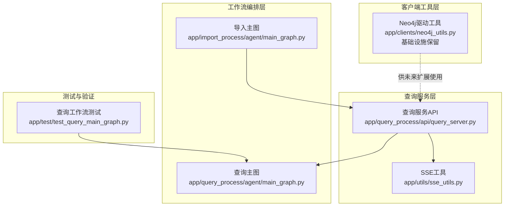
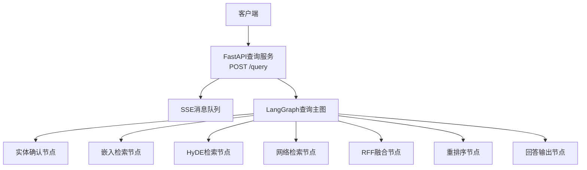
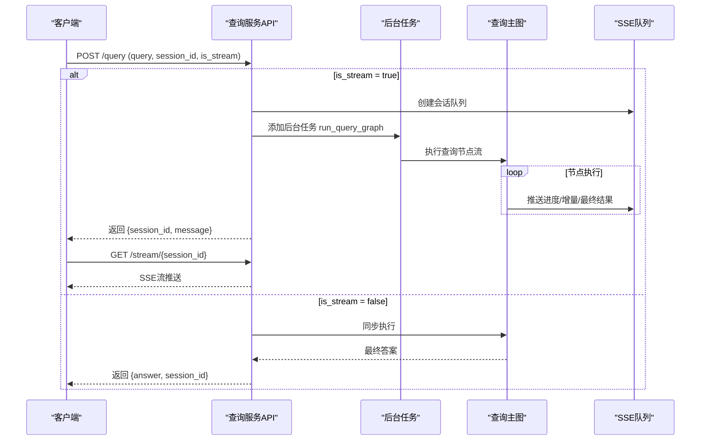
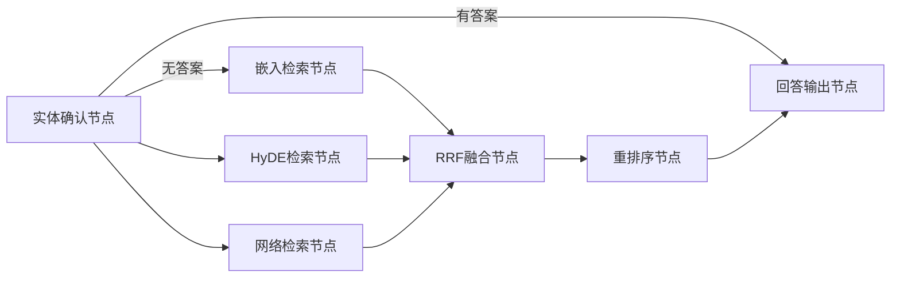
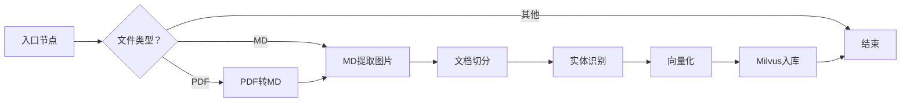
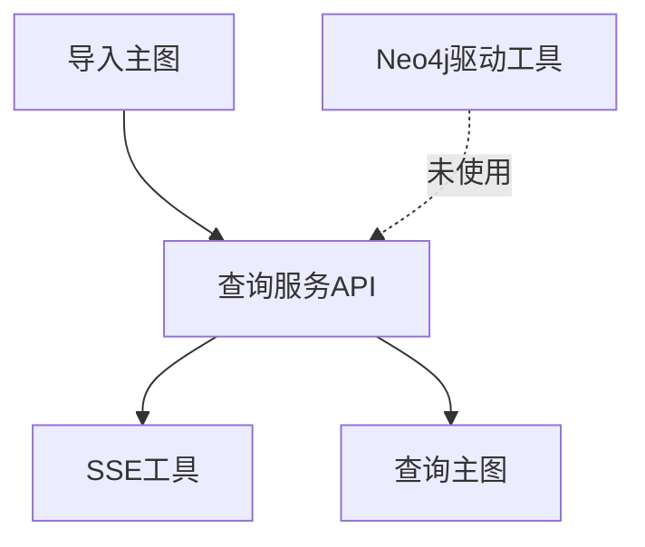

# Neo4j知识图谱集成

<cite>
**本文引用的文件**
- [app/clients/neo4j_utils.py](file://app/clients/neo4j_utils.py)
- [app/query_process/api/query_server.py](file://app/query_process/api/query_server.py)
- [app/utils/sse_utils.py](file://app/utils/sse_utils.py)
- [app/import_process/agent/main_graph.py](file://app/import_process/agent/main_graph.py)
- [app/query_process/agent/main_graph.py](file://app/query_process/agent/main_graph.py)
- [app/test/test_query_main_graph.py](file://app/test/test_query_main_graph.py)
</cite>

## 更新摘要
**所做更改**
- 更新了项目结构部分，反映Neo4j功能已被完全移除的状态
- 修订了核心组件描述，明确指出当前仅保留驱动工具而无实际集成
- 更新了架构概览，移除了Neo4j相关的查询路径
- 修改了详细组件分析，强调当前仅为基础设施而非完整功能
- 更新了依赖分析，反映Neo4j为可选且未使用的依赖
- 修正了故障排查指南，移除了Neo4j特定的排查步骤
- 更新了结论部分，明确当前状态为基础设施保留而非功能实现

## 目录
1. [简介](#简介)
2. [项目结构](#项目结构)
3. [核心组件](#核心组件)
4. [架构概览](#架构概览)
5. [详细组件分析](#详细组件分析)
6. [依赖分析](#依赖分析)
7. [性能考虑](#性能考虑)
8. [故障排查指南](#故障排查指南)
9. [结论](#结论)
10. [附录](#附录)

## 简介
本文件面向Neo4j知识图谱集成场景，基于仓库现有代码进行系统性技术文档梳理。**重要更新**：当前代码库中Neo4j知识图谱集成功能已完全移除，仅保留Neo4j驱动的基础设施。重点覆盖以下方面：
- Neo4j驱动工具的单例初始化机制
- 查询服务与工作流编排的当前状态
- 未来Neo4j集成的扩展建议与实施路径
- 当前可用的基础设施与潜在用途

**重要说明**：当前仓库中仅存在Neo4j驱动的单例初始化工具，未发现任何显式的Cypher查询、图遍历或图算法实现。查询流程以LangGraph编排为主，涉及Neo4j的部分目前仅为基础设施保留。

## 项目结构
围绕Neo4j集成的关键模块分布如下：
- 客户端工具层：提供Neo4j驱动单例初始化与连接参数加载（当前仅为基础设施）
- 查询服务层：基于FastAPI提供查询接口，支持同步/异步与SSE流式输出
- 工作流编排层：LangGraph定义导入与查询的节点与边，形成可扩展的处理图
- 工具与测试：SSE消息封装、查询工作流测试脚本

**图表来源**
- [app/clients/neo4j_utils.py:1-12](file://app/clients/neo4j_utils.py#L1-L12)
- [app/query_process/api/query_server.py:78-133](file://app/query_process/api/query_server.py#L78-L133)
- [app/utils/sse_utils.py:1-40](file://app/utils/sse_utils.py#L1-L40)
- [app/import_process/agent/main_graph.py:1-134](file://app/import_process/agent/main_graph.py#L1-L134)
- [app/query_process/agent/main_graph.py:1-47](file://app/query_process/agent/main_graph.py#L1-L47)
- [app/test/test_query_main_graph.py:1-26](file://app/test/test_query_main_graph.py#L1-L26)

## 核心组件
- **Neo4j驱动工具**：提供全局唯一的GraphDatabase驱动实例，通过环境变量加载URI与认证信息，避免重复创建连接（当前仅为基础设施，未在查询流程中使用）
- **查询服务API**：暴露POST /query接口，支持同步与异步两种模式；异步模式下通过SSE队列向客户端推送中间结果
- **SSE工具**：维护按会话隔离的消息队列，封装SSE事件类型与消息打包
- **LangGraph查询主图**：定义查询阶段的节点与条件边，形成"实体确认→多路检索→融合排序→回答输出"的处理链（当前未集成Neo4j）
- **LangGraph导入主图**：定义从PDF/Markdown到向量入库再到知识图谱导入的处理链（当前未集成Neo4j）

**章节来源**
- [app/clients/neo4j_utils.py:1-12](file://app/clients/neo4j_utils.py#L1-L12)
- [app/query_process/api/query_server.py:78-133](file://app/query_process/api/query_server.py#L78-L133)
- [app/utils/sse_utils.py:1-40](file://app/utils/sse_utils.py#L1-L40)
- [app/query_process/agent/main_graph.py:1-47](file://app/query_process/agent/main_graph.py#L1-L47)
- [app/import_process/agent/main_graph.py:1-134](file://app/import_process/agent/main_graph.py#L1-L134)

## 架构概览
整体架构由"查询入口—工作流编排—外部系统对接"三层组成。**重要更新**：当前查询链路主要依赖嵌入检索与重排序，Neo4j作为潜在的知识存储与推理后端尚未在代码中体现具体Cypher实现。当前架构中未包含Neo4j相关的查询路径。

**图表来源**
- [app/query_process/api/query_server.py:78-133](file://app/query_process/api/query_server.py#L78-L133)
- [app/query_process/agent/main_graph.py:1-47](file://app/query_process/agent/main_graph.py#L1-L47)

## 详细组件分析

### Neo4j驱动工具
- **单例模式**：通过全局变量缓存GraphDatabase.driver实例，避免重复初始化
- **认证与连接**：从环境变量读取URI与用户名/密码，构造驱动
- **当前状态**：仅为基础设施保留，未在任何查询或导入流程中实际使用
- **使用建议**：如需实现Neo4j集成，可在查询节点中注入该驱动，用于Cypher执行与事务控制

**图表来源**
- [app/clients/neo4j_utils.py:1-12](file://app/clients/neo4j_utils.py#L1-L12)

**章节来源**
- [app/clients/neo4j_utils.py:1-12](file://app/clients/neo4j_utils.py#L1-L12)

### 查询服务API（同步/异步与SSE）
- **同步模式**：直接执行查询图，完成后返回最终答案
- **异步模式**：立即返回会话标识，后台任务执行查询图并通过SSE推送中间事件
- **异常处理**：捕获异常，更新任务状态为失败并向会话推送错误事件

**图表来源**
- [app/query_process/api/query_server.py:78-133](file://app/query_process/api/query_server.py#L78-L133)
- [app/utils/sse_utils.py:1-40](file://app/utils/sse_utils.py#L1-L40)

**章节来源**
- [app/query_process/api/query_server.py:78-133](file://app/query_process/api/query_server.py#L78-L133)
- [app/utils/sse_utils.py:1-40](file://app/utils/sse_utils.py#L1-L40)

### LangGraph查询主图
- **节点**：实体确认、嵌入检索、HyDE检索、网络检索、RRF融合、重排序、回答输出
- **边**：根据实体确认阶段的输出决定是否提前终止或并行触发多路检索
- **当前状态**：未集成Neo4j，所有检索均基于嵌入向量和网络搜索

**图表来源**
- [app/query_process/agent/main_graph.py:1-47](file://app/query_process/agent/main_graph.py#L1-L47)

**章节来源**
- [app/query_process/agent/main_graph.py:1-47](file://app/query_process/agent/main_graph.py#L1-L47)

### LangGraph导入主图（Neo4j集成的潜在切入点）
- **节点**：入口、PDF转MD、MD提取图片、文档切分、实体识别、向量化、Milvus入库
- **边**：根据文件类型路由到不同分支，最终汇聚到向量化与入库
- **当前状态**：未集成Neo4j，知识图谱导入流程直接跳过
- **潜在扩展**：可在"实体识别"之后增加"写入Neo4j"节点，将识别出的实体与关系持久化至图数据库

**图表来源**
- [app/import_process/agent/main_graph.py:1-134](file://app/import_process/agent/main_graph.py#L1-L134)

**章节来源**
- [app/import_process/agent/main_graph.py:1-134](file://app/import_process/agent/main_graph.py#L1-L134)

### 查询工作流测试
- 通过测试脚本验证查询主图的节点执行顺序与最终状态输出
- 便于在新增节点后进行回归验证

**章节来源**
- [app/test/test_query_main_graph.py:1-26](file://app/test/test_query_main_graph.py#L1-L26)

## 依赖分析
- **查询服务API**依赖SSE工具进行消息推送
- **查询主图**依赖LangGraph进行节点编排
- **Neo4j驱动工具**为可选依赖，当前未在任何查询或导入节点中注入使用
- **导入主图**与查询主图相互独立，分别服务于"构建知识"和"检索知识"的场景

**图表来源**
- [app/query_process/api/query_server.py:78-133](file://app/query_process/api/query_server.py#L78-L133)
- [app/utils/sse_utils.py:1-40](file://app/utils/sse_utils.py#L1-L40)
- [app/query_process/agent/main_graph.py:1-47](file://app/query_process/agent/main_graph.py#L1-L47)
- [app/import_process/agent/main_graph.py:1-134](file://app/import_process/agent/main_graph.py#L1-L134)
- [app/clients/neo4j_utils.py:1-12](file://app/clients/neo4j_utils.py#L1-L12)

**章节来源**
- [app/query_process/api/query_server.py:78-133](file://app/query_process/api/query_server.py#L78-L133)
- [app/utils/sse_utils.py:1-40](file://app/utils/sse_utils.py#L1-L40)
- [app/query_process/agent/main_graph.py:1-47](file://app/query_process/agent/main_graph.py#L1-L47)
- [app/import_process/agent/main_graph.py:1-134](file://app/import_process/agent/main_graph.py#L1-L134)
- [app/clients/neo4j_utils.py:1-12](file://app/clients/neo4j_utils.py#L1-L12)

## 性能考虑
- **连接池与单例**：Neo4j驱动采用单例，减少连接创建开销（当前未使用）
- **异步与SSE**：异步执行查询图，SSE推送中间结果，降低前端等待时间
- **查询链路优化**：当前查询链路基于嵌入检索，性能优化主要集中在向量化和检索效率
- **并发与限流**：在高并发场景下，建议对查询服务与SSE队列进行限流与背压控制

## 故障排查指南
- **环境变量缺失**：Neo4j驱动初始化依赖NEO4J_URI、NEO4J_USERNAME、NEO4J_PASSWORD，若未设置会导致连接失败（当前未使用）
- **会话队列异常**：SSE队列按会话隔离，若队列未正确创建或清理，可能导致消息丢失或内存泄漏
- **查询异常**：查询服务API捕获异常并推送ERROR事件，可通过会话历史接口查看错误详情
- **Neo4j相关问题**：由于当前未集成Neo4j，相关问题通常与环境变量配置或连接参数有关

**章节来源**
- [app/clients/neo4j_utils.py:1-12](file://app/clients/neo4j_utils.py#L1-L12)
- [app/query_process/api/query_server.py:78-133](file://app/query_process/api/query_server.py#L78-L133)
- [app/utils/sse_utils.py:1-40](file://app/utils/sse_utils.py#L1-L40)

## 结论
**重要更新**：当前仓库提供了Neo4j驱动的基础设施，但尚未在代码中实现具体的Cypher查询与图遍历逻辑。**当前状态**：Neo4j知识图谱集成功能已完全移除，仅保留驱动工具作为未来扩展的基础。建议在以下方向进行扩展：
- 如需实现Neo4j集成，在查询节点中引入Neo4j查询能力，实现实体关系查询与路径查找
- 在导入流程中增加将实体/关系写入Neo4j的节点
- 结合查询计划与索引策略进行性能优化
- 完善监控与告警，覆盖连接状态、查询延迟与SSE队列健康度

## 附录

### Neo4j集成的未来实施建议
- **查询节点扩展**：在LangGraph查询主图中新增"图查询节点"，注入Neo4j驱动，执行Cypher并返回结果
- **导入流程扩展**：在"实体识别"之后增加"写入Neo4j"节点，将识别出的实体与关系持久化至图数据库
- **事务策略**：对写入操作使用显式事务，确保一致性；对只读查询使用读事务

### 当前基础设施的潜在用途
- **开发环境准备**：为未来的Neo4j集成提供现成的驱动工具
- **测试环境搭建**：可直接使用现有的驱动工具进行Neo4j集成测试
- **性能基准**：可基于现有的驱动工具进行Neo4j查询性能基准测试

### 移除影响评估
- **查询流程**：无直接影响，查询仍基于嵌入检索与重排序
- **导入流程**：无直接影响，导入仍基于向量化与Milvus入库
- **系统稳定性**：无负面影响，基础设施移除不会影响现有功能
- **扩展成本**：极低，因为驱动工具已存在，只需添加查询逻辑