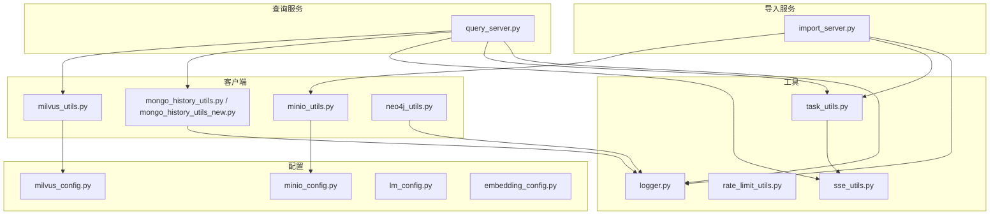
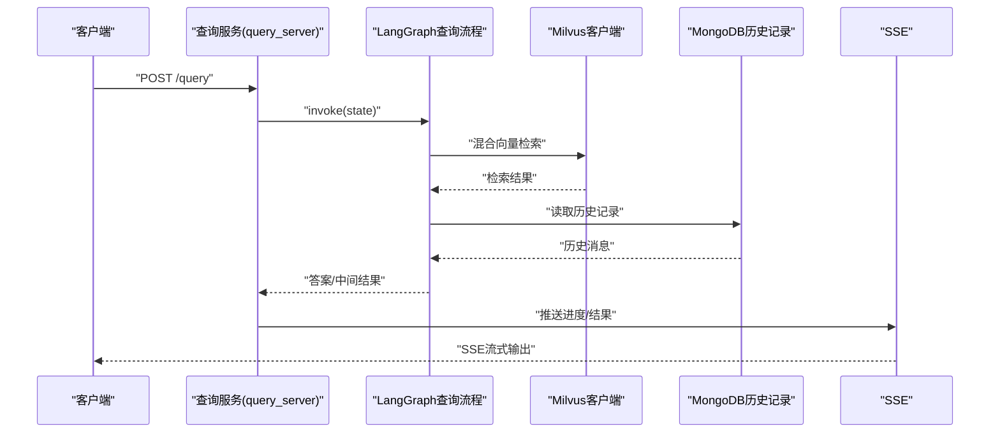
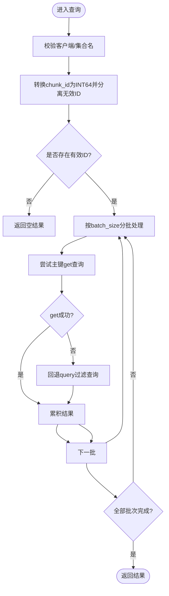
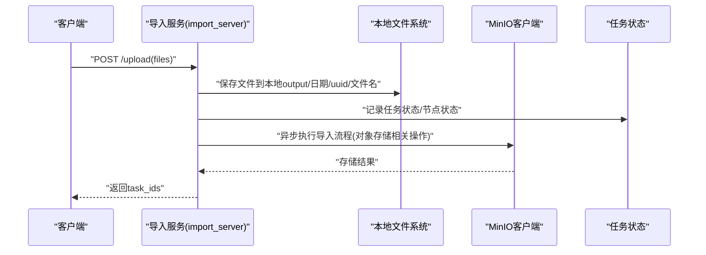
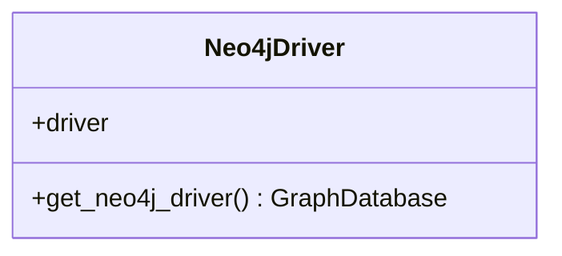
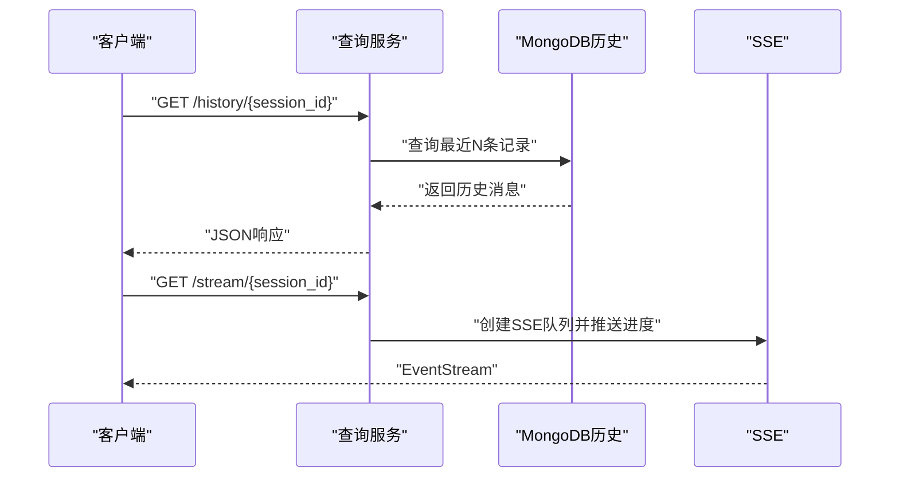
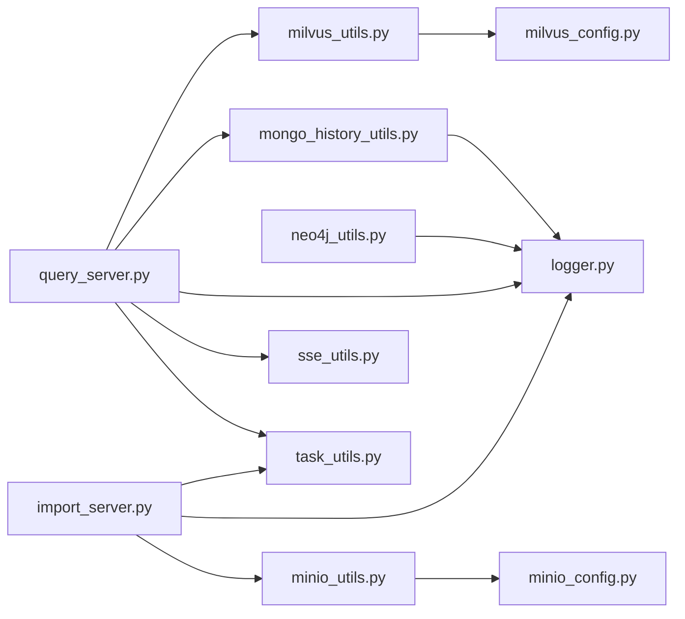

# 外部服务集成

<cite>
**本文引用的文件**
- [milvus_utils.py](file://app/clients/milvus_utils.py)
- [minio_utils.py](file://app/clients/minio_utils.py)
- [mongo_history_utils.py](file://app/clients/mongo_history_utils.py)
- [mongo_history_utils_new.py](file://app/clients/mongo_history_utils_new.py)
- [neo4j_utils.py](file://app/clients/neo4j_utils.py)
- [milvus_config.py](file://app/conf/milvus_config.py)
- [minio_config.py](file://app/conf/minio_config.py)
- [lm_config.py](file://app/conf/lm_config.py)
- [embedding_config.py](file://app/conf/embedding_config.py)
- [query_server.py](file://app/query_process/api/query_server.py)
- [import_server.py](file://app/import_process/api/import_server.py)
- [logger.py](file://app/core/logger.py)
- [task_utils.py](file://app/utils/task_utils.py)
- [rate_limit_utils.py](file://app/utils/rate_limit_utils.py)
- [sse_utils.py](file://app/utils/sse_utils.py)
- [pyproject.toml](file://pyproject.toml)
</cite>

## 目录
1. [简介](#简介)
2. [项目结构](#项目结构)
3. [核心组件](#核心组件)
4. [架构总览](#架构总览)
5. [详细组件分析](#详细组件分析)
6. [依赖分析](#依赖分析)
7. [性能考虑](#性能考虑)
8. [故障排查指南](#故障排查指南)
9. [结论](#结论)
10. [附录](#附录)

## 简介
本文件面向外部服务集成，围绕 Milvus 向量数据库、MinIO 对象存储、MongoDB 历史数据管理以及 Neo4j 知识图谱的客户端实现与集成架构进行系统化技术文档化。重点覆盖：
- 连接管理与单例模式
- 连接池与性能优化策略
- 文件上传下载与存储策略
- 历史数据的读写与查询优化
- 图查询与图谱集成方案
- 错误处理、重试与监控
- 可用性保障与故障转移
- 配置最佳实践与性能调优

## 项目结构
项目采用按功能域划分的模块化组织方式，外部服务集成相关代码集中在 app/clients 下，配合 app/conf 的配置模块与 app/utils 的通用工具模块，形成清晰的职责边界。

图表来源
- [query_server.py:1-164](file://app/query_process/api/query_server.py#L1-L164)
- [import_server.py:1-172](file://app/import_process/api/import_server.py#L1-L172)
- [milvus_utils.py:1-198](file://app/clients/milvus_utils.py#L1-L198)
- [minio_utils.py:1-43](file://app/clients/minio_utils.py#L1-L43)
- [mongo_history_utils.py:1-242](file://app/clients/mongo_history_utils.py#L1-L242)
- [neo4j_utils.py:1-12](file://app/clients/neo4j_utils.py#L1-L12)
- [milvus_config.py:1-26](file://app/conf/milvus_config.py#L1-L26)
- [minio_config.py:1-29](file://app/conf/minio_config.py#L1-L29)
- [lm_config.py:1-27](file://app/conf/lm_config.py#L1-L27)
- [embedding_config.py:1-24](file://app/conf/embedding_config.py#L1-L24)
- [logger.py:1-109](file://app/core/logger.py#L1-L109)
- [task_utils.py:1-187](file://app/utils/task_utils.py#L1-L187)
- [rate_limit_utils.py:1-37](file://app/utils/rate_limit_utils.py#L1-L37)
- [sse_utils.py:1-108](file://app/utils/sse_utils.py#L1-L108)

章节来源
- [query_server.py:1-164](file://app/query_process/api/query_server.py#L1-L164)
- [import_server.py:1-172](file://app/import_process/api/import_server.py#L1-L172)

## 核心组件
- Milvus 客户端：提供向量检索、混合检索、主键/过滤查询回退、ID 类型转换与批处理查询。
- MinIO 客户端：提供对象存储桶创建与策略设置、客户端获取。
- MongoDB 历史记录工具：提供会话历史的写入、更新、批量更新、清空与最近消息查询，具备复合索引优化。
- Neo4j 驱动：提供图数据库驱动单例获取。
- 配置模块：集中管理 Milvus、MinIO、LLM、Embedding 等配置。
- 通用工具：日志、任务状态管理、SSE 流、速率限制。

章节来源
- [milvus_utils.py:1-198](file://app/clients/milvus_utils.py#L1-L198)
- [minio_utils.py:1-43](file://app/clients/minio_utils.py#L1-L43)
- [mongo_history_utils.py:1-242](file://app/clients/mongo_history_utils.py#L1-L242)
- [neo4j_utils.py:1-12](file://app/clients/neo4j_utils.py#L1-L12)
- [milvus_config.py:1-26](file://app/conf/milvus_config.py#L1-L26)
- [minio_config.py:1-29](file://app/conf/minio_config.py#L1-L29)
- [lm_config.py:1-27](file://app/conf/lm_config.py#L1-L27)
- [embedding_config.py:1-24](file://app/conf/embedding_config.py#L1-L24)
- [logger.py:1-109](file://app/core/logger.py#L1-L109)
- [task_utils.py:1-187](file://app/utils/task_utils.py#L1-L187)
- [sse_utils.py:1-108](file://app/utils/sse_utils.py#L1-L108)
- [rate_limit_utils.py:1-37](file://app/utils/rate_limit_utils.py#L1-L37)

## 架构总览
外部服务集成围绕“查询服务”和“导入服务”两条主线展开：
- 查询服务：接收查询请求，通过 LangGraph 执行检索与生成流程，结合 Milvus 向量检索、MongoDB 历史记录、SSE 实时反馈。
- 导入服务：接收文件上传，异步执行解析、切分、向量化、Milvus 入库与知识图谱导入，通过任务状态管理与 SSE 推送进度。

图表来源
- [query_server.py:48-113](file://app/query_process/api/query_server.py#L48-L113)
- [milvus_utils.py:117-198](file://app/clients/milvus_utils.py#L117-L198)
- [mongo_history_utils.py:193-221](file://app/clients/mongo_history_utils.py#L193-L221)
- [sse_utils.py:54-98](file://app/utils/sse_utils.py#L54-L98)

## 详细组件分析

### Milvus 向量数据库集成
- 连接管理与单例
  - 通过全局变量维护单一 MilvusClient 实例，避免重复创建连接，降低资源消耗。
  - 在初始化时读取配置并校验连接地址，失败时记录错误日志并返回 None。
- ID 类型转换与批处理
  - 将 chunk_id 转换为 INT64 并分离无效 ID，避免非法主键导致查询失败。
  - 支持分批查询，按 batch_size 控制每次查询规模，避免单次请求过大。
- 查询回退策略
  - 优先使用主键 get 方法查询；失败时回退到基于过滤表达式的 query 查询，提升容错性。
- 混合检索
  - 构建稠密/稀疏向量的 AnnSearchRequest，使用 WeightedRanker 进行加权融合，支持评分归一化以平衡不同度量的量级差异。
- 性能优化要点
  - 使用 get 优于 query 的主键直查；合理设置 limit 与 search_params；对高并发场景建议引入连接池与缓存策略（见“性能考虑”）。

图表来源
- [milvus_utils.py:52-114](file://app/clients/milvus_utils.py#L52-L114)

章节来源
- [milvus_utils.py:10-31](file://app/clients/milvus_utils.py#L10-L31)
- [milvus_utils.py:34-49](file://app/clients/milvus_utils.py#L34-L49)
- [milvus_utils.py:52-114](file://app/clients/milvus_utils.py#L52-L114)
- [milvus_utils.py:117-198](file://app/clients/milvus_utils.py#L117-L198)
- [milvus_config.py:12-26](file://app/conf/milvus_config.py#L12-L26)

### MinIO 对象存储集成
- 客户端初始化
  - 依据配置创建 MinIO 客户端，自动检测并创建桶，设置公开读取策略，便于文件访问。
- 文件上传流程
  - 导入服务接收文件后，写入本地临时目录，随后异步执行导入图流程；对象存储主要用于知识库文件的持久化与访问（策略由配置决定）。
- 存储策略
  - 通过配置项控制 endpoint、访问密钥、桶名与安全模式；图片存储目录由配置项 minio_img_dir 指定。

图表来源
- [import_server.py:98-138](file://app/import_process/api/import_server.py#L98-L138)
- [minio_utils.py:13-41](file://app/clients/minio_utils.py#L13-L41)
- [minio_config.py:10-29](file://app/conf/minio_config.py#L10-L29)

章节来源
- [minio_utils.py:1-43](file://app/clients/minio_utils.py#L1-L43)
- [minio_config.py:1-29](file://app/conf/minio_config.py#L1-L29)
- [import_server.py:1-172](file://app/import_process/api/import_server.py#L1-L172)

### MongoDB 历史数据管理
- 单例与懒加载
  - 通过模块级单例与懒加载策略，避免重复创建连接；模块加载阶段尝试预初始化，失败时保留懒加载兜底。
- 索引优化
  - 为 chat_message 集合创建复合索引 (session_id, ts desc)，显著提升“按会话查询最新记录”的性能。
- 核心操作
  - 写入/更新：支持新增与按主键更新；时间戳字段 ts 用于排序与筛选。
  - 批量更新：支持对满足条件的记录进行批量更新，避免覆盖非空字段。
  - 清空与查询：提供按会话清空与最近 N 条记录查询，结果按时间升序排列，适合作为 LLM 上下文。

图表来源
- [mongo_history_utils.py:21-57](file://app/clients/mongo_history_utils.py#L21-L57)
- [mongo_history_utils.py:87-221](file://app/clients/mongo_history_utils.py#L87-L221)

章节来源
- [mongo_history_utils.py:1-242](file://app/clients/mongo_history_utils.py#L1-L242)
- [mongo_history_utils_new.py:1-248](file://app/clients/mongo_history_utils_new.py#L1-L248)

### Neo4j 知识图谱集成
- 驱动单例
  - 通过全局变量维护 GraphDatabase 驱动实例，按环境变量读取 URI、用户名与密码，避免重复建立连接。
- 集成方案
  - 与查询流程协同，提供图查询能力；建议在查询流程中增加图查询节点，结合向量检索与图谱推理提升召回质量。

图表来源
- [neo4j_utils.py:1-12](file://app/clients/neo4j_utils.py#L1-L12)

章节来源
- [neo4j_utils.py:1-12](file://app/clients/neo4j_utils.py#L1-L12)

### 查询服务与导入服务的集成点
- 查询服务
  - 提供健康检查、HTML 页面、查询接口、SSE 流、历史查询与清空接口；通过 LangGraph 执行查询流程，结合 Milvus 与 MongoDB。
- 导入服务
  - 提供导入页面、文件上传、任务状态查询接口；异步执行导入图，记录节点状态并通过 SSE 推送进度。

图表来源
- [query_server.py:129-160](file://app/query_process/api/query_server.py#L129-L160)
- [mongo_history_utils.py:193-221](file://app/clients/mongo_history_utils.py#L193-L221)
- [sse_utils.py:54-98](file://app/utils/sse_utils.py#L54-L98)

章节来源
- [query_server.py:1-164](file://app/query_process/api/query_server.py#L1-L164)
- [import_server.py:1-172](file://app/import_process/api/import_server.py#L1-L172)

## 依赖分析
- 外部依赖
  - FastAPI、Uvicorn、Loguru、PyMongo、Pymilvus、MinIO、LangGraph、Pydantic 等。
- 内部依赖
  - 客户端模块依赖配置模块与日志模块；查询/导入服务依赖通用工具模块（任务状态、SSE、速率限制）。

图表来源
- [pyproject.toml:9-35](file://pyproject.toml#L9-L35)
- [milvus_utils.py:1-5](file://app/clients/milvus_utils.py#L1-L5)
- [minio_utils.py:1-8](file://app/clients/minio_utils.py#L1-L8)
- [mongo_history_utils.py:1-15](file://app/clients/mongo_history_utils.py#L1-L15)
- [neo4j_utils.py:1-2](file://app/clients/neo4j_utils.py#L1-L2)
- [query_server.py:1-17](file://app/query_process/api/query_server.py#L1-L17)
- [import_server.py:1-24](file://app/import_process/api/import_server.py#L1-L24)
- [task_utils.py:1-2](file://app/utils/task_utils.py#L1-L2)
- [sse_utils.py:1-5](file://app/utils/sse_utils.py#L1-L5)
- [logger.py:1-18](file://app/core/logger.py#L1-L18)

章节来源
- [pyproject.toml:1-36](file://pyproject.toml#L1-L36)

## 性能考虑
- Milvus
  - 优先使用主键 get 查询；合理设置 limit 与 search_params；对高频查询结果进行缓存；在高并发场景建议引入连接池与批量写入策略。
  - 混合检索时启用评分归一化，避免度量差异导致权重失衡。
- MinIO
  - 使用 HTTP/HTTPS 安全选项与合适的 endpoint；对大文件上传建议分片上传与断点续传；桶策略最小化权限，确保安全性。
- MongoDB
  - 复合索引 (session_id, ts desc) 已针对核心查询场景优化；避免在查询中使用过多 $or/$and；对频繁更新的字段使用部分更新。
- Neo4j
  - 在查询前确保索引与约束已建立；对复杂路径查询使用 LIMIT 与 OPTIONAL MATCH 降低计算复杂度。
- 通用
  - 使用 SSE 异步推送减少阻塞；通过速率限制器控制第三方 API 调用频率；日志分级输出，避免 IO 成为瓶颈。

## 故障排查指南
- 日志
  - 使用统一日志工具，支持控制台与文件双输出，自动按日期切割并保留策略；通过 env 控制开关与级别。
- 错误处理
  - 客户端模块在连接失败或查询异常时记录错误日志并返回安全值；查询服务捕获异常并推送错误事件到 SSE。
- 重试与监控
  - 对外部服务调用建议在上层封装指数退避重试；结合任务状态管理与 SSE 推送进度，便于前端监控。
- 可用性与故障转移
  - 对关键外部服务（Milvus、MongoDB、MinIO、Neo4j）建议部署高可用集群；在客户端侧实现连接超时与重连策略；对查询流程增加降级分支（如禁用图谱查询）。

章节来源
- [logger.py:1-109](file://app/core/logger.py#L1-L109)
- [milvus_utils.py:29-31](file://app/clients/milvus_utils.py#L29-L31)
- [mongo_history_utils.py:102-106](file://app/clients/mongo_history_utils.py#L102-L106)
- [query_server.py:70-76](file://app/query_process/api/query_server.py#L70-L76)
- [sse_utils.py:99-102](file://app/utils/sse_utils.py#L99-L102)

## 结论
本项目通过模块化的客户端实现与完善的配置体系，实现了 Milvus、MinIO、MongoDB、Neo4j 的稳定集成。查询与导入服务分别围绕 LangGraph 与 SSE 构建了高效、可观测的工作流。建议在生产环境中进一步完善连接池、缓存与重试策略，并持续优化索引与查询计划，以获得更佳的性能与可靠性。

## 附录
- 配置最佳实践
  - 环境变量集中管理，.env 文件与 dataclass 配置类结合，确保一致性与可读性。
  - 对 Milvus 与 MinIO 的 endpoint、认证信息与桶名进行严格校验。
  - 对日志输出路径、级别与保留策略进行合理配置。
- 性能调优建议
  - Milvus：合理设置 topK/ef、评分归一化、批量写入与缓存。
  - MongoDB：复合索引、部分更新、分页查询与读写分离。
  - MinIO：分片上传、安全传输、最小权限策略。
  - Neo4j：索引/约束、LIMIT、查询计划分析。