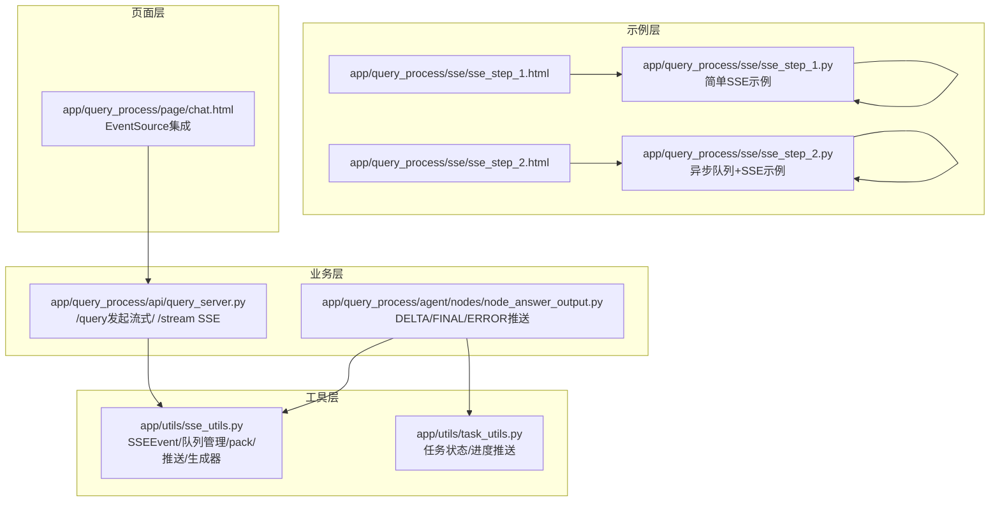
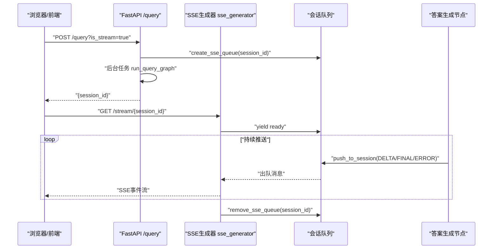
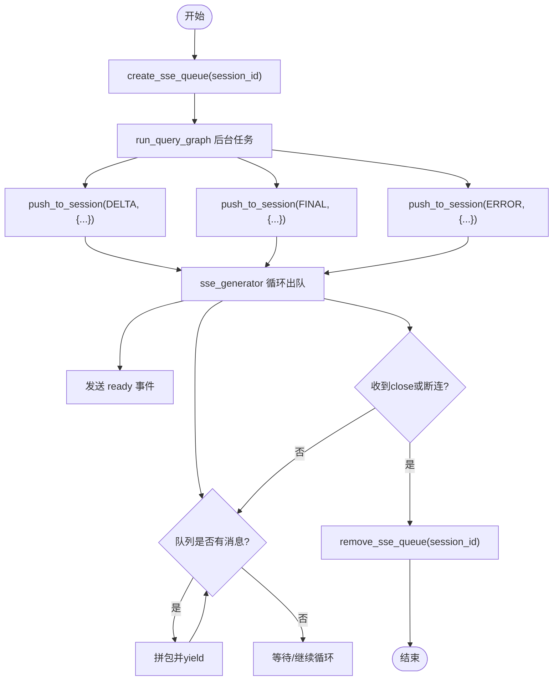
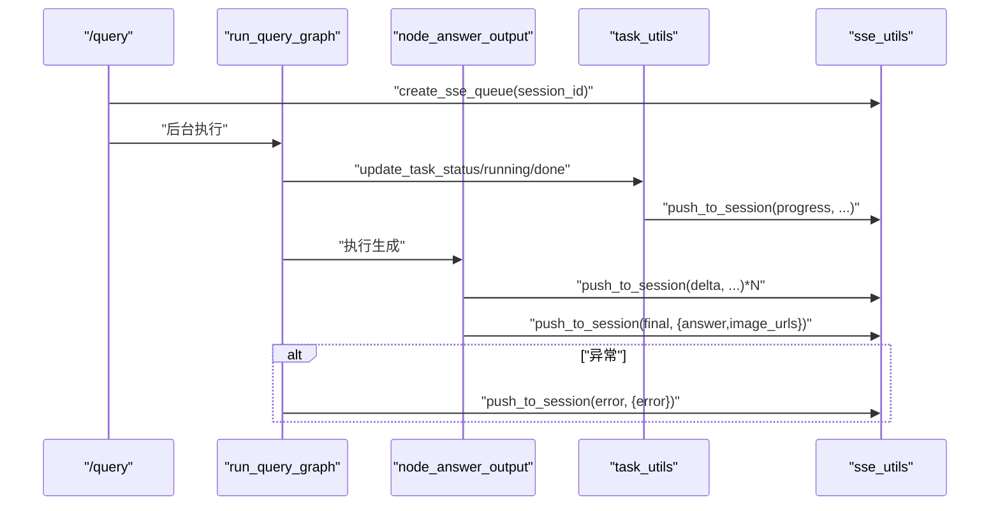
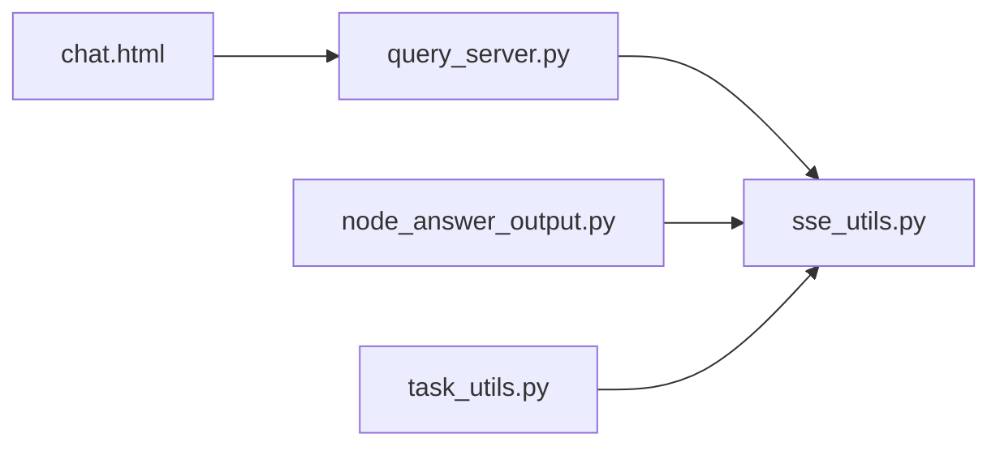

# SSE流式传输

<cite>
**本文引用的文件**
- [app/utils/sse_utils.py](file://app/utils/sse_utils.py)
- [app/query_process/api/query_server.py](file://app/query_process/api/query_server.py)
- [app/query_process/agent/nodes/node_answer_output.py](file://app/query_process/agent/nodes/node_answer_output.py)
- [app/utils/task_utils.py](file://app/utils/task_utils.py)
- [app/query_process/sse/sse_step_1.py](file://app/query_process/sse/sse_step_1.py)
- [app/query_process/sse/sse_step_2.py](file://app/query_process/sse/sse_step_2.py)
- [app/query_process/sse/sse_step_1.html](file://app/query_process/sse/sse_step_1.html)
- [app/query_process/sse/sse_step_2.html](file://app/query_process/sse/sse_step_2.html)
- [app/query_process/page/chat.html](file://app/query_process/page/chat.html)
</cite>

## 目录
1. [简介](#简介)
2. [项目结构](#项目结构)
3. [核心组件](#核心组件)
4. [架构总览](#架构总览)
5. [详细组件分析](#详细组件分析)
6. [依赖分析](#依赖分析)
7. [性能考虑](#性能考虑)
8. [故障排查指南](#故障排查指南)
9. [结论](#结论)
10. [附录](#附录)

## 简介
本文件系统性阐述基于FastAPI的SSE（Server-Sent Events）流式传输实现，涵盖事件类型定义、消息打包格式、会话队列管理、消息推送机制、异步生成器工作原理、核心函数使用方法以及客户端集成示例。文档同时给出不同事件类型的触发时机与数据格式，并提供性能优化建议与最佳实践。

## 项目结构
围绕SSE的关键模块分布如下：
- 工具层：SSE事件常量与队列管理、消息打包与推送、SSE生成器
- 业务层：查询服务API、答案生成节点、任务状态与进度推送
- 示例层：最小可运行的SSE示例与HTML客户端
- 页面层：生产级前端页面集成EventSource

图表来源
- [app/utils/sse_utils.py:1-108](file://app/utils/sse_utils.py#L1-L108)
- [app/utils/task_utils.py:1-187](file://app/utils/task_utils.py#L1-L187)
- [app/query_process/api/query_server.py:1-164](file://app/query_process/api/query_server.py#L1-L164)
- [app/query_process/agent/nodes/node_answer_output.py:1-352](file://app/query_process/agent/nodes/node_answer_output.py#L1-L352)
- [app/query_process/sse/sse_step_1.py:1-33](file://app/query_process/sse/sse_step_1.py#L1-L33)
- [app/query_process/sse/sse_step_2.py:1-58](file://app/query_process/sse/sse_step_2.py#L1-L58)
- [app/query_process/sse/sse_step_1.html:1-22](file://app/query_process/sse/sse_step_1.html#L1-L22)
- [app/query_process/sse/sse_step_2.html:1-33](file://app/query_process/sse/sse_step_2.html#L1-L33)
- [app/query_process/page/chat.html:818-847](file://app/query_process/page/chat.html#L818-L847)

章节来源
- [app/utils/sse_utils.py:1-108](file://app/utils/sse_utils.py#L1-L108)
- [app/query_process/api/query_server.py:1-164](file://app/query_process/api/query_server.py#L1-L164)
- [app/query_process/agent/nodes/node_answer_output.py:1-352](file://app/query_process/agent/nodes/node_answer_output.py#L1-L352)
- [app/utils/task_utils.py:1-187](file://app/utils/task_utils.py#L1-L187)
- [app/query_process/sse/sse_step_1.py:1-33](file://app/query_process/sse/sse_step_1.py#L1-L33)
- [app/query_process/sse/sse_step_2.py:1-58](file://app/query_process/sse/sse_step_2.py#L1-L58)
- [app/query_process/sse/sse_step_1.html:1-22](file://app/query_process/sse/sse_step_1.html#L1-L22)
- [app/query_process/sse/sse_step_2.html:1-33](file://app/query_process/sse/sse_step_2.html#L1-L33)
- [app/query_process/page/chat.html:818-847](file://app/query_process/page/chat.html#L818-L847)

## 核心组件
- SSEEvent：统一定义事件类型，便于前后端约定
- 会话队列管理：全局字典维护每个session_id对应的阻塞队列
- 消息打包与推送：将事件与数据封装为SSE格式并入队
- SSE生成器：将队列中的消息以SSE格式持续输出，支持断连检测与资源清理
- 业务集成：查询API创建会话队列，节点在推理过程中推送DELTA/FINAL/ERROR等事件

章节来源
- [app/utils/sse_utils.py:8-108](file://app/utils/sse_utils.py#L8-L108)
- [app/query_process/api/query_server.py:56-126](file://app/query_process/api/query_server.py#L56-L126)
- [app/query_process/agent/nodes/node_answer_output.py:16-249](file://app/query_process/agent/nodes/node_answer_output.py#L16-L249)
- [app/utils/task_utils.py:174-179](file://app/utils/task_utils.py#L174-L179)

## 架构总览
SSE整体交互链路由“查询发起 → 会话队列创建 → 后台任务逐步入队 → 客户端EventSource持续消费”构成。

图表来源
- [app/query_process/api/query_server.py:78-126](file://app/query_process/api/query_server.py#L78-L126)
- [app/utils/sse_utils.py:25-108](file://app/utils/sse_utils.py#L25-L108)
- [app/query_process/agent/nodes/node_answer_output.py:114-134](file://app/query_process/agent/nodes/node_answer_output.py#L114-L134)

## 详细组件分析

### SSEEvent与消息格式
- 事件类型
  - ready：连接建立通知
  - progress：任务节点进度（由任务状态与进度推送触发）
  - delta：LLM流式输出增量
  - final：最终答案与附加信息（如图片链接）
  - error：错误信息
  - close：内部关闭信号（特殊事件，触发生成器提前结束）
- 消息打包格式
  - 每条消息由event与data两部分组成，data为JSON序列化后的字符串
  - 事件名与数据之间以换行分隔，形成标准SSE文本帧

章节来源
- [app/utils/sse_utils.py:8-14](file://app/utils/sse_utils.py#L8-L14)
- [app/utils/sse_utils.py:37-41](file://app/utils/sse_utils.py#L37-L41)

### 会话队列管理与消息推送
- create_sse_queue：为session_id创建并注册阻塞队列
- get_sse_queue/remove_sse_queue：获取/移除队列，供生成器与推送方使用
- push_to_session：将事件与数据封装为字典入队
- sse_generator：发送ready事件，循环从队列取出消息并yield，遇到close或客户端断开时结束

图表来源
- [app/utils/sse_utils.py:25-108](file://app/utils/sse_utils.py#L25-L108)
- [app/query_process/api/query_server.py:92-94](file://app/query_process/api/query_server.py#L92-L94)

章节来源
- [app/utils/sse_utils.py:21-35](file://app/utils/sse_utils.py#L21-L35)
- [app/utils/sse_utils.py:43-52](file://app/utils/sse_utils.py#L43-L52)
- [app/utils/sse_utils.py:54-108](file://app/utils/sse_utils.py#L54-L108)

### 业务集成与事件触发
- 查询API
  - 当is_stream为true时，创建会话队列并异步执行推理流程
  - 推理流程结束后，根据状态推送progress/complete/fail
- 答案生成节点
  - 在模型流式生成时，逐块推送delta增量
  - 生成完成后推送final事件（包含答案与图片链接）
  - 异常时推送error事件
- 任务状态与进度
  - 通过task_utils维护running/done/status，并在状态变更时调用task_push_queue，将progress事件推送到SSE

图表来源
- [app/query_process/api/query_server.py:78-112](file://app/query_process/api/query_server.py#L78-L112)
- [app/query_process/agent/nodes/node_answer_output.py:114-134](file://app/query_process/agent/nodes/node_answer_output.py#L114-L134)
- [app/utils/task_utils.py:161-179](file://app/utils/task_utils.py#L161-L179)

章节来源
- [app/query_process/api/query_server.py:78-112](file://app/query_process/api/query_server.py#L78-L112)
- [app/query_process/agent/nodes/node_answer_output.py:114-134](file://app/query_process/agent/nodes/node_answer_output.py#L114-L134)
- [app/utils/task_utils.py:161-179](file://app/utils/task_utils.py#L161-L179)

### SSE生成器实现细节
- 断连检测：通过request.is_disconnected()在每次循环前快速检测
- 阻塞队列适配：使用loop.run_in_executor在同步队列上执行阻塞get，避免阻塞事件循环
- 异常处理：捕获CancelledError/ConnectionResetError/BrokenPipeError等，静默退出
- 资源清理：finally中移除会话队列，防止内存泄漏

章节来源
- [app/utils/sse_utils.py:54-108](file://app/utils/sse_utils.py#L54-L108)

### 核心函数使用方法
- create_sse_queue(session_id)
  - 在发起流式查询时调用，为当前会话创建专属队列
- get_sse_queue(session_id)
  - 供生成器内部使用，获取对应会话队列
- remove_sse_queue(session_id)
  - 生成器finally中自动清理
- push_to_session(session_id, event, data)
  - 在业务节点中按需推送事件与数据
- sse_generator(session_id, request)
  - FastAPI路由/stream/{session_id}的生成器

章节来源
- [app/utils/sse_utils.py:21-35](file://app/utils/sse_utils.py#L21-L35)
- [app/utils/sse_utils.py:43-52](file://app/utils/sse_utils.py#L43-L52)
- [app/utils/sse_utils.py:54-108](file://app/utils/sse_utils.py#L54-L108)
- [app/query_process/api/query_server.py:115-126](file://app/query_process/api/query_server.py#L115-L126)

### 客户端集成示例
- JavaScript EventSource
  - 基础示例：连接/simple_stream，监听onmessage
  - 实战示例：先提交任务，再立即建立SSE连接/stream/{session_id}，接收progress/delta/final/error
- 生产页面集成
  - chat.html中通过EventSource订阅/stream/{session_id}
  - 解析data中的JSON，渲染答案与图片，处理error事件并关闭连接

章节来源
- [app/query_process/sse/sse_step_1.html:11-20](file://app/query_process/sse/sse_step_1.html#L11-L20)
- [app/query_process/sse/sse_step_2.html:17-30](file://app/query_process/sse/sse_step_2.html#L17-L30)
- [app/query_process/page/chat.html:818-847](file://app/query_process/page/chat.html#L818-L847)

## 依赖分析
- 组件耦合
  - query_server依赖sse_utils创建队列与生成SSE响应
  - node_answer_output依赖sse_utils推送delta/final/error
  - task_utils通过push_to_session推送progress
- 外部依赖
  - FastAPI StreamingResponse与Request.is_disconnected
  - Python queue/asyncio线程池执行器

图表来源
- [app/query_process/api/query_server.py:14-15](file://app/query_process/api/query_server.py#L14-L15)
- [app/query_process/agent/nodes/node_answer_output.py:3-4](file://app/query_process/agent/nodes/node_answer_output.py#L3-L4)
- [app/utils/task_utils.py:2](file://app/utils/task_utils.py#L2)
- [app/query_process/page/chat.html:767-768](file://app/query_process/page/chat.html#L767-L768)

章节来源
- [app/query_process/api/query_server.py:14-15](file://app/query_process/api/query_server.py#L14-L15)
- [app/query_process/agent/nodes/node_answer_output.py:3-4](file://app/query_process/agent/nodes/node_answer_output.py#L3-L4)
- [app/utils/task_utils.py:2](file://app/utils/task_utils.py#L2)
- [app/query_process/page/chat.html:767-768](file://app/query_process/page/chat.html#L767-L768)

## 性能考虑
- 队列选择
  - 后台任务使用阻塞队列，前端生成器使用线程池执行阻塞get，避免阻塞事件循环
- 轮询替代
  - 使用阻塞队列替代轮询，降低CPU占用
- 断连早退
  - 每次循环前检测断连，及时退出减少无效IO
- 资源清理
  - finally中移除队列，避免会话堆积导致内存增长
- 并发与限流
  - 可结合速率限制工具对并发SSE连接进行控制（仓库内提供rate_limit_utils）

章节来源
- [app/utils/sse_utils.py:78-86](file://app/utils/sse_utils.py#L78-L86)
- [app/utils/sse_utils.py:105-108](file://app/utils/sse_utils.py#L105-L108)
- [app/utils/rate_limit_utils.py](file://app/utils/rate_limit_utils.py)

## 故障排查指南
- 队列不存在
  - 现象：生成器直接返回
  - 处理：确认先调用create_sse_queue(session_id)，再发起/stream
- 客户端断连
  - 现象：生成器捕获断连异常并静默退出
  - 处理：前端监听error事件并提示用户重试
- 队列为空
  - 现象：生成器循环等待，直到有消息或断连
  - 处理：确保业务节点正确推送事件
- 资源未清理
  - 现象：长时间运行后内存增长
  - 处理：确认finally中remove_sse_queue被调用

章节来源
- [app/utils/sse_utils.py:60-63](file://app/utils/sse_utils.py#L60-L63)
- [app/utils/sse_utils.py:99-102](file://app/utils/sse_utils.py#L99-L102)
- [app/utils/sse_utils.py:105-108](file://app/utils/sse_utils.py#L105-L108)

## 结论
本SSE实现以“会话队列 + 事件推送 + 异步生成器”为核心，具备清晰的事件语义、稳定的断连检测与资源清理机制。通过在查询API与答案生成节点中注入SSE推送，可实现从任务进度到流式增量输出的全链路可视化。配合前端EventSource，可在浏览器端获得近实时的反馈体验。

## 附录

### 事件类型与数据格式一览
- ready
  - 触发时机：生成器开始后立即发送
  - 数据：空对象
- progress
  - 触发时机：任务状态变化或节点进入/完成时
  - 数据：包含status、done_list、running_list
- delta
  - 触发时机：LLM流式输出增量
  - 数据：包含delta字符串
- final
  - 触发时机：答案生成完成
  - 数据：包含answer、status、image_urls
- error
  - 触发时机：异常发生
  - 数据：包含error字符串
- close
  - 触发时机：内部主动结束
  - 数据：无意义，仅用于终止生成器

章节来源
- [app/utils/sse_utils.py:8-14](file://app/utils/sse_utils.py#L8-L14)
- [app/utils/task_utils.py:174-179](file://app/utils/task_utils.py#L174-L179)
- [app/query_process/agent/nodes/node_answer_output.py:237-244](file://app/query_process/agent/nodes/node_answer_output.py#L237-L244)

### 客户端集成要点
- 基础EventSource
  - 连接路径：/simple_stream 或 /stream/{session_id}
  - 监听事件：onmessage解析event.data中的JSON
- 生产集成
  - 先提交任务，再建立SSE连接
  - 监听error事件并优雅降级
  - 解析final事件中的answer与image_urls

章节来源
- [app/query_process/sse/sse_step_1.html:11-20](file://app/query_process/sse/sse_step_1.html#L11-L20)
- [app/query_process/sse/sse_step_2.html:17-30](file://app/query_process/sse/sse_step_2.html#L17-L30)
- [app/query_process/page/chat.html:818-847](file://app/query_process/page/chat.html#L818-L847)