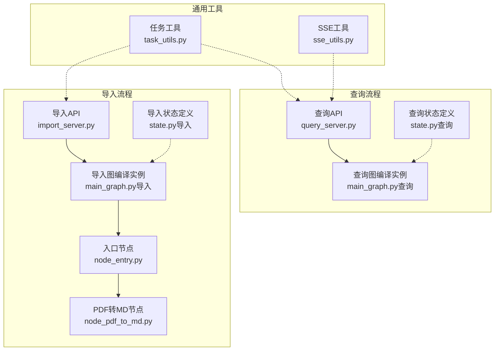
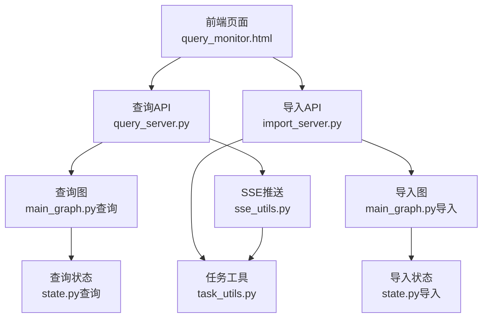
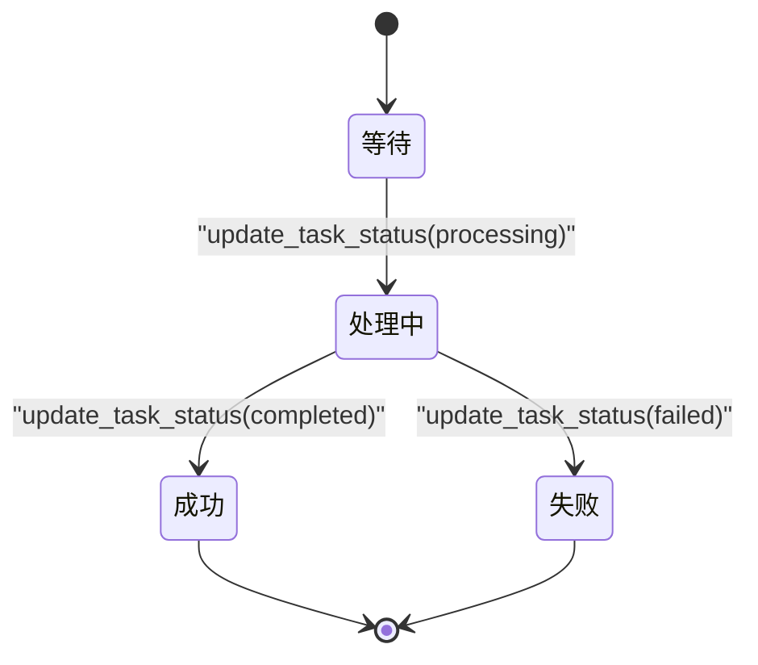
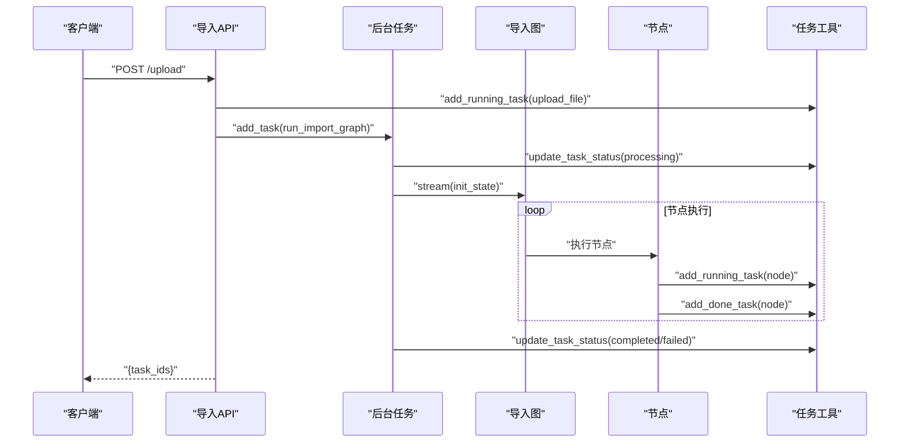
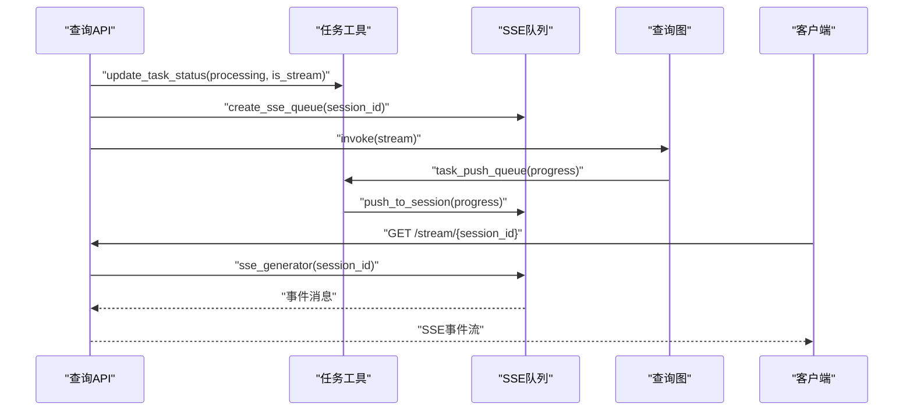
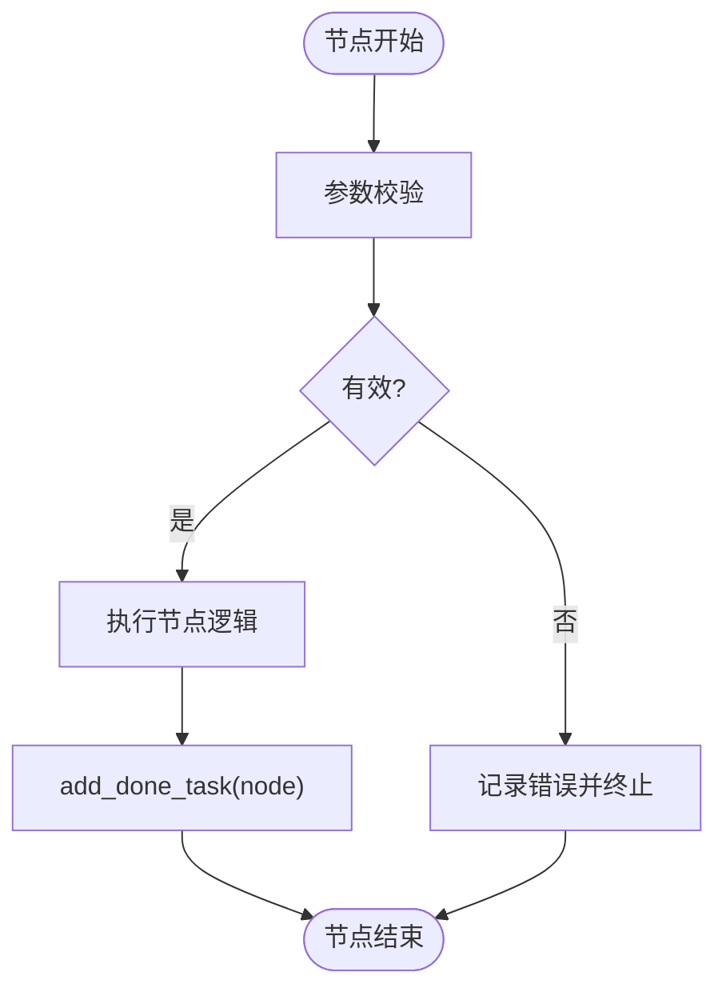
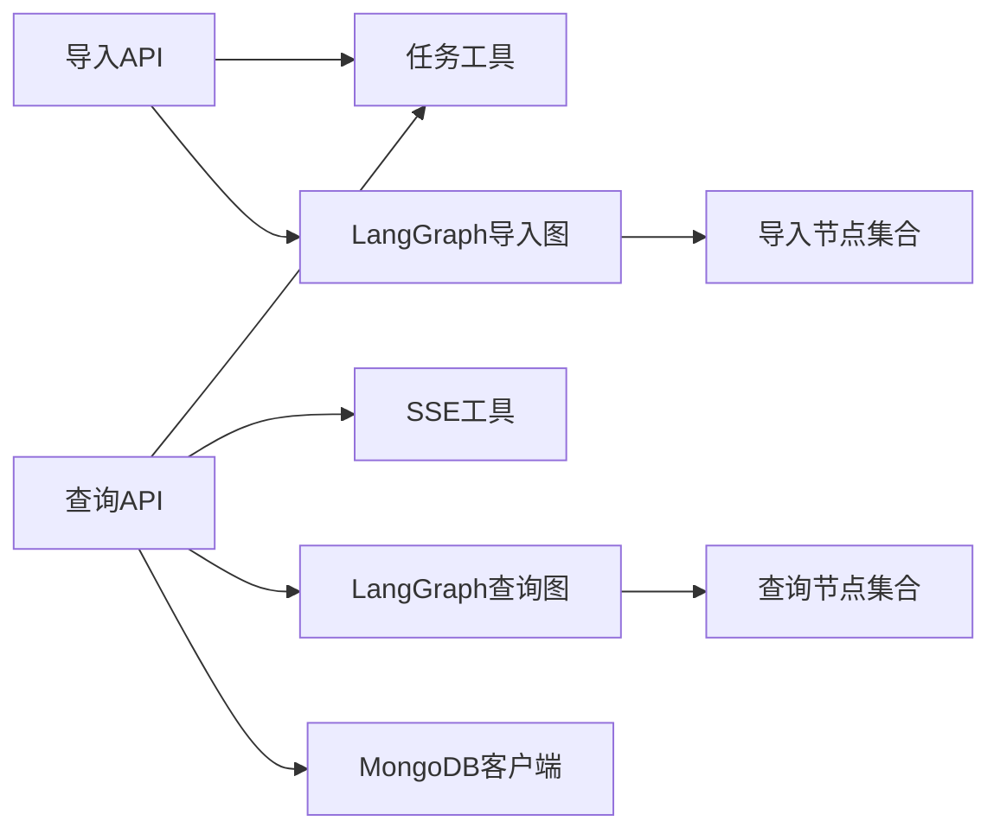

# 任务状态管理

<cite>
**本文引用的文件**
- [task_utils.py](file://app/utils/task_utils.py)
- [sse_utils.py](file://app/utils/sse_utils.py)
- [import_server.py](file://app/import_process/api/import_server.py)
- [query_server.py](file://app/query_process/api/query_server.py)
- [main_graph.py（导入）](file://app/import_process/agent/main_graph.py)
- [main_graph.py（查询）](file://app/query_process/agent/main_graph.py)
- [state.py（导入）](file://app/import_process/agent/state.py)
- [state.py（查询）](file://app/query_process/agent/state.py)
- [node_entry.py](file://app/import_process/agent/nodes/node_entry.py)
- [node_pdf_to_md.py](file://app/import_process/agent/nodes/node_pdf_to_md.py)
- [query_monitor.html](file://app/query_process/page/query_monitor.html)
- [lm_config.py](file://app/conf/lm_config.py)
- [rate_limit_utils.py](file://app/utils/rate_limit_utils.py)
</cite>

## 目录
1. [简介](#简介)
2. [项目结构](#项目结构)
3. [核心组件](#核心组件)
4. [架构总览](#架构总览)
5. [详细组件分析](#详细组件分析)
6. [依赖分析](#依赖分析)
7. [性能考量](#性能考量)
8. [故障排查指南](#故障排查指南)
9. [结论](#结论)
10. [附录](#附录)

## 简介
本文件面向“任务状态管理”主题，系统化梳理并文档化以下内容：
- 任务调度机制：任务创建、状态转换与生命周期管理
- 任务状态的数据结构与状态机模型：状态含义与转换条件
- 任务持久化：当前实现采用内存态，数据存储格式与访问模式
- 进度跟踪：进度计算、状态更新与通知机制（SSE）
- 任务管理API：创建任务、查询状态、更新进度、清理资源
- 超时处理、重试与错误恢复策略
- 多任务并发处理与性能优化
- 任务监控与调试工具

## 项目结构
本项目围绕两条主线构建任务状态管理：
- 导入流程（Import）：基于 LangGraph 的状态图，将 PDF/MD 文件解析、切分、向量化并入库
- 查询流程（Query）：基于 LangGraph 的状态图，执行检索、重排序与答案生成，并通过 SSE 实时推送

图表来源
- [import_server.py:1-172](file://app/import_process/api/import_server.py#L1-L172)
- [query_server.py:1-164](file://app/query_process/api/query_server.py#L1-L164)
- [main_graph.py（导入）:1-134](file://app/import_process/agent/main_graph.py#L1-L134)
- [main_graph.py（查询）:1-47](file://app/query_process/agent/main_graph.py#L1-L47)
- [state.py（导入）:1-99](file://app/import_process/agent/state.py#L1-L99)
- [state.py（查询）:1-97](file://app/query_process/agent/state.py#L1-L97)
- [node_entry.py:1-59](file://app/import_process/agent/nodes/node_entry.py#L1-L59)
- [node_pdf_to_md.py:1-331](file://app/import_process/agent/nodes/node_pdf_to_md.py#L1-L331)
- [task_utils.py:1-187](file://app/utils/task_utils.py#L1-L187)
- [sse_utils.py:1-108](file://app/utils/sse_utils.py#L1-L108)

章节来源
- [import_server.py:1-172](file://app/import_process/api/import_server.py#L1-L172)
- [query_server.py:1-164](file://app/query_process/api/query_server.py#L1-L164)
- [main_graph.py（导入）:1-134](file://app/import_process/agent/main_graph.py#L1-L134)
- [main_graph.py（查询）:1-47](file://app/query_process/agent/main_graph.py#L1-L47)
- [state.py（导入）:1-99](file://app/import_process/agent/state.py#L1-L99)
- [state.py（查询）:1-97](file://app/query_process/agent/state.py#L1-L97)
- [task_utils.py:1-187](file://app/utils/task_utils.py#L1-L187)
- [sse_utils.py:1-108](file://app/utils/sse_utils.py#L1-L108)

## 核心组件
- 任务状态工具（task_utils.py）
  - 维护任务的运行中/已完成节点列表、全局状态、结果字典
  - 提供状态更新、进度推送、结果读写、清理等能力
- SSE 工具（sse_utils.py）
  - 会话级队列存储，支持 ready/delta/final/error/close 等事件类型
  - 通过 StreamingResponse 实现长连接推送
- 导入 API（import_server.py）
  - 文件上传、异步执行导入图、状态查询接口
- 查询 API（query_server.py）
  - 发起查询、流式/非流式执行、SSE 推送、历史查询接口
- 导入/查询图与状态（main_graph.py + state.py）
  - 定义节点、边与状态字段，驱动任务生命周期
- 节点实现（node_entry.py、node_pdf_to_md.py）
  - 在节点执行前后更新任务状态与进度

章节来源
- [task_utils.py:1-187](file://app/utils/task_utils.py#L1-L187)
- [sse_utils.py:1-108](file://app/utils/sse_utils.py#L1-L108)
- [import_server.py:1-172](file://app/import_process/api/import_server.py#L1-L172)
- [query_server.py:1-164](file://app/query_process/api/query_server.py#L1-L164)
- [main_graph.py（导入）:1-134](file://app/import_process/agent/main_graph.py#L1-L134)
- [main_graph.py（查询）:1-47](file://app/query_process/agent/main_graph.py#L1-L47)
- [state.py（导入）:1-99](file://app/import_process/agent/state.py#L1-L99)
- [state.py（查询）:1-97](file://app/query_process/agent/state.py#L1-L97)
- [node_entry.py:1-59](file://app/import_process/agent/nodes/node_entry.py#L1-L59)
- [node_pdf_to_md.py:1-331](file://app/import_process/agent/nodes/node_pdf_to_md.py#L1-L331)

## 架构总览
整体架构分为三层：
- 表现层：前端页面与浏览器轮询/长连接
- 控制层：FastAPI 接口，负责任务创建、状态查询、SSE 连接
- 执行层：LangGraph 图与节点，负责任务执行与状态变更

图表来源
- [query_server.py:1-164](file://app/query_process/api/query_server.py#L1-L164)
- [import_server.py:1-172](file://app/import_process/api/import_server.py#L1-L172)
- [main_graph.py（查询）:1-47](file://app/query_process/agent/main_graph.py#L1-L47)
- [main_graph.py（导入）:1-134](file://app/import_process/agent/main_graph.py#L1-L134)
- [state.py（查询）:1-97](file://app/query_process/agent/state.py#L1-L97)
- [state.py（导入）:1-99](file://app/import_process/agent/state.py#L1-L99)
- [sse_utils.py:1-108](file://app/utils/sse_utils.py#L1-L108)
- [task_utils.py:1-187](file://app/utils/task_utils.py#L1-L187)

## 详细组件分析

### 任务状态数据结构与状态机
- 状态常量
  - pending、processing、completed、failed
- 关键字典
  - 任务运行中节点列表：按完成顺序维护
  - 任务已完成节点列表：按完成顺序维护
  - 任务全局状态：字符串状态
  - 任务结果字典：键值对存储（如 answer、error）
- 状态机转换
  - 任意任务：pending → processing → completed 或 failed
  - 导入流程：入口节点 → PDF转MD → … → END
  - 查询流程：入口节点 → 多路检索 → 融合/重排序 → 答案生成 → END

图表来源
- [task_utils.py:20-24](file://app/utils/task_utils.py#L20-L24)
- [task_utils.py:161-172](file://app/utils/task_utils.py#L161-L172)
- [import_server.py:75-91](file://app/import_process/api/import_server.py#L75-L91)
- [query_server.py:59-76](file://app/query_process/api/query_server.py#L59-L76)

章节来源
- [task_utils.py:20-24](file://app/utils/task_utils.py#L20-L24)
- [task_utils.py:53-187](file://app/utils/task_utils.py#L53-L187)
- [import_server.py:75-91](file://app/import_process/api/import_server.py#L75-L91)
- [query_server.py:59-76](file://app/query_process/api/query_server.py#L59-L76)

### 任务创建与生命周期
- 导入任务
  - 上传文件后，记录“上传文件”节点为运行中，随后异步执行导入图
  - 导入图逐节点执行，节点开始/结束时分别调用“运行中/已完成”更新
  - 全流程结束后，状态更新为 completed 或 failed
- 查询任务
  - 发起查询时，根据是否流式创建 SSE 队列
  - 执行查询图，节点执行时通过任务工具更新进度，必要时推送 SSE 事件
  - 结束后，状态更新为 completed 或 failed，并推送最终事件

图表来源
- [import_server.py:98-138](file://app/import_process/api/import_server.py#L98-L138)
- [import_server.py:55-91](file://app/import_process/api/import_server.py#L55-L91)
- [task_utils.py:68-109](file://app/utils/task_utils.py#L68-L109)
- [main_graph.py（导入）:104-110](file://app/import_process/agent/main_graph.py#L104-L110)

章节来源
- [import_server.py:98-138](file://app/import_process/api/import_server.py#L98-L138)
- [import_server.py:55-91](file://app/import_process/api/import_server.py#L55-L91)
- [task_utils.py:68-109](file://app/utils/task_utils.py#L68-L109)
- [main_graph.py（导入）:104-110](file://app/import_process/agent/main_graph.py#L104-L110)

### 进度跟踪与通知机制（SSE）
- 会话队列
  - 每个 session_id 对应一个队列，存储事件消息
- 事件类型
  - ready：连接建立
  - progress：任务节点进度
  - delta：LLM 流式输出增量
  - final：最终答案
  - error：错误信息
  - close：关闭连接信号
- 推送流程
  - 任务工具在状态变化或节点执行时，将进度封装为事件推送到对应会话队列
  - SSE 生成器从队列拉取事件，通过 StreamingResponse 推送至前端

图表来源
- [query_server.py:56-126](file://app/query_process/api/query_server.py#L56-L126)
- [task_utils.py:174-179](file://app/utils/task_utils.py#L174-L179)
- [sse_utils.py:43-108](file://app/utils/sse_utils.py#L43-L108)

章节来源
- [query_server.py:56-126](file://app/query_process/api/query_server.py#L56-L126)
- [task_utils.py:174-179](file://app/utils/task_utils.py#L174-L179)
- [sse_utils.py:43-108](file://app/utils/sse_utils.py#L43-L108)

### 任务管理API使用指南
- 导入服务
  - 页面：GET /import
  - 上传并启动导入：POST /upload（文件上传，返回 task_ids）
  - 查询进度：GET /status/{task_id}
- 查询服务
  - 健康检查：GET /health
  - 页面：GET /chat.html
  - 发起查询：POST /query（支持同步/流式）
  - SSE 连接：GET /stream/{session_id}
  - 历史记录：GET /history/{session_id}、DELETE /history/{session_id}

章节来源
- [import_server.py:44-166](file://app/import_process/api/import_server.py#L44-L166)
- [query_server.py:32-161](file://app/query_process/api/query_server.py#L32-L161)

### 节点执行与状态更新（示例：入口与PDF转MD）
- 入口节点（node_entry）
  - 校验输入，设置文件类型标记，提取文件标题
  - 执行前后分别调用 add_running_task/add_done_task
- PDF转MD（node_pdf_to_md）
  - 路径校验、调用外部服务解析、下载解压、读取MD内容
  - 异常时终止流程，最终更新完成状态

图表来源
- [node_entry.py:10-59](file://app/import_process/agent/nodes/node_entry.py#L10-L59)
- [node_pdf_to_md.py:260-305](file://app/import_process/agent/nodes/node_pdf_to_md.py#L260-L305)

章节来源
- [node_entry.py:10-59](file://app/import_process/agent/nodes/node_entry.py#L10-L59)
- [node_pdf_to_md.py:260-305](file://app/import_process/agent/nodes/node_pdf_to_md.py#L260-L305)

### 任务状态的数据结构与状态机模型
- 数据结构
  - 运行中节点列表：按顺序维护
  - 已完成节点列表：按顺序维护
  - 全局状态：字符串
  - 结果字典：键值对
- 状态机
  - pending → processing → completed/failed
  - 节点级别：running → done（同一节点不会重复）

章节来源
- [task_utils.py:7-18](file://app/utils/task_utils.py#L7-L18)
- [task_utils.py:20-24](file://app/utils/task_utils.py#L20-L24)
- [task_utils.py:68-109](file://app/utils/task_utils.py#L68-L109)

### 任务持久化实现
- 当前实现
  - 采用内存态存储（进程内字典），不涉及数据库或文件落盘
  - 适合单进程场景，重启后状态丢失
- 访问模式
  - 通过任务工具的 getter/setter 访问状态与结果
  - SSE 队列按会话隔离，避免跨会话干扰

章节来源
- [task_utils.py:1-187](file://app/utils/task_utils.py#L1-L187)
- [sse_utils.py:17-36](file://app/utils/sse_utils.py#L17-L36)

### 超时处理、重试与错误恢复
- 导入节点（PDF转MD）
  - 外部服务轮询超时阈值设定，超过时限抛出异常
  - 5xx 类错误可重试轮询，直至超时
- 查询节点
  - 异常捕获后更新状态为 failed，并推送 error 事件
- 速率限制
  - 提供滑动窗口限速工具，避免触发第三方 API 限流

章节来源
- [node_pdf_to_md.py:144-181](file://app/import_process/agent/nodes/node_pdf_to_md.py#L144-L181)
- [node_pdf_to_md.py:158-170](file://app/import_process/agent/nodes/node_pdf_to_md.py#L158-L170)
- [query_server.py:70-76](file://app/query_process/api/query_server.py#L70-L76)
- [rate_limit_utils.py:7-37](file://app/utils/rate_limit_utils.py#L7-L37)

### 多任务并发处理与性能考虑
- 并发模型
  - 导入：文件上传后通过 BackgroundTasks 异步执行导入图
  - 查询：流式场景下为每个 session_id 创建独立队列，避免锁竞争
- 性能要点
  - SSE 使用队列而非轮询，降低 CPU 占用
  - 任务工具与 SSE 工具均为内存访问，减少 IO 延迟
  - 通过滑动窗口限速控制对外部服务的请求频率

章节来源
- [import_server.py:127-132](file://app/import_process/api/import_server.py#L127-L132)
- [query_server.py:89-95](file://app/query_process/api/query_server.py#L89-L95)
- [sse_utils.py:54-108](file://app/utils/sse_utils.py#L54-L108)
- [rate_limit_utils.py:7-37](file://app/utils/rate_limit_utils.py#L7-L37)

### 任务监控与调试工具
- 查询监控页面
  - 展示最近查询摘要与明细，支持按关键词过滤
  - 通过定时轮询接口获取最新状态
- 调试建议
  - 使用监控页面观察状态分布与延迟
  - 结合日志定位节点执行耗时与异常

章节来源
- [query_monitor.html:1-142](file://app/query_process/page/query_monitor.html#L1-L142)

## 依赖分析
- 组件耦合
  - API 层依赖任务工具与 SSE 工具
  - 图与节点依赖任务工具进行进度与状态更新
- 外部依赖
  - LangGraph：状态图与节点编排
  - FastAPI/Uvicorn：HTTP 服务与 SSE
  - requests：外部服务调用（PDF解析）
  - MongoDB 客户端：查询历史记录（在查询 API 中使用）

图表来源
- [import_server.py:14-24](file://app/import_process/api/import_server.py#L14-L24)
- [query_server.py:14-17](file://app/query_process/api/query_server.py#L14-L17)
- [main_graph.py（导入）:19-65](file://app/import_process/agent/main_graph.py#L19-L65)
- [main_graph.py（查询）:12-47](file://app/query_process/agent/main_graph.py#L12-L47)

章节来源
- [import_server.py:14-24](file://app/import_process/api/import_server.py#L14-L24)
- [query_server.py:14-17](file://app/query_process/api/query_server.py#L14-L17)
- [main_graph.py（导入）:19-65](file://app/import_process/agent/main_graph.py#L19-L65)
- [main_graph.py（查询）:12-47](file://app/query_process/agent/main_graph.py#L12-L47)

## 性能考量
- 内存态存储
  - 优点：低延迟、高吞吐
  - 限制：单进程、重启丢失
- SSE 队列
  - 避免轮询，降低 CPU 占用
  - 队列容量与消息大小需结合业务规模评估
- 外部服务调用
  - 设置合理的超时与重试策略
  - 使用滑动窗口限速避免触发限流

## 故障排查指南
- 常见问题
  - 上传后无进度：检查 /status 接口是否轮询、SSE 队列是否创建
  - 查询失败：查看错误事件推送，核对异常堆栈
  - PDF解析超时：检查外部服务可用性与网络代理设置
- 调试步骤
  - 使用查询监控页面观察状态与延迟
  - 检查任务工具与 SSE 工具的日志输出
  - 对照节点实现，定位异常抛出点

章节来源
- [query_server.py:115-126](file://app/query_process/api/query_server.py#L115-L126)
- [task_utils.py:174-179](file://app/utils/task_utils.py#L174-L179)
- [node_pdf_to_md.py:150-155](file://app/import_process/agent/nodes/node_pdf_to_md.py#L150-L155)

## 结论
本系统通过 LangGraph 实现任务编排，借助内存态任务工具与 SSE 实现实时进度与结果推送。导入与查询两条主线清晰，状态机简单可靠，适合中小规模并发场景。若需长期保留状态与跨进程扩展，建议引入持久化存储与分布式队列。

## 附录
- 配置参考
  - LLM 与外部服务配置：通过环境变量注入
- 术语
  - 任务 ID：导入/查询的唯一标识
  - 会话 ID：查询流式的唯一标识
  - 进度：已完成/运行中节点列表与全局状态

章节来源
- [lm_config.py:1-27](file://app/conf/lm_config.py#L1-L27)