# 实时通信与监控

<cite>
**本文引用的文件**   
- [app/utils/sse_utils.py](file://app/utils/sse_utils.py)
- [app/utils/task_utils.py](file://app/utils/task_utils.py)
- [app/utils/rate_limit_utils.py](file://app/utils/rate_limit_utils.py)
- [app/query_process/api/query_server.py](file://app/query_process/api/query_server.py)
- [app/import_process/api/import_server.py](file://app/import_process/api/import_server.py)
- [app/query_process/page/chat.html](file://app/query_process/page/chat.html)
- [app/query_process/page/query_monitor.html](file://app/query_process/page/query_monitor.html)
- [app/import_process/page/import.html](file://app/import_process/page/import.html)
- [app/query_process/agent/state.py](file://app/query_process/agent/state.py)
- [app/import_process/agent/state.py](file://app/import_process/agent/state.py)
- [app/core/logger.py](file://app/core/logger.py)
</cite>

## 目录
1. [引言](#引言)
2. [项目结构](#项目结构)
3. [核心组件](#核心组件)
4. [架构总览](#架构总览)
5. [详细组件分析](#详细组件分析)
6. [依赖关系分析](#依赖关系分析)
7. [性能考量](#性能考量)
8. [故障排查指南](#故障排查指南)
9. [结论](#结论)
10. [附录](#附录)

## 引言
本文件面向实时通信与监控系统，围绕 Server-Sent Events（SSE）流式传输、事件格式规范、客户端集成方式、状态同步机制、任务状态管理、限流与节流策略、监控指标设计与采集、错误处理与重连机制、性能监控与调试工具以及可靠性保障措施进行系统化说明。文档同时给出关键流程的可视化图示与来源标注，帮助读者快速理解并落地实施。

## 项目结构
系统采用前后端分离与模块化组织，核心由以下模块构成：
- 通用工具层：SSE事件封装、任务状态管理、速率限制、日志工具
- 业务服务层：查询服务（FastAPI）、导入服务（FastAPI）
- 前端页面层：聊天界面（SSE流式展示）、导入界面（轮询进度）、查询监控页（汇总统计）

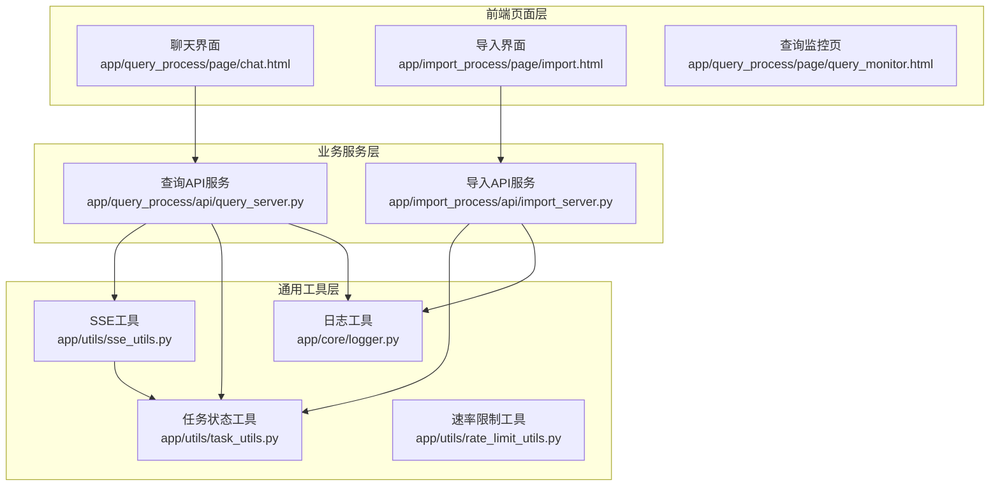

**图表来源**
- [app/query_process/api/query_server.py:1-164](file://app/query_process/api/query_server.py#L1-L164)
- [app/import_process/api/import_server.py:1-172](file://app/import_process/api/import_server.py#L1-L172)
- [app/utils/sse_utils.py:1-108](file://app/utils/sse_utils.py#L1-L108)
- [app/utils/task_utils.py:1-187](file://app/utils/task_utils.py#L1-L187)
- [app/utils/rate_limit_utils.py:1-37](file://app/utils/rate_limit_utils.py#L1-L37)
- [app/core/logger.py:1-109](file://app/core/logger.py#L1-L109)

**章节来源**
- [app/query_process/api/query_server.py:1-164](file://app/query_process/api/query_server.py#L1-L164)
- [app/import_process/api/import_server.py:1-172](file://app/import_process/api/import_server.py#L1-L172)
- [app/utils/sse_utils.py:1-108](file://app/utils/sse_utils.py#L1-L108)
- [app/utils/task_utils.py:1-187](file://app/utils/task_utils.py#L1-L187)
- [app/utils/rate_limit_utils.py:1-37](file://app/utils/rate_limit_utils.py#L1-L37)
- [app/core/logger.py:1-109](file://app/core/logger.py#L1-L109)

## 核心组件
- SSE事件与生成器：提供事件类型常量、会话队列管理、消息打包与生成器
- 任务状态管理：维护任务状态、完成/运行节点列表、结果存储与推送
- 速率限制：滑动窗口算法，限制第三方API调用频率
- 日志工具：统一日志配置与位置修复，便于调试与审计
- 查询与导入服务：对外暴露查询、SSE流、导入、状态查询等接口

**章节来源**
- [app/utils/sse_utils.py:8-108](file://app/utils/sse_utils.py#L8-L108)
- [app/utils/task_utils.py:1-187](file://app/utils/task_utils.py#L1-L187)
- [app/utils/rate_limit_utils.py:7-37](file://app/utils/rate_limit_utils.py#L7-L37)
- [app/core/logger.py:46-103](file://app/core/logger.py#L46-L103)

## 架构总览
系统采用“服务端事件推送 + 客户端订阅”的模式，结合内存态任务状态与会话队列，实现低延迟、高吞吐的实时状态同步。查询与导入两条主干流程分别承载不同业务场景，共享通用工具层能力。

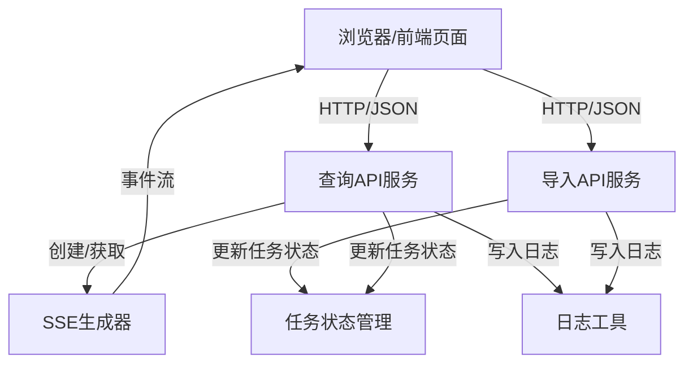

**图表来源**
- [app/query_process/api/query_server.py:48-126](file://app/query_process/api/query_server.py#L48-L126)
- [app/import_process/api/import_server.py:93-166](file://app/import_process/api/import_server.py#L93-L166)
- [app/utils/sse_utils.py:54-108](file://app/utils/sse_utils.py#L54-L108)
- [app/utils/task_utils.py:174-187](file://app/utils/task_utils.py#L174-L187)
- [app/core/logger.py:86-103](file://app/core/logger.py#L86-L103)

## 详细组件分析

### SSE事件与流式传输
- 事件类型：ready、progress、delta、final、error、__close__
- 会话队列：以session_id为键的全局队列，按会话隔离
- 消息打包：将事件名与数据序列化为SSE标准格式
- 生成器：异步迭代队列消息，支持客户端断开检测与优雅退出

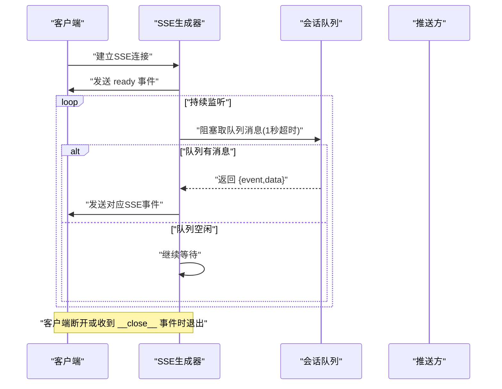

**图表来源**
- [app/utils/sse_utils.py:54-108](file://app/utils/sse_utils.py#L54-L108)

**章节来源**
- [app/utils/sse_utils.py:8-108](file://app/utils/sse_utils.py#L8-L108)

### 事件格式规范
- 事件字段：event（事件类型）、data（JSON序列化负载）
- 客户端解析：EventSource监听progress/delta/final/error等事件，解析data中的JSON
- 前端集成：聊天界面通过EventSource订阅/stream/{session_id}，按事件类型更新UI

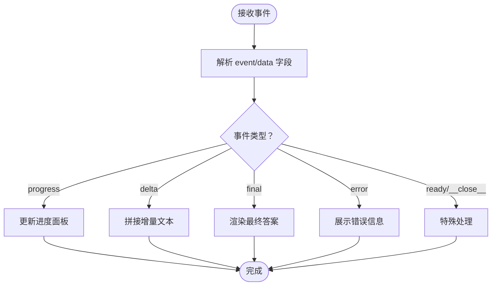

**图表来源**
- [app/query_process/page/chat.html:768-800](file://app/query_process/page/chat.html#L768-L800)
- [app/utils/sse_utils.py:37-42](file://app/utils/sse_utils.py#L37-L42)

**章节来源**
- [app/query_process/page/chat.html:768-800](file://app/query_process/page/chat.html#L768-L800)
- [app/utils/sse_utils.py:37-42](file://app/utils/sse_utils.py#L37-L42)

### 客户端集成方式
- 查询服务：提交POST /query获取session_id；随后EventSource订阅/stream/{session_id}
- 导入服务：上传文件后轮询/status/{task_id}获取进度
- 监控页：定期拉取查询监控接口，展示汇总与明细

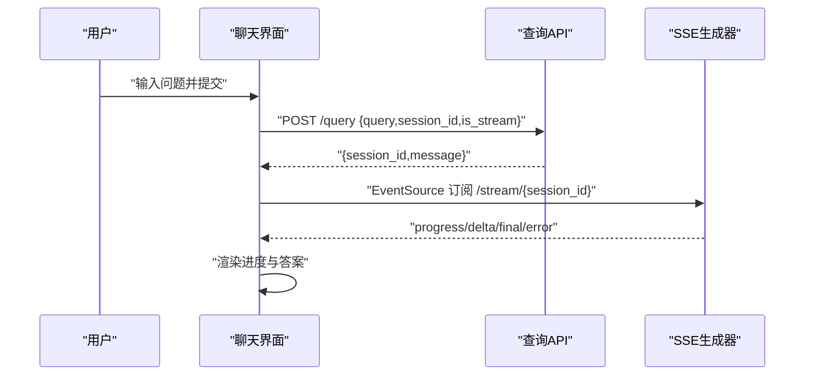

**图表来源**
- [app/query_process/page/chat.html:687-768](file://app/query_process/page/chat.html#L687-L768)
- [app/query_process/api/query_server.py:78-126](file://app/query_process/api/query_server.py#L78-L126)

**章节来源**
- [app/query_process/page/chat.html:687-768](file://app/query_process/page/chat.html#L687-L768)
- [app/query_process/api/query_server.py:78-126](file://app/query_process/api/query_server.py#L78-L126)

### 状态同步机制
- 查询流程：通过任务状态管理更新任务状态与节点列表，SSE推送progress事件
- 导入流程：上传完成后异步执行导入图，周期性更新任务状态
- 前端轮询：导入界面每2秒轮询一次/status/{task_id}

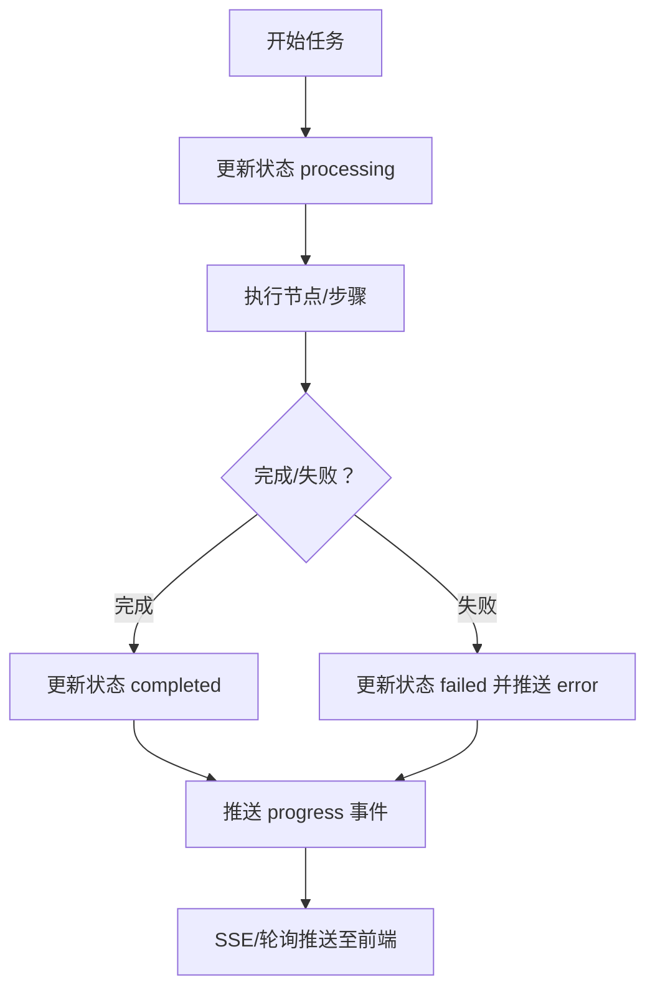

**图表来源**
- [app/utils/task_utils.py:161-187](file://app/utils/task_utils.py#L161-L187)
- [app/query_process/api/query_server.py:56-76](file://app/query_process/api/query_server.py#L56-L76)
- [app/import_process/api/import_server.py:70-91](file://app/import_process/api/import_server.py#L70-L91)

**章节来源**
- [app/utils/task_utils.py:161-187](file://app/utils/task_utils.py#L161-L187)
- [app/query_process/api/query_server.py:56-76](file://app/query_process/api/query_server.py#L56-L76)
- [app/import_process/api/import_server.py:70-91](file://app/import_process/api/import_server.py#L70-L91)

### 任务状态管理
- 数据结构：任务运行/完成列表、任务状态、任务结果
- 状态更新：提供更新任务状态、添加运行/完成节点、设置/获取结果等接口
- 推送：task_push_queue将当前状态打包为progress事件推送

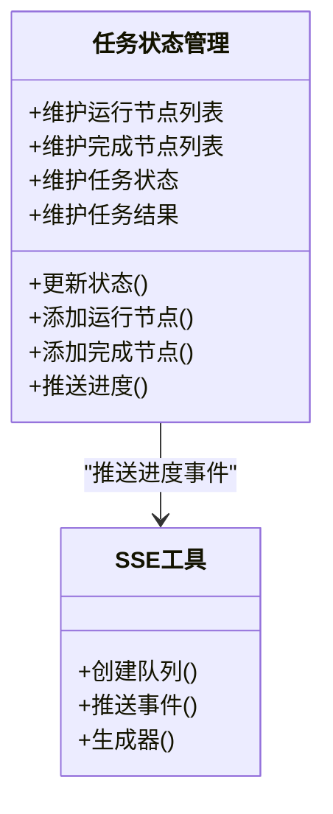

**图表来源**
- [app/utils/task_utils.py:1-187](file://app/utils/task_utils.py#L1-L187)
- [app/utils/sse_utils.py:21-108](file://app/utils/sse_utils.py#L21-L108)

**章节来源**
- [app/utils/task_utils.py:1-187](file://app/utils/task_utils.py#L1-L187)
- [app/utils/sse_utils.py:21-108](file://app/utils/sse_utils.py#L21-L108)

### 限流与节流机制
- 滑动窗口算法：维护请求时间戳队列，窗口内超过阈值则阻塞等待
- 应用场景：第三方API调用频率控制，避免触发限流
- 并发控制：通过队列与异步生成器避免阻塞事件循环

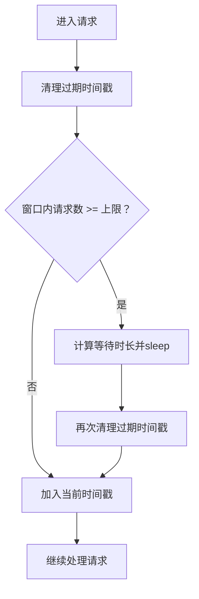

**图表来源**
- [app/utils/rate_limit_utils.py:7-37](file://app/utils/rate_limit_utils.py#L7-L37)

**章节来源**
- [app/utils/rate_limit_utils.py:7-37](file://app/utils/rate_limit_utils.py#L7-L37)

### 监控指标设计与采集
- 查询监控页：展示总请求、成功、失败、处理中、成功率、P95延迟等
- 数据来源：后端聚合统计与最近条目列表
- 前端采集：定时拉取监控接口，支持按关键词过滤与查看详情

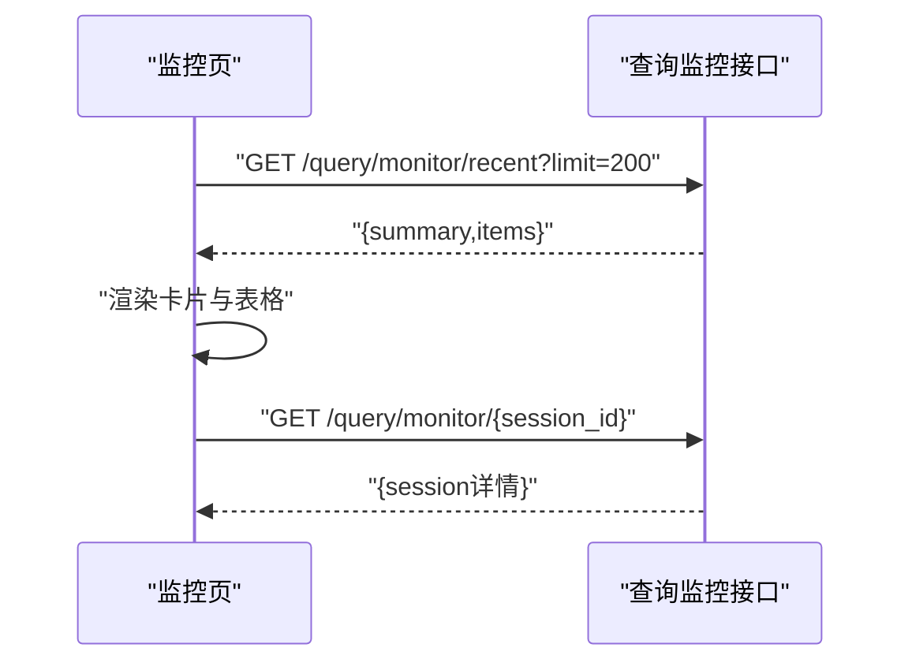

**图表来源**
- [app/query_process/page/query_monitor.html:96-138](file://app/query_process/page/query_monitor.html#L96-L138)

**章节来源**
- [app/query_process/page/query_monitor.html:1-142](file://app/query_process/page/query_monitor.html#L1-L142)

### 错误处理与重连机制
- 客户端侧：EventSource监听error事件，必要时进行重连或降级处理
- 服务端侧：捕获异常并推送error事件；生成器在断开或异常时优雅退出并清理资源
- 导入流程：失败时更新状态并记录日志

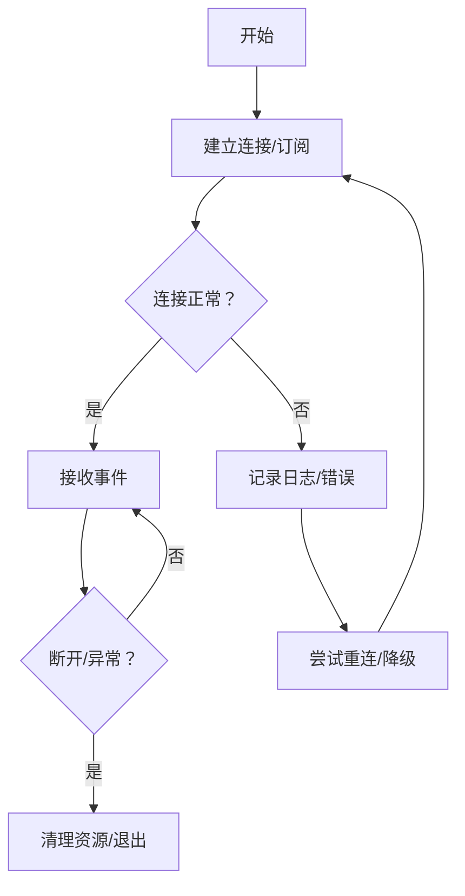

**图表来源**
- [app/utils/sse_utils.py:99-108](file://app/utils/sse_utils.py#L99-L108)
- [app/query_process/page/chat.html:768-800](file://app/query_process/page/chat.html#L768-L800)

**章节来源**
- [app/utils/sse_utils.py:99-108](file://app/utils/sse_utils.py#L99-L108)
- [app/query_process/page/chat.html:768-800](file://app/query_process/page/chat.html#L768-L800)

### 性能监控与调试工具
- 日志工具：统一配置控制台/文件输出、异步入队、位置修复，便于定位问题
- 前端性能埋点：聊天界面在关键阶段记录时间戳，辅助性能分析
- 服务端日志：查询/导入流程关键节点打点，便于审计与排障

**章节来源**
- [app/core/logger.py:46-103](file://app/core/logger.py#L46-L103)
- [app/query_process/page/chat.html:730-744](file://app/query_process/page/chat.html#L730-L744)
- [app/query_process/api/query_server.py:66-76](file://app/query_process/api/query_server.py#L66-L76)
- [app/import_process/api/import_server.py:80-91](file://app/import_process/api/import_server.py#L80-L91)

### 可靠性保障措施
- 断开检测：生成器主动检测客户端断开，及时释放资源
- 异常捕获：生成器捕获取消/重置/管道异常，避免崩溃
- 队列隔离：按session_id隔离队列，避免交叉影响
- 状态一致性：任务状态与节点列表更新原子化，减少竞态

**章节来源**
- [app/utils/sse_utils.py:71-108](file://app/utils/sse_utils.py#L71-L108)
- [app/utils/task_utils.py:68-109](file://app/utils/task_utils.py#L68-L109)

## 依赖关系分析
- 查询服务依赖SSE工具与任务状态工具，通过后台任务驱动LangGraph执行
- 导入服务依赖任务状态工具，上传完成后异步执行导入图
- 前端页面通过HTTP接口与SSE连接与后端交互
- 日志工具贯穿各模块，提供统一的日志输出与定位能力

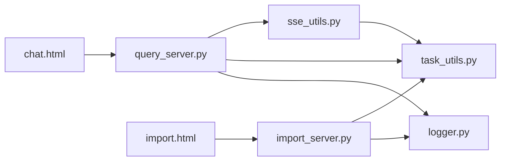

**图表来源**
- [app/query_process/api/query_server.py:14-17](file://app/query_process/api/query_server.py#L14-L17)
- [app/import_process/api/import_server.py:14-24](file://app/import_process/api/import_server.py#L14-L24)
- [app/utils/sse_utils.py:1-6](file://app/utils/sse_utils.py#L1-L6)
- [app/utils/task_utils.py:1-3](file://app/utils/task_utils.py#L1-L3)
- [app/core/logger.py:1-12](file://app/core/logger.py#L1-L12)

**章节来源**
- [app/query_process/api/query_server.py:14-17](file://app/query_process/api/query_server.py#L14-L17)
- [app/import_process/api/import_server.py:14-24](file://app/import_process/api/import_server.py#L14-L24)
- [app/utils/sse_utils.py:1-6](file://app/utils/sse_utils.py#L1-L6)
- [app/utils/task_utils.py:1-3](file://app/utils/task_utils.py#L1-L3)
- [app/core/logger.py:1-12](file://app/core/logger.py#L1-L12)

## 性能考量
- SSE生成器采用run_in_executor避免阻塞事件循环，提高并发能力
- 会话队列按1秒超时轮询，平衡实时性与CPU占用
- 任务状态管理基于内存字典，避免IO开销，适合单进程部署
- 速率限制器在第三方API调用处使用，防止触发外部限流

**章节来源**
- [app/utils/sse_utils.py:78-86](file://app/utils/sse_utils.py#L78-L86)
- [app/utils/rate_limit_utils.py:18-36](file://app/utils/rate_limit_utils.py#L18-L36)

## 故障排查指南
- SSE连接问题：检查会话队列是否存在、客户端是否断开、生成器是否抛出异常
- 任务状态异常：核对任务状态更新链路、节点列表去重与清理逻辑
- 日志定位：利用日志工具的全局配置与位置修复功能，快速定位业务模块调用位置
- 导入流程失败：查看导入图执行日志，确认任务状态更新与异常捕获

**章节来源**
- [app/utils/sse_utils.py:60-63](file://app/utils/sse_utils.py#L60-L63)
- [app/utils/task_utils.py:53-65](file://app/utils/task_utils.py#L53-L65)
- [app/core/logger.py:88-103](file://app/core/logger.py#L88-L103)
- [app/import_process/api/import_server.py:88-91](file://app/import_process/api/import_server.py#L88-L91)

## 结论
该系统通过SSE实现低延迟、高可靠的状态同步，结合内存态任务状态管理与统一日志工具，满足查询与导入两大业务场景的实时需求。通过滑动窗口限流与异步生成器，系统在高并发下仍能保持稳定。前端页面提供直观的进度与监控视图，配合完善的错误处理与性能埋点，便于运维与开发快速定位问题。

## 附录
- 会话状态模型：查询与导入流程的状态字典定义，支撑任务状态与中间结果的传递
- 前端页面：聊天界面、导入界面、查询监控页的交互与数据流

**章节来源**
- [app/query_process/agent/state.py:5-61](file://app/query_process/agent/state.py#L5-L61)
- [app/import_process/agent/state.py:5-63](file://app/import_process/agent/state.py#L5-L63)
- [app/query_process/page/chat.html:1-800](file://app/query_process/page/chat.html#L1-L800)
- [app/import_process/page/import.html:1-351](file://app/import_process/page/import.html#L1-L351)
- [app/query_process/page/query_monitor.html:1-142](file://app/query_process/page/query_monitor.html#L1-L142)