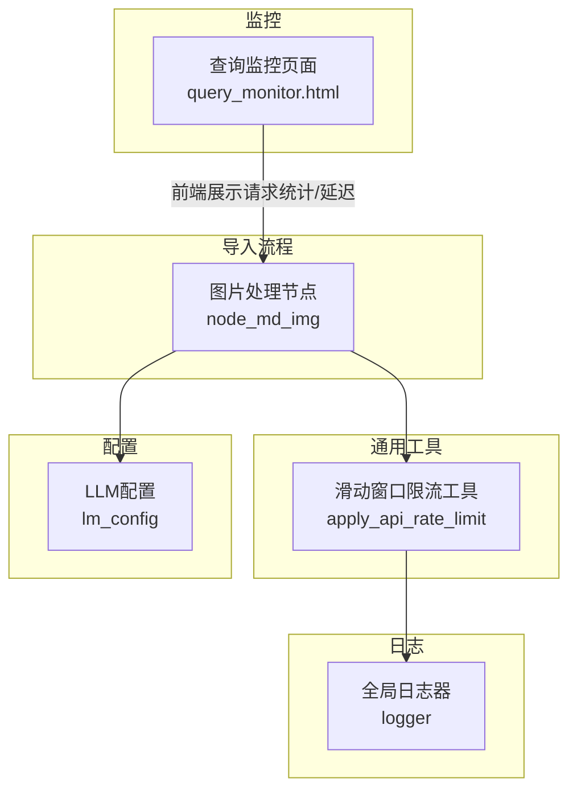
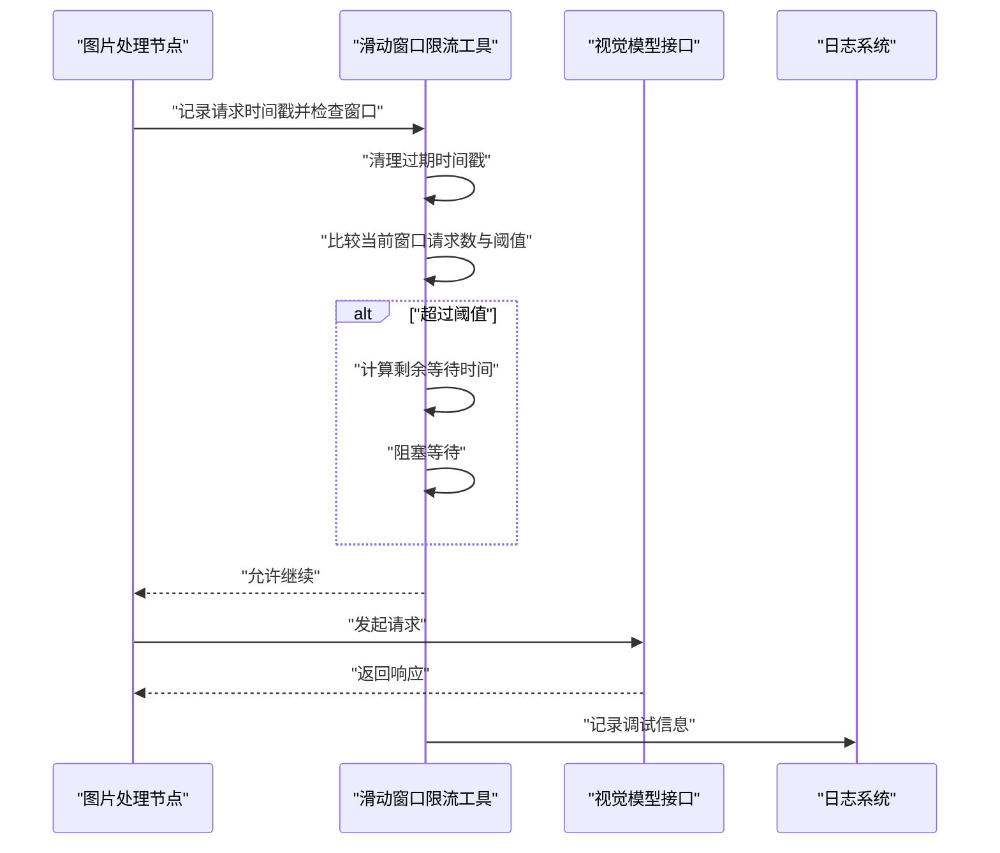
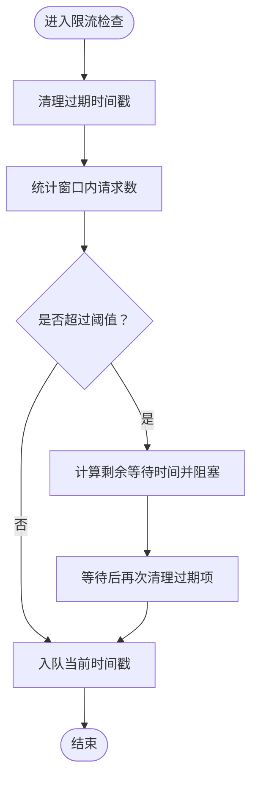
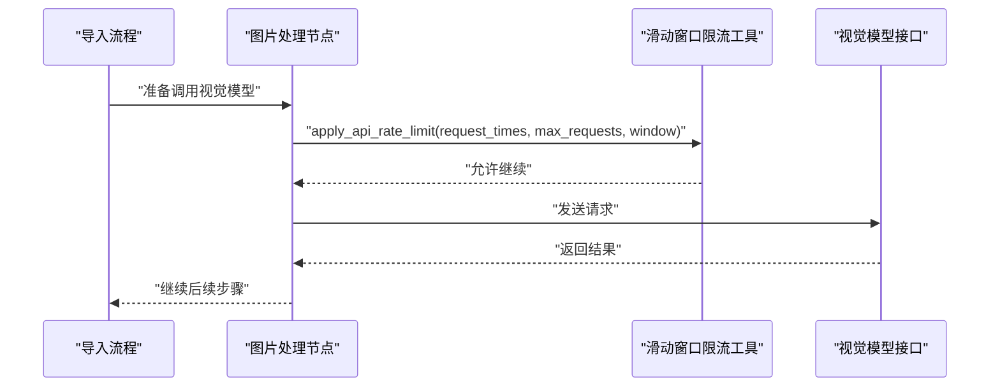
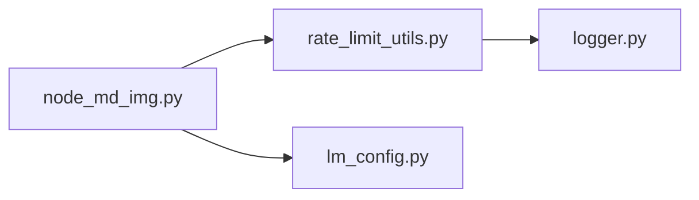

# 限流与节流控制

<cite>
**本文引用的文件**
- [app/utils/rate_limit_utils.py](file://app/utils/rate_limit_utils.py)
- [app/import_process/agent/nodes/node_md_img.py](file://app/import_process/agent/nodes/node_md_img.py)
- [app/conf/lm_config.py](file://app/conf/lm_config.py)
- [app/core/logger.py](file://app/core/logger.py)
- [app/query_process/page/query_monitor.html](file://app/query_process/page/query_monitor.html)
</cite>

## 目录
1. [引言](#引言)
2. [项目结构](#项目结构)
3. [核心组件](#核心组件)
4. [架构总览](#架构总览)
5. [详细组件分析](#详细组件分析)
6. [依赖分析](#依赖分析)
7. [性能考量](#性能考量)
8. [故障排除指南](#故障排除指南)
9. [结论](#结论)
10. [附录](#附录)

## 引言
本文件围绕仓库中的限流与节流控制机制展开，重点解释滑动窗口算法的实现原理与数学模型，梳理在导入流程中如何通过滑动窗口实现对外部API的访问节流；并结合现有监控页面，给出限流状态的观测与统计思路。由于仓库未包含令牌桶、漏桶等显式实现，本文在“算法对比”部分以概念性说明为主，不直接映射到具体源码。

## 项目结构
与限流/节流相关的关键位置如下：
- 限流工具函数：位于通用工具模块，提供滑动窗口节流能力
- 导入流程节点：在图片处理节点中调用限流工具，控制对外部视觉模型接口的请求频率
- 配置模块：提供大模型服务的基础URL与密钥等配置项
- 日志模块：提供统一的日志输出，便于限流触发与调试
- 查询监控页面：前端展示查询侧的请求统计与延迟指标，可用于类比限流状态观测

图表来源
- [app/utils/rate_limit_utils.py:1-37](file://app/utils/rate_limit_utils.py#L1-L37)
- [app/import_process/agent/nodes/node_md_img.py:170-216](file://app/import_process/agent/nodes/node_md_img.py#L170-L216)
- [app/conf/lm_config.py:1-27](file://app/conf/lm_config.py#L1-L27)
- [app/core/logger.py:1-109](file://app/core/logger.py#L1-L109)
- [app/query_process/page/query_monitor.html:1-142](file://app/query_process/page/query_monitor.html#L1-L142)

章节来源
- [app/utils/rate_limit_utils.py:1-37](file://app/utils/rate_limit_utils.py#L1-L37)
- [app/import_process/agent/nodes/node_md_img.py:170-216](file://app/import_process/agent/nodes/node_md_img.py#L170-L216)
- [app/conf/lm_config.py:1-27](file://app/conf/lm_config.py#L1-L27)
- [app/core/logger.py:1-109](file://app/core/logger.py#L1-L109)
- [app/query_process/page/query_monitor.html:1-142](file://app/query_process/page/query_monitor.html#L1-L142)

## 核心组件
- 滑动窗口限流工具
  - 维护一个按时间排序的双端队列，用于记录窗口内的请求时间戳
  - 在每次请求前清理过期时间戳，计算当前窗口内请求数量
  - 当超过阈值时，计算剩余等待时间并阻塞，直至满足窗口速率要求
  - 记录当前请求时间戳，继续后续处理
- 导入流程节点中的应用
  - 在调用视觉模型接口前，对同一进程内的请求队列施加限流
  - 通过调整窗口大小与最大请求数，平衡吞吐与第三方API限流风险
- 日志与监控
  - 限流触发与队列长度变更均通过统一日志器输出，便于观测
  - 查询监控页面提供请求总量、成功/失败、处理中、成功率、P95延迟等指标，可作为限流状态观测的参考模板

章节来源
- [app/utils/rate_limit_utils.py:7-37](file://app/utils/rate_limit_utils.py#L7-L37)
- [app/import_process/agent/nodes/node_md_img.py:180-184](file://app/import_process/agent/nodes/node_md_img.py#L180-L184)
- [app/core/logger.py:46-83](file://app/core/logger.py#L46-L83)
- [app/query_process/page/query_monitor.html:49-94](file://app/query_process/page/query_monitor.html#L49-L94)

## 架构总览
下图展示了限流在导入流程中的调用链路与数据流：

图表来源
- [app/import_process/agent/nodes/node_md_img.py:170-216](file://app/import_process/agent/nodes/node_md_img.py#L170-L216)
- [app/utils/rate_limit_utils.py:20-37](file://app/utils/rate_limit_utils.py#L20-L37)
- [app/core/logger.py:46-83](file://app/core/logger.py#L46-L83)

## 详细组件分析

### 滑动窗口限流算法
- 时间窗口定义
  - 以秒为单位的滑动窗口长度，决定统计周期
- 请求计数
  - 使用双端队列维护窗口内的请求时间戳，每次请求前清理过期项
- 阈值判断
  - 当窗口内请求数达到阈值时，计算最早请求距窗口起点的时间差，得出剩余等待时间
  - 若仍有剩余时间，则阻塞等待，直到满足速率要求
- 复杂度与行为
  - 每次请求清理过期项的摊销复杂度近似O(n)，其中n为过期项数量
  - 该策略对突发流量具有平滑作用，避免瞬时峰值触发限流

图表来源
- [app/utils/rate_limit_utils.py:20-37](file://app/utils/rate_limit_utils.py#L20-L37)

章节来源
- [app/utils/rate_limit_utils.py:7-37](file://app/utils/rate_limit_utils.py#L7-L37)

### 导入流程中的限流应用
- 调用位置
  - 在图片处理节点中，针对视觉模型请求前调用限流工具
- 队列复用
  - 使用进程内全局/单例队列，确保跨多次调用的连续性
- 配置要点
  - 窗口大小与最大请求数根据第三方API的配额与稳定性进行权衡

图表来源
- [app/import_process/agent/nodes/node_md_img.py:170-216](file://app/import_process/agent/nodes/node_md_img.py#L170-L216)
- [app/utils/rate_limit_utils.py:7-37](file://app/utils/rate_limit_utils.py#L7-L37)

章节来源
- [app/import_process/agent/nodes/node_md_img.py:170-216](file://app/import_process/agent/nodes/node_md_img.py#L170-L216)

### 限流策略设计与实现要点
- 全局限流
  - 通过共享的请求时间戳队列实现，适用于同一进程内对外部服务的统一节流
- 用户限流与IP限流
  - 仓库未提供用户维度或IP维度的独立队列实现
  - 如需扩展，可在调用侧按用户标识或IP构建独立队列，分别调用限流工具

章节来源
- [app/utils/rate_limit_utils.py:7-18](file://app/utils/rate_limit_utils.py#L7-L18)
- [app/import_process/agent/nodes/node_md_img.py:180-184](file://app/import_process/agent/nodes/node_md_img.py#L180-L184)

### 节流机制的作用与实现
- 作用
  - 平滑请求分布，降低触发第三方API限流的风险
  - 在高并发场景下保护下游服务，避免瞬时拥塞
- 实现方式
  - 仓库采用“阻塞等待”的同步节流策略，等待至满足窗口速率后再继续
  - 未包含请求合并、延迟处理等异步节流手段

章节来源
- [app/utils/rate_limit_utils.py:12-19](file://app/utils/rate_limit_utils.py#L12-L19)
- [app/import_process/agent/nodes/node_md_img.py:180-184](file://app/import_process/agent/nodes/node_md_img.py#L180-L184)

### 限流配置参数与调优
- 关键参数
  - 窗口大小（秒）：决定统计周期
  - 最大请求数：决定窗口内的请求上限
- 调优建议
  - 以第三方API的配额与SLA为上限，留出安全余量
  - 结合日志观测窗口内请求数变化，逐步提升阈值以逼近最优吞吐

章节来源
- [app/utils/rate_limit_utils.py:9-11](file://app/utils/rate_limit_utils.py#L9-L11)
- [app/core/logger.py:46-83](file://app/core/logger.py#L46-L83)

### 限流API使用示例与对比
- 示例路径
  - 调用示例位于图片处理节点中，调用限流工具并传入队列、阈值与窗口
- 算法对比（概念性说明）
  - 令牌桶：以固定速率生成令牌，允许突发但总体速率受控
  - 漏桶：恒定速率流出，对突发有更强的削峰能力
  - 滑动窗口：强调“最近N秒”的平均速率，适合对均值敏感的场景

章节来源
- [app/import_process/agent/nodes/node_md_img.py:180-184](file://app/import_process/agent/nodes/node_md_img.py#L180-L184)
- [app/utils/rate_limit_utils.py:7-37](file://app/utils/rate_limit_utils.py#L7-L37)

### 限流状态监控与统计
- 现有监控页面
  - 展示总请求、成功/失败、处理中、成功率、P95延迟等指标
- 限流观测建议
  - 借鉴监控页面的指标组织方式，采集限流触发次数、等待时长、窗口内请求数等
  - 通过日志聚合与可视化，形成限流状态仪表板

章节来源
- [app/query_process/page/query_monitor.html:49-94](file://app/query_process/page/query_monitor.html#L49-L94)
- [app/core/logger.py:46-83](file://app/core/logger.py#L46-L83)

### 扩展性与分布式部署
- 进程内扩展
  - 为不同用户/IP/租户维护独立队列，分别调用限流工具
- 分布式部署
  - 仓库未提供分布式限流实现
  - 建议引入集中式缓存或限流服务，统一管理各节点的请求配额与状态

章节来源
- [app/utils/rate_limit_utils.py:7-18](file://app/utils/rate_limit_utils.py#L7-L18)
- [app/import_process/agent/nodes/node_md_img.py:180-184](file://app/import_process/agent/nodes/node_md_img.py#L180-L184)

## 依赖分析
- 组件耦合
  - 导入流程节点依赖限流工具函数
  - 限流工具依赖日志系统进行调试输出
- 外部依赖
  - 视觉模型接口由配置模块提供基础URL与密钥

图表来源
- [app/import_process/agent/nodes/node_md_img.py:170-216](file://app/import_process/agent/nodes/node_md_img.py#L170-L216)
- [app/utils/rate_limit_utils.py:1-5](file://app/utils/rate_limit_utils.py#L1-L5)
- [app/conf/lm_config.py:20-26](file://app/conf/lm_config.py#L20-L26)

章节来源
- [app/import_process/agent/nodes/node_md_img.py:170-216](file://app/import_process/agent/nodes/node_md_img.py#L170-L216)
- [app/utils/rate_limit_utils.py:1-5](file://app/utils/rate_limit_utils.py#L1-L5)
- [app/conf/lm_config.py:20-26](file://app/conf/lm_config.py#L20-L26)

## 性能考量
- 滑动窗口清理成本
  - 每次请求可能触发队列头部清理，建议在高频场景下评估队列长度与清理开销
- 阻塞等待的影响
  - 同步阻塞会降低并发度，建议结合业务特性选择合适的窗口与阈值
- 日志输出
  - 调试日志有助于定位限流触发点，生产环境可根据需要调整日志级别

章节来源
- [app/utils/rate_limit_utils.py:20-37](file://app/utils/rate_limit_utils.py#L20-L37)
- [app/core/logger.py:46-83](file://app/core/logger.py#L46-L83)

## 故障排除指南
- 限流频繁触发
  - 检查窗口大小与最大请求数设置是否过于保守
  - 查看日志中“当前窗口内请求数”与“需等待时长”，据此调整
- 请求被长时间阻塞
  - 确认是否存在大量并发请求集中在同一窗口起点附近
  - 考虑增大窗口或提高阈值，或引入异步处理
- 日志不可见
  - 检查日志初始化与级别配置，确保调试信息被输出

章节来源
- [app/utils/rate_limit_utils.py:28-30](file://app/utils/rate_limit_utils.py#L28-L30)
- [app/core/logger.py:46-83](file://app/core/logger.py#L46-L83)

## 结论
本仓库通过滑动窗口限流工具实现了对导入流程中外部API请求的节流控制，具备实现简单、可观测性强的特点。对于更复杂的限流策略（如令牌桶、漏桶）与分布式限流，可在现有基础上扩展队列维度与集中式存储。结合查询监控页面的指标组织方式，可进一步完善限流状态的观测与告警体系。

## 附录
- 相关配置项
  - 大模型服务基础URL与密钥：用于调用视觉模型接口
- 监控页面功能
  - 提供请求总量、成功率、P95延迟等指标，可作为限流观测的参考模板

章节来源
- [app/conf/lm_config.py:20-26](file://app/conf/lm_config.py#L20-L26)
- [app/query_process/page/query_monitor.html:49-94](file://app/query_process/page/query_monitor.html#L49-L94)