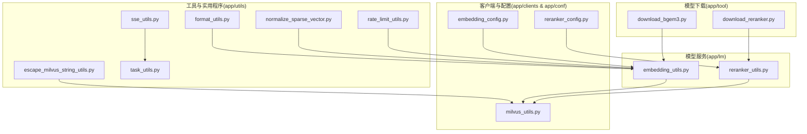
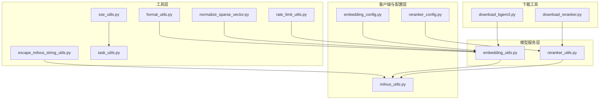
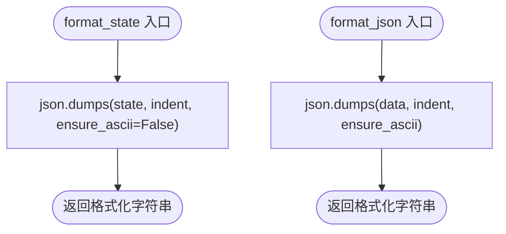
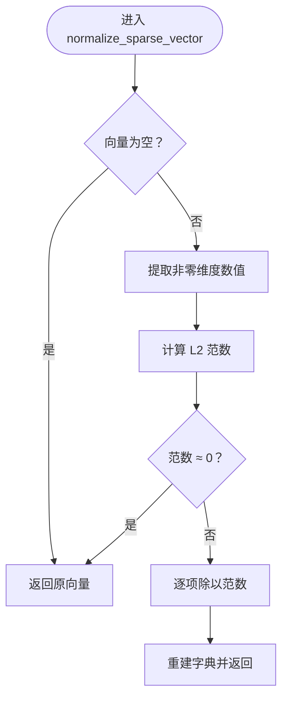
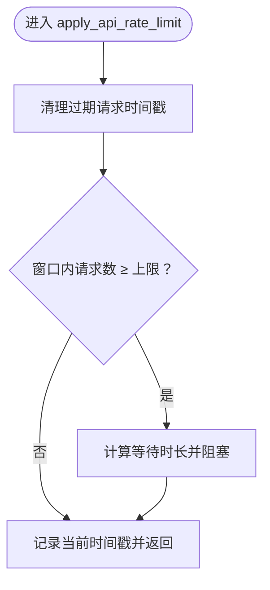
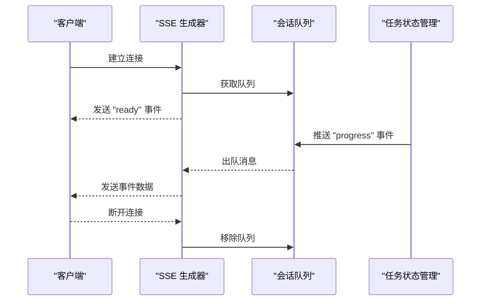
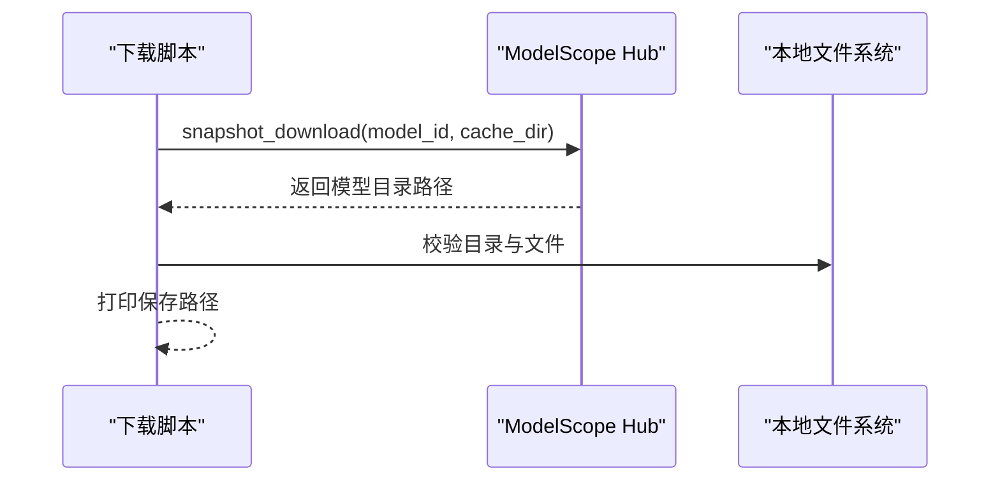
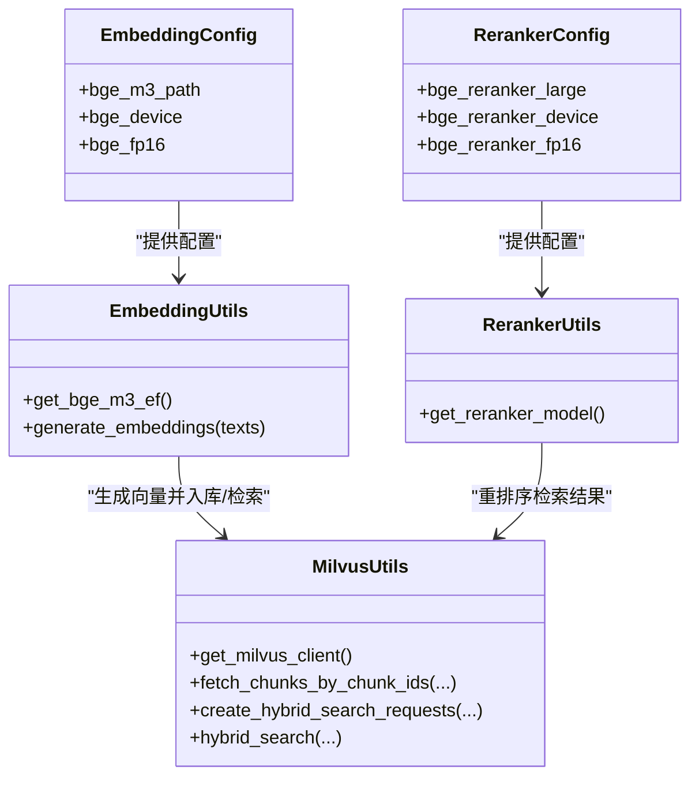
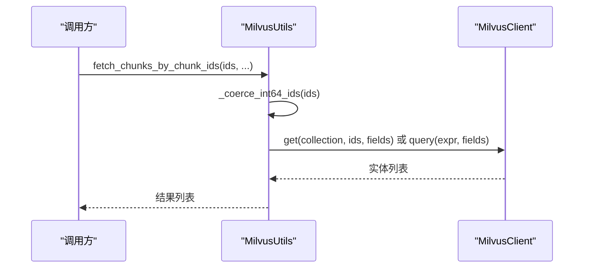
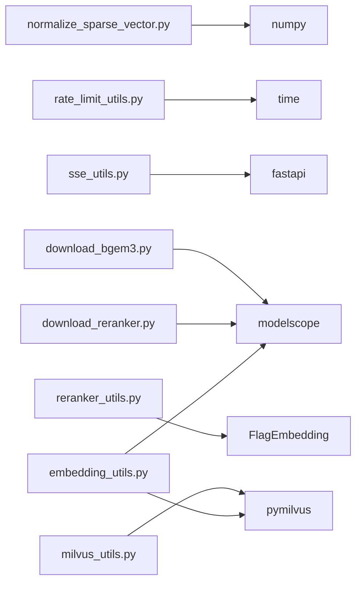

# 工具函数与实用程序

<cite>
**本文引用的文件**
- [escape_milvus_string_utils.py](file://app/utils/escape_milvus_string_utils.py)
- [format_utils.py](file://app/utils/format_utils.py)
- [normalize_sparse_vector.py](file://app/utils/normalize_sparse_vector.py)
- [rate_limit_utils.py](file://app/utils/rate_limit_utils.py)
- [sse_utils.py](file://app/utils/sse_utils.py)
- [task_utils.py](file://app/utils/task_utils.py)
- [download_bgem3.py](file://app/tool/download_bgem3.py)
- [download_reranker.py](file://app/tool/download_reranker.py)
- [embedding_utils.py](file://app/lm/embedding_utils.py)
- [reranker_utils.py](file://app/lm/reranker_utils.py)
- [milvus_utils.py](file://app/clients/milvus_utils.py)
- [embedding_config.py](file://app/conf/embedding_config.py)
- [reranker_config.py](file://app/conf/reranker_config.py)
</cite>

## 目录
1. [简介](#简介)
2. [项目结构](#项目结构)
3. [核心组件](#核心组件)
4. [架构概览](#架构概览)
5. [详细组件分析](#详细组件分析)
6. [依赖分析](#依赖分析)
7. [性能考虑](#性能考虑)
8. [故障排除指南](#故障排除指南)
9. [结论](#结论)
10. [附录](#附录)

## 简介
本文件聚焦于工具函数与实用程序模块，系统梳理以下能力：
- 数据处理工具：字符串转义、JSON格式化、稀疏向量归一化、速率限制、SSE事件推送与任务状态管理
- 模型下载工具：BGE-M3与重排序模型的下载、缓存与安装流程
- 系统与路径管理：Milvus客户端封装、配置加载与环境变量解析
- 使用示例与最佳实践：如何在导入与查询流程中正确调用这些工具
- 扩展与自定义指南：如何基于现有工具扩展新的功能
- 测试与验证方法：结合现有测试脚本与日志策略进行验证

## 项目结构
工具与实用程序主要分布在 app/utils、app/tool、app/lm、app/clients、app/conf 等子目录，围绕“数据处理—模型服务—检索集成—任务编排—配置管理”形成清晰分层。

图表来源
- [escape_milvus_string_utils.py:1-24](file://app/utils/escape_milvus_string_utils.py#L1-L24)
- [format_utils.py:1-56](file://app/utils/format_utils.py#L1-L56)
- [normalize_sparse_vector.py:1-23](file://app/utils/normalize_sparse_vector.py#L1-L23)
- [rate_limit_utils.py:1-37](file://app/utils/rate_limit_utils.py#L1-L37)
- [sse_utils.py:1-108](file://app/utils/sse_utils.py#L1-L108)
- [task_utils.py:1-187](file://app/utils/task_utils.py#L1-L187)
- [download_bgem3.py:1-5](file://app/tool/download_bgem3.py#L1-L5)
- [download_reranker.py:1-10](file://app/tool/download_reranker.py#L1-L10)
- [embedding_utils.py:1-108](file://app/lm/embedding_utils.py#L1-L108)
- [reranker_utils.py:1-14](file://app/lm/reranker_utils.py#L1-L14)
- [milvus_utils.py:1-198](file://app/clients/milvus_utils.py#L1-L198)
- [embedding_config.py:1-24](file://app/conf/embedding_config.py#L1-L24)
- [reranker_config.py:1-21](file://app/conf/reranker_config.py#L1-L21)

章节来源
- [escape_milvus_string_utils.py:1-24](file://app/utils/escape_milvus_string_utils.py#L1-L24)
- [format_utils.py:1-56](file://app/utils/format_utils.py#L1-L56)
- [normalize_sparse_vector.py:1-23](file://app/utils/normalize_sparse_vector.py#L1-L23)
- [rate_limit_utils.py:1-37](file://app/utils/rate_limit_utils.py#L1-L37)
- [sse_utils.py:1-108](file://app/utils/sse_utils.py#L1-L108)
- [task_utils.py:1-187](file://app/utils/task_utils.py#L1-L187)
- [download_bgem3.py:1-5](file://app/tool/download_bgem3.py#L1-L5)
- [download_reranker.py:1-10](file://app/tool/download_reranker.py#L1-L10)
- [embedding_utils.py:1-108](file://app/lm/embedding_utils.py#L1-L108)
- [reranker_utils.py:1-14](file://app/lm/reranker_utils.py#L1-L14)
- [milvus_utils.py:1-198](file://app/clients/milvus_utils.py#L1-L198)
- [embedding_config.py:1-24](file://app/conf/embedding_config.py#L1-L24)
- [reranker_config.py:1-21](file://app/conf/reranker_config.py#L1-L21)

## 核心组件
- 字符串转义工具：为 Milvus 过滤表达式提供安全转义，避免特殊字符导致解析失败
- JSON 格式化工具：统一工作流状态与任意数据的 JSON 序列化输出
- 稀疏向量归一化工具：对稀疏向量进行 L2 归一化，保持零维不变
- 速率限制工具：基于滑动窗口的 API 请求节流，保障第三方服务稳定性
- SSE 事件推送与任务状态管理：维护会话队列、事件打包与进度推送，配合任务状态机
- 模型下载工具：基于 ModelScope 的快照下载，支持本地缓存目录与模型安装
- 模型服务工具：BGE-M3 混合向量生成与重排序模型加载，配套配置管理
- Milvus 客户端封装：单例连接、ID 类型转换、批量查询、混合检索请求构建与执行

章节来源
- [escape_milvus_string_utils.py:1-24](file://app/utils/escape_milvus_string_utils.py#L1-L24)
- [format_utils.py:1-56](file://app/utils/format_utils.py#L1-L56)
- [normalize_sparse_vector.py:1-23](file://app/utils/normalize_sparse_vector.py#L1-L23)
- [rate_limit_utils.py:1-37](file://app/utils/rate_limit_utils.py#L1-L37)
- [sse_utils.py:1-108](file://app/utils/sse_utils.py#L1-L108)
- [task_utils.py:1-187](file://app/utils/task_utils.py#L1-L187)
- [download_bgem3.py:1-5](file://app/tool/download_bgem3.py#L1-L5)
- [download_reranker.py:1-10](file://app/tool/download_reranker.py#L1-L10)
- [embedding_utils.py:1-108](file://app/lm/embedding_utils.py#L1-L108)
- [reranker_utils.py:1-14](file://app/lm/reranker_utils.py#L1-L14)
- [milvus_utils.py:1-198](file://app/clients/milvus_utils.py#L1-L198)
- [embedding_config.py:1-24](file://app/conf/embedding_config.py#L1-L24)
- [reranker_config.py:1-21](file://app/conf/reranker_config.py#L1-L21)

## 架构概览
下图展示了工具模块与模型服务、Milvus 客户端以及配置之间的交互关系。

图表来源
- [escape_milvus_string_utils.py:1-24](file://app/utils/escape_milvus_string_utils.py#L1-L24)
- [format_utils.py:1-56](file://app/utils/format_utils.py#L1-L56)
- [normalize_sparse_vector.py:1-23](file://app/utils/normalize_sparse_vector.py#L1-L23)
- [rate_limit_utils.py:1-37](file://app/utils/rate_limit_utils.py#L1-L37)
- [sse_utils.py:1-108](file://app/utils/sse_utils.py#L1-L108)
- [task_utils.py:1-187](file://app/utils/task_utils.py#L1-L187)
- [embedding_utils.py:1-108](file://app/lm/embedding_utils.py#L1-L108)
- [reranker_utils.py:1-14](file://app/lm/reranker_utils.py#L1-L14)
- [milvus_utils.py:1-198](file://app/clients/milvus_utils.py#L1-L198)
- [embedding_config.py:1-24](file://app/conf/embedding_config.py#L1-L24)
- [reranker_config.py:1-21](file://app/conf/reranker_config.py#L1-L21)
- [download_bgem3.py:1-5](file://app/tool/download_bgem3.py#L1-L5)
- [download_reranker.py:1-10](file://app/tool/download_reranker.py#L1-L10)

## 详细组件分析

### 字符串转义工具（Milvus）
- 功能概述：针对 Milvus 过滤表达式，对输入字符串执行反斜杠、双引号转义，并将换行/回车/制表符替换为空格，确保表达式在单行且语法正确
- 输入输出：字符串输入，返回安全字符串
- 典型场景：在根据标题、名称等字段构造 filter_expr 时使用
- 复杂度：O(n)，n 为字符串长度
- 边界处理：空值返回空字符串；强制转为字符串类型，避免非字符串引发异常

图表来源
- [escape_milvus_string_utils.py:1-24](file://app/utils/escape_milvus_string_utils.py#L1-L24)

章节来源
- [escape_milvus_string_utils.py:1-24](file://app/utils/escape_milvus_string_utils.py#L1-L24)

### JSON 格式化工具
- 功能概述：提供两类格式化函数
  - 工作流状态格式化：面向 ImportGraphState 的统一缩进输出
  - 通用 JSON 格式化：支持自定义缩进与 ASCII 控制，保留中文等非 ASCII 字符
- 输入输出：字典/列表等可序列化对象，返回 JSON 字符串
- 典型场景：日志输出、调试打印、接口响应体格式化
- 复杂度：O(n)，n 为序列化对象大小
- 边界处理：ensure_ascii=False 以保留中文；默认缩进 4 空格

图表来源
- [format_utils.py:1-56](file://app/utils/format_utils.py#L1-L56)

章节来源
- [format_utils.py:1-56](file://app/utils/format_utils.py#L1-L56)

### 稀疏向量归一化工具
- 功能概述：对稀疏向量（字典格式 {维度: 数值}）进行 L2 归一化，仅处理非零维度，零维度保持不变
- 输入输出：字典输入，字典输出
- 算法要点：
  - 提取非零维度数值，计算 L2 范数
  - 范数接近 0 则直接返回原向量，避免除零
  - 否则将每个数值除以范数，重建字典
- 复杂度：O(k)，k 为非零元素个数
- 适用场景：与 Milvus IP 内积检索配合，提升检索稳定性

图表来源
- [normalize_sparse_vector.py:1-23](file://app/utils/normalize_sparse_vector.py#L1-L23)

章节来源
- [normalize_sparse_vector.py:1-23](file://app/utils/normalize_sparse_vector.py#L1-L23)

### 速率限制工具（滑动窗口）
- 功能概述：维护请求时间戳队列，按窗口内最大请求数进行节流，必要时阻塞等待
- 关键参数：max_requests、window_seconds、request_times（双端队列）
- 行为特征：
  - 清理过期请求
  - 当窗口内请求数达到上限时，计算剩余等待时间并阻塞
  - 记录当前请求时间戳
- 复杂度：均摊 O(1)（清理过期请求摊销）

图表来源
- [rate_limit_utils.py:1-37](file://app/utils/rate_limit_utils.py#L1-L37)

章节来源
- [rate_limit_utils.py:1-37](file://app/utils/rate_limit_utils.py#L1-L37)

### SSE 事件推送与任务状态管理
- SSE 事件推送：
  - 事件类型常量：ready、progress、delta、final、error、__close__
  - 会话队列：按 session_id 管理队列，支持创建、获取、移除
  - 事件打包：将事件与数据打包为标准 SSE 格式
  - 异步生成器：支持 FastAPI StreamingResponse，处理客户端断开与异常
- 任务状态管理：
  - 维护运行中/已完成节点列表、任务状态、结果字典
  - 支持节点状态变更、结果写入、中文展示名映射、进度推送
  - 清理接口：按任务 ID 清理全部状态

图表来源
- [sse_utils.py:1-108](file://app/utils/sse_utils.py#L1-L108)
- [task_utils.py:1-187](file://app/utils/task_utils.py#L1-L187)

章节来源
- [sse_utils.py:1-108](file://app/utils/sse_utils.py#L1-L108)
- [task_utils.py:1-187](file://app/utils/task_utils.py#L1-L187)

### 模型下载工具（BGE-M3 与重排序模型）
- BGE-M3 下载：
  - 使用 snapshot_download 从 ModelScope 下载模型到指定缓存目录
  - 输出模型保存路径，便于后续加载
- 重排序模型下载：
  - 指定本地目录与模型 ID，下载完成后输出目录路径
- 验证与安装建议：
  - 下载完成后检查目录是否存在模型文件
  - 在 embedding_config/reranker_config 中配置本地路径或启用半精度加速
  - 通过 embedding_utils/reranker_utils 的单例加载验证可用性

图表来源
- [download_bgem3.py:1-5](file://app/tool/download_bgem3.py#L1-L5)
- [download_reranker.py:1-10](file://app/tool/download_reranker.py#L1-L10)

章节来源
- [download_bgem3.py:1-5](file://app/tool/download_bgem3.py#L1-L5)
- [download_reranker.py:1-10](file://app/tool/download_reranker.py#L1-L10)

### 模型服务工具（BGE-M3 与重排序）
- BGE-M3 混合向量生成：
  - 单例模式：避免重复初始化，提升性能
  - 配置来源：embedding_config，支持本地路径、设备、半精度开关
  - 输出：稠密向量（列表）+ 稀疏向量（字典列表），并开启原生 L2 归一化
  - 解析稀疏向量：将 CSR 索引与权重转换为 Python 原生类型，适配序列化
- 重排序模型加载：
  - 单例模式：按配置加载重排序模型，支持设备与半精度
- 与 Milvus 的适配：
  - BGE-M3 开启 normalize_embeddings=True，使稠密+稀疏向量均可用于 Milvus IP/COSINE 检索
  - 稀疏向量经 L2 归一化后，可直接入库与检索

图表来源
- [embedding_utils.py:1-108](file://app/lm/embedding_utils.py#L1-L108)
- [reranker_utils.py:1-14](file://app/lm/reranker_utils.py#L1-L14)
- [milvus_utils.py:1-198](file://app/clients/milvus_utils.py#L1-L198)
- [embedding_config.py:1-24](file://app/conf/embedding_config.py#L1-L24)
- [reranker_config.py:1-21](file://app/conf/reranker_config.py#L1-L21)

章节来源
- [embedding_utils.py:1-108](file://app/lm/embedding_utils.py#L1-L108)
- [reranker_utils.py:1-14](file://app/lm/reranker_utils.py#L1-L14)
- [milvus_utils.py:1-198](file://app/clients/milvus_utils.py#L1-L198)
- [embedding_config.py:1-24](file://app/conf/embedding_config.py#L1-L24)
- [reranker_config.py:1-21](file://app/conf/reranker_config.py#L1-L21)

### Milvus 客户端封装
- 单例客户端：避免重复创建连接，降低资源消耗
- ID 类型转换：将 chunk_id 转为 INT64，分离有效/无效 ID 并记录警告
- 批量查询：优先使用 get 主键直查，失败回退 query 过滤查询
- 混合检索：构建稠密/稀疏 ANN 搜索请求，使用 WeightedRanker 融合结果

图表来源
- [milvus_utils.py:1-198](file://app/clients/milvus_utils.py#L1-L198)

章节来源
- [milvus_utils.py:1-198](file://app/clients/milvus_utils.py#L1-L198)

## 依赖分析
- 内部耦合：
  - task_utils 依赖 sse_utils 进行进度推送
  - embedding_utils 与 reranker_utils 依赖各自配置模块
  - milvus_utils 作为底层客户端被 embedding_utils 与 reranker_utils 使用
- 外部依赖：
  - numpy（稀疏向量归一化）
  - fastapi（SSE 生成器）
  - modelscope（模型下载）
  - FlagEmbedding（重排序模型）
  - pymilvus（Milvus 客户端与检索）
- 风险点：
  - 模型下载路径与配置一致性
  - Milvus 连接配置缺失导致客户端初始化失败
  - SSE 会话队列未清理导致内存泄漏

图表来源
- [normalize_sparse_vector.py:1-23](file://app/utils/normalize_sparse_vector.py#L1-L23)
- [rate_limit_utils.py:1-37](file://app/utils/rate_limit_utils.py#L1-L37)
- [sse_utils.py:1-108](file://app/utils/sse_utils.py#L1-L108)
- [download_bgem3.py:1-5](file://app/tool/download_bgem3.py#L1-L5)
- [download_reranker.py:1-10](file://app/tool/download_reranker.py#L1-L10)
- [reranker_utils.py:1-14](file://app/lm/reranker_utils.py#L1-L14)
- [milvus_utils.py:1-198](file://app/clients/milvus_utils.py#L1-L198)
- [embedding_utils.py:1-108](file://app/lm/embedding_utils.py#L1-L108)

章节来源
- [normalize_sparse_vector.py:1-23](file://app/utils/normalize_sparse_vector.py#L1-L23)
- [rate_limit_utils.py:1-37](file://app/utils/rate_limit_utils.py#L1-L37)
- [sse_utils.py:1-108](file://app/utils/sse_utils.py#L1-L108)
- [download_bgem3.py:1-5](file://app/tool/download_bgem3.py#L1-L5)
- [download_reranker.py:1-10](file://app/tool/download_reranker.py#L1-L10)
- [reranker_utils.py:1-14](file://app/lm/reranker_utils.py#L1-L14)
- [milvus_utils.py:1-198](file://app/clients/milvus_utils.py#L1-L198)
- [embedding_utils.py:1-108](file://app/lm/embedding_utils.py#L1-L108)

## 性能考虑
- 单例模式：embedding_utils 与 reranker_utils 的模型单例避免重复初始化，显著降低延迟与资源占用
- 稀疏向量归一化：仅处理非零维度，复杂度与非零元素数量线性相关
- 滑动窗口速率限制：在高并发场景下保护第三方 API，避免突发流量
- Milvus 查询回退机制：优先 get 直查，失败回退 query，兼顾性能与可靠性
- SSE 异步生成：使用 run_in_executor 避免阻塞事件循环，提高并发吞吐

## 故障排除指南
- Milvus 客户端连接失败：
  - 检查 MILVUS_URL 环境变量是否配置
  - 查看日志中的错误堆栈，确认连接异常原因
- SSE 会话队列异常：
  - 确认 session_id 是否正确传递
  - 检查生成器是否提前断开或抛出异常
- 速率限制导致阻塞：
  - 调整 max_requests 与 window_seconds，或在调用方增加重试与退避
- 模型加载失败：
  - 校验本地模型路径与半精度配置
  - 通过单例加载函数捕获异常并定位具体错误
- 稀疏向量归一化异常：
  - 确认输入为非空字典，避免范数为 0 的情况

章节来源
- [milvus_utils.py:1-198](file://app/clients/milvus_utils.py#L1-L198)
- [sse_utils.py:1-108](file://app/utils/sse_utils.py#L1-L108)
- [rate_limit_utils.py:1-37](file://app/utils/rate_limit_utils.py#L1-L37)
- [embedding_utils.py:1-108](file://app/lm/embedding_utils.py#L1-L108)
- [normalize_sparse_vector.py:1-23](file://app/utils/normalize_sparse_vector.py#L1-L23)

## 结论
本工具集围绕“数据处理—模型服务—检索集成—任务编排—配置管理”形成闭环，既保证了工程可用性（单例、回退、日志），又兼顾了性能与可扩展性（异步、滑动窗口、稀疏向量归一化）。通过明确的下载与配置流程，能够稳定地支撑导入与查询两大核心流程。

## 附录

### 使用示例与最佳实践
- 字符串转义：在构造 Milvus 过滤表达式前，对用户输入或文件标题进行转义
- JSON 格式化：统一使用 format_utils 输出日志与调试信息，确保中文可读性
- 稀疏向量归一化：在 Milvus IP 检索前，确保稀疏向量已归一化
- 速率限制：对外部 API 调用统一接入滑动窗口限流，避免触发限流
- SSE 与任务状态：在长流程中通过 task_push_queue 推送进度，结合前端实时展示
- 模型下载与配置：先执行下载脚本，再在配置文件中设置本地路径与设备，最后通过单例加载验证

### 扩展与自定义指南
- 新增字符串处理工具：遵循现有转义规范，确保输出可用于目标平台的表达式
- 新增格式化工具：保持缩进与非 ASCII 字符控制的一致性
- 新增归一化算法：在 normalize_sparse_vector 基础上扩展，注意零维与数值类型处理
- 新增速率限制策略：在 rate_limit_utils 基础上扩展不同策略（令牌桶、漏桶等）
- 新增 SSE 事件类型：在 SSEEvent 常量中新增类型，并在推送侧处理
- 新增模型下载：参考 download_bgem3.py 与 download_reranker.py，统一缓存目录与路径配置

### 测试与验证方法
- 日志测试：通过日志级别与输出内容验证各工具行为（如模型初始化、向量生成、异常捕获）
- CUDA 测试：验证 GPU 设备可用性与半精度加速效果
- 环境变量优先级：验证 .env 与系统环境变量的加载顺序与覆盖关系
- 图形流程测试：验证导入与查询主流程的节点执行顺序与状态变化

章节来源
- [embedding_utils.py:1-108](file://app/lm/embedding_utils.py#L1-L108)
- [milvus_utils.py:1-198](file://app/clients/milvus_utils.py#L1-L198)
- [task_utils.py:1-187](file://app/utils/task_utils.py#L1-L187)
- [sse_utils.py:1-108](file://app/utils/sse_utils.py#L1-L108)