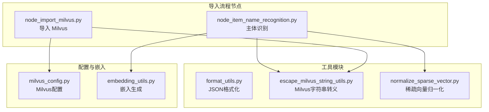
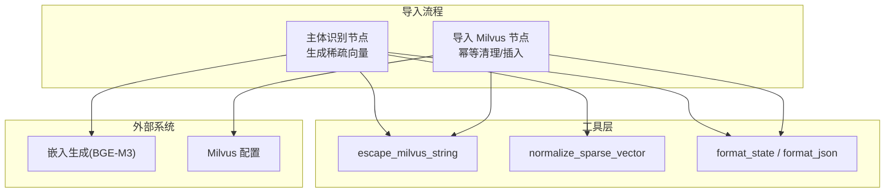
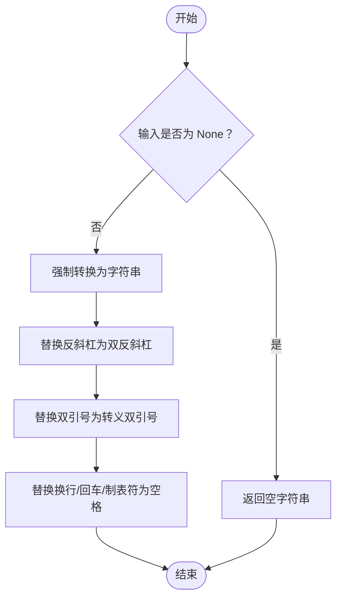
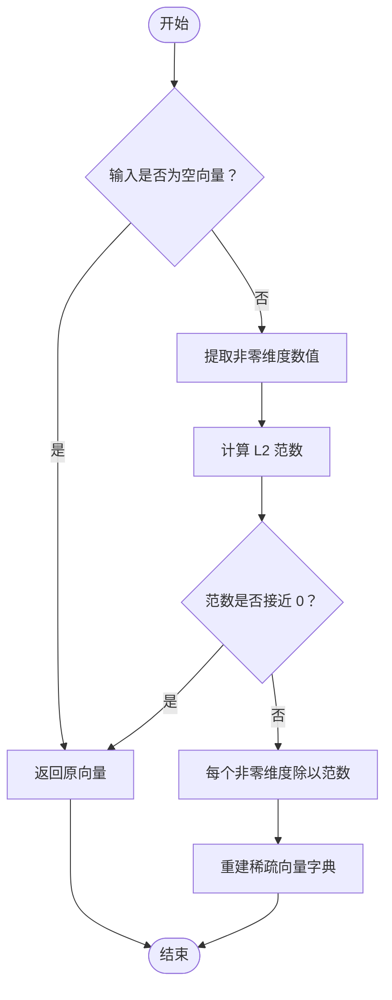
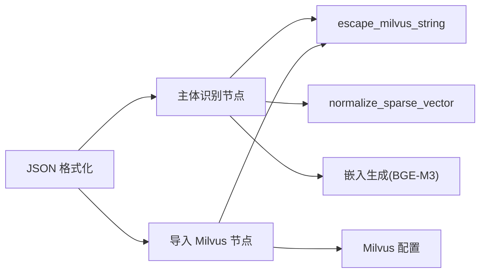

# 数据处理工具

<cite>
**本文引用的文件**
- [format_utils.py](file://app/utils/format_utils.py)
- [escape_milvus_string_utils.py](file://app/utils/escape_milvus_string_utils.py)
- [normalize_sparse_vector.py](file://app/utils/noramlize_sparse_vector.py)
- [node_item_name_recognition.py](file://app/import_process/agent/nodes/node_item_name_recognition.py)
- [node_import_milvus.py](file://app/import_process/agent/nodes/node_import_milvus.py)
- [milvus_config.py](file://app/conf/milvus_config.py)
- [embedding_utils.py](file://app/lm/embedding_utils.py)
</cite>

## 目录
1. [简介](#简介)
2. [项目结构](#项目结构)
3. [核心组件](#核心组件)
4. [架构概览](#架构概览)
5. [详细组件分析](#详细组件分析)
6. [依赖分析](#依赖分析)
7. [性能考虑](#性能考虑)
8. [故障排除指南](#故障排除指南)
9. [结论](#结论)
10. [附录](#附录)

## 简介
本文件聚焦于数据处理工具模块，系统化梳理以下三个工具函数的实现原理、参数配置、使用场景与最佳实践：
- JSON 格式化工具：format_state 与 format_json
- Milvus 字符串转义工具：escape_milvus_string
- 稀疏向量归一化工具：normalize_sparse_vector

文档还结合 RAG 导入与查询流程中的真实使用场景，说明各工具在 Milvus 向量检索与存储中的关键作用，并给出错误处理与边界情况的应对策略。

## 项目结构
工具模块位于 app/utils 下，分别提供：
- JSON 序列化与格式化能力（format_utils）
- Milvus 过滤表达式字符串安全转义（escape_milvus_string_utils）
- 稀疏向量 L2 归一化（normalize_sparse_vector）

这些工具在导入流程节点中被广泛使用，例如在“主体识别”节点中生成并存储稀疏向量，在“导入 Milvus”节点中进行幂等清理与插入。

图表来源
- [format_utils.py:11-54](file://app/utils/format_utils.py#L11-L54)
- [escape_milvus_string_utils.py:2-24](file://app/utils/escape_milvus_string_utils.py#L2-L24)
- [normalize_sparse_vector.py:2-22](file://app/utils/noramlize_sparse_vector.py#L2-L22)
- [node_item_name_recognition.py:24-34](file://app/import_process/agent/nodes/node_item_name_recognition.py#L24-L34)
- [node_import_milvus.py:12-12](file://app/import_process/agent/nodes/node_import_milvus.py#L12-L12)
- [milvus_config.py:14-26](file://app/conf/milvus_config.py#L14-L26)
- [embedding_utils.py:51-96](file://app/lm/embedding_utils.py#L51-L96)

章节来源
- [format_utils.py:1-56](file://app/utils/format_utils.py#L1-L56)
- [escape_milvus_string_utils.py:1-24](file://app/utils/escape_milvus_string_utils.py#L1-L24)
- [normalize_sparse_vector.py:1-23](file://app/utils/noramlize_sparse_vector.py#L1-L23)
- [node_item_name_recognition.py:1-359](file://app/import_process/agent/nodes/node_item_name_recognition.py#L1-L359)
- [node_import_milvus.py:1-213](file://app/import_process/agent/nodes/node_import_milvus.py#L1-L213)
- [milvus_config.py:1-26](file://app/conf/milvus_config.py#L1-L26)
- [embedding_utils.py:1-108](file://app/lm/embedding_utils.py#L1-L108)

## 核心组件
- JSON 格式化工具
  - format_state：面向工作流状态（ImportGraphState）的格式化，缩进默认 4，保留非 ASCII 字符（如中文）。
  - format_json：通用 JSON 格式化，支持自定义缩进与是否转义非 ASCII 字符。
- Milvus 字符串转义工具
  - escape_milvus_string：针对 Milvus 过滤表达式（filter_expr）的安全转义，处理反斜杠、双引号与换行/回车/制表符。
- 稀疏向量归一化工具
  - normalize_sparse_vector：对稀疏向量（字典格式）按非零维度做 L2 归一化，避免除零并保持零维度不变。

章节来源
- [format_utils.py:11-54](file://app/utils/format_utils.py#L11-L54)
- [escape_milvus_string_utils.py:2-24](file://app/utils/escape_milvus_string_utils.py#L2-L24)
- [normalize_sparse_vector.py:2-22](file://app/utils/noramlize_sparse_vector.py#L2-L22)

## 架构概览
下图展示工具在导入流程中的交互关系与职责分工：

图表来源
- [node_item_name_recognition.py:24-34](file://app/import_process/agent/nodes/node_item_name_recognition.py#L24-L34)
- [node_import_milvus.py:12-12](file://app/import_process/agent/nodes/node_import_milvus.py#L12-L12)
- [escape_milvus_string_utils.py:2-24](file://app/utils/escape_milvus_string_utils.py#L2-L24)
- [normalize_sparse_vector.py:2-22](file://app/utils/noramlize_sparse_vector.py#L2-L22)
- [format_utils.py:11-54](file://app/utils/format_utils.py#L11-L54)
- [embedding_utils.py:51-96](file://app/lm/embedding_utils.py#L51-L96)
- [milvus_config.py:14-26](file://app/conf/milvus_config.py#L14-L26)

## 详细组件分析

### JSON 格式化工具
- 函数与用途
  - format_state：专用于格式化导入流程的状态字典，确保日志与调试输出一致。
  - format_json：通用 JSON 序列化，支持控制缩进与非 ASCII 字符保留。
- 参数与行为
  - indent：控制缩进空格数，默认 4。
  - ensure_ascii：是否对非 ASCII 字符进行转义，默认 False（保留中文等字符）。
- 错误处理与边界
  - 输入必须是可 JSON 序列化的对象；若传入不可序列化对象，将抛出异常。
  - 若传入 None 或空结构，仍能安全返回空或空结构的 JSON 字符串。
- 使用场景与示例（路径）
  - 在主体识别节点中格式化中间状态，便于日志与调试。
    - 示例路径：[node_item_name_recognition.py:261-264](file://app/import_process/agent/nodes/node_item_name_recognition.py#L261-L264)
  - 在导入 Milvus 节点中格式化状态，便于可观测性。
    - 示例路径：[node_import_milvus.py:125-126](file://app/import_process/agent/nodes/node_import_milvus.py#L125-L126)
- 最佳实践
  - 在日志打印与调试输出中统一使用 format_state/format_json，避免手动拼接。
  - 对中文等非 ASCII 内容，保持 ensure_ascii=False 以提高可读性。
  - 对于大对象，谨慎使用较大缩进，避免日志体积过大。

章节来源
- [format_utils.py:11-54](file://app/utils/format_utils.py#L11-L54)
- [node_item_name_recognition.py:261-264](file://app/import_process/agent/nodes/node_item_name_recognition.py#L261-L264)
- [node_import_milvus.py:125-126](file://app/import_process/agent/nodes/node_import_milvus.py#L125-L126)

### Milvus 字符串转义工具
- 函数与用途
  - escape_milvus_string：将任意字符串转换为可在 Milvus 过滤表达式中安全使用的字符串，避免语法错误与注入风险。
- 转义规则
  - 反斜杠（\）→ 双反斜杠（\\）
  - 双引号（"）→ 转义双引号（\"）
  - 换行/回车/制表符 → 空格（保证表达式单行有效）
- 边界与安全
  - 输入为 None 时返回空字符串，避免空指针传播。
  - 强制将输入转换为字符串，降低类型错误风险。
- 使用场景与示例（路径）
  - 在主体识别节点中，对 item_name 进行转义后再查询 Milvus，确保过滤条件正确。
    - 示例路径：[node_item_name_recognition.py:344-348](file://app/import_process/agent/nodes/node_item_name_recognition.py#L344-L348)
  - 在导入 Milvus 节点中，对 item_name 进行转义后再删除旧数据，保证幂等清理。
    - 示例路径：[node_import_milvus.py:88-89](file://app/import_process/agent/nodes/node_import_milvus.py#L88-L89)
- 最佳实践
  - 所有来自用户输入或外部系统的字符串在进入 Milvus 过滤表达式前，务必经过转义。
  - 在日志中输出过滤表达式时，建议先转义再打印，避免日志污染。

图表来源
- [escape_milvus_string_utils.py:2-24](file://app/utils/escape_milvus_string_utils.py#L2-L24)

章节来源
- [escape_milvus_string_utils.py:2-24](file://app/utils/escape_milvus_string_utils.py#L2-L24)
- [node_item_name_recognition.py:344-348](file://app/import_process/agent/nodes/node_item_name_recognition.py#L344-L348)
- [node_import_milvus.py:88-89](file://app/import_process/agent/nodes/node_import_milvus.py#L88-L89)

### 稀疏向量归一化工具
- 函数与用途
  - normalize_sparse_vector：对稀疏向量（字典格式）按非零维度做 L2 归一化，使向量模长为 1，提升检索精度与稳定性。
- 数学原理
  - 仅对非零维度提取数值，计算 L2 范数，若范数小于阈值（接近 0），直接返回原向量以避免除零。
  - 否则将每个非零维度的数值除以 L2 范数，得到单位化后的稀疏向量。
- 性能与数值稳定
  - 使用 NumPy 进行向量化计算，提升速度；阈值避免除零风险。
  - 保持零维度不变，减少存储与计算开销。
- 使用场景与示例（路径）
  - 在主体识别节点中，对 BGE-M3 生成的稀疏向量进行二次归一化，确保与 Milvus 索引兼容。
    - 示例路径：[node_item_name_recognition.py:24-24](file://app/import_process/agent/nodes/node_item_name_recognition.py#L24-L24)
  - 注意：嵌入生成模块本身已启用模型原生 L2 归一化，此处归一化作为额外保障或特定需求使用。
    - 示例路径：[embedding_utils.py:38-43](file://app/lm/embedding_utils.py#L38-L43)
- 最佳实践
  - 若嵌入生成阶段已进行 L2 归一化，通常无需再次归一化；仅在需要额外一致性或特定指标时使用。
  - 对空向量直接返回，避免无效计算。

图表来源
- [normalize_sparse_vector.py:2-22](file://app/utils/noramlize_sparse_vector.py#L2-L22)

章节来源
- [normalize_sparse_vector.py:2-22](file://app/utils/noramlize_sparse_vector.py#L2-L22)
- [node_item_name_recognition.py:24-24](file://app/import_process/agent/nodes/node_item_name_recognition.py#L24-L24)
- [embedding_utils.py:38-43](file://app/lm/embedding_utils.py#L38-L43)

## 依赖分析
- 工具模块之间无直接依赖，均为纯函数工具。
- 在导入流程节点中，工具被间接依赖：
  - 主体识别节点依赖 escape_milvus_string 与 normalize_sparse_vector，并与嵌入生成模块协同。
  - 导入 Milvus 节点依赖 escape_milvus_string 与 Milvus 配置模块。
- 关键依赖关系可视化如下：

图表来源
- [node_item_name_recognition.py:24-34](file://app/import_process/agent/nodes/node_item_name_recognition.py#L24-L34)
- [node_import_milvus.py:12-12](file://app/import_process/agent/nodes/node_import_milvus.py#L12-L12)
- [escape_milvus_string_utils.py:2-24](file://app/utils/escape_milvus_string_utils.py#L2-L24)
- [normalize_sparse_vector.py:2-22](file://app/utils/noramlize_sparse_vector.py#L2-L22)
- [format_utils.py:11-54](file://app/utils/format_utils.py#L11-L54)
- [milvus_config.py:14-26](file://app/conf/milvus_config.py#L14-L26)
- [embedding_utils.py:51-96](file://app/lm/embedding_utils.py#L51-L96)

章节来源
- [node_item_name_recognition.py:1-359](file://app/import_process/agent/nodes/node_item_name_recognition.py#L1-L359)
- [node_import_milvus.py:1-213](file://app/import_process/agent/nodes/node_import_milvus.py#L1-L213)
- [milvus_config.py:1-26](file://app/conf/milvus_config.py#L1-L26)
- [embedding_utils.py:1-108](file://app/lm/embedding_utils.py#L1-L108)

## 性能考虑
- JSON 格式化
  - 大对象序列化时，适当增大缩进会显著增加输出体积与序列化时间；建议在生产日志中使用较小缩进或关闭缩进。
  - 对包含大量中文等非 ASCII 字符的对象，ensure_ascii=False 可读性更好，但略增序列化成本。
- Milvus 字符串转义
  - 转义操作为线性复杂度，对短字符串几乎无性能影响；在高频过滤场景中应尽量复用转义结果。
- 稀疏向量归一化
  - NumPy 向量化计算高效；对超稀疏向量（零维度远多于非零维度）收益明显。
  - 范数接近 0 的分支直接返回原向量，避免无效计算与数值不稳定。

## 故障排除指南
- JSON 格式化
  - 症状：序列化失败或抛出异常。
  - 排查：确认输入为可 JSON 序列化对象；必要时先进行类型转换或清洗。
  - 参考路径：[format_utils.py:11-54](file://app/utils/format_utils.py#L11-L54)
- Milvus 字符串转义
  - 症状：过滤表达式报错或查询结果异常。
  - 排查：确认所有外部输入均经过 escape_milvus_string；检查是否遗漏转义规则。
  - 参考路径：
    - [escape_milvus_string_utils.py:2-24](file://app/utils/escape_milvus_string_utils.py#L2-L24)
    - [node_item_name_recognition.py:344-348](file://app/import_process/agent/nodes/node_item_name_recognition.py#L344-L348)
    - [node_import_milvus.py:88-89](file://app/import_process/agent/nodes/node_import_milvus.py#L88-L89)
- 稀疏向量归一化
  - 症状：向量为空或范数接近 0 导致异常。
  - 排查：检查输入是否为空；确认阈值设置合理；必要时在上游清洗无效向量。
  - 参考路径：[normalize_sparse_vector.py:2-22](file://app/utils/noramlize_sparse_vector.py#L2-L22)

## 结论
- JSON 格式化工具提供一致的序列化输出，适用于日志与调试。
- Milvus 字符串转义工具确保过滤表达式的语法正确与安全，是导入流程中幂等清理与查询的关键。
- 稀疏向量归一化工具在检索精度与稳定性方面提供重要保障，尤其在稀疏索引场景中意义显著。
- 在 RAG 导入流程中，上述工具与嵌入生成、Milvus 配置紧密协作，共同保证数据质量与系统可靠性。

## 附录
- 使用示例（路径）
  - JSON 格式化：主体识别与导入 Milvus 节点中的状态打印。
    - [node_item_name_recognition.py:261-264](file://app/import_process/agent/nodes/node_item_name_recognition.py#L261-L264)
    - [node_import_milvus.py:125-126](file://app/import_process/agent/nodes/node_import_milvus.py#L125-L126)
  - Milvus 字符串转义：主体识别节点的查询过滤。
    - [node_item_name_recognition.py:344-348](file://app/import_process/agent/nodes/node_item_name_recognition.py#L344-L348)
  - 稀疏向量归一化：主体识别节点的向量处理。
    - [node_item_name_recognition.py:24-24](file://app/import_process/agent/nodes/node_item_name_recognition.py#L24-L24)
- 相关配置
  - Milvus 集合名称与连接配置。
    - [milvus_config.py:14-26](file://app/conf/milvus_config.py#L14-L26)
- 嵌入生成与归一化
  - BGE-M3 模型原生 L2 归一化与稀疏向量格式解析。
    - [embedding_utils.py:38-43](file://app/lm/embedding_utils.py#L38-L43)
    - [embedding_utils.py:72-84](file://app/lm/embedding_utils.py#L72-L84)