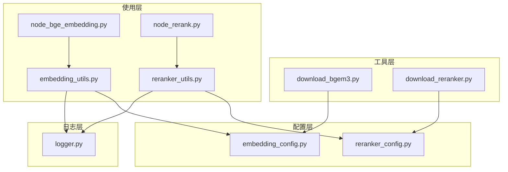
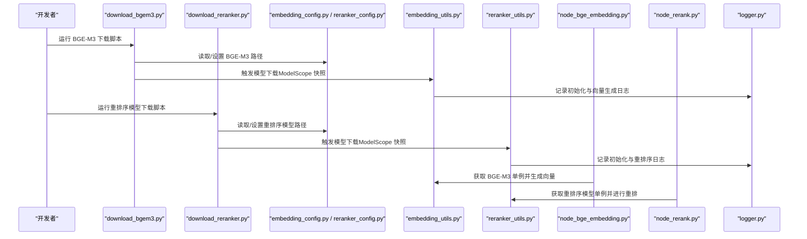
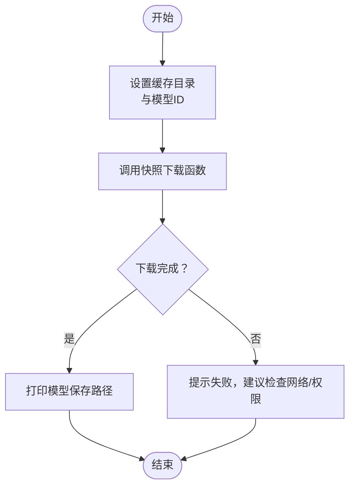
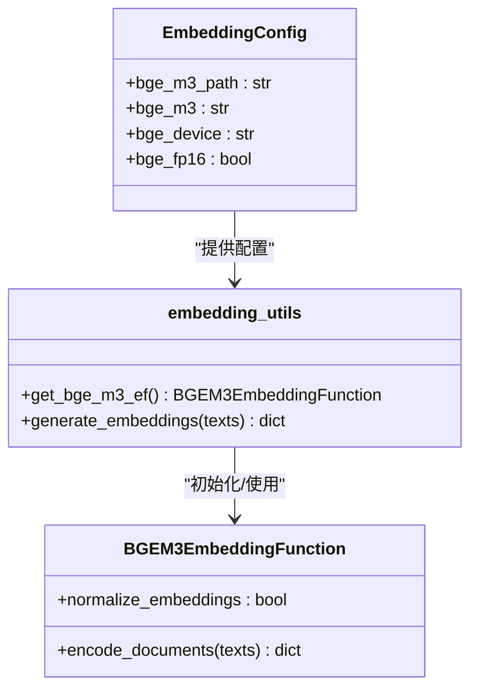
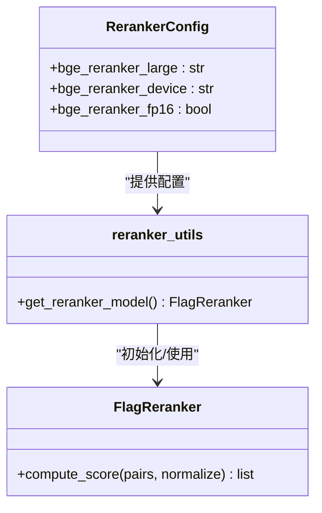
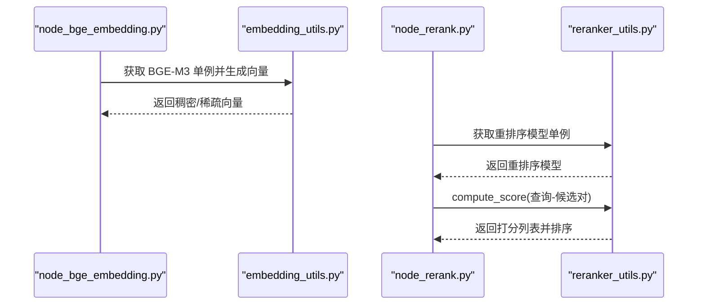
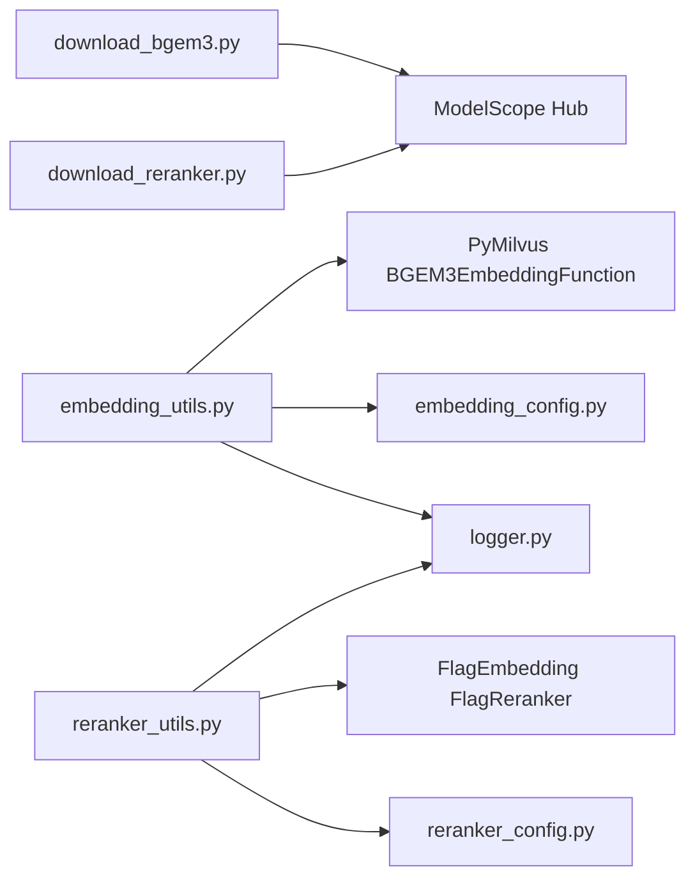

# 模型下载工具

<cite>
**本文引用的文件**
- [download_bgem3.py](file://app/tool/download_bgem3.py)
- [download_reranker.py](file://app/tool/download_reranker.py)
- [embedding_config.py](file://app/conf/embedding_config.py)
- [reranker_config.py](file://app/conf/reranker_config.py)
- [embedding_utils.py](file://app/lm/embedding_utils.py)
- [reranker_utils.py](file://app/lm/reranker_utils.py)
- [logger.py](file://app/core/logger.py)
- [node_bge_embedding.py](file://app/import_process/agent/nodes/node_bge_embedding.py)
- [node_rerank.py](file://app/query_process/agent/nodes/node_rerank.py)
</cite>

## 目录
1. [简介](#简介)
2. [项目结构](#项目结构)
3. [核心组件](#核心组件)
4. [架构总览](#架构总览)
5. [详细组件分析](#详细组件分析)
6. [依赖分析](#依赖分析)
7. [性能考虑](#性能考虑)
8. [故障排查指南](#故障排查指南)
9. [结论](#结论)
10. [附录](#附录)

## 简介
本文件面向“模型下载工具”模块，聚焦以下目标：
- 深入解释 BGE-M3 模型下载流程、验证机制与安装过程
- 文档化重排序模型下载与配置方法
- 描述网络处理、断点续传与完整性校验机制现状与建议
- 明确模型文件存储路径配置与版本管理策略
- 提供下载失败的错误处理与重试机制建议
- 说明模型文件格式要求与兼容性检查
- 提供模型下载的监控与日志记录方法
- 给出模型使用的最佳实践与性能优化建议

## 项目结构
该模块位于 app/tool 目录，分别提供两个独立的下载脚本，配合配置与使用模块共同构成完整的模型生命周期管理。

图表来源
- [download_bgem3.py:1-5](file://app/tool/download_bgem3.py#L1-L5)
- [download_reranker.py:1-10](file://app/tool/download_reranker.py#L1-L10)
- [embedding_config.py:1-24](file://app/conf/embedding_config.py#L1-L24)
- [reranker_config.py:1-21](file://app/conf/reranker_config.py#L1-L21)
- [embedding_utils.py:1-108](file://app/lm/embedding_utils.py#L1-L108)
- [reranker_utils.py:1-14](file://app/lm/reranker_utils.py#L1-L14)
- [node_bge_embedding.py:1-84](file://app/import_process/agent/nodes/node_bge_embedding.py#L1-L84)
- [node_rerank.py:1-267](file://app/query_process/agent/nodes/node_rerank.py#L1-L267)
- [logger.py:1-109](file://app/core/logger.py#L1-L109)

章节来源
- [download_bgem3.py:1-5](file://app/tool/download_bgem3.py#L1-L5)
- [download_reranker.py:1-10](file://app/tool/download_reranker.py#L1-L10)
- [embedding_config.py:1-24](file://app/conf/embedding_config.py#L1-L24)
- [reranker_config.py:1-21](file://app/conf/reranker_config.py#L1-L21)
- [embedding_utils.py:1-108](file://app/lm/embedding_utils.py#L1-L108)
- [reranker_utils.py:1-14](file://app/lm/reranker_utils.py#L1-L14)
- [logger.py:1-109](file://app/core/logger.py#L1-L109)

## 核心组件
- 模型下载工具
  - BGE-M3 下载工具：通过 ModelScope Hub 的快照下载能力，将模型缓存到指定目录
  - 重排序模型下载工具：下载 BGE-Reranker Large 模型到指定本地目录
- 配置模块
  - Embedding 配置：定义 BGE-M3 的本地路径、设备与半精度开关
  - 重排序配置：定义重排序模型本地路径、设备与半精度开关
- 使用模块
  - Embedding 工具：封装 BGEM3EmbeddingFunction 的单例初始化与向量生成
  - 重排序工具：封装 FlagReranker 的单例初始化
- 日志模块：统一的日志初始化与输出，支持控制台与文件双通道

章节来源
- [download_bgem3.py:1-5](file://app/tool/download_bgem3.py#L1-L5)
- [download_reranker.py:1-10](file://app/tool/download_reranker.py#L1-L10)
- [embedding_config.py:1-24](file://app/conf/embedding_config.py#L1-L24)
- [reranker_config.py:1-21](file://app/conf/reranker_config.py#L1-L21)
- [embedding_utils.py:1-108](file://app/lm/embedding_utils.py#L1-L108)
- [reranker_utils.py:1-14](file://app/lm/reranker_utils.py#L1-L14)
- [logger.py:1-109](file://app/core/logger.py#L1-L109)

## 架构总览
模型下载工具与使用模块之间的交互如下：

图表来源
- [download_bgem3.py:1-5](file://app/tool/download_bgem3.py#L1-L5)
- [download_reranker.py:1-10](file://app/tool/download_reranker.py#L1-L10)
- [embedding_config.py:1-24](file://app/conf/embedding_config.py#L1-L24)
- [reranker_config.py:1-21](file://app/conf/reranker_config.py#L1-L21)
- [embedding_utils.py:1-108](file://app/lm/embedding_utils.py#L1-L108)
- [reranker_utils.py:1-14](file://app/lm/reranker_utils.py#L1-L14)
- [node_bge_embedding.py:1-84](file://app/import_process/agent/nodes/node_bge_embedding.py#L1-L84)
- [node_rerank.py:1-267](file://app/query_process/agent/nodes/node_rerank.py#L1-L267)
- [logger.py:1-109](file://app/core/logger.py#L1-L109)

## 详细组件分析

### BGE-M3 模型下载工具
- 功能概述
  - 使用 ModelScope Hub 的快照下载能力，将 BGE-M3 模型下载到指定缓存目录
  - 下载完成后打印模型保存路径，便于确认
- 关键行为
  - 指定模型 ID 与缓存目录
  - 返回下载后的模型目录路径
- 适用场景
  - 首次部署或迁移部署时，提前拉取模型至本地缓存
  - 与 embedding_utils 的单例初始化配合，确保后续推理时可直接加载本地模型

图表来源
- [download_bgem3.py:1-5](file://app/tool/download_bgem3.py#L1-L5)

章节来源
- [download_bgem3.py:1-5](file://app/tool/download_bgem3.py#L1-L5)

### 重排序模型下载工具
- 功能概述
  - 下载 BGE-Reranker Large 模型到指定本地目录
  - 下载完成后打印目录路径
- 关键行为
  - 指定模型 ID 与本地缓存目录
  - 返回下载后的模型目录路径
- 适用场景
  - 首次部署或迁移部署时，提前拉取重排序模型
  - 与 reranker_utils 的单例初始化配合，确保后续重排序时可直接加载本地模型

图表来源
- [download_reranker.py:1-10](file://app/tool/download_reranker.py#L1-L10)

章节来源
- [download_reranker.py:1-10](file://app/tool/download_reranker.py#L1-L10)

### 配置与使用模块

#### Embedding 配置与使用
- 配置要点
  - 本地路径优先：若设置了本地路径，则优先使用本地模型
  - 设备选择：支持 CPU 或 GPU 设备
  - 半精度：可启用 FP16 以降低显存占用
- 使用要点
  - 单例模式：避免重复初始化，提升性能
  - 原生归一化：开启 L2 归一化，适配 Milvus IP 内积检索
  - 稀疏向量格式：将 CSR 稀疏向量解析为字典，便于序列化与存储
  - 日志覆盖：从初始化到向量生成全流程记录日志

图表来源
- [embedding_config.py:1-24](file://app/conf/embedding_config.py#L1-L24)
- [embedding_utils.py:1-108](file://app/lm/embedding_utils.py#L1-L108)

章节来源
- [embedding_config.py:1-24](file://app/conf/embedding_config.py#L1-L24)
- [embedding_utils.py:1-108](file://app/lm/embedding_utils.py#L1-L108)

#### 重排序配置与使用
- 配置要点
  - 本地路径：指向重排序模型的本地目录
  - 设备：支持 CPU/GPU
  - 半精度：可启用 FP16
- 使用要点
  - 单例模式：避免重复初始化
  - 评分与排序：对查询-候选对进行打分并排序，再进行断崖截断

图表来源
- [reranker_config.py:1-21](file://app/conf/reranker_config.py#L1-L21)
- [reranker_utils.py:1-14](file://app/lm/reranker_utils.py#L1-L14)

章节来源
- [reranker_config.py:1-21](file://app/conf/reranker_config.py#L1-L21)
- [reranker_utils.py:1-14](file://app/lm/reranker_utils.py#L1-L14)

### 在工作流中的应用
- 文本向量化节点
  - 从状态中获取切片文本，批量生成稠密与稀疏向量，并回填到状态
  - 使用 embedding_utils 的单例模型，确保高效与稳定
- 重排序节点
  - 合并多路候选，构造查询-候选对，调用重排序模型打分
  - 基于断崖阈值与相对阈值进行动态 TopK 截断

图表来源
- [node_bge_embedding.py:1-84](file://app/import_process/agent/nodes/node_bge_embedding.py#L1-L84)
- [embedding_utils.py:1-108](file://app/lm/embedding_utils.py#L1-L108)
- [node_rerank.py:1-267](file://app/query_process/agent/nodes/node_rerank.py#L1-L267)
- [reranker_utils.py:1-14](file://app/lm/reranker_utils.py#L1-L14)

章节来源
- [node_bge_embedding.py:1-84](file://app/import_process/agent/nodes/node_bge_embedding.py#L1-L84)
- [node_rerank.py:1-267](file://app/query_process/agent/nodes/node_rerank.py#L1-L267)

## 依赖分析
- 组件耦合
  - 下载工具与配置模块松耦合：下载脚本直接调用快照下载函数，配置模块在推理阶段生效
  - 使用模块与配置模块强耦合：推理时通过配置决定模型路径、设备与半精度
- 外部依赖
  - ModelScope Hub：提供快照下载能力
  - PyMilvus：提供 BGEM3EmbeddingFunction
  - FlagEmbedding：提供重排序模型
- 潜在循环依赖
  - 未发现循环依赖迹象，模块职责清晰

图表来源
- [download_bgem3.py:1-5](file://app/tool/download_bgem3.py#L1-L5)
- [download_reranker.py:1-10](file://app/tool/download_reranker.py#L1-L10)
- [embedding_utils.py:1-108](file://app/lm/embedding_utils.py#L1-L108)
- [reranker_utils.py:1-14](file://app/lm/reranker_utils.py#L1-L14)
- [embedding_config.py:1-24](file://app/conf/embedding_config.py#L1-L24)
- [reranker_config.py:1-21](file://app/conf/reranker_config.py#L1-L21)
- [logger.py:1-109](file://app/core/logger.py#L1-L109)

章节来源
- [download_bgem3.py:1-5](file://app/tool/download_bgem3.py#L1-L5)
- [download_reranker.py:1-10](file://app/tool/download_reranker.py#L1-L10)
- [embedding_utils.py:1-108](file://app/lm/embedding_utils.py#L1-L108)
- [reranker_utils.py:1-14](file://app/lm/reranker_utils.py#L1-L14)
- [embedding_config.py:1-24](file://app/conf/embedding_config.py#L1-L24)
- [reranker_config.py:1-21](file://app/conf/reranker_config.py#L1-L21)
- [logger.py:1-109](file://app/core/logger.py#L1-L109)

## 性能考虑
- 单例模式
  - embedding_utils 与 reranker_utils 均采用单例，避免重复初始化带来的开销
- 半精度（FP16）
  - 在支持的设备上启用 FP16 可显著降低显存占用，提升吞吐
- 批量处理
  - 文本向量化节点采用批量处理，减少模型调用次数
- 归一化与检索匹配
  - BGE-M3 原生 L2 归一化，适配 Milvus IP 内积检索，提升检索效率

章节来源
- [embedding_utils.py:1-108](file://app/lm/embedding_utils.py#L1-L108)
- [reranker_utils.py:1-14](file://app/lm/reranker_utils.py#L1-L14)
- [node_bge_embedding.py:1-84](file://app/import_process/agent/nodes/node_bge_embedding.py#L1-L84)

## 故障排查指南
- 下载失败
  - 检查网络连通性与代理设置
  - 确认缓存目录权限与磁盘空间
  - 查看日志输出，定位具体错误
- 模型加载失败
  - 确认本地模型路径是否正确
  - 检查设备与半精度配置是否匹配硬件能力
- 向量生成异常
  - 检查输入文本格式与长度
  - 查看日志中的异常堆栈，定位问题
- 重排序异常
  - 检查查询-候选对构造是否正确
  - 确认重排序模型路径与设备配置

章节来源
- [logger.py:1-109](file://app/core/logger.py#L1-L109)
- [embedding_utils.py:1-108](file://app/lm/embedding_utils.py#L1-L108)
- [reranker_utils.py:1-14](file://app/lm/reranker_utils.py#L1-L14)

## 结论
本模块通过简洁的下载脚本与完善的配置、使用模块，实现了 BGE-M3 与重排序模型的快速部署与稳定使用。结合单例模式、半精度与批量处理等优化手段，可在保证性能的同时提升可靠性。建议在生产环境中进一步完善断点续传、完整性校验与版本管理策略，并持续利用日志体系进行监控与排障。

## 附录

### 模型下载与配置最佳实践
- 存储路径配置
  - BGE-M3：通过环境变量或配置文件指定本地路径，优先使用本地路径
  - 重排序模型：通过环境变量或配置文件指定本地路径
- 版本管理策略
  - 固定模型版本号，避免因上游变更导致的不兼容
  - 在 CI/CD 中校验模型文件完整性
- 网络与断点续传
  - 使用稳定的镜像源与代理
  - 如需断点续传，建议在上层封装中增加重试与断点续传逻辑
- 完整性校验
  - 下载完成后校验文件数量与大小
  - 在推理前进行轻量级校验（如尝试加载关键文件）

### 监控与日志记录
- 使用统一日志模块，确保控制台与文件双通道输出
- 在关键节点（下载、初始化、推理）记录详细日志
- 结合任务状态管理，实现端到端的可观测性

章节来源
- [logger.py:1-109](file://app/core/logger.py#L1-L109)
- [embedding_config.py:1-24](file://app/conf/embedding_config.py#L1-L24)
- [reranker_config.py:1-21](file://app/conf/reranker_config.py#L1-L21)