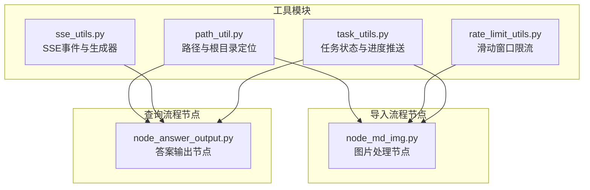
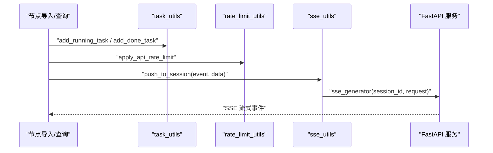
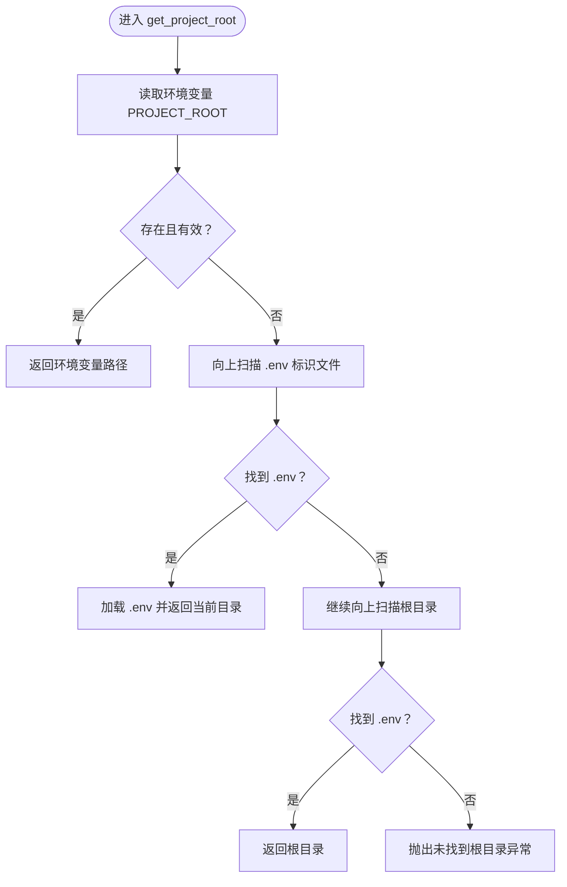
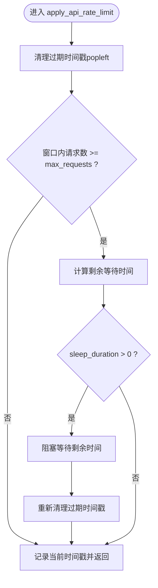
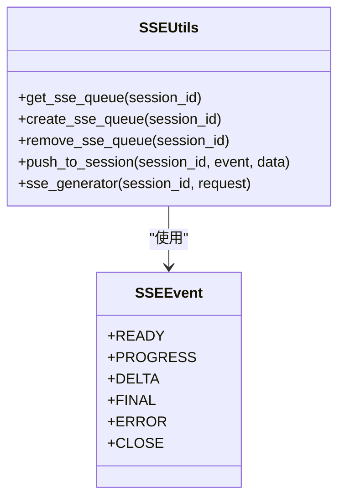
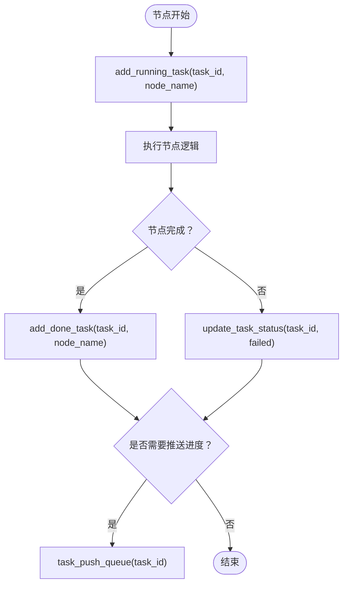
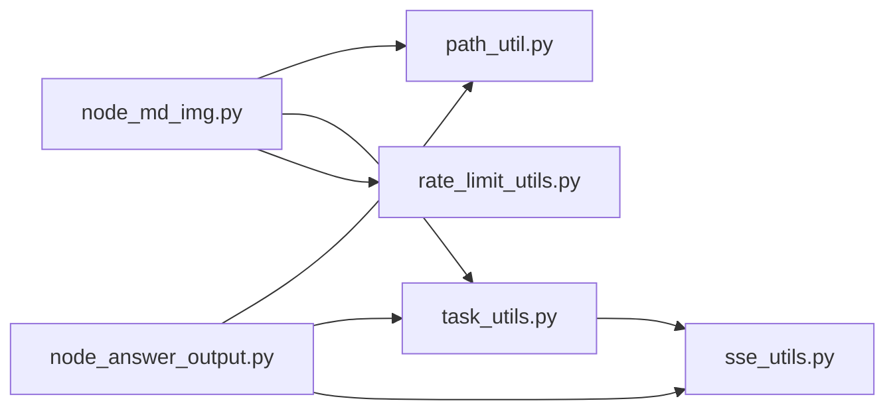

# 系统工具

<cite>
**本文引用的文件**
- [path_util.py](file://app/utils/path_util.py)
- [rate_limit_utils.py](file://app/utils/rate_limit_utils.py)
- [sse_utils.py](file://app/utils/sse_utils.py)
- [task_utils.py](file://app/utils/task_utils.py)
- [node_md_img.py](file://app/import_process/agent/nodes/node_md_img.py)
- [node_answer_output.py](file://app/query_process/agent/nodes/node_answer_output.py)
</cite>

## 目录
1. [简介](#简介)
2. [项目结构](#项目结构)
3. [核心组件](#核心组件)
4. [架构总览](#架构总览)
5. [详细组件分析](#详细组件分析)
6. [依赖关系分析](#依赖关系分析)
7. [性能考量](#性能考量)
8. [故障排除指南](#故障排除指南)
9. [结论](#结论)
10. [附录](#附录)

## 简介
本文件面向系统工具模块，系统性梳理以下四个工具模块的功能、实现与使用方式：
- 路径管理工具：path_util，提供基于 pathlib 的路径解析、项目根目录定位与跨平台兼容策略。
- 限流与节流工具：rate_limit_utils，提供通用滑动窗口限流器，保障对外部服务调用的频率控制。
- SSE 流式传输工具：sse_utils，提供事件类型定义、会话队列管理、消息打包与 FastAPI 生成器，支撑前后端实时通信。
- 任务状态与调度工具：task_utils，提供任务状态机、节点进度跟踪、结果存储与与 SSE 的联动推送。

文档还给出各模块的使用示例、配置要点、性能优化建议与常见问题排查方法，并阐明模块间的协作关系与集成方式。

## 项目结构
系统工具位于 app/utils 下，围绕路径、限流、SSE、任务状态四类能力提供通用工具函数与类，被导入流程节点与查询流程节点广泛复用。

图表来源
- [path_util.py:1-46](file://app/utils/path_util.py#L1-L46)
- [rate_limit_utils.py:1-37](file://app/utils/rate_limit_utils.py#L1-L37)
- [sse_utils.py:1-108](file://app/utils/sse_utils.py#L1-L108)
- [task_utils.py:1-187](file://app/utils/task_utils.py#L1-L187)
- [node_md_img.py:1-385](file://app/import_process/agent/nodes/node_md_img.py#L1-L385)
- [node_answer_output.py:1-352](file://app/query_process/agent/nodes/node_answer_output.py#L1-L352)

章节来源
- [path_util.py:1-46](file://app/utils/path_util.py#L1-L46)
- [rate_limit_utils.py:1-37](file://app/utils/rate_limit_utils.py#L1-L37)
- [sse_utils.py:1-108](file://app/utils/sse_utils.py#L1-L108)
- [task_utils.py:1-187](file://app/utils/task_utils.py#L1-L187)

## 核心组件
- 路径管理工具（path_util）
  - 功能：提供父级目录快速访问、项目根目录定位（优先环境变量，回退 .env 标识文件查找）、全局项目根常量。
  - 跨平台：基于 pathlib，天然兼容 Windows、Linux/macOS 路径分隔符。
- 限流工具（rate_limit_utils）
  - 功能：滑动窗口限流器，维护请求时间戳队列，按窗口与最大请求数动态阻塞等待，避免触发第三方 API 限流。
- SSE 工具（sse_utils）
  - 功能：事件类型枚举、会话队列管理、消息打包、FastAPI 异步生成器，支持 ready/progress/delta/final/error/close 等事件。
- 任务工具（task_utils）
  - 功能：任务状态机（pending/processing/completed/failed）、节点运行/完成列表、结果存储、进度推送至 SSE。

章节来源
- [path_util.py:7-46](file://app/utils/path_util.py#L7-L46)
- [rate_limit_utils.py:7-37](file://app/utils/rate_limit_utils.py#L7-L37)
- [sse_utils.py:8-108](file://app/utils/sse_utils.py#L8-L108)
- [task_utils.py:20-187](file://app/utils/task_utils.py#L20-L187)

## 架构总览
系统工具模块通过统一的事件与状态机制，串联导入与查询两大流程：
- 导入流程：节点在执行前登记“正在运行”，完成后登记“已完成”，必要时调用限流器控制对外服务调用节奏，同时可将进度通过 SSE 推送。
- 查询流程：节点根据 is_stream 决定流式或非流式输出，流式通过 SSE 推送增量，非流式直接写入任务结果，最终由前端消费。

图表来源
- [task_utils.py:68-109](file://app/utils/task_utils.py#L68-L109)
- [rate_limit_utils.py:7-37](file://app/utils/rate_limit_utils.py#L7-L37)
- [sse_utils.py:54-108](file://app/utils/sse_utils.py#L54-L108)

## 详细组件分析

### 路径管理工具（path_util）
- 设计要点
  - 使用 pathlib.parents 快速获取上 N 级父目录，避免多次 parent 调用。
  - 项目根目录优先从环境变量获取，其次递归查找 .env 标识文件，兜底抛出异常。
  - 提供全局常量 PROJECT_ROOT，便于其他模块直接引用。
- 跨平台兼容
  - pathlib 自动适配不同系统的路径分隔符，确保在 Windows 与 Unix 系统上行为一致。
- 使用示例
  - 在节点中引入 PROJECT_ROOT，拼接相对路径，避免硬编码绝对路径。
- 配置指南
  - 生产环境建议设置环境变量 PROJECT_ROOT，开发环境可放置 .env 文件作为标识。

图表来源
- [path_util.py:22-43](file://app/utils/path_util.py#L22-L43)

章节来源
- [path_util.py:7-46](file://app/utils/path_util.py#L7-L46)

### 限流工具（rate_limit_utils）
- 设计要点
  - 维护一个双端队列存储请求时间戳，每次调用先清理窗口外过期时间戳，再判断是否超过 max_requests，若超限则阻塞等待剩余窗口时间。
  - 采用 time.time() 与 popleft 清理，保证窗口内请求数严格受控。
- 参数与行为
  - request_times：外部初始化的 Deque[float]，跨调用复用。
  - max_requests：窗口内最大请求数。
  - window_seconds：滑动窗口时长（默认 60 秒）。
- 使用示例
  - 在节点中为每个目标服务维护独立的 request_times 队列，调用 apply_api_rate_limit 控制并发与频率。

图表来源
- [rate_limit_utils.py:7-37](file://app/utils/rate_limit_utils.py#L7-L37)

章节来源
- [rate_limit_utils.py:7-37](file://app/utils/rate_limit_utils.py#L7-L37)

### SSE 工具（sse_utils）
- 设计要点
  - 事件类型枚举：ready、progress、delta、final、error、close。
  - 全局会话队列：以 session_id 为键，值为队列，支持并发会话隔离。
  - 消息打包：将数据序列化为 JSON，按 SSE 格式拼接 event 与 data。
  - 生成器：FastAPI 异步生成器，检测客户端断连，使用 run_in_executor 避免阻塞事件循环。
- 事件格式规范
  - 每条消息包含 event 与 data 两部分，以空行分隔。
  - ready：连接建立通知。
  - progress：任务进度（状态、已完成节点列表、正在运行节点列表）。
  - delta：LLM 流式输出增量。
  - final：最终完整答案。
  - error：错误信息。
  - close：关闭连接信号。
- 使用示例
  - 在查询节点中，根据 is_stream 决定推送 delta 或最终答案；在导入节点中，可将进度通过 task_push_queue 推送至 SSE。

图表来源
- [sse_utils.py:8-108](file://app/utils/sse_utils.py#L8-L108)

章节来源
- [sse_utils.py:8-108](file://app/utils/sse_utils.py#L8-L108)

### 任务状态与调度工具（task_utils）
- 设计要点
  - 任务状态机：pending、processing、completed、failed。
  - 节点跟踪：running_list 与 done_list，支持中文展示名映射。
  - 结果存储：按 task_id 存储键值对结果。
  - 与 SSE 集成：task_push_queue 将进度打包并通过 push_to_session 推送。
- 使用示例
  - 在节点开始执行前调用 add_running_task，完成后调用 add_done_task；必要时通过 update_task_status 与 set_task_result 更新状态与结果。

图表来源
- [task_utils.py:68-109](file://app/utils/task_utils.py#L68-L109)
- [task_utils.py:174-179](file://app/utils/task_utils.py#L174-L179)

章节来源
- [task_utils.py:20-187](file://app/utils/task_utils.py#L20-L187)

## 依赖关系分析
- 模块内聚与耦合
  - task_utils 依赖 sse_utils 进行进度推送，形成弱耦合。
  - 导入与查询节点分别依赖 path_util（路径）、rate_limit_utils（限流）、task_utils（状态）、sse_utils（流式）。
- 外部依赖
  - sse_utils 依赖 FastAPI Request 与 asyncio，用于异步生成与断连检测。
  - rate_limit_utils 依赖 time 与 collections.deque，实现时间戳队列与阻塞等待。
  - path_util 依赖 pathlib 与 os，结合 .env 加载实现根目录定位。

图表来源
- [node_md_img.py:1-385](file://app/import_process/agent/nodes/node_md_img.py#L1-L385)
- [node_answer_output.py:1-352](file://app/query_process/agent/nodes/node_answer_output.py#L1-L352)
- [path_util.py:1-46](file://app/utils/path_util.py#L1-L46)
- [task_utils.py:1-187](file://app/utils/task_utils.py#L1-L187)
- [rate_limit_utils.py:1-37](file://app/utils/rate_limit_utils.py#L1-L37)
- [sse_utils.py:1-108](file://app/utils/sse_utils.py#L1-L108)

章节来源
- [node_md_img.py:1-385](file://app/import_process/agent/nodes/node_md_img.py#L1-L385)
- [node_answer_output.py:1-352](file://app/query_process/agent/nodes/node_answer_output.py#L1-L352)

## 性能考量
- 限流器
  - 使用双端队列维护时间戳，清理与插入均为 O(1)，整体复杂度低；注意在高并发场景下避免频繁创建队列实例，建议按服务维度复用 request_times。
- SSE 生成器
  - 使用 run_in_executor 避免阻塞事件循环；建议合理设置队列容量与消费节奏，避免内存堆积。
- 任务状态
  - 任务状态与进度列表采用字典与列表存储，查询与更新均为 O(1)/O(n)；建议在长时间运行任务中定期清理过期任务，避免内存膨胀。
- 路径解析
  - pathlib 的 parents 访问为 O(1)，路径拼接与查找成本低，适合高频使用。

## 故障排除指南
- 未找到项目根目录
  - 现象：启动时报错未找到 .env 标识或未配置 PROJECT_ROOT。
  - 处理：设置环境变量 PROJECT_ROOT，或在项目根目录放置 .env 文件。
  - 参考
    - [path_util.py:43](file://app/utils/path_util.py#L43)
- SSE 无法推送或连接中断
  - 现象：客户端断连、生成器异常、队列为空。
  - 处理：检查 is_disconnected 检测与异常捕获；确保会话队列存在；必要时发送 close 事件主动结束。
  - 参考
    - [sse_utils.py:73-102](file://app/utils/sse_utils.py#L73-L102)
- 限流导致请求停滞
  - 现象：请求被阻塞等待，窗口内请求数达到上限。
  - 处理：调整 max_requests 与 window_seconds；为不同服务设置独立队列；避免在同一队列中混用不同限流策略。
  - 参考
    - [rate_limit_utils.py:25-34](file://app/utils/rate_limit_utils.py#L25-L34)
- 任务进度未推送
  - 现象：节点完成但前端未收到 progress。
  - 处理：确认 task_push_queue 是否被调用；检查 session_id 与队列是否正确创建。
  - 参考
    - [task_utils.py:174-179](file://app/utils/task_utils.py#L174-L179)

章节来源
- [path_util.py:43](file://app/utils/path_util.py#L43)
- [sse_utils.py:73-102](file://app/utils/sse_utils.py#L73-L102)
- [rate_limit_utils.py:25-34](file://app/utils/rate_limit_utils.py#L25-L34)
- [task_utils.py:174-179](file://app/utils/task_utils.py#L174-L179)

## 结论
系统工具模块通过路径、限流、SSE、任务状态四大能力，为导入与查询流程提供了统一的基础设施。它们之间通过清晰的职责边界与事件/状态协议协同工作：路径工具提供稳定的基础路径能力，限流工具保障对外调用的稳定性，SSE 工具实现前后端实时交互，任务工具负责状态与进度的统一管理。在实际使用中，建议按服务维度配置限流参数，合理组织会话队列，及时清理过期任务，以获得最佳性能与可维护性。

## 附录

### 使用示例与配置指南

- 路径管理（path_util）
  - 示例：在节点中使用 PROJECT_ROOT 拼接相对路径，避免硬编码绝对路径。
  - 配置：生产环境设置环境变量 PROJECT_ROOT；开发环境在项目根目录放置 .env。
  - 参考
    - [path_util.py:46](file://app/utils/path_util.py#L46)

- 限流（rate_limit_utils）
  - 示例：在节点中为每个目标服务维护独立的 request_times 队列，调用 apply_api_rate_limit 控制并发与频率。
  - 配置：max_requests 与 window_seconds 根据第三方 API 限额与业务吞吐量调整。
  - 参考
    - [rate_limit_utils.py:7-37](file://app/utils/rate_limit_utils.py#L7-L37)
    - [node_md_img.py:180-184](file://app/import_process/agent/nodes/node_md_img.py#L180-L184)

- SSE（sse_utils）
  - 示例：在查询节点中根据 is_stream 决定推送 delta 或最终答案；在导入节点中通过 task_push_queue 推送进度。
  - 配置：事件类型与消息格式遵循 SSE 标准；注意断连检测与资源清理。
  - 参考
    - [sse_utils.py:54-108](file://app/utils/sse_utils.py#L54-L108)
    - [node_answer_output.py:23-30](file://app/query_process/agent/nodes/node_answer_output.py#L23-L30)

- 任务状态（task_utils）
  - 示例：在节点开始执行前调用 add_running_task，完成后调用 add_done_task；必要时通过 update_task_status 与 set_task_result 更新状态与结果。
  - 配置：根据业务流程扩展状态枚举；确保中文展示映射与节点名一致。
  - 参考
    - [task_utils.py:68-109](file://app/utils/task_utils.py#L68-L109)
    - [task_utils.py:174-179](file://app/utils/task_utils.py#L174-L179)