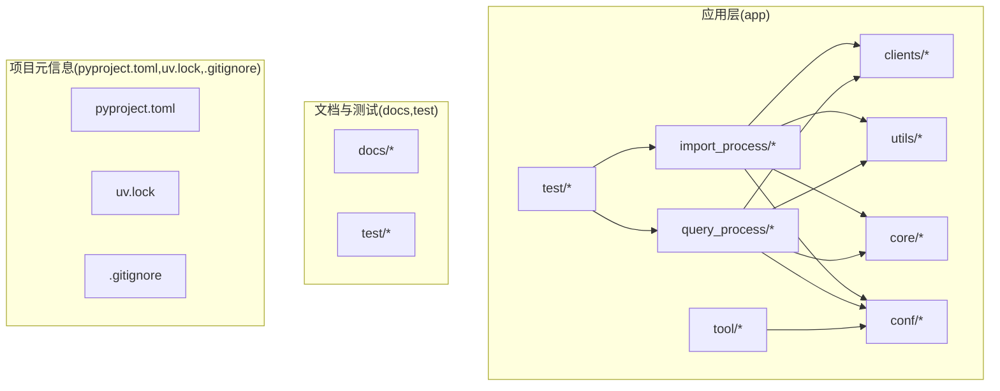
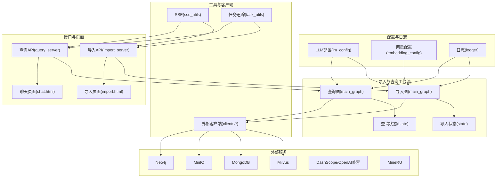
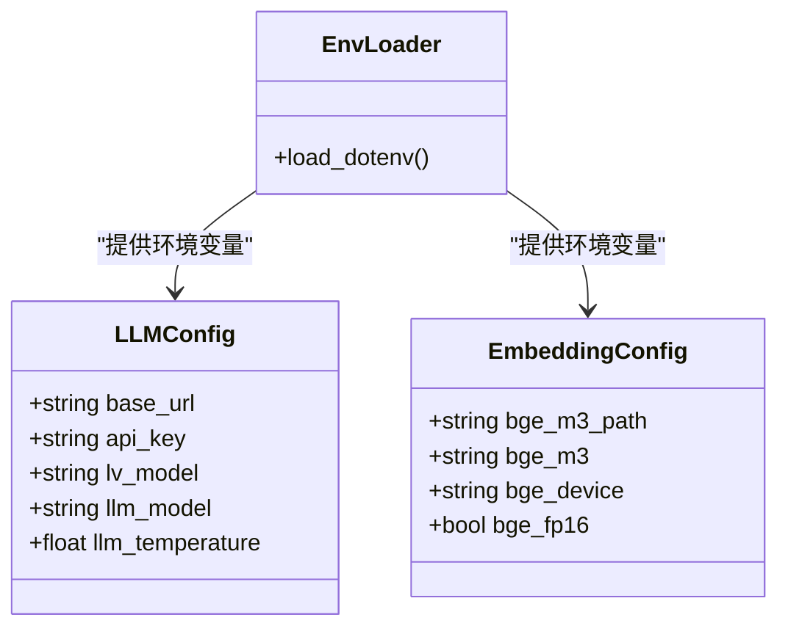
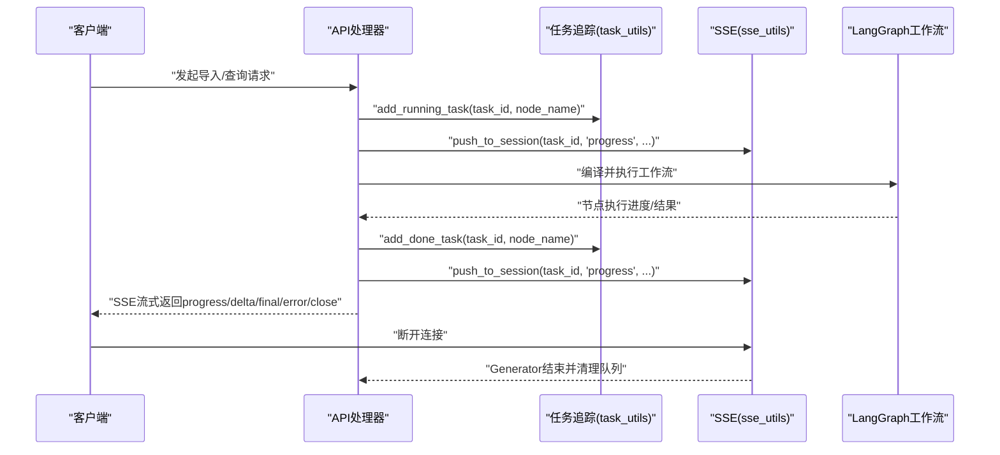
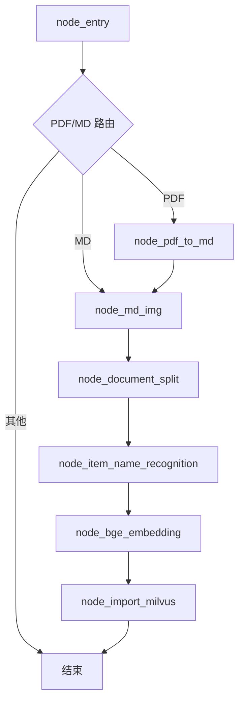
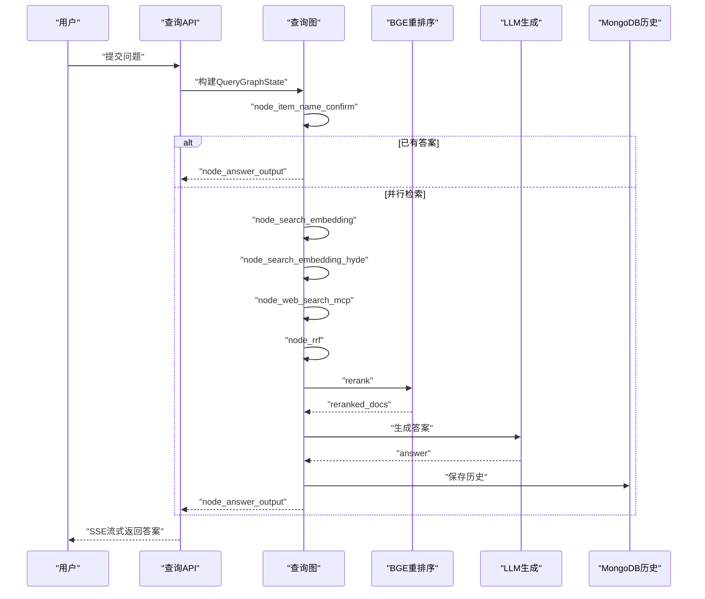
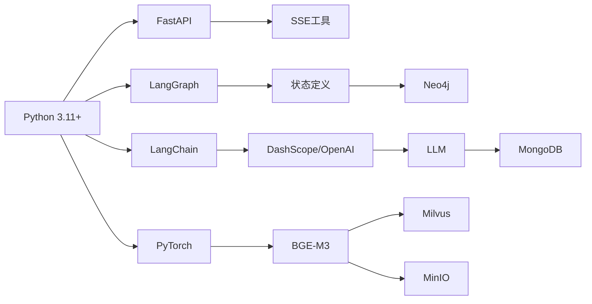

# 开发者指南

<cite>
**本文引用的文件**
- [pyproject.toml](file://pyproject.toml)
- [CLAUDE.md](file://CLAUDE.md)
- [项目要总结内容.txt](file://项目要总结内容.txt)
- [app/import_process/导入过程记录文档.txt](file://app/import_process/导入过程记录文档.txt)
- [app/conf/embedding_config.py](file://app/conf/embedding_config.py)
- [app/conf/lm_config.py](file://app/conf/lm_config.py)
- [app/core/logger.py](file://app/core/logger.py)
- [app/utils/sse_utils.py](file://app/utils/sse_utils.py)
- [app/utils/task_utils.py](file://app/utils/task_utils.py)
- [app/import_process/agent/main_graph.py](file://app/import_process/agent/main_graph.py)
- [app/import_process/agent/state.py](file://app/import_process/agent/state.py)
- [app/query_process/agent/main_graph.py](file://app/query_process/agent/main_graph.py)
- [app/query_process/agent/state.py](file://app/query_process/agent/state.py)
- [app/test/test_import_main_graph.py](file://app/test/test_import_main_graph.py)
- [.gitignore](file://.gitignore)
- [uv.lock](file://uv.lock)
</cite>

## 目录
1. [简介](#简介)
2. [项目结构](#项目结构)
3. [核心组件](#核心组件)
4. [架构总览](#架构总览)
5. [详细组件分析](#详细组件分析)
6. [依赖分析](#依赖分析)
7. [性能考虑](#性能考虑)
8. [故障排除指南](#故障排除指南)
9. [结论](#结论)
10. [附录](#附录)

## 简介
本指南面向参与 RAG Agent 项目的开发者，提供从环境搭建、代码规范、提交规范、代码审查流程，到新功能开发、集成测试、文档更新、导入流程记录与学习日志使用、故障排除方法论、性能优化实践、贡献流程与版本发布规范的完整说明。项目采用 Python 3.11+，基于 FastAPI + LangGraph + LangChain + 向量与知识图谱生态构建，涵盖文档导入与查询两大主流程。

## 项目结构
项目采用按功能域分层的组织方式：
- app：核心应用代码
  - clients：外部服务客户端封装（Milvus、MinIO、Mongo、Neo4j）
  - conf：配置模块（dotenv 加载、dataclass 单例）
  - core：基础设施（日志、提示词加载）
  - import_process：导入工作流（LangGraph）
  - query_process：查询工作流（LangGraph）
  - utils：通用工具（SSE、任务追踪、格式化、限速等）
  - test：单元/流程测试脚本
  - tool：辅助工具（模型下载）
- docs：项目总结与知识文档
- test：环境与系统测试脚本
- 顶层：项目元信息与锁文件（pyproject.toml、uv.lock）、环境变量示例（.env）

图表来源
- [pyproject.toml:1-36](file://pyproject.toml#L1-L36)
- [CLAUDE.md:24-70](file://CLAUDE.md#L24-L70)

章节来源
- [pyproject.toml:1-36](file://pyproject.toml#L1-L36)
- [CLAUDE.md:24-70](file://CLAUDE.md#L24-L70)

## 核心组件
- 配置体系
  - LLM 配置：通过 dataclass 从 .env 读取基础地址、密钥、默认模型与温度等。
  - 向量模型配置：BGE-M3 路径、仓库标识、运行设备、半精度开关。
  - 配置优先级：系统环境变量 > .env > 代码默认值。
- 日志系统
  - 基于 loguru，支持控制台/文件双输出、按天滚动、中文友好、异步安全、自动定位业务调用位置。
- SSE 与任务追踪
  - SSE 事件类型：ready、progress、delta、final、error、close。
  - 任务状态：进行中/已完成/失败，结合中文节点名映射，推送进度到前端。
- LangGraph 工作流
  - 导入流程：入口节点根据文件类型路由至 PDF 或 Markdown 路径，随后按固定顺序推进至 Milvus 写入。
  - 查询流程：先确认产品项，再并行多路检索（普通向量/HyDE/MCP 网络搜索），RRF 融合，BGE 重排序，最终生成答案。
- 工具与客户端
  - 通用工具：SSE、任务追踪、格式化、限速、稀疏向量归一化、字符串转义等。
  - 外部客户端：Milvus、MinIO、Mongo、Neo4j。

章节来源
- [app/conf/lm_config.py:1-27](file://app/conf/lm_config.py#L1-L27)
- [app/conf/embedding_config.py:1-24](file://app/conf/embedding_config.py#L1-L24)
- [app/core/logger.py:1-109](file://app/core/logger.py#L1-L109)
- [app/utils/sse_utils.py:1-108](file://app/utils/sse_utils.py#L1-L108)
- [app/utils/task_utils.py:1-187](file://app/utils/task_utils.py#L1-L187)
- [app/import_process/agent/main_graph.py:1-134](file://app/import_process/agent/main_graph.py#L1-L134)
- [app/query_process/agent/main_graph.py:1-47](file://app/query_process/agent/main_graph.py#L1-L47)

## 架构总览
系统由“配置—日志—工具—工作流—API/页面—外部服务”构成，导入与查询两条主干流程通过 LangGraph 管理状态与节点，SSE 推送进度，任务追踪维护状态与结果。

图表来源
- [CLAUDE.md:72-93](file://CLAUDE.md#L72-L93)
- [app/import_process/agent/main_graph.py:1-134](file://app/import_process/agent/main_graph.py#L1-L134)
- [app/query_process/agent/main_graph.py:1-47](file://app/query_process/agent/main_graph.py#L1-L47)
- [app/utils/sse_utils.py:1-108](file://app/utils/sse_utils.py#L1-L108)
- [app/utils/task_utils.py:1-187](file://app/utils/task_utils.py#L1-L187)

## 详细组件分析

### 配置模块
- LLMConfig：统一读取 OPENAI_BASE_URL、OPENAI_API_KEY、VL_MODEL、LLM_DEFAULT_MODEL、LLM_DEFAULT_TEMPERATURE，便于切换不同推理后端。
- EmbeddingConfig：统一读取 BGE_M3_PATH、BGE_M3、BGE_DEVICE、BGE_FP16，支持半精度与设备选择。
- 配置加载：通过 dotenv 在模块导入阶段提前加载，确保后续读取有效。

图表来源
- [app/conf/lm_config.py:10-26](file://app/conf/lm_config.py#L10-L26)
- [app/conf/embedding_config.py:9-24](file://app/conf/embedding_config.py#L9-L24)

章节来源
- [app/conf/lm_config.py:1-27](file://app/conf/lm_config.py#L1-L27)
- [app/conf/embedding_config.py:1-24](file://app/conf/embedding_config.py#L1-L24)

### 日志系统
- 功能要点：双输出开关、级别、按天滚动、中文编码、异步安全、自动定位业务调用位置。
- 使用建议：在各模块直接导入 logger，避免重复初始化；生产环境建议开启文件输出并合理设置保留策略。

图表来源
- [app/core/logger.py:46-83](file://app/core/logger.py#L46-L83)
- [app/core/logger.py:88-103](file://app/core/logger.py#L88-L103)

章节来源
- [app/core/logger.py:1-109](file://app/core/logger.py#L1-L109)

### SSE 与任务追踪
- SSE 事件：ready、progress、delta、final、error、close；通过 session_id 维护队列，异步生成器推送。
- 任务追踪：维护进行中/已完成节点列表、任务状态、结果字典；支持中文节点名映射与进度推送。

图表来源
- [app/utils/sse_utils.py:43-108](file://app/utils/sse_utils.py#L43-L108)
- [app/utils/task_utils.py:68-180](file://app/utils/task_utils.py#L68-L180)

章节来源
- [app/utils/sse_utils.py:1-108](file://app/utils/sse_utils.py#L1-L108)
- [app/utils/task_utils.py:1-187](file://app/utils/task_utils.py#L1-L187)

### 导入流程（LangGraph）
- 状态定义：ImportGraphState 包含任务ID、流程控制标记、路径、内容数据、数据库相关字段。
- 节点与路由：入口节点根据 is_pdf_read_enabled/is_md_read_enabled 路由；固定顺序推进至 Milvus 写入。
- 流程测试：提供 test_import_main_graph.py，演示如何构造初始状态、流式执行并打印节点进度与最终状态。

图表来源
- [app/import_process/agent/main_graph.py:30-65](file://app/import_process/agent/main_graph.py#L30-L65)
- [app/import_process/agent/state.py:5-41](file://app/import_process/agent/state.py#L5-L41)

章节来源
- [app/import_process/agent/main_graph.py:1-134](file://app/import_process/agent/main_graph.py#L1-L134)
- [app/import_process/agent/state.py:1-99](file://app/import_process/agent/state.py#L1-L99)
- [app/test/test_import_main_graph.py:1-27](file://app/test/test_import_main_graph.py#L1-L27)

### 查询流程（LangGraph）
- 状态定义：QueryGraphState 包含会话ID、原始问题、检索中间结果、排序结果、生成中间结果、改写问题、历史、流式标记等。
- 节点与路由：先确认产品项，再并行多路检索（普通向量/HyDE/MCP），RRF 融合，BGE 重排序，最终生成答案并保存到历史。

图表来源
- [app/query_process/agent/main_graph.py:12-47](file://app/query_process/agent/main_graph.py#L12-L47)
- [app/query_process/agent/state.py:5-30](file://app/query_process/agent/state.py#L5-L30)

章节来源
- [app/query_process/agent/main_graph.py:1-47](file://app/query_process/agent/main_graph.py#L1-L47)
- [app/query_process/agent/state.py:1-97](file://app/query_process/agent/state.py#L1-L97)

## 依赖分析
- 语言与框架：Python 3.11+、FastAPI、Uvicorn、LangGraph、LangChain 生态。
- 向量与模型：BGE-M3（dense + sparse）、BGE-Reranker、PyTorch 生态。
- 外部服务：Milvus、MongoDB、MinIO、Neo4j、DashScope/OpenAI 兼容 API、MineRU。
- 依赖管理：pyproject.toml 声明依赖；uv.lock 提供锁定版本。

图表来源
- [pyproject.toml:9-35](file://pyproject.toml#L9-L35)
- [CLAUDE.md:103-113](file://CLAUDE.md#L103-L113)

章节来源
- [pyproject.toml:1-36](file://pyproject.toml#L1-L36)
- [CLAUDE.md:103-113](file://CLAUDE.md#L103-L113)

## 性能考虑
- 设备与半精度：通过 EmbeddingConfig 的设备与半精度开关控制显存占用与吞吐。
- 流式输出：SSE 与 LangGraph 流式执行降低首屏延迟，提升用户体验。
- 限速与并发：task_utils 与 rate_limit_utils 提供滑动窗口限速，避免外部服务限流。
- 向量化与检索：混合向量（dense + sparse）与重排序提升召回质量；合理设置检索 Top-K 与 RRF 融合参数。
- 日志与磁盘：按天滚动与保留策略减少磁盘压力；生产环境建议异步写入与中文编码。

章节来源
- [app/conf/embedding_config.py:10-24](file://app/conf/embedding_config.py#L10-L24)
- [app/utils/sse_utils.py:54-108](file://app/utils/sse_utils.py#L54-L108)
- [app/utils/task_utils.py:174-187](file://app/utils/task_utils.py#L174-L187)
- [app/core/logger.py:68-81](file://app/core/logger.py#L68-L81)

## 故障排除指南
- 环境变量与配置
  - 确认 .env 文件存在且包含必要键（如 OPENAI_BASE_URL、OPENAI_API_KEY、BGE_*、各服务地址）。
  - 验证配置优先级：系统环境变量 > .env > 代码默认值。
- 日志定位
  - 使用 logger.patch(fix_log_position) 定位业务模块真实调用位置，避免 loguru 内部栈干扰。
  - 检查 logs 目录与按天滚动文件，确认编码与保留策略。
- SSE 连接
  - 断开连接时生成器会捕获异常并清理队列；检查 session_id 是否匹配、队列是否创建。
  - 如出现“Queue not found”，确认会话创建与推送逻辑一致。
- LangGraph 执行
  - 使用 test_import_main_graph.py 构造最小状态，逐步验证节点执行与状态变化。
  - 通过 print_ascii() 查看图结构，确认边与路由正确。
- 外部服务
  - Milvus/Mongo/MinIO/Neo4j：核对地址、认证与网络连通性。
  - LLM/DashScope：核对 base_url 与 api_key，确认模型与温度设置。

章节来源
- [app/core/logger.py:88-103](file://app/core/logger.py#L88-L103)
- [app/utils/sse_utils.py:54-108](file://app/utils/sse_utils.py#L54-L108)
- [app/test/test_import_main_graph.py:1-27](file://app/test/test_import_main_graph.py#L1-L27)

## 结论
本指南提供了从环境搭建到贡献发布的完整路径，强调配置优先级、日志可观测性、SSE 流式体验与 LangGraph 工作流的可维护性。遵循本文规范可显著提升开发效率与系统稳定性。

## 附录

### 开发环境设置与配置
- Python 版本：3.11+
- 依赖安装：使用项目提供的依赖声明与锁定文件进行安装。
- 环境变量：在项目根目录创建 .env，包含 LLM、向量、外部服务等关键配置。
- 日志配置：通过 .env 控制台/文件输出、级别与保留策略。

章节来源
- [pyproject.toml:5](file://pyproject.toml#L5)
- [pyproject.toml:9-35](file://pyproject.toml#L9-L35)
- [app/core/logger.py:24-30](file://app/core/logger.py#L24-L30)

### 代码规范与提交规范
- 代码风格：遵循项目现有命名与注释风格，保持一致性。
- 配置与日志：统一通过 dataclass 与 dotenv 管理，日志使用全局 logger。
- 工作流：新增节点需同步更新状态定义与路由逻辑，并补充测试。
- 提交流程：建议使用分支开发、提交前运行测试脚本，确保导入/查询流程可正常执行。

章节来源
- [app/conf/lm_config.py:10-26](file://app/conf/lm_config.py#L10-L26)
- [app/conf/embedding_config.py:9-24](file://app/conf/embedding_config.py#L9-L24)
- [app/import_process/agent/state.py:5-41](file://app/import_process/agent/state.py#L5-L41)
- [app/test/test_import_main_graph.py:1-27](file://app/test/test_import_main_graph.py#L1-L27)

### 代码审查流程
- 节点与状态：审查新增节点是否符合状态定义，路由逻辑是否完备。
- SSE 与任务追踪：审查进度推送与状态更新是否及时、一致。
- 外部服务：审查连接参数与错误处理是否完善。
- 性能与健壮性：审查限速、日志与异常处理是否满足生产要求。

章节来源
- [app/utils/sse_utils.py:43-108](file://app/utils/sse_utils.py#L43-L108)
- [app/utils/task_utils.py:68-180](file://app/utils/task_utils.py#L68-L180)

### 新功能开发指南
- 模块开发流程
  - 明确状态字段：在对应 state.py 中扩展 ImportGraphState/QueryGraphState。
  - 实现节点：在 agent/nodes 下新增节点实现，遵循现有命名与注释规范。
  - 注册与路由：在 main_graph.py 中注册节点并完善路由与边。
  - 集成测试：编写/复用测试脚本，验证节点与图关系。
- 文档更新
  - 更新导入过程记录文档，补充节点步骤与状态图。
  - 更新项目总结内容，补充技术栈与流程说明。

章节来源
- [app/import_process/agent/state.py:5-41](file://app/import_process/agent/state.py#L5-L41)
- [app/import_process/agent/main_graph.py:19-65](file://app/import_process/agent/main_graph.py#L19-L65)
- [app/import_process/导入过程记录文档.txt:1-20](file://app/import_process/导入过程记录文档.txt#L1-L20)
- [项目要总结内容.txt:1-22](file://项目要总结内容.txt#L1-L22)

### 导入流程记录与学习日志
- 导入过程记录文档：用于记录状态定义、节点实现、状态图与边、节点与图关系验证等。
- 学习日志：结合 kb-learning-journey.md 与 _learn 目录，沉淀技术决策与经验。

章节来源
- [app/import_process/导入过程记录文档.txt:1-20](file://app/import_process/导入过程记录文档.txt#L1-L20)
- [CLAUDE.md:120-126](file://CLAUDE.md#L120-L126)

### 贡献代码流程与注意事项
- 分支策略：建议以功能分支开发，完成后合并到主干。
- 测试：确保导入/查询流程测试通过，新增节点具备最小可运行测试。
- 文档：更新导入过程记录与项目总结内容，保持文档与代码一致。
- 提交：遵循提交信息规范，简明描述变更目的与影响范围。

章节来源
- [app/test/test_import_main_graph.py:1-27](file://app/test/test_import_main_graph.py#L1-L27)
- [app/import_process/导入过程记录文档.txt:1-20](file://app/import_process/导入过程记录文档.txt#L1-L20)
- [项目要总结内容.txt:1-22](file://项目要总结内容.txt#L1-L22)

### 版本管理与发布规范
- 版本号：遵循语义化版本管理，变更重要功能或破坏性改动时提升主版本。
- 锁文件：uv.lock 用于锁定依赖版本，发布前确保锁文件已更新。
- 提交与标签：使用 Git 标签标记发布版本，配合变更日志说明。

章节来源
- [pyproject.toml:2-4](file://pyproject.toml#L2-L4)
- [uv.lock](file://uv.lock)