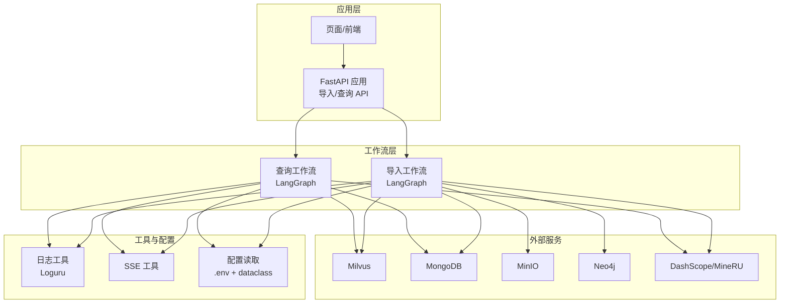
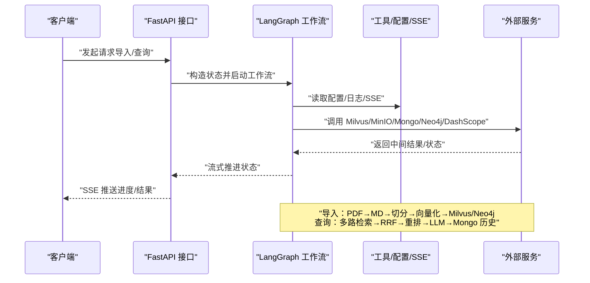
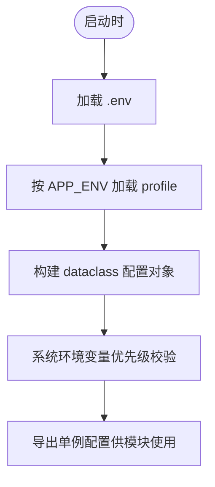
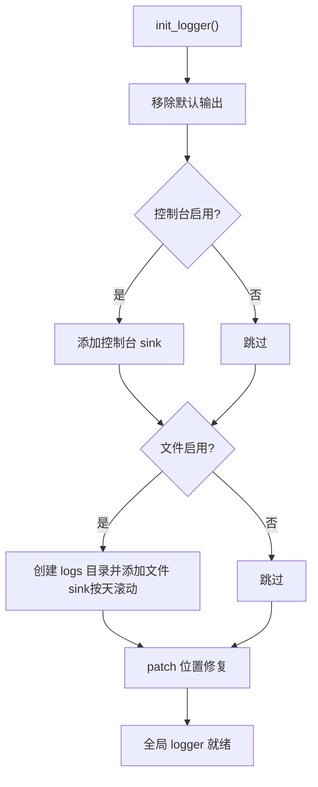
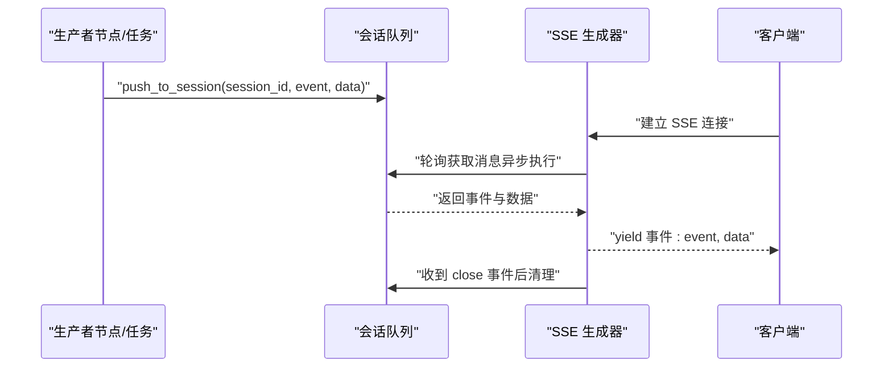
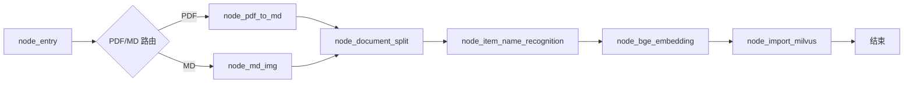
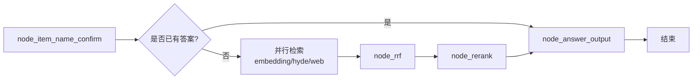
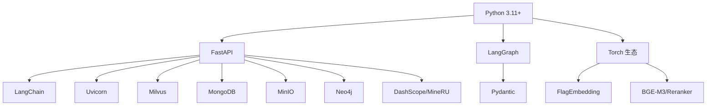

# 开发者指南

<cite>
**本文引用的文件**
- [pyproject.toml](file://pyproject.toml)
- [CLAUDE.md](file://CLAUDE.md)
- [项目要总结内容.txt](file://项目要总结内容.txt)
- [app/import_process/导入过程记录文档.txt](file://app/import_process/导入过程记录文档.txt)
- [app/conf/lm_config.py](file://app/conf/lm_config.py)
- [app/conf/embedding_config.py](file://app/conf/embedding_config.py)
- [app/conf/milvus_config.py](file://app/conf/milvus_config.py)
- [app/core/logger.py](file://app/core/logger.py)
- [app/utils/sse_utils.py](file://app/utils/sse_utils.py)
- [app/import_process/agent/state.py](file://app/import_process/agent/state.py)
- [app/import_process/agent/main_graph.py](file://app/import_process/agent/main_graph.py)
- [app/query_process/agent/state.py](file://app/query_process/agent/state.py)
- [app/query_process/agent/main_graph.py](file://app/query_process/agent/main_graph.py)
- [test/01-env和系统环境变量的优先级.py](file://test/01-env和系统环境变量的优先级.py)
</cite>

## 目录
1. [简介](#简介)
2. [项目结构](#项目结构)
3. [核心组件](#核心组件)
4. [架构总览](#架构总览)
5. [详细组件分析](#详细组件分析)
6. [依赖分析](#依赖分析)
7. [性能考虑](#性能考虑)
8. [故障排除指南](#故障排除指南)
9. [结论](#结论)
10. [附录](#附录)

## 简介
本指南面向参与 RAG Agent 项目的开发者，目标是帮助你在本地快速搭建开发环境、理解系统架构与数据流、掌握新功能开发流程、导入流程记录与学习日志的使用方法、故障排除与调试技巧、性能优化实践、贡献代码流程以及版本与发布规范。本项目采用 Python 3.11+，核心框架为 FastAPI + LangGraph，结合多种外部服务（Milvus、MongoDB、MinIO、Neo4j、DashScope/MineRU 等），实现“文档导入 → 向量化 → 检索重排 → LLM 生成”的完整 RAG 工作流。

## 项目结构
项目采用按功能域划分的目录组织方式，核心模块包括：
- 配置层：集中于 app/conf，通过 dataclass 读取 .env 并提供单例配置对象
- 核心工具：app/core（日志）、app/utils（SSE、任务追踪、格式化、限流等）
- 导入流程：app/import_process/agent（LangGraph 工作流 + 节点）
- 查询流程：app/query_process/agent（LangGraph 工作流 + 节点）
- 客户端封装：app/clients（Milvus、MinIO、Mongo、Neo4j）
- 工具与下载：app/tool（模型下载）
- 测试与验证：test（环境变量优先级、日志、CUDA 等）
- 文档与记录：_learn、docs、导入过程记录文档.txt、进度日志.md

图表来源
- [CLAUDE.md:24-70](file://CLAUDE.md#L24-L70)
- [app/core/logger.py:1-109](file://app/core/logger.py#L1-L109)
- [app/utils/sse_utils.py:1-108](file://app/utils/sse_utils.py#L1-L108)
- [app/conf/lm_config.py:1-27](file://app/conf/lm_config.py#L1-L27)
- [app/conf/embedding_config.py:1-24](file://app/conf/embedding_config.py#L1-L24)
- [app/conf/milvus_config.py:1-29](file://app/conf/milvus_config.py#L1-L29)

章节来源
- [CLAUDE.md:24-70](file://CLAUDE.md#L24-L70)

## 核心组件
- 配置体系：通过 python-dotenv 加载 .env，dataclass 封装各服务配置（LLM、Embedding、Milvus 等），支持按 APP_ENV 加载不同 profile，实现“系统环境变量 > .env > 默认值”的优先级策略。
- 日志系统：基于 Loguru，支持控制台/文件双输出、按天滚动、异步入队、中文友好、自动定位业务调用位置。
- SSE 流式传输：统一事件格式（ready/progress/delta/final/error/close），支持会话隔离与断连处理。
- LangGraph 工作流：导入流程与查询流程分别以 TypedDict 定义状态，节点化拆分职责，编译后可流式执行。
- 客户端封装：对 Milvus、MinIO、Mongo、Neo4j 的常用操作进行抽象，便于替换与扩展。

章节来源
- [app/conf/lm_config.py:1-27](file://app/conf/lm_config.py#L1-L27)
- [app/conf/embedding_config.py:1-24](file://app/conf/embedding_config.py#L1-L24)
- [app/conf/milvus_config.py:1-29](file://app/conf/milvus_config.py#L1-L29)
- [app/core/logger.py:1-109](file://app/core/logger.py#L1-L109)
- [app/utils/sse_utils.py:1-108](file://app/utils/sse_utils.py#L1-L108)
- [app/import_process/agent/state.py:1-99](file://app/import_process/agent/state.py#L1-L99)
- [app/query_process/agent/state.py:1-97](file://app/query_process/agent/state.py#L1-L97)

## 架构总览
系统分为“导入”和“查询”两条主干链路，二者均基于 LangGraph 管理状态与节点流转；导入链路侧重 PDF/Markdown 预处理、切分、向量化与入库；查询链路侧重多路检索、融合排序与重排、LLM 生成与历史保存。

图表来源
- [app/import_process/agent/main_graph.py:1-134](file://app/import_process/agent/main_graph.py#L1-L134)
- [app/query_process/agent/main_graph.py:1-47](file://app/query_process/agent/main_graph.py#L1-L47)
- [app/utils/sse_utils.py:1-108](file://app/utils/sse_utils.py#L1-L108)
- [app/core/logger.py:1-109](file://app/core/logger.py#L1-L109)

## 详细组件分析

### 配置系统（.env 与 dataclass）
- 加载顺序与优先级：系统环境变量 > .env > 代码默认值；可通过 override 控制覆盖策略。
- LLM 配置：包含 base_url、api_key、模型名、温度等。
- Embedding 配置：本地模型路径、仓库标识、运行设备、半精度开关。
- Milvus 配置：服务地址、集合名等；支持按 APP_ENV 加载 profile。

图表来源
- [app/conf/lm_config.py:1-27](file://app/conf/lm_config.py#L1-L27)
- [app/conf/embedding_config.py:1-24](file://app/conf/embedding_config.py#L1-L24)
- [app/conf/milvus_config.py:1-29](file://app/conf/milvus_config.py#L1-L29)
- [test/01-env和系统环境变量的优先级.py:1-18](file://test/01-env和系统环境变量的优先级.py#L1-L18)

章节来源
- [app/conf/lm_config.py:1-27](file://app/conf/lm_config.py#L1-L27)
- [app/conf/embedding_config.py:1-24](file://app/conf/embedding_config.py#L1-L24)
- [app/conf/milvus_config.py:1-29](file://app/conf/milvus_config.py#L1-L29)
- [test/01-env和系统环境变量的优先级.py:1-18](file://test/01-env和系统环境变量的优先级.py#L1-L18)

### 日志系统（Loguru）
- 双通道输出：控制台与文件，支持级别、格式、异步入队、中文编码、自动清理。
- 位置修复：穿透内部栈帧，精准定位业务模块调用位置。
- 配置项：开关、级别、保留天数、输出路径等由 .env 控制。

图表来源
- [app/core/logger.py:46-103](file://app/core/logger.py#L46-L103)

章节来源
- [app/core/logger.py:1-109](file://app/core/logger.py#L1-L109)

### SSE 流式传输
- 事件类型：ready、progress、delta、final、error、close。
- 会话队列：按 session_id 管理队列，生成器异步拉取并推送。
- 断连处理：捕获取消/重置/管道错误，及时清理资源。

图表来源
- [app/utils/sse_utils.py:54-108](file://app/utils/sse_utils.py#L54-L108)

章节来源
- [app/utils/sse_utils.py:1-108](file://app/utils/sse_utils.py#L1-L108)

### 导入工作流（LangGraph）
- 状态定义：ImportGraphState，涵盖流程控制标记、路径、内容、向量与数据库相关字段。
- 节点编排：入口节点根据文件类型路由至 PDF 或 Markdown 处理分支，随后依次执行切分、主体识别、向量化、入库等节点。
- 流式执行：支持流式推进与状态观察，便于监控与调试。

图表来源
- [app/import_process/agent/main_graph.py:30-65](file://app/import_process/agent/main_graph.py#L30-L65)
- [app/import_process/agent/state.py:5-99](file://app/import_process/agent/state.py#L5-L99)

章节来源
- [app/import_process/agent/main_graph.py:1-134](file://app/import_process/agent/main_graph.py#L1-L134)
- [app/import_process/agent/state.py:1-99](file://app/import_process/agent/state.py#L1-L99)

### 查询工作流（LangGraph）
- 状态定义：QueryGraphState，包含会话 ID、原始问题、检索中间结果、排序结果、提示词与最终答案等。
- 节点编排：先确认商品名，再并行执行普通向量检索、HyDE 向量检索与网络搜索，经 RRF 融合与重排后生成最终答案。
- 流式输出：结合 SSE 将增量输出推送给前端。

图表来源
- [app/query_process/agent/main_graph.py:26-47](file://app/query_process/agent/main_graph.py#L26-L47)
- [app/query_process/agent/state.py:5-97](file://app/query_process/agent/state.py#L5-L97)

章节来源
- [app/query_process/agent/main_graph.py:1-47](file://app/query_process/agent/main_graph.py#L1-L47)
- [app/query_process/agent/state.py:1-97](file://app/query_process/agent/state.py#L1-L97)

### 导入流程记录与学习日志
- 导入过程记录文档：提供“定义状态 → 定义节点 → 定义状态图与边 → 跑通节点与图关系”的步骤指引，便于新节点接入与调试。
- 学习日志与进度：通过 _learn 与进度日志.md 记录阶段性成果与问题，形成可追溯的学习轨迹。

章节来源
- [app/import_process/导入过程记录文档.txt:1-20](file://app/import_process/导入过程记录文档.txt#L1-L20)
- [项目要总结内容.txt:1-22](file://项目要总结内容.txt#L1-L22)

## 依赖分析
- 语言与框架：Python 3.11+、FastAPI、Uvicorn、LangGraph、LangChain、Pydantic。
- 向量与模型：FlagEmbedding、BGE-M3、BGE-Reranker、Torch 生态。
- 存储与对象：Milvus、MongoDB、MinIO、Neo4j。
- 工具与实用：NumPy、Pandas、Requests、Magic-PDF、OpenAI Agents（MCP）。

图表来源
- [pyproject.toml:1-38](file://pyproject.toml#L1-L38)

章节来源
- [pyproject.toml:1-38](file://pyproject.toml#L1-L38)

## 性能考虑
- 单例与缓存：数据库客户端、LLM 客户端、Embedding 模型采用单例或缓存策略，避免重复初始化与资源浪费。
- 设备与精度：Embedding 配置支持设备选择与半精度开关，按硬件能力权衡速度与精度。
- 流式处理：导入与查询均采用流式执行与 SSE 推送，降低前端等待时间，提升交互体验。
- 限流与并发：提供滑动窗口限速工具，避免外部服务压力过大。
- I/O 与磁盘：MinIO 与本地中间文件路径需合理规划，避免频繁小文件 I/O。

章节来源
- [CLAUDE.md:95-101](file://CLAUDE.md#L95-L101)
- [app/conf/embedding_config.py:18-24](file://app/conf/embedding_config.py#L18-L24)
- [app/utils/sse_utils.py:1-108](file://app/utils/sse_utils.py#L1-L108)

## 故障排除指南
- 环境变量优先级：系统环境变量优先级高于 .env；如需 .env 覆盖，请显式传入覆盖参数。
- 日志定位：使用日志工具的“位置修复”能力，确保错误堆栈指向业务模块实际调用处。
- SSE 断连：关注生成器异常处理与资源清理，避免悬挂队列与内存泄漏。
- 导入链路：逐节点验证状态字段变化，结合流式输出定位卡顿或异常节点。
- 查询链路：检查检索、融合排序与重排阶段的中间结果，确认字段完整性与一致性。

章节来源
- [test/01-env和系统环境变量的优先级.py:1-18](file://test/01-env和系统环境变量的优先级.py#L1-L18)
- [app/core/logger.py:88-103](file://app/core/logger.py#L88-L103)
- [app/utils/sse_utils.py:99-108](file://app/utils/sse_utils.py#L99-L108)
- [app/import_process/agent/main_graph.py:71-134](file://app/import_process/agent/main_graph.py#L71-L134)
- [app/query_process/agent/main_graph.py:1-47](file://app/query_process/agent/main_graph.py#L1-L47)

## 结论
本指南提供了从环境搭建、架构理解、组件使用到故障排除与性能优化的完整路径。建议在新增功能时遵循“状态先行、节点拆分、流式执行、SSE 推送”的原则，并严格遵守配置优先级与日志规范，确保系统稳定与可观测性。

## 附录

### 开发环境设置与配置
- Python 版本：3.11+
- 依赖安装：使用项目提供的依赖清单进行安装
- 环境变量：在项目根目录创建 .env，按需配置 LLM、Embedding、Milvus、MinIO、Mongo、Neo4j 等参数
- 配置优先级：系统环境变量 > .env > 默认值；必要时使用覆盖参数

章节来源
- [pyproject.toml:5](file://pyproject.toml#L5)
- [app/conf/lm_config.py:7-8](file://app/conf/lm_config.py#L7-L8)
- [app/conf/milvus_config.py:8-10](file://app/conf/milvus_config.py#L8-L10)
- [test/01-env和系统环境变量的优先级.py:9-13](file://test/01-env和系统环境变量的优先级.py#L9-L13)

### 新功能开发流程（模块开发、集成测试、文档更新）
- 状态定义：在对应工作流的 state.py 中补充字段，提供默认值与创建函数
- 节点实现：在 nodes 目录下新增节点文件，遵循单一职责与幂等性
- 工作流编排：在 main_graph.py 中注册节点、设置入口与边，必要时添加条件边
- 集成测试：参考现有测试脚本，编写最小可验证用例，覆盖正常与异常路径
- 文档更新：同步更新导入过程记录文档与学习日志，沉淀经验与问题

章节来源
- [app/import_process/agent/state.py:44-90](file://app/import_process/agent/state.py#L44-L90)
- [app/import_process/agent/main_graph.py:19-65](file://app/import_process/agent/main_graph.py#L19-L65)
- [app/import_process/导入过程记录文档.txt:5-20](file://app/import_process/导入过程记录文档.txt#L5-L20)

### 导入流程记录与学习日志使用
- 导入流程记录：按步骤填写状态、节点、图关系与验证，便于复现与交接
- 学习日志：记录技术难点、决策依据与改进点，形成知识沉淀

章节来源
- [app/import_process/导入过程记录文档.txt:1-20](file://app/import_process/导入过程记录文档.txt#L1-L20)
- [项目要总结内容.txt:1-22](file://项目要总结内容.txt#L1-L22)

### 代码规范、提交规范与代码审查
- 代码规范：遵循项目既有风格（类型注解、日志格式、事件常量命名等）
- 提交规范：每次提交聚焦单一功能，提交信息清晰描述变更目的与影响
- 代码审查：至少一次同行评审，重点关注状态定义、节点职责、异常处理与性能影响

（本节为通用实践建议，不直接分析具体文件）

### 版本管理与发布流程
- 版本号：遵循语义化版本管理
- 发布前检查：确保配置优先级、日志输出、SSE 行为与关键节点通过测试
- 发布说明：记录重大变更、依赖升级与已知问题

（本节为通用实践建议，不直接分析具体文件）