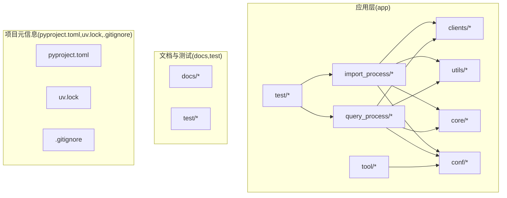
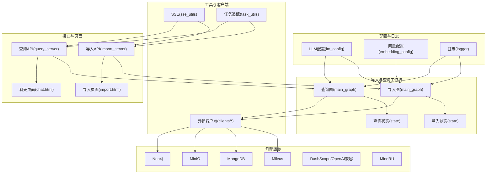
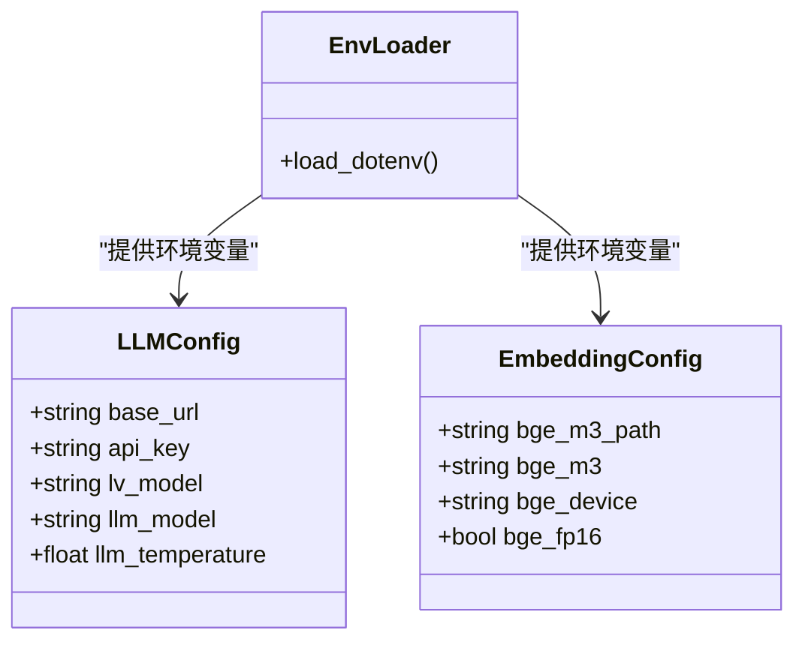
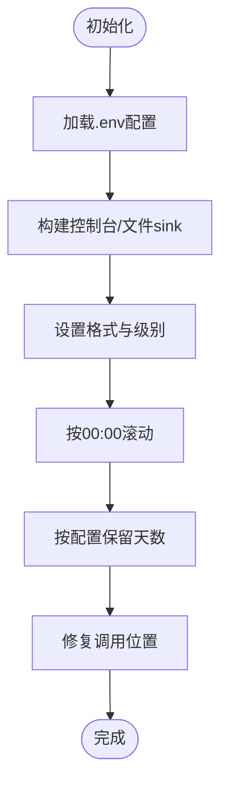
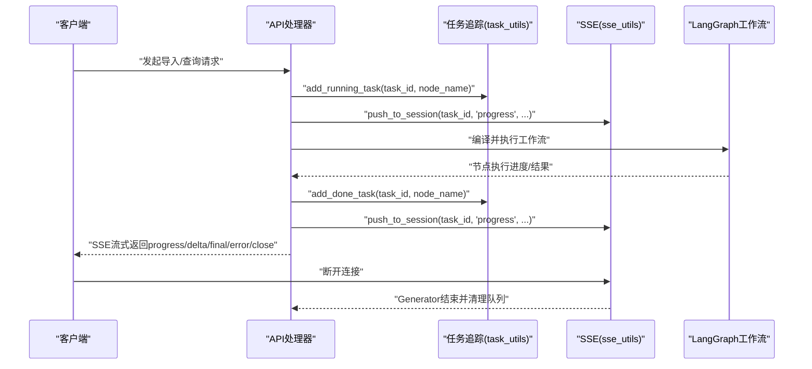
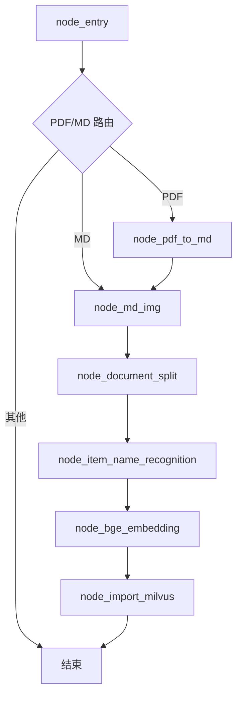
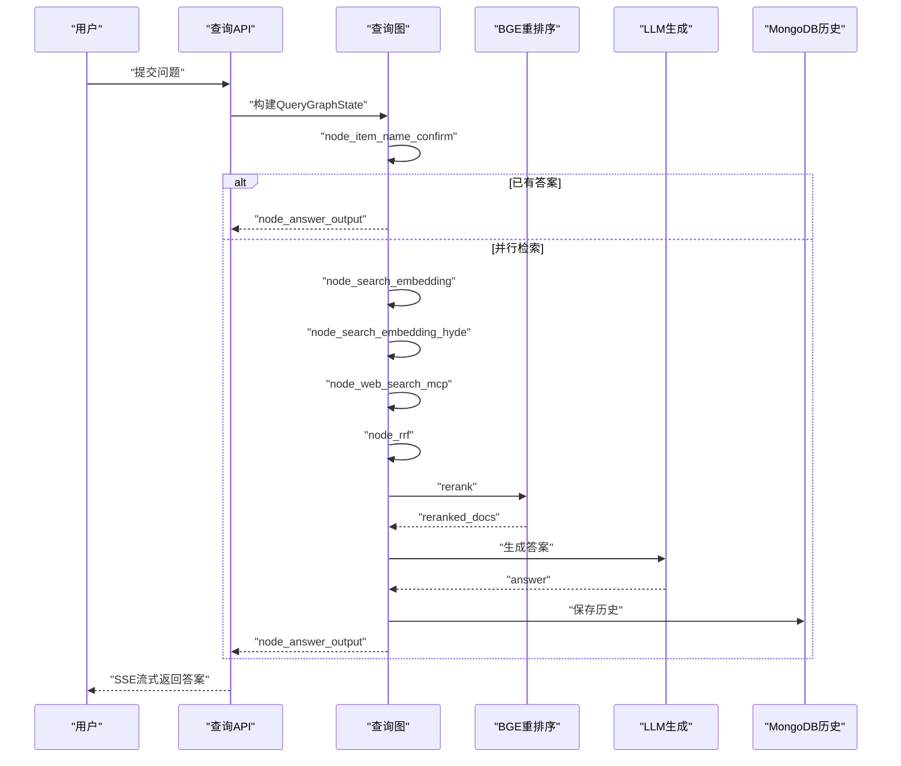
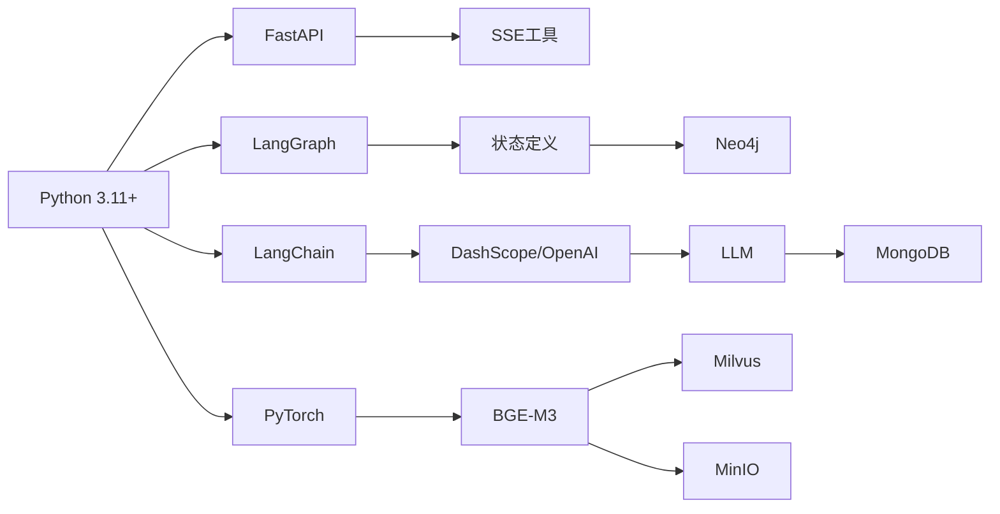

# 开发者指南

<cite>
**本文引用的文件**
- [pyproject.toml](file://pyproject.toml)
- [CLAUDE.md](file://CLAUDE.md)
- [项目要总结内容.txt](file://项目要总结内容.txt)
- [app/import_process/导入过程记录文档.txt](file://app/import_process/导入过程记录文档.txt)
- [app/conf/embedding_config.py](file://app/conf/embedding_config.py)
- [app/conf/lm_config.py](file://app/conf/lm_config.py)
- [app/core/logger.py](file://app/core/logger.py)
- [app/utils/sse_utils.py](file://app/utils/sse_utils.py)
- [app/utils/task_utils.py](file://app/utils/task_utils.py)
- [app/import_process/agent/main_graph.py](file://app/import_process/agent/main_graph.py)
- [app/import_process/agent/state.py](file://app/import_process/agent/state.py)
- [app/query_process/agent/main_graph.py](file://app/query_process/agent/main_graph.py)
- [app/query_process/agent/state.py](file://app/query_process/agent/state.py)
- [app/test/test_import_main_graph.py](file://app/test/test_import_main_graph.py)
- [app/core/load_prompt.py](file://app/core/load_prompt.py)
- [app/utils/path_util.py](file://app/utils/path_util.py)
- [app/lm/embedding_utils.py](file://app/lm/embedding_utils.py)
- [_learn/启动计划.md](file://_learn/启动计划.md)
- [_docs/本地环境-启停手册.md](file://_docs/本地环境-启停手册.md)
- [test/01-env和系统环境变量的优先级.py](file://test/01-env和系统环境变量的优先级.py)
- [scripts/start.sh](file://scripts/start.sh)
- [app/tool/download_bgem3.py](file://app/tool/download_bgem3.py)
- [app/tool/download_reranker.py](file://app/tool/download_reranker.py)
- [.gitignore](file://.gitignore)
- [uv.lock](file://uv.lock)
</cite>

## 更新摘要
**所做更改**
- 新增详细的开发环境搭建手册和启动计划章节
- 添加完整的环境配置、依赖安装、模型下载、服务验证流程
- 新增一键启动脚本和手动启停操作指南
- 补充环境变量优先级和配置管理说明
- 增加提示词文件创建和管理规范

## 目录
1. [简介](#简介)
2. [开发环境搭建手册](#开发环境搭建手册)
3. [项目结构](#项目结构)
4. [核心组件](#核心组件)
5. [架构总览](#架构总览)
6. [详细组件分析](#详细组件分析)
7. [依赖分析](#依赖分析)
8. [性能考虑](#性能考虑)
9. [故障排除指南](#故障排除指南)
10. [结论](#结论)
11. [附录](#附录)

## 简介
本指南面向参与 RAG Agent 项目的开发者，提供从环境搭建、代码规范、提交规范、代码审查流程，到新功能开发、集成测试、文档更新、导入流程记录与学习日志使用、故障排除方法论、性能优化实践、贡献流程与版本发布规范的完整说明。项目采用 Python 3.11+，基于 FastAPI + LangGraph + LangChain + 向量与知识图谱生态构建，涵盖文档导入与查询两大主流程。

## 开发环境搭建手册

### 环境准备
- **操作系统**：Windows 10/11、macOS 或 Linux
- **Python 版本**：3.11+
- **包管理器**：uv（推荐）或 pip
- **Docker**：用于本地基础设施服务
- **Git**：版本控制

### 依赖安装
使用 uv 包管理器进行依赖安装：

```bash
# 安装项目依赖
uv sync

# 如需额外安装 openai-agents 包
uv add openai-agents
```

**验证安装**：
```bash
uv run python -c "import fastapi, langgraph, pymilvus; print('依赖安装成功')"
```

### 环境变量配置
在项目根目录创建 `.env` 文件，复制以下模板并填入真实值：

```env
# ===== LLM（DashScope / Qwen）=====
OPENAI_BASE_URL=https://dashscope.aliyuncs.com/compatible-mode/v1
OPENAI_API_KEY=                     # 填你的 DashScope API Key
LLM_DEFAULT_MODEL=qwen-plus
VL_MODEL=qwen-vl-plus
LLM_DEFAULT_TEMPERATURE=0.7

# ===== MineRU PDF 解析 =====
MINERU_BASE_URL=https://mineru.net/api/v4
MINERU_API_TOKEN=                   # 填你的 MineRU Token

# ===== Milvus 向量数据库 =====
MILVUS_URL=http://47.94.86.115:19530
CHUNKS_COLLECTION=kb_chunks
ITEM_NAME_COLLECTION=kb_item_name
ENTITY_NAME_COLLECTION=kb_entity_name

# ===== MinIO 对象存储 =====
MINIO_ENDPOINT=47.94.86.115:9000
MINIO_ACCESS_KEY=                   # 填你的 MinIO Access Key
MINIO_SECRET_KEY=                   # 填你的 MinIO Secret Key
MINIO_BUCKET_NAME=rag-bucket
MINIO_IMG_DIR=/upload-images
MINIO_SECURE=False

# ===== BGE-M3 嵌入模型 =====
BGE_M3_PATH=
BGE_M3=BAAI/bge-m3
BGE_DEVICE=cpu
BGE_FP16=0

# ===== BGE-Reranker =====
BGE_RERANKER_LARGE=
BGE_RERANKER_DEVICE=cpu
BGE_RERANKER_FP16=0

# ===== MCP 联网搜索（百炼）=====
MCP_DASHSCOPE_BASE_URL_STREAMABLE=https://mcp.aliyuncs.com/sse
```

**环境变量优先级说明**：
- 系统环境变量 > .env 文件 > 代码默认值
- 如需让 .env 覆盖系统变量，使用 `load_dotenv(override=True)`

### 模型下载
下载必要的机器学习模型：

```bash
uv run python -c "
from modelscope.hub.snapshot_download import snapshot_download
snapshot_download('BAAI/bge-m3', cache_dir='./models')
snapshot_download('BAAI/bge-reranker-large', cache_dir='./models')
"
```

下载完成后，在 `.env` 文件中更新模型路径：
- `BGE_M3_PATH=./models/BAAI/bge-m3`
- `BGE_RERANKER_LARGE=./models/BAAI/bge-reranker-large`

### 外部服务验证
验证各外部服务的连通性：

```bash
# Milvus 连通性测试
uv run python -c "
from pymilvus import MilvusClient
c = MilvusClient('http://47.94.86.115:19530')
print('Milvus OK，集合列表：', c.list_collections())
"

# MongoDB 连通性测试
uv run python -c "
from pymongo import MongoClient
MongoClient('mongodb://47.94.86.115:27017', serverSelectionTimeoutMS=3000).admin.command('ping')
print('MongoDB OK')
"

# MinIO 连通性测试
uv run python -c "
from dotenv import load_dotenv; load_dotenv()
import os
from minio import Minio
c = Minio(
    os.getenv('MINIO_ENDPOINT'),
    access_key=os.getenv('MINIO_ACCESS_KEY'),
    secret_key=os.getenv('MINIO_SECRET_KEY'),
    secure=False
)
print('MinIO OK，桶列表：', [b.name for b in c.list_buckets()])
"
```

### 一键启动脚本
推荐使用一键启动脚本快速启动整个开发环境：

```bash
# 启动：Docker(Milvus/MinIO/MongoDB) + 导入服务(8000) + 查询服务(8001)
./scripts/start.sh

# 停止：先停两个 Python 服务，再 docker compose stop（数据保留）
./scripts/stop.sh
```

**手动启动步骤**：
```bash
# 启动 Docker 容器
docker compose up -d

# 启动导入服务（端口 8000）
uv run python -m app.import_process.api.import_server

# 启动查询服务（端口 8001）
uv run python -m app.query_process.api.query_server
```

### 健康检查
验证服务运行状态：

```bash
curl http://127.0.0.1:8000/docs        # 导入服务存活
curl http://127.0.0.1:8001/health      # 查询服务存活
```

**章节来源**
- [_learn/启动计划.md:264-344](file://_learn/启动计划.md#L264-L344)
- [_docs/本地环境-启停手册.md:1-111](file://_docs/本地环境-启停手册.md#L1-L111)
- [test/01-env和系统环境变量的优先级.py:1-18](file://test/01-env和系统环境变量的优先级.py#L1-L18)
- [scripts/start.sh:1-19](file://scripts/start.sh#L1-L19)

## 项目结构
项目采用按功能域分层的组织方式：
- app：核心应用代码
  - clients：外部服务客户端封装（Milvus、MinIO、Mongo、Neo4j）
  - conf：配置模块（dotenv 加载、dataclass 单例）
  - core：基础设施（日志、提示词加载）
  - import_process：导入工作流（LangGraph）
  - query_process：查询工作流（LangGraph）
  - utils：通用工具（SSE、任务追踪、格式化、限速等）
  - test：单元/流程测试脚本
  - tool：辅助工具（模型下载）
- docs：项目总结与知识文档
- test：环境与系统测试脚本
- 顶层：项目元信息与锁文件（pyproject.toml、uv.lock）、环境变量示例（.env）



**图表来源**
- [pyproject.toml:1-36](file://pyproject.toml#L1-L36)
- [CLAUDE.md:24-70](file://CLAUDE.md#L24-L70)

**章节来源**
- [pyproject.toml:1-36](file://pyproject.toml#L1-L36)
- [CLAUDE.md:24-70](file://CLAUDE.md#L24-L70)

## 核心组件
- 配置体系
  - LLM 配置：通过 dataclass 从 .env 读取基础地址、密钥、默认模型与温度等。
  - 向量模型配置：BGE-M3 路径、仓库标识、运行设备、半精度开关。
  - 配置优先级：系统环境变量 > .env > 代码默认值。
- 日志系统
  - 基于 loguru，支持控制台/文件双输出、按天滚动、中文友好、异步安全、自动定位业务调用位置。
- SSE 与任务追踪
  - SSE 事件类型：ready、progress、delta、final、error、close。
  - 任务状态：进行中/已完成/失败，结合中文节点名映射，推送进度到前端。
- LangGraph 工作流
  - 导入流程：入口节点根据文件类型路由至 PDF 或 Markdown 路径，随后按固定顺序推进至 Milvus 写入。
  - 查询流程：先确认产品项，再并行多路检索（普通向量/HyDE/MCP 网络搜索），RRF 融合，BGE 重排序，最终生成答案。
- 工具与客户端
  - 通用工具：SSE、任务追踪、格式化、限速、稀疏向量归一化、字符串转义等。
  - 外部客户端：Milvus、MinIO、Mongo、Neo4j。

**章节来源**
- [app/conf/lm_config.py:1-27](file://app/conf/lm_config.py#L1-L27)
- [app/conf/embedding_config.py:1-24](file://app/conf/embedding_config.py#L1-L24)
- [app/core/logger.py:1-109](file://app/core/logger.py#L1-L109)
- [app/utils/sse_utils.py:1-108](file://app/utils/sse_utils.py#L1-L108)
- [app/utils/task_utils.py:1-187](file://app/utils/task_utils.py#L1-L187)
- [app/import_process/agent/main_graph.py:1-134](file://app/import_process/agent/main_graph.py#L1-L134)
- [app/query_process/agent/main_graph.py:1-47](file://app/query_process/agent/main_graph.py#L1-L47)

## 架构总览
系统由"配置—日志—工具—工作流—API/页面—外部服务"构成，导入与查询两条主干流程通过 LangGraph 管理状态与节点，SSE 推送进度，任务追踪维护状态与结果。



**图表来源**
- [CLAUDE.md:72-93](file://CLAUDE.md#L72-L93)
- [app/import_process/agent/main_graph.py:1-134](file://app/import_process/agent/main_graph.py#L1-L134)
- [app/query_process/agent/main_graph.py:1-47](file://app/query_process/agent/main_graph.py#L1-L47)
- [app/utils/sse_utils.py:1-108](file://app/utils/sse_utils.py#L1-L108)
- [app/utils/task_utils.py:1-187](file://app/utils/task_utils.py#L1-L187)

## 详细组件分析

### 配置模块
- LLMConfig：统一读取 OPENAI_BASE_URL、OPENAI_API_KEY、VL_MODEL、LLM_DEFAULT_MODEL、LLM_DEFAULT_TEMPERATURE，便于切换不同推理后端。
- EmbeddingConfig：统一读取 BGE_M3_PATH、BGE_M3、BGE_DEVICE、BGE_FP16，支持半精度与设备选择。
- 配置加载：通过 dotenv 在模块导入阶段提前加载，确保后续读取有效。



**图表来源**
- [app/conf/lm_config.py:10-26](file://app/conf/lm_config.py#L10-L26)
- [app/conf/embedding_config.py:9-24](file://app/conf/embedding_config.py#L9-L24)

**章节来源**
- [app/conf/lm_config.py:1-27](file://app/conf/lm_config.py#L1-L27)
- [app/conf/embedding_config.py:1-24](file://app/conf/embedding_config.py#L1-L24)

### 日志系统
- 功能要点：双输出开关、级别、按天滚动、中文编码、异步安全、自动定位业务调用位置。
- 使用建议：在各模块直接导入 logger，避免重复初始化；生产环境建议开启文件输出并合理设置保留策略。



**图表来源**
- [app/core/logger.py:46-83](file://app/core/logger.py#L46-L83)
- [app/core/logger.py:88-103](file://app/core/logger.py#L88-L103)

**章节来源**
- [app/core/logger.py:1-109](file://app/core/logger.py#L1-L109)

### SSE 与任务追踪
- SSE 事件：ready、progress、delta、final、error、close；通过 session_id 维护队列，异步生成器推送。
- 任务追踪：维护进行中/已完成节点列表、任务状态、结果字典；支持中文节点名映射与进度推送。



**图表来源**
- [app/utils/sse_utils.py:43-108](file://app/utils/sse_utils.py#L43-L108)
- [app/utils/task_utils.py:68-180](file://app/utils/task_utils.py#L68-L180)

**章节来源**
- [app/utils/sse_utils.py:1-108](file://app/utils/sse_utils.py#L1-L108)
- [app/utils/task_utils.py:1-187](file://app/utils/task_utils.py#L1-L187)

### 导入流程（LangGraph）
- 状态定义：ImportGraphState 包含任务ID、流程控制标记、路径、内容数据、数据库相关字段。
- 节点与路由：入口节点根据 is_pdf_read_enabled/is_md_read_enabled 路由；固定顺序推进至 Milvus 写入。
- 流程测试：提供 test_import_main_graph.py，演示如何构造初始状态、流式执行并打印节点进度与最终状态。



**图表来源**
- [app/import_process/agent/main_graph.py:30-65](file://app/import_process/agent/main_graph.py#L30-L65)
- [app/import_process/agent/state.py:5-41](file://app/import_process/agent/state.py#L5-L41)

**章节来源**
- [app/import_process/agent/main_graph.py:1-134](file://app/import_process/agent/main_graph.py#L1-L134)
- [app/import_process/agent/state.py:1-99](file://app/import_process/agent/state.py#L1-L99)
- [app/test/test_import_main_graph.py:1-27](file://app/test/test_import_main_graph.py#L1-L27)

### 查询流程（LangGraph）
- 状态定义：QueryGraphState 包含会话ID、原始问题、检索中间结果、排序结果、生成中间结果、改写问题、历史、流式标记等。
- 节点与路由：先确认产品项，再并行多路检索（普通向量/HyDE/MCP），RRF 融合，BGE 重排序，最终生成答案并保存到历史。



**图表来源**
- [app/query_process/agent/main_graph.py:12-47](file://app/query_process/agent/main_graph.py#L12-L47)
- [app/query_process/agent/state.py:5-30](file://app/query_process/agent/state.py#L5-L30)

**章节来源**
- [app/query_process/agent/main_graph.py:1-47](file://app/query_process/agent/main_graph.py#L1-L47)
- [app/query_process/agent/state.py:1-97](file://app/query_process/agent/state.py#L1-L97)

### 提示词管理系统
- **文件结构**：在项目根目录创建 `prompts/` 文件夹，包含 6 个预定义的提示词文件
- **渲染机制**：通过 `load_prompt()` 函数支持变量占位符渲染，使用 `str.format()` 方法
- **支持的占位符**：
  - `{root_folder}`：文档根目录名称
  - `{image_content[0]}`：图片前文内容
  - `{image_content[1]}`：图片后文内容
  - `{context}`：文档内容片段
  - `{file_title}`：文件标题
  - `{history_text}`：历史对话文本
  - `{query}`：当前问题
  - `{rewritten_query}`：重写后的问题
  - `{item_names}`：商品名称列表
  - `{history}`：历史对话
  - `{question}`：用户问题

**章节来源**
- [app/core/load_prompt.py:1-43](file://app/core/load_prompt.py#L1-L43)

## 依赖分析
- 语言与框架：Python 3.11+、FastAPI、Uvicorn、LangGraph、LangChain 生态。
- 向量与模型：BGE-M3（dense + sparse）、BGE-Reranker、PyTorch 生态。
- 外部服务：Milvus、MongoDB、MinIO、Neo4j、DashScope/OpenAI 兼容 API、MineRU。
- 依赖管理：pyproject.toml 声明依赖；uv.lock 提供锁定版本。



**图表来源**
- [pyproject.toml:9-35](file://pyproject.toml#L9-L35)
- [CLAUDE.md:103-113](file://CLAUDE.md#L103-L113)

**章节来源**
- [pyproject.toml:1-36](file://pyproject.toml#L1-L36)
- [CLAUDE.md:103-113](file://CLAUDE.md#L103-L113)

## 性能考虑
- 设备与半精度：通过 EmbeddingConfig 的设备与半精度开关控制显存占用与吞吐。
- 流式输出：SSE 与 LangGraph 流式执行降低首屏延迟，提升用户体验。
- 限速与并发：task_utils 与 rate_limit_utils 提供滑动窗口限速，避免外部服务限流。
- 向量化与检索：混合向量（dense + sparse）与重排序提升召回质量；合理设置检索 Top-K 与 RRF 融合参数。
- 日志与磁盘：按天滚动与保留策略减少磁盘压力；生产环境建议异步写入与中文编码。

**章节来源**
- [app/conf/embedding_config.py:10-24](file://app/conf/embedding_config.py#L10-L24)
- [app/utils/sse_utils.py:54-108](file://app/utils/sse_utils.py#L54-L108)
- [app/utils/task_utils.py:174-187](file://app/utils/task_utils.py#L174-L187)
- [app/core/logger.py:68-81](file://app/core/logger.py#L68-L81)

## 故障排除指南
- 环境变量与配置
  - 确认 .env 文件存在且包含必要键（如 OPENAI_BASE_URL、OPENAI_API_KEY、BGE_*、各服务地址）。
  - 验证配置优先级：系统环境变量 > .env > 代码默认值。
- 日志定位
  - 使用 logger.patch(fix_log_position) 定位业务模块真实调用位置，避免 loguru 内部栈干扰。
  - 检查 logs 目录与按天滚动文件，确认编码与保留策略。
- SSE 连接
  - 断开连接时生成器会捕获异常并清理队列；检查 session_id 是否匹配、队列是否创建。
  - 如出现"Queue not found"，确认会话创建与推送逻辑一致。
- LangGraph 执行
  - 使用 test_import_main_graph.py 构造最小状态，逐步验证节点执行与状态变化。
  - 通过 print_ascii() 查看图结构，确认边与路由正确。
- 外部服务
  - Milvus/Mongo/MinIO/Neo4j：核对地址、认证与网络连通性。
  - LLM/DashScope：核对 base_url 与 api_key，确认模型与温度设置。

**章节来源**
- [app/core/logger.py:88-103](file://app/core/logger.py#L88-L103)
- [app/utils/sse_utils.py:54-108](file://app/utils/sse_utils.py#L54-L108)
- [app/test/test_import_main_graph.py:1-27](file://app/test/test_import_main_graph.py#L1-L27)

## 结论
本指南提供了从环境搭建到贡献发布的完整路径，强调配置优先级、日志可观测性、SSE 流式体验与 LangGraph 工作流的可维护性。遵循本文规范可显著提升开发效率与系统稳定性。

## 附录

### 开发环境设置与配置
- **Python 版本**：3.11+
- **依赖安装**：使用项目提供的依赖声明与锁定文件进行安装。
- **环境变量**：在项目根目录创建 .env，包含 LLM、向量、外部服务等关键配置。
- **日志配置**：通过 .env 控制台/文件输出、级别与保留策略。

**章节来源**
- [pyproject.toml:5](file://pyproject.toml#L5)
- [pyproject.toml:9-35](file://pyproject.toml#L9-L35)
- [app/core/logger.py:24-30](file://app/core/logger.py#L24-L30)

### 代码规范与提交规范
- **代码风格**：遵循项目现有命名与注释风格，保持一致性。
- **配置与日志**：统一通过 dataclass 与 dotenv 管理，日志使用全局 logger。
- **工作流**：新增节点需同步更新状态定义与路由逻辑，并补充测试。
- **提交流程**：建议使用分支开发、提交前运行测试脚本，确保导入/查询流程可正常执行。

**章节来源**
- [app/conf/lm_config.py:10-26](file://app/conf/lm_config.py#L10-L26)
- [app/conf/embedding_config.py:9-24](file://app/conf/embedding_config.py#L9-L24)
- [app/import_process/agent/state.py:5-41](file://app/import_process/agent/state.py#L5-L41)
- [app/test/test_import_main_graph.py:1-27](file://app/test/test_import_main_graph.py#L1-L27)

### 代码审查流程
- **节点与状态**：审查新增节点是否符合状态定义，路由逻辑是否完备。
- **SSE 与任务追踪**：审查进度推送与状态更新是否及时、一致。
- **外部服务**：审查连接参数与错误处理是否完善。
- **性能与健壮性**：审查限速、日志与异常处理是否满足生产要求。

**章节来源**
- [app/utils/sse_utils.py:43-108](file://app/utils/sse_utils.py#L43-L108)
- [app/utils/task_utils.py:68-180](file://app/utils/task_utils.py#L68-L180)

### 新功能开发指南
- **模块开发流程**
  - 明确状态字段：在对应 state.py 中扩展 ImportGraphState/QueryGraphState。
  - 实现节点：在 agent/nodes 下新增节点实现，遵循现有命名与注释规范。
  - 注册与路由：在 main_graph.py 中注册节点并完善路由与边。
  - 集成测试：编写/复用测试脚本，验证节点与图关系。
- **文档更新**
  - 更新导入过程记录文档，补充节点步骤与状态图。
  - 更新项目总结内容，补充技术栈与流程说明。

**章节来源**
- [app/import_process/agent/state.py:5-41](file://app/import_process/agent/state.py#L5-L41)
- [app/import_process/agent/main_graph.py:19-65](file://app/import_process/agent/main_graph.py#L19-L65)
- [app/import_process/导入过程记录文档.txt:1-20](file://app/import_process/导入过程记录文档.txt#L1-L20)
- [项目要总结内容.txt:1-22](file://项目要总结内容.txt#L1-L22)

### 导入流程记录与学习日志
- **导入过程记录文档**：用于记录状态定义、节点实现、状态图与边、节点与图关系验证等。
- **学习日志**：结合 kb-learning-journey.md 与 _learn 目录，沉淀技术决策与经验。

**章节来源**
- [app/import_process/导入过程记录文档.txt:1-20](file://app/import_process/导入过程记录文档.txt#L1-L20)
- [CLAUDE.md:120-126](file://CLAUDE.md#L120-L126)

### 贡献代码流程与注意事项
- **分支策略**：建议以功能分支开发，完成后合并到主干。
- **测试**：确保导入/查询流程测试通过，新增节点具备最小可运行测试。
- **文档**：更新导入过程记录与项目总结内容，保持文档与代码一致。
- **提交**：遵循提交信息规范，简明描述变更目的与影响范围。

**章节来源**
- [app/test/test_import_main_graph.py:1-27](file://app/test/test_import_main_graph.py#L1-L27)
- [app/import_process/导入过程记录文档.txt:1-20](file://app/import_process/导入过程记录文档.txt#L1-L20)
- [项目要总结内容.txt:1-22](file://项目要总结内容.txt#L1-L22)

### 版本管理与发布规范
- **版本号**：遵循语义化版本管理，变更重要功能或破坏性改动时提升主版本。
- **锁文件**：uv.lock 用于锁定依赖版本，发布前确保锁文件已更新。
- **提交与标签**：使用 Git 标签标记发布版本，配合变更日志说明。

**章节来源**
- [pyproject.toml:2-4](file://pyproject.toml#L2-L4)
- [uv.lock](file://uv.lock)

### 环境变量与配置管理
- **配置加载时机**：在模块导入阶段执行 `load_dotenv()`，确保配置可用性。
- **环境切换**：通过 `APP_ENV` 环境变量切换本地/云端配置。
- **路径解析**：使用 `get_project_root()` 函数递归查找项目根目录。

**章节来源**
- [app/utils/path_util.py:1-54](file://app/utils/path_util.py#L1-L54)
- [_docs/本地环境-启停手册.md:51-57](file://_docs/本地环境-启停手册.md#L51-L57)

### 模型与向量处理
- **BGE-M3 模型**：支持稠密+稀疏混合向量生成，自动 L2 归一化。
- **向量归一化**：`normalize_embeddings=True` 确保向量在 Milvus 中使用 IP 距离时的准确性。
- **稀疏向量处理**：解决 NumPy 类型转换问题，确保 JSON 序列化兼容性。

**章节来源**
- [app/lm/embedding_utils.py:1-108](file://app/lm/embedding_utils.py#L1-L108)
- [_learn/启动计划.md:282-299](file://_learn/启动计划.md#L282-L299)