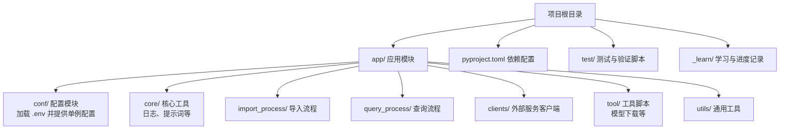
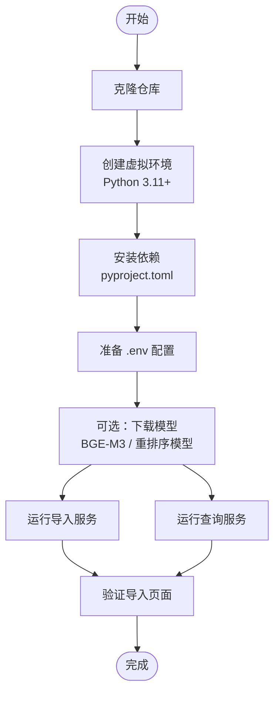
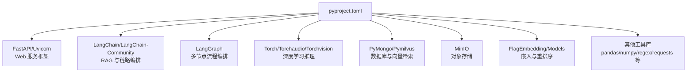

# 快速开始

<cite>
**本文引用的文件**
- [pyproject.toml](file://pyproject.toml)
- [lm_config.py](file://app/conf/lm_config.py)
- [embedding_config.py](file://app/conf/embedding_config.py)
- [milvus_config.py](file://app/conf/milvus_config.py)
- [minio_config.py](file://app/conf/minio_config.py)
- [reranker_config.py](file://app/conf/reranker_config.py)
- [download_bgem3.py](file://app/tool/download_bgem3.py)
- [download_reranker.py](file://app/tool/download_reranker.py)
- [logger.py](file://app/core/logger.py)
- [01-env和系统环境变量的优先级.py](file://test/01-env和系统环境变量的优先级.py)
</cite>

## 目录
1. [简介](#简介)
2. [项目结构](#项目结构)
3. [核心组件](#核心组件)
4. [架构总览](#架构总览)
5. [详细组件分析](#详细组件分析)
6. [依赖分析](#依赖分析)
7. [性能考虑](#性能考虑)
8. [故障排除指南](#故障排除指南)
9. [结论](#结论)
10. [附录](#附录)

## 简介
本指南面向首次接触 RAG Agent 项目的用户，帮助你在最短时间内完成环境准备、依赖安装、配置与运行。项目要求 Python 3.11+，并依赖一组用于大模型接入、嵌入与重排序、向量检索、对象存储以及日志记录的核心库。你将学会如何克隆仓库、创建隔离的虚拟环境、安装依赖、准备配置文件、首次运行与验证，并掌握常见问题的排查方法。

## 项目结构
RAG Agent 采用分层组织方式：
- 应用主体位于 app/ 目录，包含客户端工具、配置、核心模块、导入与查询流程、工具与实用函数等
- 顶层配置由 pyproject.toml 统一管理，声明了项目元信息与依赖
- 测试与学习资料位于 test/ 与 _learn/ 等目录中

图表来源
- [pyproject.toml:1-36](file://pyproject.toml#L1-L36)

章节来源
- [pyproject.toml:1-36](file://pyproject.toml#L1-L36)

## 核心组件
- 配置体系：通过 .env 文件集中管理各类服务的访问凭据与行为参数，配置类以 dataclass 形式封装，便于全局单例使用
- 日志系统：基于 loguru 的开箱即用日志工具，支持控制台与文件双输出、自动清理、中文友好与异步安全
- 模型与工具：提供 BGE-M3 与重排序模型的下载脚本，便于本地部署与加速首次运行

章节来源
- [lm_config.py:1-27](file://app/conf/lm_config.py#L1-L27)
- [embedding_config.py:1-24](file://app/conf/embedding_config.py#L1-L24)
- [milvus_config.py:1-26](file://app/conf/milvus_config.py#L1-L26)
- [minio_config.py:1-29](file://app/conf/minio_config.py#L1-L29)
- [reranker_config.py:1-21](file://app/conf/reranker_config.py#L1-L21)
- [logger.py:1-59](file://app/core/logger.py#L1-L59)
- [download_bgem3.py:1-5](file://app/tool/download_bgem3.py#L1-L5)
- [download_reranker.py:1-10](file://app/tool/download_reranker.py#L1-L10)

## 架构总览
下图展示了从环境准备到首次运行的关键步骤与交互关系：

## 详细组件分析

### 环境与依赖准备
- Python 版本要求：项目明确要求 Python >= 3.11
- 依赖管理：使用 pyproject.toml 统一声明，包含 FastAPI、LangChain 生态、LangGraph、PyMongo、Pymilvus、MinIO、Torch 及其子包、Uvicorn 等
- 推荐安装方式：建议使用现代包管理器进行安装，确保依赖解析与锁定的一致性

章节来源
- [pyproject.toml:1-36](file://pyproject.toml#L1-L36)

### 虚拟环境与安装步骤
- 创建虚拟环境：使用 Python 3.11+ 创建隔离环境
- 激活环境后，根据项目依赖配置进行安装
- 如需加速，可参考项目提供的模型下载脚本提前准备本地模型缓存

章节来源
- [pyproject.toml:1-36](file://pyproject.toml#L1-L36)
- [download_bgem3.py:1-5](file://app/tool/download_bgem3.py#L1-L5)
- [download_reranker.py:1-10](file://app/tool/download_reranker.py#L1-L10)

### 配置文件与环境变量
- .env 加载机制：各配置模块在导入时会提前加载 .env，确保后续 os.getenv 能正确读取
- 配置优先级：系统环境变量 > .env 文件 > 代码默认值；如需 .env 覆盖系统变量，可在加载时显式传入覆盖参数
- 关键配置项（示例，具体键名以 .env 为准）：
  - 大模型服务：基础地址、API Key、默认模型、温度等
  - 向量数据库：连接地址、集合名称等
  - 对象存储：Endpoint、AccessKey、SecretKey、BucketName、图片目录、是否启用 HTTPS
  - 嵌入与重排序：本地模型路径、设备、半精度开关等
  - 日志：控制台开关、级别、文件开关、保留策略等

章节来源
- [lm_config.py:1-27](file://app/conf/lm_config.py#L1-L27)
- [embedding_config.py:1-24](file://app/conf/embedding_config.py#L1-L24)
- [milvus_config.py:1-26](file://app/conf/milvus_config.py#L1-L26)
- [minio_config.py:1-29](file://app/conf/minio_config.py#L1-L29)
- [reranker_config.py:1-21](file://app/conf/reranker_config.py#L1-L21)
- [logger.py:20-30](file://app/core/logger.py#L20-L30)
- [01-env和系统环境变量的优先级.py:1-18](file://test/01-env和系统环境变量的优先级.py#L1-L18)

### 首次运行与验证
- 启动导入服务：进入项目根目录，使用 Uvicorn 或项目提供的导入服务入口启动导入 API
- 启动查询服务：同样使用 Uvicorn 或查询服务入口启动查询 API
- 页面访问：
  - 导入页面：用于上传与导入知识库
  - 聊天页面：用于与 RAG Agent 交互
  - 查询监控页：查看查询链路与状态
- 验证步骤：
  - 导入页面返回 200 且页面可用
  - 聊天页面可正常发起对话并返回结果
  - 日志目录生成日志文件，确认日志输出正常

章节来源
- [pyproject.toml:10-35](file://pyproject.toml#L10-L35)

### 模型下载与本地缓存
- BGE-M3 模型下载：脚本将模型下载至指定缓存目录，便于离线或加速首次运行
- 重排序模型下载：同理，将重排序模型缓存至本地目录

章节来源
- [download_bgem3.py:1-5](file://app/tool/download_bgem3.py#L1-L5)
- [download_reranker.py:1-10](file://app/tool/download_reranker.py#L1-L10)

## 依赖分析
下图展示项目核心依赖之间的关系与用途映射：

图表来源
- [pyproject.toml:9-35](file://pyproject.toml#L9-L35)

章节来源
- [pyproject.toml:9-35](file://pyproject.toml#L9-L35)

## 性能考虑
- 设备与精度：嵌入与重排序配置支持设备选择与半精度开关，合理配置可提升推理速度
- 缓存与预热：提前下载模型并放置在本地缓存，减少网络等待
- 日志级别：生产环境建议降低日志级别，减少 IO 压力

## 故障排除指南
- Python 版本不符：请使用 Python 3.11+，否则安装或运行可能出现兼容性错误
- 依赖安装失败：检查网络与镜像源，必要时使用现代包管理器进行安装
- 环境变量未生效：
  - 确认 .env 文件存在于项目根目录
  - 确保配置模块导入时已加载 .env
  - 如需 .env 覆盖系统变量，请在加载时显式传入覆盖参数
- 模型下载失败：检查缓存目录权限与磁盘空间，确保网络可达
- 服务无法访问：确认端口未被占用，防火墙放行，Uvicorn 启动参数正确

章节来源
- [01-env和系统环境变量的优先级.py:1-18](file://test/01-env和系统环境变量的优先级.py#L1-L18)
- [download_bgem3.py:1-5](file://app/tool/download_bgem3.py#L1-L5)
- [download_reranker.py:1-10](file://app/tool/download_reranker.py#L1-L10)

## 结论
按照本指南完成环境准备、依赖安装与配置后，你可以在本地快速启动导入与查询服务，并通过页面完成首次验证。遇到问题时，可依据故障排除指南逐项排查。建议在生产环境中进一步完善日志与监控策略，并结合硬件条件优化模型与设备配置。

## 附录
- 常用命令（示例，具体以项目实际入口为准）：
  - 启动导入服务：uvicorn app.import_process.api.import_server:app --host 0.0.0.0 --port 8000
  - 启动查询服务：uvicorn app.query_process.api.query_server:app --host 0.0.0.0 --port 8001
- 页面访问：
  - 导入页面：http://localhost:8000/import
  - 聊天页面：http://localhost:8001/chat
  - 查询监控页：http://localhost:8001/query_monitor