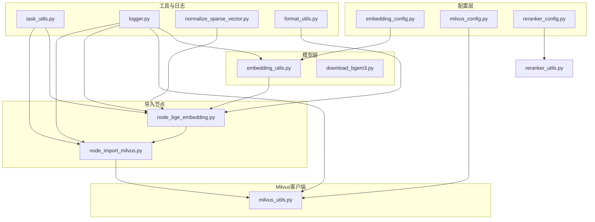
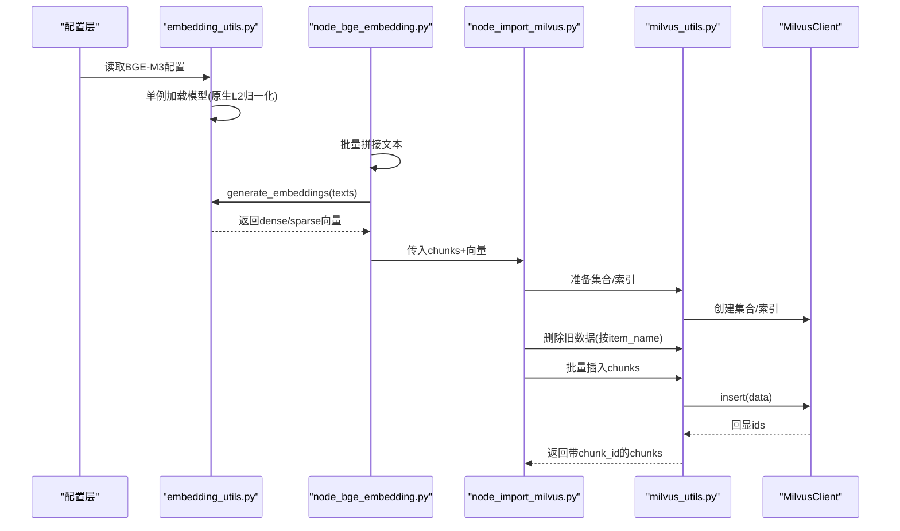
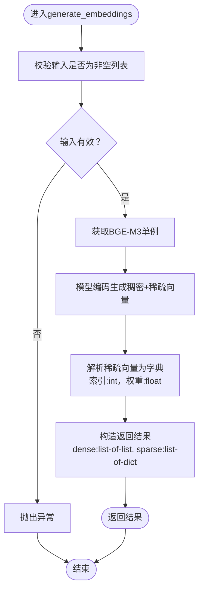
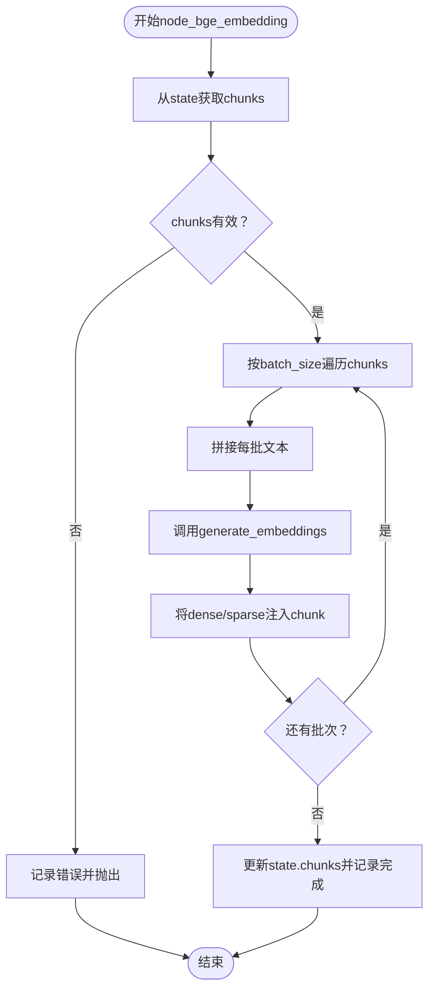
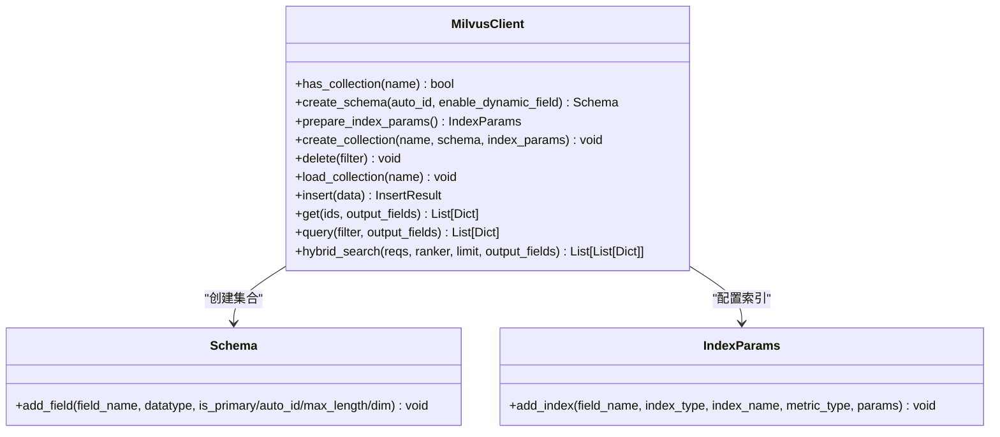
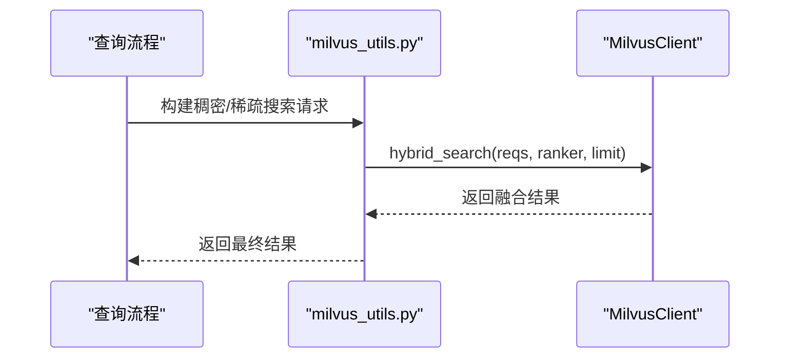
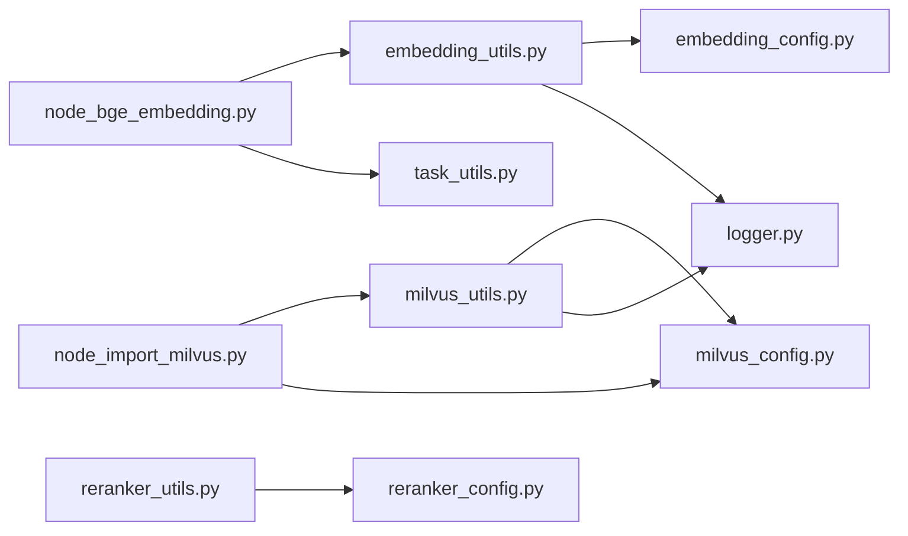

# 向量生成与存储

<cite>
**本文引用的文件**
- [embedding_config.py](file://app/conf/embedding_config.py)
- [embedding_utils.py](file://app/lm/embedding_utils.py)
- [node_bge_embedding.py](file://app/import_process/agent/nodes/node_bge_embedding.py)
- [normalize_sparse_vector.py](file://app/utils/normalize_sparse_vector.py)
- [download_bgem3.py](file://app/tool/download_bgem3.py)
- [milvus_utils.py](file://app/clients/milvus_utils.py)
- [milvus_config.py](file://app/conf/milvus_config.py)
- [node_import_milvus.py](file://app/import_process/agent/nodes/node_import_milvus.py)
- [task_utils.py](file://app/utils/task_utils.py)
- [logger.py](file://app/core/logger.py)
- [reranker_config.py](file://app/conf/reranker_config.py)
- [reranker_utils.py](file://app/lm/reranker_utils.py)
- [format_utils.py](file://app/utils/format_utils.py)
- [pyproject.toml](file://pyproject.toml)
</cite>

## 目录
1. [简介](#简介)
2. [项目结构](#项目结构)
3. [核心组件](#核心组件)
4. [架构总览](#架构总览)
5. [详细组件分析](#详细组件分析)
6. [依赖分析](#依赖分析)
7. [性能考量](#性能考量)
8. [故障排查指南](#故障排查指南)
9. [结论](#结论)
10. [附录](#附录)

## 简介
本文件面向向量生成与存储模块，围绕以下目标展开：
- 深入解释BGE-M3模型的使用与配置，包括模型加载、推理过程与向量维度
- 说明向量生成的批处理策略与内存管理机制
- 解释向量归一化处理与稀疏向量优化技术
- 文档化Milvus向量数据库的存储策略，包括集合创建、索引配置与查询优化
- 说明向量导入的并发处理与错误恢复机制
- 提供向量存储性能优化建议与容量规划指南

## 项目结构
该模块位于导入流程的LangGraph工作流中，主要涉及以下文件：
- 配置层：embedding_config.py、milvus_config.py、reranker_config.py
- 模型层：embedding_utils.py、download_bgem3.py
- 导入节点：node_bge_embedding.py、node_import_milvus.py
- Milvus客户端：milvus_utils.py
- 工具与日志：task_utils.py、logger.py、normalize_sparse_vector.py、format_utils.py
- 依赖声明：pyproject.toml

图表来源
- [embedding_config.py:1-24](file://app/conf/embedding_config.py#L1-L24)
- [milvus_config.py:1-26](file://app/conf/milvus_config.py#L1-L26)
- [reranker_config.py:1-21](file://app/conf/reranker_config.py#L1-L21)
- [embedding_utils.py:1-108](file://app/lm/embedding_utils.py#L1-L108)
- [download_bgem3.py:1-5](file://app/tool/download_bgem3.py#L1-L5)
- [node_bge_embedding.py:1-84](file://app/import_process/agent/nodes/node_bge_embedding.py#L1-L84)
- [node_import_milvus.py:1-213](file://app/import_process/agent/nodes/node_import_milvus.py#L1-L213)
- [milvus_utils.py:1-198](file://app/clients/milvus_utils.py#L1-L198)
- [task_utils.py:1-187](file://app/utils/task_utils.py#L1-L187)
- [logger.py:1-109](file://app/core/logger.py#L1-L109)
- [normalize_sparse_vector.py:1-23](file://app/utils/normalize_sparse_vector.py#L1-L23)
- [format_utils.py:1-56](file://app/utils/format_utils.py#L1-L56)

章节来源
- [embedding_config.py:1-24](file://app/conf/embedding_config.py#L1-L24)
- [milvus_config.py:1-26](file://app/conf/milvus_config.py#L1-L26)
- [reranker_config.py:1-21](file://app/conf/reranker_config.py#L1-L21)
- [embedding_utils.py:1-108](file://app/lm/embedding_utils.py#L1-L108)
- [node_bge_embedding.py:1-84](file://app/import_process/agent/nodes/node_bge_embedding.py#L1-L84)
- [node_import_milvus.py:1-213](file://app/import_process/agent/nodes/node_import_milvus.py#L1-L213)
- [milvus_utils.py:1-198](file://app/clients/milvus_utils.py#L1-L198)
- [task_utils.py:1-187](file://app/utils/task_utils.py#L1-L187)
- [logger.py:1-109](file://app/core/logger.py#L1-L109)
- [normalize_sparse_vector.py:1-23](file://app/utils/normalize_sparse_vector.py#L1-L23)
- [format_utils.py:1-56](file://app/utils/format_utils.py#L1-L56)
- [pyproject.toml:1-36](file://pyproject.toml#L1-L36)

## 核心组件
- BGE-M3嵌入生成器：负责加载模型、生成稠密+稀疏混合向量，并进行格式适配与归一化
- Milvus客户端：负责集合创建、索引配置、数据插入与混合检索
- 导入节点：在LangGraph中编排向量化与入库流程
- 任务与日志：提供任务状态跟踪与全链路日志记录
- 稀疏向量归一化工具：提供独立的稀疏向量L2归一化能力

章节来源
- [embedding_utils.py:1-108](file://app/lm/embedding_utils.py#L1-L108)
- [milvus_utils.py:1-198](file://app/clients/milvus_utils.py#L1-L198)
- [node_bge_embedding.py:1-84](file://app/import_process/agent/nodes/node_bge_embedding.py#L1-L84)
- [node_import_milvus.py:1-213](file://app/import_process/agent/nodes/node_import_milvus.py#L1-L213)
- [task_utils.py:1-187](file://app/utils/task_utils.py#L1-L187)
- [logger.py:1-109](file://app/core/logger.py#L1-L109)
- [normalize_sparse_vector.py:1-23](file://app/utils/normalize_sparse_vector.py#L1-L23)

## 架构总览
向量生成与存储的整体流程如下：
- 配置加载：从环境变量读取BGE-M3与Milvus配置
- 模型初始化：单例模式加载BGE-M3，开启原生L2归一化
- 文本批处理：将chunks按固定批次拼接为文本列表
- 向量生成：调用模型生成稠密+稀疏混合向量，解析稀疏格式
- Milvus准备：创建集合、配置索引（HNSW/COSINE、SPARSE_INVERTED_INDEX/IP）
- 数据入库：按item_name幂等删除旧数据，批量插入新数据
- 混合检索：构建稠密/稀疏搜索请求，使用WeightedRanker融合

图表来源
- [embedding_config.py:1-24](file://app/conf/embedding_config.py#L1-L24)
- [embedding_utils.py:1-108](file://app/lm/embedding_utils.py#L1-L108)
- [node_bge_embedding.py:1-84](file://app/import_process/agent/nodes/node_bge_embedding.py#L1-L84)
- [node_import_milvus.py:1-213](file://app/import_process/agent/nodes/node_import_milvus.py#L1-L213)
- [milvus_utils.py:1-198](file://app/clients/milvus_utils.py#L1-L198)

## 详细组件分析

### BGE-M3嵌入生成器
- 模型加载与单例：通过全局变量缓存BGEM3EmbeddingFunction实例，避免重复初始化
- 配置来源：从embedding_config读取模型路径、设备、半精度开关
- 归一化策略：启用normalize_embeddings=True，使稠密与稀疏向量均进行L2归一化，适配Milvus IP/COSINE检索
- 输入输出：接收文本列表，返回包含dense与sparse字段的结果；稀疏向量解析为字典，键为维度索引，值为归一化权重
- 类型适配：将numpy类型转换为Python原生类型，保证JSON序列化与Milvus入库兼容
- 错误处理：捕获异常并向上抛出，交由调用方处理重试/降级

图表来源
- [embedding_utils.py:51-96](file://app/lm/embedding_utils.py#L51-L96)

章节来源
- [embedding_config.py:1-24](file://app/conf/embedding_config.py#L1-L24)
- [embedding_utils.py:1-108](file://app/lm/embedding_utils.py#L1-L108)

### 导入节点：向量生成
- 批处理策略：按固定batch_size（示例为5）对chunks进行滑窗处理，减少单次模型调用开销
- 文本拼接：将item_name与content组合为统一文本，遵循“核心词前置”原则
- 结果注入：将dense与sparse向量分别写入chunk，形成可入库数据结构
- 任务状态：通过task_utils记录运行/完成状态，配合前端进度展示

图表来源
- [node_bge_embedding.py:10-84](file://app/import_process/agent/nodes/node_bge_embedding.py#L10-L84)
- [task_utils.py:68-109](file://app/utils/task_utils.py#L68-L109)

章节来源
- [node_bge_embedding.py:1-84](file://app/import_process/agent/nodes/node_bge_embedding.py#L1-L84)
- [task_utils.py:1-187](file://app/utils/task_utils.py#L1-L187)

### Milvus客户端与集合管理
- 客户端单例：get_milvus_client提供全局唯一连接，避免重复创建
- 集合创建：当集合不存在时，创建schema并添加字段（含INT64主键、VARCHAR字段、FLOAT_VECTOR与SPARSE_FLOAT_VECTOR）
- 索引配置：
  - 稠密向量：HNSW + COSINE，参数M与efConstruction随规模调整
  - 稀疏向量：SPARSE_INVERTED_INDEX + IP，采用DAAT_MAXSCORE算法
- 数据插入：支持批量插入，回显ids并写回chunk
- 幂等清理：按item_name删除旧数据，确保同一文档的多次导入一致性

图表来源
- [node_import_milvus.py:18-78](file://app/import_process/agent/nodes/node_import_milvus.py#L18-L78)
- [milvus_utils.py:10-31](file://app/clients/milvus_utils.py#L10-L31)

章节来源
- [milvus_config.py:1-26](file://app/conf/milvus_config.py#L1-L26)
- [milvus_utils.py:1-198](file://app/clients/milvus_utils.py#L1-L198)
- [node_import_milvus.py:1-213](file://app/import_process/agent/nodes/node_import_milvus.py#L1-L213)

### 混合检索与查询优化
- 请求构建：分别针对稠密与稀疏向量构建AnnSearchRequest，metric_type分别为COSINE与IP
- 融合策略：使用WeightedRanker对两路结果进行加权融合，支持归一化评分
- 查询回退：优先使用get主键查询，失败则回退至filter查询，兼顾性能与稳定性

图表来源
- [milvus_utils.py:117-198](file://app/clients/milvus_utils.py#L117-L198)

章节来源
- [milvus_utils.py:1-198](file://app/clients/milvus_utils.py#L1-L198)

### 稀疏向量归一化与格式适配
- 独立归一化：normalize_sparse_vector对稀疏向量按非零维度计算L2范数并归一化
- 类型转换：确保字典键为Python int、值为Python float，满足JSON序列化与Milvus入库要求
- 与模型归一化协同：BGE-M3已开启原生L2归一化，此处提供补充能力

章节来源
- [normalize_sparse_vector.py:1-23](file://app/utils/normalize_sparse_vector.py#L1-L23)
- [embedding_utils.py:86-90](file://app/lm/embedding_utils.py#L86-L90)

### 日志与任务状态
- 日志：基于loguru，支持控制台与文件双输出，自动定位业务调用位置
- 任务：维护任务运行/完成列表与状态，支持SSE推送进度

章节来源
- [logger.py:1-109](file://app/core/logger.py#L1-L109)
- [task_utils.py:1-187](file://app/utils/task_utils.py#L1-L187)

## 依赖分析
- 模块间耦合
  - embedding_utils依赖embedding_config与logger
  - node_bge_embedding依赖embedding_utils与task_utils
  - node_import_milvus依赖milvus_utils、milvus_config与escape_milvus_string_utils
  - milvus_utils依赖milvus_config与logger
- 外部依赖
  - PyMilvus、pymilvus-model、FlagEmbedding、modelscope等

图表来源
- [embedding_utils.py:1-108](file://app/lm/embedding_utils.py#L1-L108)
- [node_bge_embedding.py:1-84](file://app/import_process/agent/nodes/node_bge_embedding.py#L1-L84)
- [node_import_milvus.py:1-213](file://app/import_process/agent/nodes/node_import_milvus.py#L1-L213)
- [milvus_utils.py:1-198](file://app/clients/milvus_utils.py#L1-L198)
- [reranker_utils.py:1-14](file://app/lm/reranker_utils.py#L1-L14)
- [reranker_config.py:1-21](file://app/conf/reranker_config.py#L1-L21)
- [embedding_config.py:1-24](file://app/conf/embedding_config.py#L1-L24)
- [milvus_config.py:1-26](file://app/conf/milvus_config.py#L1-L26)
- [logger.py:1-109](file://app/core/logger.py#L1-L109)
- [task_utils.py:1-187](file://app/utils/task_utils.py#L1-L187)

章节来源
- [pyproject.toml:1-36](file://pyproject.toml#L1-L36)
- [embedding_utils.py:1-108](file://app/lm/embedding_utils.py#L1-L108)
- [node_bge_embedding.py:1-84](file://app/import_process/agent/nodes/node_bge_embedding.py#L1-L84)
- [node_import_milvus.py:1-213](file://app/import_process/agent/nodes/node_import_milvus.py#L1-L213)
- [milvus_utils.py:1-198](file://app/clients/milvus_utils.py#L1-L198)
- [reranker_utils.py:1-14](file://app/lm/reranker_utils.py#L1-L14)
- [reranker_config.py:1-21](file://app/conf/reranker_config.py#L1-L21)
- [embedding_config.py:1-24](file://app/conf/embedding_config.py#L1-L24)
- [milvus_config.py:1-26](file://app/conf/milvus_config.py#L1-L26)
- [logger.py:1-109](file://app/core/logger.py#L1-L109)
- [task_utils.py:1-187](file://app/utils/task_utils.py#L1-L187)

## 性能考量
- 模型加载与缓存
  - 单例模式避免重复初始化，显著降低延迟与内存占用
- 批处理策略
  - 在node_bge_embedding中按固定batch_size聚合文本，减少模型调用次数
  - 建议根据GPU显存与上下文窗口动态调整batch_size
- 稀疏向量优化
  - 使用SPARSE_INVERTED_INDEX与DAAT_MAXSCORE，仅计算可能高分的向量，跳过大量零元素
  - 若稀疏向量维度极高，可结合normalize_sparse_vector进行预处理
- 索引参数调优
  - HNSW的M与efConstruction随数据规模线性增长，建议按数据量级配置（参考注释中的经验参数）
  - COSINE与IP分别适配稠密与稀疏向量，避免不必要的距离变换
- 内存管理
  - 将numpy数组转为Python原生类型，减少序列化与传输成本
  - 控制批大小与并发度，避免峰值内存过高
- 混合检索
  - WeightedRanker融合时可开启归一化评分，平衡两路得分量级差异

[本节为通用性能建议，不直接分析具体文件]

## 故障排查指南
- 模型初始化失败
  - 检查BGE_M3_PATH/BGE_M3/BGE_DEVICE/BGE_FP16配置是否正确
  - 确认网络可达与磁盘空间充足
- Milvus连接失败
  - 检查MILVUS_URL、CHUNKS_COLLECTION等配置
  - 确认集合存在且索引已构建
- 向量生成异常
  - 确认输入为非空列表，避免空文本导致编码失败
  - 检查dtype转换与JSON序列化兼容性
- 插入失败
  - 核对字段类型与维度（稠密向量维度为1024）
  - 检查item_name过滤表达式的转义与合法性
- 混合检索无结果
  - 确认metric_type与索引类型匹配（稠密COSINE、稀疏IP）
  - 调整融合权重与limit参数

章节来源
- [embedding_utils.py:36-48](file://app/lm/embedding_utils.py#L36-L48)
- [milvus_utils.py:20-31](file://app/clients/milvus_utils.py#L20-L31)
- [node_import_milvus.py:88-91](file://app/import_process/agent/nodes/node_import_milvus.py#L88-L91)
- [milvus_utils.py:117-155](file://app/clients/milvus_utils.py#L117-L155)

## 结论
本模块通过BGE-M3原生L2归一化与稀疏向量技术，结合Milvus的混合检索与索引策略，实现了高效、稳定的向量生成与存储方案。通过单例模型、批处理与内存适配等手段，兼顾了吞吐与资源利用率。建议在生产环境中持续监控索引参数与批大小，并结合业务数据规模进行容量规划与性能调优。

[本节为总结性内容，不直接分析具体文件]

## 附录

### 环境变量与配置项
- BGE-M3相关
  - BGE_M3_PATH：本地模型路径或URL
  - BGE_M3：模型仓库标识
  - BGE_DEVICE：运行设备（cuda:0/cpu）
  - BGE_FP16：是否开启半精度
- Milvus相关
  - MILVUS_URL：服务端连接地址
  - CHUNKS_COLLECTION：切片集合名称
  - ENTITY_NAME_COLLECTION：预留集合
  - ITEM_NAME_COLLECTION：实体名称集合

章节来源
- [embedding_config.py:18-24](file://app/conf/embedding_config.py#L18-L24)
- [milvus_config.py:21-26](file://app/conf/milvus_config.py#L21-L26)

### 依赖版本要点
- PyMilvus与pymilvus-model：提供向量检索与嵌入函数
- FlagEmbedding：提供重排序模型
- modelscope：提供模型下载能力

章节来源
- [pyproject.toml:9-35](file://pyproject.toml#L9-L35)