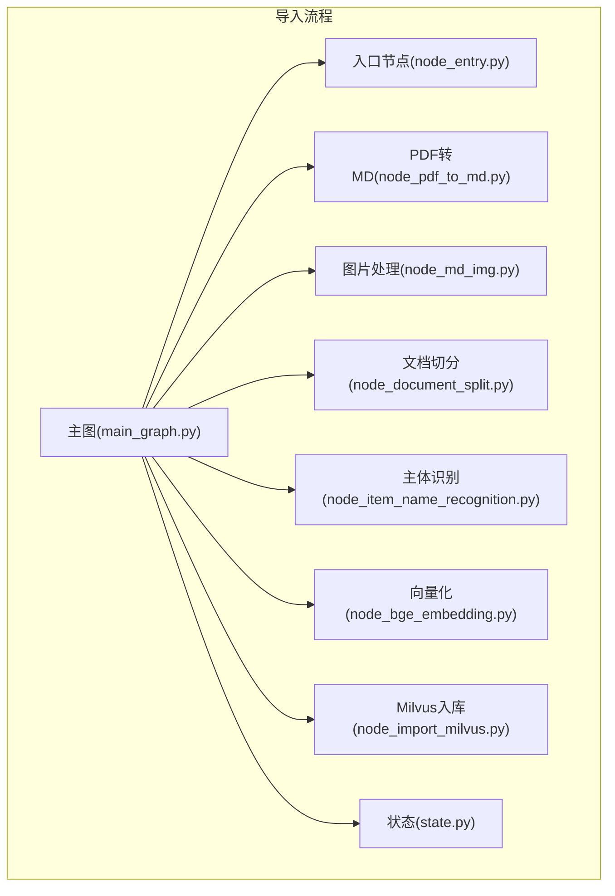
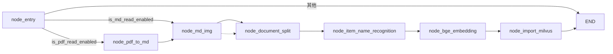
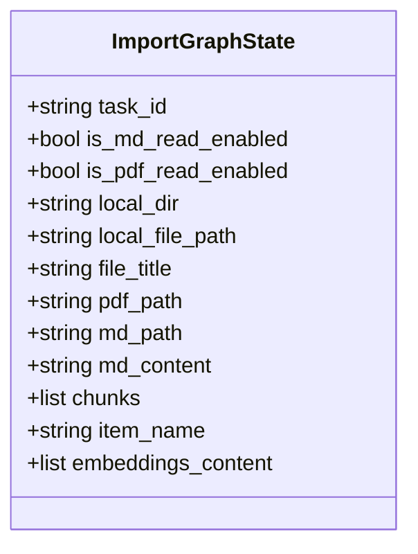
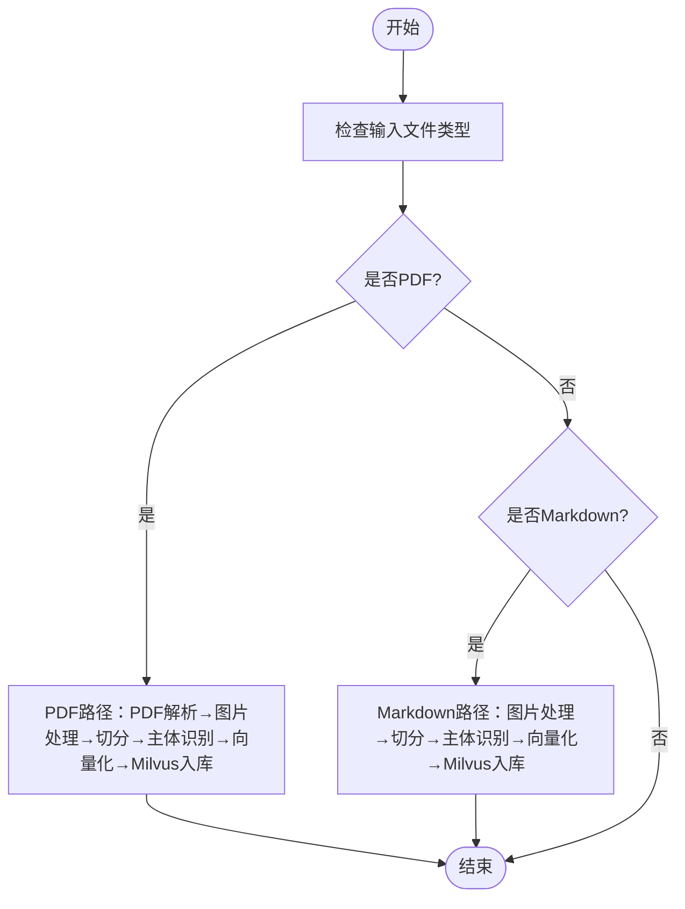
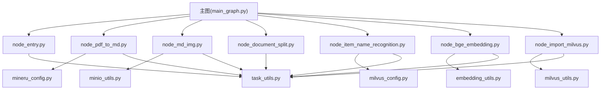

# 导入工作流架构

<cite>
**本文引用的文件**
- [main_graph.py](file://app/import_process/agent/main_graph.py)
- [state.py](file://app/import_process/agent/state.py)
- [node_entry.py](file://app/import_process/agent/nodes/node_entry.py)
- [node_pdf_to_md.py](file://app/import_process/agent/nodes/node_pdf_to_md.py)
- [node_md_img.py](file://app/import_process/agent/nodes/node_md_img.py)
- [node_document_split.py](file://app/import_process/agent/nodes/node_document_split.py)
- [node_item_name_recognition.py](file://app/import_process/agent/nodes/node_item_name_recognition.py)
- [node_bge_embedding.py](file://app/import_process/agent/nodes/node_bge_embedding.py)
- [node_import_milvus.py](file://app/import_process/agent/nodes/node_import_milvus.py)
- [task_utils.py](file://app/utils/task_utils.py)
- [milvus_config.py](file://app/conf/milvus_config.py)
- [mineru_config.py](file://app/conf/mineru_config.py)
- [embedding_utils.py](file://app/lm/embedding_utils.py)
- [milvus_utils.py](file://app/clients/milvus_utils.py)
- [minio_utils.py](file://app/clients/minio_utils.py)
- [test_import_main_graph.py](file://app/test/test_import_main_graph.py)
</cite>

## 目录
1. [简介](#简介)
2. [项目结构](#项目结构)
3. [核心组件](#核心组件)
4. [架构总览](#架构总览)
5. [详细组件分析](#详细组件分析)
6. [依赖关系分析](#依赖关系分析)
7. [性能考量](#性能考量)
8. [故障排查指南](#故障排查指南)
9. [结论](#结论)
10. [附录](#附录)

## 简介
本文件面向导入工作流（LangGraph）的架构与实现，系统化阐述主图结构、节点定义、状态管理、节点间通信、执行流程（含并行/条件分支/异常处理）、调试与监控方法以及性能优化策略。导入工作流负责从PDF/Markdown文件出发，完成解析、图片处理、切片、主体识别、向量化、Milvus入库等链路，最终形成可检索的知识库。

## 项目结构
导入工作流位于应用层的导入流程模块中，采用“状态图 + 节点函数”的分层组织方式：
- 主图与路由：在主图文件中定义节点、边与条件路由，编译为可执行图。
- 状态模型：以TypedDict定义统一状态结构，提供默认值工厂与深拷贝构造。
- 节点实现：每个节点为纯函数，接收/返回状态，负责具体业务处理。
- 工具与配置：任务状态推送、向量模型、Milvus/MinIO客户端、配置读取等。

图表来源
- [main_graph.py:19-65](file://app/import_process/agent/main_graph.py#L19-L65)
- [state.py:5-91](file://app/import_process/agent/state.py#L5-L91)

章节来源
- [main_graph.py:1-134](file://app/import_process/agent/main_graph.py#L1-L134)
- [state.py:1-99](file://app/import_process/agent/state.py#L1-L99)

## 核心组件
- 主图与路由
  - 使用LangGraph的StateGraph定义节点与边，设置入口节点，定义条件边以根据状态选择后续路径。
  - 条件路由基于状态字段判断，决定进入PDF解析或Markdown图片处理路径。
- 状态模型
  - ImportGraphState以TypedDict声明，包含任务控制、路径、内容、向量与数据库相关字段。
  - 提供默认状态工厂与深拷贝构造，便于测试与隔离。
- 节点函数
  - 每个节点为纯函数，接收状态并返回状态，负责日志、任务状态上报、异常处理与数据产出。
- 工具与配置
  - 任务状态推送：通过内存态任务追踪与SSE推送，实现前端进度可视化。
  - 向量模型：BGE-M3单例封装，支持稠密/稀疏向量生成。
  - 客户端：Milvus/MinIO客户端单例，统一连接与操作。

章节来源
- [main_graph.py:19-65](file://app/import_process/agent/main_graph.py#L19-L65)
- [state.py:44-91](file://app/import_process/agent/state.py#L44-L91)
- [task_utils.py:68-109](file://app/utils/task_utils.py#L68-L109)
- [embedding_utils.py:8-48](file://app/lm/embedding_utils.py#L8-L48)
- [milvus_utils.py:10-31](file://app/clients/milvus_utils.py#L10-L31)
- [minio_utils.py:13-43](file://app/clients/minio_utils.py#L13-L43)

## 架构总览
导入工作流采用“入口决策 + 两条并行路径 + 顺序管线”的结构：
- 入口节点根据输入文件类型决定后续路径；
- PDF路径：PDF解析 → 图片处理 → 文档切分 → 主体识别 → 向量化 → Milvus入库；
- Markdown路径：图片处理 → 文档切分 → 主体识别 → 向量化 → Milvus入库；
- 条件边确保仅执行一条主路径，静态边串联后续步骤。

图表来源
- [main_graph.py:30-62](file://app/import_process/agent/main_graph.py#L30-L62)

章节来源
- [main_graph.py:30-62](file://app/import_process/agent/main_graph.py#L30-L62)

## 详细组件分析

### 状态管理模式
- 数据结构
  - ImportGraphState包含任务ID、流程控制标记、路径字段、内容字段、向量字段与数据库相关字段。
  - 字段覆盖默认值工厂与深拷贝构造，避免全局污染。
- 状态转换
  - 节点函数通过读取/写入状态字段实现转换，如设置文件类型标记、路径、内容与向量。
  - 条件路由根据状态字段选择后续节点。
- 持久化机制
  - 中间产物以状态字段与本地文件形式留存（如切片备份文件），最终Milvus入库持久化向量与元数据。

图表来源
- [state.py:5-63](file://app/import_process/agent/state.py#L5-L63)

章节来源
- [state.py:5-91](file://app/import_process/agent/state.py#L5-L91)

### 节点间通信机制
- 消息传递
  - LangGraph以状态为消息在节点间传递，节点函数通过返回状态影响下一节点输入。
- 状态共享
  - 公共字段（如任务ID、路径、内容）在节点间共享，避免重复计算。
- 错误传播
  - 节点内捕获异常并向上抛出，触发工作流终止；任务状态与日志记录便于定位。

章节来源
- [node_entry.py:26-59](file://app/import_process/agent/nodes/node_entry.py#L26-L59)
- [node_pdf_to_md.py:277-305](file://app/import_process/agent/nodes/node_pdf_to_md.py#L277-L305)
- [node_document_split.py:291-300](file://app/import_process/agent/nodes/node_document_split.py#L291-L300)
- [node_item_name_recognition.py:279-287](file://app/import_process/agent/nodes/node_item_name_recognition.py#L279-L287)
- [node_bge_embedding.py:80-84](file://app/import_process/agent/nodes/node_bge_embedding.py#L80-L84)
- [node_import_milvus.py:141-149](file://app/import_process/agent/nodes/node_import_milvus.py#L141-L149)

### 执行流程与控制流
- 并行处理
  - 入口节点根据文件类型并行分流：PDF路径与Markdown路径互斥但各自内部顺序执行。
- 条件分支
  - route_after_entry依据状态字段选择下游节点，确保只执行一条主路径。
- 异常处理
  - 节点内try/except捕获异常并抛出，工作流终止；日志记录异常详情。

图表来源
- [main_graph.py:30-62](file://app/import_process/agent/main_graph.py#L30-L62)

章节来源
- [main_graph.py:30-62](file://app/import_process/agent/main_graph.py#L30-L62)

### 节点实现要点

#### 入口节点（node_entry）
- 输入：任务ID、输入文件路径
- 行为：校验输入、推断文件类型、设置类型标记与标题
- 输出：更新状态中的类型标记、路径与标题

章节来源
- [node_entry.py:10-59](file://app/import_process/agent/nodes/node_entry.py#L10-L59)

#### PDF转Markdown（node_pdf_to_md）
- 输入：PDF路径、输出目录
- 行为：校验路径 → 调用外部服务上传/轮询 → 下载解压 → 读取MD内容 → 写回状态
- 输出：MD路径与内容

章节来源
- [node_pdf_to_md.py:260-305](file://app/import_process/agent/nodes/node_pdf_to_md.py#L260-L305)

#### 图片处理（node_md_img）
- 输入：MD路径与内容、图片目录
- 行为：扫描图片 → 可选生成图片描述 → 上传MinIO → 替换MD中的图片链接 → 写回状态
- 输出：更新MD路径与内容

章节来源
- [node_md_img.py:310-358](file://app/import_process/agent/nodes/node_md_img.py#L310-L358)

#### 文档切分（node_document_split）
- 输入：MD内容
- 行为：按标题粗切 → 超长二次切分 → 合并短块 → 写回chunks与备份文件
- 输出：切片列表与本地备份

章节来源
- [node_document_split.py:262-300](file://app/import_process/agent/nodes/node_document_split.py#L262-L300)

#### 主体识别（node_item_name_recognition）
- 输入：切片列表与文件标题
- 行为：构建上下文 → LLM识别主体 → 生成稠密/稀疏向量 → Milvus入库
- 输出：状态中的主体名称与向量

章节来源
- [node_item_name_recognition.py:252-287](file://app/import_process/agent/nodes/node_item_name_recognition.py#L252-L287)

#### 向量化（node_bge_embedding）
- 输入：切片列表
- 行为：批量生成稠密/稀疏向量 → 写回状态
- 输出：带向量的切片

章节来源
- [node_bge_embedding.py:10-84](file://app/import_process/agent/nodes/node_bge_embedding.py#L10-L84)

#### Milvus入库（node_import_milvus）
- 输入：切片列表（含向量）
- 行为：创建集合 → 删除旧数据（幂等）→ 批量插入 → 回填主键
- 输出：带主键的切片

章节来源
- [node_import_milvus.py:114-149](file://app/import_process/agent/nodes/node_import_milvus.py#L114-L149)

## 依赖关系分析
- 组件耦合
  - 主图对节点函数强依赖，对状态模型弱依赖（仅类型约束）。
  - 节点对工具/配置依赖明确，职责单一，便于测试与替换。
- 外部依赖
  - 向量模型：BGE-M3（单例封装）
  - 数据库：Milvus（客户端单例）
  - 对象存储：MinIO（客户端单例）
  - 配置：.env读取，dataclass封装

图表来源
- [main_graph.py:8-14](file://app/import_process/agent/main_graph.py#L8-L14)
- [node_pdf_to_md.py:13](file://app/import_process/agent/nodes/node_pdf_to_md.py#L13)
- [node_item_name_recognition.py:13](file://app/import_process/agent/nodes/node_item_name_recognition.py#L13)
- [node_bge_embedding.py:6](file://app/import_process/agent/nodes/node_bge_embedding.py#L6)
- [node_import_milvus.py:11](file://app/import_process/agent/nodes/node_import_milvus.py#L11)
- [node_md_img.py:14](file://app/import_process/agent/nodes/node_md_img.py#L14)
- [task_utils.py:27](file://app/utils/task_utils.py#L27)

章节来源
- [main_graph.py:8-14](file://app/import_process/agent/main_graph.py#L8-L14)
- [milvus_config.py:14-26](file://app/conf/milvus_config.py#L14-L26)
- [mineru_config.py:13-20](file://app/conf/mineru_config.py#L13-L20)
- [embedding_utils.py:8-48](file://app/lm/embedding_utils.py#L8-L48)
- [milvus_utils.py:10-31](file://app/clients/milvus_utils.py#L10-L31)
- [minio_utils.py:13-43](file://app/clients/minio_utils.py#L13-L43)
- [task_utils.py:68-109](file://app/utils/task_utils.py#L68-L109)

## 性能考量
- 向量化批处理
  - 节点向量化采用批量处理，降低模型调用开销；建议根据GPU/CPU能力调整批大小。
- 索引与检索
  - Milvus为稠密/稀疏向量分别建立索引，合理设置索引参数以平衡召回与速度。
- I/O与缓存
  - 切片备份与中间文件落地，减少重复计算；注意磁盘空间与清理策略。
- 并发与限流
  - 外部服务调用（MinIO/大模型）建议配合限流与重试策略，避免抖动影响整体吞吐。
- 日志与可观测性
  - 任务状态推送与节点日志结合，便于定位瓶颈与异常。

## 故障排查指南
- 常见问题定位
  - 入口校验失败：检查输入路径与类型标记。
  - PDF解析异常：检查外部服务地址与凭据、网络代理与超时设置。
  - 向量化异常：检查文本内容与模型可用性。
  - Milvus入库异常：检查集合创建、索引参数与数据格式。
- 调试方法
  - 使用主图的流式执行与事件遍历，观察节点执行顺序与状态变化。
  - 查看任务状态推送队列，确认节点运行/完成列表。
- 单元测试
  - 各节点提供本地测试入口，可独立验证核心逻辑。

章节来源
- [test_import_main_graph.py:14-20](file://app/test/test_import_main_graph.py#L14-L20)
- [task_utils.py:174-187](file://app/utils/task_utils.py#L174-L187)

## 结论
导入工作流以LangGraph为核心，通过清晰的状态模型与节点职责划分，实现了从非结构化文件到向量知识库的自动化流水线。其条件路由与顺序管线兼顾灵活性与可维护性，配合任务状态推送与异常传播机制，具备良好的可观测性与可调试性。建议在生产环境中进一步完善批处理策略、索引参数与外部服务限流，以获得更优的吞吐与稳定性。

## 附录
- 执行示例
  - 主图编译后可通过流式迭代逐步输出节点执行状态，便于前端实时展示。
- 配置要点
  - 确保.env中包含外部服务与数据库连接参数，dataclass配置读取环境变量。