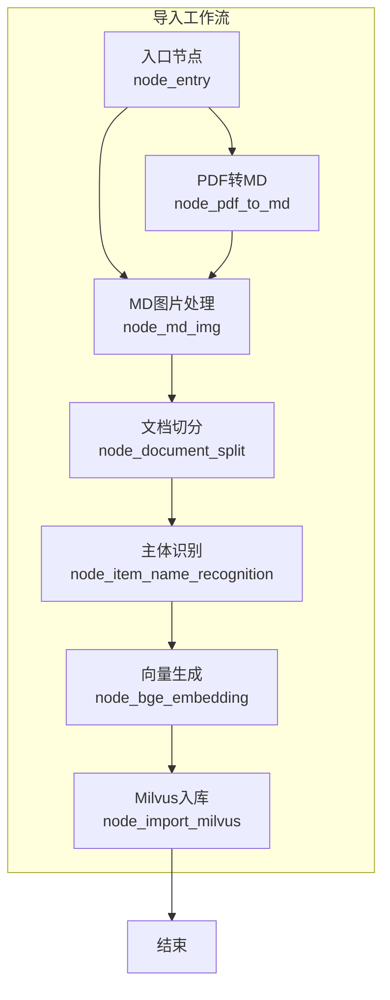
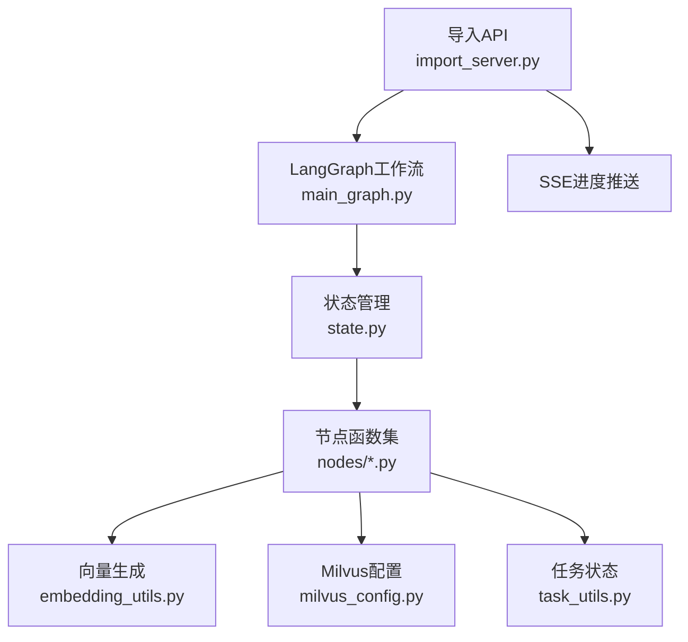
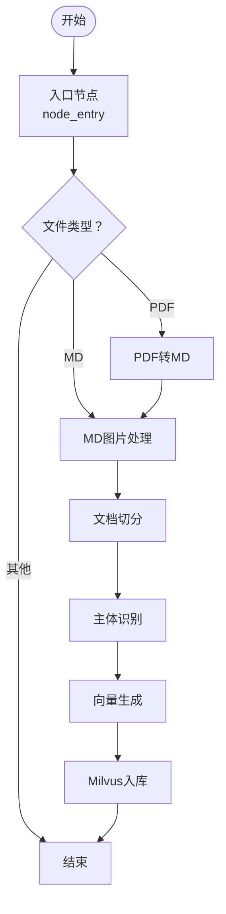
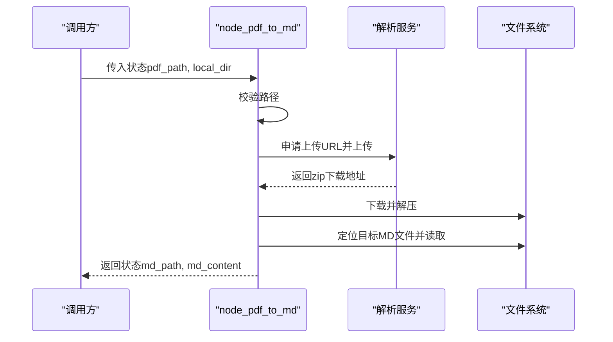
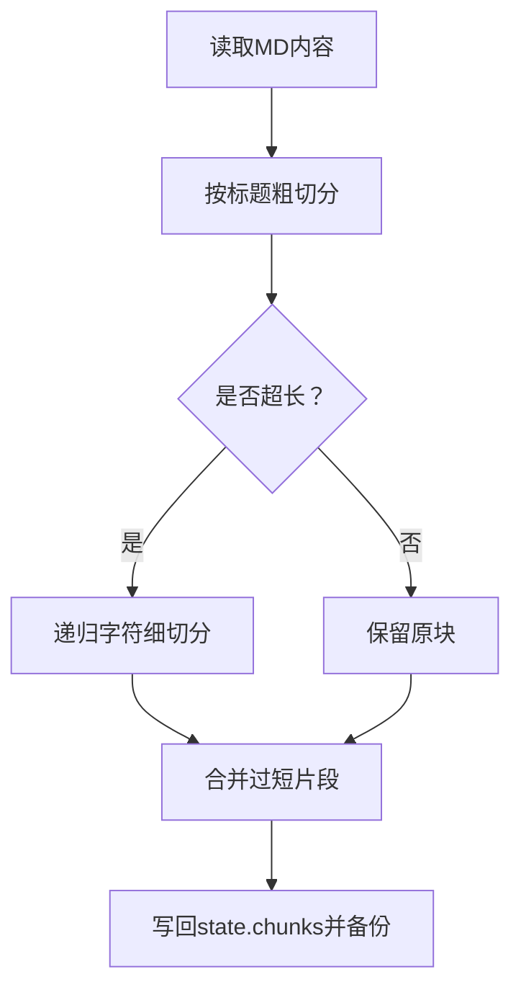
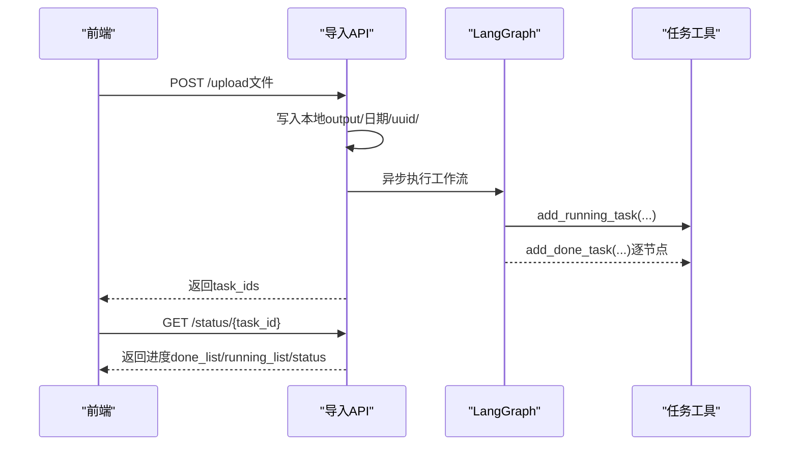
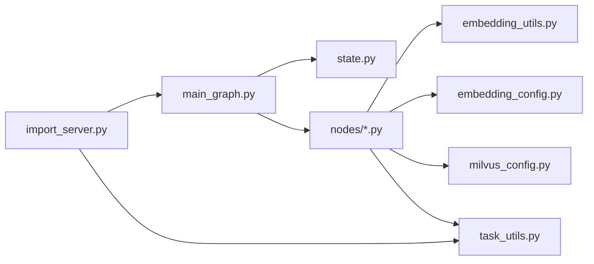

# 文档导入处理

<cite>
**本文引用的文件**
- [main_graph.py](file://app/import_process/agent/main_graph.py)
- [state.py](file://app/import_process/agent/state.py)
- [node_entry.py](file://app/import_process/agent/nodes/node_entry.py)
- [node_pdf_to_md.py](file://app/import_process/agent/nodes/node_pdf_to_md.py)
- [node_md_img.py](file://app/import_process/agent/nodes/node_md_img.py)
- [node_document_split.py](file://app/import_process/agent/nodes/node_document_split.py)
- [node_item_name_recognition.py](file://app/import_process/agent/nodes/node_item_name_recognition.py)
- [node_bge_embedding.py](file://app/import_process/agent/nodes/node_bge_embedding.py)
- [node_import_milvus.py](file://app/import_process/agent/nodes/node_import_milvus.py)
- [embedding_utils.py](file://app/lm/embedding_utils.py)
- [milvus_config.py](file://app/conf/milvus_config.py)
- [embedding_config.py](file://app/conf/embedding_config.py)
- [task_utils.py](file://app/utils/task_utils.py)
- [import_server.py](file://app/import_process/api/import_server.py)
- [test_import_main_graph.py](file://app/test/test_import_main_graph.py)
- [normalize_sparse_vector.py](file://app/utils/normalize_sparse_vector.py)
</cite>

## 目录
1. [简介](#简介)
2. [项目结构](#项目结构)
3. [核心组件](#核心组件)
4. [架构总览](#架构总览)
5. [详细组件分析](#详细组件分析)
6. [依赖分析](#依赖分析)
7. [性能考量](#性能考量)
8. [故障排除指南](#故障排除指南)
9. [结论](#结论)
10. [附录](#附录)

## 简介
本文件面向“文档导入处理系统”，围绕基于LangGraph的工作流进行系统化技术文档编写，重点涵盖以下方面：
- LangGraph工作流设计与节点通信机制、状态管理
- 文档解析流程：PDF到Markdown转换、图片提取与内容预处理
- 文档切分算法与产品名称识别机制
- 向量生成过程：BGE-M3模型使用与向量归一化
- Milvus向量数据库的存储策略与查询优化
- 导入流程的状态跟踪与错误处理
- 性能优化建议与故障排除指南

## 项目结构
导入流程位于 app/import_process/agent 目录下，采用“节点即函数”的设计，通过 StateGraph 组织节点之间的静态与条件边，形成端到端的导入工作流。

图表来源
- [main_graph.py:19-65](file://app/import_process/agent/main_graph.py#L19-L65)

章节来源
- [main_graph.py:19-65](file://app/import_process/agent/main_graph.py#L19-L65)

## 核心组件
- LangGraph工作流与状态
  - 工作流通过 StateGraph 定义节点与边，使用 ImportGraphState 作为统一状态载体，贯穿各节点读写。
  - 节点间通过状态字典传递数据，静态边保证顺序执行，条件边根据文件类型路由至不同路径。
- API层
  - 提供上传与状态查询接口，后台异步驱动LangGraph执行，结合任务工具进行进度上报。
- 向量与数据库
  - 使用BGE-M3生成稠密/稀疏混合向量，Milvus配置与索引参数在节点内动态创建集合并建立索引。

章节来源
- [state.py:5-91](file://app/import_process/agent/state.py#L5-L91)
- [main_graph.py:19-65](file://app/import_process/agent/main_graph.py#L19-L65)
- [import_server.py:53-91](file://app/import_process/api/import_server.py#L53-L91)

## 架构总览
系统采用“上传-解析-切分-识别-向量化-入库”的流水线式架构，结合任务状态管理与前端SSE推送，实现可视化进度跟踪。

图表来源
- [import_server.py:27-41](file://app/import_process/api/import_server.py#L27-L41)
- [main_graph.py:19-65](file://app/import_process/agent/main_graph.py#L19-L65)
- [embedding_utils.py:8-48](file://app/lm/embedding_utils.py#L8-L48)
- [milvus_config.py:14-26](file://app/conf/milvus_config.py#L14-L26)
- [task_utils.py:68-109](file://app/utils/task_utils.py#L68-L109)

## 详细组件分析

### LangGraph工作流与状态管理
- 节点注册与路由
  - 入口节点根据输入文件类型决定后续路径：PDF走“PDF转MD”，MD走“MD图片处理”，否则结束。
  - 静态边串联：PDF转MD → MD图片处理 → 文档切分 → 主体识别 → 向量生成 → Milvus入库。
- 状态结构
  - ImportGraphState包含任务ID、文件路径、解析产物（MD内容、切片、向量）、数据库写入准备等字段，支持默认初始化与覆盖。

图表来源
- [main_graph.py:30-62](file://app/import_process/agent/main_graph.py#L30-L62)
- [state.py:44-91](file://app/import_process/agent/state.py#L44-L91)

章节来源
- [main_graph.py:19-65](file://app/import_process/agent/main_graph.py#L19-L65)
- [state.py:5-91](file://app/import_process/agent/state.py#L5-L91)

### 节点：入口节点（node_entry）
- 功能要点
  - 校验输入路径，识别文件类型（PDF/MD），设置启用标志位与文件标题，记录任务状态。
- 错误处理
  - 输入缺失或类型不支持时记录错误并终止后续流程。

章节来源
- [node_entry.py:10-59](file://app/import_process/agent/nodes/node_entry.py#L10-L59)

### 节点：PDF转Markdown（node_pdf_to_md）
- 流程步骤
  - 路径校验 → 上传至解析服务并轮询结果 → 下载解压 → 定位目标MD文件 → 读取内容写回状态。
- 关键特性
  - 使用配置项与会话复用，超时与错误码处理，解压目录清理与重命名策略，确保输出稳定。
- 异常处理
  - 任一步骤失败均抛出异常，终止工作流。

图表来源
- [node_pdf_to_md.py:64-305](file://app/import_process/agent/nodes/node_pdf_to_md.py#L64-L305)

章节来源
- [node_pdf_to_md.py:64-305](file://app/import_process/agent/nodes/node_pdf_to_md.py#L64-L305)

### 节点：MD图片处理（node_md_img）
- 流程步骤
  - 读取MD与images目录 → 扫描使用中的图片 → 生成图片描述（可选）→ 上传至MinIO并替换MD中的图片链接 → 写回新MD路径与内容。
- 关键特性
  - 支持多种图片格式，上下文截取，限速与并发控制，批量清理与上传，替换规则正则化。
- 异常处理
  - 图片目录不存在时直接返回，避免无谓开销。

章节来源
- [node_md_img.py:73-358](file://app/import_process/agent/nodes/node_md_img.py#L73-L358)

### 节点：文档切分（node_document_split）
- 算法流程
  - 读取MD内容并规范化换行 → 基于标题层级粗切分 → 对超长段落二次细切分 → 合并过短片段 → 写回chunks并备份。
- 参数与策略
  - 默认最大长度与最小长度阈值，递归字符分割器与分隔符策略，父子标题一致性保障。
- 备份与可观测性
  - 将切片结果写入本地chunks.json，便于离线复盘与调试。

图表来源
- [node_document_split.py:34-300](file://app/import_process/agent/nodes/node_document_split.py#L34-L300)

章节来源
- [node_document_split.py:34-300](file://app/import_process/agent/nodes/node_document_split.py#L34-L300)

### 节点：主体识别（node_item_name_recognition）
- 功能要点
  - 基于前K个切片构建上下文，调用大模型识别主体名称（商品/产品名），回填至state与chunks。
- 向量生成与入库
  - 使用BGE-M3生成稠密/稀疏向量，创建集合并建立HNSW/COSINE与SPARSE_INVERTED_INDEX/IP索引，幂等删除旧数据后写入。
- 容错与兜底
  - 无结果时以文件标题兜底，确保后续流程可用。

章节来源
- [node_item_name_recognition.py:57-287](file://app/import_process/agent/nodes/node_item_name_recognition.py#L57-L287)

### 节点：向量生成（node_bge_embedding）
- 功能要点
  - 读取chunks，按批处理（批量大小=5）拼接“商品名+内容”文本，调用BGE-M3生成稠密/稀疏向量，写回state.chunks。
- 批处理与性能
  - 控制批次大小平衡上下文窗口与吞吐，避免单条过长。

章节来源
- [node_bge_embedding.py:10-84](file://app/import_process/agent/nodes/node_bge_embedding.py#L10-L84)

### 节点：Milvus入库（node_import_milvus）
- 功能要点
  - 动态创建切片集合（含主键、字段、索引），幂等删除同主体旧数据，批量插入并回填chunk_id。
- 索引策略
  - 稠密向量HNSW+COSINE，稀疏向量SPARSE_INVERTED_INDEX+IP，参数随规模自适应。

章节来源
- [node_import_milvus.py:18-149](file://app/import_process/agent/nodes/node_import_milvus.py#L18-L149)

### API与状态跟踪
- 接口能力
  - 上传文件并异步启动LangGraph工作流，提供任务状态查询接口，前端轮询获取进度。
- 任务状态
  - 通过内存态任务工具记录“运行中/已完成/状态”并通过SSE推送，支持中文节点名映射。

图表来源
- [import_server.py:98-166](file://app/import_process/api/import_server.py#L98-L166)
- [task_utils.py:68-109](file://app/utils/task_utils.py#L68-L109)

章节来源
- [import_server.py:53-91](file://app/import_process/api/import_server.py#L53-L91)
- [task_utils.py:25-50](file://app/utils/task_utils.py#L25-L50)

## 依赖分析
- 组件耦合
  - 节点函数依赖统一状态结构与任务工具，向量生成依赖embedding_utils与embedding_config，Milvus节点依赖milvus_config与客户端工具。
- 外部依赖
  - 解析服务（PDF→MD）、MinIO对象存储、Milvus向量数据库、大模型服务（用于主体识别与图片描述）。

图表来源
- [main_graph.py:19-65](file://app/import_process/agent/main_graph.py#L19-L65)
- [embedding_utils.py:8-48](file://app/lm/embedding_utils.py#L8-L48)
- [milvus_config.py:14-26](file://app/conf/milvus_config.py#L14-L26)
- [embedding_config.py:18-24](file://app/conf/embedding_config.py#L18-L24)
- [task_utils.py:68-109](file://app/utils/task_utils.py#L68-L109)
- [import_server.py:27-41](file://app/import_process/api/import_server.py#L27-L41)

章节来源
- [main_graph.py:19-65](file://app/import_process/agent/main_graph.py#L19-L65)
- [embedding_utils.py:8-48](file://app/lm/embedding_utils.py#L8-L48)
- [milvus_config.py:14-26](file://app/conf/milvus_config.py#L14-L26)
- [embedding_config.py:18-24](file://app/conf/embedding_config.py#L18-L24)
- [task_utils.py:68-109](file://app/utils/task_utils.py#L68-L109)
- [import_server.py:27-41](file://app/import_process/api/import_server.py#L27-L41)

## 性能考量
- 向量生成批处理
  - 通过批量大小控制上下文窗口与吞吐，建议根据GPU/CPU资源与上下文限制动态调整。
- 稀疏向量归一化
  - BGE-M3模型已内置L2归一化，适合Milvus IP检索；如需额外归一化，可参考工具函数。
- Milvus索引参数
  - HNSW参数（M、efConstruction）随数据规模线性增大，兼顾召回与性能；稀疏索引采用DAAT_MAXSCORE策略，提升查询效率。
- I/O与缓存
  - 切片结果本地备份便于离线复盘；MinIO上传与替换MD内容时注意幂等清理，避免冗余对象。

章节来源
- [node_bge_embedding.py:53-77](file://app/import_process/agent/nodes/node_bge_embedding.py#L53-L77)
- [embedding_utils.py:36-48](file://app/lm/embedding_utils.py#L36-L48)
- [normalize_sparse_vector.py:1-23](file://app/utils/normalize_sparse_vector.py#L1-L23)
- [node_import_milvus.py:49-71](file://app/import_process/agent/nodes/node_import_milvus.py#L49-L71)

## 故障排除指南
- PDF解析失败
  - 检查解析服务可用性、上传URL与轮询超时、zip下载与解压路径权限。
- MD图片处理异常
  - 确认images目录存在、图片格式受支持、MinIO桶与前缀配置正确、替换正则未误伤内容。
- 文档切分异常
  - 核查MD内容换行规范化、标题正则匹配、代码块状态切换逻辑。
- 主体识别与向量生成
  - 确认大模型可用、提示词模板存在、BGE-M3模型初始化成功、设备与半精度配置合理。
- Milvus入库失败
  - 检查集合创建与索引参数、幂等删除过滤条件、批量插入返回ID一致性。
- 任务状态与SSE
  - 核对任务ID映射、中文节点名配置、SSE推送队列与前端轮询频率。

章节来源
- [node_pdf_to_md.py:116-181](file://app/import_process/agent/nodes/node_pdf_to_md.py#L116-L181)
- [node_md_img.py:230-246](file://app/import_process/agent/nodes/node_md_img.py#L230-L246)
- [node_document_split.py:147-240](file://app/import_process/agent/nodes/node_document_split.py#L147-L240)
- [node_item_name_recognition.py:176-250](file://app/import_process/agent/nodes/node_item_name_recognition.py#L176-L250)
- [node_import_milvus.py:127-148](file://app/import_process/agent/nodes/node_import_milvus.py#L127-L148)
- [task_utils.py:174-180](file://app/utils/task_utils.py#L174-L180)

## 结论
本系统以LangGraph为核心，将PDF解析、MD图片处理、文档切分、主体识别、向量生成与Milvus入库串联为一条高可靠、可观测的导入流水线。通过统一状态管理、任务状态跟踪与SSE推送，实现了端到端的进度可视化；借助BGE-M3混合向量与Milvus索引策略，兼顾了检索质量与性能。建议在生产环境中结合资源规模动态调整批处理与索引参数，并完善监控告警与重试机制。

## 附录
- 单元测试与端到端验证
  - 提供LangGraph工作流测试脚本与节点级测试入口，便于快速定位问题与回归验证。

章节来源
- [test_import_main_graph.py:10-26](file://app/test/test_import_main_graph.py#L10-L26)