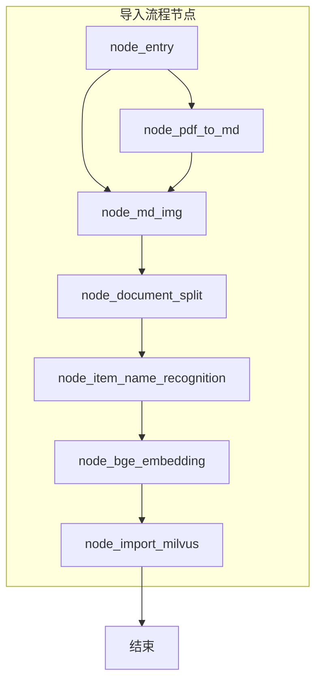
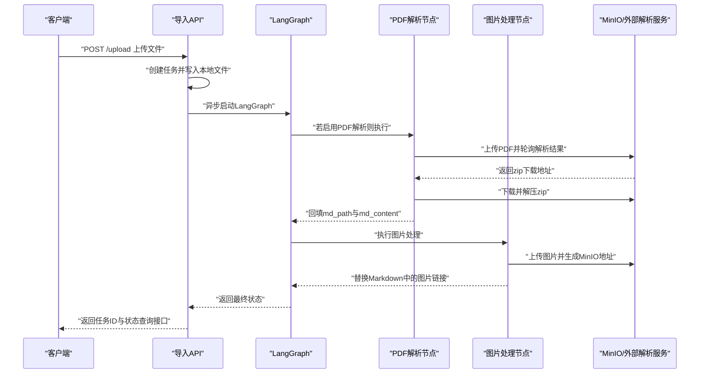
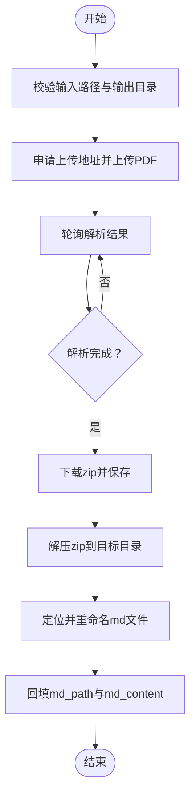
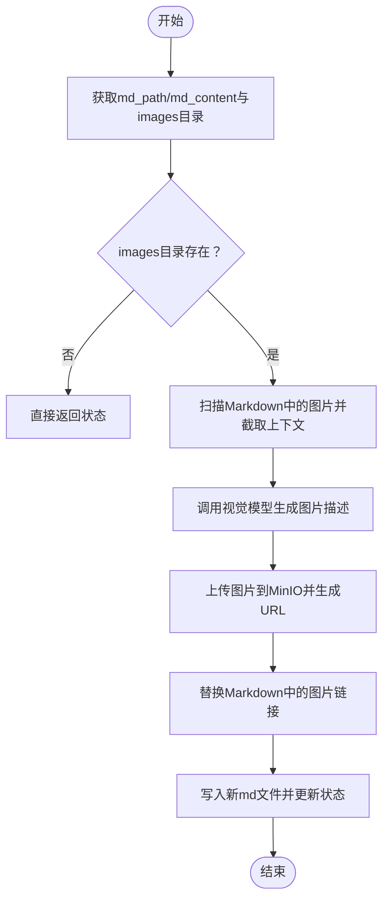
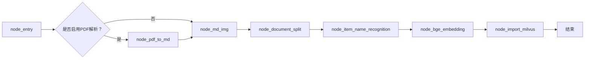
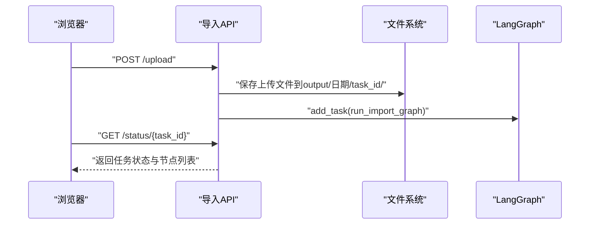
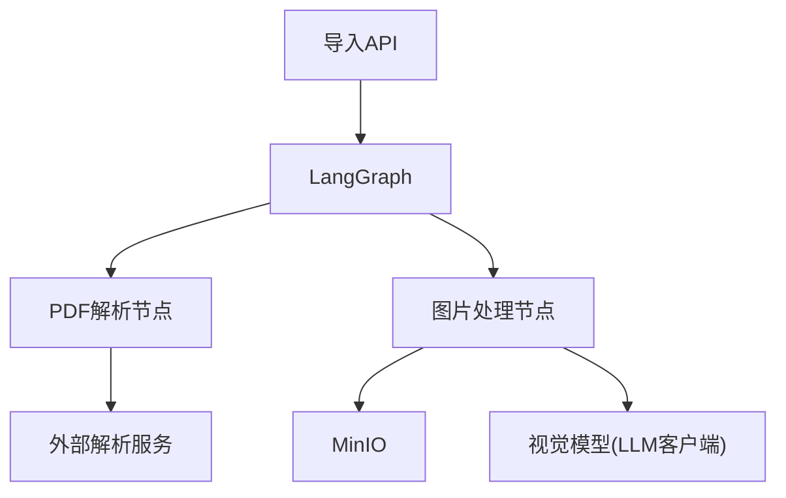

# 文档解析模块

<cite>
**本文引用的文件**
- [node_pdf_to_md.py](file://app/import_process/agent/nodes/node_pdf_to_md.py)
- [node_md_img.py](file://app/import_process/agent/nodes/node_md_img.py)
- [main_graph.py](file://app/import_process/agent/main_graph.py)
- [state.py](file://app/import_process/agent/state.py)
- [import_server.py](file://app/import_process/api/import_server.py)
</cite>

## 目录
1. [简介](#简介)
2. [项目结构](#项目结构)
3. [核心组件](#核心组件)
4. [架构总览](#架构总览)
5. [详细组件分析](#详细组件分析)
6. [依赖分析](#依赖分析)
7. [性能考虑](#性能考虑)
8. [故障排查指南](#故障排查指南)
9. [结论](#结论)
10. [附录](#附录)

## 简介
本模块负责将PDF文档转换为Markdown结构化文本，并对Markdown中的图片进行识别、下载与嵌入，形成可进一步切分、向量化与入库的高质量文档。系统通过LangGraph编排多个处理节点，形成“PDF解析→图片处理→文档切分→实体识别→向量化→Milvus入库”的完整流水线。

## 项目结构
- 导入流程采用LangGraph状态机，节点之间通过条件边与顺序边连接，形成端到端的处理链路。
- PDF解析节点对接外部服务完成解析并产出Markdown及图片资源。
- 图片处理节点扫描Markdown中的图片引用，调用视觉模型生成描述，上传至MinIO并替换Markdown中的图片链接。
- API层提供文件上传、任务状态查询等接口，支撑前端可视化与后台异步执行。

图表来源
- [main_graph.py:19-65](file://app/import_process/agent/main_graph.py#L19-L65)

章节来源
- [main_graph.py:19-65](file://app/import_process/agent/main_graph.py#L19-L65)

## 核心组件
- PDF到Markdown转换节点：负责路径校验、文件上传与轮询、结果下载与解压、最终Markdown路径与内容回填。
- Markdown图片处理节点：负责扫描图片、调用视觉模型生成描述、上传MinIO并替换Markdown中的图片链接。
- LangGraph主流程：根据输入文件类型路由到PDF解析或直接进入图片处理；随后串行执行切分、实体识别、向量化与入库。
- API服务：提供上传接口与任务状态查询接口，驱动整条导入链路。

章节来源
- [node_pdf_to_md.py:260-305](file://app/import_process/agent/nodes/node_pdf_to_md.py#L260-L305)
- [node_md_img.py:310-358](file://app/import_process/agent/nodes/node_md_img.py#L310-L358)
- [main_graph.py:19-65](file://app/import_process/agent/main_graph.py#L19-L65)
- [import_server.py:53-91](file://app/import_process/api/import_server.py#L53-L91)

## 架构总览
系统采用“API网关 + LangGraph编排 + 外部服务集成”的架构。API接收上传文件，创建任务并异步触发LangGraph；LangGraph根据输入类型选择PDF解析或直接图片处理；PDF解析完成后，图片处理节点对Markdown中的图片进行识别与替换；随后进入文档切分、实体识别、向量化与Milvus入库。

图表来源
- [import_server.py:98-138](file://app/import_process/api/import_server.py#L98-L138)
- [node_pdf_to_md.py:96-181](file://app/import_process/agent/nodes/node_pdf_to_md.py#L96-L181)
- [node_md_img.py:219-288](file://app/import_process/agent/nodes/node_md_img.py#L219-L288)

## 详细组件分析

### PDF到Markdown转换节点
- 路径校验：确保输入PDF存在，输出目录存在或创建默认输出目录。
- 上传与轮询：向外部解析服务申请上传地址，上传PDF并轮询获取解析结果，设置超时与重试策略。
- 下载与解压：下载解析产物zip，清理旧目录并解压，定位最终Markdown文件，重命名为与源PDF同名。
- 状态回填：将Markdown路径与内容写回状态，供后续节点使用。

图表来源
- [node_pdf_to_md.py:64-93](file://app/import_process/agent/nodes/node_pdf_to_md.py#L64-L93)
- [node_pdf_to_md.py:96-181](file://app/import_process/agent/nodes/node_pdf_to_md.py#L96-L181)
- [node_pdf_to_md.py:182-257](file://app/import_process/agent/nodes/node_pdf_to_md.py#L182-L257)
- [node_pdf_to_md.py:260-305](file://app/import_process/agent/nodes/node_pdf_to_md.py#L260-L305)

章节来源
- [node_pdf_to_md.py:64-93](file://app/import_process/agent/nodes/node_pdf_to_md.py#L64-L93)
- [node_pdf_to_md.py:96-181](file://app/import_process/agent/nodes/node_pdf_to_md.py#L96-L181)
- [node_pdf_to_md.py:182-257](file://app/import_process/agent/nodes/node_pdf_to_md.py#L182-L257)
- [node_pdf_to_md.py:260-305](file://app/import_process/agent/nodes/node_pdf_to_md.py#L260-L305)

### Markdown图片处理节点
- 内容提取：从状态中获取Markdown路径与内容，定位图片目录。
- 图片扫描：遍历图片目录，识别在Markdown中使用的图片，截取其上下文。
- 视觉模型摘要：对每张图片调用视觉模型生成描述，受速率限制保护。
- MinIO上传与替换：删除历史图片对象，上传新图片并生成访问URL，替换Markdown中的图片链接。
- 新文件落盘：将替换后的内容写入新文件，更新状态中的路径与内容。

图表来源
- [node_md_img.py:73-96](file://app/import_process/agent/nodes/node_md_img.py#L73-L96)
- [node_md_img.py:143-167](file://app/import_process/agent/nodes/node_md_img.py#L143-L167)
- [node_md_img.py:170-216](file://app/import_process/agent/nodes/node_md_img.py#L170-L216)
- [node_md_img.py:219-288](file://app/import_process/agent/nodes/node_md_img.py#L219-L288)
- [node_md_img.py:291-307](file://app/import_process/agent/nodes/node_md_img.py#L291-L307)
- [node_md_img.py:310-358](file://app/import_process/agent/nodes/node_md_img.py#L310-L358)

章节来源
- [node_md_img.py:73-96](file://app/import_process/agent/nodes/node_md_img.py#L73-L96)
- [node_md_img.py:143-167](file://app/import_process/agent/nodes/node_md_img.py#L143-L167)
- [node_md_img.py:170-216](file://app/import_process/agent/nodes/node_md_img.py#L170-L216)
- [node_md_img.py:219-288](file://app/import_process/agent/nodes/node_md_img.py#L219-L288)
- [node_md_img.py:291-307](file://app/import_process/agent/nodes/node_md_img.py#L291-L307)
- [node_md_img.py:310-358](file://app/import_process/agent/nodes/node_md_img.py#L310-L358)

### LangGraph主流程
- 节点定义：入口节点、PDF解析节点、图片处理节点、文档切分节点、实体识别节点、向量化节点、Milvus入库节点。
- 条件路由：根据状态中的开关决定进入PDF解析还是直接进入图片处理。
- 边定义：PDF解析完成后自动进入图片处理，之后按序串行执行后续节点。

图表来源
- [main_graph.py:19-65](file://app/import_process/agent/main_graph.py#L19-L65)

章节来源
- [main_graph.py:19-65](file://app/import_process/agent/main_graph.py#L19-L65)

### API服务
- 上传接口：接收文件，写入本地输出目录，异步启动LangGraph执行导入流程。
- 任务状态查询：前端轮询获取任务全局状态与已执行/运行中的节点列表。

图表来源
- [import_server.py:98-138](file://app/import_process/api/import_server.py#L98-L138)
- [import_server.py:146-166](file://app/import_process/api/import_server.py#L146-L166)

章节来源
- [import_server.py:98-138](file://app/import_process/api/import_server.py#L98-L138)
- [import_server.py:146-166](file://app/import_process/api/import_server.py#L146-L166)

## 依赖分析
- LangGraph状态机：统一管理各节点之间的流转与状态共享。
- 外部服务：PDF解析服务（通过上传地址与轮询接口获取结果）。
- MinIO：图片上传与访问URL生成。
- 视觉模型：图片描述生成（通过LLM客户端调用）。
- 速率限制：对视觉模型调用进行限速，避免触发配额限制。

图表来源
- [node_pdf_to_md.py:104-181](file://app/import_process/agent/nodes/node_pdf_to_md.py#L104-L181)
- [node_md_img.py:230-288](file://app/import_process/agent/nodes/node_md_img.py#L230-L288)

章节来源
- [node_pdf_to_md.py:104-181](file://app/import_process/agent/nodes/node_pdf_to_md.py#L104-L181)
- [node_md_img.py:230-288](file://app/import_process/agent/nodes/node_md_img.py#L230-L288)

## 性能考虑
- 并发与限速：图片摘要调用受速率限制保护，避免触发外部服务限流。
- 轮询策略：解析服务轮询间隔与超时时间按页数动态设计，平衡吞吐与延迟。
- IO优化：解压前清理旧目录，避免残留文件影响后续处理；下载完成后立即解析并写入新文件。
- 网络稳定性：上传阶段禁用代理，减少第三方存储服务器拒绝风险；轮询阶段对5xx错误进行重试。

章节来源
- [node_md_img.py:184-184](file://app/import_process/agent/nodes/node_md_img.py#L184-L184)
- [node_pdf_to_md.py:144-154](file://app/import_process/agent/nodes/node_pdf_to_md.py#L144-L154)
- [node_pdf_to_md.py:128-141](file://app/import_process/agent/nodes/node_pdf_to_md.py#L128-L141)
- [node_pdf_to_md.py:158-180](file://app/import_process/agent/nodes/node_pdf_to_md.py#L158-L180)

## 故障排查指南
- 输入路径错误：检查PDF路径与输出目录是否存在，必要时创建输出目录。
- 外部解析失败：确认解析服务可用性、鉴权信息与网络连通性；关注HTTP状态码与错误码。
- 上传失败：检查代理设置与请求头，避免PUT请求被严格校验拒绝；改用Session复用与禁用代理。
- 轮询超时：根据PDF页数适当延长超时时间；观察5xx错误并进行重试。
- 未找到Markdown：确认zip解压产物中存在.md文件，必要时检查文件名规则（原文件名或full.md）。
- 图片未使用：若图片未在Markdown中引用，将跳过处理；可在后续流程中补充上下文或重新生成摘要。
- MinIO上传失败：检查桶权限、对象前缀与endpoint配置；确认图片格式支持列表。

章节来源
- [node_pdf_to_md.py:75-93](file://app/import_process/agent/nodes/node_pdf_to_md.py#L75-L93)
- [node_pdf_to_md.py:116-121](file://app/import_process/agent/nodes/node_pdf_to_md.py#L116-L121)
- [node_pdf_to_md.py:130-141](file://app/import_process/agent/nodes/node_pdf_to_md.py#L130-L141)
- [node_pdf_to_md.py:150-180](file://app/import_process/agent/nodes/node_pdf_to_md.py#L150-L180)
- [node_pdf_to_md.py:223-225](file://app/import_process/agent/nodes/node_pdf_to_md.py#L223-L225)
- [node_md_img.py:156-164](file://app/import_process/agent/nodes/node_md_img.py#L156-L164)
- [node_md_img.py:264-266](file://app/import_process/agent/nodes/node_md_img.py#L264-L266)

## 结论
该模块通过清晰的节点划分与LangGraph编排，实现了从PDF到Markdown再到图片处理与向量化的完整链路。路径校验、轮询与超时控制、MinIO上传与替换等机制共同保障了解析质量与稳定性。结合速率限制与IO优化策略，系统在保证质量的同时兼顾了性能与可维护性。

## 附录
- 状态结构：包含任务ID、流程控制标记、路径字段、内容数据与数据库相关字段，便于跨节点传递与持久化。
- API接口：提供文件上传与任务状态查询，支持前端轮询与可视化监控。

章节来源
- [state.py:5-41](file://app/import_process/agent/state.py#L5-L41)
- [state.py:44-90](file://app/import_process/agent/state.py#L44-L90)
- [import_server.py:98-138](file://app/import_process/api/import_server.py#L98-L138)
- [import_server.py:146-166](file://app/import_process/api/import_server.py#L146-L166)