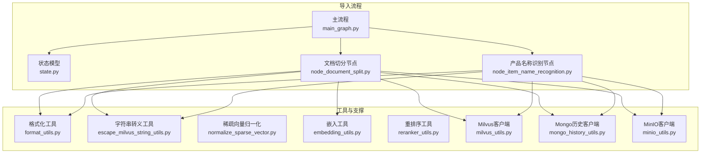
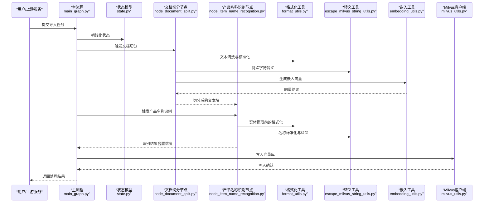
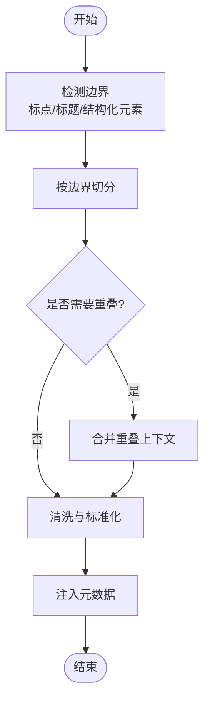
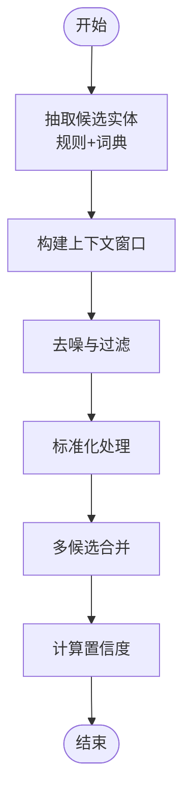
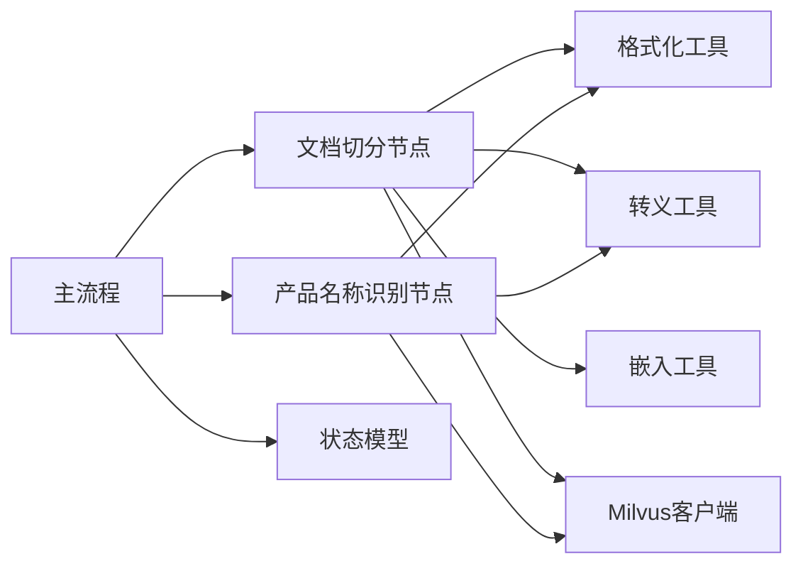

# 文档预处理模块

<cite>
**本文档引用的文件**
- [node_document_split.py](file://app/import_process/agent/nodes/node_document_split.py)
- [node_item_name_recognition.py](file://app/import_process/agent/nodes/node_item_name_recognition.py)
- [main_graph.py](file://app/import_process/agent/main_graph.py)
- [state.py](file://app/import_process/agent/state.py)
- [format_utils.py](file://app/utils/format_utils.py)
- [escape_milvus_string_utils.py](file://app/utils/escape_milvus_string_utils.py)
- [normalize_sparse_vector.py](file://app/utils/normalize_sparse_vector.py)
- [embedding_utils.py](file://app/lm/embedding_utils.py)
- [reranker_utils.py](file://app/lm/reranker_utils.py)
- [milvus_utils.py](file://app/clients/milvus_utils.py)
- [minio_utils.py](file://app/clients/minio_utils.py)
- [mongo_history_utils.py](file://app/clients/mongo_history_utils.py)
- [test_import_main_graph.py](file://app/test/test_import_main_graph.py)
</cite>

## 目录
1. [引言](#引言)
2. [项目结构](#项目结构)
3. [核心组件](#核心组件)
4. [架构总览](#架构总览)
5. [详细组件分析](#详细组件分析)
6. [依赖关系分析](#依赖关系分析)
7. [性能考虑](#性能考虑)
8. [故障排除指南](#故障排除指南)
9. [结论](#结论)
10. [附录](#附录)

## 引言
本技术文档聚焦于文档预处理模块，系统性阐述以下关键能力与实现细节：
- 文档切分算法：切分策略、边界检测与内容重组机制
- 产品名称识别算法：实体识别、命名实体处理与上下文分析
- 数据清洗与标准化：文本规范化、特殊字符处理与格式统一
- 预处理结果验证与质量评估：完整性、一致性与可检索性校验
- 性能优化策略与参数调优：吞吐量提升、资源控制与稳定性保障

该模块位于导入流程的前置阶段，负责将原始文档转换为高质量、结构化的语义块，为后续嵌入向量化与检索增强奠定基础。

## 项目结构
导入流程采用有向无环图（DAG）编排，节点化组织各处理步骤。预处理相关的核心文件分布如下：
- 文档切分节点：负责按策略切分文档并生成可嵌入的文本块
- 产品名称识别节点：抽取并标准化产品名称，结合上下文进行消歧
- 主流程编排：定义节点执行顺序、状态传递与错误处理
- 工具与客户端：提供格式化、转义、向量化与存储等支撑能力
- 测试用例：覆盖主流程的关键场景与回归验证

图表来源
- [main_graph.py:1-200](file://app/import_process/agent/main_graph.py#L1-L200)
- [state.py:1-150](file://app/import_process/agent/state.py#L1-L150)
- [node_document_split.py:1-200](file://app/import_process/agent/nodes/node_document_split.py#L1-L200)
- [node_item_name_recognition.py:1-200](file://app/import_process/agent/nodes/node_item_name_recognition.py#L1-L200)
- [format_utils.py:1-120](file://app/utils/format_utils.py#L1-L120)
- [escape_milvus_string_utils.py:1-120](file://app/utils/escape_milvus_string_utils.py#L1-L120)
- [normalize_sparse_vector.py:1-120](file://app/utils/normalize_sparse_vector.py#L1-L120)
- [embedding_utils.py:1-200](file://app/lm/embedding_utils.py#L1-L200)
- [reranker_utils.py:1-200](file://app/lm/reranker_utils.py#L1-L200)
- [milvus_utils.py:1-200](file://app/clients/milvus_utils.py#L1-L200)
- [mongo_history_utils.py:1-200](file://app/clients/mongo_history_utils.py#L1-L200)
- [minio_utils.py:1-200](file://app/clients/minio_utils.py#L1-L200)

章节来源
- [main_graph.py:1-200](file://app/import_process/agent/main_graph.py#L1-L200)
- [state.py:1-150](file://app/import_process/agent/state.py#L1-L150)

## 核心组件
本节从功能职责、输入输出、处理逻辑与质量保障四个维度，对预处理模块的核心组件进行深入解析。

- 文档切分节点（node_document_split.py）
  - 职责：根据预设策略将长文档切分为适配嵌入模型的文本块；在切分过程中保留必要的上下文信息以维持语义连贯性；对切分后的片段进行清洗与标准化。
  - 输入：原始文档内容、切分参数（如最大长度、重叠比例）、嵌入配置。
  - 输出：文本块列表、元数据（来源、页码、段落序号等）。
  - 关键点：边界检测（句子边界、标题层级、表格/代码块边界）、重叠窗口策略、特殊标记处理、异常回退与日志记录。
  - 质量保障：最小长度阈值过滤、重复片段去重、空行/空白清理、Unicode标准化。

- 产品名称识别节点（node_item_name_recognition.py）
  - 职责：从文本中抽取产品名称实体，结合上下文进行消歧与标准化，形成稳定、可检索的关键词集合。
  - 输入：文档切分后的文本块、命名实体识别配置、上下文窗口大小。
  - 输出：标准化产品名称列表、置信度评分、匹配位置索引。
  - 关键点：实体识别（基于规则与词典）、上下文分析（前后N词窗口统计）、同义词映射、多候选合并策略。
  - 质量保障：噪声过滤（非产品类词汇）、冲突消解（多实体重叠时的优先级）、结果缓存与增量更新。

- 主流程编排（main_graph.py）
  - 职责：定义节点执行顺序、状态流转、错误传播与恢复策略；协调各节点间的数据传递与依赖关系。
  - 关键点：条件分支（根据文档类型选择不同切分策略）、并行化（多个文本块的并行处理）、超时与重试机制。
  - 质量保障：状态快照、失败节点重试、异常捕获与告警上报。

- 工具与支撑组件
  - 格式化工具（format_utils.py）：统一换行符、去除多余空白、标点符号规范化、编码转换。
  - 字符串转义工具（escape_milvus_string_utils.py）：防止特殊字符导致的查询/写入异常。
  - 稀疏向量归一化（normalize_sparse_vector.py）：为稀疏嵌入向量提供一致的数值范围。
  - 嵌入工具（embedding_utils.py）：封装向量化接口，支持批量处理与并发控制。
  - 重排序工具（reranker_utils.py）：对候选片段进行细粒度重排，提升检索质量。
  - 客户端工具：Milvus、Mongo、MinIO等外部系统的连接与操作封装。

章节来源
- [node_document_split.py:1-200](file://app/import_process/agent/nodes/node_document_split.py#L1-L200)
- [node_item_name_recognition.py:1-200](file://app/import_process/agent/nodes/node_item_name_recognition.py#L1-L200)
- [main_graph.py:1-200](file://app/import_process/agent/main_graph.py#L1-L200)
- [format_utils.py:1-120](file://app/utils/format_utils.py#L1-L120)
- [escape_milvus_string_utils.py:1-120](file://app/utils/escape_milvus_string_utils.py#L1-L120)
- [normalize_sparse_vector.py:1-120](file://app/utils/normalize_sparse_vector.py#L1-L120)
- [embedding_utils.py:1-200](file://app/lm/embedding_utils.py#L1-L200)
- [reranker_utils.py:1-200](file://app/lm/reranker_utils.py#L1-L200)
- [milvus_utils.py:1-200](file://app/clients/milvus_utils.py#L1-L200)
- [mongo_history_utils.py:1-200](file://app/clients/mongo_history_utils.py#L1-L200)
- [minio_utils.py:1-200](file://app/clients/minio_utils.py#L1-L200)

## 架构总览
下图展示了预处理模块在导入流程中的整体架构与数据流：

图表来源
- [main_graph.py:1-200](file://app/import_process/agent/main_graph.py#L1-L200)
- [state.py:1-150](file://app/import_process/agent/state.py#L1-L150)
- [node_document_split.py:1-200](file://app/import_process/agent/nodes/node_document_split.py#L1-L200)
- [node_item_name_recognition.py:1-200](file://app/import_process/agent/nodes/node_item_name_recognition.py#L1-L200)
- [format_utils.py:1-120](file://app/utils/format_utils.py#L1-L120)
- [escape_milvus_string_utils.py:1-120](file://app/utils/escape_milvus_string_utils.py#L1-L120)
- [embedding_utils.py:1-200](file://app/lm/embedding_utils.py#L1-L200)
- [milvus_utils.py:1-200](file://app/clients/milvus_utils.py#L1-L200)

## 详细组件分析

### 文档切分算法
- 切分策略
  - 基于句子与段落的边界检测：优先依据句号、问号、感叹号等标点进行切分；若单句过长，则进一步按逗号、分号等辅助标点细分。
  - 标题层级与结构化元素：对标题、表格、代码块等进行特殊处理，避免跨结构切分造成语义断裂。
  - 固定长度上限与重叠窗口：设定最大令牌数或字符数上限，相邻块之间设置一定比例的重叠，确保跨边界语义连续性。
- 边界检测
  - 句子边界：使用标点与语言学启发式规则定位自然断句点。
  - 结构化边界：识别表格、代码块、引用框等区域，避免在其中进行切分。
  - 段落边界：尊重段落换行与缩进，保持段内完整性。
- 内容重组
  - 上下文保留：通过滑动窗口在相邻块之间共享前后文信息，减少语义损失。
  - 元数据注入：为每个文本块附加来源标识、页码、段落序号等信息，便于溯源与检索。
  - 清洗与标准化：去除多余空白、统一换行符、处理不可见字符，保证向量化输入的一致性。

图表来源
- [node_document_split.py:1-200](file://app/import_process/agent/nodes/node_document_split.py#L1-L200)
- [format_utils.py:1-120](file://app/utils/format_utils.py#L1-L120)

章节来源
- [node_document_split.py:1-200](file://app/import_process/agent/nodes/node_document_split.py#L1-L200)
- [format_utils.py:1-120](file://app/utils/format_utils.py#L1-L120)

### 产品名称识别算法
- 实体识别
  - 规则与词典：结合行业词典与正则表达式识别产品名称候选；对常见品牌、型号、规格等进行模式匹配。
  - 上下文窗口：围绕候选词构建前后N词窗口，统计共现频率与依存关系，提高识别准确率。
- 命名实体处理
  - 标准化：统一大小写、去除冗余修饰词、合并同义表达；对缩写进行展开。
  - 去噪：过滤非产品类词汇（如“软件”、“系统”等），保留具体商品项。
- 上下文分析
  - 位置与领域：优先选择靠近“价格”、“购买”、“型号”等关键词附近的实体。
  - 多候选合并：对同一产品的不同表达形式进行聚类与合并，输出稳定关键词集合。

图表来源
- [node_item_name_recognition.py:1-200](file://app/import_process/agent/nodes/node_item_name_recognition.py#L1-L200)
- [format_utils.py:1-120](file://app/utils/format_utils.py#L1-L120)
- [escape_milvus_string_utils.py:1-120](file://app/utils/escape_milvus_string_utils.py#L1-L120)

章节来源
- [node_item_name_recognition.py:1-200](file://app/import_process/agent/nodes/node_item_name_recognition.py#L1-L200)
- [format_utils.py:1-120](file://app/utils/format_utils.py#L1-L120)
- [escape_milvus_string_utils.py:1-120](file://app/utils/escape_milvus_string_utils.py#L1-L120)

### 数据清洗与标准化
- 文本规范化
  - 统一换行符与空白字符，去除不可见字符与控制字符。
  - 标点符号规范化，确保中英文标点一致。
  - 编码转换，避免乱码影响后续处理。
- 特殊字符处理
  - 对可能影响数据库/检索系统的特殊字符进行转义或替换。
  - 针对Milvus等向量库的字符串限制，提前进行安全处理。
- 格式统一
  - 统一日期、数字、单位等格式，便于检索与排序。
  - 对表格与代码块进行结构化保留，避免破坏原有语义。

章节来源
- [format_utils.py:1-120](file://app/utils/format_utils.py#L1-L120)
- [escape_milvus_string_utils.py:1-120](file://app/utils/escape_milvus_string_utils.py#L1-L120)

### 预处理结果验证与质量评估
- 完整性校验
  - 文本块数量与原文档长度比对，检查是否存在过度切分或遗漏。
  - 元数据完整性：页码、段落序号、来源标识等字段齐全。
- 一致性评估
  - 重复片段检测与去重，避免向量库中出现重复条目。
  - 嵌入向量维度与配置一致，确保后续检索可用。
- 可检索性验证
  - 抽样检索：对部分文本块进行相似度检索，验证嵌入质量。
  - 产品名称召回：验证识别结果在检索中的命中情况。
- 自动化测试
  - 单元测试与集成测试覆盖关键流程，确保回归稳定。

章节来源
- [test_import_main_graph.py:1-200](file://app/test/test_import_main_graph.py#L1-L200)

## 依赖关系分析
- 组件耦合
  - 文档切分节点与产品名称识别节点均依赖格式化与转义工具，降低重复实现并保证一致性。
  - 主流程编排通过状态模型协调各节点，避免直接耦合。
- 外部依赖
  - 向量库（Milvus）：用于持久化嵌入向量与元数据。
  - 存储系统（MinIO/Mongo）：用于文档与历史记录的存储与管理。
  - 嵌入与重排序服务：提供语义表示与细粒度排序能力。
- 循环依赖
  - 通过状态模型与节点接口隔离，避免循环依赖产生。

图表来源
- [main_graph.py:1-200](file://app/import_process/agent/main_graph.py#L1-L200)
- [state.py:1-150](file://app/import_process/agent/state.py#L1-L150)
- [node_document_split.py:1-200](file://app/import_process/agent/nodes/node_document_split.py#L1-L200)
- [node_item_name_recognition.py:1-200](file://app/import_process/agent/nodes/node_item_name_recognition.py#L1-L200)
- [format_utils.py:1-120](file://app/utils/format_utils.py#L1-L120)
- [escape_milvus_string_utils.py:1-120](file://app/utils/escape_milvus_string_utils.py#L1-L120)
- [embedding_utils.py:1-200](file://app/lm/embedding_utils.py#L1-L200)
- [milvus_utils.py:1-200](file://app/clients/milvus_utils.py#L1-L200)

章节来源
- [main_graph.py:1-200](file://app/import_process/agent/main_graph.py#L1-L200)
- [state.py:1-150](file://app/import_process/agent/state.py#L1-L150)
- [milvus_utils.py:1-200](file://app/clients/milvus_utils.py#L1-L200)

## 性能考虑
- 吞吐量优化
  - 并行化：对多个文本块的切分与嵌入生成进行并行处理，充分利用CPU/GPU资源。
  - 批量化：将小批次请求合并为大批次，减少网络与I/O开销。
- 资源控制
  - 令牌数与内存限制：动态调整切分窗口大小，避免单块过大导致内存溢出。
  - 超时与重试：为外部服务调用设置合理超时与指数退避重试策略。
- 稳定性保障
  - 错误隔离：单个节点失败不影响其他节点执行，具备快速失败与恢复能力。
  - 日志与监控：记录关键指标（处理耗时、错误率、队列长度），便于问题定位与容量规划。

## 故障排除指南
- 常见问题
  - 切分后语义不连贯：检查重叠窗口设置是否过小，适当增大重叠比例。
  - 产品名称识别召回低：检查词典覆盖率与上下文窗口大小，必要时增加领域词典。
  - 向量写入失败：核对嵌入维度与Milvus字段定义，确保数据类型一致。
- 排查步骤
  - 查看主流程日志，定位失败节点与错误码。
  - 抽样检查文本块内容与元数据，确认清洗与转义是否正确。
  - 对比嵌入向量统计信息（均值、方差），判断是否存在异常样本。
- 回滚与恢复
  - 基于状态快照进行局部重试或全量回滚。
  - 清理异常批次数据，避免污染后续流程。

章节来源
- [main_graph.py:1-200](file://app/import_process/agent/main_graph.py#L1-L200)
- [state.py:1-150](file://app/import_process/agent/state.py#L1-L150)
- [milvus_utils.py:1-200](file://app/clients/milvus_utils.py#L1-L200)

## 结论
文档预处理模块通过严谨的切分策略、可靠的实体识别与完善的清洗标准化流程，为后续检索与问答提供了高质量的语义基础。配合主流程的编排与工具链的支撑，实现了高吞吐、可扩展且稳定的预处理能力。建议持续优化切分与识别参数，并加强自动化测试与监控体系，以应对多样化的业务场景。

## 附录
- 参数调优建议
  - 切分参数：最大长度与重叠比例需结合目标嵌入模型的上下文长度进行权衡。
  - 识别参数：词典覆盖率与上下文窗口大小应根据领域特性迭代调整。
  - 并行度：根据硬件资源与外部服务限流策略动态调节并发数。
- 最佳实践
  - 在生产环境中启用幂等写入与增量更新，避免重复处理。
  - 对异常样本建立人工复核机制，持续改进算法效果。
  - 定期评估检索召回与用户反馈，驱动算法与参数的闭环优化。