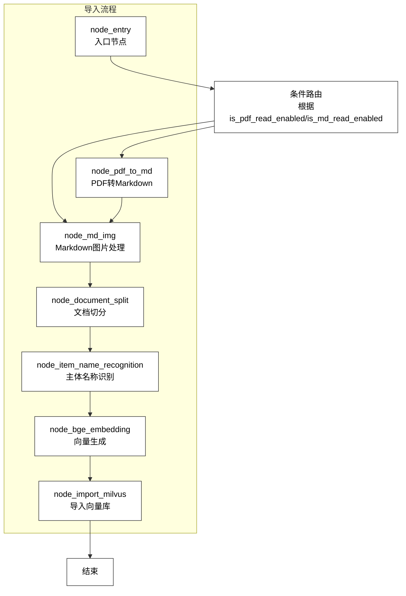
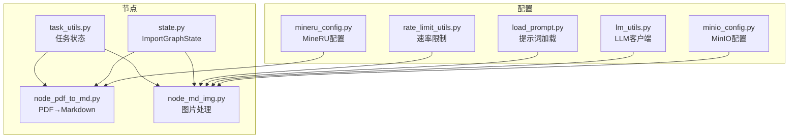
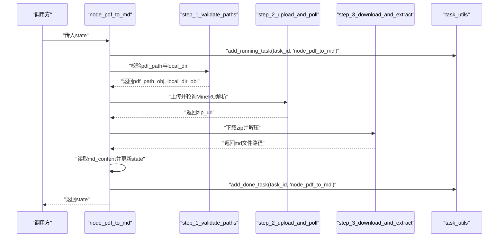
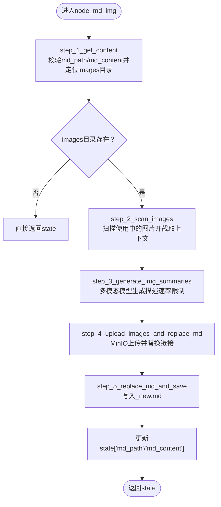
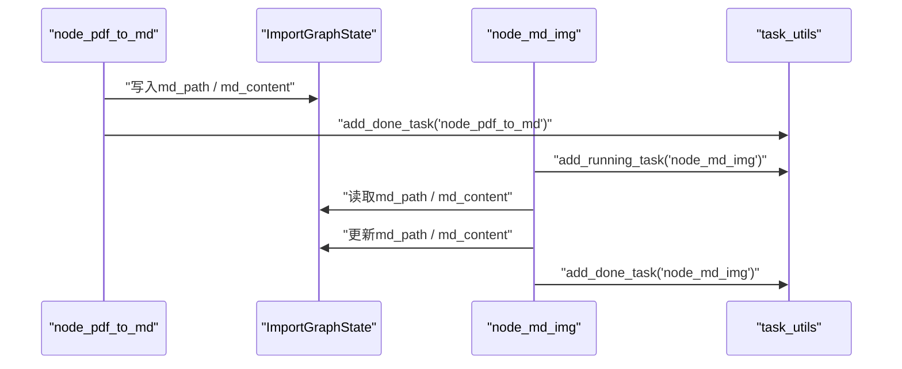
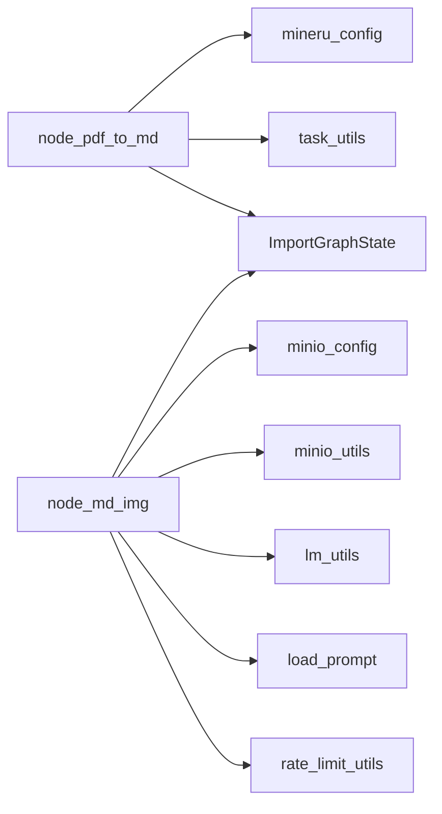
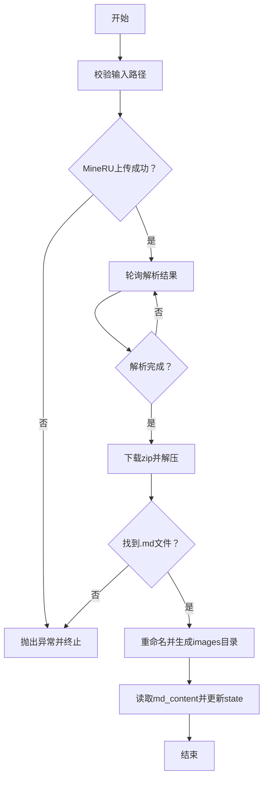

# PDF处理管道

<cite>
**本文引用的文件**
- [node_pdf_to_md.py](file://app/import_process/agent/nodes/node_pdf_to_md.py)
- [node_md_img.py](file://app/import_process/agent/nodes/node_md_img.py)
- [state.py](file://app/import_process/agent/state.py)
- [main_graph.py](file://app/import_process/agent/main_graph.py)
- [mineru_config.py](file://app/conf/mineru_config.py)
- [minio_config.py](file://app/conf/minio_config.py)
- [minio_utils.py](file://app/clients/minio_utils.py)
- [lm_utils.py](file://app/lm/lm_utils.py)
- [load_prompt.py](file://app/core/load_prompt.py)
- [rate_limit_utils.py](file://app/utils/rate_limit_utils.py)
- [task_utils.py](file://app/utils/task_utils.py)
</cite>

## 目录
1. [简介](#简介)
2. [项目结构](#项目结构)
3. [核心组件](#核心组件)
4. [架构总览](#架构总览)
5. [详细组件分析](#详细组件分析)
6. [依赖关系分析](#依赖关系分析)
7. [性能考量](#性能考量)
8. [故障排查指南](#故障排查指南)
9. [结论](#结论)
10. [附录](#附录)

## 简介
本文件面向PDF文档处理管道，聚焦两个关键节点：
- node_pdf_to_md：基于MineRU API的PDF解析与Markdown转换，负责将PDF上传至MineRU、轮询解析结果、下载并解压得到Markdown文件，同时生成中间文件（含images目录）。
- node_md_img：对Markdown中的图片进行识别、下载与存储，结合MinIO对象存储与多模态模型生成图片描述，最终替换Markdown中的图片链接。

文档还涵盖两节点之间的数据传递与状态更新机制、错误处理策略、流程图与关键参数配置说明。

## 项目结构
导入流程采用LangGraph状态机驱动，节点之间通过共享状态（ImportGraphState）传递数据。PDF处理路径由入口节点根据文件类型路由到node_pdf_to_md或node_md_img，随后串联后续处理节点。

**图表来源**
- [main_graph.py:30-62](file://app/import_process/agent/main_graph.py#L30-L62)
- [main_graph.py:19-65](file://app/import_process/agent/main_graph.py#L19-L65)

**章节来源**
- [main_graph.py:19-65](file://app/import_process/agent/main_graph.py#L19-L65)

## 核心组件
- ImportGraphState：统一的状态载体，包含任务ID、路径字段、内容数据与数据库相关字段，支撑各节点读写。
- node_pdf_to_md：封装MineRU上传、轮询、下载与解压，产出md_path与md_content，并生成images目录。
- node_md_img：扫描Markdown图片、调用多模态模型生成描述、上传MinIO并替换Markdown链接，输出新的md_path与md_content。

**章节来源**
- [state.py:5-91](file://app/import_process/agent/state.py#L5-L91)
- [node_pdf_to_md.py:260-305](file://app/import_process/agent/nodes/node_pdf_to_md.py#L260-L305)
- [node_md_img.py:310-358](file://app/import_process/agent/nodes/node_md_img.py#L310-L358)

## 架构总览
PDF处理管道以状态机为核心，节点间通过状态共享实现数据流转。node_pdf_to_md负责PDF→Markdown与中间文件生成，node_md_img负责图片识别、描述生成与链接替换。

**图表来源**
- [mineru_config.py:17-20](file://app/conf/mineru_config.py#L17-L20)
- [minio_config.py:22-29](file://app/conf/minio_config.py#L22-L29)
- [lm_utils.py:17-73](file://app/lm/lm_utils.py#L17-L73)
- [load_prompt.py:5-28](file://app/core/load_prompt.py#L5-L28)
- [rate_limit_utils.py:7-36](file://app/utils/rate_limit_utils.py#L7-L36)
- [node_pdf_to_md.py:260-305](file://app/import_process/agent/nodes/node_pdf_to_md.py#L260-L305)
- [node_md_img.py:310-358](file://app/import_process/agent/nodes/node_md_img.py#L310-L358)
- [state.py:5-91](file://app/import_process/agent/state.py#L5-L91)
- [task_utils.py:68-109](file://app/utils/task_utils.py#L68-L109)

## 详细组件分析

### node_pdf_to_md：PDF解析与Markdown转换
职责与流程：
- 路径校验：校验pdf_path与local_dir，不存在则创建目录；异常时抛出错误。
- MineRU上传与轮询：申请上传URL→PUT上传PDF→GET轮询解析结果→超时或错误时抛出异常。
- 下载与解压：下载zip→解压到以原文件名为名的目录→查找.md文件→重命名为原文件名→返回md文件绝对路径。
- 输出：更新state['md_path']与state['md_content']，并记录任务状态。

**图表来源**
- [node_pdf_to_md.py:260-305](file://app/import_process/agent/nodes/node_pdf_to_md.py#L260-L305)
- [node_pdf_to_md.py:64-93](file://app/import_process/agent/nodes/node_pdf_to_md.py#L64-L93)
- [node_pdf_to_md.py:96-181](file://app/import_process/agent/nodes/node_pdf_to_md.py#L96-L181)
- [node_pdf_to_md.py:182-257](file://app/import_process/agent/nodes/node_pdf_to_md.py#L182-L257)
- [task_utils.py:68-109](file://app/utils/task_utils.py#L68-L109)

关键实现要点：
- MineRU交互：使用mineru_config读取base_url与api_key，POST申请上传URL，PUT上传PDF，GET轮询解析状态，支持5xx重试与超时控制。
- 中间文件生成：解压目录以原文件名为名，包含images子目录；最终md文件重命名为原文件名。
- 异常处理：对路径不存在、上传失败、解析超时、下载失败、未找到.md等情况抛出异常并终止流程。

**章节来源**
- [node_pdf_to_md.py:64-93](file://app/import_process/agent/nodes/node_pdf_to_md.py#L64-L93)
- [node_pdf_to_md.py:96-181](file://app/import_process/agent/nodes/node_pdf_to_md.py#L96-L181)
- [node_pdf_to_md.py:182-257](file://app/import_process/agent/nodes/node_pdf_to_md.py#L182-L257)
- [mineru_config.py:17-20](file://app/conf/mineru_config.py#L17-L20)
- [task_utils.py:68-109](file://app/utils/task_utils.py#L68-L109)

### node_md_img：图片识别、下载与存储
职责与流程：
- 内容获取：校验md_path与md_content，定位images目录。
- 图片扫描：遍历images目录，匹配Markdown中使用的图片，截取上下文。
- 图片描述生成：调用多模态模型生成描述，应用速率限制。
- MinIO上传与替换：删除同名对象、上传图片、拼接访问URL、替换Markdown中的图片链接。
- 文件落盘：生成新md文件（_new.md），更新state['md_path']与state['md_content']。

**图表来源**
- [node_md_img.py:310-358](file://app/import_process/agent/nodes/node_md_img.py#L310-L358)
- [node_md_img.py:73-96](file://app/import_process/agent/nodes/node_md_img.py#L73-L96)
- [node_md_img.py:143-167](file://app/import_process/agent/nodes/node_md_img.py#L143-L167)
- [node_md_img.py:170-216](file://app/import_process/agent/nodes/node_md_img.py#L170-L216)
- [node_md_img.py:219-288](file://app/import_process/agent/nodes/node_md_img.py#L219-L288)
- [node_md_img.py:291-307](file://app/import_process/agent/nodes/node_md_img.py#L291-L307)

关键实现要点：
- 图片识别：正则匹配Markdown中的图片语法，截取上下文用于提示词渲染。
- 描述生成：通过get_llm_client获取多模态模型客户端，加载提示词模板，Base64编码图片并发送请求。
- MinIO上传：删除同名对象、上传图片、拼接公开访问URL，替换Markdown中的图片链接。
- 速率控制：滑动窗口限流，避免触发第三方API限流。

**章节来源**
- [node_md_img.py:73-96](file://app/import_process/agent/nodes/node_md_img.py#L73-L96)
- [node_md_img.py:143-167](file://app/import_process/agent/nodes/node_md_img.py#L143-L167)
- [node_md_img.py:170-216](file://app/import_process/agent/nodes/node_md_img.py#L170-L216)
- [node_md_img.py:219-288](file://app/import_process/agent/nodes/node_md_img.py#L219-L288)
- [node_md_img.py:291-307](file://app/import_process/agent/nodes/node_md_img.py#L291-L307)
- [lm_utils.py:17-73](file://app/lm/lm_utils.py#L17-L73)
- [load_prompt.py:5-28](file://app/core/load_prompt.py#L5-L28)
- [rate_limit_utils.py:7-36](file://app/utils/rate_limit_utils.py#L7-L36)
- [minio_utils.py:13-41](file://app/clients/minio_utils.py#L13-L41)
- [minio_config.py:22-29](file://app/conf/minio_config.py#L22-L29)

### 两节点之间的数据传递与状态更新
- 数据传递：node_pdf_to_md完成后在state中写入md_path与md_content，node_md_img读取并处理，最终将新的md_path与md_content回写。
- 状态更新：每个节点在开始与结束时调用add_running_task与add_done_task，维护任务运行/完成列表，并通过SSE推送进度。

**图表来源**
- [node_pdf_to_md.py:289-295](file://app/import_process/agent/nodes/node_pdf_to_md.py#L289-L295)
- [node_md_img.py:326-355](file://app/import_process/agent/nodes/node_md_img.py#L326-L355)
- [task_utils.py:68-109](file://app/utils/task_utils.py#L68-L109)

**章节来源**
- [node_pdf_to_md.py:289-295](file://app/import_process/agent/nodes/node_pdf_to_md.py#L289-L295)
- [node_md_img.py:326-355](file://app/import_process/agent/nodes/node_md_img.py#L326-L355)
- [task_utils.py:68-109](file://app/utils/task_utils.py#L68-L109)

## 依赖关系分析
- 配置依赖：mineru_config提供MineRU基础地址与Token；minio_config提供MinIO连接参数；lm_config提供多模态模型配置。
- 工具依赖：task_utils维护任务状态；rate_limit_utils提供滑动窗口限流；load_prompt提供提示词模板渲染；minio_utils提供MinIO客户端与桶初始化。
- 节点耦合：node_pdf_to_md与node_md_img通过ImportGraphState耦合，前者生成images目录，后者消费该目录。

**图表来源**
- [node_pdf_to_md.py:104-122](file://app/import_process/agent/nodes/node_pdf_to_md.py#L104-L122)
- [node_md_img.py:14-28](file://app/import_process/agent/nodes/node_md_img.py#L14-L28)
- [mineru_config.py:17-20](file://app/conf/mineru_config.py#L17-L20)
- [minio_config.py:22-29](file://app/conf/minio_config.py#L22-L29)
- [minio_utils.py:13-41](file://app/clients/minio_utils.py#L13-L41)
- [lm_utils.py:17-73](file://app/lm/lm_utils.py#L17-L73)
- [load_prompt.py:5-28](file://app/core/load_prompt.py#L5-L28)
- [rate_limit_utils.py:7-36](file://app/utils/rate_limit_utils.py#L7-L36)
- [state.py:5-91](file://app/import_process/agent/state.py#L5-L91)

**章节来源**
- [node_pdf_to_md.py:104-122](file://app/import_process/agent/nodes/node_pdf_to_md.py#L104-L122)
- [node_md_img.py:14-28](file://app/import_process/agent/nodes/node_md_img.py#L14-L28)
- [mineru_config.py:17-20](file://app/conf/mineru_config.py#L17-L20)
- [minio_config.py:22-29](file://app/conf/minio_config.py#L22-L29)
- [minio_utils.py:13-41](file://app/clients/minio_utils.py#L13-L41)
- [lm_utils.py:17-73](file://app/lm/lm_utils.py#L17-L73)
- [load_prompt.py:5-28](file://app/core/load_prompt.py#L5-L28)
- [rate_limit_utils.py:7-36](file://app/utils/rate_limit_utils.py#L7-L36)
- [state.py:5-91](file://app/import_process/agent/state.py#L5-L91)

## 性能考量
- MineRU轮询：默认轮询间隔3秒，最长等待600秒（按1秒/页估算），适合中小PDF；建议根据PDF页数动态调整超时。
- 速率限制：多模态模型调用采用滑动窗口限流，避免触发第三方API限流；合理设置max_requests与window_seconds。
- IO优化：解压目录以原文件名为名，避免重复解压导致的IO浪费；上传前先清理同名对象，减少冗余存储。
- 并发与缓存：LLM客户端采用全局缓存，避免重复初始化带来的开销。

[本节为通用性能建议，不直接分析具体文件]

## 故障排查指南
常见异常与处理：
- 路径校验失败：pdf_path或local_dir不存在，抛出异常；检查输入路径与权限。
- MineRU上传失败：HTTP状态码非200或返回code非0；检查Token与网络代理设置。
- 解析超时：超过设定超时仍未完成；检查MineRU服务状态与PDF大小。
- 下载失败：zip下载响应非200；检查网络与MinIO/对象存储访问。
- 未找到.md：解压后未发现Markdown文件；检查MineRU解析结果与输出目录。
- 图片未使用：images目录存在但未在Markdown中使用；检查图片引用语法与上下文。
- MinIO上传失败：fput_object异常；检查桶权限与对象命名规则。
- 多模态模型异常：LangChainException；检查模型配置与提示词模板。

定位手段：
- 查看日志：节点开始/结束日志与异常堆栈。
- 任务状态：通过task_utils查看running/done列表与状态。
- 中间文件：核对output/<pdf_stem>/<pdf_stem>_result.zip与images目录。

**章节来源**
- [node_pdf_to_md.py:75-88](file://app/import_process/agent/nodes/node_pdf_to_md.py#L75-L88)
- [node_pdf_to_md.py:116-121](file://app/import_process/agent/nodes/node_pdf_to_md.py#L116-L121)
- [node_pdf_to_md.py:134-141](file://app/import_process/agent/nodes/node_pdf_to_md.py#L134-L141)
- [node_pdf_to_md.py:150-154](file://app/import_process/agent/nodes/node_pdf_to_md.py#L150-L154)
- [node_pdf_to_md.py:193-195](file://app/import_process/agent/nodes/node_pdf_to_md.py#L193-L195)
- [node_pdf_to_md.py:223-225](file://app/import_process/agent/nodes/node_pdf_to_md.py#L223-L225)
- [node_md_img.py:81-86](file://app/import_process/agent/nodes/node_md_img.py#L81-L86)
- [node_md_img.py:264-266](file://app/import_process/agent/nodes/node_md_img.py#L264-L266)
- [task_utils.py:68-109](file://app/utils/task_utils.py#L68-L109)

## 结论
PDF处理管道通过node_pdf_to_md与node_md_img实现了从PDF到结构化Markdown的完整链路，结合MineRU解析、MinIO存储与多模态模型，形成可扩展的中间文件生成与图片处理能力。通过状态机与任务状态管理，流程具备良好的可观测性与可维护性。

[本节为总结性内容，不直接分析具体文件]

## 附录

### PDF处理流程图

**图表来源**
- [node_pdf_to_md.py:64-93](file://app/import_process/agent/nodes/node_pdf_to_md.py#L64-L93)
- [node_pdf_to_md.py:96-181](file://app/import_process/agent/nodes/node_pdf_to_md.py#L96-L181)
- [node_pdf_to_md.py:182-257](file://app/import_process/agent/nodes/node_pdf_to_md.py#L182-L257)

### 关键参数配置说明
- MineRU配置（mineru_config）
  - base_url：MineRU服务基础地址
  - api_key：MineRU访问令牌
- MinIO配置（minio_config）
  - endpoint：MinIO服务地址
  - access_key/secret_key：访问凭据
  - bucket_name：默认存储桶
  - minio_img_dir：图片存储目录前缀
  - minio_secure：是否启用HTTPS
- LLM配置（lm_config）
  - llm_model：多模态模型名称（如qwen-vl-plus）
  - api_key/base_url：模型API密钥与基础地址
  - temperature：采样温度
- 速率限制（rate_limit_utils）
  - max_requests：窗口内最大请求数
  - window_seconds：滑动窗口时长（秒）

**章节来源**
- [mineru_config.py:17-20](file://app/conf/mineru_config.py#L17-L20)
- [minio_config.py:22-29](file://app/conf/minio_config.py#L22-L29)
- [lm_utils.py:29-64](file://app/lm/lm_utils.py#L29-L64)
- [rate_limit_utils.py:7-36](file://app/utils/rate_limit_utils.py#L7-L36)