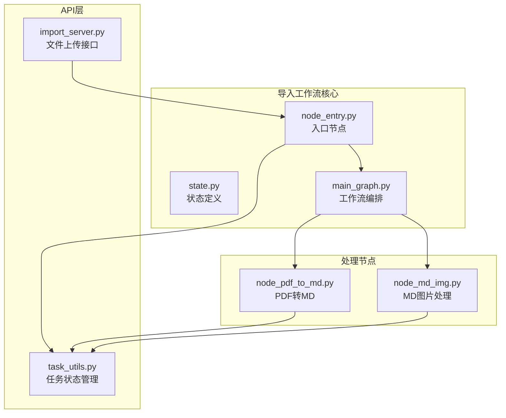
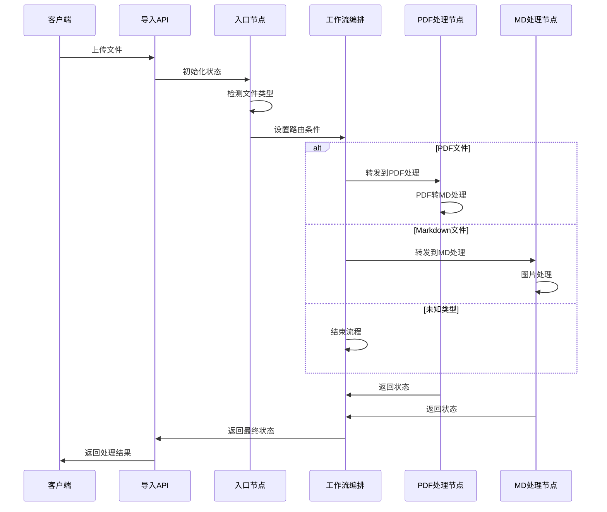
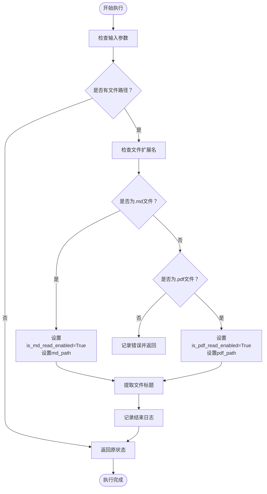
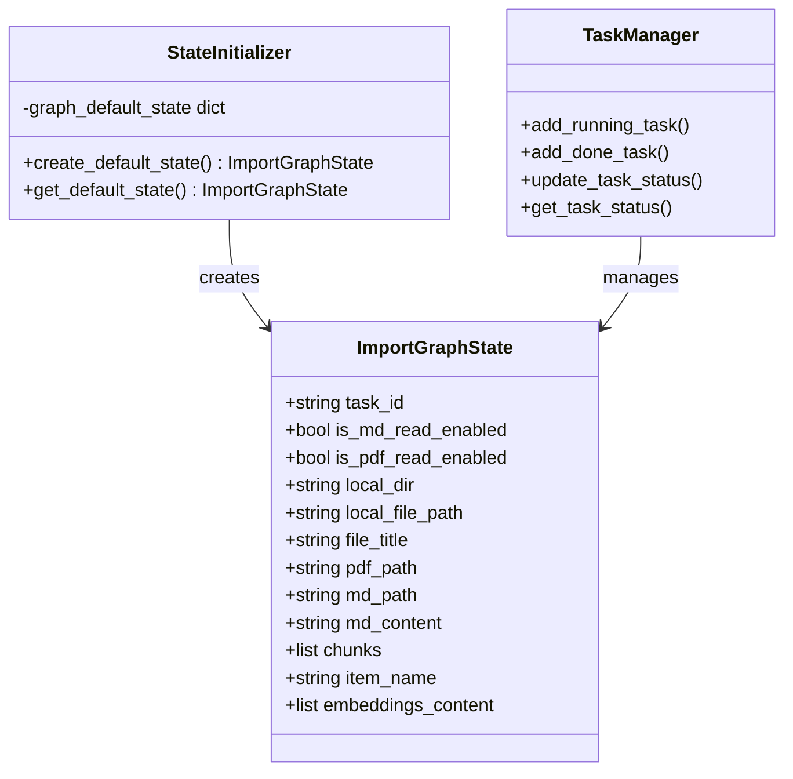
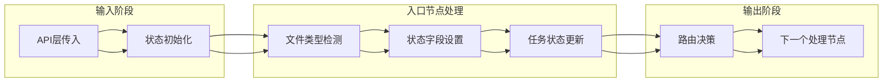
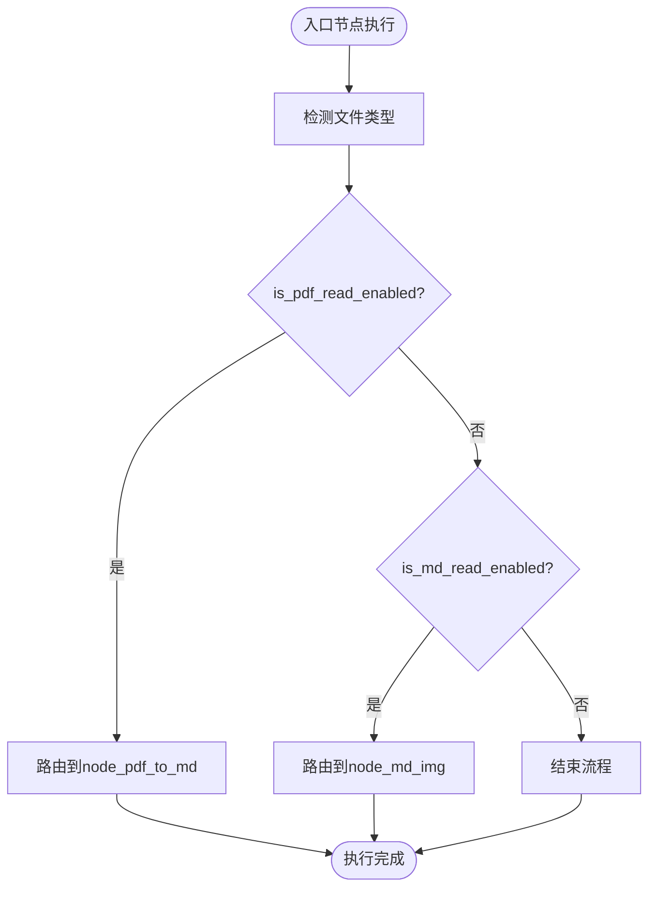
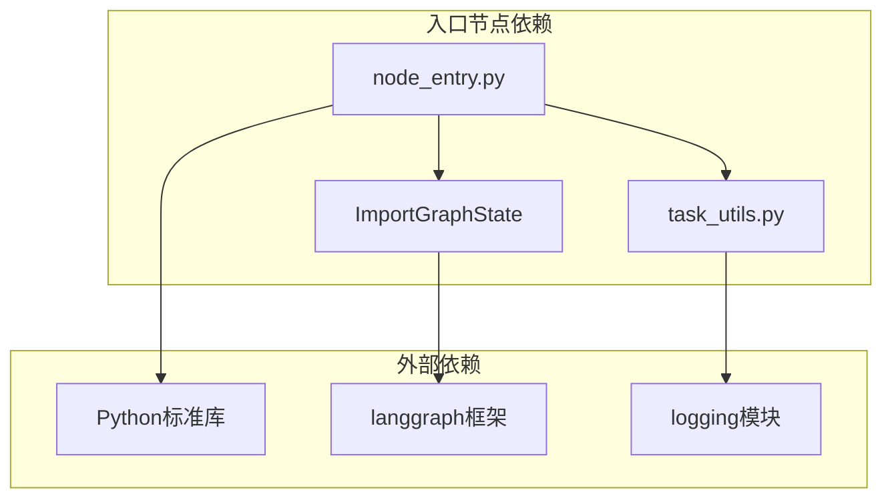

# 入口节点处理

<cite>
**本文引用的文件**
- [node_entry.py](file://app/import_process/agent/nodes/node_entry.py)
- [state.py](file://app/import_process/agent/state.py)
- [main_graph.py](file://app/import_process/agent/main_graph.py)
- [import_server.py](file://app/import_process/api/import_server.py)
- [task_utils.py](file://app/utils/task_utils.py)
- [node_pdf_to_md.py](file://app/import_process/agent/nodes/node_pdf_to_md.py)
- [node_md_img.py](file://app/import_process/agent/nodes/node_md_img.py)
</cite>

## 目录
1. [简介](#简介)
2. [项目结构](#项目结构)
3. [核心组件](#核心组件)
4. [架构概览](#架构概览)
5. [详细组件分析](#详细组件分析)
6. [依赖分析](#依赖分析)
7. [性能考虑](#性能考虑)
8. [故障排除指南](#故障排除指南)
9. [结论](#结论)

## 简介
本文档详细阐述导入工作流中入口节点（node_entry）的功能职责和实现机制。入口节点作为整个导入流程的起点，负责接收外部输入、进行文件类型检测、初始化状态对象以及验证输入参数。本文将深入解释PDF与Markdown文件的识别逻辑，详细描述状态对象的创建和初始化过程，以及入口节点在整个工作流中的作用和数据传递机制。

## 项目结构
导入工作流位于`app/import_process/agent/`目录下，采用模块化的节点设计模式：

**图表来源**
- [main_graph.py:19-65](file://app/import_process/agent/main_graph.py#L19-L65)
- [import_server.py:53-91](file://app/import_process/api/import_server.py#L53-L91)

**章节来源**
- [main_graph.py:1-134](file://app/import_process/agent/main_graph.py#L1-L134)
- [import_server.py:1-172](file://app/import_process/api/import_server.py#L1-L172)

## 核心组件
入口节点（node_entry）是导入工作流的唯一入口，承担以下核心职责：

### 文件类型检测机制
入口节点通过文件扩展名判断输入文件类型：
- **PDF文件检测**：检查文件路径是否以`.pdf`结尾
- **Markdown文件检测**：检查文件路径是否以`.md`结尾
- **未知类型处理**：对非PDF和非MD文件进行错误处理

### 状态初始化过程
入口节点负责初始化关键状态字段：
- `task_id`：任务唯一标识符
- `user_id`：用户标识符（从API层传入）
- `local_file_path`：原始输入文件路径
- `is_pdf_read_enabled`：PDF读取开关
- `is_md_read_enabled`：Markdown读取开关
- `file_title`：文件标题（去除后缀的文件名）

**章节来源**
- [node_entry.py:10-59](file://app/import_process/agent/nodes/node_entry.py#L10-L59)
- [state.py:5-63](file://app/import_process/agent/state.py#L5-L63)

## 架构概览
入口节点在整个导入工作流中扮演着关键的决策角色：

**图表来源**
- [main_graph.py:30-54](file://app/import_process/agent/main_graph.py#L30-L54)
- [import_server.py:55-91](file://app/import_process/api/import_server.py#L55-L91)

## 详细组件分析

### 入口节点实现详解

#### 文件类型检测算法
入口节点采用简单的字符串后缀匹配方式进行文件类型判断：

**图表来源**
- [node_entry.py:31-59](file://app/import_process/agent/nodes/node_entry.py#L31-L59)

#### 状态对象创建和初始化
入口节点通过API层创建和初始化状态对象：

**图表来源**
- [state.py:5-90](file://app/import_process/agent/state.py#L5-L90)
- [import_server.py:76-79](file://app/import_process/api/import_server.py#L76-L79)

**章节来源**
- [node_entry.py:10-59](file://app/import_process/agent/nodes/node_entry.py#L10-L59)
- [state.py:65-90](file://app/import_process/agent/state.py#L65-L90)

### 状态字段详细说明

#### 核心状态字段
| 字段名 | 类型 | 描述 | 默认值 |
|--------|------|------|--------|
| `task_id` | string | 任务唯一标识符 | "" |
| `is_md_read_enabled` | bool | 是否启用Markdown读取 | False |
| `is_pdf_read_enabled` | bool | 是否启用PDF读取 | False |
| `local_dir` | string | 输出目录路径 | "" |
| `local_file_path` | string | 输入文件完整路径 | "" |
| `file_title` | string | 文件标题（无后缀） | "" |
| `pdf_path` | string | PDF文件路径 | "" |
| `md_path` | string | Markdown文件路径 | "" |

#### 数据流转机制
入口节点通过以下方式传递状态数据：

**图表来源**
- [import_server.py:76-86](file://app/import_process/api/import_server.py#L76-L86)
- [main_graph.py:30-54](file://app/import_process/agent/main_graph.py#L30-L54)

**章节来源**
- [state.py:11-31](file://app/import_process/agent/state.py#L11-L31)
- [main_graph.py:30-44](file://app/import_process/agent/main_graph.py#L30-L44)

### 路由决策机制
入口节点的路由决策基于文件类型检测结果：

**图表来源**
- [main_graph.py:30-44](file://app/import_process/agent/main_graph.py#L30-L44)

**章节来源**
- [main_graph.py:30-44](file://app/import_process/agent/main_graph.py#L30-L44)

## 依赖分析
入口节点的依赖关系相对简单，主要依赖于状态管理和任务跟踪：

**图表来源**
- [node_entry.py:1-8](file://app/import_process/agent/nodes/node_entry.py#L1-L8)
- [state.py:1-4](file://app/import_process/agent/state.py#L1-L4)

**章节来源**
- [node_entry.py:1-8](file://app/import_process/agent/nodes/node_entry.py#L1-L8)
- [task_utils.py:1-187](file://app/utils/task_utils.py#L1-L187)

## 性能考虑
入口节点的性能特点：

### 时间复杂度
- **文件类型检测**：O(1) - 字符串后缀匹配
- **状态初始化**：O(1) - 字典赋值操作
- **日志记录**：O(1) - 标准库调用

### 内存使用
- 状态对象大小：固定大小的字典结构
- 日志缓冲：按需分配，通常很小
- 任务状态管理：使用字典存储，内存效率高

### 优化建议
1. **批量处理**：对于大量文件上传，考虑批处理策略
2. **缓存机制**：对频繁访问的状态字段进行缓存
3. **异步处理**：结合异步I/O提升整体吞吐量

## 故障排除指南

### 常见问题及解决方案

#### 文件类型识别失败
**问题现象**：未知文件类型导致流程提前结束
**解决方案**：
- 检查文件扩展名是否正确
- 确认文件路径包含正确的扩展名
- 在API层增加文件类型验证

#### 状态初始化错误
**问题现象**：状态字段缺失或类型不正确
**解决方案**：
- 确保API层正确传递必需参数
- 检查状态默认值定义
- 验证类型转换逻辑

#### 任务状态同步问题
**问题现象**：前端无法获取实时进度
**解决方案**：
- 检查任务状态管理器的配置
- 确认WebSocket连接状态
- 验证状态推送机制

**章节来源**
- [task_utils.py:68-109](file://app/utils/task_utils.py#L68-L109)
- [node_entry.py:33-35](file://app/import_process/agent/nodes/node_entry.py#L33-L35)

## 结论
入口节点（node_entry）作为导入工作流的核心起点，通过简洁高效的文件类型检测机制和完善的任务状态管理，为整个导入流程奠定了坚实基础。其设计遵循了单一职责原则，专注于输入验证和状态初始化，为后续的PDF处理和Markdown处理节点提供了清晰的路由决策依据。

入口节点的关键优势包括：
- **简单可靠**：基于文件扩展名的检测机制简单可靠
- **状态完整**：初始化所有必需的状态字段
- **路由明确**：为后续节点提供清晰的处理路径
- **监控完善**：集成任务状态跟踪和日志记录

通过合理的状态设计和路由机制，入口节点确保了导入工作流的稳定性和可维护性，为构建复杂的文档处理管道提供了良好的基础架构。