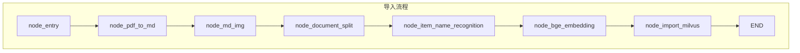
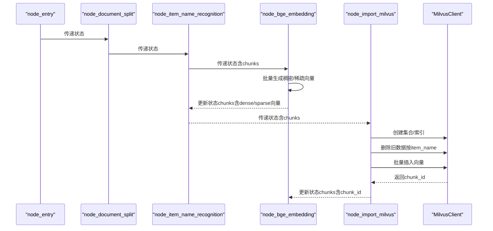
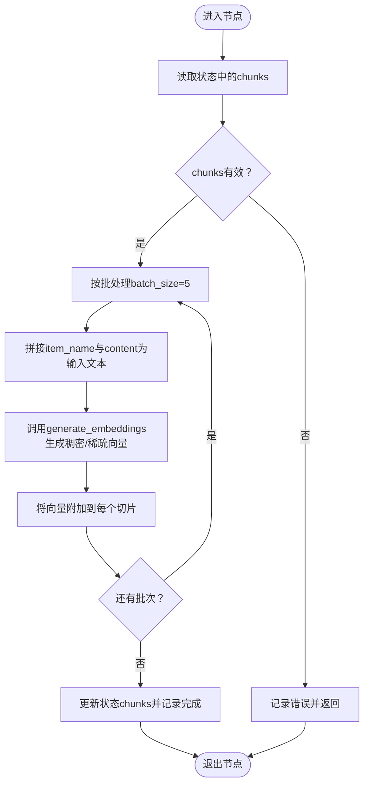
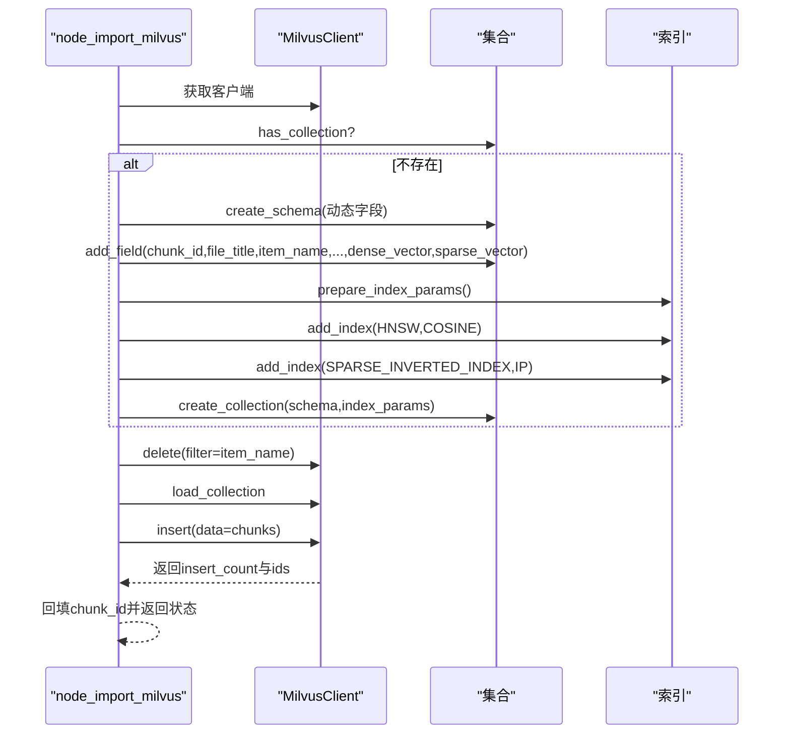
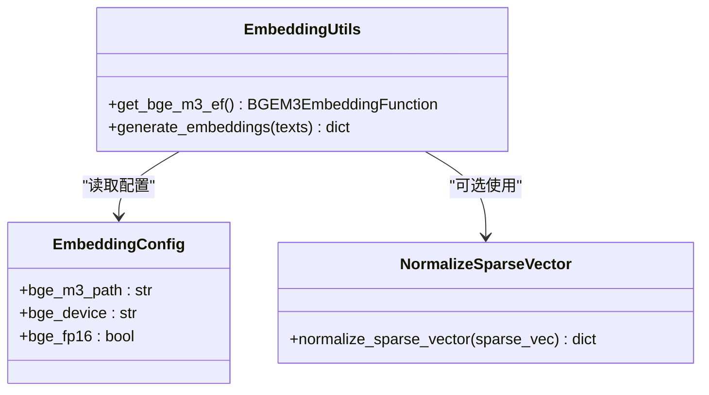
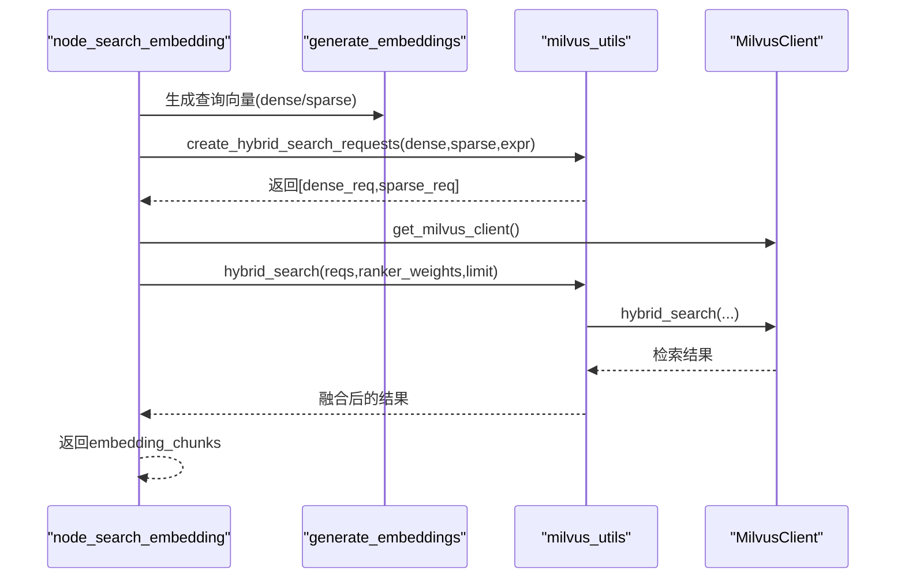
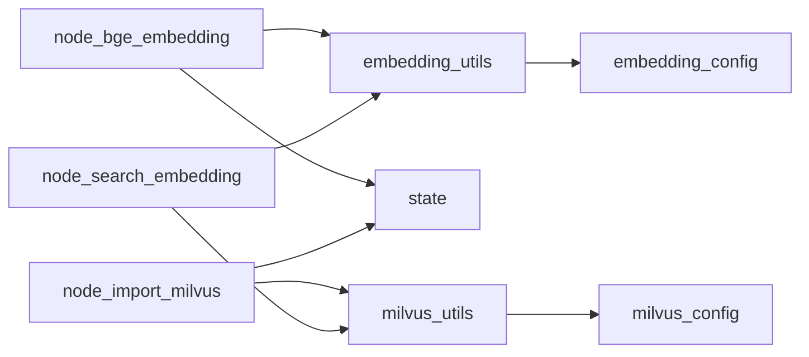

# 向量化与存储

<cite>
**本文引用的文件**
- [node_bge_embedding.py](file://app/import_process/agent/nodes/node_bge_embedding.py)
- [node_import_milvus.py](file://app/import_process/agent/nodes/node_import_milvus.py)
- [embedding_utils.py](file://app/lm/embedding_utils.py)
- [embedding_config.py](file://app/conf/embedding_config.py)
- [milvus_config.py](file://app/conf/milvus_config.py)
- [milvus_utils.py](file://app/clients/milvus_utils.py)
- [normalize_sparse_vector.py](file://app/utils/normalize_sparse_vector.py)
- [main_graph.py](file://app/import_process/agent/main_graph.py)
- [state.py](file://app/import_process/agent/state.py)
- [node_search_embedding.py](file://app/query_process/agent/nodes/node_search_embedding.py)
</cite>

## 目录
1. [简介](#简介)
2. [项目结构](#项目结构)
3. [核心组件](#核心组件)
4. [架构概览](#架构概览)
5. [详细组件分析](#详细组件分析)
6. [依赖分析](#依赖分析)
7. [性能考量](#性能考量)
8. [故障排除指南](#故障排除指南)
9. [结论](#结论)

## 简介
本文件聚焦“向量化与存储”阶段，系统性阐述以下内容：
- node_bge_embedding 节点如何使用 BGE-M3 模型生成稠密与稀疏向量，并将结果写入状态供后续节点使用。
- node_import_milvus 节点如何在 Milvus 中创建集合、建立索引、删除旧数据并批量插入向量。
- 嵌入向量的归一化处理与存储优化策略。
- 向量化过程中的内存管理与性能优化建议。
- 向量存储的查询优化与索引策略说明。

## 项目结构
导入流程采用 LangGraph 状态机驱动，向量化与 Milvus 存储位于导入链路的中间阶段，前后衔接文档解析、切分与实体识别等节点。

图表来源
- [main_graph.py:19-65](file://app/import_process/agent/main_graph.py#L19-L65)

章节来源
- [main_graph.py:19-65](file://app/import_process/agent/main_graph.py#L19-L65)
- [state.py:5-41](file://app/import_process/agent/state.py#L5-L41)

## 核心组件
- 向量化节点：负责将文本切片批量生成稠密与稀疏向量，并写入状态。
- Milvus 导入节点：负责集合创建、索引配置、旧数据清理与批量插入。
- 嵌入工具：提供 BGE-M3 模型单例与向量生成能力，内置 L2 归一化与稀疏向量格式转换。
- Milvus 工具：提供客户端单例、混合检索请求构建与混合检索执行。
- 配置模块：提供嵌入与 Milvus 的环境变量配置。

章节来源
- [node_bge_embedding.py:10-84](file://app/import_process/agent/nodes/node_bge_embedding.py#L10-L84)
- [node_import_milvus.py:114-149](file://app/import_process/agent/nodes/node_import_milvus.py#L114-L149)
- [embedding_utils.py:8-96](file://app/lm/embedding_utils.py#L8-L96)
- [milvus_utils.py:10-198](file://app/clients/milvus_utils.py#L10-L198)
- [embedding_config.py:10-24](file://app/conf/embedding_config.py#L10-L24)
- [milvus_config.py:12-26](file://app/conf/milvus_config.py#L12-L26)

## 架构概览
向量化与 Milvus 存储的整体流程如下：

图表来源
- [main_graph.py:19-65](file://app/import_process/agent/main_graph.py#L19-L65)
- [node_bge_embedding.py:10-84](file://app/import_process/agent/nodes/node_bge_embedding.py#L10-L84)
- [node_import_milvus.py:114-149](file://app/import_process/agent/nodes/node_import_milvus.py#L114-L149)
- [milvus_utils.py:10-32](file://app/clients/milvus_utils.py#L10-L32)

## 详细组件分析

### 组件A：BGE-M3 向量化节点（node_bge_embedding）
该节点负责：
- 从状态中提取文本切片列表（chunks）。
- 将每个切片拼接为模型输入文本（核心词前置策略）。
- 批量调用嵌入工具生成稠密与稀疏向量。
- 将向量写回状态，供 Milvus 导入节点使用。

关键实现要点：
- 批处理策略：每批处理固定数量的切片，降低内存峰值与上下文溢出风险。
- 文本构造：将 item_name 与 content 组合，确保核心词前置，提升检索质量。
- 向量写回：将 dense_vector 与 sparse_vector 写入每个切片，形成最终状态。

图表来源
- [node_bge_embedding.py:27-78](file://app/import_process/agent/nodes/node_bge_embedding.py#L27-L78)
- [embedding_utils.py:51-96](file://app/lm/embedding_utils.py#L51-L96)

章节来源
- [node_bge_embedding.py:10-84](file://app/import_process/agent/nodes/node_bge_embedding.py#L10-L84)
- [embedding_utils.py:51-96](file://app/lm/embedding_utils.py#L51-L96)

### 组件B：Milvus 存储节点（node_import_milvus）
该节点负责：
- 创建集合（若不存在），定义字段与动态字段支持。
- 定义索引：稠密向量使用 HNSW，稀疏向量使用 SPARSE_INVERTED_INDEX。
- 删除旧数据：基于 item_name 幂等清理，保证同一实体的向量一致性。
- 批量插入：将带向量的切片批量写入 Milvus，并回填 chunk_id。

图表来源
- [node_import_milvus.py:18-113](file://app/import_process/agent/nodes/node_import_milvus.py#L18-L113)
- [milvus_utils.py:10-32](file://app/clients/milvus_utils.py#L10-L32)

章节来源
- [node_import_milvus.py:114-149](file://app/import_process/agent/nodes/node_import_milvus.py#L114-L149)
- [milvus_config.py:12-26](file://app/conf/milvus_config.py#L12-L26)

### 组件C：嵌入工具与配置（embedding_utils 与 embedding_config）
- 模型单例：避免重复初始化，减少资源消耗与冷启动开销。
- 归一化策略：BGE-M3 模型原生开启 L2 归一化，适配 Milvus IP 内积检索。
- 稀疏向量格式：将 CSR 稀疏矩阵转换为字典格式，便于 JSON 序列化与 Milvus 存储。
- 设备与精度：支持 CPU/GPU 与半精度（fp16）配置，兼顾性能与显存占用。

图表来源
- [embedding_utils.py:8-96](file://app/lm/embedding_utils.py#L8-L96)
- [embedding_config.py:10-24](file://app/conf/embedding_config.py#L10-L24)
- [normalize_sparse_vector.py:1-23](file://app/utils/normalize_sparse_vector.py#L1-L23)

章节来源
- [embedding_utils.py:8-96](file://app/lm/embedding_utils.py#L8-L96)
- [embedding_config.py:10-24](file://app/conf/embedding_config.py#L10-L24)
- [normalize_sparse_vector.py:1-23](file://app/utils/normalize_sparse_vector.py#L1-L23)

### 组件D：Milvus 客户端与混合检索（milvus_utils）
- 客户端单例：避免重复连接，降低资源消耗。
- 混合检索：分别构建稠密与稀疏向量的 ANN 请求，使用 WeightedRanker 进行加权融合，提升检索准确性。
- 批量查询：提供按 chunk_id 批量查询的能力，支持回退策略（get/query）。

图表来源
- [node_search_embedding.py:12-72](file://app/query_process/agent/nodes/node_search_embedding.py#L12-L72)
- [milvus_utils.py:117-198](file://app/clients/milvus_utils.py#L117-L198)

章节来源
- [milvus_utils.py:10-198](file://app/clients/milvus_utils.py#L10-L198)
- [node_search_embedding.py:12-72](file://app/query_process/agent/nodes/node_search_embedding.py#L12-L72)

## 依赖分析
- node_bge_embedding 依赖 embedding_utils 生成向量，依赖 state 读写 chunks。
- node_import_milvus 依赖 milvus_utils 获取客户端、创建集合与索引、执行插入与删除。
- embedding_utils 依赖 embedding_config 读取模型路径、设备与精度配置。
- milvus_utils 依赖 milvus_config 读取 Milvus 地址与集合名。
- node_search_embedding 在查询阶段同样依赖 embedding_utils 生成查询向量与 milvus_utils 执行混合检索。

图表来源
- [node_bge_embedding.py:6](file://app/import_process/agent/nodes/node_bge_embedding.py#L6)
- [node_import_milvus.py:8](file://app/import_process/agent/nodes/node_import_milvus.py#L8)
- [embedding_utils.py:3](file://app/lm/embedding_utils.py#L3)
- [milvus_utils.py:3](file://app/clients/milvus_utils.py#L3)
- [node_search_embedding.py:6](file://app/query_process/agent/nodes/node_search_embedding.py#L6)

章节来源
- [node_bge_embedding.py:6](file://app/import_process/agent/nodes/node_bge_embedding.py#L6)
- [node_import_milvus.py:8](file://app/import_process/agent/nodes/node_import_milvus.py#L8)
- [embedding_utils.py:3](file://app/lm/embedding_utils.py#L3)
- [milvus_utils.py:3](file://app/clients/milvus_utils.py#L3)
- [node_search_embedding.py:6](file://app/query_process/agent/nodes/node_search_embedding.py#L6)

## 性能考量
- 向量化批处理：node_bge_embedding 使用固定批大小（默认5）平衡吞吐与内存占用，避免单次超大批次导致 OOM。
- 模型单例与归一化：embedding_utils 通过单例避免重复初始化，且模型原生 L2 归一化，适配 Milvus IP 内积检索，减少二次归一化开销。
- 稀疏向量格式：将 CSR 稀疏矩阵转换为字典，便于序列化与存储，同时保留稀疏特性，节省空间与计算。
- Milvus 索引选择：稠密向量使用 HNSW（COSINE），稀疏向量使用 SPARSE_INVERTED_INDEX（IP），兼顾召回与速度。
- 客户端单例：milvus_utils 提供 MilvusClient 单例，避免频繁连接与断开带来的性能损耗。
- 批量插入与回填：node_import_milvus 支持批量插入并回填 chunk_id，减少后续查询成本。
- 查询阶段融合：node_search_embedding 使用 WeightedRanker 对稠密与稀疏向量结果进行加权融合，提升检索质量与稳定性。

章节来源
- [node_bge_embedding.py:53-78](file://app/import_process/agent/nodes/node_bge_embedding.py#L53-L78)
- [embedding_utils.py:36-48](file://app/lm/embedding_utils.py#L36-L48)
- [node_import_milvus.py:47-71](file://app/import_process/agent/nodes/node_import_milvus.py#L47-L71)
- [milvus_utils.py:10-32](file://app/clients/milvus_utils.py#L10-L32)
- [node_search_embedding.py:36-51](file://app/query_process/agent/nodes/node_search_embedding.py#L36-L51)

## 故障排除指南
- 向量化失败
  - 检查输入 chunks 是否为空或格式错误。
  - 查看 embedding_utils 的日志，确认模型初始化与向量生成是否成功。
  - 若出现半精度相关问题，可在 embedding_config 中关闭 fp16 或切换到 CPU。
- Milvus 连接失败
  - 确认 MILVUS_URL 与 CHUNKS_COLLECTION 环境变量正确配置。
  - 检查 milvus_utils 的连接日志，确认客户端单例初始化成功。
- 插入失败或 chunk_id 缺失
  - 检查集合是否创建成功、索引是否配置正确。
  - 确认插入数据格式与字段类型匹配（如 INT64 chunk_id、VARCHAR 字段长度等）。
- 查询结果不理想
  - 调整混合检索权重（ranker_weights）与 limit。
  - 确认 expr 过滤条件（如 item_name in [...]）是否正确。
  - 检查向量归一化策略与检索度量（COSINE/IP）是否匹配。

章节来源
- [node_bge_embedding.py:29-32](file://app/import_process/agent/nodes/node_bge_embedding.py#L29-L32)
- [embedding_utils.py:46-48](file://app/lm/embedding_utils.py#L46-L48)
- [milvus_utils.py:20-31](file://app/clients/milvus_utils.py#L20-L31)
- [node_import_milvus.py:130-133](file://app/import_process/agent/nodes/node_import_milvus.py#L130-L133)
- [node_search_embedding.py:47-51](file://app/query_process/agent/nodes/node_search_embedding.py#L47-L51)

## 结论
本阶段通过 BGE-M3 模型实现高质量的稠密与稀疏向量生成，并在 Milvus 中完成集合创建、索引配置、旧数据清理与批量插入。结合模型原生归一化、稀疏向量格式转换与客户端单例等优化策略，系统在保证检索质量的同时提升了性能与稳定性。查询阶段通过混合检索与加权融合进一步提升召回效果。建议在生产环境中持续监控向量维度、索引参数与查询权重，以获得最佳的检索体验。