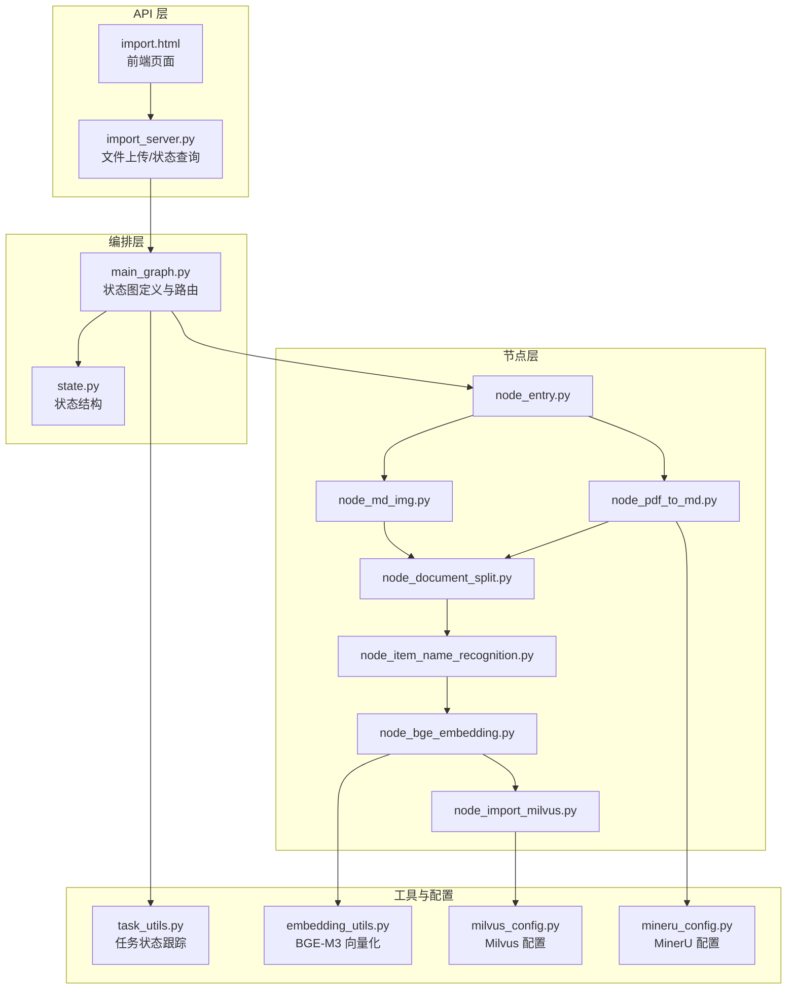
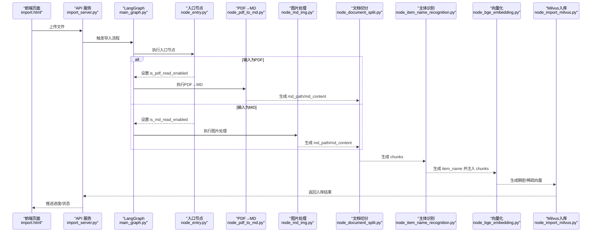
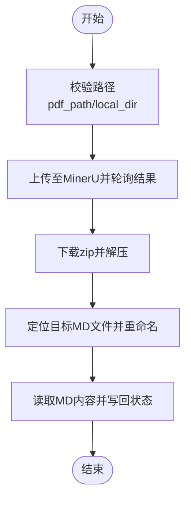
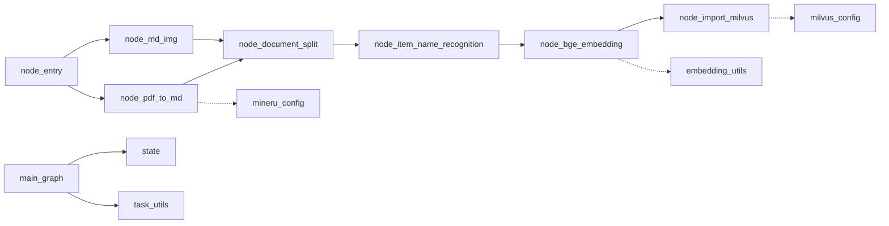

# 导入工作流设计

<cite>
**本文档引用的文件**
- [main_graph.py](file://app/import_process/agent/main_graph.py)
- [state.py](file://app/import_process/agent/state.py)
- [node_entry.py](file://app/import_process/agent/nodes/node_entry.py)
- [node_pdf_to_md.py](file://app/import_process/agent/nodes/node_pdf_to_md.py)
- [node_md_img.py](file://app/import_process/agent/nodes/node_md_img.py)
- [node_document_split.py](file://app/import_process/agent/nodes/node_document_split.py)
- [node_item_name_recognition.py](file://app/import_process/agent/nodes/node_item_name_recognition.py)
- [node_bge_embedding.py](file://app/import_process/agent/nodes/node_bge_embedding.py)
- [node_import_milvus.py](file://app/import_process/agent/nodes/node_import_milvus.py)
- [import_server.py](file://app/import_process/api/import_server.py)
- [import.html](file://app/import_process/page/import.html)
- [task_utils.py](file://app/utils/task_utils.py)
- [embedding_utils.py](file://app/lm/embedding_utils.py)
- [milvus_config.py](file://app/conf/milvus_config.py)
- [mineru_config.py](file://app/conf/mineru_config.py)
</cite>

## 目录
1. [简介](#简介)
2. [项目结构](#项目结构)
3. [核心组件](#核心组件)
4. [架构概览](#架构概览)
5. [详细组件分析](#详细组件分析)
6. [依赖关系分析](#依赖关系分析)
7. [性能考量](#性能考量)
8. [故障排除指南](#故障排除指南)
9. [结论](#结论)
10. [附录](#附录)

## 简介
本设计文档面向 RAG Agent 的文档导入工作流，围绕从 node_entry 开始的多分支处理流程，系统阐述条件路由机制（基于文件类型 PDF/Markdown 的分流策略）、各节点功能职责（文件预处理、内容提取、文档切分、实体识别、向量化与 Milvus 存储）、状态传递与数据流转，并提供工作流图与节点关系图，帮助读者全面理解从文件上传到向量入库的完整链路。

## 项目结构
导入工作流位于 app/import_process/agent 目录下，采用 LangGraph 编排，配合 API 层与前端页面完成端到端流程：
- API 层：提供文件上传、状态查询等接口
- 编排层：定义状态、节点与路由规则
- 节点层：实现具体处理逻辑
- 工具与配置：任务状态跟踪、向量化工具、Milvus/MinerU 配置

**图表来源**
- [import_server.py:1-172](file://app/import_process/api/import_server.py#L1-L172)
- [main_graph.py:1-134](file://app/import_process/agent/main_graph.py#L1-L134)
- [state.py:1-99](file://app/import_process/agent/state.py#L1-L99)
- [node_entry.py:1-59](file://app/import_process/agent/nodes/node_entry.py#L1-L59)
- [node_pdf_to_md.py:1-331](file://app/import_process/agent/nodes/node_pdf_to_md.py#L1-L331)
- [node_md_img.py:1-385](file://app/import_process/agent/nodes/node_md_img.py#L1-L385)
- [node_document_split.py:1-342](file://app/import_process/agent/nodes/node_document_split.py#L1-L342)
- [node_item_name_recognition.py:1-359](file://app/import_process/agent/nodes/node_item_name_recognition.py#L1-L359)
- [node_bge_embedding.py:1-84](file://app/import_process/agent/nodes/node_bge_embedding.py#L1-L84)
- [node_import_milvus.py:1-213](file://app/import_process/agent/nodes/node_import_milvus.py#L1-L213)
- [task_utils.py:1-187](file://app/utils/task_utils.py#L1-L187)
- [embedding_utils.py:1-108](file://app/lm/embedding_utils.py#L1-L108)
- [milvus_config.py:1-26](file://app/conf/milvus_config.py#L1-L26)
- [mineru_config.py:1-20](file://app/conf/mineru_config.py#L1-L20)

**章节来源**
- [main_graph.py:1-134](file://app/import_process/agent/main_graph.py#L1-L134)
- [state.py:1-99](file://app/import_process/agent/state.py#L1-L99)
- [import_server.py:1-172](file://app/import_process/api/import_server.py#L1-L172)
- [import.html:1-351](file://app/import_process/page/import.html#L1-L351)

## 核心组件
- 状态结构 ImportGraphState：统一承载任务 ID、文件路径、中间产物（md_content、chunks、item_name、embeddings_content）与数据库相关字段，支持默认初始化与覆盖。
- 节点编排：以 node_entry 为入口，依据 is_pdf_read_enabled/is_md_read_enabled 进行条件路由，形成 PDF→MD→切分→识别→向量化→Milvus 的处理链路。
- 任务状态跟踪：通过 task_utils 提供 add_running_task/add_done_task/update_task_status 等能力，结合 SSE 推送前端进度。

**章节来源**
- [state.py:1-99](file://app/import_process/agent/state.py#L1-L99)
- [main_graph.py:19-65](file://app/import_process/agent/main_graph.py#L19-L65)
- [task_utils.py:68-179](file://app/utils/task_utils.py#L68-L179)

## 架构概览
导入工作流采用“入口节点 + 条件路由 + 顺序处理”的设计：
- 入口节点 node_entry：解析输入文件类型，设置 is_pdf_read_enabled/is_md_read_enabled，并填充文件标题等基础信息。
- 条件路由：route_after_entry 根据状态标志选择 node_pdf_to_md 或 node_md_img。
- 顺序处理：PDF 路径经 node_pdf_to_md→node_document_split→node_item_name_recognition→node_bge_embedding→node_import_milvus；Markdown 路径经 node_md_img→node_document_split→node_item_name_recognition→node_bge_embedding→node_import_milvus。
- API 层：提供上传接口与状态查询接口，后台异步执行 LangGraph 流程。

**图表来源**
- [main_graph.py:30-62](file://app/import_process/agent/main_graph.py#L30-L62)
- [node_entry.py:10-59](file://app/import_process/agent/nodes/node_entry.py#L10-L59)
- [node_pdf_to_md.py:260-305](file://app/import_process/agent/nodes/node_pdf_to_md.py#L260-L305)
- [node_md_img.py:310-358](file://app/import_process/agent/nodes/node_md_img.py#L310-L358)
- [node_document_split.py:262-300](file://app/import_process/agent/nodes/node_document_split.py#L262-L300)
- [node_item_name_recognition.py:252-287](file://app/import_process/agent/nodes/node_item_name_recognition.py#L252-L287)
- [node_bge_embedding.py:10-84](file://app/import_process/agent/nodes/node_bge_embedding.py#L10-L84)
- [node_import_milvus.py:114-149](file://app/import_process/agent/nodes/node_import_milvus.py#L114-L149)
- [import_server.py:53-91](file://app/import_process/api/import_server.py#L53-L91)

## 详细组件分析

### 入口节点：node_entry
- 职责：校验输入文件路径，识别文件类型（.pdf/.md），设置 is_pdf_read_enabled/is_md_read_enabled，填充 file_title、md_path/pdf_path 等字段。
- 关键点：对空输入进行保护，非 PDF/MD 文件直接结束；文件名去后缀作为兜底 item_name 识别依据。
- 状态变更：更新 task_id、local_file_path、file_title、pdf_path/md_path、is_pdf_read_enabled/is_md_read_enabled。

**章节来源**
- [node_entry.py:10-59](file://app/import_process/agent/nodes/node_entry.py#L10-L59)

### PDF 路径：node_pdf_to_md
- 职责：将 PDF 文件提交至 MinerU 服务进行解析，下载并解压返回的 MD 压缩包，定位目标 MD 文件，读取内容并写回状态。
- 关键点：路径校验、上传/轮询/下载/解压/重命名等步骤均有异常处理；支持超时与 5xx 重试。
- 状态变更：设置 md_path、md_content、local_dir。

**图表来源**
- [node_pdf_to_md.py:64-93](file://app/import_process/agent/nodes/node_pdf_to_md.py#L64-L93)
- [node_pdf_to_md.py:96-181](file://app/import_process/agent/nodes/node_pdf_to_md.py#L96-L181)
- [node_pdf_to_md.py:182-257](file://app/import_process/agent/nodes/node_pdf_to_md.py#L182-L257)
- [node_pdf_to_md.py:260-305](file://app/import_process/agent/nodes/node_pdf_to_md.py#L260-L305)

**章节来源**
- [node_pdf_to_md.py:260-305](file://app/import_process/agent/nodes/node_pdf_to_md.py#L260-L305)
- [mineru_config.py:1-20](file://app/conf/mineru_config.py#L1-L20)

### Markdown 路径：node_md_img
- 职责：扫描 MD 中使用的图片，调用视觉模型生成图片描述，上传至 MinIO 并替换 MD 中的图片链接为 MinIO URL，最后写出新 MD 文件。
- 关键点：支持多种图片格式识别、上下文截取、限速调用、批量删除与上传、正则替换。
- 状态变更：更新 md_path、md_content。

**章节来源**
- [node_md_img.py:310-358](file://app/import_process/agent/nodes/node_md_img.py#L310-L358)

### 文档切分：node_document_split
- 职责：基于标题层级进行粗切分，再对超长段落进行细粒度切分与短块合并，生成带元数据的 chunks，并备份 chunks.json。
- 关键点：正则识别标题、代码块状态规避、RecursiveCharacterTextSplitter 控制切分长度与重叠、短块合并策略。
- 状态变更：设置 chunks。

**章节来源**
- [node_document_split.py:262-300](file://app/import_process/agent/nodes/node_document_split.py#L262-L300)

### 主体识别：node_item_name_recognition
- 职责：抽取前 K 个切片构建上下文，调用 LLM 识别文档主体名称（item_name），将 item_name 注入每个 chunk，并生成稠密/稀疏向量写入 Milvus。
- 关键点：上下文长度与单切片长度限制、兜底 file_title、向量索引配置与幂等清理。
- 状态变更：设置 item_name、chunks（含 item_name）、向量写入 Milvus。

**章节来源**
- [node_item_name_recognition.py:252-287](file://app/import_process/agent/nodes/node_item_name_recognition.py#L252-L287)
- [milvus_config.py:1-26](file://app/conf/milvus_config.py#L1-L26)

### 向量化：node_bge_embedding
- 职责：使用 BGE-M3 模型对每个 chunk 的 content 与 item_name 组合文本进行稠密/稀疏向量化，按批处理提高吞吐。
- 关键点：批量大小控制、核心词前置策略、向量格式适配 Milvus。
- 状态变更：为每个 chunk 增加 dense_vector/sparse_vector。

**章节来源**
- [node_bge_embedding.py:10-84](file://app/import_process/agent/nodes/node_bge_embedding.py#L10-L84)
- [embedding_utils.py:51-96](file://app/lm/embedding_utils.py#L51-L96)

### Milvus 入库：node_import_milvus
- 职责：创建/加载集合，按 item_name 幂等清理旧数据，批量插入 chunks 并回填 chunk_id。
- 关键点：集合 Schema/索引配置、删除过滤条件、插入结果回显。
- 状态变更：为每个 chunk 增加 chunk_id。

**章节来源**
- [node_import_milvus.py:114-149](file://app/import_process/agent/nodes/node_import_milvus.py#L114-L149)

### API 与前端
- API 层：/upload 接收文件并异步触发 LangGraph；/status/{task_id} 提供进度查询；SSE 推送任务状态。
- 前端页面：支持拖拽/选择文件、上传进度、日志展示与轮询状态。

**章节来源**
- [import_server.py:53-166](file://app/import_process/api/import_server.py#L53-L166)
- [import.html:162-347](file://app/import_process/page/import.html#L162-L347)
- [task_utils.py:174-179](file://app/utils/task_utils.py#L174-L179)

## 依赖关系分析
- LangGraph 状态图：定义节点、边与条件路由，形成 PDF/MD 两条主路径。
- 节点间依赖：PDF 路径依赖 MinerU；MD 路径依赖 MinIO；所有路径最终汇聚到 Milvus。
- 工具与配置：embedding_utils 提供 BGE-M3 单例与向量化；milvus_config/mineru_config 提供外部服务配置。

**图表来源**
- [main_graph.py:19-65](file://app/import_process/agent/main_graph.py#L19-L65)
- [node_pdf_to_md.py:10-13](file://app/import_process/agent/nodes/node_pdf_to_md.py#L10-L13)
- [node_bge_embedding.py:5-8](file://app/import_process/agent/nodes/node_bge_embedding.py#L5-L8)
- [node_import_milvus.py:7-12](file://app/import_process/agent/nodes/node_import_milvus.py#L7-L12)
- [milvus_config.py:1-26](file://app/conf/milvus_config.py#L1-L26)
- [mineru_config.py:1-20](file://app/conf/mineru_config.py#L1-L20)
- [embedding_utils.py:1-108](file://app/lm/embedding_utils.py#L1-L108)

**章节来源**
- [main_graph.py:19-65](file://app/import_process/agent/main_graph.py#L19-L65)

## 性能考量
- 批量处理：向量化节点按批处理文本，降低模型调用开销。
- 索引配置：Milvus 为稠密向量使用 HNSW，稀疏向量使用 SPARSE_INVERTED_INDEX，兼顾召回与性能。
- 限速与重试：MinerU 轮询与图片总结调用均具备超时与重试策略，提升稳定性。
- 状态持久化：中间产物（chunks.json）备份便于重放与调试。

[本节为通用性能讨论，不直接分析具体文件]

## 故障排除指南
- 文件类型不支持：入口节点对非 .pdf/.md 文件直接结束，检查文件扩展名。
- MinerU 解析失败：检查 MINERU_BASE_URL/MINERU_API_TOKEN，关注上传/轮询/下载阶段的异常日志。
- 向量生成异常：确认 BGE-M3 模型可用与设备配置，检查 texts 参数合法性。
- Milvus 写入异常：核对集合存在性、索引配置与过滤条件，查看幂等清理是否成功。
- 任务状态异常：通过 /status/{task_id} 接口查看 done_list/running_list，结合后端日志定位节点。

**章节来源**
- [node_entry.py:32-48](file://app/import_process/agent/nodes/node_entry.py#L32-L48)
- [node_pdf_to_md.py:116-181](file://app/import_process/agent/nodes/node_pdf_to_md.py#L116-L181)
- [node_bge_embedding.py:29-33](file://app/import_process/agent/nodes/node_bge_embedding.py#L29-L33)
- [node_import_milvus.py:128-133](file://app/import_process/agent/nodes/node_import_milvus.py#L128-L133)
- [import_server.py:146-166](file://app/import_process/api/import_server.py#L146-L166)

## 结论
该导入工作流以 LangGraph 为核心，通过入口节点与条件路由实现 PDF/MD 的差异化处理，串联内容提取、图片处理、文档切分、主体识别、向量化与 Milvus 入库，形成完整的 RAG 数据管线。API 与前端提供友好的上传与进度展示体验。整体设计具备良好的可扩展性与可观测性，适合在生产环境中稳定运行。

[本节为总结性内容，不直接分析具体文件]

## 附录
- 状态字段说明：见 [state.py:5-63](file://app/import_process/agent/state.py#L5-L63)
- 节点中文映射：见 [task_utils.py:27-50](file://app/utils/task_utils.py#L27-L50)
- 向量化工具：见 [embedding_utils.py:8-48](file://app/lm/embedding_utils.py#L8-L48)