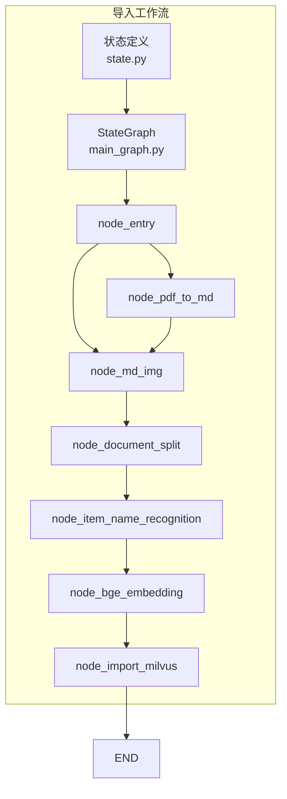
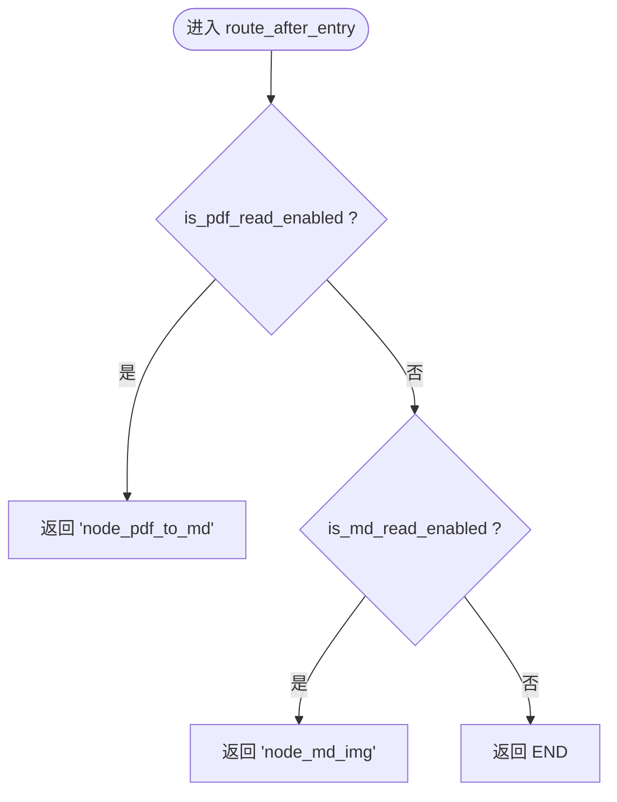
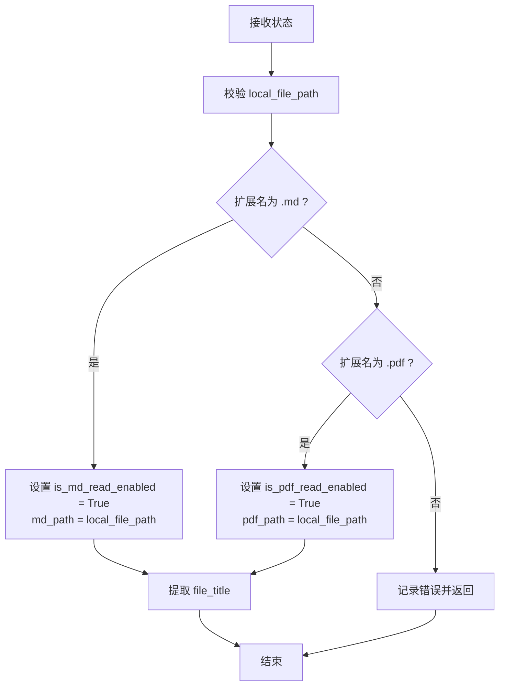
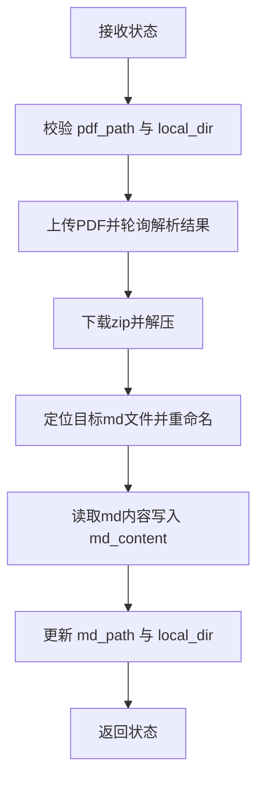
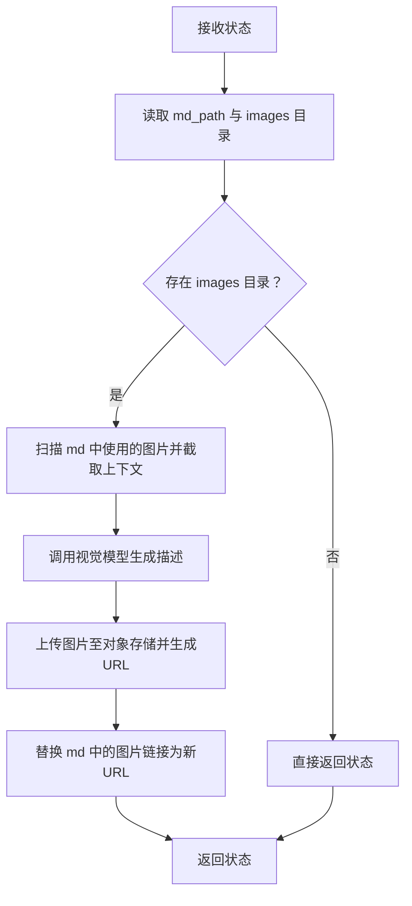
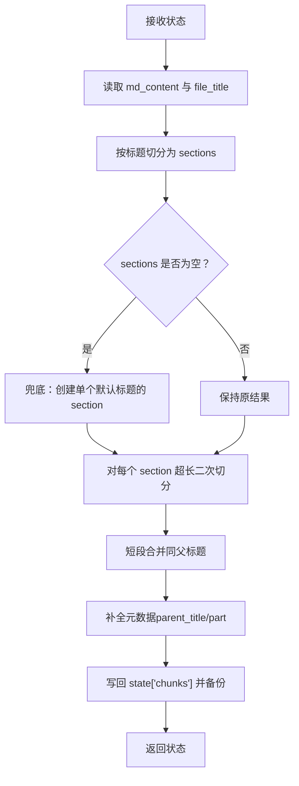
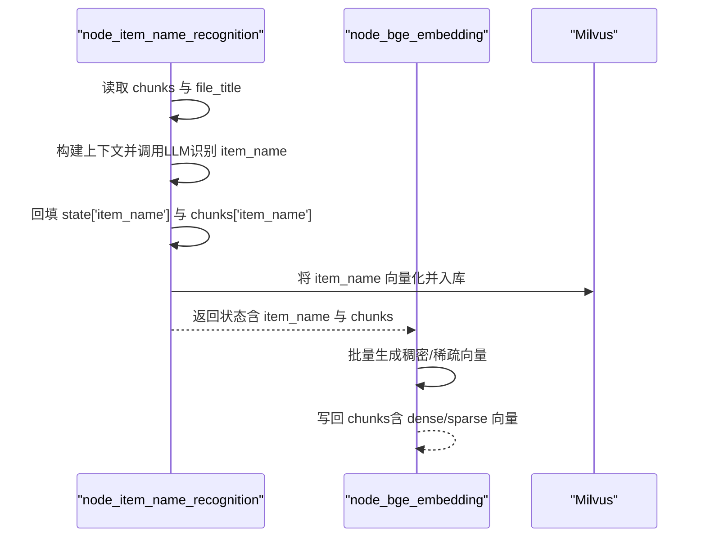
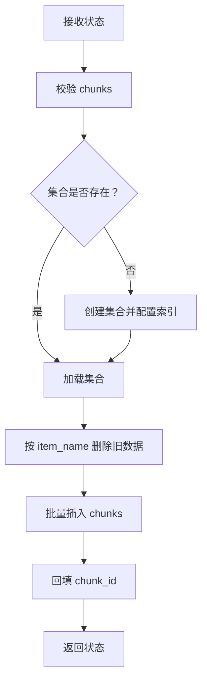

# 工作流架构概览

<cite>
**本文引用的文件**
- [main_graph.py](file://app/import_process/agent/main_graph.py)
- [state.py](file://app/import_process/agent/state.py)
- [node_entry.py](file://app/import_process/agent/nodes/node_entry.py)
- [node_pdf_to_md.py](file://app/import_process/agent/nodes/node_pdf_to_md.py)
- [node_md_img.py](file://app/import_process/agent/nodes/node_md_img.py)
- [node_document_split.py](file://app/import_process/agent/nodes/node_document_split.py)
- [node_item_name_recognition.py](file://app/import_process/agent/nodes/node_item_name_recognition.py)
- [node_bge_embedding.py](file://app/import_process/agent/nodes/node_bge_embedding.py)
- [node_import_milvus.py](file://app/import_process/agent/nodes/node_import_milvus.py)
- [test_import_main_graph.py](file://app/test/test_import_main_graph.py)
</cite>

## 目录
1. [引言](#引言)
2. [项目结构](#项目结构)
3. [核心组件](#核心组件)
4. [架构总览](#架构总览)
5. [详细组件分析](#详细组件分析)
6. [依赖分析](#依赖分析)
7. [性能考量](#性能考量)
8. [故障排查指南](#故障排查指南)
9. [结论](#结论)
10. [附录](#附录)

## 引言
本文件面向“导入工作流”的架构设计，围绕基于 LangGraph 的状态图（StateGraph）展开，系统阐述以下关键点：
- StateGraph 的构建方式与节点注册机制
- 边连接规则与静态边、条件边的组合
- 条件路由机制的设计与实现，重点解析 route_after_entry 如何依据文件类型（PDF vs Markdown）进行分支决策
- 工作流从 node_entry 到 END 的完整执行链路
- 工作流图与节点关系图，展示静态边与条件边的连接方式

## 项目结构
导入工作流位于 app/import_process/agent 目录，采用“状态 + 节点”的清晰分层：
- 状态定义：state.py
- 图构建与路由：main_graph.py
- 节点实现：nodes/ 下各节点文件
- 测试入口：app/test/test_import_main_graph.py



图表来源
- [main_graph.py:19-65](file://app/import_process/agent/main_graph.py#L19-L65)
- [state.py:5-91](file://app/import_process/agent/state.py#L5-L91)

章节来源
- [main_graph.py:1-134](file://app/import_process/agent/main_graph.py#L1-L134)
- [state.py:1-99](file://app/import_process/agent/state.py#L1-L99)

## 核心组件
- 状态模型 ImportGraphState：统一承载任务标识、文件路径、中间产物（md_content、chunks 等）与控制标记（is_pdf_read_enabled、is_md_read_enabled）。
- 节点函数：每个节点负责单一职责，接收/修改状态并返回新状态。
- 条件路由：route_after_entry 根据状态中的控制标记选择后续节点。

章节来源
- [state.py:5-91](file://app/import_process/agent/state.py#L5-L91)
- [main_graph.py:30-54](file://app/import_process/agent/main_graph.py#L30-L54)

## 架构总览
LangGraph 的 StateGraph 由以下步骤构成：
1) 初始化 StateGraph 并绑定 ImportGraphState 类型
2) 注册全部节点（add_node）
3) 设置入口节点（set_entry_point）
4) 定义条件边（add_conditional_edges），使用 route_after_entry 进行分支
5) 定义静态边（add_edge），形成后续串行链路
6) 编译得到可执行的 kb_import_app

```mermaid
sequenceDiagram
participant U as "调用方"
participant G as "StateGraph<br/>main_graph.py"
participant E as "node_entry"
participant R as "route_after_entry"
participant P as "node_pdf_to_md"
participant M as "node_md_img"
participant S as "node_document_split"
participant I as "node_item_name_recognition"
participant B as "node_bge_embedding"
participant V as "node_import_milvus"
U->>G : 传入初始状态 ImportGraphState
G->>E : 调用入口节点
E-->>G : 返回更新后的状态
G->>R : 调用条件路由
alt 状态指示为PDF
R-->>P : 路由至 node_pdf_to_md
P-->>M : 静态边连接
else 状态指示为MD
R-->>M : 路由至 node_md_img
else 其他
R-->>END : 路由至 END
end
M-->>S : 静态边
S-->>I : 静态边
I-->>B : 静态边
B-->>V : 静态边
V-->>END : 静态边
```

图表来源
- [main_graph.py:19-65](file://app/import_process/agent/main_graph.py#L19-L65)
- [node_entry.py:10-59](file://app/import_process/agent/nodes/node_entry.py#L10-L59)
- [node_pdf_to_md.py:260-305](file://app/import_process/agent/nodes/node_pdf_to_md.py#L260-L305)
- [node_md_img.py:310-358](file://app/import_process/agent/nodes/node_md_img.py#L310-L358)
- [node_document_split.py:262-300](file://app/import_process/agent/nodes/node_document_split.py#L262-L300)
- [node_item_name_recognition.py:252-287](file://app/import_process/agent/nodes/node_item_name_recognition.py#L252-L287)
- [node_bge_embedding.py:10-84](file://app/import_process/agent/nodes/node_bge_embedding.py#L10-L84)
- [node_import_milvus.py:114-149](file://app/import_process/agent/nodes/node_import_milvus.py#L114-L149)

章节来源
- [main_graph.py:19-65](file://app/import_process/agent/main_graph.py#L19-L65)

## 详细组件分析

### 条件路由与分支决策：route_after_entry
- 输入：ImportGraphState
- 决策依据：
  - 若 is_pdf_read_enabled 为真，分支至 node_pdf_to_md
  - 若 is_md_read_enabled 为真，分支至 node_md_img
  - 否则，分支至 END
- 输出：目标节点名或 END



图表来源
- [main_graph.py:30-44](file://app/import_process/agent/main_graph.py#L30-L44)

章节来源
- [main_graph.py:30-54](file://app/import_process/agent/main_graph.py#L30-L54)

### 入口节点：node_entry
- 职责：解析输入文件路径，推断文件类型，设置控制标记与文件标题，为后续路由提供依据。
- 关键行为：
  - 校验输入路径
  - 根据扩展名设置 is_md_read_enabled 或 is_pdf_read_enabled
  - 提取 file_title



图表来源
- [node_entry.py:10-59](file://app/import_process/agent/nodes/node_entry.py#L10-L59)

章节来源
- [node_entry.py:10-59](file://app/import_process/agent/nodes/node_entry.py#L10-L59)

### PDF 路径：node_pdf_to_md
- 职责：将 PDF 转换为 Markdown（调用第三方服务），落地中间文件并更新 md_path 与 md_content。
- 关键步骤：路径校验 → 上传并轮询解析 → 下载解压 → 选择目标 md 文件 → 读取内容写回状态。



图表来源
- [node_pdf_to_md.py:260-305](file://app/import_process/agent/nodes/node_pdf_to_md.py#L260-L305)
- [node_pdf_to_md.py:64-93](file://app/import_process/agent/nodes/node_pdf_to_md.py#L64-L93)
- [node_pdf_to_md.py:96-181](file://app/import_process/agent/nodes/node_pdf_to_md.py#L96-L181)
- [node_pdf_to_md.py:182-257](file://app/import_process/agent/nodes/node_pdf_to_md.py#L182-L257)

章节来源
- [node_pdf_to_md.py:260-305](file://app/import_process/agent/nodes/node_pdf_to_md.py#L260-L305)

### MD 路径：node_md_img
- 职责：扫描 Markdown 中使用的图片，上传至对象存储，可选地生成图片描述并替换链接。
- 关键步骤：读取 md_content 与 images 目录 → 识别使用过的图片 → 生成描述 → 上传并替换 → 写回新 md 路径与内容。



图表来源
- [node_md_img.py:310-358](file://app/import_process/agent/nodes/node_md_img.py#L310-L358)
- [node_md_img.py:73-96](file://app/import_process/agent/nodes/node_md_img.py#L73-L96)
- [node_md_img.py:143-167](file://app/import_process/agent/nodes/node_md_img.py#L143-L167)
- [node_md_img.py:170-216](file://app/import_process/agent/nodes/node_md_img.py#L170-L216)
- [node_md_img.py:219-288](file://app/import_process/agent/nodes/node_md_img.py#L219-L288)
- [node_md_img.py:291-307](file://app/import_process/agent/nodes/node_md_img.py#L291-L307)

章节来源
- [node_md_img.py:310-358](file://app/import_process/agent/nodes/node_md_img.py#L310-L358)

### 文档切分：node_document_split
- 职责：基于标题层级进行粗切分，再对超长段落进行细粒度切分与短段合并，生成带元数据的 chunks，并备份到本地。
- 关键步骤：读取 md_content → 按标题切分 → 超长二次切分 → 短段合并 → 写回 chunks 并备份。



图表来源
- [node_document_split.py:262-300](file://app/import_process/agent/nodes/node_document_split.py#L262-L300)
- [node_document_split.py:34-48](file://app/import_process/agent/nodes/node_document_split.py#L34-L48)
- [node_document_split.py:51-144](file://app/import_process/agent/nodes/node_document_split.py#L51-L144)
- [node_document_split.py:216-240](file://app/import_process/agent/nodes/node_document_split.py#L216-L240)
- [node_document_split.py:243-259](file://app/import_process/agent/nodes/node_document_split.py#L243-L259)

章节来源
- [node_document_split.py:262-300](file://app/import_process/agent/nodes/node_document_split.py#L262-L300)

### 主体识别与向量化：node_item_name_recognition → node_bge_embedding
- node_item_name_recognition：抽取前若干切片构建上下文，调用大模型识别主体名称（item_name），回填 chunks 并将 item_name 向量化存储到向量库。
- node_bge_embedding：对每个 chunk 的 content 与 item_name 组合生成稠密/稀疏向量，准备 Milvus 写入。



图表来源
- [node_item_name_recognition.py:252-287](file://app/import_process/agent/nodes/node_item_name_recognition.py#L252-L287)
- [node_item_name_recognition.py:57-74](file://app/import_process/agent/nodes/node_item_name_recognition.py#L57-L74)
- [node_item_name_recognition.py:113-137](file://app/import_process/agent/nodes/node_item_name_recognition.py#L113-L137)
- [node_item_name_recognition.py:139-154](file://app/import_process/agent/nodes/node_item_name_recognition.py#L139-L154)
- [node_item_name_recognition.py:155-173](file://app/import_process/agent/nodes/node_item_name_recognition.py#L155-L173)
- [node_item_name_recognition.py:176-251](file://app/import_process/agent/nodes/node_item_name_recognition.py#L176-L251)
- [node_bge_embedding.py:10-84](file://app/import_process/agent/nodes/node_bge_embedding.py#L10-L84)

章节来源
- [node_item_name_recognition.py:252-287](file://app/import_process/agent/nodes/node_item_name_recognition.py#L252-L287)
- [node_bge_embedding.py:10-84](file://app/import_process/agent/nodes/node_bge_embedding.py#L10-L84)

### Milvus 写入：node_import_milvus
- 职责：准备集合、删除旧数据（按 item_name 幂等）、批量写入 chunks 并回显 chunk_id。
- 关键步骤：创建/加载集合 → 删除旧数据 → 批量插入 → 回填 chunk_id。



图表来源
- [node_import_milvus.py:114-149](file://app/import_process/agent/nodes/node_import_milvus.py#L114-L149)
- [node_import_milvus.py:18-78](file://app/import_process/agent/nodes/node_import_milvus.py#L18-L78)
- [node_import_milvus.py:81-92](file://app/import_process/agent/nodes/node_import_milvus.py#L81-L92)
- [node_import_milvus.py:94-112](file://app/import_process/agent/nodes/node_import_milvus.py#L94-L112)

章节来源
- [node_import_milvus.py:114-149](file://app/import_process/agent/nodes/node_import_milvus.py#L114-L149)

## 依赖分析
- 节点间依赖关系
  - node_entry 为唯一入口，通过条件边分别连接 node_pdf_to_md 与 node_md_img
  - PDF 路径：node_pdf_to_md → node_md_img → node_document_split → node_item_name_recognition → node_bge_embedding → node_import_milvus → END
  - MD 路径：node_md_img → node_document_split → node_item_name_recognition → node_bge_embedding → node_import_milvus → END
- 外部依赖
  - 第三方服务：PDF 转 MD（minerU）
  - 对象存储：MinIO（图片上传）
  - 向量数据库：Milvus（集合创建、索引、写入）
  - 大模型：用于主体识别与图片描述生成


图表来源
- [main_graph.py:46-62](file://app/import_process/agent/main_graph.py#L46-L62)

章节来源
- [main_graph.py:46-62](file://app/import_process/agent/main_graph.py#L46-L62)

## 性能考量
- 批处理与限速
  - 向量化节点采用批处理（batch_size）降低调用开销
  - 图片描述生成阶段应用速率限制，避免触发接口限流
- I/O 优化
  - PDF 解析与下载采用异步轮询，结合超时控制
  - 中间文件落地与备份，便于重试与审计
- 向量索引
  - Milvus 集合创建时配置 HNSW（稠密）与稀疏倒排索引，兼顾召回与性能

## 故障排查指南
- 常见问题与定位
  - PDF 路径无效：检查 node_pdf_to_md 的路径校验与文件存在性
  - 解析超时：关注轮询间隔与超时阈值，确认第三方服务可用性
  - 图片上传失败：核对 MinIO 配置与桶权限
  - Milvus 写入异常：确认集合存在、索引参数合理、过滤条件正确
- 日志与可观测性
  - 节点均包含进入/结束日志与任务状态变更，便于定位卡顿或异常
  - 测试脚本可输出完整图结构 ASCII，辅助可视化验证

章节来源
- [node_pdf_to_md.py:64-93](file://app/import_process/agent/nodes/node_pdf_to_md.py#L64-L93)
- [node_pdf_to_md.py:142-181](file://app/import_process/agent/nodes/node_pdf_to_md.py#L142-L181)
- [node_md_img.py:219-288](file://app/import_process/agent/nodes/node_md_img.py#L219-L288)
- [node_import_milvus.py:18-78](file://app/import_process/agent/nodes/node_import_milvus.py#L18-L78)

## 结论
本导入工作流以 LangGraph 的 StateGraph 为核心，通过明确的状态模型与节点职责划分，实现了“PDF/MD 双路径”的灵活编排。条件路由 route_after_entry 以最小代价实现分支决策，配合静态边串联后续处理环节，最终完成向量化与 Milvus 写入。整体设计具备良好的可扩展性与可观测性，适合在复杂文档导入场景中稳定运行。

## 附录
- 测试入口：app/test/test_import_main_graph.py 展示了如何以最小成本运行整图并输出最终状态与图结构。

章节来源
- [test_import_main_graph.py:1-27](file://app/test/test_import_main_graph.py#L1-L27)