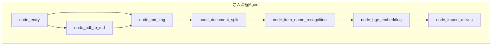
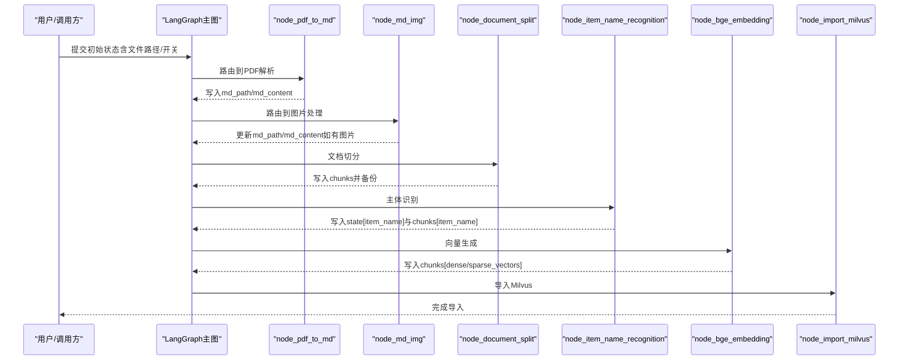
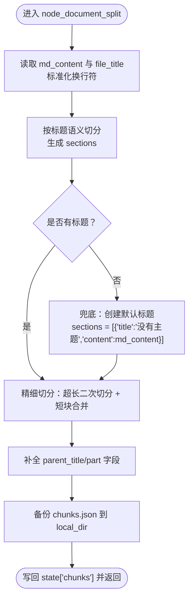
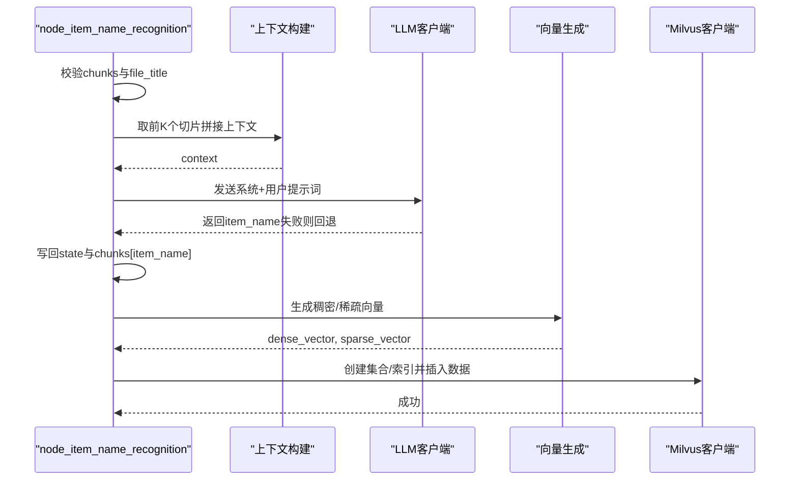

# 文档预处理

<cite>
**本文引用的文件**
- [node_document_split.py](file://app/import_process/agent/nodes/node_document_split.py)
- [node_item_name_recognition.py](file://app/import_process/agent/nodes/node_item_name_recognition.py)
- [main_graph.py](file://app/import_process/agent/main_graph.py)
- [state.py](file://app/import_process/agent/state.py)
- [node_pdf_to_md.py](file://app/import_process/agent/nodes/node_pdf_to_md.py)
- [node_md_img.py](file://app/import_process/agent/nodes/node_md_img.py)
- [embedding_utils.py](file://app/lm/embedding_utils.py)
- [load_prompt.py](file://app/core/load_prompt.py)
- [task_utils.py](file://app/utils/task_utils.py)
- [format_utils.py](file://app/utils/format_utils.py)
- [test_import_main_graph.py](file://app/test/test_import_main_graph.py)
</cite>

## 目录
1. [简介](#简介)
2. [项目结构](#项目结构)
3. [核心组件](#核心组件)
4. [架构总览](#架构总览)
5. [详细组件分析](#详细组件分析)
6. [依赖关系分析](#依赖关系分析)
7. [性能考量](#性能考量)
8. [故障排查指南](#故障排查指南)
9. [结论](#结论)
10. [附录](#附录)

## 简介
本文件聚焦“文档预处理”阶段，系统化梳理以下关键能力：
- node_document_split 节点的文档切分算法：包括基于标题的粗切、超长二次切分、短块合并、上下文保留与备份。
- node_item_name_recognition 节点的产品名称识别：基于上下文拼接与大模型抽取，结合稠密/稀疏向量生成与 Milvus 存储。
- 预处理过程中的文本清洗、格式标准化与数据验证步骤。
- 预处理节点之间的依赖关系与数据流转过程。
- 预处理效果示例与性能优化建议。

## 项目结构
预处理流程位于导入流程的 Agent 层，采用 LangGraph 状态机编排，节点之间通过 ImportGraphState 字段传递数据。

图表来源
- [main_graph.py:19-65](file://app/import_process/agent/main_graph.py#L19-L65)

章节来源
- [main_graph.py:19-65](file://app/import_process/agent/main_graph.py#L19-L65)

## 核心组件
- node_document_split：将 Markdown 文档按标题进行语义切分，处理无标题文档兜底，对超长块进行二次切分，对短块进行同父标题合并，最后备份 chunks 并写回状态。
- node_item_name_recognition：从前 K 个切片构建上下文，调用大模型抽取主体名称，为每个切片补充 item_name，并生成稠密/稀疏向量写入 Milvus。

章节来源
- [node_document_split.py:262-300](file://app/import_process/agent/nodes/node_document_split.py#L262-L300)
- [node_item_name_recognition.py:252-287](file://app/import_process/agent/nodes/node_item_name_recognition.py#L252-L287)

## 架构总览
预处理阶段的端到端流程如下：

图表来源
- [main_graph.py:30-61](file://app/import_process/agent/main_graph.py#L30-L61)
- [node_pdf_to_md.py:260-305](file://app/import_process/agent/nodes/node_pdf_to_md.py#L260-L305)
- [node_md_img.py:310-358](file://app/import_process/agent/nodes/node_md_img.py#L310-L358)
- [node_document_split.py:262-300](file://app/import_process/agent/nodes/node_document_split.py#L262-L300)
- [node_item_name_recognition.py:252-287](file://app/import_process/agent/nodes/node_item_name_recognition.py#L252-L287)
- [embedding_utils.py:51-96](file://app/lm/embedding_utils.py#L51-L96)

## 详细组件分析

### node_document_split 文档切分算法
- 输入：state['md_content']、state['file_title']
- 输出：state['chunks']（含 title、content、file_title、parent_title、part），并备份到 local_dir/chunks.json

核心步骤与策略
- 参数校验与换行标准化：确保 md_content 存在，统一换行符为 LF。
- 基于标题的语义粗切：
  - 使用正则识别标题行（排除代码块），按标题拆分段落，形成初步 sections。
  - 若无标题，兜底为单一标题“没有主题”，保证后续流程可用。
- 超长二次切分：
  - 对每个 section.content 超过 DEFAULT_MAX_CONTENT_LENGTH 的块，使用 RecursiveCharacterTextSplitter 进行二次切分。
  - 切分时优先使用段落、换行、中文句号、感叹号、分号、空格等分隔符，设置 chunk_overlap 控制重叠。
  - 生成子标题（原标题后缀“_1/_2/...”）与 part、parent_title 字段，保留语义边界。
- 短块合并：
  - 对长度小于 MIN_CONTENT_LENGTH 的相邻块，且 parent_title 相同，进行合并，减少碎片化。
- 属性补全与备份：
  - 为每个块补全 part 与 parent_title 字段，确保后续检索一致性。
  - 将最终 chunks 写入 local_dir/chunks.json，便于离线审计与重放。

图表来源
- [node_document_split.py:34-144](file://app/import_process/agent/nodes/node_document_split.py#L34-L144)
- [node_document_split.py:147-180](file://app/import_process/agent/nodes/node_document_split.py#L147-L180)
- [node_document_split.py:183-214](file://app/import_process/agent/nodes/node_document_split.py#L183-L214)
- [node_document_split.py:243-259](file://app/import_process/agent/nodes/node_document_split.py#L243-L259)
- [node_document_split.py:262-300](file://app/import_process/agent/nodes/node_document_split.py#L262-L300)

章节来源
- [node_document_split.py:16-31](file://app/import_process/agent/nodes/node_document_split.py#L16-L31)
- [node_document_split.py:34-48](file://app/import_process/agent/nodes/node_document_split.py#L34-L48)
- [node_document_split.py:51-144](file://app/import_process/agent/nodes/node_document_split.py#L51-L144)
- [node_document_split.py:147-180](file://app/import_process/agent/nodes/node_document_split.py#L147-L180)
- [node_document_split.py:183-214](file://app/import_process/agent/nodes/node_document_split.py#L183-L214)
- [node_document_split.py:243-259](file://app/import_process/agent/nodes/node_document_split.py#L243-L259)
- [node_document_split.py:262-300](file://app/import_process/agent/nodes/node_document_split.py#L262-L300)

### node_item_name_recognition 产品名称识别
- 输入：state['chunks']、state['file_title']（若缺失则从 md_path 推导）
- 输出：state['item_name'] 与 state['chunks'][i]['item_name']，并生成稠密/稀疏向量写入 Milvus

核心步骤与策略
- 数据准备：
  - 校验 chunks 存在；若 file_title 缺失，从 md_path 推导并回填。
- 上下文构建：
  - 从前 DEFAULT_ITEM_NAME_CHUNK_K 个切片拼接上下文，限制单切片长度与总长度，避免大模型上下文溢出。
- 大模型抽取：
  - 使用系统提示词与用户提示词组合，调用 LLM 抽取 item_name；若为空则回退为 file_title。
- 状态更新：
  - 将 item_name 写入 state 与每个切片的 item_name 字段，便于后续检索与去重。
- 向量生成与 Milvus 存储：
  - 使用 BGE-M3 生成稠密/稀疏向量，创建集合（若不存在）并建立索引，插入最新数据并加载集合。

图表来源
- [node_item_name_recognition.py:57-74](file://app/import_process/agent/nodes/node_item_name_recognition.py#L57-L74)
- [node_item_name_recognition.py:77-111](file://app/import_process/agent/nodes/node_item_name_recognition.py#L77-L111)
- [node_item_name_recognition.py:113-137](file://app/import_process/agent/nodes/node_item_name_recognition.py#L113-L137)
- [node_item_name_recognition.py:139-153](file://app/import_process/agent/nodes/node_item_name_recognition.py#L139-L153)
- [node_item_name_recognition.py:155-173](file://app/import_process/agent/nodes/node_item_name_recognition.py#L155-L173)
- [node_item_name_recognition.py:176-250](file://app/import_process/agent/nodes/node_item_name_recognition.py#L176-L250)

章节来源
- [node_item_name_recognition.py:34-54](file://app/import_process/agent/nodes/node_item_name_recognition.py#L34-L54)
- [node_item_name_recognition.py:57-74](file://app/import_process/agent/nodes/node_item_name_recognition.py#L57-L74)
- [node_item_name_recognition.py:77-111](file://app/import_process/agent/nodes/node_item_name_recognition.py#L77-L111)
- [node_item_name_recognition.py:113-137](file://app/import_process/agent/nodes/node_item_name_recognition.py#L113-L137)
- [node_item_name_recognition.py:139-153](file://app/import_process/agent/nodes/node_item_name_recognition.py#L139-L153)
- [node_item_name_recognition.py:155-173](file://app/import_process/agent/nodes/node_item_name_recognition.py#L155-L173)
- [node_item_name_recognition.py:176-250](file://app/import_process/agent/nodes/node_item_name_recognition.py#L176-L250)
- [node_item_name_recognition.py:252-287](file://app/import_process/agent/nodes/node_item_name_recognition.py#L252-L287)

### 文本清洗、格式标准化与数据验证
- 文本清洗与标准化
  - 统一换行符：将 Windows（CRLF）与老 Mac（CR）统一为 LF，避免跨平台差异影响切分。
  - 代码块识别：在按标题切分时，跳过代码块内的“# 标题”行，确保标题识别准确。
  - 图片处理：node_md_img 将本地图片上传至 MinIO，替换 Markdown 中的图片链接为网络地址，便于后续检索与可视化。
- 数据验证
  - 路径与文件存在性：node_pdf_to_md 在上传与轮询阶段进行严格校验，失败即抛异常，避免无效流程继续。
  - 状态字段完整性：各节点在关键步骤前校验必要字段（如 md_content、chunks、file_title），缺失则抛异常或回退。
  - 任务状态跟踪：通过 add_running_task/add_done_task 记录节点执行状态，便于监控与重试。

章节来源
- [node_document_split.py:40-48](file://app/import_process/agent/nodes/node_document_split.py#L40-L48)
- [node_document_split.py:104-134](file://app/import_process/agent/nodes/node_document_split.py#L104-L134)
- [node_md_img.py:73-96](file://app/import_process/agent/nodes/node_md_img.py#L73-L96)
- [node_pdf_to_md.py:64-93](file://app/import_process/agent/nodes/node_pdf_to_md.py#L64-L93)
- [node_pdf_to_md.py:277-303](file://app/import_process/agent/nodes/node_pdf_to_md.py#L277-L303)
- [task_utils.py:68-109](file://app/utils/task_utils.py#L68-L109)

## 依赖关系分析
- 节点依赖
  - node_pdf_to_md → node_md_img：PDF 解析完成后生成 md，再进行图片处理。
  - node_md_img → node_document_split：图片处理完成后进行文档切分。
  - node_document_split → node_item_name_recognition：切分完成后进行主体识别。
  - node_item_name_recognition → node_bge_embedding：识别完成后生成向量。
  - node_bge_embedding → node_import_milvus：向量生成完成后导入 Milvus。
- 状态依赖
  - ImportGraphState 作为统一载体，贯穿各节点读写，确保数据一致性。
  - 关键字段：md_content、md_path、file_title、chunks、item_name、embeddings_content 等。

图表来源
- [main_graph.py:56-61](file://app/import_process/agent/main_graph.py#L56-L61)

章节来源
- [main_graph.py:19-65](file://app/import_process/agent/main_graph.py#L19-L65)
- [state.py:5-41](file://app/import_process/agent/state.py#L5-L41)

## 性能考量
- 切分参数调优
  - DEFAULT_MAX_CONTENT_LENGTH：建议依据下游模型上下文窗口与检索目标动态调整，避免过长导致重算成本上升。
  - MIN_CONTENT_LENGTH：用于减少碎片化，建议与段落平均长度匹配，避免过度合并导致语义割裂。
  - chunk_overlap：重叠有助于上下文连续性，但会增加向量数量与存储开销，需权衡召回与性能。
- 大模型调用
  - 上下文截断：通过 DEFAULT_ITEM_NAME_CHUNK_K 与 SINGLE_CHUNK_CONTENT_MAX_LEN 控制单切片与总长度，避免超限。
  - 提示词加载：load_prompt 采用一次性读取与格式化，避免重复 IO。
- 向量生成
  - BGE-M3 单例模式：避免重复初始化，提升批量处理效率。
  - 稀疏向量格式：将 CSR 稀疏向量解析为字典列表，便于序列化与 Milvus 写入。
- I/O 与备份
  - chunks.json 备份：便于离线审计与重放，建议定期清理与归档。
  - MinIO/文件系统：图片处理与向量入库均涉及外部系统，建议配置合理的超时与重试策略。

章节来源
- [node_document_split.py:16-21](file://app/import_process/agent/nodes/node_document_split.py#L16-L21)
- [node_item_name_recognition.py:35-41](file://app/import_process/agent/nodes/node_item_name_recognition.py#L35-L41)
- [embedding_utils.py:8-48](file://app/lm/embedding_utils.py#L8-L48)
- [embedding_utils.py:51-96](file://app/lm/embedding_utils.py#L51-L96)
- [node_document_split.py:243-259](file://app/import_process/agent/nodes/node_document_split.py#L243-L259)

## 故障排查指南
- 常见异常与定位
  - md_content 为空：检查 node_pdf_to_md 是否成功读取 md_path 或是否在 node_md_img 中覆盖了 md_content。
  - chunks 为空：确认 node_document_split 是否正确识别标题或是否进行了兜底。
  - file_title 缺失：在 node_item_name_recognition 中会从 md_path 推导，若仍为空，需检查输入路径。
  - LLM 返回为空：检查提示词模板是否存在，以及模型调用是否成功。
  - Milvus 写入失败：检查集合创建与索引参数，确认连接与权限。
- 日志与状态
  - 使用 add_running_task/add_done_task 记录节点执行状态，结合 SSE 推送进度。
  - format_state/format_json 用于格式化输出，便于调试与审计。

章节来源
- [node_document_split.py:37-39](file://app/import_process/agent/nodes/node_document_split.py#L37-L39)
- [node_item_name_recognition.py:66-74](file://app/import_process/agent/nodes/node_item_name_recognition.py#L66-L74)
- [node_item_name_recognition.py:133-137](file://app/import_process/agent/nodes/node_item_name_recognition.py#L133-L137)
- [task_utils.py:68-109](file://app/utils/task_utils.py#L68-L109)
- [format_utils.py:11-31](file://app/utils/format_utils.py#L11-31)

## 结论
文档预处理阶段通过“标题语义切分 + 超长二次切分 + 短块合并”的策略，实现了高质量、可检索的文本切片；通过“上下文构建 + 大模型抽取 + 向量生成 + Milvus 存储”的闭环，为后续检索与知识图谱导入打下坚实基础。整体流程具备良好的可扩展性与可观测性，建议在生产环境中结合业务场景进一步调优切分参数与上下文长度，并完善异常重试与监控告警。

## 附录
- 预处理效果示例
  - 切分前：长文档按标题划分，部分段落较长。
  - 切分后：生成多个语义完整的 chunks，每个包含 parent_title、part、file_title 等元数据，并备份到 chunks.json。
  - 识别后：state['item_name'] 与每个切片的 item_name 字段填充，便于检索与去重。
- 流程验证
  - 通过 test_import_main_graph 可快速验证整条链路的执行顺序与最终状态。

章节来源
- [test_import_main_graph.py:8-26](file://app/test/test_import_main_graph.py#L8-L26)