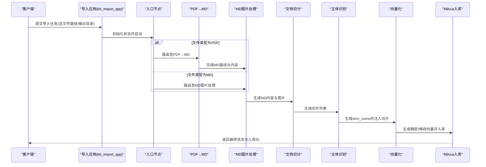
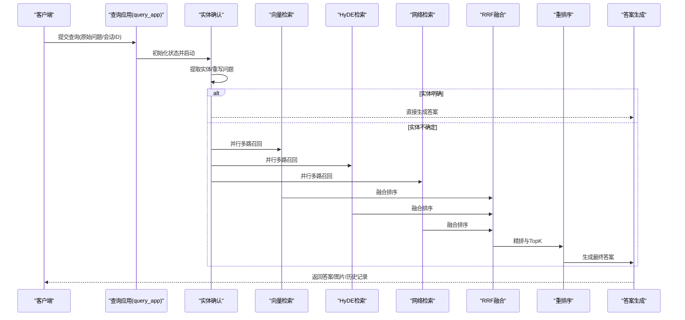
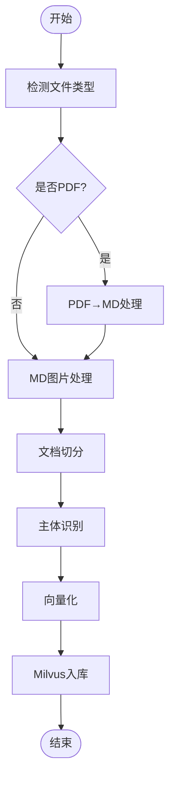
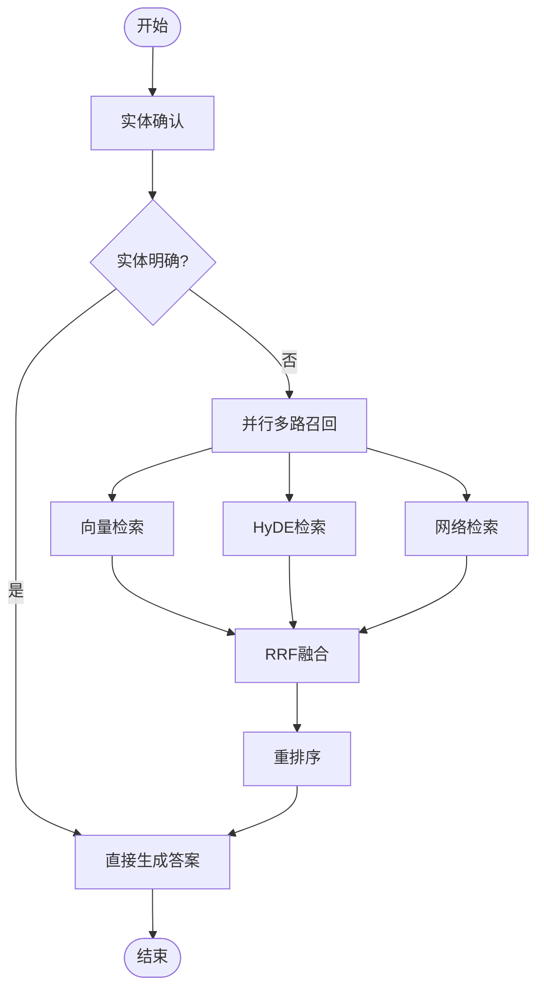
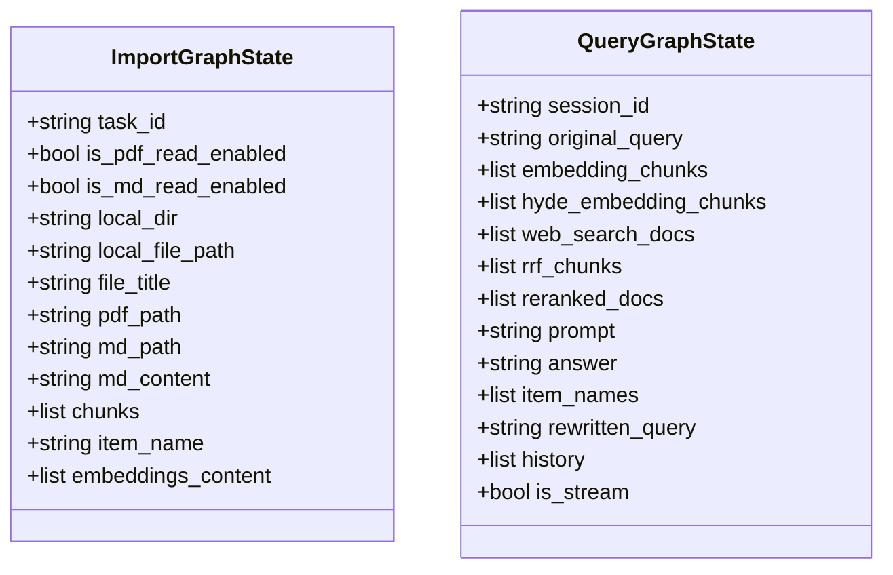
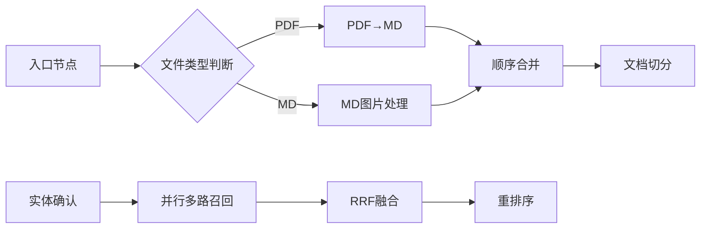
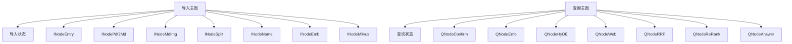

# 工作流架构设计

<cite>
**本文档引用的文件**
- [app/import_process/agent/main_graph.py](file://app/import_process/agent/main_graph.py)
- [app/query_process/agent/main_graph.py](file://app/query_process/agent/main_graph.py)
- [app/import_process/agent/state.py](file://app/import_process/agent/state.py)
- [app/query_process/agent/state.py](file://app/query_process/agent/state.py)
- [app/import_process/agent/nodes/node_entry.py](file://app/import_process/agent/nodes/node_entry.py)
- [app/import_process/agent/nodes/node_pdf_to_md.py](file://app/import_process/agent/nodes/node_pdf_to_md.py)
- [app/import_process/agent/nodes/node_md_img.py](file://app/import_process/agent/nodes/node_md_img.py)
- [app/import_process/agent/nodes/node_document_split.py](file://app/import_process/agent/nodes/node_document_split.py)
- [app/import_process/agent/nodes/node_item_name_recognition.py](file://app/import_process/agent/nodes/node_item_name_recognition.py)
- [app/import_process/agent/nodes/node_bge_embedding.py](file://app/import_process/agent/nodes/node_bge_embedding.py)
- [app/import_process/agent/nodes/node_import_milvus.py](file://app/import_process/agent/nodes/node_import_milvus.py)
- [app/query_process/agent/nodes/node_item_name_confirm.py](file://app/query_process/agent/nodes/node_item_name_confirm.py)
- [app/query_process/agent/nodes/node_search_embedding.py](file://app/query_process/agent/nodes/node_search_embedding.py)
- [app/query_process/agent/nodes/node_search_embedding_hyde.py](file://app/query_process/agent/nodes/node_search_embedding_hyde.py)
- [app/query_process/agent/nodes/node_web_search_mcp.py](file://app/query_process/agent/nodes/node_web_search_mcp.py)
- [app/query_process/agent/nodes/node_rrf.py](file://app/query_process/agent/nodes/node_rrf.py)
- [app/query_process/agent/nodes/node_rerank.py](file://app/query_process/agent/nodes/node_rerank.py)
- [app/query_process/agent/nodes/node_answer_output.py](file://app/query_process/agent/nodes/node_answer_output.py)
</cite>

## 目录
1. [引言](#引言)
2. [项目结构](#项目结构)
3. [核心组件](#核心组件)
4. [架构概览](#架构概览)
5. [详细组件分析](#详细组件分析)
6. [依赖关系分析](#依赖关系分析)
7. [性能考量](#性能考量)
8. [故障排查指南](#故障排查指南)
9. [结论](#结论)
10. [附录](#附录)

## 引言
本文件面向RAG Agent项目，系统化阐述基于LangGraph的工作流引擎应用，重点覆盖：
- 工作流节点设计与职责边界
- 状态管理机制与状态传递
- 节点间通信与条件路由
- 导入工作流与查询工作流的架构差异（并行处理、条件路由、错误处理）
- 状态对象设计原则（持久化与恢复思路）
- 生命周期管理（从启动到完成）

文档提供可视化图示帮助理解，涵盖导入与查询两条主线的流程图、状态转换图与类图。

## 项目结构
项目采用“按功能域分层”的组织方式：
- 导入流程域：负责文档解析、切分、向量化与Milvus入库
- 查询流程域：负责实体识别、多路召回、排序与答案生成
- 通用支撑：状态定义、工具与客户端封装、日志与任务状态上报

```mermaid
graph TB
subgraph "导入流程"
IMain["导入主图<br/>main_graph.py"]
IState["导入状态<br/>state.py"]
INodeEntry["入口节点<br/>node_entry.py"]
INodePdf2Md["PDF→MD<br/>node_pdf_to_md.py"]
INodeMdImg["MD图片处理<br/>node_md_img.py"]
INodeSplit["文档切分<br/>node_document_split.py"]
INodeName["主体识别<br/>node_item_name_recognition.py"]
INodeEmb["向量化<br/>node_bge_embedding.py"]
INodeMilvus["Milvus入库<br/>node_import_milvus.py"]
end
subgraph "查询流程"
QMain["查询主图<br/>main_graph.py"]
QState["查询状态<br/>state.py"]
QNodeConfirm["实体确认<br/>node_item_name_confirm.py"]
QNodeEmb["向量检索<br/>node_search_embedding.py"]
QNodeHyDE["HyDE检索<br/>node_search_embedding_hyde.py"]
QNodeWeb["网络检索<br/>node_web_search_mcp.py"]
QNodeRRF["RRF融合<br/>node_rrf.py"]
QNodeReRank["重排序<br/>node_rerank.py"]
QNodeAnswer["答案生成<br/>node_answer_output.py"]
end
IMain --> IState
IMain --> INodeEntry
INodeEntry --> INodePdf2Md
INodeEntry --> INodeMdImg
INodePdf2Md --> INodeMdImg
INodeMdImg --> INodeSplit
INodeSplit --> INodeName
INodeName --> INodeEmb
INodeEmb --> INodeMilvus
QMain --> QState
QMain --> QNodeConfirm
QNodeConfirm --> QNodeEmb
QNodeConfirm --> QNodeHyDE
QNodeConfirm --> QNodeWeb
QNodeEmb --> QNodeRRF
QNodeHyDE --> QNodeRRF
QNodeWeb --> QNodeRRF
QNodeRRF --> QNodeReRank
QNodeReRank --> QNodeAnswer
```

图表来源
- [app/import_process/agent/main_graph.py:19-65](file://app/import_process/agent/main_graph.py#L19-L65)
- [app/query_process/agent/main_graph.py:12-47](file://app/query_process/agent/main_graph.py#L12-L47)

章节来源
- [app/import_process/agent/main_graph.py:1-134](file://app/import_process/agent/main_graph.py#L1-L134)
- [app/query_process/agent/main_graph.py:1-47](file://app/query_process/agent/main_graph.py#L1-L47)

## 核心组件
- LangGraph工作流编排：通过StateGraph定义节点、边与条件路由，实现可控的流程控制与状态传递
- 状态对象（TypedDict）：以强类型约束承载跨节点共享数据，确保可维护性与可测试性
- 节点职责单一：每个节点聚焦特定能力（解析、检索、排序、生成），通过状态对象进行数据交换
- 并行与条件路由：导入流程在入口后根据文件类型并行分流；查询流程在实体确认后并行多路召回

章节来源
- [app/import_process/agent/state.py:5-90](file://app/import_process/agent/state.py#L5-L90)
- [app/query_process/agent/state.py:5-80](file://app/query_process/agent/state.py#L5-L80)

## 架构概览
LangGraph在本项目中承担“编排器”角色：
- 导入工作流：以入口节点为起点，依据文件类型选择PDF→MD或MD→图片处理路径，随后顺序执行切分、主体识别、向量化与Milvus入库
- 查询工作流：以实体确认为起点，根据是否明确实体决定直接输出或并行多路召回（向量、HyDE、网络），经RRF融合与重排序后生成答案

图表来源
- [app/import_process/agent/main_graph.py:30-62](file://app/import_process/agent/main_graph.py#L30-L62)
- [app/import_process/agent/nodes/node_entry.py:10-59](file://app/import_process/agent/nodes/node_entry.py#L10-L59)
- [app/import_process/agent/nodes/node_pdf_to_md.py:260-305](file://app/import_process/agent/nodes/node_pdf_to_md.py#L260-L305)
- [app/import_process/agent/nodes/node_md_img.py:310-358](file://app/import_process/agent/nodes/node_md_img.py#L310-L358)
- [app/import_process/agent/nodes/node_document_split.py:262-300](file://app/import_process/agent/nodes/node_document_split.py#L262-L300)
- [app/import_process/agent/nodes/node_item_name_recognition.py:252-287](file://app/import_process/agent/nodes/node_item_name_recognition.py#L252-L287)
- [app/import_process/agent/nodes/node_bge_embedding.py:10-84](file://app/import_process/agent/nodes/node_bge_embedding.py#L10-L84)
- [app/import_process/agent/nodes/node_import_milvus.py:114-149](file://app/import_process/agent/nodes/node_import_milvus.py#L114-L149)

图表来源
- [app/query_process/agent/main_graph.py:26-45](file://app/query_process/agent/main_graph.py#L26-L45)
- [app/query_process/agent/nodes/node_item_name_confirm.py:218-290](file://app/query_process/agent/nodes/node_item_name_confirm.py#L218-L290)
- [app/query_process/agent/nodes/node_search_embedding.py:12-72](file://app/query_process/agent/nodes/node_search_embedding.py#L12-L72)
- [app/query_process/agent/nodes/node_search_embedding_hyde.py:70-92](file://app/query_process/agent/nodes/node_search_embedding_hyde.py#L70-L92)
- [app/query_process/agent/nodes/node_web_search_mcp.py:54-90](file://app/query_process/agent/nodes/node_web_search_mcp.py#L54-L90)
- [app/query_process/agent/nodes/node_rrf.py:50-76](file://app/query_process/agent/nodes/node_rrf.py#L50-L76)
- [app/query_process/agent/nodes/node_rerank.py:162-208](file://app/query_process/agent/nodes/node_rerank.py#L162-L208)
- [app/query_process/agent/nodes/node_answer_output.py:214-249](file://app/query_process/agent/nodes/node_answer_output.py#L214-L249)

## 详细组件分析

### 导入工作流组件
- 入口节点：解析输入文件类型，设置状态标记（PDF/MD），并记录任务状态
- PDF→MD：校验路径、上传与轮询、下载与解压、MD路径与内容回填
- MD图片处理：扫描图片、调用视觉模型生成描述、上传MinIO并替换MD链接
- 文档切分：按标题语义切分、二次切分与短切片合并、备份切片
- 主体识别：抽取item_name、生成稠密/稀疏向量、写入向量库
- 向量化：批量生成BGE-M3向量，注入切片
- Milvus入库：创建集合、幂等清理、批量写入并回填chunk_id

图表来源
- [app/import_process/agent/main_graph.py:30-62](file://app/import_process/agent/main_graph.py#L30-L62)
- [app/import_process/agent/nodes/node_entry.py:10-59](file://app/import_process/agent/nodes/node_entry.py#L10-L59)
- [app/import_process/agent/nodes/node_pdf_to_md.py:260-305](file://app/import_process/agent/nodes/node_pdf_to_md.py#L260-L305)
- [app/import_process/agent/nodes/node_md_img.py:310-358](file://app/import_process/agent/nodes/node_md_img.py#L310-L358)
- [app/import_process/agent/nodes/node_document_split.py:262-300](file://app/import_process/agent/nodes/node_document_split.py#L262-L300)
- [app/import_process/agent/nodes/node_item_name_recognition.py:252-287](file://app/import_process/agent/nodes/node_item_name_recognition.py#L252-L287)
- [app/import_process/agent/nodes/node_bge_embedding.py:10-84](file://app/import_process/agent/nodes/node_bge_embedding.py#L10-L84)
- [app/import_process/agent/nodes/node_import_milvus.py:114-149](file://app/import_process/agent/nodes/node_import_milvus.py#L114-L149)

章节来源
- [app/import_process/agent/main_graph.py:19-65](file://app/import_process/agent/main_graph.py#L19-L65)
- [app/import_process/agent/nodes/node_entry.py:10-59](file://app/import_process/agent/nodes/node_entry.py#L10-L59)
- [app/import_process/agent/nodes/node_pdf_to_md.py:260-305](file://app/import_process/agent/nodes/node_pdf_to_md.py#L260-L305)
- [app/import_process/agent/nodes/node_md_img.py:310-358](file://app/import_process/agent/nodes/node_md_img.py#L310-L358)
- [app/import_process/agent/nodes/node_document_split.py:262-300](file://app/import_process/agent/nodes/node_document_split.py#L262-L300)
- [app/import_process/agent/nodes/node_item_name_recognition.py:252-287](file://app/import_process/agent/nodes/node_item_name_recognition.py#L252-L287)
- [app/import_process/agent/nodes/node_bge_embedding.py:10-84](file://app/import_process/agent/nodes/node_bge_embedding.py#L10-L84)
- [app/import_process/agent/nodes/node_import_milvus.py:114-149](file://app/import_process/agent/nodes/node_import_milvus.py#L114-L149)

### 查询工作流组件
- 实体确认：从历史与问题中提取实体、重写问题、向量库校验与打分、确定/可选实体集合
- 多路召回：向量检索、HyDE生成假设性答案并检索、网络检索（MCP）
- RRF融合：对同源多路结果进行倒数排名融合
- 重排序：交叉编码器精排，结合断崖阈值动态TopK
- 答案生成：组装提示词、模型生成、图片提取、历史记录写入

图表来源
- [app/query_process/agent/main_graph.py:26-45](file://app/query_process/agent/main_graph.py#L26-L45)
- [app/query_process/agent/nodes/node_item_name_confirm.py:218-290](file://app/query_process/agent/nodes/node_item_name_confirm.py#L218-L290)
- [app/query_process/agent/nodes/node_search_embedding.py:12-72](file://app/query_process/agent/nodes/node_search_embedding.py#L12-L72)
- [app/query_process/agent/nodes/node_search_embedding_hyde.py:70-92](file://app/query_process/agent/nodes/node_search_embedding_hyde.py#L70-L92)
- [app/query_process/agent/nodes/node_web_search_mcp.py:54-90](file://app/query_process/agent/nodes/node_web_search_mcp.py#L54-L90)
- [app/query_process/agent/nodes/node_rrf.py:50-76](file://app/query_process/agent/nodes/node_rrf.py#L50-L76)
- [app/query_process/agent/nodes/node_rerank.py:162-208](file://app/query_process/agent/nodes/node_rerank.py#L162-L208)
- [app/query_process/agent/nodes/node_answer_output.py:214-249](file://app/query_process/agent/nodes/node_answer_output.py#L214-L249)

章节来源
- [app/query_process/agent/main_graph.py:12-47](file://app/query_process/agent/main_graph.py#L12-L47)
- [app/query_process/agent/nodes/node_item_name_confirm.py:218-290](file://app/query_process/agent/nodes/node_item_name_confirm.py#L218-L290)
- [app/query_process/agent/nodes/node_rrf.py:50-76](file://app/query_process/agent/nodes/node_rrf.py#L50-L76)
- [app/query_process/agent/nodes/node_rerank.py:162-208](file://app/query_process/agent/nodes/node_rerank.py#L162-L208)
- [app/query_process/agent/nodes/node_answer_output.py:214-249](file://app/query_process/agent/nodes/node_answer_output.py#L214-L249)

### 状态对象设计与生命周期
- 导入状态（ImportGraphState）：包含任务ID、文件路径、MD内容、切片列表、向量内容、主体名称等，提供默认值与深拷贝工厂方法
- 查询状态（QueryGraphState）：包含会话ID、原始问题、各路检索结果、RRF融合结果、重排序结果、最终答案、历史与流式标记等，提供默认值与复制方法
- 生命周期：从初始化状态开始，节点按顺序读取/写入状态字段，异常时终止并记录错误；成功完成后返回最终状态供下游使用

图表来源
- [app/import_process/agent/state.py:5-90](file://app/import_process/agent/state.py#L5-L90)
- [app/query_process/agent/state.py:5-80](file://app/query_process/agent/state.py#L5-L80)

章节来源
- [app/import_process/agent/state.py:5-90](file://app/import_process/agent/state.py#L5-L90)
- [app/query_process/agent/state.py:5-80](file://app/query_process/agent/state.py#L5-L80)

### 并行处理机制与条件路由
- 导入流程：入口节点根据文件类型进行条件路由，PDF与MD路径并行执行，随后顺序连接
- 查询流程：实体确认后并行多路召回（向量、HyDE、网络），再统一融合与重排序

图表来源
- [app/import_process/agent/main_graph.py:30-62](file://app/import_process/agent/main_graph.py#L30-L62)
- [app/query_process/agent/main_graph.py:26-45](file://app/query_process/agent/main_graph.py#L26-L45)

章节来源
- [app/import_process/agent/main_graph.py:30-62](file://app/import_process/agent/main_graph.py#L30-L62)
- [app/query_process/agent/main_graph.py:26-45](file://app/query_process/agent/main_graph.py#L26-L45)

### 错误处理策略
- 节点级异常：节点内部捕获异常并记录日志，导入流程中多数异常会终止工作流；查询流程中部分节点（如网络检索）可降级处理
- 任务状态：通过任务工具记录开始/结束与结果，便于前端与监控系统感知
- 超时与重试：PDF解析轮询设置超时与重试策略，网络检索设置超时与最大重试次数

章节来源
- [app/import_process/agent/nodes/node_pdf_to_md.py:142-181](file://app/import_process/agent/nodes/node_pdf_to_md.py#L142-L181)
- [app/query_process/agent/nodes/node_web_search_mcp.py:16-52](file://app/query_process/agent/nodes/node_web_search_mcp.py#L16-L52)

## 依赖关系分析
- 节点对状态的依赖：所有节点均以状态对象为输入/输出，降低耦合
- 节点对工具与客户端的依赖：嵌入、检索、向量库、MinIO、MongoDB、MCP等通过统一工具模块访问
- 条件边与静态边：导入流程以条件边实现分支，查询流程以条件边决定直出或并行

图表来源
- [app/import_process/agent/main_graph.py:19-65](file://app/import_process/agent/main_graph.py#L19-L65)
- [app/query_process/agent/main_graph.py:12-47](file://app/query_process/agent/main_graph.py#L12-L47)

章节来源
- [app/import_process/agent/main_graph.py:19-65](file://app/import_process/agent/main_graph.py#L19-L65)
- [app/query_process/agent/main_graph.py:12-47](file://app/query_process/agent/main_graph.py#L12-L47)

## 性能考量
- 批量向量化：导入流程中向量化采用批处理，平衡吞吐与上下文窗口
- 动态TopK与断崖阈值：查询流程重排序阶段通过断崖阈值与相对/绝对阈值动态确定TopK，兼顾召回质量与响应时间
- 并行多路召回：查询流程在实体不明确时并行执行多路检索，缩短端到端延迟
- 资源隔离：PDF解析轮询与网络检索设置超时与重试，避免阻塞

## 故障排查指南
- 导入流程
  - PDF解析失败：检查文件路径、网络代理与轮询超时；查看MinIO/Milvus连接状态
  - MD图片处理异常：确认图片目录存在、MinIO上传权限与图片格式支持
  - 向量化失败：检查嵌入模型可用性与批大小
  - Milvus入库异常：检查集合创建、索引参数与幂等清理逻辑
- 查询流程
  - 实体确认失败：检查历史记录读取与向量库匹配；必要时放宽阈值
  - 多路召回异常：检查网络检索超时与MCP配置；向量检索关注集合与索引
  - 重排序异常：检查交叉编码器可用性与输入文本长度

章节来源
- [app/import_process/agent/nodes/node_pdf_to_md.py:96-181](file://app/import_process/agent/nodes/node_pdf_to_md.py#L96-L181)
- [app/import_process/agent/nodes/node_md_img.py:219-288](file://app/import_process/agent/nodes/node_md_img.py#L219-L288)
- [app/import_process/agent/nodes/node_import_milvus.py:18-92](file://app/import_process/agent/nodes/node_import_milvus.py#L18-L92)
- [app/query_process/agent/nodes/node_item_name_confirm.py:113-176](file://app/query_process/agent/nodes/node_item_name_confirm.py#L113-L176)
- [app/query_process/agent/nodes/node_web_search_mcp.py:16-52](file://app/query_process/agent/nodes/node_web_search_mcp.py#L16-L52)
- [app/query_process/agent/nodes/node_rerank.py:100-160](file://app/query_process/agent/nodes/node_rerank.py#L100-L160)

## 结论
本项目以LangGraph为核心，将复杂的RAG流程拆分为职责清晰的节点，通过TypedDict状态对象实现稳定的数据传递与可观测性。导入流程强调“文件类型驱动”的并行分支与顺序收敛，查询流程强调“实体驱动”的并行召回与精排。整体架构具备良好的扩展性与可维护性，适合在生产环境中持续演进。

## 附录
- 状态对象默认值与工厂方法：导入与查询状态均提供默认值与深拷贝工厂，便于测试与复用
- 任务状态上报：节点执行前后通过任务工具上报运行/完成状态，便于前端与监控系统跟踪

章节来源
- [app/import_process/agent/state.py:65-90](file://app/import_process/agent/state.py#L65-L90)
- [app/query_process/agent/state.py:55-80](file://app/query_process/agent/state.py#L55-L80)