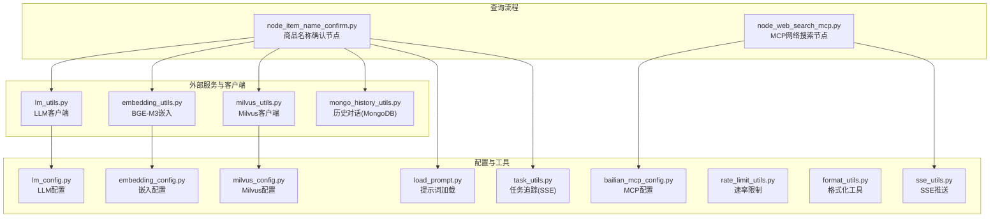
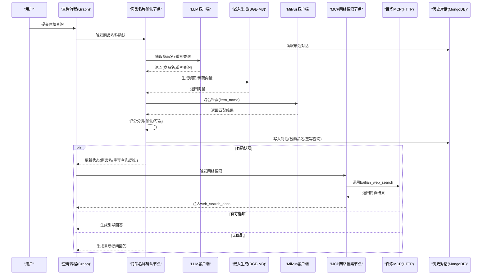
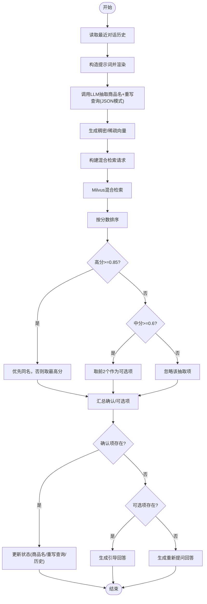
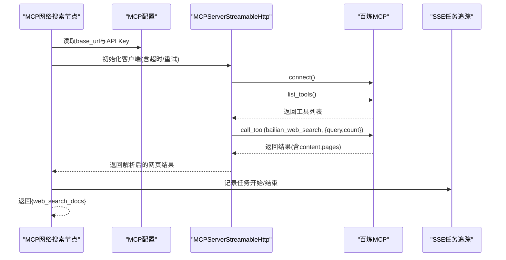
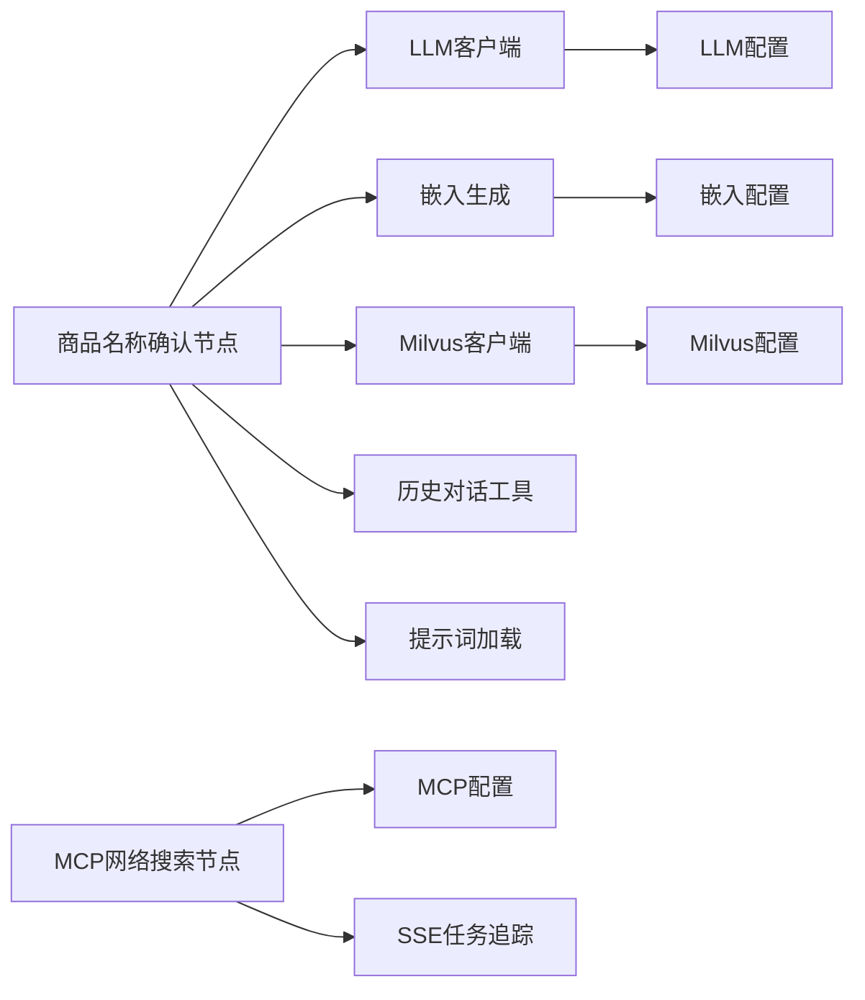

# 外部集成节点

<cite>
**本文引用的文件**
- [node_item_name_confirm.py](file://app/query_process/agent/nodes/node_item_name_confirm.py)
- [node_web_search_mcp.py](file://app/query_process/agent/nodes/node_web_search_mcp.py)
- [bailian_mcp_config.py](file://app/conf/bailian_mcp_config.py)
- [milvus_utils.py](file://app/clients/milvus_utils.py)
- [embedding_utils.py](file://app/lm/embedding_utils.py)
- [mongo_history_utils.py](file://app/clients/mongo_history_utils.py)
- [lm_utils.py](file://app/lm/lm_utils.py)
- [milvus_config.py](file://app/conf/milvus_config.py)
- [lm_config.py](file://app/conf/lm_config.py)
- [embedding_config.py](file://app/conf/embedding_config.py)
- [load_prompt.py](file://app/core/load_prompt.py)
- [task_utils.py](file://app/utils/task_utils.py)
- [rate_limit_utils.py](file://app/utils/rate_limit_utils.py)
- [format_utils.py](file://app/utils/format_utils.py)
- [sse_utils.py](file://app/utils/sse_utils.py)
</cite>

## 目录
1. [简介](#简介)
2. [项目结构](#项目结构)
3. [核心组件](#核心组件)
4. [架构总览](#架构总览)
5. [详细组件分析](#详细组件分析)
6. [依赖分析](#依赖分析)
7. [性能考量](#性能考量)
8. [故障排查指南](#故障排查指南)
9. [结论](#结论)
10. [附录](#附录)

## 简介
本技术文档聚焦“外部集成节点”模块，围绕两大外部能力展开：  
- 商品名称确认机制：结合大模型抽取与向量检索，实现实体识别与上下文匹配，形成“确认项/可选项”的二元决策闭环。  
- MCP 网络搜索集成：通过百炼（DashScope）MCP 的可流式 HTTP 客户端发起网络搜索，拉取网页结果并进行结构化解析，为下游检索与生成提供外部补充信息。

文档将从系统架构、数据流、处理逻辑、错误与降级策略、配置与安全等方面进行全面阐述，并提供可视化图示帮助读者快速理解。

## 项目结构
外部集成节点位于查询流程的 Agent 节点层，主要文件如下：
- 商品名称确认节点：负责从用户问题中抽取并确认核心商品名，必要时引导用户提供更明确的查询。
- MCP 网络搜索节点：负责调用外部搜索引擎，返回网页结果并注入到工作流状态中。

图表来源
- [node_item_name_confirm.py:1-317](file://app/query_process/agent/nodes/node_item_name_confirm.py#L1-L317)
- [node_web_search_mcp.py:1-113](file://app/query_process/agent/nodes/node_web_search_mcp.py#L1-L113)
- [bailian_mcp_config.py:1-19](file://app/conf/bailian_mcp_config.py#L1-L19)
- [milvus_utils.py:1-198](file://app/clients/milvus_utils.py#L1-L198)
- [embedding_utils.py:1-108](file://app/lm/embedding_utils.py#L1-L108)
- [mongo_history_utils.py:1-242](file://app/clients/mongo_history_utils.py#L1-L242)
- [lm_utils.py:1-99](file://app/lm/lm_utils.py#L1-L99)
- [milvus_config.py:1-26](file://app/conf/milvus_config.py#L1-L26)
- [lm_config.py:1-27](file://app/conf/lm_config.py#L1-L27)
- [embedding_config.py:1-24](file://app/conf/embedding_config.py#L1-L24)
- [load_prompt.py:1-43](file://app/core/load_prompt.py#L1-L43)
- [task_utils.py:1-187](file://app/utils/task_utils.py#L1-L187)
- [rate_limit_utils.py:1-37](file://app/utils/rate_limit_utils.py#L1-L37)
- [format_utils.py:1-56](file://app/utils/format_utils.py#L1-L56)
- [sse_utils.py:1-108](file://app/utils/sse_utils.py#L1-L108)

章节来源
- [node_item_name_confirm.py:1-317](file://app/query_process/agent/nodes/node_item_name_confirm.py#L1-L317)
- [node_web_search_mcp.py:1-113](file://app/query_process/agent/nodes/node_web_search_mcp.py#L1-L113)

## 核心组件
- 商品名称确认节点（item name confirm）
  - 功能：从用户问题与历史对话中抽取商品名，重写查询语句，借助 Milvus 向量库进行实体匹配，输出“确认项/可选项”，并更新工作流状态。
  - 关键步骤：LLM 抽取与重写、向量嵌入、混合检索、评分与分类、状态更新与回答生成。
- MCP 网络搜索节点（web search via MCP）
  - 功能：通过可流式 HTTP 客户端调用百炼 MCP 的网络搜索工具，解析返回的网页结果，注入到工作流状态中，供后续检索/生成使用。
  - 关键步骤：构建客户端、列出工具、调用搜索工具、解析结果、返回文档列表。

章节来源
- [node_item_name_confirm.py:218-290](file://app/query_process/agent/nodes/node_item_name_confirm.py#L218-L290)
- [node_web_search_mcp.py:54-91](file://app/query_process/agent/nodes/node_web_search_mcp.py#L54-L91)

## 架构总览
外部集成节点在查询流程中的位置与交互如下：

图表来源
- [node_item_name_confirm.py:218-290](file://app/query_process/agent/nodes/node_item_name_confirm.py#L218-L290)
- [node_web_search_mcp.py:54-91](file://app/query_process/agent/nodes/node_web_search_mcp.py#L54-L91)
- [milvus_utils.py:117-198](file://app/clients/milvus_utils.py#L117-L198)
- [embedding_utils.py:51-108](file://app/lm/embedding_utils.py#L51-L108)
- [mongo_history_utils.py:193-221](file://app/clients/mongo_history_utils.py#L193-L221)
- [lm_utils.py:17-73](file://app/lm/lm_utils.py#L17-L73)
- [bailian_mcp_config.py:15-18](file://app/conf/bailian_mcp_config.py#L15-L18)

## 详细组件分析

### 商品名称确认机制（实体识别与上下文匹配）
- 实体识别
  - LLM 从“历史对话 + 原始查询”中抽取商品名，采用 JSON 输出模式确保结构化返回。
  - 提示词通过模板加载器渲染，支持上下文拼接与动态变量替换。
- 上下文匹配策略
  - 将抽取的商品名转换为稠密/稀疏混合向量，使用 Milvus 的 AnnSearchRequest 构建混合检索请求。
  - 通过 WeightedRanker 对稠密与稀疏向量的得分进行加权融合，norm_score 控制评分归一化，提升稳定性。
  - 基于阈值对匹配结果进行分类：高分（≥0.85）取“确认项”，中分（≥0.6）取“可选项”，并优先选择与抽取名相同的项。
- 状态更新与回答生成
  - 若存在确认项：更新状态中的 item_names、rewritten_query、history，并清空 answer。
  - 若存在可选项：生成引导回答，提示用户明确商品名。
  - 若无匹配：生成重新提问回答，提示用户修正问题。

图表来源
- [node_item_name_confirm.py:23-47](file://app/query_process/agent/nodes/node_item_name_confirm.py#L23-L47)
- [node_item_name_confirm.py:50-110](file://app/query_process/agent/nodes/node_item_name_confirm.py#L50-L110)
- [node_item_name_confirm.py:113-176](file://app/query_process/agent/nodes/node_item_name_confirm.py#L113-L176)
- [node_item_name_confirm.py:179-216](file://app/query_process/agent/nodes/node_item_name_confirm.py#L179-L216)
- [milvus_utils.py:117-198](file://app/clients/milvus_utils.py#L117-L198)
- [embedding_utils.py:51-108](file://app/lm/embedding_utils.py#L51-L108)
- [load_prompt.py:5-28](file://app/core/load_prompt.py#L5-L28)

章节来源
- [node_item_name_confirm.py:23-47](file://app/query_process/agent/nodes/node_item_name_confirm.py#L23-L47)
- [node_item_name_confirm.py:50-110](file://app/query_process/agent/nodes/node_item_name_confirm.py#L50-L110)
- [node_item_name_confirm.py:113-176](file://app/query_process/agent/nodes/node_item_name_confirm.py#L113-L176)
- [node_item_name_confirm.py:179-216](file://app/query_process/agent/nodes/node_item_name_confirm.py#L179-L216)
- [milvus_utils.py:117-198](file://app/clients/milvus_utils.py#L117-L198)
- [embedding_utils.py:51-108](file://app/lm/embedding_utils.py#L51-L108)
- [mongo_history_utils.py:193-221](file://app/clients/mongo_history_utils.py#L193-L221)
- [load_prompt.py:5-28](file://app/core/load_prompt.py#L5-L28)

### MCP 网络搜索集成（外部 API 调用与结果处理）
- 客户端与认证
  - 使用可流式 HTTP 客户端，基于配置中的 base_url 与 API Key 进行连接与工具调用。
  - 支持重试与超时控制，确保在网络不稳定时具备一定的鲁棒性。
- 工具调用与结果解析
  - 列出可用工具后，调用 bailian_web_search 工具，传入重写后的查询与结果数量。
  - 解析返回的 content，提取 pages 列表作为网页结果文档，注入到工作流状态中。
- 流式与任务追踪
  - 节点执行前后通过任务追踪工具记录运行/完成状态，配合 SSE 推送进度。

图表来源
- [node_web_search_mcp.py:16-52](file://app/query_process/agent/nodes/node_web_search_mcp.py#L16-L52)
- [node_web_search_mcp.py:54-91](file://app/query_process/agent/nodes/node_web_search_mcp.py#L54-L91)
- [bailian_mcp_config.py:15-18](file://app/conf/bailian_mcp_config.py#L15-L18)
- [task_utils.py:68-109](file://app/utils/task_utils.py#L68-L109)

章节来源
- [node_web_search_mcp.py:16-52](file://app/query_process/agent/nodes/node_web_search_mcp.py#L16-L52)
- [node_web_search_mcp.py:54-91](file://app/query_process/agent/nodes/node_web_search_mcp.py#L54-L91)
- [bailian_mcp_config.py:15-18](file://app/conf/bailian_mcp_config.py#L15-L18)
- [task_utils.py:68-109](file://app/utils/task_utils.py#L68-L109)

### 多源信息融合（数据格式转换与冲突解决）
- 数据格式转换
  - 向量生成：BGE-M3 模型原生输出稠密向量与稀疏 CSR 向量，转换为可序列化格式（列表/字典），满足 Milvus 检索与接口返回需求。
  - 网页结果：从 MCP 返回的 JSON 文本中解析 pages 数组，统一为文档列表，字段包含标题、摘要、域名、链接等。
- 冲突解决
  - 商品名确认阶段：优先选择与抽取名相同的匹配项；若无同名，则选择分数最高的项，降低歧义。
  - 混合检索阶段：通过加权融合与归一化评分，平衡稠密与稀疏向量的差异，提升召回质量。
- 状态注入
  - 将 MCP 搜索结果以 web_search_docs 形式注入工作流状态，供后续节点使用。

章节来源
- [embedding_utils.py:51-108](file://app/lm/embedding_utils.py#L51-L108)
- [node_item_name_confirm.py:140-167](file://app/query_process/agent/nodes/node_item_name_confirm.py#L140-L167)
- [milvus_utils.py:174-195](file://app/clients/milvus_utils.py#L174-L195)
- [node_web_search_mcp.py:82-90](file://app/query_process/agent/nodes/node_web_search_mcp.py#L82-L90)

### 错误处理与降级策略
- LLM 客户端初始化异常
  - 当缺少 API Key 或基础地址时，抛出明确的配置缺失异常；模型初始化失败时，捕获 LangChain 异常并向上抛出，便于上层统一处理。
- 向量生成与 Milvus 检索异常
  - 向量生成阶段捕获异常并向上抛出，由调用方决定重试或降级；Milvus 混合检索失败时记录错误日志并返回 None，避免阻断流程。
- MCP 调用异常
  - 客户端连接/调用失败时，finally 中确保清理资源；返回结果解析失败时，记录日志并返回空结果，避免崩溃。
- 速率限制与降级
  - 提供通用滑动窗口速率限制器，跨调用复用请求时间戳队列，窗口内超限自动等待，防止触发第三方 API 限流。
- 日志与监控
  - 全流程记录调试/信息/错误日志，便于问题定位；SSE 推送任务进度，便于前端实时反馈。

章节来源
- [lm_utils.py:39-67](file://app/lm/lm_utils.py#L39-L67)
- [embedding_utils.py:94-96](file://app/lm/embedding_utils.py#L94-L96)
- [milvus_utils.py:194-198](file://app/clients/milvus_utils.py#L194-L198)
- [node_web_search_mcp.py:34-51](file://app/query_process/agent/nodes/node_web_search_mcp.py#L34-L51)
- [rate_limit_utils.py:7-37](file://app/utils/rate_limit_utils.py#L7-L37)

### 配置管理与安全
- 配置加载
  - 通过 dataclass 与环境变量加载，集中管理 MCP、Milvus、LLM、嵌入等配置，避免硬编码。
- 安全与密钥
  - API Key 通过环境变量注入，避免明文存储；MCP 客户端在请求头中携带 Authorization，确保访问受控。
- 环境隔离
  - .env 文件集中存放密钥与地址，不同环境可通过切换 .env 实现隔离；提示词路径与模型路径同样来自环境变量，便于灵活配置。

章节来源
- [bailian_mcp_config.py:15-18](file://app/conf/bailian_mcp_config.py#L15-L18)
- [milvus_config.py:21-26](file://app/conf/milvus_config.py#L21-L26)
- [lm_config.py:20-26](file://app/conf/lm_config.py#L20-L26)
- [embedding_config.py:18-24](file://app/conf/embedding_config.py#L18-L24)
- [node_web_search_mcp.py:23-31](file://app/query_process/agent/nodes/node_web_search_mcp.py#L23-L31)

## 依赖分析
- 组件耦合
  - 商品名称确认节点依赖 LLM 客户端、嵌入生成、Milvus 客户端、历史对话工具与提示词加载器，耦合度较高但职责清晰。
  - MCP 网络搜索节点依赖 MCP 配置与 SSE 任务追踪，与外部服务耦合通过客户端抽象降低。
- 外部依赖
  - Milvus：提供混合向量检索能力。
  - 百炼 MCP：提供可流式 HTTP 搜索工具。
  - MongoDB：持久化对话历史。
- 循环依赖
  - 未发现直接循环依赖；各模块通过工具函数与配置类解耦。

图表来源
- [node_item_name_confirm.py:10-18](file://app/query_process/agent/nodes/node_item_name_confirm.py#L10-L18)
- [node_web_search_mcp.py:9,12-13:9-13](file://app/query_process/agent/nodes/node_web_search_mcp.py#L9-L13)
- [lm_utils.py:9,17-73:9-73](file://app/lm/lm_utils.py#L9-L73)
- [embedding_utils.py:1-4](file://app/lm/embedding_utils.py#L1-L4)
- [milvus_utils.py:2-4](file://app/clients/milvus_utils.py#L2-L4)
- [bailian_mcp_config.py:10-18](file://app/conf/bailian_mcp_config.py#L10-L18)
- [lm_config.py:12-26](file://app/conf/lm_config.py#L12-L26)
- [embedding_config.py:9-24](file://app/conf/embedding_config.py#L9-L24)
- [milvus_config.py:12-26](file://app/conf/milvus_config.py#L12-L26)
- [load_prompt.py:1-4](file://app/core/load_prompt.py#L1-L4)
- [task_utils.py:1-3](file://app/utils/task_utils.py#L1-L3)

章节来源
- [node_item_name_confirm.py:10-18](file://app/query_process/agent/nodes/node_item_name_confirm.py#L10-L18)
- [node_web_search_mcp.py:9,12-13:9-13](file://app/query_process/agent/nodes/node_web_search_mcp.py#L9-L13)
- [lm_utils.py:9,17-73:9-73](file://app/lm/lm_utils.py#L9-L73)
- [embedding_utils.py:1-4](file://app/lm/embedding_utils.py#L1-L4)
- [milvus_utils.py:2-4](file://app/clients/milvus_utils.py#L2-L4)
- [bailian_mcp_config.py:10-18](file://app/conf/bailian_mcp_config.py#L10-L18)
- [lm_config.py:12-26](file://app/conf/lm_config.py#L12-L26)
- [embedding_config.py:9-24](file://app/conf/embedding_config.py#L9-L24)
- [milvus_config.py:12-26](file://app/conf/milvus_config.py#L12-L26)
- [load_prompt.py:1-4](file://app/core/load_prompt.py#L1-L4)
- [task_utils.py:1-3](file://app/utils/task_utils.py#L1-L3)

## 性能考量
- 向量生成与检索
  - BGE-M3 模型单例与原生 L2 归一化，减少重复初始化与提升检索效率。
  - 混合检索使用 WeightedRanker 与归一化评分，兼顾召回与稳定性。
- 网络搜索
  - 可流式 HTTP 客户端支持超时与重试，降低网络抖动影响。
- 速率限制
  - 滑动窗口限流器避免触发第三方 API 限流，保障稳定吞吐。
- 日志与监控
  - 详细的日志记录与 SSE 进度推送，便于性能观测与问题定位。

## 故障排查指南
- LLM 客户端初始化失败
  - 检查 OPENAI_API_KEY 与 OPENAI_BASE_URL 是否正确配置；查看异常堆栈定位具体原因。
- 向量生成异常
  - 检查 BGE_M3_PATH/BGE_DEVICE/BGE_FP16 等嵌入配置；确认模型加载路径与设备可用性。
- Milvus 混合检索失败
  - 检查 MILVUS_URL 与集合名配置；确认 dense_vector/sparse_vector 字段与检索参数。
- MCP 调用失败
  - 检查 MCP_DASHSCOPE_BASE_URL_STREAMABLE 与 OPENAI_API_KEY；确认网络连通性与工具权限。
- 任务追踪与 SSE
  - 检查任务队列与 SSE 会话状态，确认进度推送是否正常。

章节来源
- [lm_utils.py:39-67](file://app/lm/lm_utils.py#L39-L67)
- [embedding_utils.py:94-96](file://app/lm/embedding_utils.py#L94-L96)
- [milvus_utils.py:194-198](file://app/clients/milvus_utils.py#L194-L198)
- [node_web_search_mcp.py:34-51](file://app/query_process/agent/nodes/node_web_search_mcp.py#L34-L51)
- [task_utils.py:174-179](file://app/utils/task_utils.py#L174-L179)

## 结论
外部集成节点通过“商品名称确认 + MCP 网络搜索”的组合，实现了从上下文理解到外部信息补充的闭环。其设计强调：
- 结构化抽取与稳健匹配：LLM + 向量检索 + 阈值分类，确保实体识别的准确性与可解释性。
- 外部服务集成：MCP 可流式 HTTP 客户端与统一配置，简化外部 API 调用与结果处理。
- 可靠性与可观测性：完善的异常处理、速率限制与日志/SSE 推送，保障线上稳定运行。

## 附录
- 相关工具与格式化
  - JSON 格式化工具：提供统一的 JSON 序列化与格式化能力，便于日志与接口输出一致性。
  - SSE 工具：提供会话队列、事件打包与异步生成器，支撑前端实时进度展示。

章节来源
- [format_utils.py:11-54](file://app/utils/format_utils.py#L11-L54)
- [sse_utils.py:54-108](file://app/utils/sse_utils.py#L54-L108)