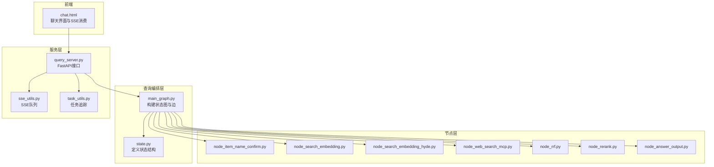
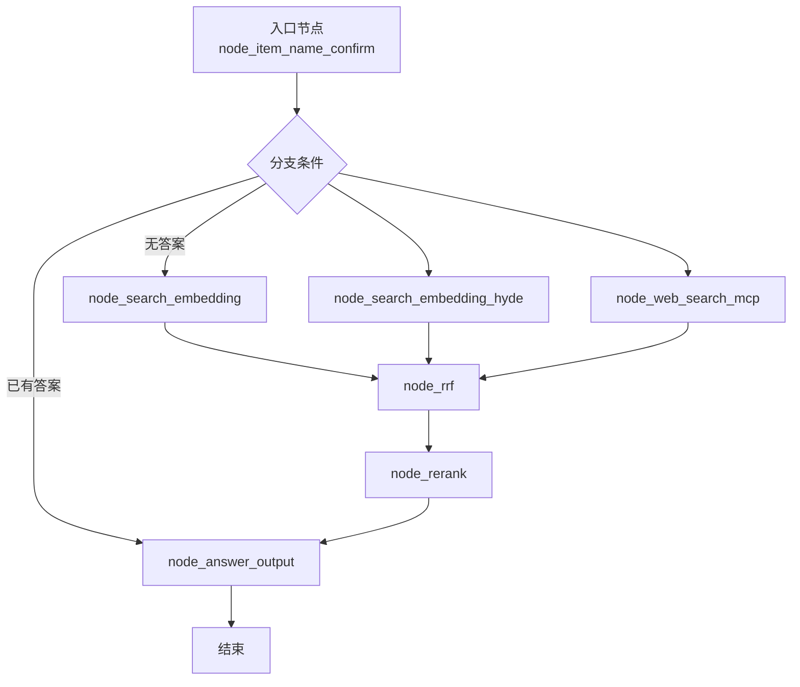
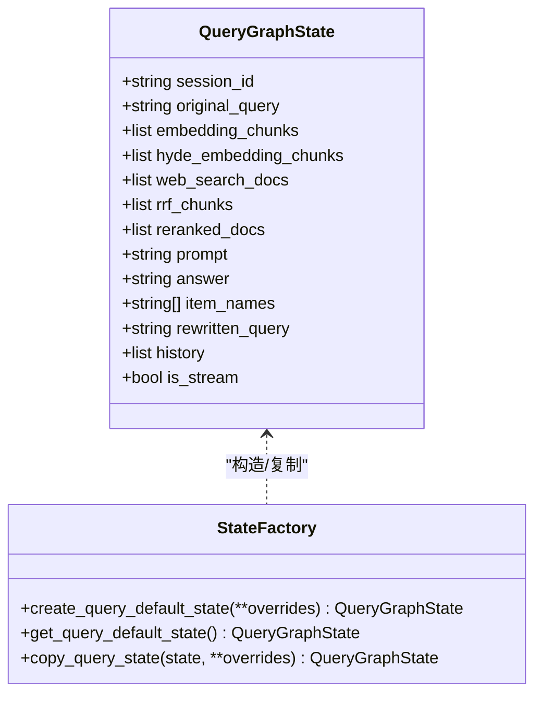
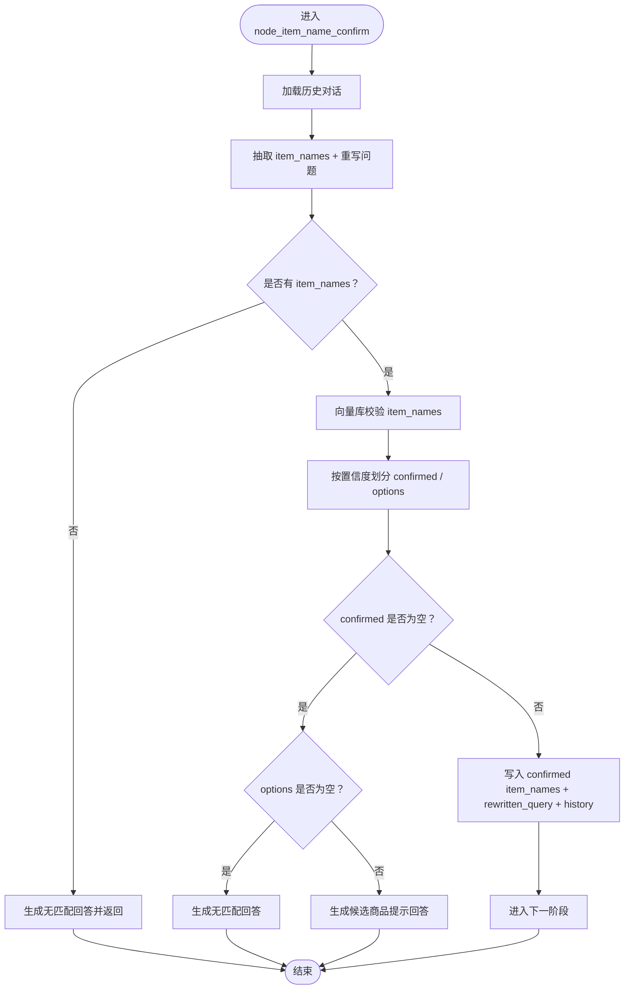
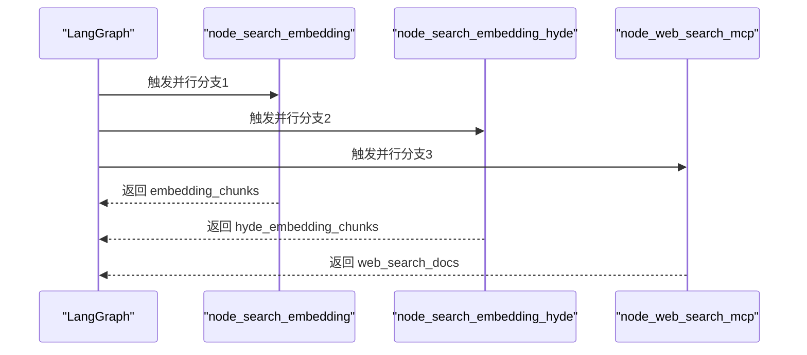
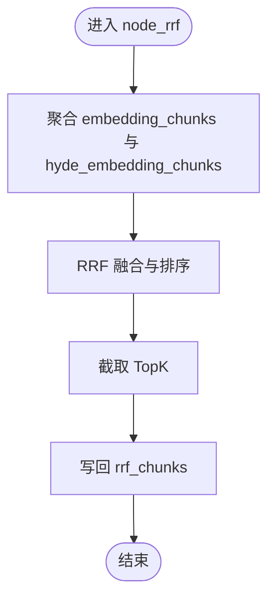
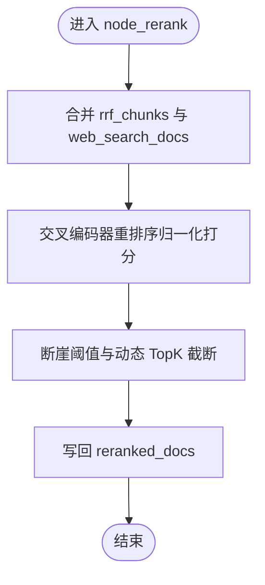
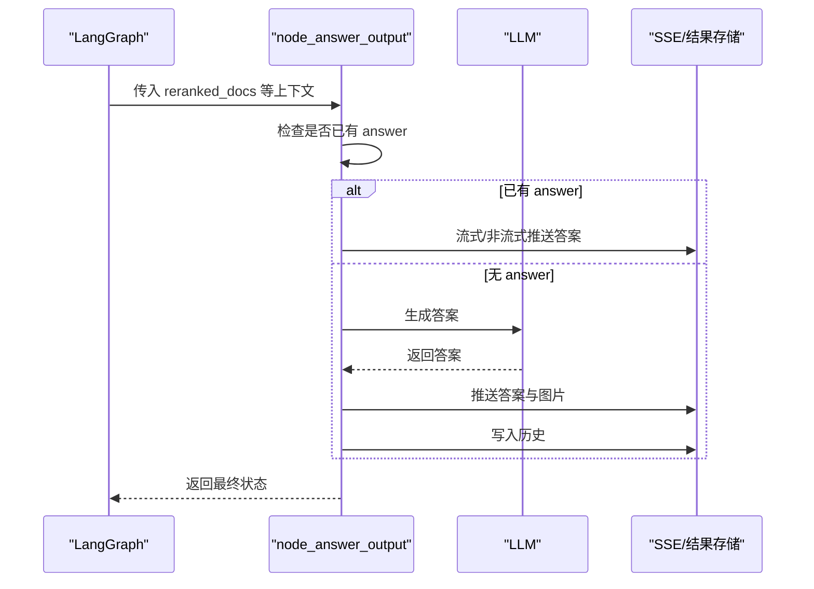
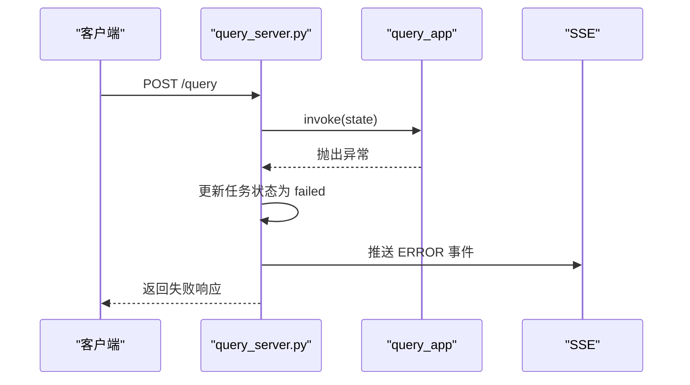
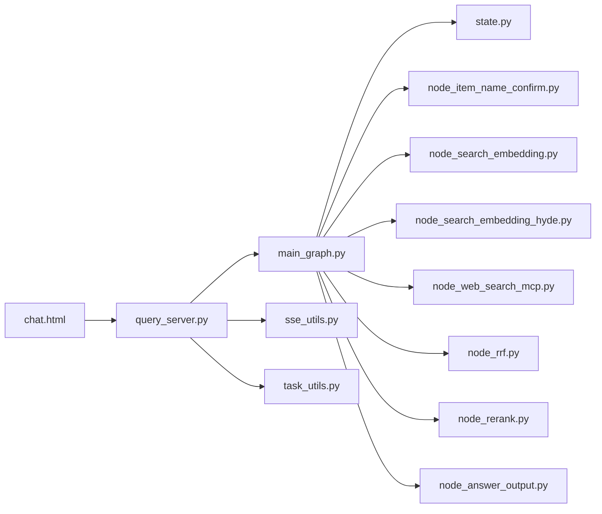

# 查询工作流架构

<cite>
**本文档引用的文件**
- [main_graph.py](file://app/query_process/agent/main_graph.py)
- [state.py](file://app/query_process/agent/state.py)
- [node_item_name_confirm.py](file://app/query_process/agent/nodes/node_item_name_confirm.py)
- [node_search_embedding.py](file://app/query_process/agent/nodes/node_search_embedding.py)
- [node_search_embedding_hyde.py](file://app/query_process/agent/nodes/node_search_embedding_hyde.py)
- [node_web_search_mcp.py](file://app/query_process/agent/nodes/node_web_search_mcp.py)
- [node_rrf.py](file://app/query_process/agent/nodes/node_rrf.py)
- [node_rerank.py](file://app/query_process/agent/nodes/node_rerank.py)
- [node_answer_output.py](file://app/query_process/agent/nodes/node_answer_output.py)
- [query_server.py](file://app/query_process/api/query_server.py)
- [task_utils.py](file://app/utils/task_utils.py)
- [sse_utils.py](file://app/utils/sse_utils.py)
- [chat.html](file://app/query_process/page/chat.html)
- [test_query_main_graph.py](file://app/test/test_query_main_graph.py)
</cite>

## 目录
1. [简介](#简介)
2. [项目结构](#项目结构)
3. [核心组件](#核心组件)
4. [架构总览](#架构总览)
5. [详细组件分析](#详细组件分析)
6. [依赖关系分析](#依赖关系分析)
7. [性能考量](#性能考量)
8. [故障排查指南](#故障排查指南)
9. [结论](#结论)
10. [附录](#附录)

## 简介
本文件面向查询工作流的核心架构，基于 LangGraph 实现的有向无环图（DAG）式状态机，系统化阐述节点间的连接关系、数据流转机制、状态管理策略、并行处理设计、错误处理与异常恢复，以及查询流程图与架构图，帮助读者快速理解并高效维护该查询系统。

## 项目结构
查询工作流位于 app/query_process/agent 目录下，采用“状态驱动 + 节点函数”的模块化设计：
- main_graph.py：定义状态图、节点与边，构建查询流程编排
- state.py：定义 QueryGraphState 数据结构及默认状态工厂
- nodes/：各节点实现，分别负责不同阶段的检索、排序与生成
- api/query_server.py：对外提供查询接口与 SSE 流式输出
- utils/：任务追踪与 SSE 工具，支撑前端进度与流式交互

图表来源
- [main_graph.py:12-47](file://app/query_process/agent/main_graph.py#L12-L47)
- [state.py:5-97](file://app/query_process/agent/state.py#L5-L97)
- [query_server.py:17-164](file://app/query_process/api/query_server.py#L17-L164)
- [sse_utils.py:17-108](file://app/utils/sse_utils.py#L17-L108)
- [task_utils.py:1-187](file://app/utils/task_utils.py#L1-L187)
- [chat.html:300-800](file://app/query_process/page/chat.html#L300-L800)

章节来源
- [main_graph.py:12-47](file://app/query_process/agent/main_graph.py#L12-L47)
- [state.py:5-97](file://app/query_process/agent/state.py#L5-L97)
- [query_server.py:17-164](file://app/query_process/api/query_server.py#L17-L164)

## 核心组件
- 状态图与编排：通过 StateGraph 定义节点与条件边，形成“确认商品名 → 并行检索 → 融合排序 → 重排序 → 生成答案”的主干流程
- 状态结构：QueryGraphState 以 TypedDict 描述贯穿全流程的数据载体，包含检索中间态、排序中间态、生成中间态与辅助信息
- 节点函数：每个节点聚焦单一职责，通过返回字典更新状态，实现链式数据传递
- 服务与流式：query_server.py 提供同步/异步查询接口，结合 SSE 与任务追踪，实现前端进度与答案流式输出

章节来源
- [main_graph.py:12-47](file://app/query_process/agent/main_graph.py#L12-L47)
- [state.py:5-97](file://app/query_process/agent/state.py#L5-L97)
- [query_server.py:56-113](file://app/query_process/api/query_server.py#L56-L113)

## 架构总览
查询工作流采用“状态驱动 + 并行检索 + 融合排序 + 精排 + 生成”的流水线式设计。LangGraph 作为编排引擎，将节点函数串联为有向图，并通过条件边实现分支与汇聚。

图表来源
- [main_graph.py:24-45](file://app/query_process/agent/main_graph.py#L24-L45)

## 详细组件分析

### 状态管理机制
- 状态定义：QueryGraphState 以 TypedDict 声明字段，涵盖会话标识、原始问题、检索中间态、排序中间态、生成中间态、辅助信息等
- 默认状态：提供默认状态字典与工厂函数，支持覆盖与深拷贝，保证并发安全
- 状态复制：提供 copy_query_state，便于在分支与汇聚场景中隔离状态副本
- 上下文保持：通过 history、rewritten_query、item_names 等字段在节点间传递上下文，确保检索与生成的一致性

图表来源
- [state.py:5-97](file://app/query_process/agent/state.py#L5-L97)

章节来源
- [state.py:5-97](file://app/query_process/agent/state.py#L5-L97)

### 节点与数据流

#### 商品名确认与问题重写（node_item_name_confirm）
- 输入：original_query、history
- 处理：抽取 item_names、重写问题 rewritten_query；向量库校验 item_names，生成 confirmed 与 optional 集合
- 输出：更新 item_names、rewritten_query、history；若无明确 item_names，则直接生成 answer 并短路至输出节点

图表来源
- [node_item_name_confirm.py:218-290](file://app/query_process/agent/nodes/node_item_name_confirm.py#L218-L290)

章节来源
- [node_item_name_confirm.py:218-290](file://app/query_process/agent/nodes/node_item_name_confirm.py#L218-L290)

#### 并行检索（向量检索、HyDE、网络搜索）
- 向量检索（node_search_embedding）：基于 rewritten_query 与 item_names，生成稠密/稀疏向量，混合查询 Milvus，返回 embedding_chunks
- HyDE（node_search_embedding_hyde）：先由 LLM 生成假设性答案，再将“问题+假设性答案”向量化混合检索，返回 hyde_embedding_chunks
- 网络搜索（node_web_search_mcp）：通过 MCP 工具调用外部搜索引擎，返回 web_search_docs

图表来源
- [main_graph.py:26-44](file://app/query_process/agent/main_graph.py#L26-L44)
- [node_search_embedding.py:12-72](file://app/query_process/agent/nodes/node_search_embedding.py#L12-L72)
- [node_search_embedding_hyde.py:70-92](file://app/query_process/agent/nodes/node_search_embedding_hyde.py#L70-L92)
- [node_web_search_mcp.py:54-90](file://app/query_process/agent/nodes/node_web_search_mcp.py#L54-L90)

章节来源
- [node_search_embedding.py:12-72](file://app/query_process/agent/nodes/node_search_embedding.py#L12-L72)
- [node_search_embedding_hyde.py:70-92](file://app/query_process/agent/nodes/node_search_embedding_hyde.py#L70-L92)
- [node_web_search_mcp.py:54-90](file://app/query_process/agent/nodes/node_web_search_mcp.py#L54-L90)

#### 同源融合与排序（RRF）
- 输入：embedding_chunks、hyde_embedding_chunks
- 处理：对两路召回结果进行 Reciprocal Rank Fusion（RRF），按权重融合并排序，取 TopK
- 输出：rrf_chunks 写回状态

图表来源
- [node_rrf.py:50-76](file://app/query_process/agent/nodes/node_rrf.py#L50-L76)

章节来源
- [node_rrf.py:50-76](file://app/query_process/agent/nodes/node_rrf.py#L50-L76)

#### 多路融合与精排（Rerank + TopK）
- 输入：rrf_chunks、web_search_docs
- 处理：将本地与网络结果统一为文档列表，使用交叉编码器（Cross-Encoder）重排序，归一化打分后采用断崖阈值策略动态截断 TopK
- 输出：reranked_docs 写回状态

图表来源
- [node_rerank.py:162-208](file://app/query_process/agent/nodes/node_rerank.py#L162-L208)

章节来源
- [node_rerank.py:162-208](file://app/query_process/agent/nodes/node_rerank.py#L162-L208)

#### 答案生成与输出（node_answer_output）
- 输入：reranked_docs、rewritten_query、item_names、history、is_stream
- 处理：若状态已有 answer（来自商品名确认阶段），直接流式或非流式输出；否则组装提示词，调用 LLM 生成答案，提取图片链接，写入历史
- 输出：answer、image_urls（通过 SSE 推送）

图表来源
- [node_answer_output.py:214-249](file://app/query_process/agent/nodes/node_answer_output.py#L214-L249)

章节来源
- [node_answer_output.py:214-249](file://app/query_process/agent/nodes/node_answer_output.py#L214-L249)

### 并行处理架构
- 分支条件：在“确认商品名”节点后，若已有 answer 则短路输出；否则三条并行路径同时启动：向量检索、HyDE、网络搜索
- 汇聚策略：三条路径均完成后，统一进入 RRF 融合与重排序，最终汇聚到答案生成节点
- 上下文一致性：通过 rewritten_query、item_names、history 在各节点共享，保证检索与生成语义一致

章节来源
- [main_graph.py:26-44](file://app/query_process/agent/main_graph.py#L26-L44)

### 错误处理与异常恢复
- 服务层异常：query_server.py 在 run_query_graph 中捕获异常，更新任务状态为 failed，并通过 SSE 推送 ERROR 事件
- 节点层异常：各节点内部未显式捕获异常，交由 LangGraph 与服务层统一处理
- 前端感知：前端通过 SSE 接收 ERROR 事件，显示失败状态与错误信息

图表来源
- [query_server.py:56-76](file://app/query_process/api/query_server.py#L56-L76)
- [sse_utils.py:43-53](file://app/utils/sse_utils.py#L43-L53)

章节来源
- [query_server.py:56-76](file://app/query_process/api/query_server.py#L56-L76)
- [sse_utils.py:43-53](file://app/utils/sse_utils.py#L43-L53)

## 依赖关系分析
- LangGraph 依赖：main_graph.py 通过 StateGraph 构建节点与边，依赖各节点函数与状态结构
- 工具与服务：query_server.py 依赖 task_utils 与 sse_utils，实现任务状态与 SSE 推送
- 前端集成：chat.html 通过 SSE 与轮询接口消费进度与结果

图表来源
- [main_graph.py:12-47](file://app/query_process/agent/main_graph.py#L12-L47)
- [query_server.py:17-164](file://app/query_process/api/query_server.py#L17-L164)
- [task_utils.py:1-187](file://app/utils/task_utils.py#L1-L187)
- [sse_utils.py:17-108](file://app/utils/sse_utils.py#L17-L108)
- [chat.html:300-800](file://app/query_process/page/chat.html#L300-L800)

章节来源
- [main_graph.py:12-47](file://app/query_process/agent/main_graph.py#L12-L47)
- [query_server.py:17-164](file://app/query_process/api/query_server.py#L17-L164)

## 性能考量
- 并行检索：三条检索路径并行执行，显著降低端到端延迟
- 动态 TopK：Rerank 后采用断崖阈值策略，避免无效文档参与生成，提升生成质量与效率
- 流式输出：SSE 支持增量返回，改善用户体验
- 上下文裁剪：答案生成阶段对上下文长度进行限制，避免超出模型上下文窗口

## 故障排查指南
- 无商品名匹配：检查 node_item_name_confirm 的历史加载与向量库校验逻辑，确认 item_names 是否被正确抽取与匹配
- 检索结果为空：核对 rewritten_query 与 item_names 的生成与传递，检查 Milvus 查询条件与集合配置
- 答案生成异常：确认 reranked_docs 是否存在，检查提示词组装与 LLM 调用；关注流式输出是否中断
- SSE 无进度：检查 task_utils 的任务状态更新与 sse_utils 的队列创建与推送逻辑
- 服务异常：查看 query_server 的异常捕获与 ERROR 事件推送

章节来源
- [node_item_name_confirm.py:218-290](file://app/query_process/agent/nodes/node_item_name_confirm.py#L218-L290)
- [node_search_embedding.py:12-72](file://app/query_process/agent/nodes/node_search_embedding.py#L12-L72)
- [node_rerank.py:162-208](file://app/query_process/agent/nodes/node_rerank.py#L162-L208)
- [node_answer_output.py:214-249](file://app/query_process/agent/nodes/node_answer_output.py#L214-L249)
- [task_utils.py:68-109](file://app/utils/task_utils.py#L68-L109)
- [sse_utils.py:43-53](file://app/utils/sse_utils.py#L43-L53)
- [query_server.py:56-76](file://app/query_process/api/query_server.py#L56-L76)

## 结论
该查询工作流以 LangGraph 为核心，通过状态驱动与并行检索实现高效、可扩展的问答管线。状态结构清晰、节点职责单一、并行汇聚策略合理，配合 SSE 与任务追踪，实现了良好的用户体验与可观测性。建议在生产环境中进一步完善节点内部异常捕获与重试策略，以增强鲁棒性。

## 附录
- 流程可视化：可通过测试脚本输出图结构 ASCII 可视化，便于理解节点与边的关系
- 前端交互：chat.html 提供流式与非流式两种模式，支持进度展示与图片渲染

章节来源
- [test_query_main_graph.py:14-25](file://app/test/test_query_main_graph.py#L14-L25)
- [chat.html:300-800](file://app/query_process/page/chat.html#L300-L800)