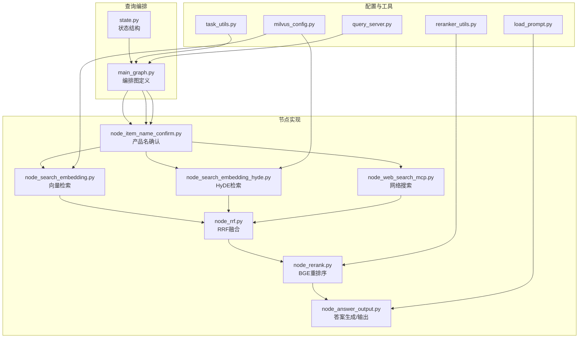
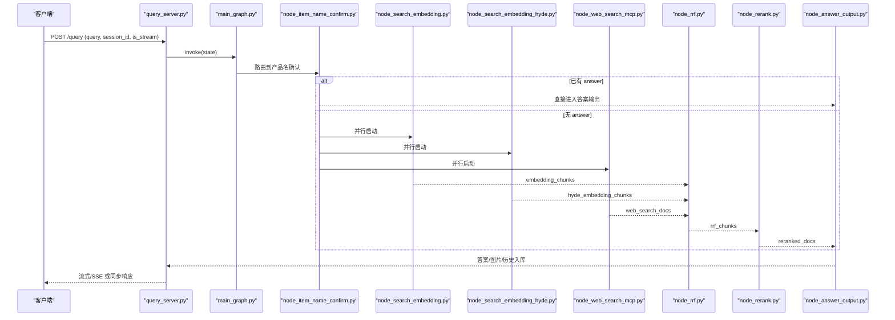
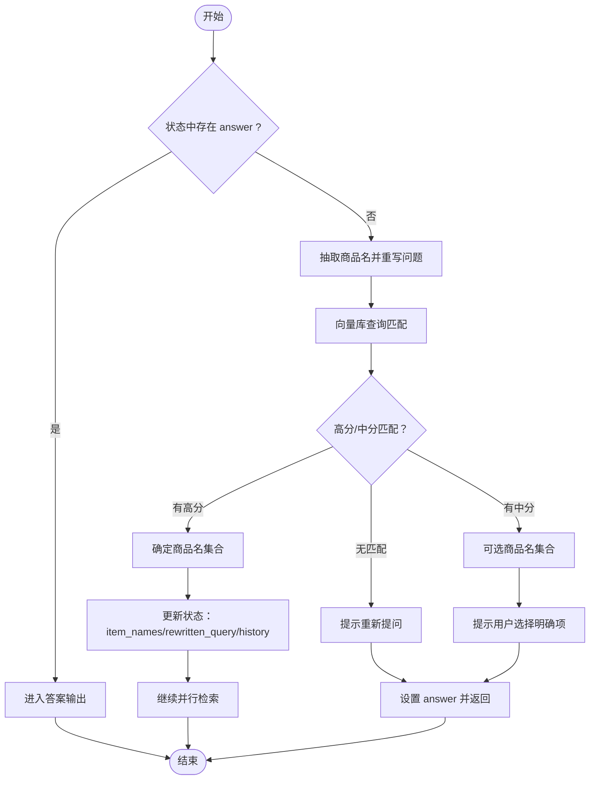
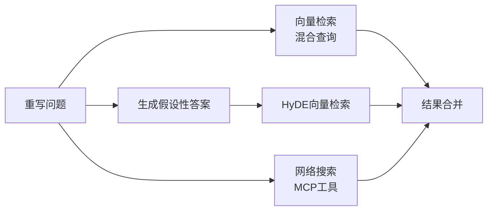
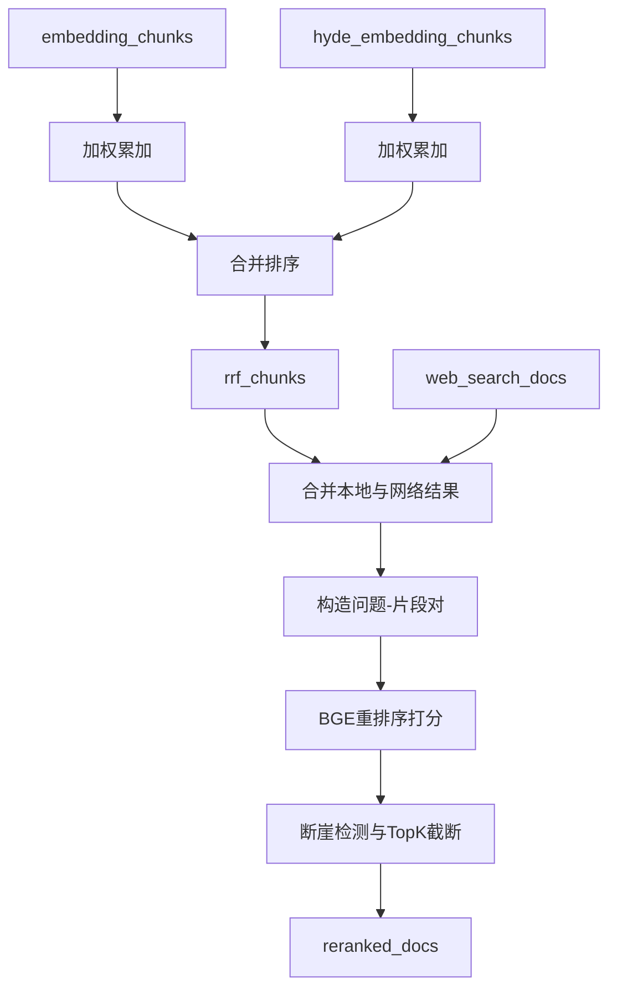
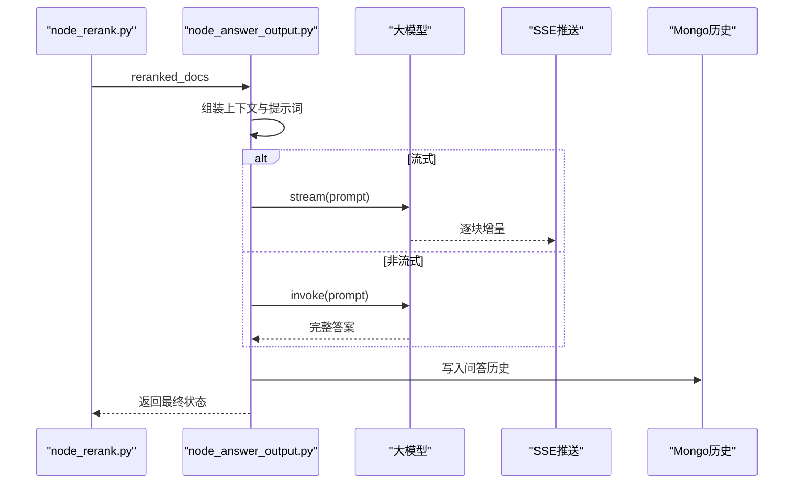
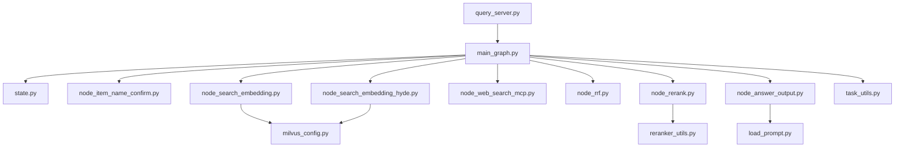

# 查询工作流设计

<cite>
**本文引用的文件**
- [main_graph.py](file://app/query_process/agent/main_graph.py)
- [state.py](file://app/query_process/agent/state.py)
- [node_item_name_confirm.py](file://app/query_process/agent/nodes/node_item_name_confirm.py)
- [node_search_embedding.py](file://app/query_process/agent/nodes/node_search_embedding.py)
- [node_search_embedding_hyde.py](file://app/query_process/agent/nodes/node_search_embedding_hyde.py)
- [node_web_search_mcp.py](file://app/query_process/agent/nodes/node_web_search_mcp.py)
- [node_rrf.py](file://app/query_process/agent/nodes/node_rrf.py)
- [node_rerank.py](file://app/query_process/agent/nodes/node_rerank.py)
- [node_answer_output.py](file://app/query_process/agent/nodes/node_answer_output.py)
- [milvus_config.py](file://app/conf/milvus_config.py)
- [reranker_utils.py](file://app/lm/reranker_utils.py)
- [task_utils.py](file://app/utils/task_utils.py)
- [load_prompt.py](file://app/core/load_prompt.py)
- [query_server.py](file://app/query_process/api/query_server.py)
</cite>

## 目录
1. [引言](#引言)
2. [项目结构](#项目结构)
3. [核心组件](#核心组件)
4. [架构总览](#架构总览)
5. [详细组件分析](#详细组件分析)
6. [依赖分析](#依赖分析)
7. [性能考量](#性能考量)
8. [故障排查指南](#故障排查指南)
9. [结论](#结论)
10. [附录](#附录)

## 引言
本设计文档围绕 RAG Agent 的智能查询工作流展开，系统性阐述并行检索与融合排序的架构设计、条件路由机制、HyDE 检索、混合检索策略、BGE 重排序与 RRF 融合算法，以及查询状态管理与上下文保持机制。文档提供流程图与并行处理示意，帮助读者快速理解端到端查询优化策略。

## 项目结构
查询工作流由状态定义、节点实现与编排图组成，采用 LangGraph 构建有向无环图（DAG），支持并行分支与条件路由。主要模块如下：
- 状态定义：统一承载会话、中间结果与最终输出
- 节点实现：按阶段拆分，职责单一
- 编排图：定义节点间的连接与条件边
- API 层：对外提供查询接口与 SSE 流式输出

图表来源
- [main_graph.py:12-47](file://app/query_process/agent/main_graph.py#L12-L47)
- [state.py:5-97](file://app/query_process/agent/state.py#L5-L97)
- [node_item_name_confirm.py:218-290](file://app/query_process/agent/nodes/node_item_name_confirm.py#L218-L290)
- [node_search_embedding.py:12-72](file://app/query_process/agent/nodes/node_search_embedding.py#L12-L72)
- [node_search_embedding_hyde.py:70-92](file://app/query_process/agent/nodes/node_search_embedding_hyde.py#L70-L92)
- [node_web_search_mcp.py:54-90](file://app/query_process/agent/nodes/node_web_search_mcp.py#L54-L90)
- [node_rrf.py:50-76](file://app/query_process/agent/nodes/node_rrf.py#L50-L76)
- [node_rerank.py:162-208](file://app/query_process/agent/nodes/node_rerank.py#L162-L208)
- [node_answer_output.py:214-249](file://app/query_process/agent/nodes/node_answer_output.py#L214-L249)
- [milvus_config.py:14-26](file://app/conf/milvus_config.py#L14-L26)
- [reranker_utils.py:6-14](file://app/lm/reranker_utils.py#L6-L14)
- [task_utils.py:68-109](file://app/utils/task_utils.py#L68-L109)
- [load_prompt.py:5-28](file://app/core/load_prompt.py#L5-L28)
- [query_server.py:56-112](file://app/query_process/api/query_server.py#L56-L112)

章节来源
- [main_graph.py:12-47](file://app/query_process/agent/main_graph.py#L12-L47)
- [state.py:5-97](file://app/query_process/agent/state.py#L5-L97)
- [query_server.py:56-112](file://app/query_process/api/query_server.py#L56-L112)

## 核心组件
- 查询状态结构：统一承载会话标识、原始问题、中间检索结果、融合与重排序结果、最终提示词与答案、商品名、重写问题、历史对话与流式标记等
- 节点职责：
  - 产品名确认：抽取并校验商品名，必要时引导用户提供明确项
  - 多源检索：普通向量检索、HyDE 假设性文档检索、网络搜索
  - 融合排序：同源 RRFRRF 融合，跨源合并后 BGE 重排序
  - 答案生成：组装上下文与提示词，调用大模型生成答案，支持流式与非流式输出
- 条件路由：基于状态中的 answer 字段决定是否短路输出，否则并行启动三路检索

章节来源
- [state.py:5-97](file://app/query_process/agent/state.py#L5-L97)
- [main_graph.py:26-44](file://app/query_process/agent/main_graph.py#L26-L44)
- [node_item_name_confirm.py:218-290](file://app/query_process/agent/nodes/node_item_name_confirm.py#L218-L290)
- [node_answer_output.py:214-249](file://app/query_process/agent/nodes/node_answer_output.py#L214-L249)

## 架构总览
查询工作流采用“条件路由 + 并行检索 + 融合排序 + 精排 + 生成输出”的流水线式设计。LangGraph 编排图定义了节点之间的连接与条件边，确保在产品名确认阶段即可短路输出，否则并行执行三路检索，随后统一进入 RRF 融合与 BGE 重排序，最终由答案生成节点产出结果并通过 SSE 或同步接口返回。

图表来源
- [query_server.py:56-112](file://app/query_process/api/query_server.py#L56-L112)
- [main_graph.py:26-44](file://app/query_process/agent/main_graph.py#L26-L44)
- [node_item_name_confirm.py:218-290](file://app/query_process/agent/nodes/node_item_name_confirm.py#L218-L290)
- [node_search_embedding.py:12-72](file://app/query_process/agent/nodes/node_search_embedding.py#L12-L72)
- [node_search_embedding_hyde.py:70-92](file://app/query_process/agent/nodes/node_search_embedding_hyde.py#L70-L92)
- [node_web_search_mcp.py:54-90](file://app/query_process/agent/nodes/node_web_search_mcp.py#L54-L90)
- [node_rrf.py:50-76](file://app/query_process/agent/nodes/node_rrf.py#L50-L76)
- [node_rerank.py:162-208](file://app/query_process/agent/nodes/node_rerank.py#L162-L208)
- [node_answer_output.py:214-249](file://app/query_process/agent/nodes/node_answer_output.py#L214-L249)

## 详细组件分析

### 条件路由与产品名确认
- 路由逻辑：若状态中已有 answer，则直接进入答案输出；否则并行启动三路检索
- 商品名确认流程：
  - 基于历史对话与当前问题，抽取商品名并重写问题
  - 对抽取的商品名进行向量检索，按置信度划分“确定”与“可选”
  - 若仅有“确定”，更新状态并继续；若有“可选”，提示用户明确项；否则提示重新提问

图表来源
- [main_graph.py:26-38](file://app/query_process/agent/main_graph.py#L26-L38)
- [node_item_name_confirm.py:218-290](file://app/query_process/agent/nodes/node_item_name_confirm.py#L218-L290)

章节来源
- [main_graph.py:26-38](file://app/query_process/agent/main_graph.py#L26-L38)
- [node_item_name_confirm.py:218-290](file://app/query_process/agent/nodes/node_item_name_confirm.py#L218-L290)

### 多源信息检索与混合策略
- 普通向量检索：对重写问题生成稠密/稀疏向量，结合商品名过滤表达式进行混合检索
- HyDE 检索：先由大模型生成假设性答案，再对“问题+假设性答案”进行向量检索，提升语义召回
- 网络搜索：通过 MCP 工具调用外部搜索引擎，补充跨域信息

图表来源
- [node_search_embedding.py:12-72](file://app/query_process/agent/nodes/node_search_embedding.py#L12-L72)
- [node_search_embedding_hyde.py:70-92](file://app/query_process/agent/nodes/node_search_embedding_hyde.py#L70-L92)
- [node_web_search_mcp.py:54-90](file://app/query_process/agent/nodes/node_web_search_mcp.py#L54-L90)

章节来源
- [node_search_embedding.py:12-72](file://app/query_process/agent/nodes/node_search_embedding.py#L12-L72)
- [node_search_embedding_hyde.py:70-92](file://app/query_process/agent/nodes/node_search_embedding_hyde.py#L70-L92)
- [node_web_search_mcp.py:54-90](file://app/query_process/agent/nodes/node_web_search_mcp.py#L54-L90)

### RRF 融合与 BGE 重排序
- 同源融合（RRF）：对向量检索与 HyDE 检索结果进行倒数排名融合，按权重累加并排序，得到候选 TopK
- 跨源合并与精排：将本地 RRF 结果与网络搜索结果合并，使用 BGE 重排序模型对“问题-片段”对进行交叉编码打分，动态确定 TopK

图表来源
- [node_rrf.py:50-76](file://app/query_process/agent/nodes/node_rrf.py#L50-L76)
- [node_rerank.py:162-208](file://app/query_process/agent/nodes/node_rerank.py#L162-L208)

章节来源
- [node_rrf.py:50-76](file://app/query_process/agent/nodes/node_rrf.py#L50-L76)
- [node_rerank.py:162-208](file://app/query_process/agent/nodes/node_rerank.py#L162-L208)

### 答案生成与上下文保持
- 上下文组装：限制提示词长度，按重排序分数裁剪本地与网络片段，拼接历史对话与商品名
- 生成与输出：支持流式（SSE）与非流式两种模式，最终将答案与图片链接写入历史记录

图表来源
- [node_rerank.py:162-208](file://app/query_process/agent/nodes/node_rerank.py#L162-L208)
- [node_answer_output.py:214-249](file://app/query_process/agent/nodes/node_answer_output.py#L214-L249)

章节来源
- [node_answer_output.py:214-249](file://app/query_process/agent/nodes/node_answer_output.py#L214-L249)

### 查询状态管理与上下文保持
- 状态结构：统一承载会话、原始问题、各阶段中间结果、最终答案与辅助信息
- 状态复制：提供深拷贝与覆盖更新能力，保证并行分支互不干扰
- 任务追踪：记录运行中与已完成节点，支持进度推送与结果存储

章节来源
- [state.py:5-97](file://app/query_process/agent/state.py#L5-L97)
- [task_utils.py:68-109](file://app/utils/task_utils.py#L68-L109)

## 依赖分析
- 编排与节点耦合：编排图集中定义连接关系，节点内部职责清晰，耦合度低
- 外部依赖：
  - 向量库：Milvus，通过混合检索与权重控制召回质量
  - 重排序：BGE 重排序模型，提供交叉编码打分
  - 网络搜索：MCP 工具链，调用 DashScope 网络搜索
  - 任务与 SSE：统一的任务状态与进度推送机制

图表来源
- [main_graph.py:12-47](file://app/query_process/agent/main_graph.py#L12-L47)
- [milvus_config.py:14-26](file://app/conf/milvus_config.py#L14-L26)
- [reranker_utils.py:6-14](file://app/lm/reranker_utils.py#L6-L14)
- [task_utils.py:68-109](file://app/utils/task_utils.py#L68-L109)
- [load_prompt.py:5-28](file://app/core/load_prompt.py#L5-L28)
- [query_server.py:56-112](file://app/query_process/api/query_server.py#L56-L112)

章节来源
- [main_graph.py:12-47](file://app/query_process/agent/main_graph.py#L12-L47)
- [milvus_config.py:14-26](file://app/conf/milvus_config.py#L14-L26)
- [reranker_utils.py:6-14](file://app/lm/reranker_utils.py#L6-L14)
- [task_utils.py:68-109](file://app/utils/task_utils.py#L68-L109)
- [load_prompt.py:5-28](file://app/core/load_prompt.py#L5-L28)
- [query_server.py:56-112](file://app/query_process/api/query_server.py#L56-L112)

## 性能考量
- 并行检索：三路检索并行执行，显著降低端到端延迟
- 融合与截断：RRF 同源融合与 BGE 精排配合断崖检测，减少无效计算
- 上下文裁剪：限制提示词长度，平衡召回与生成成本
- 任务追踪：通过进度队列与状态更新，便于监控与调试

## 故障排查指南
- 产品名确认失败：检查抽取与向量库匹配逻辑，确认商品名集合是否为空
- 检索无结果：核对 Milvus 配置与集合名称，确认混合检索表达式与权重
- 重排序异常：检查 BGE 模型路径与设备配置，确认输入对齐
- 答案生成失败：确认提示词模板加载与上下文拼接，检查流式/非流式分支
- 任务状态异常：通过任务追踪接口查看运行与完成节点列表，定位卡顿环节

章节来源
- [node_item_name_confirm.py:218-290](file://app/query_process/agent/nodes/node_item_name_confirm.py#L218-L290)
- [node_search_embedding.py:12-72](file://app/query_process/agent/nodes/node_search_embedding.py#L12-L72)
- [node_search_embedding_hyde.py:70-92](file://app/query_process/agent/nodes/node_search_embedding_hyde.py#L70-L92)
- [node_web_search_mcp.py:54-90](file://app/query_process/agent/nodes/node_web_search_mcp.py#L54-L90)
- [node_rerank.py:162-208](file://app/query_process/agent/nodes/node_rerank.py#L162-L208)
- [node_answer_output.py:214-249](file://app/query_process/agent/nodes/node_answer_output.py#L214-L249)
- [task_utils.py:68-109](file://app/utils/task_utils.py#L68-L109)

## 结论
该查询工作流通过“条件路由 + 并行检索 + RRF 融合 + BGE 精排 + 答案生成”的闭环设计，在保证召回质量的同时兼顾效率与可维护性。状态驱动与任务追踪机制确保了上下文一致性与可观测性，适用于复杂场景下的智能问答需求。

## 附录
- API 接口：健康检查、聊天页、发起查询、SSE 流、历史查询与清理
- 配置要点：Milvus 集合名称、BGE 重排序模型路径与设备、MCP 基础地址与密钥

章节来源
- [query_server.py:32-161](file://app/query_process/api/query_server.py#L32-L161)
- [milvus_config.py:14-26](file://app/conf/milvus_config.py#L14-L26)
- [reranker_config.py:10-21](file://app/conf/reranker_config.py#L10-L21)
- [bailian_mcp_config.py:10-18](file://app/conf/bailian_mcp_config.py#L10-L18)