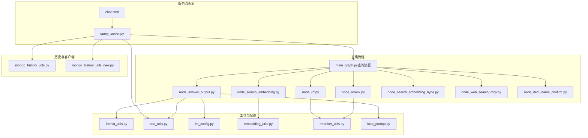
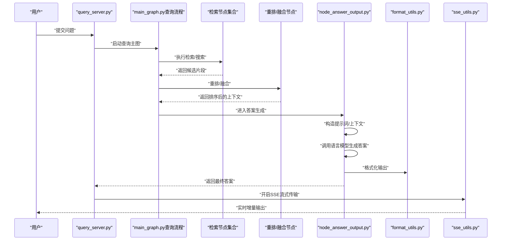
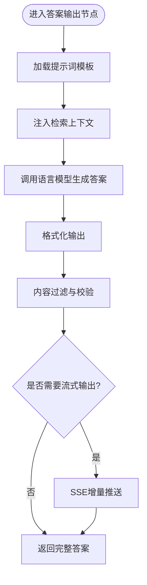
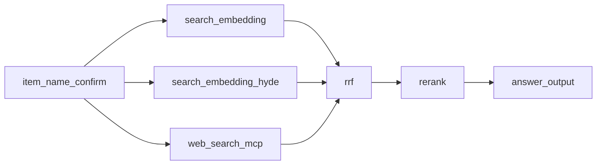
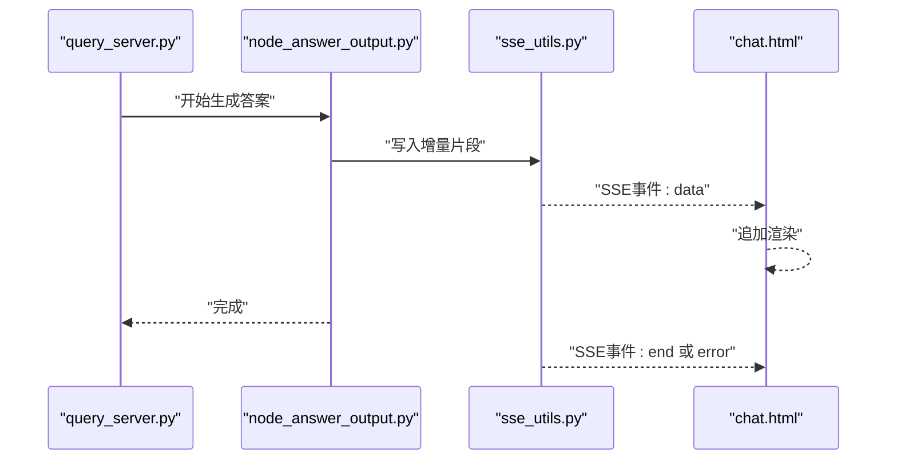
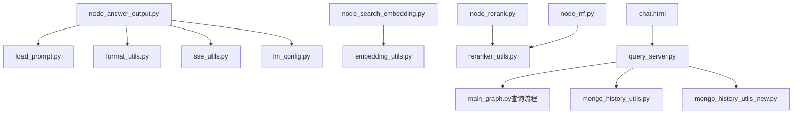

# 答案生成与输出

<cite>
**本文引用的文件**
- [node_answer_output.py](file://app/query_process/agent/nodes/node_answer_output.py)
- [main_graph.py（查询流程）](file://app/query_process/agent/main_graph.py)
- [format_utils.py](file://app/utils/format_utils.py)
- [sse_utils.py](file://app/utils/sse_utils.py)
- [query_server.py](file://app/query_process/api/query_server.py)
- [chat.html](file://app/query_process/page/chat.html)
- [load_prompt.py](file://app/core/load_prompt.py)
- [lm_config.py](file://app/conf/lm_config.py)
- [embedding_utils.py](file://app/lm/embedding_utils.py)
- [reranker_utils.py](file://app/lm/reranker_utils.py)
- [node_rerank.py](file://app/query_process/agent/nodes/node_rerank.py)
- [node_rrf.py](file://app/query_process/agent/nodes/node_rrf.py)
- [node_search_embedding.py](file://app/query_process/agent/nodes/node_search_embedding.py)
- [node_search_embedding_hyde.py](file://app/query_process/agent/nodes/node_search_embedding_hyde.py)
- [node_web_search_mcp.py](file://app/query_process/agent/nodes/node_web_search_mcp.py)
- [node_item_name_confirm.py](file://app/query_process/agent/nodes/node_item_name_confirm.py)
- [mongo_history_utils.py](file://app/clients/mongo_history_utils.py)
- [mongo_history_utils_new.py](file://app/clients/mongo_history_utils_new.py)
</cite>

## 目录
1. [引言](#引言)
2. [项目结构](#项目结构)
3. [核心组件](#核心组件)
4. [架构总览](#架构总览)
5. [详细组件分析](#详细组件分析)
6. [依赖关系分析](#依赖关系分析)
7. [性能考量](#性能考量)
8. [故障排查指南](#故障排查指南)
9. [结论](#结论)
10. [附录](#附录)

## 引言
本文件聚焦“答案生成与输出”模块，系统化解析从检索到最终输出的全流程：包括提示词工程、上下文利用策略、答案格式化与输出控制、质量评估与优化、流式响应（SSE）实现以及质量控制与错误处理。目标是帮助开发者与产品人员快速理解并高效扩展该模块。

## 项目结构
围绕“答案生成与输出”，关键路径如下：
- 查询流程主图：定义节点编排与数据流转
- 答案输出节点：负责最终答案生成与格式化
- 工具与配置：格式化、SSE、语言模型配置、嵌入与重排序等
- 历史与交互：对话历史管理与前端页面

图表来源
- [main_graph.py（查询流程）](file://app/query_process/agent/main_graph.py)
- [node_answer_output.py](file://app/query_process/agent/nodes/node_answer_output.py)
- [format_utils.py](file://app/utils/format_utils.py)
- [sse_utils.py](file://app/utils/sse_utils.py)
- [lm_config.py](file://app/conf/lm_config.py)
- [embedding_utils.py](file://app/lm/embedding_utils.py)
- [reranker_utils.py](file://app/lm/reranker_utils.py)
- [load_prompt.py](file://app/core/load_prompt.py)
- [query_server.py](file://app/query_process/api/query_server.py)
- [chat.html](file://app/query_process/page/chat.html)
- [mongo_history_utils.py](file://app/clients/mongo_history_utils.py)
- [mongo_history_utils_new.py](file://app/clients/mongo_history_utils_new.py)

章节来源
- [main_graph.py（查询流程）](file://app/query_process/agent/main_graph.py)
- [node_answer_output.py](file://app/query_process/agent/nodes/node_answer_output.py)
- [format_utils.py](file://app/utils/format_utils.py)
- [sse_utils.py](file://app/utils/sse_utils.py)
- [lm_config.py](file://app/conf/lm_config.py)
- [embedding_utils.py](file://app/lm/embedding_utils.py)
- [reranker_utils.py](file://app/lm/reranker_utils.py)
- [load_prompt.py](file://app/core/load_prompt.py)
- [query_server.py](file://app/query_process/api/query_server.py)
- [chat.html](file://app/query_process/page/chat.html)
- [mongo_history_utils.py](file://app/clients/mongo_history_utils.py)
- [mongo_history_utils_new.py](file://app/clients/mongo_history_utils_new.py)

## 核心组件
- 答案输出节点：负责整合检索结果、上下文与提示词，调用语言模型生成最终答案，并进行格式化与输出控制。
- 查询主图：串联检索、重排、融合与答案输出等节点，形成端到端的问答管线。
- 工具与配置：提供格式化、SSE、提示词加载、语言模型参数与嵌入/重排序能力。
- 服务与页面：后端API承载请求与流式输出，前端页面提供交互入口。
- 历史与客户端：维护对话历史，支持新旧历史工具。

章节来源
- [node_answer_output.py](file://app/query_process/agent/nodes/node_answer_output.py)
- [main_graph.py（查询流程）](file://app/query_process/agent/main_graph.py)
- [format_utils.py](file://app/utils/format_utils.py)
- [sse_utils.py](file://app/utils/sse_utils.py)
- [lm_config.py](file://app/conf/lm_config.py)
- [load_prompt.py](file://app/core/load_prompt.py)
- [query_server.py](file://app/query_process/api/query_server.py)
- [chat.html](file://app/query_process/page/chat.html)
- [mongo_history_utils.py](file://app/clients/mongo_history_utils.py)
- [mongo_history_utils_new.py](file://app/clients/mongo_history_utils_new.py)

## 架构总览
下图展示从用户输入到答案输出的关键路径，涵盖检索、重排、融合、答案生成与流式输出。

图表来源
- [query_server.py](file://app/query_process/api/query_server.py)
- [main_graph.py（查询流程）](file://app/query_process/agent/main_graph.py)
- [node_answer_output.py](file://app/query_process/agent/nodes/node_answer_output.py)
- [format_utils.py](file://app/utils/format_utils.py)
- [sse_utils.py](file://app/utils/sse_utils.py)

## 详细组件分析

### 答案输出节点（node_answer_output.py）
职责与流程
- 接收上游节点传入的上下文与候选片段
- 加载提示词模板并进行上下文注入
- 调用语言模型生成答案
- 使用格式化工具对输出进行规范化
- 控制输出结构与内容过滤

关键点
- 提示词工程：通过提示词模板与上下文拼接，确保模型在给定证据基础上回答
- 上下文利用：优先使用高质量重排/融合后的片段，避免噪声干扰
- 输出控制：统一格式化与过滤策略，保证稳定性与可读性

图表来源
- [node_answer_output.py](file://app/query_process/agent/nodes/node_answer_output.py)
- [load_prompt.py](file://app/core/load_prompt.py)
- [format_utils.py](file://app/utils/format_utils.py)
- [sse_utils.py](file://app/utils/sse_utils.py)

章节来源
- [node_answer_output.py](file://app/query_process/agent/nodes/node_answer_output.py)
- [load_prompt.py](file://app/core/load_prompt.py)
- [format_utils.py](file://app/utils/format_utils.py)
- [sse_utils.py](file://app/utils/sse_utils.py)

### 查询主图（main_graph.py）
职责与流程
- 定义节点之间的依赖关系与数据传递
- 组织检索、重排、融合与答案输出的顺序
- 将上游检索结果与下游答案生成串联起来

图表来源
- [main_graph.py（查询流程）](file://app/query_process/agent/main_graph.py)
- [node_item_name_confirm.py](file://app/query_process/agent/nodes/node_item_name_confirm.py)
- [node_search_embedding.py](file://app/query_process/agent/nodes/node_search_embedding.py)
- [node_search_embedding_hyde.py](file://app/query_process/agent/nodes/node_search_embedding_hyde.py)
- [node_web_search_mcp.py](file://app/query_process/agent/nodes/node_web_search_mcp.py)
- [node_rrf.py](file://app/query_process/agent/nodes/node_rrf.py)
- [node_rerank.py](file://app/query_process/agent/nodes/node_rerank.py)
- [node_answer_output.py](file://app/query_process/agent/nodes/node_answer_output.py)

章节来源
- [main_graph.py（查询流程）](file://app/query_process/agent/main_graph.py)

### 提示词工程与上下文利用（load_prompt.py）
要点
- 模板化提示词，支持多轮与上下文注入
- 结合实体确认与检索片段，提升准确性
- 通过配置文件控制提示词风格与约束

章节来源
- [load_prompt.py](file://app/core/load_prompt.py)

### 答案格式化与输出控制（format_utils.py）
要点
- 规范化输出结构（如JSON/文本），统一字段与层级
- 内容过滤：去除冗余信息、敏感内容或不合规片段
- 可扩展的格式适配器，便于对接不同前端或下游系统

章节来源
- [format_utils.py](file://app/utils/format_utils.py)

### 流式响应（SSE）实现（sse_utils.py）
要点
- 增量输出：将长答案拆分为多个片段，逐步推送
- 实时更新：浏览器端持续接收并渲染，改善用户体验
- 错误恢复：异常时发送终止信号或错误事件，避免阻塞

图表来源
- [query_server.py](file://app/query_process/api/query_server.py)
- [node_answer_output.py](file://app/query_process/agent/nodes/node_answer_output.py)
- [sse_utils.py](file://app/utils/sse_utils.py)
- [chat.html](file://app/query_process/page/chat.html)

章节来源
- [sse_utils.py](file://app/utils/sse_utils.py)
- [query_server.py](file://app/query_process/api/query_server.py)
- [chat.html](file://app/query_process/page/chat.html)

### 语言模型与检索增强（lm_config.py、embedding_utils.py、reranker_utils.py）
要点
- 模型配置：统一管理模型参数、温度、最大长度等
- 嵌入向量化：将文本转为向量以支持相似度检索
- 重排序：基于语义与相关性对候选片段进行再排序

章节来源
- [lm_config.py](file://app/conf/lm_config.py)
- [embedding_utils.py](file://app/lm/embedding_utils.py)
- [reranker_utils.py](file://app/lm/reranker_utils.py)

### 历史与交互（mongo_history_utils.py、mongo_history_utils_new.py）
要点
- 对话历史持久化与回放
- 支持新旧历史工具切换，保障兼容性
- 与前端页面协同，提供上下文连续性

章节来源
- [mongo_history_utils.py](file://app/clients/mongo_history_utils.py)
- [mongo_history_utils_new.py](file://app/clients/mongo_history_utils_new.py)
- [chat.html](file://app/query_process/page/chat.html)

## 依赖关系分析
- 节点耦合：答案输出节点依赖提示词、格式化与SSE工具；上游节点负责高质量上下文准备
- 外部依赖：语言模型、向量数据库与重排序服务
- 配置集中：模型参数与提示词模板集中于配置与加载模块

图表来源
- [node_answer_output.py](file://app/query_process/agent/nodes/node_answer_output.py)
- [load_prompt.py](file://app/core/load_prompt.py)
- [format_utils.py](file://app/utils/format_utils.py)
- [sse_utils.py](file://app/utils/sse_utils.py)
- [lm_config.py](file://app/conf/lm_config.py)
- [node_search_embedding.py](file://app/query_process/agent/nodes/node_search_embedding.py)
- [embedding_utils.py](file://app/lm/embedding_utils.py)
- [node_rerank.py](file://app/query_process/agent/nodes/node_rerank.py)
- [reranker_utils.py](file://app/lm/reranker_utils.py)
- [node_rrf.py](file://app/query_process/agent/nodes/node_rrf.py)
- [query_server.py](file://app/query_process/api/query_server.py)
- [main_graph.py（查询流程）](file://app/query_process/agent/main_graph.py)
- [mongo_history_utils.py](file://app/clients/mongo_history_utils.py)
- [mongo_history_utils_new.py](file://app/clients/mongo_history_utils_new.py)
- [chat.html](file://app/query_process/page/chat.html)

章节来源
- [node_answer_output.py](file://app/query_process/agent/nodes/node_answer_output.py)
- [main_graph.py（查询流程）](file://app/query_process/agent/main_graph.py)
- [query_server.py](file://app/query_process/api/query_server.py)
- [chat.html](file://app/query_process/page/chat.html)

## 性能考量
- 检索与重排：尽量减少无效候选，降低后续生成压力
- 增量输出：SSE分片推送，缩短首字节延迟
- 缓存与限流：结合外部服务的速率限制与缓存策略
- 输出裁剪：在格式化阶段尽早剔除冗余与低价值片段

## 故障排查指南
常见问题与定位
- 无答案或空输出：检查提示词模板加载与上下文注入是否成功
- 输出格式异常：核查格式化工具的规则与字段映射
- SSE中断：确认SSE工具的事件发送与浏览器端监听状态
- 历史异常：核对历史工具版本与兼容性，必要时切换至新版本工具
- 模型调用失败：检查模型配置与外部服务可用性

章节来源
- [node_answer_output.py](file://app/query_process/agent/nodes/node_answer_output.py)
- [format_utils.py](file://app/utils/format_utils.py)
- [sse_utils.py](file://app/utils/sse_utils.py)
- [mongo_history_utils.py](file://app/clients/mongo_history_utils.py)
- [mongo_history_utils_new.py](file://app/clients/mongo_history_utils_new.py)
- [lm_config.py](file://app/conf/lm_config.py)

## 结论
答案生成与输出模块通过“高质量上下文 + 模板化提示词 + 规范化输出 + SSE流式传输”的组合，实现了稳定、可控且体验良好的问答系统。建议在生产中持续优化提示词模板、完善质量评估与过滤策略，并加强监控与告警，以进一步提升鲁棒性与一致性。

## 附录
- 术语说明
  - 提示词工程：通过精心设计的模板与上下文注入，引导模型在给定证据基础上准确回答
  - 上下文利用：在生成前对候选片段进行筛选与排序，确保模型仅基于高质量证据生成答案
  - 流式响应（SSE）：服务器向客户端持续推送增量数据，改善交互体验
  - 质量评估与优化：通过事实性验证与一致性检查，持续改进答案质量