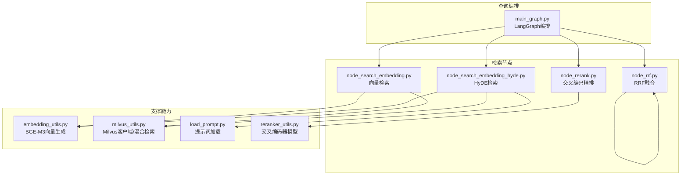
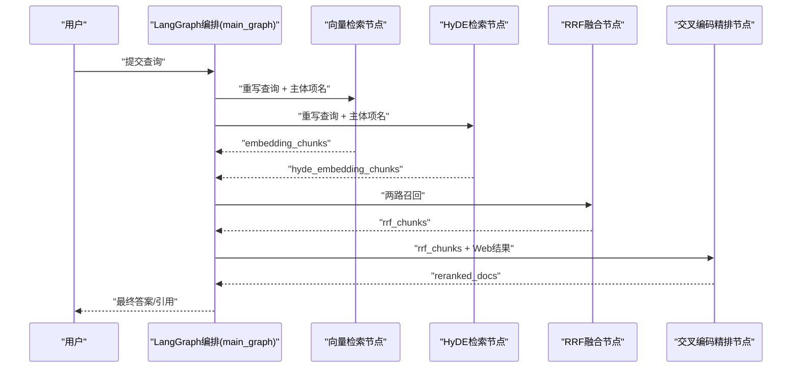
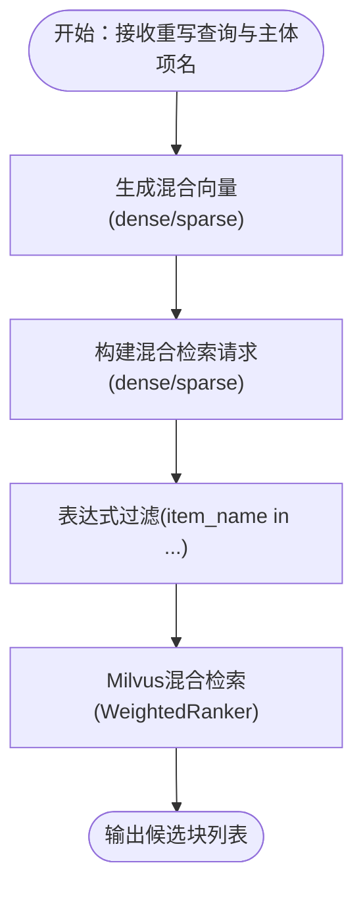
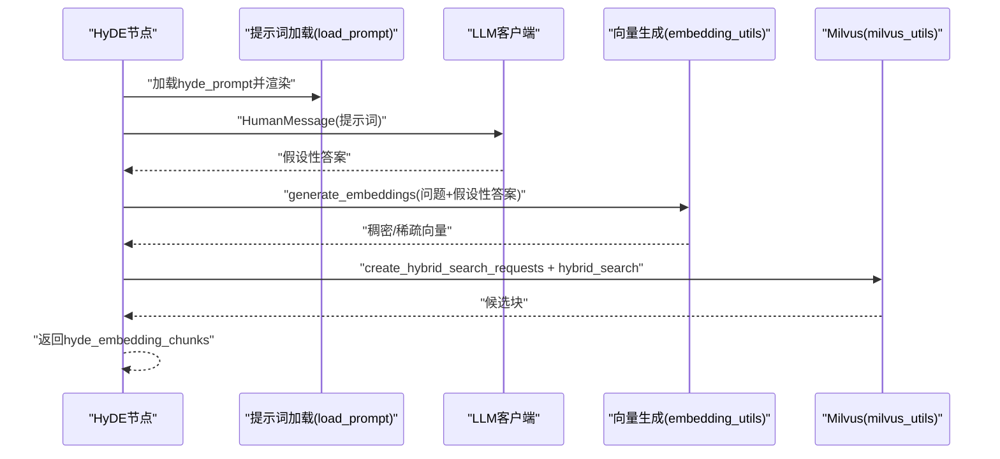
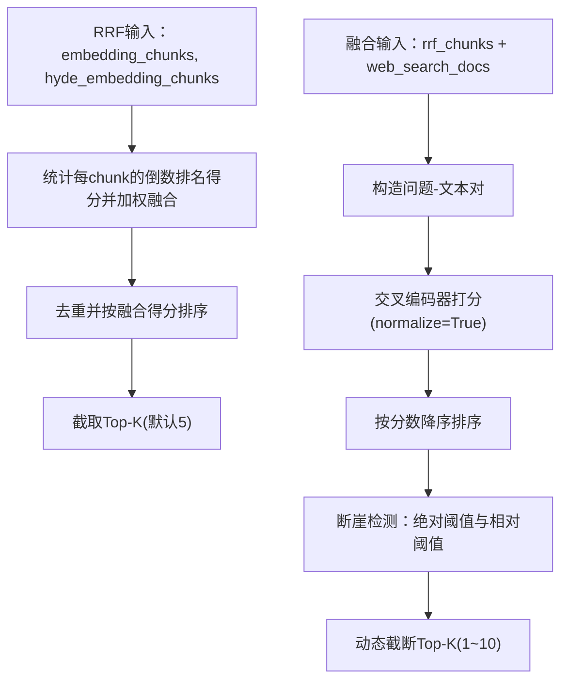
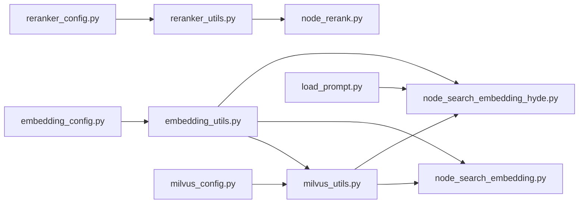

# 语义搜索处理

<cite>
**本文引用的文件**
- [app/query_process/agent/nodes/node_search_embedding.py](file://app/query_process/agent/nodes/node_search_embedding.py)
- [app/query_process/agent/nodes/node_search_embedding_hyde.py](file://app/query_process/agent/nodes/node_search_embedding_hyde.py)
- [app/lm/embedding_utils.py](file://app/lm/embedding_utils.py)
- [app/conf/embedding_config.py](file://app/conf/embedding_config.py)
- [app/clients/milvus_utils.py](file://app/clients/milvus_utils.py)
- [app/conf/milvus_config.py](file://app/conf/milvus_config.py)
- [app/query_process/agent/nodes/node_rrf.py](file://app/query_process/agent/nodes/node_rrf.py)
- [app/query_process/agent/nodes/node_rerank.py](file://app/query_process/agent/nodes/node_rerank.py)
- [app/lm/reranker_utils.py](file://app/lm/reranker_utils.py)
- [app/conf/reranker_config.py](file://app/conf/reranker_config.py)
- [app/query_process/agent/main_graph.py](file://app/query_process/agent/main_graph.py)
- [app/core/load_prompt.py](file://app/core/load_prompt.py)
</cite>

## 目录
1. [简介](#简介)
2. [项目结构](#项目结构)
3. [核心组件](#核心组件)
4. [架构总览](#架构总览)
5. [详细组件分析](#详细组件分析)
6. [依赖分析](#依赖分析)
7. [性能考虑](#性能考虑)
8. [故障排查指南](#故障排查指南)
9. [结论](#结论)
10. [附录](#附录)

## 简介
本文件面向“语义搜索处理”模块，系统化阐述混合检索策略的设计与实现，涵盖传统向量检索与 HyDE（Hypothetical Document Embedding）检索的融合方式，向量检索的查询向量生成、相似度计算与结果过滤机制，HyDE 的假设文档生成与语义嵌入策略，以及搜索性能优化（索引与查询加速）、算法对比与效果评估建议。文档以代码为依据，配合图示帮助读者快速理解各组件职责与交互流程。

## 项目结构
语义搜索处理位于查询流程的 Agent 层，采用 LangGraph 编排多路召回与重排，主要涉及以下文件：
- 向量检索节点：负责将重写后的查询生成稠密/稀疏混合向量，并在 Milvus 中执行混合检索，返回候选块。
- HyDE 检索节点：先由 LLM 生成“假设性答案”，再将“问题+假设性答案”拼接为查询，进行混合检索。
- 重排与融合：先通过 Reciprocal Rank Fusion（RRF）对多路召回结果进行同源融合，再使用交叉编码器（Cross-Encoder）进行精排与 Top-K 截断。
- 向量生成与 Milvus 客户端：统一封装 BGE-M3 混合向量生成、Milvus 客户端单例、混合检索请求构建与执行。

图表来源
- [app/query_process/agent/main_graph.py:1-47](file://app/query_process/agent/main_graph.py#L1-L47)
- [app/query_process/agent/nodes/node_search_embedding.py:1-94](file://app/query_process/agent/nodes/node_search_embedding.py#L1-L94)
- [app/query_process/agent/nodes/node_search_embedding_hyde.py:1-118](file://app/query_process/agent/nodes/node_search_embedding_hyde.py#L1-L118)
- [app/query_process/agent/nodes/node_rrf.py:1-124](file://app/query_process/agent/nodes/node_rrf.py#L1-L124)
- [app/query_process/agent/nodes/node_rerank.py:1-267](file://app/query_process/agent/nodes/node_rerank.py#L1-L267)
- [app/lm/embedding_utils.py:1-108](file://app/lm/embedding_utils.py#L1-L108)
- [app/clients/milvus_utils.py:1-198](file://app/clients/milvus_utils.py#L1-L198)
- [app/core/load_prompt.py:1-43](file://app/core/load_prompt.py#L1-L43)
- [app/lm/reranker_utils.py:1-14](file://app/lm/reranker_utils.py#L1-L14)

章节来源
- [app/query_process/agent/main_graph.py:1-47](file://app/query_process/agent/main_graph.py#L1-L47)

## 核心组件
- 向量检索节点（传统向量检索）
  - 输入：重写查询、明确主体项名集合
  - 处理：生成稠密/稀疏混合向量，构造 Milvus 混合检索请求，按权重融合并返回候选块
- HyDE 检索节点
  - 输入：重写查询、明确主体项名集合
  - 处理：加载提示词，调用 LLM 生成假设性答案；将“问题+假设性答案”拼接后生成混合向量并执行混合检索
- RRF 融合节点
  - 输入：向量检索结果、HyDE 检索结果
  - 处理：对同源多路召回进行倒数排名融合，得到统一排序
- 交叉编码精排节点
  - 输入：RRF 融合结果 + Web 搜索结果
  - 处理：问题-文本对成对打分，按分数排序并基于断崖阈值动态截断 Top-K

章节来源
- [app/query_process/agent/nodes/node_search_embedding.py:12-72](file://app/query_process/agent/nodes/node_search_embedding.py#L12-L72)
- [app/query_process/agent/nodes/node_search_embedding_hyde.py:70-92](file://app/query_process/agent/nodes/node_search_embedding_hyde.py#L70-L92)
- [app/query_process/agent/nodes/node_rrf.py:50-76](file://app/query_process/agent/nodes/node_rrf.py#L50-L76)
- [app/query_process/agent/nodes/node_rerank.py:162-208](file://app/query_process/agent/nodes/node_rerank.py#L162-L208)

## 架构总览
整体流程自“确认主体项名”开始，进入多路召回与融合重排：
- 传统向量检索与 HyDE 检索并行执行，均返回候选块
- RRF 对两路同源召回进行融合
- 交叉编码器对本地与网络多路结果进行精排与截断
- 输出最终重排结果供回答生成使用

图表来源
- [app/query_process/agent/main_graph.py:26-45](file://app/query_process/agent/main_graph.py#L26-L45)
- [app/query_process/agent/nodes/node_search_embedding.py:26-72](file://app/query_process/agent/nodes/node_search_embedding.py#L26-L72)
- [app/query_process/agent/nodes/node_search_embedding_hyde.py:80-92](file://app/query_process/agent/nodes/node_search_embedding_hyde.py#L80-L92)
- [app/query_process/agent/nodes/node_rrf.py:50-76](file://app/query_process/agent/nodes/node_rrf.py#L50-L76)
- [app/query_process/agent/nodes/node_rerank.py:162-208](file://app/query_process/agent/nodes/node_rerank.py#L162-L208)

## 详细组件分析

### 向量检索实现机制
- 查询向量生成
  - 使用 BGE-M3 模型生成稠密与稀疏混合向量，开启 L2 归一化以适配 Milvus 内积（IP）相似度
  - 支持半精度加速与设备选择，单例模式避免重复初始化
- 相似度计算与过滤
  - 构造 Milvus 混合检索请求，分别针对稠密/稀疏向量设置度量类型（余弦/COSINE、内积/IP）
  - 通过表达式过滤限定主体项名集合，限制召回域
- 结果处理
  - 使用加权融合器对两路向量检索结果进行加权融合，返回候选块列表

图表来源
- [app/lm/embedding_utils.py:51-96](file://app/lm/embedding_utils.py#L51-L96)
- [app/clients/milvus_utils.py:117-155](file://app/clients/milvus_utils.py#L117-L155)
- [app/clients/milvus_utils.py:158-195](file://app/clients/milvus_utils.py#L158-L195)
- [app/query_process/agent/nodes/node_search_embedding.py:30-51](file://app/query_process/agent/nodes/node_search_embedding.py#L30-L51)

章节来源
- [app/lm/embedding_utils.py:1-108](file://app/lm/embedding_utils.py#L1-L108)
- [app/conf/embedding_config.py:1-24](file://app/conf/embedding_config.py#L1-L24)
- [app/clients/milvus_utils.py:1-198](file://app/clients/milvus_utils.py#L1-L198)
- [app/conf/milvus_config.py:1-26](file://app/conf/milvus_config.py#L1-L26)
- [app/query_process/agent/nodes/node_search_embedding.py:12-72](file://app/query_process/agent/nodes/node_search_embedding.py#L12-L72)

### HyDE 检索工作原理
- 假设文档生成
  - 加载提示词模板，将重写查询注入模板，调用 LLM 生成“假设性答案”
- 语义嵌入策略
  - 将“问题 + 假设性答案”拼接为查询文本，生成混合向量并执行混合检索
  - 通过主体项名过滤缩小召回域，提升相关性

图表来源
- [app/query_process/agent/nodes/node_search_embedding_hyde.py:16-68](file://app/query_process/agent/nodes/node_search_embedding_hyde.py#L16-L68)
- [app/core/load_prompt.py:5-28](file://app/core/load_prompt.py#L5-L28)
- [app/lm/embedding_utils.py:51-96](file://app/lm/embedding_utils.py#L51-L96)
- [app/clients/milvus_utils.py:117-195](file://app/clients/milvus_utils.py#L117-L195)

章节来源
- [app/query_process/agent/nodes/node_search_embedding_hyde.py:1-118](file://app/query_process/agent/nodes/node_search_embedding_hyde.py#L1-L118)
- [app/core/load_prompt.py:1-43](file://app/core/load_prompt.py#L1-L43)

### RRF 融合与交叉编码精排
- RRF 融合
  - 对两路同源召回（向量、HyDE）按倒数排名公式进行加权融合，保留唯一 chunk 并排序
- 交叉编码精排
  - 将本地与网络结果统一为“问题-文本”对，使用交叉编码器打分并排序
  - 基于断崖阈值（绝对与相对）动态确定 Top-K，确保高分段连续性

图表来源
- [app/query_process/agent/nodes/node_rrf.py:7-48](file://app/query_process/agent/nodes/node_rrf.py#L7-L48)
- [app/query_process/agent/nodes/node_rerank.py:68-160](file://app/query_process/agent/nodes/node_rerank.py#L68-L160)

章节来源
- [app/query_process/agent/nodes/node_rrf.py:1-124](file://app/query_process/agent/nodes/node_rrf.py#L1-L124)
- [app/query_process/agent/nodes/node_rerank.py:1-267](file://app/query_process/agent/nodes/node_rerank.py#L1-L267)
- [app/lm/reranker_utils.py:1-14](file://app/lm/reranker_utils.py#L1-L14)
- [app/conf/reranker_config.py:1-21](file://app/conf/reranker_config.py#L1-L21)

## 依赖分析
- 组件耦合
  - 向量检索与 HyDE 检索共享嵌入生成与 Milvus 客户端，降低重复开销
  - RRF 与 Rerank 作为下游处理节点，依赖上游召回结果的统一结构
- 外部依赖
  - Milvus：提供混合向量检索与加权融合能力
  - BGE-M3：提供稠密/稀疏混合向量生成与 L2 归一化
  - 交叉编码器：提供高质量重排序能力
- 配置依赖
  - Embedding、Milvus、Reranker 的路径、设备、半精度开关通过配置类集中管理

图表来源
- [app/lm/embedding_utils.py:1-108](file://app/lm/embedding_utils.py#L1-L108)
- [app/clients/milvus_utils.py:1-198](file://app/clients/milvus_utils.py#L1-L198)
- [app/query_process/agent/nodes/node_search_embedding.py:1-94](file://app/query_process/agent/nodes/node_search_embedding.py#L1-L94)
- [app/query_process/agent/nodes/node_search_embedding_hyde.py:1-118](file://app/query_process/agent/nodes/node_search_embedding_hyde.py#L1-L118)
- [app/lm/reranker_utils.py:1-14](file://app/lm/reranker_utils.py#L1-L14)
- [app/core/load_prompt.py:1-43](file://app/core/load_prompt.py#L1-L43)
- [app/conf/embedding_config.py:1-24](file://app/conf/embedding_config.py#L1-L24)
- [app/conf/milvus_config.py:1-26](file://app/conf/milvus_config.py#L1-L26)
- [app/conf/reranker_config.py:1-21](file://app/conf/reranker_config.py#L1-L21)

章节来源
- [app/lm/embedding_utils.py:1-108](file://app/lm/embedding_utils.py#L1-L108)
- [app/clients/milvus_utils.py:1-198](file://app/clients/milvus_utils.py#L1-L198)
- [app/lm/reranker_utils.py:1-14](file://app/lm/reranker_utils.py#L1-L14)
- [app/conf/embedding_config.py:1-24](file://app/conf/embedding_config.py#L1-L24)
- [app/conf/milvus_config.py:1-26](file://app/conf/milvus_config.py#L1-L26)
- [app/conf/reranker_config.py:1-21](file://app/conf/reranker_config.py#L1-L21)

## 性能考虑
- 向量生成优化
  - 单例模式避免重复加载模型，减少初始化开销
  - 半精度（fp16）与设备选择可显著提升吞吐
- Milvus 检索优化
  - 混合检索使用加权融合器，避免单一向量维度主导
  - 表达式过滤限定主体项名，减少无效扫描
- 结果融合与重排
  - RRF 使用倒数排名融合，兼顾不同召回质量
  - 交叉编码器精排前的断崖检测，避免低分噪声影响最终 Top-K

章节来源
- [app/lm/embedding_utils.py:8-48](file://app/lm/embedding_utils.py#L8-L48)
- [app/clients/milvus_utils.py:117-195](file://app/clients/milvus_utils.py#L117-L195)
- [app/query_process/agent/nodes/node_rrf.py:7-48](file://app/query_process/agent/nodes/node_rrf.py#L7-L48)
- [app/query_process/agent/nodes/node_rerank.py:100-160](file://app/query_process/agent/nodes/node_rerank.py#L100-L160)

## 故障排查指南
- 向量生成失败
  - 检查模型路径、设备与半精度配置是否正确
  - 关注日志中的初始化与异常堆栈
- Milvus 连接/查询异常
  - 校验 Milvus 地址与集合配置
  - 观察混合检索返回结果为空或异常
- HyDE 生成异常
  - 确认提示词文件存在且渲染参数正确
  - 检查 LLM 客户端可用性
- 重排结果异常
  - 检查交叉编码器模型初始化与设备配置
  - 关注断崖阈值设置是否过于严格导致截断过早

章节来源
- [app/lm/embedding_utils.py:36-48](file://app/lm/embedding_utils.py#L36-L48)
- [app/clients/milvus_utils.py:16-31](file://app/clients/milvus_utils.py#L16-L31)
- [app/core/load_prompt.py:15-28](file://app/core/load_prompt.py#L15-L28)
- [app/lm/reranker_utils.py:6-13](file://app/lm/reranker_utils.py#L6-L13)
- [app/query_process/agent/nodes/node_rerank.py:100-160](file://app/query_process/agent/nodes/node_rerank.py#L100-L160)

## 结论
该模块通过“传统向量检索 + HyDE”的双路召回与“RRF 融合 + 交叉编码精排”的后处理链路，实现了高召回与高精度的平衡。向量生成采用 BGE-M3 的原生 L2 归一化与混合向量策略，Milvus 提供高效的混合检索与加权融合；HyDE 通过假设性答案增强语义表达，进一步提升召回质量。整体设计具备良好的扩展性与可维护性，适合在 RAG 系统中作为核心检索层使用。

## 附录
- 算法对比与评估建议
  - 传统向量检索 vs HyDE
    - 传统向量检索：直接利用查询语义，适合明确意图的查询
    - HyDE：通过假设性答案增强语义覆盖，适合模糊或复杂意图
  - 评估指标建议
    - 召回率（Recall@K）、精确率（Precision@K）、平均倒数排名（MRR@K）
    - 人工评估：相关性、完整性、可解释性
  - A/B 实验设计
    - 对比启用/关闭 HyDE、不同 RRF 权重、不同 Top-K 截断策略的效果
    - 在不同领域与查询类型的样本集上验证稳定性