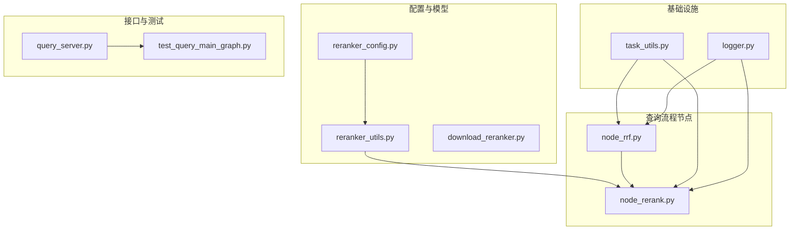
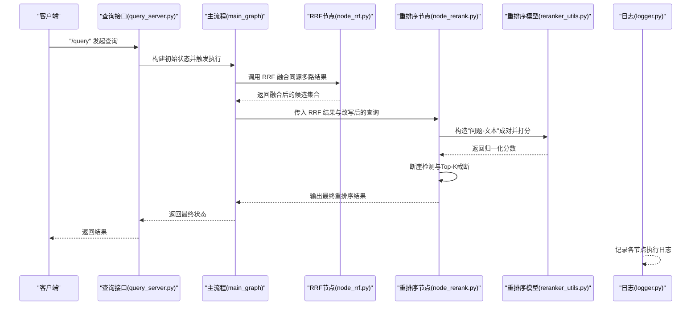
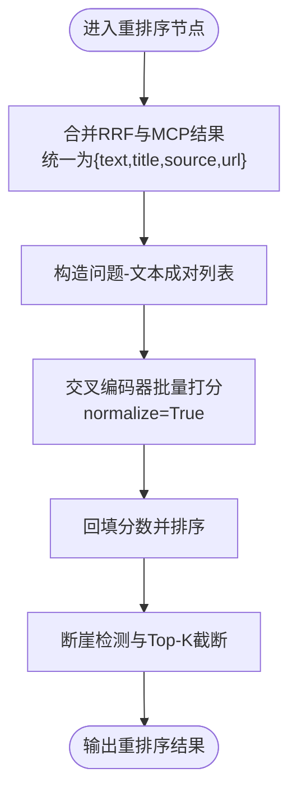
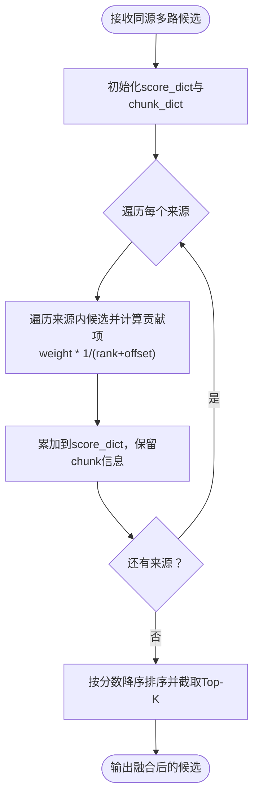
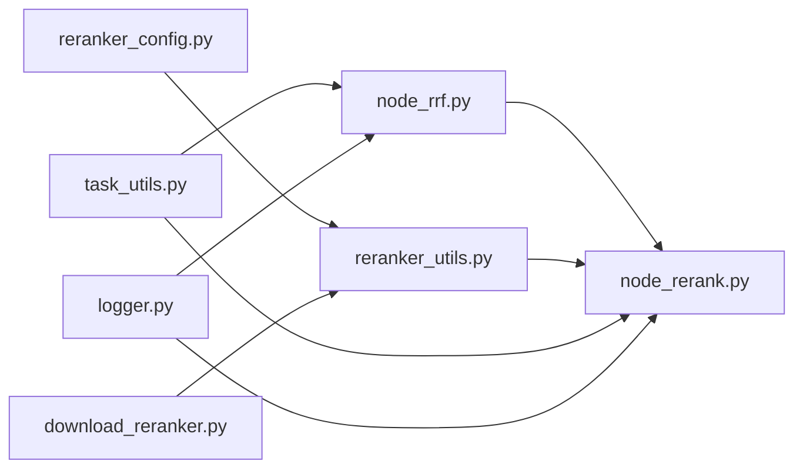

# 重排序与融合算法

<cite>
**本文引用的文件**   
- [app/conf/reranker_config.py](file://app/conf/reranker_config.py)
- [app/lm/reranker_utils.py](file://app/lm/reranker_utils.py)
- [app/query_process/agent/nodes/node_rrf.py](file://app/query_process/agent/nodes/node_rrf.py)
- [app/query_process/agent/nodes/node_rerank.py](file://app/query_process/agent/nodes/node_rerank.py)
- [app/utils/task_utils.py](file://app/utils/task_utils.py)
- [app/core/logger.py](file://app/core/logger.py)
- [app/tool/download_reranker.py](file://app/tool/download_reranker.py)
- [app/query_process/api/query_server.py](file://app/query_process/api/query_server.py)
- [app/test/test_query_main_graph.py](file://app/test/test_query_main_graph.py)
</cite>

## 目录
1. [引言](#引言)
2. [项目结构](#项目结构)
3. [核心组件](#核心组件)
4. [架构总览](#架构总览)
5. [详细组件分析](#详细组件分析)
6. [依赖分析](#依赖分析)
7. [性能考虑](#性能考虑)
8. [故障排查指南](#故障排查指南)
9. [结论](#结论)
10. [附录](#附录)

## 引言
本文件面向重排序与融合算法模块，系统化阐述以下内容：
- BGE 交叉编码器重排序的实现原理与策略：包括交叉编码器工作机制、归一化打分、Top-K 截断与断崖检测策略。
- RRF（倒数排名融合）融合算法的设计思想：包括权重分配、排名融合公式、同源结果对齐与合并。
- 多源结果的统一处理机制：如何将来自不同检索策略（本地向量、HyDE、网络搜索）的结果对齐、合并与重排。
- 性能优化技术：批处理策略、模型懒加载与缓存、日志与任务追踪。
- 算法参数调优指南与效果评估方法。

## 项目结构
围绕重排序与融合的关键文件组织如下：
- 配置层：重排序模型配置与加载
- 模型封装：重排序模型的懒加载与复用
- 融合与重排：RRF 融合与交叉编码器重排序节点
- 任务与日志：任务状态追踪与日志输出
- 工具与下载：模型下载脚本
- API 与测试：查询接口与主流程测试

图表来源
- [app/conf/reranker_config.py:1-21](file://app/conf/reranker_config.py#L1-L21)
- [app/lm/reranker_utils.py:1-14](file://app/lm/reranker_utils.py#L1-L14)
- [app/query_process/agent/nodes/node_rrf.py:1-124](file://app/query_process/agent/nodes/node_rrf.py#L1-L124)
- [app/query_process/agent/nodes/node_rerank.py:1-267](file://app/query_process/agent/nodes/node_rerank.py#L1-L267)
- [app/utils/task_utils.py:1-187](file://app/utils/task_utils.py#L1-L187)
- [app/core/logger.py:1-109](file://app/core/logger.py#L1-L109)
- [app/tool/download_reranker.py:1-10](file://app/tool/download_reranker.py#L1-L10)
- [app/query_process/api/query_server.py:40-95](file://app/query_process/api/query_server.py#L40-L95)
- [app/test/test_query_main_graph.py:1-26](file://app/test/test_query_main_graph.py#L1-L26)

章节来源
- [app/conf/reranker_config.py:1-21](file://app/conf/reranker_config.py#L1-L21)
- [app/lm/reranker_utils.py:1-14](file://app/lm/reranker_utils.py#L1-L14)
- [app/query_process/agent/nodes/node_rrf.py:1-124](file://app/query_process/agent/nodes/node_rrf.py#L1-L124)
- [app/query_process/agent/nodes/node_rerank.py:1-267](file://app/query_process/agent/nodes/node_rerank.py#L1-L267)
- [app/utils/task_utils.py:1-187](file://app/utils/task_utils.py#L1-L187)
- [app/core/logger.py:1-109](file://app/core/logger.py#L1-L109)
- [app/tool/download_reranker.py:1-10](file://app/tool/download_reranker.py#L1-L10)
- [app/query_process/api/query_server.py:40-95](file://app/query_process/api/query_server.py#L40-L95)
- [app/test/test_query_main_graph.py:1-26](file://app/test/test_query_main_graph.py#L1-L26)

## 核心组件
- 重排序配置与模型封装
  - 通过配置类读取模型路径、设备与半精度开关，并在首次使用时构建交叉编码器模型实例，后续复用以降低开销。
- RRF 融合节点
  - 将同源多路检索结果（如向量与 HyDE）按权重进行倒数排名融合，得到统一排序。
- 重排序节点
  - 将 RRF 后的多源结果统一为标准结构，使用交叉编码器对“问题-候选文本”成对打分，进行归一化排序，并结合断崖检测与 Top-K 截断。
- 任务与日志
  - 提供任务状态追踪（进行中/已完成）、中文节点名映射与进度推送；日志统一配置与位置修复，便于问题定位。

章节来源
- [app/conf/reranker_config.py:9-21](file://app/conf/reranker_config.py#L9-L21)
- [app/lm/reranker_utils.py:6-14](file://app/lm/reranker_utils.py#L6-L14)
- [app/query_process/agent/nodes/node_rrf.py:50-76](file://app/query_process/agent/nodes/node_rrf.py#L50-L76)
- [app/query_process/agent/nodes/node_rerank.py:162-208](file://app/query_process/agent/nodes/node_rerank.py#L162-L208)
- [app/utils/task_utils.py:27-50](file://app/utils/task_utils.py#L27-L50)
- [app/core/logger.py:46-83](file://app/core/logger.py#L46-L83)

## 架构总览
下图展示了从查询请求到最终重排序输出的端到端流程，重点体现 RRF 融合与交叉编码器重排序的衔接。

图表来源
- [app/query_process/api/query_server.py:56-95](file://app/query_process/api/query_server.py#L56-L95)
- [app/query_process/agent/nodes/node_rrf.py:50-76](file://app/query_process/agent/nodes/node_rrf.py#L50-L76)
- [app/query_process/agent/nodes/node_rerank.py:162-208](file://app/query_process/agent/nodes/node_rerank.py#L162-L208)
- [app/lm/reranker_utils.py:6-14](file://app/lm/reranker_utils.py#L6-L14)
- [app/core/logger.py:46-83](file://app/core/logger.py#L46-L83)

## 详细组件分析

### BGE 交叉编码器重排序实现
- 交叉编码器工作机制
  - 输入为“问题-文本”成对，模型对每一对进行语义匹配打分，输出为实数值，通常需归一化至 [0,1] 区间以便跨批次比较。
  - 该模块通过懒加载方式创建模型实例，避免重复初始化带来的资源浪费。
- 重排序策略
  - 将 RRF 后的多源候选统一为包含文本、标题、来源等字段的标准结构。
  - 构造“问题-文本”成对列表，批量调用打分接口，随后将分数回填并按降序排序。
  - 在排序基础上，采用断崖检测与 Top-K 截断策略，提升最终输出质量与稳定性。

图表来源
- [app/query_process/agent/nodes/node_rerank.py:68-97](file://app/query_process/agent/nodes/node_rerank.py#L68-L97)
- [app/query_process/agent/nodes/node_rerank.py:100-160](file://app/query_process/agent/nodes/node_rerank.py#L100-L160)

章节来源
- [app/query_process/agent/nodes/node_rerank.py:68-97](file://app/query_process/agent/nodes/node_rerank.py#L68-L97)
- [app/query_process/agent/nodes/node_rerank.py:100-160](file://app/query_process/agent/nodes/node_rerank.py#L100-L160)
- [app/lm/reranker_utils.py:6-14](file://app/lm/reranker_utils.py#L6-L14)

### RRF（倒数排名融合）融合算法
- 设计思想
  - 对同源多路检索结果分别进行排名，按“1/(k+offset)”加权求和，偏重靠前的候选，同时允许不同来源赋予不同权重。
  - 通过 offset（示例中使用固定常数）平衡不同来源的排名尺度差异。
- 权重分配与融合公式
  - 对于每个 chunk_id，累积其在各来源中的贡献：sum(weight_i * 1/(rank_k + offset))，然后按总分降序排序并截取 Top-K。
- 多源结果的统一处理
  - 将不同来源的候选统一为包含 chunk_id、实体信息与排名的结构，去重并保留一份实体信息，保证后续重排序一致性。

图表来源
- [app/query_process/agent/nodes/node_rrf.py:7-48](file://app/query_process/agent/nodes/node_rrf.py#L7-L48)

章节来源
- [app/query_process/agent/nodes/node_rrf.py:7-48](file://app/query_process/agent/nodes/node_rrf.py#L7-L48)

### 多源结果的统一处理机制
- 来自 RRF 的本地候选：包含实体信息（chunk_id、content、title），统一为{text,title,source="local",url=""}。
- 来自 MCP 的网络搜索候选：包含 snippet、title、url，统一为{text,title,source="web",url}。
- 合并后交由重排序节点进行交叉编码器打分与排序，确保不同来源在同一评分体系下竞争。

章节来源
- [app/query_process/agent/nodes/node_rerank.py:24-65](file://app/query_process/agent/nodes/node_rerank.py#L24-L65)

### 重排序性能优化技术
- 批处理策略
  - 将“问题-文本”成对批量传入交叉编码器打分，减少多次往返调用的开销。
- 缓存与懒加载
  - 重排序模型采用全局单例懒加载，首次使用时构建并在进程生命周期内复用，避免重复初始化。
- 日志与任务追踪
  - 通过任务工具记录节点执行状态与中文展示名，结合日志配置实现可追溯的执行链路。

章节来源
- [app/lm/reranker_utils.py:6-14](file://app/lm/reranker_utils.py#L6-L14)
- [app/utils/task_utils.py:68-109](file://app/utils/task_utils.py#L68-L109)
- [app/core/logger.py:46-83](file://app/core/logger.py#L46-L83)

### 算法参数调优指南与效果评估
- RRF 调优要点
  - offset：平衡不同来源的排名尺度，建议根据来源规模与分布微调。
  - 权重：对不同来源（如向量与 HyDE）赋予不同权重，观察对召回质量的影响。
  - Top-K：控制融合后候选规模，兼顾质量与性能。
- 重排序调优要点
  - Top-K 上限与下限：根据业务需求设定硬上限与最小保留数量。
  - 断崖阈值（绝对与相对）：在高分段与低分段之间设置合理的断崖阈值，避免截断过度或不足。
  - 归一化：确保打分落在 [0,1] 区间，提升跨批次可比性。
- 效果评估方法
  - 人工抽样评估：对不同阈值组合下的 Top-K 结果进行相关性评分。
  - A/B 对比：在生产流量中对比不同参数组合的命中率、点击率等指标。
  - 日志与监控：结合日志与任务追踪，定位异常节点与耗时瓶颈。

章节来源
- [app/query_process/agent/nodes/node_rrf.py:7-48](file://app/query_process/agent/nodes/node_rrf.py#L7-L48)
- [app/query_process/agent/nodes/node_rerank.py:14-21](file://app/query_process/agent/nodes/node_rerank.py#L14-L21)
- [app/query_process/agent/nodes/node_rerank.py:100-160](file://app/query_process/agent/nodes/node_rerank.py#L100-L160)

## 依赖分析
- 组件耦合
  - 重排序节点依赖 RRF 节点提供的候选集合与改写后的查询。
  - 重排序模型封装独立于业务流程，仅暴露懒加载工厂方法。
  - 任务追踪与日志贯穿各节点，提供可观测性。
- 外部依赖
  - 交叉编码器库：用于“问题-文本”成对打分。
  - 模型下载工具：用于本地缓存预训练模型。

图表来源
- [app/query_process/agent/nodes/node_rrf.py:1-124](file://app/query_process/agent/nodes/node_rrf.py#L1-L124)
- [app/query_process/agent/nodes/node_rerank.py:1-267](file://app/query_process/agent/nodes/node_rerank.py#L1-L267)
- [app/lm/reranker_utils.py:1-14](file://app/lm/reranker_utils.py#L1-L14)
- [app/conf/reranker_config.py:1-21](file://app/conf/reranker_config.py#L1-L21)
- [app/utils/task_utils.py:1-187](file://app/utils/task_utils.py#L1-L187)
- [app/core/logger.py:1-109](file://app/core/logger.py#L1-L109)
- [app/tool/download_reranker.py:1-10](file://app/tool/download_reranker.py#L1-L10)

章节来源
- [app/query_process/agent/nodes/node_rrf.py:1-124](file://app/query_process/agent/nodes/node_rrf.py#L1-L124)
- [app/query_process/agent/nodes/node_rerank.py:1-267](file://app/query_process/agent/nodes/node_rerank.py#L1-L267)
- [app/lm/reranker_utils.py:1-14](file://app/lm/reranker_utils.py#L1-L14)
- [app/conf/reranker_config.py:1-21](file://app/conf/reranker_config.py#L1-L21)
- [app/utils/task_utils.py:1-187](file://app/utils/task_utils.py#L1-L187)
- [app/core/logger.py:1-109](file://app/core/logger.py#L1-L109)
- [app/tool/download_reranker.py:1-10](file://app/tool/download_reranker.py#L1-L10)

## 性能考虑
- 批处理
  - 将候选文本列表与问题拼接为成对列表，一次性传入打分接口，减少 I/O 与模型调用次数。
- 模型缓存
  - 懒加载模型实例并长期驻留，避免重复初始化与显存反复加载。
- 日志与任务追踪
  - 控制台与文件双通道输出，配合任务状态队列推送，便于实时观测与问题定位。
- 端到端测试
  - 主流程测试脚本可验证从查询到最终状态的完整性，辅助性能回归。

章节来源
- [app/lm/reranker_utils.py:6-14](file://app/lm/reranker_utils.py#L6-L14)
- [app/core/logger.py:46-83](file://app/core/logger.py#L46-L83)
- [app/utils/task_utils.py:174-179](file://app/utils/task_utils.py#L174-L179)
- [app/test/test_query_main_graph.py:1-26](file://app/test/test_query_main_graph.py#L1-L26)

## 故障排查指南
- 模型加载失败
  - 检查模型路径与设备配置是否正确，确认环境变量已加载。
  - 使用模型下载脚本预先缓存模型，避免运行时下载阻塞。
- 重排序分数异常
  - 确认输入文本与问题是否为空，检查归一化参数与断崖阈值设置。
  - 查看日志输出，定位打分与排序环节的异常。
- 任务状态异常
  - 检查任务状态映射与中文展示名是否一致，确认进度推送队列是否启用。

章节来源
- [app/conf/reranker_config.py:16-21](file://app/conf/reranker_config.py#L16-L21)
- [app/tool/download_reranker.py:1-10](file://app/tool/download_reranker.py#L1-L10)
- [app/query_process/agent/nodes/node_rerank.py:82-97](file://app/query_process/agent/nodes/node_rerank.py#L82-L97)
- [app/utils/task_utils.py:68-109](file://app/utils/task_utils.py#L68-L109)
- [app/core/logger.py:46-83](file://app/core/logger.py#L46-L83)

## 结论
本模块通过 RRF 同源融合与交叉编码器重排序相结合，实现了对多源检索结果的统一评分与高质量截断。借助懒加载模型、批量打分与断崖检测等优化手段，在保证质量的同时提升了整体性能。建议在生产环境中持续迭代 RRF 权重与重排序阈值，并结合日志与任务追踪进行效果评估与问题定位。

## 附录
- 模型下载
  - 使用模型下载脚本将预训练模型缓存至本地，确保运行时稳定加载。
- 查询接口
  - 提供查询接口与异步流式返回能力，便于集成到前端与监控系统。

章节来源
- [app/tool/download_reranker.py:1-10](file://app/tool/download_reranker.py#L1-L10)
- [app/query_process/api/query_server.py:56-95](file://app/query_process/api/query_server.py#L56-L95)