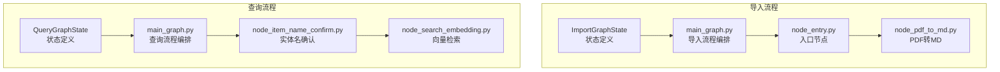
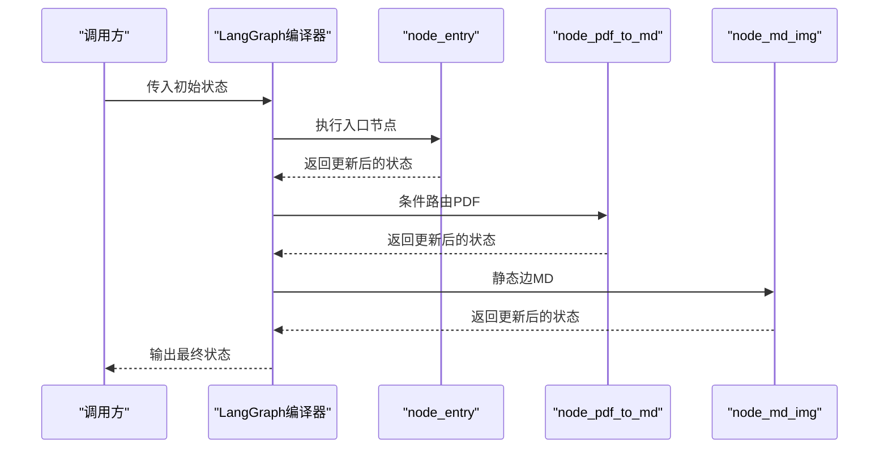
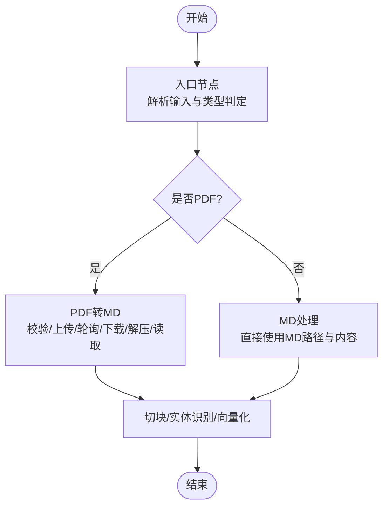
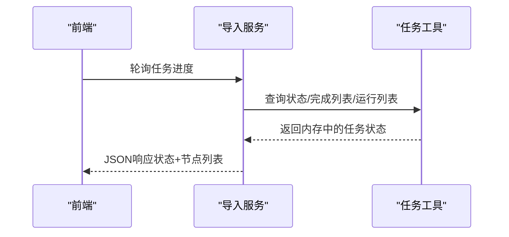
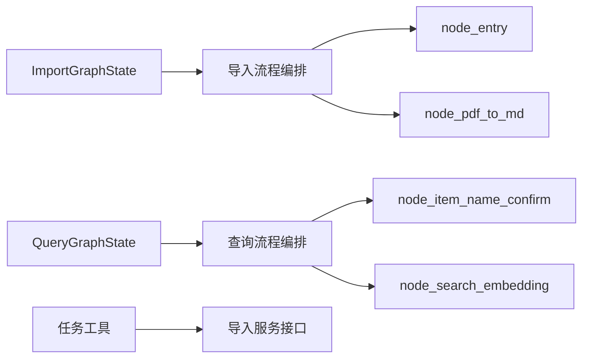

# 状态管理机制

<cite>
**本文引用的文件**
- [app/import_process/agent/state.py](file://app/import_process/agent/state.py)
- [app/query_process/agent/state.py](file://app/query_process/agent/state.py)
- [app/import_process/agent/main_graph.py](file://app/import_process/agent/main_graph.py)
- [app/query_process/agent/main_graph.py](file://app/query_process/agent/main_graph.py)
- [app/import_process/agent/nodes/node_entry.py](file://app/import_process/agent/nodes/node_entry.py)
- [app/import_process/agent/nodes/node_pdf_to_md.py](file://app/import_process/agent/nodes/node_pdf_to_md.py)
- [app/query_process/agent/nodes/node_item_name_confirm.py](file://app/query_process/agent/nodes/node_item_name_confirm.py)
- [app/query_process/agent/nodes/node_search_embedding.py](file://app/query_process/agent/nodes/node_search_embedding.py)
- [app/utils/task_utils.py](file://app/utils/task_utils.py)
- [app/import_process/api/import_server.py](file://app/import_process/api/import_server.py)
</cite>

## 目录
1. [引言](#引言)
2. [项目结构](#项目结构)
3. [核心组件](#核心组件)
4. [架构概览](#架构概览)
5. [详细组件分析](#详细组件分析)
6. [依赖分析](#依赖分析)
7. [性能考量](#性能考量)
8. [故障排查指南](#故障排查指南)
9. [结论](#结论)
10. [附录](#附录)

## 引言
本文件聚焦于RAG Agent中两条主流程的状态管理机制，系统性阐述导入流程（ImportGraphState）与查询流程（QueryGraphState）的设计原则、字段定义、数据类型约束、默认值设定、状态在节点间的传递与合并策略、持久化与错误恢复机制，并辅以状态流转图与时序图，帮助开发者快速掌握状态管理的完整生命周期。

## 项目结构
两条流程分别位于导入与查询两大子系统中，均采用LangGraph定义状态图，节点函数通过读写状态字典实现数据传递与控制流分支。导入流程关注文件类型判定、PDF转MD、切块、实体名识别、向量化与Milvus入库；查询流程关注实体名确认、多路检索、融合排序与重排序、答案生成。

图表来源
- [app/import_process/agent/state.py:1-99](file://app/import_process/agent/state.py#L1-L99)
- [app/import_process/agent/main_graph.py:1-134](file://app/import_process/agent/main_graph.py#L1-L134)
- [app/import_process/agent/nodes/node_entry.py:1-59](file://app/import_process/agent/nodes/node_entry.py#L1-L59)
- [app/import_process/agent/nodes/node_pdf_to_md.py:1-331](file://app/import_process/agent/nodes/node_pdf_to_md.py#L1-L331)
- [app/query_process/agent/state.py:1-97](file://app/query_process/agent/state.py#L1-L97)
- [app/query_process/agent/main_graph.py:1-47](file://app/query_process/agent/main_graph.py#L1-L47)
- [app/query_process/agent/nodes/node_item_name_confirm.py:1-317](file://app/query_process/agent/nodes/node_item_name_confirm.py#L1-L317)
- [app/query_process/agent/nodes/node_search_embedding.py:1-94](file://app/query_process/agent/nodes/node_search_embedding.py#L1-L94)

章节来源
- [app/import_process/agent/state.py:1-99](file://app/import_process/agent/state.py#L1-L99)
- [app/query_process/agent/state.py:1-97](file://app/query_process/agent/state.py#L1-L97)
- [app/import_process/agent/main_graph.py:1-134](file://app/import_process/agent/main_graph.py#L1-L134)
- [app/query_process/agent/main_graph.py:1-47](file://app/query_process/agent/main_graph.py#L1-L47)

## 核心组件
- ImportGraphState：导入流程的状态载体，包含任务标识、文件路径与类型标记、中间产物（MD内容、切块、向量）、数据库写入准备数据等。
- QueryGraphState：查询流程的状态载体，包含会话标识、原始问题、检索中间结果（普通向量、HyDE、网络搜索）、排序中间结果（RRF、重排序）、生成中间结果（Prompt、答案）及辅助信息（实体名、改写问题、历史、流式标记）。
- 默认状态工厂：导入与查询各自提供默认状态构造器与深拷贝复制器，保证状态隔离与可覆盖。

章节来源
- [app/import_process/agent/state.py:5-90](file://app/import_process/agent/state.py#L5-L90)
- [app/query_process/agent/state.py:5-80](file://app/query_process/agent/state.py#L5-L80)

## 架构概览
LangGraph将状态图抽象为TypedDict，节点函数以纯函数形式读写状态，通过条件边与静态边控制执行顺序。导入流程在入口节点根据文件类型选择后续路径；查询流程在实体名确认后根据是否已有答案分流至多路检索或直接输出。

图表来源
- [app/import_process/agent/main_graph.py:30-65](file://app/import_process/agent/main_graph.py#L30-L65)
- [app/import_process/agent/nodes/node_entry.py:10-59](file://app/import_process/agent/nodes/node_entry.py#L10-L59)
- [app/import_process/agent/nodes/node_pdf_to_md.py:260-305](file://app/import_process/agent/nodes/node_pdf_to_md.py#L260-L305)

## 详细组件分析

### ImportGraphState 设计与字段语义
- 任务与控制
  - task_id：任务唯一ID，用于日志追踪与前端进度上报。
  - is_md_read_enabled / is_pdf_read_enabled：文件类型判定标记，驱动入口节点的条件路由。
- 路径与文件
  - local_dir / local_file_path / file_title：输入输出路径与文件名基础信息。
  - pdf_path / md_path：输入PDF与产出MD的路径。
  - split_path / embeddings_path：切块与向量文件路径（注释标明暂未使用）。
- 内容与中间产物
  - md_content：MD全文内容。
  - chunks：切片后的文本列表，包含元数据。
  - item_name：识别出的主体名称，用于增强检索。
- 数据库写入准备
  - embeddings_content：包含向量数据的列表，准备写入Milvus。

默认值与类型约束
- 默认值来源于统一的默认状态字典，确保字段完整性与一致性。
- 类型约束通过TypedDict声明，配合运行时校验（如路径存在性、文件扩展名）实现强健性。

状态继承与合并
- 节点函数通常以“就地更新”的方式修改状态字典，保持引用不变，从而实现隐式继承。
- 对于仅需部分字段的下游节点，可通过返回新字典的方式实现“字段级合并”，避免污染上游状态。

冲突处理策略
- 路由冲突：入口节点基于文件扩展名判定，避免同时置位两种读取开关。
- 路径冲突：当未显式提供输出目录时，节点内部提供默认值并创建目录，避免运行时异常。
- 数据冲突：对同一字段的多次赋值遵循“后写覆盖”，通过明确的字段职责避免竞态。

章节来源
- [app/import_process/agent/state.py:5-63](file://app/import_process/agent/state.py#L5-L63)
- [app/import_process/agent/nodes/node_entry.py:32-55](file://app/import_process/agent/nodes/node_entry.py#L32-L55)
- [app/import_process/agent/nodes/node_pdf_to_md.py:64-93](file://app/import_process/agent/nodes/node_pdf_to_md.py#L64-L93)

### QueryGraphState 设计与字段语义
- 会话与问题
  - session_id：会话唯一标识。
  - original_query：用户原始问题。
- 检索中间结果
  - embedding_chunks：普通向量检索结果。
  - hyde_embedding_chunks：HyDE检索结果。
  - web_search_docs：网络搜索结果。
- 排序中间结果
  - rrf_chunks：RRF融合排序结果。
  - reranked_docs：重排序后的Top-K文档。
- 生成中间结果
  - prompt：组装好的Prompt。
  - answer：最终生成的答案。
- 辅助信息
  - item_names：提取出的商品名称列表。
  - rewritten_query：改写后的问题。
  - history：历史对话记录。
  - is_stream：是否流式输出标记。

默认值与类型约束
- 默认状态字典提供空字符串、空列表、False等安全初值，保证下游逻辑无需判空即可使用。
- 类型约束通过TypedDict与节点函数的预期输入保持一致。

状态继承与合并
- 节点函数可返回新字典以合并特定字段，例如向量检索节点仅返回embedding_chunks，避免污染其他字段。
- 实体名确认节点在确认集合存在时清除answer字段，确保后续流程不会误用旧答案。

冲突处理策略
- 答案冲突：若实体名确认阶段已生成答案（如候选实体提示），则直接终止后续检索，避免冗余计算。
- 历史冲突：每次实体名确认都会刷新历史记录与改写问题，确保检索与生成阶段使用最新上下文。

章节来源
- [app/query_process/agent/state.py:5-49](file://app/query_process/agent/state.py#L5-L49)
- [app/query_process/agent/nodes/node_item_name_confirm.py:218-290](file://app/query_process/agent/nodes/node_item_name_confirm.py#L218-L290)
- [app/query_process/agent/nodes/node_search_embedding.py:12-72](file://app/query_process/agent/nodes/node_search_embedding.py#L12-L72)

### 状态在节点间的传递机制
- 入口节点（导入）：根据文件扩展名设置读取开关与文件路径，更新文件名基础信息，为后续节点提供必要输入。
- PDF转MD节点：执行路径校验、远程解析、下载解压、MD文件定位与内容读取，更新MD路径与内容，为切块与实体识别提供基础。
- 实体名确认节点（查询）：结合历史对话与LLM抽取，向量库匹配与打分，生成确认与可选实体集合，必要时直接输出候选提示答案。
- 向量检索节点（查询）：将改写问题向量化，执行混合检索，返回切片结果，供后续融合排序与重排序使用。

图表来源
- [app/import_process/agent/main_graph.py:30-62](file://app/import_process/agent/main_graph.py#L30-L62)
- [app/import_process/agent/nodes/node_entry.py:32-55](file://app/import_process/agent/nodes/node_entry.py#L32-L55)
- [app/import_process/agent/nodes/node_pdf_to_md.py:260-305](file://app/import_process/agent/nodes/node_pdf_to_md.py#L260-L305)

### 状态持久化与内存管理
- 任务进度持久化（内存）：通过任务工具模块维护三类列表（运行中、已完成、结果）与状态映射，所有操作均在内存字典中完成，具备高吞吐与低延迟特性。
- 任务状态查询接口：导入服务提供轮询接口，前端以固定频率拉取任务状态，包含全局状态、已完成节点与运行中节点列表。
- 状态清理：任务完成后可清理内存中的任务记录，释放资源。

图表来源
- [app/import_process/api/import_server.py:147-166](file://app/import_process/api/import_server.py#L147-L166)
- [app/utils/task_utils.py:71-187](file://app/utils/task_utils.py#L71-L187)

章节来源
- [app/import_process/api/import_server.py:147-166](file://app/import_process/api/import_server.py#L147-L166)
- [app/utils/task_utils.py:71-187](file://app/utils/task_utils.py#L71-L187)

### 状态验证与错误恢复
- 输入验证
  - 导入流程：入口节点校验输入文件路径非空；PDF转MD节点进一步校验文件存在性与输出目录有效性。
  - 查询流程：实体名确认节点依赖历史记录与LLM输出，若无匹配实体则直接输出提示答案，避免无效检索。
- 错误恢复
  - PDF转MD：对HTTP状态码、解析状态、文件存在性进行多层校验，异常时抛出并终止流程，避免污染状态。
  - 实体名确认：若确认集合为空，直接生成提示答案并结束流程，防止下游空结果导致的不确定性。
- 状态回滚
  - 由于节点函数以“就地更新”为主，建议在关键节点捕获异常并返回原状态或最小化状态，避免部分字段污染。

章节来源
- [app/import_process/agent/nodes/node_entry.py:32-55](file://app/import_process/agent/nodes/node_entry.py#L32-L55)
- [app/import_process/agent/nodes/node_pdf_to_md.py:64-93](file://app/import_process/agent/nodes/node_pdf_to_md.py#L64-L93)
- [app/query_process/agent/nodes/node_item_name_confirm.py:218-290](file://app/query_process/agent/nodes/node_item_name_confirm.py#L218-L290)

## 依赖分析
- LangGraph与节点函数
  - 导入流程：入口节点决定后续分支，静态边串联后续处理节点。
  - 查询流程：实体名确认节点根据答案存在与否分流至检索或直接输出。
- 状态与工具
  - 两类状态均依赖默认工厂与深拷贝复制器，确保状态隔离与可测试性。
  - 任务工具模块为导入流程提供内存级状态持久化与前端轮询支持。

图表来源
- [app/import_process/agent/main_graph.py:19-65](file://app/import_process/agent/main_graph.py#L19-L65)
- [app/query_process/agent/main_graph.py:12-46](file://app/query_process/agent/main_graph.py#L12-L46)
- [app/utils/task_utils.py:71-187](file://app/utils/task_utils.py#L71-L187)
- [app/import_process/api/import_server.py:147-166](file://app/import_process/api/import_server.py#L147-L166)

章节来源
- [app/import_process/agent/main_graph.py:19-65](file://app/import_process/agent/main_graph.py#L19-L65)
- [app/query_process/agent/main_graph.py:12-46](file://app/query_process/agent/main_graph.py#L12-L46)
- [app/utils/task_utils.py:71-187](file://app/utils/task_utils.py#L71-L187)

## 性能考量
- 内存状态管理：任务状态与进度均驻留内存，避免IO开销，适合高并发场景；但需注意长时任务的内存占用与周期性清理。
- 节点粒度：将复杂步骤拆分为独立节点，便于并行化与缓存命中；同时减少单节点复杂度，提升可观测性。
- 流式输出：查询流程支持is_stream标记，结合任务工具的推送队列，可降低前端等待时间。

## 故障排查指南
- 导入流程
  - 输入文件为空：检查入口节点日志与返回状态，确认local_file_path是否传入。
  - PDF解析失败：查看PDF转MD节点的异常栈与HTTP状态码，确认上传、轮询与下载环节。
  - 输出目录缺失：节点会自动创建目录，若仍失败，检查权限与路径合法性。
- 查询流程
  - 实体名确认无结果：检查历史记录与LLM输出，确认item_names是否为空；必要时调整提示词或阈值。
  - 检索无命中：确认改写问题与实体集合是否合理，检查向量化与混合检索配置。
- 进度查询
  - 前端轮询失败：确认导入服务接口可用性与任务ID正确性；检查任务工具中的状态映射。

章节来源
- [app/import_process/agent/nodes/node_entry.py:32-55](file://app/import_process/agent/nodes/node_entry.py#L32-L55)
- [app/import_process/agent/nodes/node_pdf_to_md.py:116-181](file://app/import_process/agent/nodes/node_pdf_to_md.py#L116-L181)
- [app/query_process/agent/nodes/node_item_name_confirm.py:218-290](file://app/query_process/agent/nodes/node_item_name_confirm.py#L218-L290)
- [app/import_process/api/import_server.py:147-166](file://app/import_process/api/import_server.py#L147-L166)

## 结论
本状态管理体系以TypedDict定义清晰的数据契约，结合LangGraph的节点函数实现状态的就地更新与字段级合并，辅以内存级任务持久化与前端轮询，形成高效、可观测、易扩展的RAG Agent状态管理方案。导入与查询两条流程在字段设计、路由策略与错误恢复方面体现了强一致与容错能力，适合在生产环境中稳定运行。

## 附录
- 状态字段速览
  - 导入流程：任务ID、读取开关、路径与文件名、MD内容、切块、实体名、向量写入准备数据。
  - 查询流程：会话ID、原始问题、检索中间结果、排序中间结果、生成中间结果、辅助信息。
- 默认状态工厂
  - 导入：提供默认状态与深拷贝复制器，支持字段覆盖。
  - 查询：提供默认状态、深拷贝复制器与便捷构造器，支持字段覆盖。

章节来源
- [app/import_process/agent/state.py:65-90](file://app/import_process/agent/state.py#L65-L90)
- [app/query_process/agent/state.py:55-80](file://app/query_process/agent/state.py#L55-L80)