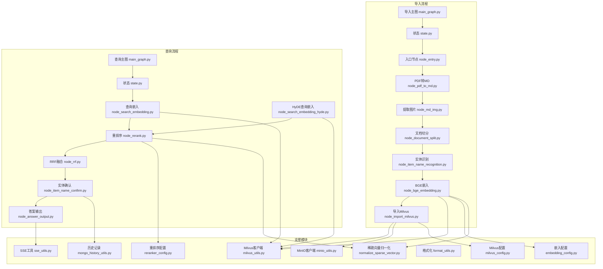
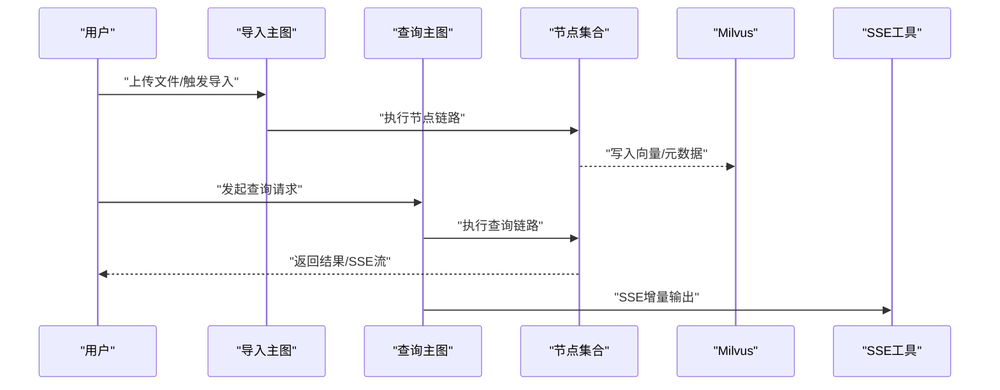
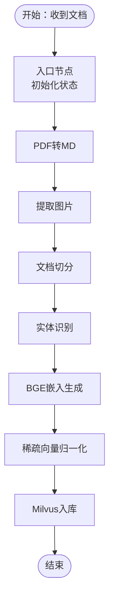
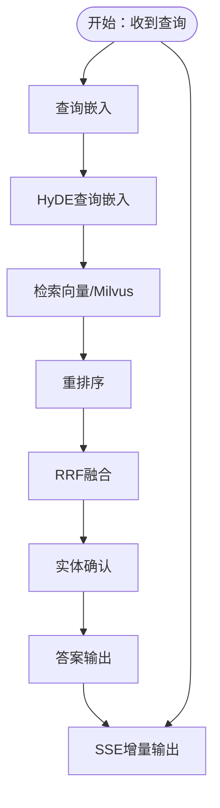
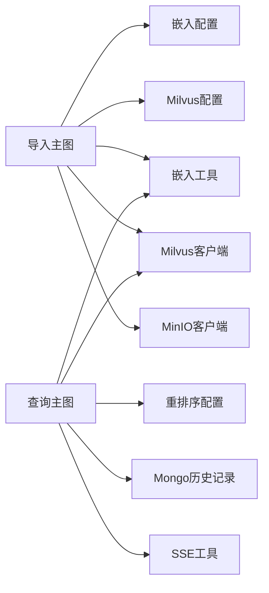

# 数据流设计

<cite>
**本文引用的文件**
- [app/import_process/agent/main_graph.py](file://app/import_process/agent/main_graph.py)
- [app/import_process/agent/state.py](file://app/import_process/agent/state.py)
- [app/import_process/agent/nodes/node_entry.py](file://app/import_process/agent/nodes/node_entry.py)
- [app/import_process/agent/nodes/node_document_split.py](file://app/import_process/agent/nodes/node_document_split.py)
- [app/import_process/agent/nodes/node_pdf_to_md.py](file://app/import_process/agent/nodes/node_pdf_to_md.py)
- [app/import_process/agent/nodes/node_md_img.py](file://app/import_process/agent/nodes/node_md_img.py)
- [app/import_process/agent/nodes/node_item_name_recognition.py](file://app/import_process/agent/nodes/node_item_name_recognition.py)
- [app/import_process/agent/nodes/node_bge_embedding.py](file://app/import_process/agent/nodes/node_bge_embedding.py)
- [app/import_process/agent/nodes/node_import_milvus.py](file://app/import_process/agent/nodes/node_import_milvus.py)
- [app/lm/embedding_utils.py](file://app/lm/embedding_utils.py)
- [app/lm/reranker_utils.py](file://app/lm/reranker_utils.py)
- [app/query_process/agent/main_graph.py](file://app/query_process/agent/main_graph.py)
- [app/query_process/agent/state.py](file://app/query_process/agent/state.py)
- [app/query_process/agent/nodes/node_search_embedding.py](file://app/query_process/agent/nodes/node_search_embedding.py)
- [app/query_process/agent/nodes/node_search_embedding_hyde.py](file://app/query_process/agent/nodes/node_search_embedding_hyde.py)
- [app/query_process/agent/nodes/node_rerank.py](file://app/query_process/agent/nodes/node_rerank.py)
- [app/query_process/agent/nodes/node_rrf.py](file://app/query_process/agent/nodes/node_rrf.py)
- [app/query_process/agent/nodes/node_item_name_confirm.py](file://app/query_process/agent/nodes/node_item_name_confirm.py)
- [app/query_process/agent/nodes/node_answer_output.py](file://app/query_process/agent/nodes/node_answer_output.py)
- [app/query_process/api/query_server.py](file://app/query_process/api/query_server.py)
- [app/utils/format_utils.py](file://app/utils/format_utils.py)
- [app/utils/normalize_sparse_vector.py](file://app/utils/normalize_sparse_vector.py)
- [app/utils/sse_utils.py](file://app/utils/sse_utils.py)
- [app/clients/milvus_utils.py](file://app/clients/milvus_utils.py)
- [app/clients/minio_utils.py](file://app/clients/minio_utils.py)
- [app/clients/mongo_history_utils.py](file://app/clients/mongo_history_utils.py)
- [app/conf/embedding_config.py](file://app/conf/embedding_config.py)
- [app/conf/milvus_config.py](file://app/conf/milvus_config.py)
- [app/conf/reranker_config.py](file://app/conf/reranker_config.py)
</cite>

## 目录
1. [引言](#引言)
2. [项目结构](#项目结构)
3. [核心组件](#核心组件)
4. [架构总览](#架构总览)
5. [详细组件分析](#详细组件分析)
6. [依赖关系分析](#依赖关系分析)
7. [性能考量](#性能考量)
8. [故障排查指南](#故障排查指南)
9. [结论](#结论)
10. [附录](#附录)

## 引言
本设计文档聚焦于RAG Agent项目的数据流设计，系统性梳理从用户输入到最终输出的完整数据处理链路。文档覆盖三类数据：文档数据（原始文件与文本）、向量数据（嵌入向量与稀疏向量）与查询数据（检索与重排序）。我们将阐明数据格式标准化、数据验证与清洗机制、缓存与内存管理策略、一致性与并发控制，并通过数据流图与转换图直观展示关键节点。

## 项目结构
项目采用按功能域分层的组织方式：
- 导入流程（import_process）：负责文档解析、切分、实体识别、嵌入生成与Milvus入库。
- 查询流程（query_process）：负责查询预处理、检索（含HyDE）、重排序、融合与答案输出。
- 客户端适配（clients）：封装MinIO、Milvus、Mongo、Neo4j等外部存储与服务。
- 配置（conf）：集中管理嵌入、Milvus、重排序器等配置参数。
- 工具（utils）：提供格式化、稀疏向量归一化、SSE流式输出等通用能力。

图表来源
- [app/import_process/agent/main_graph.py](file://app/import_process/agent/main_graph.py)
- [app/import_process/agent/state.py](file://app/import_process/agent/state.py)
- [app/import_process/agent/nodes/node_entry.py](file://app/import_process/agent/nodes/node_entry.py)
- [app/import_process/agent/nodes/node_pdf_to_md.py](file://app/import_process/agent/nodes/node_pdf_to_md.py)
- [app/import_process/agent/nodes/node_md_img.py](file://app/import_process/agent/nodes/node_md_img.py)
- [app/import_process/agent/nodes/node_document_split.py](file://app/import_process/agent/nodes/node_document_split.py)
- [app/import_process/agent/nodes/node_item_name_recognition.py](file://app/import_process/agent/nodes/node_item_name_recognition.py)
- [app/import_process/agent/nodes/node_bge_embedding.py](file://app/import_process/agent/nodes/node_bge_embedding.py)
- [app/import_process/agent/nodes/node_import_milvus.py](file://app/import_process/agent/nodes/node_import_milvus.py)
- [app/query_process/agent/main_graph.py](file://app/query_process/agent/main_graph.py)
- [app/query_process/agent/state.py](file://app/query_process/agent/state.py)
- [app/query_process/agent/nodes/node_search_embedding.py](file://app/query_process/agent/nodes/node_search_embedding.py)
- [app/query_process/agent/nodes/node_search_embedding_hyde.py](file://app/query_process/agent/nodes/node_search_embedding_hyde.py)
- [app/query_process/agent/nodes/node_rerank.py](file://app/query_process/agent/nodes/node_rerank.py)
- [app/query_process/agent/nodes/node_rrf.py](file://app/query_process/agent/nodes/node_rrf.py)
- [app/query_process/agent/nodes/node_item_name_confirm.py](file://app/query_process/agent/nodes/node_item_name_confirm.py)
- [app/query_process/agent/nodes/node_answer_output.py](file://app/query_process/agent/nodes/node_answer_output.py)
- [app/clients/milvus_utils.py](file://app/clients/milvus_utils.py)
- [app/clients/minio_utils.py](file://app/clients/minio_utils.py)
- [app/clients/mongo_history_utils.py](file://app/clients/mongo_history_utils.py)
- [app/conf/embedding_config.py](file://app/conf/embedding_config.py)
- [app/conf/milvus_config.py](file://app/conf/milvus_config.py)
- [app/conf/reranker_config.py](file://app/conf/reranker_config.py)
- [app/utils/format_utils.py](file://app/utils/format_utils.py)
- [app/utils/normalize_sparse_vector.py](file://app/utils/normalize_sparse_vector.py)
- [app/utils/sse_utils.py](file://app/utils/sse_utils.py)

章节来源
- [app/import_process/agent/main_graph.py](file://app/import_process/agent/main_graph.py)
- [app/query_process/agent/main_graph.py](file://app/query_process/agent/main_graph.py)

## 核心组件
- 状态机（state.py）：统一承载导入与查询流程中的中间态与上下文，确保跨节点的状态一致性与可追踪性。
- 导入主图（main_graph.py）：编排文档导入全链路，串联各节点完成从文件到向量索引的入库。
- 查询主图（main_graph.py）：编排检索与生成全链路，串联检索、重排序、融合与答案输出。
- 节点（nodes）：每个节点专注单一职责，如PDF转MD、文档切分、实体识别、嵌入生成、Milvus写入、查询嵌入、重排序、RRF融合、实体确认与答案输出。
- 客户端适配（milvus_utils.py、minio_utils.py、mongo_history_utils.py）：抽象外部系统接口，屏蔽细节差异。
- 工具与配置（format_utils.py、normalize_sparse_vector.py、embedding_config.py、milvus_config.py、reranker_config.py）：提供数据标准化、向量归一化与配置驱动。

章节来源
- [app/import_process/agent/state.py](file://app/import_process/agent/state.py)
- [app/query_process/agent/state.py](file://app/query_process/agent/state.py)
- [app/utils/format_utils.py](file://app/utils/format_utils.py)
- [app/utils/normalize_sparse_vector.py](file://app/utils/normalize_sparse_vector.py)
- [app/conf/embedding_config.py](file://app/conf/embedding_config.py)
- [app/conf/milvus_config.py](file://app/conf/milvus_config.py)
- [app/conf/reranker_config.py](file://app/conf/reranker_config.py)

## 架构总览
下图展示“导入”与“查询”两条主线的数据流，以及与外部系统和配置的交互。

图表来源
- [app/import_process/agent/main_graph.py](file://app/import_process/agent/main_graph.py)
- [app/query_process/agent/main_graph.py](file://app/query_process/agent/main_graph.py)
- [app/utils/sse_utils.py](file://app/utils/sse_utils.py)
- [app/clients/milvus_utils.py](file://app/clients/milvus_utils.py)

## 详细组件分析

### 导入流程数据流
导入流程将“文档数据”转化为“向量数据”，并写入Milvus。关键节点职责如下：
- 入口节点：接收用户上传或批量任务，初始化状态。
- PDF转MD：将PDF解析为Markdown文本，保留结构信息。
- 提取图片：从Markdown中抽取图片并进行后续处理。
- 文档切分：对长文档进行语义切分，形成可检索的片段。
- 实体识别：识别关键实体名称，用于后续检索增强。
- BGE嵌入：调用嵌入模型生成密集向量；同时支持稀疏向量归一化。
- Milvus入库：将向量与元数据写入Milvus，建立索引。

图表来源
- [app/import_process/agent/nodes/node_entry.py](file://app/import_process/agent/nodes/node_entry.py)
- [app/import_process/agent/nodes/node_pdf_to_md.py](file://app/import_process/agent/nodes/node_pdf_to_md.py)
- [app/import_process/agent/nodes/node_md_img.py](file://app/import_process/agent/nodes/node_md_img.py)
- [app/import_process/agent/nodes/node_document_split.py](file://app/import_process/agent/nodes/node_document_split.py)
- [app/import_process/agent/nodes/node_item_name_recognition.py](file://app/import_process/agent/nodes/node_item_name_recognition.py)
- [app/import_process/agent/nodes/node_bge_embedding.py](file://app/import_process/agent/nodes/node_bge_embedding.py)
- [app/import_process/agent/nodes/node_import_milvus.py](file://app/import_process/agent/nodes/node_import_milvus.py)
- [app/utils/normalize_sparse_vector.py](file://app/utils/normalize_sparse_vector.py)

章节来源
- [app/import_process/agent/main_graph.py](file://app/import_process/agent/main_graph.py)
- [app/import_process/agent/state.py](file://app/import_process/agent/state.py)
- [app/import_process/agent/nodes/node_entry.py](file://app/import_process/agent/nodes/node_entry.py)
- [app/import_process/agent/nodes/node_pdf_to_md.py](file://app/import_process/agent/nodes/node_pdf_to_md.py)
- [app/import_process/agent/nodes/node_md_img.py](file://app/import_process/agent/nodes/node_md_img.py)
- [app/import_process/agent/nodes/node_document_split.py](file://app/import_process/agent/nodes/node_document_split.py)
- [app/import_process/agent/nodes/node_item_name_recognition.py](file://app/import_process/agent/nodes/node_item_name_recognition.py)
- [app/import_process/agent/nodes/node_bge_embedding.py](file://app/import_process/agent/nodes/node_bge_embedding.py)
- [app/import_process/agent/nodes/node_import_milvus.py](file://app/import_process/agent/nodes/node_import_milvus.py)
- [app/utils/normalize_sparse_vector.py](file://app/utils/normalize_sparse_vector.py)

### 查询流程数据流
查询流程将“查询数据”转化为“检索结果”，再进行重排序与融合，最终输出答案。关键节点职责如下：
- 查询嵌入：对用户问题生成查询向量。
- HyDE查询嵌入：基于假设文档生成查询向量，提升检索质量。
- 重排序：结合相关性与重排序器模型优化排序。
- RRF融合：对多路检索结果进行去噪与融合。
- 实体确认：确认实体名称，避免歧义。
- 答案输出：生成最终回答，支持SSE流式输出。

图表来源
- [app/query_process/agent/nodes/node_search_embedding.py](file://app/query_process/agent/nodes/node_search_embedding.py)
- [app/query_process/agent/nodes/node_search_embedding_hyde.py](file://app/query_process/agent/nodes/node_search_embedding_hyde.py)
- [app/query_process/agent/nodes/node_rerank.py](file://app/query_process/agent/nodes/node_rerank.py)
- [app/query_process/agent/nodes/node_rrf.py](file://app/query_process/agent/nodes/node_rrf.py)
- [app/query_process/agent/nodes/node_item_name_confirm.py](file://app/query_process/agent/nodes/node_item_name_confirm.py)
- [app/query_process/agent/nodes/node_answer_output.py](file://app/query_process/agent/nodes/node_answer_output.py)
- [app/utils/sse_utils.py](file://app/utils/sse_utils.py)

章节来源
- [app/query_process/agent/main_graph.py](file://app/query_process/agent/main_graph.py)
- [app/query_process/agent/state.py](file://app/query_process/agent/state.py)
- [app/query_process/agent/nodes/node_search_embedding.py](file://app/query_process/agent/nodes/node_search_embedding.py)
- [app/query_process/agent/nodes/node_search_embedding_hyde.py](file://app/query_process/agent/nodes/node_search_embedding_hyde.py)
- [app/query_process/agent/nodes/node_rerank.py](file://app/query_process/agent/nodes/node_rerank.py)
- [app/query_process/agent/nodes/node_rrf.py](file://app/query_process/agent/nodes/node_rrf.py)
- [app/query_process/agent/nodes/node_item_name_confirm.py](file://app/query_process/agent/nodes/node_item_name_confirm.py)
- [app/query_process/agent/nodes/node_answer_output.py](file://app/query_process/agent/nodes/node_answer_output.py)
- [app/utils/sse_utils.py](file://app/utils/sse_utils.py)

### 数据格式标准化与清洗
- 格式标准化：通过格式化工具对文本进行规范化处理，确保不同来源文本的一致性。
- 稀疏向量归一化：在嵌入生成后对稀疏向量进行归一化，提升检索稳定性与一致性。
- 清洗策略：在PDF转MD与文档切分阶段过滤噪声、保留结构化信息；在实体识别阶段剔除低置信度实体。

章节来源
- [app/utils/format_utils.py](file://app/utils/format_utils.py)
- [app/utils/normalize_sparse_vector.py](file://app/utils/normalize_sparse_vector.py)
- [app/import_process/agent/nodes/node_pdf_to_md.py](file://app/import_process/agent/nodes/node_pdf_to_md.py)
- [app/import_process/agent/nodes/node_document_split.py](file://app/import_process/agent/nodes/node_document_split.py)
- [app/import_process/agent/nodes/node_item_name_recognition.py](file://app/import_process/agent/nodes/node_item_name_recognition.py)

### 数据验证机制
- 输入校验：入口节点对上传文件类型、大小与格式进行基础校验。
- 嵌入校验：检查嵌入维度与空值，确保向量完整性。
- 检索校验：对Milvus返回结果进行数量与相似度阈值校验，避免异常结果进入下游。
- 输出校验：答案输出前进行实体一致性与内容完整性检查。

章节来源
- [app/import_process/agent/nodes/node_entry.py](file://app/import_process/agent/nodes/node_entry.py)
- [app/import_process/agent/nodes/node_bge_embedding.py](file://app/import_process/agent/nodes/node_bge_embedding.py)
- [app/query_process/agent/nodes/node_rerank.py](file://app/query_process/agent/nodes/node_rerank.py)
- [app/query_process/agent/nodes/node_answer_output.py](file://app/query_process/agent/nodes/node_answer_output.py)

### 缓存策略与内存管理
- 向量缓存：Milvus作为持久化向量存储，导入与查询均通过Milvus客户端访问，减少内存压力。
- 嵌入缓存：对重复文档或查询进行去重与缓存标识，避免重复计算。
- 内存管理：在文档切分与实体识别阶段限制单次处理规模，结合流式处理降低峰值内存占用。
- SSE流式输出：查询阶段通过SSE工具逐步输出中间结果，缓解一次性输出带来的内存峰值。

章节来源
- [app/clients/milvus_utils.py](file://app/clients/milvus_utils.py)
- [app/import_process/agent/nodes/node_bge_embedding.py](file://app/import_process/agent/nodes/node_bge_embedding.py)
- [app/import_process/agent/nodes/node_document_split.py](file://app/import_process/agent/nodes/node_document_split.py)
- [app/utils/sse_utils.py](file://app/utils/sse_utils.py)

### 数据一致性与并发控制
- 一致性：通过状态机在导入与查询主图中维护一致的上下文，确保跨节点数据可见性与顺序性。
- 并发控制：查询服务器对外提供并发接入能力；内部节点通过原子操作与不可变状态传递，避免竞态条件。
- 外部一致性：Milvus写入采用事务性写入策略；Mongo历史记录写入保证幂等性与顺序性。

章节来源
- [app/import_process/agent/state.py](file://app/import_process/agent/state.py)
- [app/query_process/agent/state.py](file://app/query_process/agent/state.py)
- [app/query_process/api/query_server.py](file://app/query_process/api/query_server.py)
- [app/clients/milvus_utils.py](file://app/clients/milvus_utils.py)
- [app/clients/mongo_history_utils.py](file://app/clients/mongo_history_utils.py)

## 依赖关系分析
导入与查询流程依赖于配置与客户端模块，形成清晰的解耦关系。

图表来源
- [app/import_process/agent/main_graph.py](file://app/import_process/agent/main_graph.py)
- [app/query_process/agent/main_graph.py](file://app/query_process/agent/main_graph.py)
- [app/conf/embedding_config.py](file://app/conf/embedding_config.py)
- [app/conf/milvus_config.py](file://app/conf/milvus_config.py)
- [app/conf/reranker_config.py](file://app/conf/reranker_config.py)
- [app/lm/embedding_utils.py](file://app/lm/embedding_utils.py)
- [app/clients/milvus_utils.py](file://app/clients/milvus_utils.py)
- [app/clients/minio_utils.py](file://app/clients/minio_utils.py)
- [app/clients/mongo_history_utils.py](file://app/clients/mongo_history_utils.py)
- [app/utils/sse_utils.py](file://app/utils/sse_utils.py)

章节来源
- [app/conf/embedding_config.py](file://app/conf/embedding_config.py)
- [app/conf/milvus_config.py](file://app/conf/milvus_config.py)
- [app/conf/reranker_config.py](file://app/conf/reranker_config.py)
- [app/lm/embedding_utils.py](file://app/lm/embedding_utils.py)
- [app/clients/milvus_utils.py](file://app/clients/milvus_utils.py)
- [app/clients/minio_utils.py](file://app/clients/minio_utils.py)
- [app/clients/mongo_history_utils.py](file://app/clients/mongo_history_utils.py)

## 性能考量
- 向量化与索引：BGE嵌入与Milvus索引配置直接影响检索性能；建议根据数据规模调整索引参数与批处理大小。
- 重排序与融合：重排序器与RRF融合会增加延迟，需结合业务场景设置阈值与超时。
- 流式输出：SSE工具在长回答场景显著降低首屏延迟，但需注意网络抖动与断连重试。
- 缓存与去重：对重复文档与查询进行缓存与去重，可显著降低重复计算成本。

## 故障排查指南
- 导入失败：检查入口节点校验、PDF转MD是否成功、文档切分是否产生空片段、嵌入生成是否为空向量。
- Milvus写入异常：核对Milvus配置、连接状态与写入批次大小；关注字段类型与索引状态。
- 查询无结果：检查查询嵌入与HyDE嵌入是否正常、重排序阈值是否过高、RRF融合参数是否合理。
- 答案输出异常：确认实体确认逻辑与答案输出节点的前置条件满足；查看SSE输出是否中断。

章节来源
- [app/import_process/agent/nodes/node_entry.py](file://app/import_process/agent/nodes/node_entry.py)
- [app/import_process/agent/nodes/node_pdf_to_md.py](file://app/import_process/agent/nodes/node_pdf_to_md.py)
- [app/import_process/agent/nodes/node_document_split.py](file://app/import_process/agent/nodes/node_document_split.py)
- [app/import_process/agent/nodes/node_bge_embedding.py](file://app/import_process/agent/nodes/node_bge_embedding.py)
- [app/import_process/agent/nodes/node_import_milvus.py](file://app/import_process/agent/nodes/node_import_milvus.py)
- [app/query_process/agent/nodes/node_search_embedding.py](file://app/query_process/agent/nodes/node_search_embedding.py)
- [app/query_process/agent/nodes/node_search_embedding_hyde.py](file://app/query_process/agent/nodes/node_search_embedding_hyde.py)
- [app/query_process/agent/nodes/node_rerank.py](file://app/query_process/agent/nodes/node_rerank.py)
- [app/query_process/agent/nodes/node_rrf.py](file://app/query_process/agent/nodes/node_rrf.py)
- [app/query_process/agent/nodes/node_answer_output.py](file://app/query_process/agent/nodes/node_answer_output.py)
- [app/clients/milvus_utils.py](file://app/clients/milvus_utils.py)
- [app/clients/mongo_history_utils.py](file://app/clients/mongo_history_utils.py)

## 结论
本设计文档系统化阐述了RAG Agent的数据流设计：从文档数据到向量数据再到查询结果的完整链路；明确了数据格式标准化、验证与清洗机制；给出了缓存与内存管理策略；并强调了数据一致性与并发控制的重要性。通过导入与查询两条主流程及关键节点的可视化呈现，有助于开发者快速定位问题、优化性能并扩展新能力。

## 附录
- 配置参考：嵌入模型参数、Milvus索引参数、重排序器参数应结合实际硬件与业务负载进行调优。
- 扩展建议：新增节点时遵循单一职责原则，保持状态机不变，确保数据一致性与可观测性。