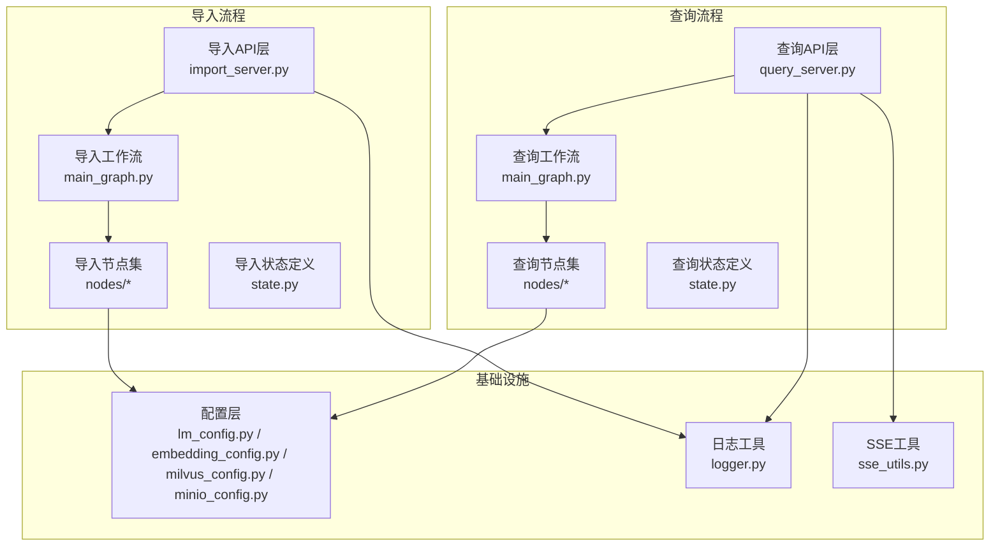
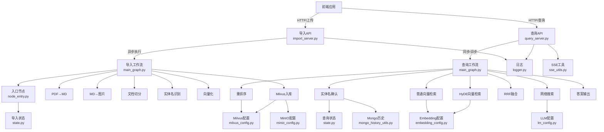
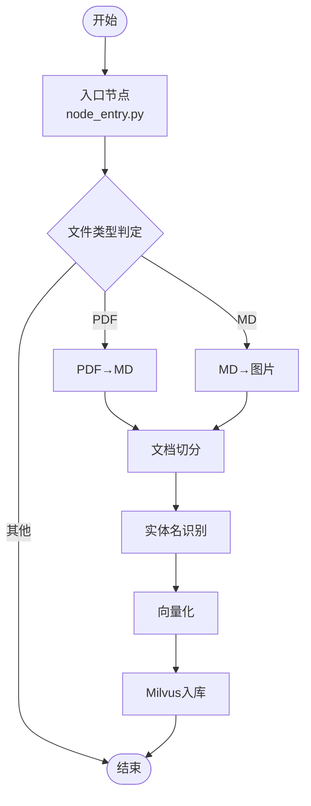
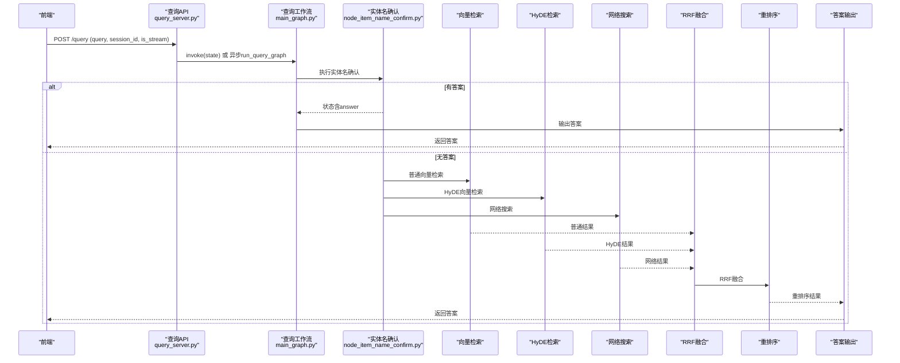
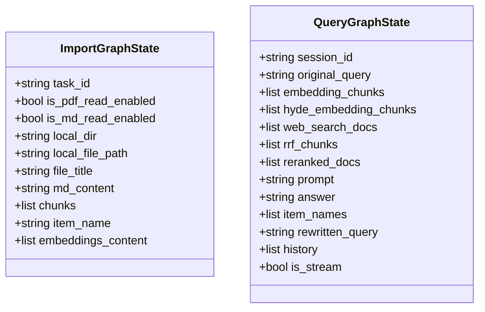
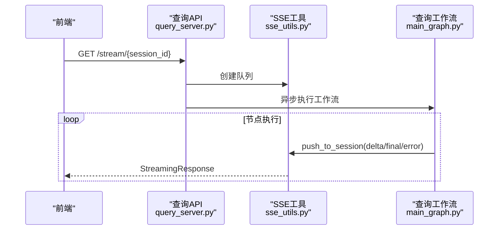
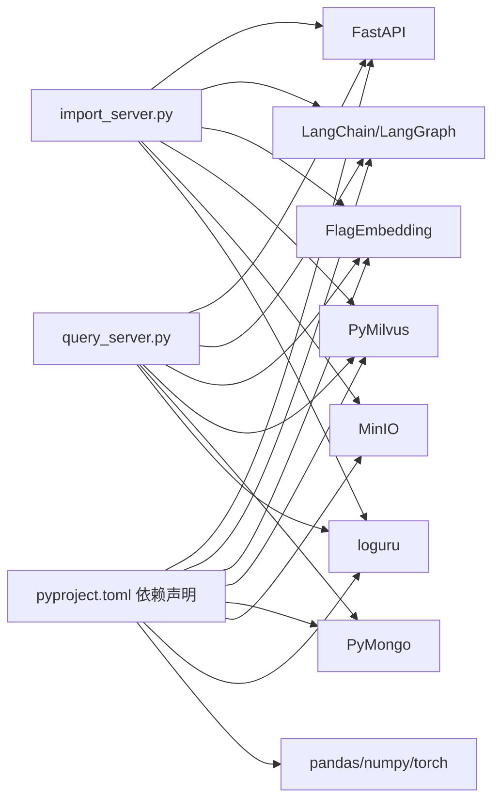
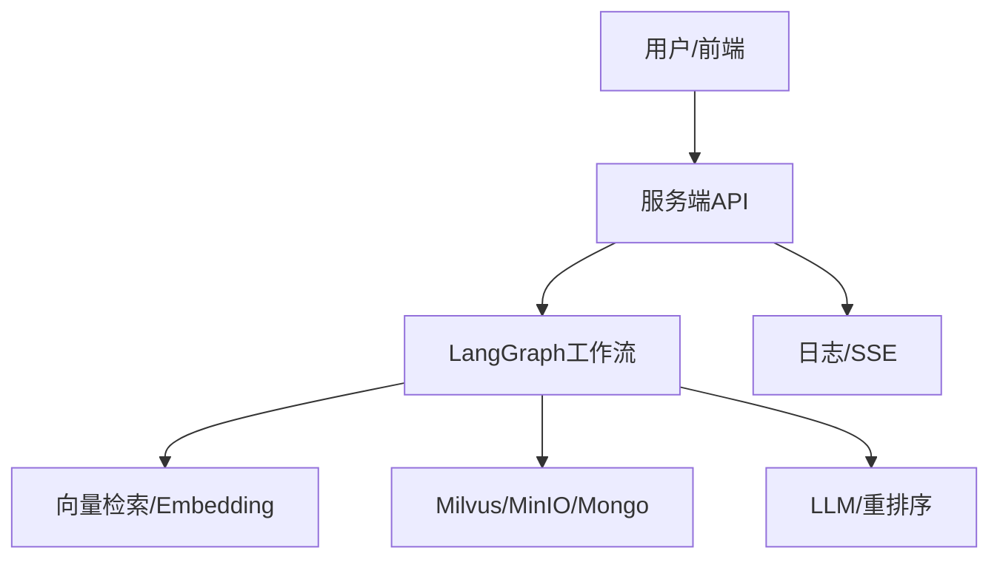

# 架构设计

<cite>
**本文引用的文件**
- [app/import_process/agent/main_graph.py](file://app/import_process/agent/main_graph.py)
- [app/query_process/agent/main_graph.py](file://app/query_process/agent/main_graph.py)
- [app/import_process/agent/state.py](file://app/import_process/agent/state.py)
- [app/query_process/agent/state.py](file://app/query_process/agent/state.py)
- [app/import_process/agent/nodes/node_entry.py](file://app/import_process/agent/nodes/node_entry.py)
- [app/query_process/agent/nodes/node_item_name_confirm.py](file://app/query_process/agent/nodes/node_item_name_confirm.py)
- [app/import_process/api/import_server.py](file://app/import_process/api/import_server.py)
- [app/query_process/api/query_server.py](file://app/query_process/api/query_server.py)
- [app/utils/sse_utils.py](file://app/utils/sse_utils.py)
- [app/core/logger.py](file://app/core/logger.py)
- [app/conf/lm_config.py](file://app/conf/lm_config.py)
- [app/conf/embedding_config.py](file://app/conf/embedding_config.py)
- [app/conf/milvus_config.py](file://app/conf/milvus_config.py)
- [app/conf/minio_config.py](file://app/conf/minio_config.py)
- [pyproject.toml](file://pyproject.toml)
</cite>

## 目录
1. [引言](#引言)
2. [项目结构](#项目结构)
3. [核心组件](#核心组件)
4. [架构总览](#架构总览)
5. [详细组件分析](#详细组件分析)
6. [依赖分析](#依赖分析)
7. [性能考量](#性能考量)
8. [故障排查指南](#故障排查指南)
9. [结论](#结论)
10. [附录](#附录)

## 引言
本架构设计文档面向RAG Agent项目，系统采用LangGraph工作流引擎构建“导入流程”和“查询流程”，围绕模块化与分层架构展开，强调清晰的数据流与控制流边界、可扩展的配置体系与稳定的错误处理机制。本文将从系统架构、组件关系、数据与控制流、错误处理与恢复策略、依赖关系与通信模式、系统上下文图与组件交互图、可扩展性与性能优化等方面进行全面阐述。

## 项目结构
项目采用“功能域+分层”的组织方式：
- 功能域分层：导入流程与查询流程分别独立构建LangGraph工作流，职责清晰、边界明确。
- 分层架构：API层（FastAPI）、Agent层（LangGraph工作流与节点）、工具与客户端层（日志、SSE、Mongo、Milvus、MinIO等）、配置层（dotenv + dataclass）。
- 文件组织：导入流程位于 app/import_process，查询流程位于 app/query_process；公共组件位于 app/utils、app/core、app/conf。

图表来源
- [app/import_process/api/import_server.py:1-172](file://app/import_process/api/import_server.py#L1-L172)
- [app/query_process/api/query_server.py:1-164](file://app/query_process/api/query_server.py#L1-L164)
- [app/import_process/agent/main_graph.py:1-134](file://app/import_process/agent/main_graph.py#L1-L134)
- [app/query_process/agent/main_graph.py:1-47](file://app/query_process/agent/main_graph.py#L1-L47)
- [app/import_process/agent/state.py:1-99](file://app/import_process/agent/state.py#L1-L99)
- [app/query_process/agent/state.py:1-97](file://app/query_process/agent/state.py#L1-L97)
- [app/utils/sse_utils.py:1-108](file://app/utils/sse_utils.py#L1-L108)
- [app/core/logger.py:1-109](file://app/core/logger.py#L1-L109)
- [app/conf/lm_config.py:1-27](file://app/conf/lm_config.py#L1-L27)
- [app/conf/embedding_config.py:1-24](file://app/conf/embedding_config.py#L1-L24)
- [app/conf/milvus_config.py:1-26](file://app/conf/milvus_config.py#L1-L26)
- [app/conf/minio_config.py:1-29](file://app/conf/minio_config.py#L1-L29)

章节来源
- [pyproject.toml:1-36](file://pyproject.toml#L1-L36)

## 核心组件
- LangGraph工作流
  - 导入流程：以入口节点为起点，根据输入文件类型动态路由至PDF解析或Markdown处理，随后串联文档切分、实体名识别、向量化与Milvus入库，最终结束。
  - 查询流程：以“实体名确认”为起点，分支并行执行普通向量检索、HyDE向量检索与网络搜索，汇聚后进行RRF融合与重排序，最终生成答案。
- 状态模型
  - 导入状态：包含任务ID、文件路径、解析开关、中间内容与向量入库数据等字段，提供默认状态构造与深拷贝能力。
  - 查询状态：包含会话ID、原始问题、各路检索结果、融合与重排序结果、最终答案、改写问题与历史等字段，提供默认状态与复制能力。
- API层
  - 导入API：文件上传、异步执行导入工作流、任务状态查询。
  - 查询API：发起提问、SSE长连接流式输出、历史查询与清空。
- 基础设施
  - 日志：基于loguru，支持控制台与文件双输出、异步安全、位置修复。
  - SSE：基于队列的事件推送，支持ready/delta/final/error/close等事件类型。
  - 配置：统一加载.env，提供LLM、Embedding、Milvus、MinIO等配置对象。

章节来源
- [app/import_process/agent/main_graph.py:1-134](file://app/import_process/agent/main_graph.py#L1-L134)
- [app/query_process/agent/main_graph.py:1-47](file://app/query_process/agent/main_graph.py#L1-L47)
- [app/import_process/agent/state.py:1-99](file://app/import_process/agent/state.py#L1-L99)
- [app/query_process/agent/state.py:1-97](file://app/query_process/agent/state.py#L1-L97)
- [app/import_process/api/import_server.py:1-172](file://app/import_process/api/import_server.py#L1-L172)
- [app/query_process/api/query_server.py:1-164](file://app/query_process/api/query_server.py#L1-L164)
- [app/utils/sse_utils.py:1-108](file://app/utils/sse_utils.py#L1-L108)
- [app/core/logger.py:1-109](file://app/core/logger.py#L1-L109)
- [app/conf/lm_config.py:1-27](file://app/conf/lm_config.py#L1-L27)
- [app/conf/embedding_config.py:1-24](file://app/conf/embedding_config.py#L1-L24)
- [app/conf/milvus_config.py:1-26](file://app/conf/milvus_config.py#L1-L26)
- [app/conf/minio_config.py:1-29](file://app/conf/minio_config.py#L1-L29)

## 架构总览
系统采用“前后端分离 + 服务端流式推送”的交互模式：
- 导入流程：前端上传文件 → 后端写入本地 → 异步启动LangGraph导入工作流 → 节点逐步执行并更新任务状态 → 完成后Milvus入库。
- 查询流程：前端发起问题 → 后端根据是否流式选择同步或异步 → 并行检索与融合排序 → 通过SSE持续推送中间结果 → 最终返回答案或错误事件。

图表来源
- [app/import_process/api/import_server.py:1-172](file://app/import_process/api/import_server.py#L1-L172)
- [app/query_process/api/query_server.py:1-164](file://app/query_process/api/query_server.py#L1-L164)
- [app/import_process/agent/main_graph.py:1-134](file://app/import_process/agent/main_graph.py#L1-L134)
- [app/query_process/agent/main_graph.py:1-47](file://app/query_process/agent/main_graph.py#L1-L47)
- [app/import_process/agent/nodes/node_entry.py:1-59](file://app/import_process/agent/nodes/node_entry.py#L1-L59)
- [app/query_process/agent/nodes/node_item_name_confirm.py:1-317](file://app/query_process/agent/nodes/node_item_name_confirm.py#L1-L317)
- [app/import_process/agent/state.py:1-99](file://app/import_process/agent/state.py#L1-L99)
- [app/query_process/agent/state.py:1-97](file://app/query_process/agent/state.py#L1-L97)
- [app/utils/sse_utils.py:1-108](file://app/utils/sse_utils.py#L1-L108)
- [app/core/logger.py:1-109](file://app/core/logger.py#L1-L109)
- [app/conf/lm_config.py:1-27](file://app/conf/lm_config.py#L1-L27)
- [app/conf/embedding_config.py:1-24](file://app/conf/embedding_config.py#L1-L24)
- [app/conf/milvus_config.py:1-26](file://app/conf/milvus_config.py#L1-L26)
- [app/conf/minio_config.py:1-29](file://app/conf/minio_config.py#L1-L29)

## 详细组件分析

### 导入流程（Import Workflow）
- 控制流
  - 入口节点根据输入文件类型动态路由：PDF→MD转换；MD→直接处理；其他类型结束。
  - 静态边顺序：PDF→MD→切分→实体名识别→向量化→Milvus入库→结束。
- 数据流
  - 状态字段贯穿：任务ID、文件路径、解析开关、中间内容、向量入库数据。
  - 节点间通过状态字典传递数据，避免耦合。
- 错误处理
  - 节点内对输入文件存在性与类型进行校验，非法输入直接返回状态。
  - API层捕获异常并更新任务状态为失败，便于前端轮询。

图表来源
- [app/import_process/agent/main_graph.py:1-134](file://app/import_process/agent/main_graph.py#L1-L134)
- [app/import_process/agent/nodes/node_entry.py:1-59](file://app/import_process/agent/nodes/node_entry.py#L1-L59)
- [app/import_process/agent/state.py:1-99](file://app/import_process/agent/state.py#L1-L99)

章节来源
- [app/import_process/agent/main_graph.py:1-134](file://app/import_process/agent/main_graph.py#L1-L134)
- [app/import_process/agent/nodes/node_entry.py:1-59](file://app/import_process/agent/nodes/node_entry.py#L1-L59)
- [app/import_process/agent/state.py:1-99](file://app/import_process/agent/state.py#L1-L99)
- [app/import_process/api/import_server.py:1-172](file://app/import_process/api/import_server.py#L1-L172)

### 查询流程（Query Workflow）
- 控制流
  - “实体名确认”节点根据是否有答案决定是否直接输出或并行分支。
  - 并行分支：普通向量检索、HyDE向量检索、网络搜索；汇聚后RRF融合与重排序，最终输出答案。
- 数据流
  - 状态字段覆盖：会话ID、原始问题、各路检索结果、融合与重排序结果、最终答案、改写问题与历史。
  - 节点间通过状态字典传递中间结果，便于后续重用与调试。
- 错误处理
  - 异常捕获后更新任务状态为失败，并通过SSE推送ERROR事件，前端可感知。

图表来源
- [app/query_process/agent/main_graph.py:1-47](file://app/query_process/agent/main_graph.py#L1-L47)
- [app/query_process/agent/nodes/node_item_name_confirm.py:1-317](file://app/query_process/agent/nodes/node_item_name_confirm.py#L1-L317)
- [app/query_process/api/query_server.py:1-164](file://app/query_process/api/query_server.py#L1-L164)

章节来源
- [app/query_process/agent/main_graph.py:1-47](file://app/query_process/agent/main_graph.py#L1-L47)
- [app/query_process/agent/state.py:1-97](file://app/query_process/agent/state.py#L1-L97)
- [app/query_process/agent/nodes/node_item_name_confirm.py:1-317](file://app/query_process/agent/nodes/node_item_name_confirm.py#L1-L317)
- [app/query_process/api/query_server.py:1-164](file://app/query_process/api/query_server.py#L1-L164)

### 状态模型（TypedDict）
- 导入状态
  - 关键字段：任务ID、解析开关、文件路径、中间内容、切片与向量入库数据。
  - 默认状态工厂：提供深拷贝与覆盖能力，避免全局共享导致的副作用。
- 查询状态
  - 关键字段：会话ID、原始问题、各路检索结果、融合与重排序结果、最终答案、改写问题与历史。
  - 默认状态工厂：提供深拷贝与复制能力，便于在节点间传递与隔离。

图表来源
- [app/import_process/agent/state.py:1-99](file://app/import_process/agent/state.py#L1-L99)
- [app/query_process/agent/state.py:1-97](file://app/query_process/agent/state.py#L1-L97)

章节来源
- [app/import_process/agent/state.py:1-99](file://app/import_process/agent/state.py#L1-L99)
- [app/query_process/agent/state.py:1-97](file://app/query_process/agent/state.py#L1-L97)

### API层与SSE流式通信
- 导入API
  - 上传文件写入本地目录，异步启动导入工作流，任务状态通过内存字典维护，支持轮询查询。
- 查询API
  - 同步/异步两种模式：异步时创建SSE队列，节点执行过程中通过事件推送进度与增量结果，最终返回答案或错误事件。
- SSE工具
  - 基于队列的消息打包与生成器，支持ready/delta/final/error/close事件类型，断开连接时自动清理。

图表来源
- [app/query_process/api/query_server.py:1-164](file://app/query_process/api/query_server.py#L1-L164)
- [app/utils/sse_utils.py:1-108](file://app/utils/sse_utils.py#L1-L108)

章节来源
- [app/import_process/api/import_server.py:1-172](file://app/import_process/api/import_server.py#L1-L172)
- [app/query_process/api/query_server.py:1-164](file://app/query_process/api/query_server.py#L1-L164)
- [app/utils/sse_utils.py:1-108](file://app/utils/sse_utils.py#L1-L108)

## 依赖分析
- 外部依赖
  - Web框架：FastAPI、Uvicorn
  - AI/检索：LangChain、LangGraph、FlagEmbedding、PyMilvus、PyMongo、MinIO
  - 工具：loguru、python-dotenv、numpy、pandas、torch系列
- 内部依赖
  - API层依赖LangGraph编译实例与状态定义
  - 节点依赖配置层、客户端层与工具层
  - 日志与SSE为横切关注点，被API与节点广泛使用

图表来源
- [pyproject.toml:1-36](file://pyproject.toml#L1-L36)
- [app/import_process/api/import_server.py:1-172](file://app/import_process/api/import_server.py#L1-L172)
- [app/query_process/api/query_server.py:1-164](file://app/query_process/api/query_server.py#L1-L164)

章节来源
- [pyproject.toml:1-36](file://pyproject.toml#L1-L36)

## 性能考量
- 并行与异步
  - 查询流程在“实体名确认”后并行执行多路检索，缩短端到端延迟。
  - API层使用BackgroundTasks与SSE异步推送，提升用户体验。
- 资源与缓存
  - SSE队列按会话隔离，避免全局锁竞争；日志异步入队，降低I/O阻塞。
  - 向量检索采用混合权重与归一化，减少无效召回。
- 可扩展性
  - LangGraph节点可插拔，新增节点不影响既有边；状态字段可按需扩展。
  - 配置层集中管理，便于切换模型与数据库参数。

## 故障排查指南
- 常见问题
  - 上传文件缺失或类型不支持：入口节点会记录错误并结束流程，检查API返回与日志。
  - Milvus连接失败：检查Milvus配置与集合名称，确认向量维度与索引设置。
  - LLM调用异常：检查LLM配置与API Key，查看SSE错误事件。
  - SSE断连：生成器捕获Cancelled/Reset/Pipe异常并静默退出，前端需实现重连逻辑。
- 日志与追踪
  - 统一日志格式与位置修复，结合任务ID与会话ID快速定位问题。
  - API层对异常进行捕获并更新任务状态，前端轮询可感知失败。

章节来源
- [app/import_process/agent/nodes/node_entry.py:1-59](file://app/import_process/agent/nodes/node_entry.py#L1-L59)
- [app/query_process/agent/nodes/node_item_name_confirm.py:1-317](file://app/query_process/agent/nodes/node_item_name_confirm.py#L1-L317)
- [app/utils/sse_utils.py:1-108](file://app/utils/sse_utils.py#L1-L108)
- [app/core/logger.py:1-109](file://app/core/logger.py#L1-L109)

## 结论
本项目以LangGraph为核心，构建了清晰的导入与查询两条主干流程，配合模块化与分层架构，实现了良好的可维护性与可扩展性。通过状态驱动的数据流、条件边与并行分支，系统在保证稳定性的同时兼顾性能。建议在后续迭代中进一步完善监控与告警、引入超时与重试策略，并对热点路径进行缓存优化。

## 附录
- 系统上下文图（概念性）
