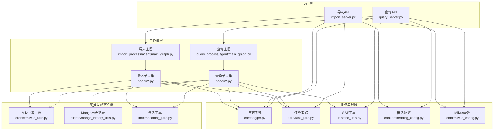
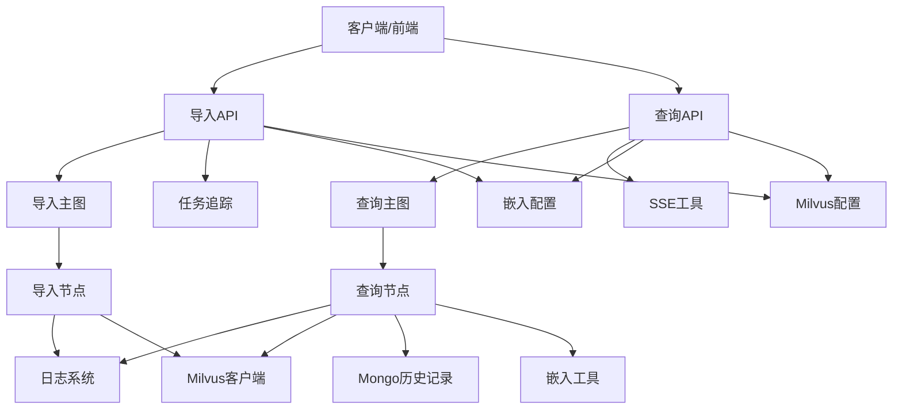
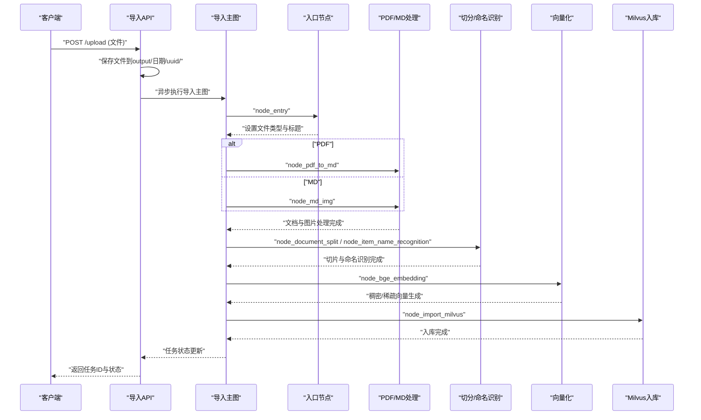
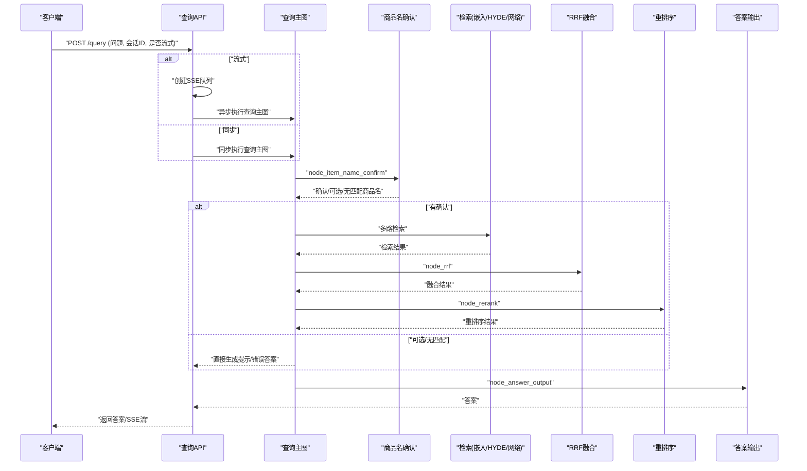
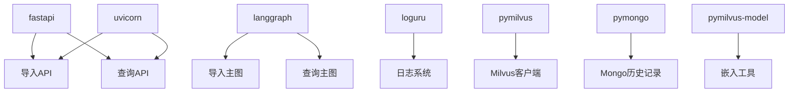

# 系统架构总览

<cite>
**本文档引用的文件**
- [app/import_process/agent/main_graph.py](file://app/import_process/agent/main_graph.py)
- [app/query_process/agent/main_graph.py](file://app/query_process/agent/main_graph.py)
- [app/import_process/api/import_server.py](file://app/import_process/api/import_server.py)
- [app/query_process/api/query_server.py](file://app/query_process/api/query_server.py)
- [app/core/logger.py](file://app/core/logger.py)
- [app/utils/task_utils.py](file://app/utils/task_utils.py)
- [app/utils/sse_utils.py](file://app/utils/sse_utils.py)
- [app/import_process/agent/nodes/node_entry.py](file://app/import_process/agent/nodes/node_entry.py)
- [app/query_process/agent/nodes/node_item_name_confirm.py](file://app/query_process/agent/nodes/node_item_name_confirm.py)
- [app/clients/milvus_utils.py](file://app/clients/milvus_utils.py)
- [app/lm/embedding_utils.py](file://app/lm/embedding_utils.py)
- [app/clients/mongo_history_utils.py](file://app/clients/mongo_history_utils.py)
- [pyproject.toml](file://pyproject.toml)
- [app/conf/embedding_config.py](file://app/conf/embedding_config.py)
- [app/conf/milvus_config.py](file://app/conf/milvus_config.py)
</cite>

## 目录
1. [简介](#简介)
2. [项目结构](#项目结构)
3. [核心组件](#核心组件)
4. [架构总览](#架构总览)
5. [详细组件分析](#详细组件分析)
6. [依赖关系分析](#依赖关系分析)
7. [性能考量](#性能考量)
8. [故障排查指南](#故障排查指南)
9. [结论](#结论)

## 简介
本项目是一个基于FastAPI与LangGraph的工作流引擎的RAG Agent系统，围绕“导入流程”和“查询流程”两条主线构建。导入流程负责将PDF/MD文件解析、切分、向量化并入库（Milvus），随后进行知识图谱导入；查询流程负责对用户问题进行商品名确认、多路检索、重排序与答案生成，并通过SSE实现流式输出。系统采用模块化设计与分层架构，结合统一日志系统、配置管理与任务追踪机制，确保可维护性与可观测性。

## 项目结构
系统采用按功能域划分的模块化组织方式，主要分为：
- API层：分别提供导入服务与查询服务的FastAPI应用
- 工作流层：基于LangGraph的导入/查询主图与节点实现
- 业务工具层：日志、任务追踪、SSE、配置等通用能力
- 基础设施客户端：Milvus、MongoDB、MinIO等外部系统客户端
- 语言模型与嵌入：嵌入模型封装与向量化工具

图表来源
- [app/import_process/api/import_server.py:1-172](file://app/import_process/api/import_server.py#L1-L172)
- [app/query_process/api/query_server.py:1-164](file://app/query_process/api/query_server.py#L1-L164)
- [app/import_process/agent/main_graph.py:1-134](file://app/import_process/agent/main_graph.py#L1-L134)
- [app/query_process/agent/main_graph.py:1-47](file://app/query_process/agent/main_graph.py#L1-L47)
- [app/core/logger.py:1-109](file://app/core/logger.py#L1-L109)
- [app/utils/task_utils.py:1-187](file://app/utils/task_utils.py#L1-L187)
- [app/utils/sse_utils.py:1-108](file://app/utils/sse_utils.py#L1-L108)
- [app/clients/milvus_utils.py:1-198](file://app/clients/milvus_utils.py#L1-L198)
- [app/lm/embedding_utils.py:1-108](file://app/lm/embedding_utils.py#L1-L108)
- [app/clients/mongo_history_utils.py:1-242](file://app/clients/mongo_history_utils.py#L1-L242)
- [app/conf/embedding_config.py:1-24](file://app/conf/embedding_config.py#L1-L24)
- [app/conf/milvus_config.py:1-26](file://app/conf/milvus_config.py#L1-L26)

章节来源
- [pyproject.toml:1-36](file://pyproject.toml#L1-L36)

## 核心组件
- FastAPI应用与路由
  - 导入服务：提供文件上传、任务状态查询等接口，异步触发LangGraph导入流程
  - 查询服务：提供健康检查、聊天页面、提问接口、SSE流式输出、历史记录查询与清理
- LangGraph工作流
  - 导入主图：根据文件类型动态路由，串联解析、切分、向量化、入库等节点
  - 查询主图：从商品名确认开始，多路检索、融合、重排序，最终生成答案
- 日志系统
  - 基于loguru，支持.env配置的控制台/文件双输出、自动路径与清理、异步安全
- 任务追踪与SSE
  - 内存态任务状态管理，中文节点名映射，SSE事件推送与断连处理
- 基础设施客户端
  - Milvus：单例客户端、混合检索、批量查询
  - MongoDB：历史对话记录读写、索引优化
  - 嵌入工具：BGE-M3单例模型、混合向量生成
- 配置管理
  - 嵌入与Milvus配置类，统一从.env加载

章节来源
- [app/import_process/api/import_server.py:1-172](file://app/import_process/api/import_server.py#L1-L172)
- [app/query_process/api/query_server.py:1-164](file://app/query_process/api/query_server.py#L1-L164)
- [app/import_process/agent/main_graph.py:1-134](file://app/import_process/agent/main_graph.py#L1-L134)
- [app/query_process/agent/main_graph.py:1-47](file://app/query_process/agent/main_graph.py#L1-L47)
- [app/core/logger.py:1-109](file://app/core/logger.py#L1-L109)
- [app/utils/task_utils.py:1-187](file://app/utils/task_utils.py#L1-L187)
- [app/utils/sse_utils.py:1-108](file://app/utils/sse_utils.py#L1-L108)
- [app/clients/milvus_utils.py:1-198](file://app/clients/milvus_utils.py#L1-L198)
- [app/lm/embedding_utils.py:1-108](file://app/lm/embedding_utils.py#L1-L108)
- [app/clients/mongo_history_utils.py:1-242](file://app/clients/mongo_history_utils.py#L1-L242)
- [app/conf/embedding_config.py:1-24](file://app/conf/embedding_config.py#L1-L24)
- [app/conf/milvus_config.py:1-26](file://app/conf/milvus_config.py#L1-L26)

## 架构总览
系统采用“API层-工作流层-业务工具层-基础设施客户端”的分层架构，API层通过FastAPI暴露REST接口，工作流层以LangGraph实现业务编排，业务工具层提供日志、任务追踪与SSE等横切能力，基础设施客户端封装外部系统访问。导入与查询两条主流程共享统一的日志与配置体系，但各自拥有独立的API与工作流。

图表来源
- [app/import_process/api/import_server.py:1-172](file://app/import_process/api/import_server.py#L1-L172)
- [app/query_process/api/query_server.py:1-164](file://app/query_process/api/query_server.py#L1-L164)
- [app/import_process/agent/main_graph.py:1-134](file://app/import_process/agent/main_graph.py#L1-L134)
- [app/query_process/agent/main_graph.py:1-47](file://app/query_process/agent/main_graph.py#L1-L47)
- [app/core/logger.py:1-109](file://app/core/logger.py#L1-L109)
- [app/utils/task_utils.py:1-187](file://app/utils/task_utils.py#L1-L187)
- [app/utils/sse_utils.py:1-108](file://app/utils/sse_utils.py#L1-L108)
- [app/clients/milvus_utils.py:1-198](file://app/clients/milvus_utils.py#L1-L198)
- [app/lm/embedding_utils.py:1-108](file://app/lm/embedding_utils.py#L1-L108)
- [app/clients/mongo_history_utils.py:1-242](file://app/clients/mongo_history_utils.py#L1-L242)
- [app/conf/embedding_config.py:1-24](file://app/conf/embedding_config.py#L1-L24)
- [app/conf/milvus_config.py:1-26](file://app/conf/milvus_config.py#L1-L26)

## 详细组件分析

### 导入流程架构
导入流程以LangGraph主图为入口，根据文件类型动态选择PDF或MD处理路径，随后串行执行解析、切分、命名识别、向量化与Milvus入库等步骤。API层提供文件上传与任务状态查询接口，异步触发工作流执行，并通过任务追踪与日志记录进度。

图表来源
- [app/import_process/api/import_server.py:98-138](file://app/import_process/api/import_server.py#L98-L138)
- [app/import_process/agent/main_graph.py:19-65](file://app/import_process/agent/main_graph.py#L19-L65)
- [app/import_process/agent/nodes/node_entry.py:10-59](file://app/import_process/agent/nodes/node_entry.py#L10-L59)

章节来源
- [app/import_process/agent/main_graph.py:1-134](file://app/import_process/agent/main_graph.py#L1-L134)
- [app/import_process/agent/nodes/node_entry.py:1-59](file://app/import_process/agent/nodes/node_entry.py#L1-L59)
- [app/import_process/api/import_server.py:1-172](file://app/import_process/api/import_server.py#L1-L172)

### 查询流程架构
查询流程以商品名确认为核心，结合历史对话与LLM抽取与重写，随后进行多路检索（稠密/稀疏/网页）、融合与重排序，最终生成答案并通过SSE进行流式输出。API层提供健康检查、聊天页面、提问接口与历史记录管理。

图表来源
- [app/query_process/api/query_server.py:78-112](file://app/query_process/api/query_server.py#L78-L112)
- [app/query_process/agent/main_graph.py:12-47](file://app/query_process/agent/main_graph.py#L12-L47)
- [app/query_process/agent/nodes/node_item_name_confirm.py:218-290](file://app/query_process/agent/nodes/node_item_name_confirm.py#L218-L290)
- [app/utils/sse_utils.py:54-108](file://app/utils/sse_utils.py#L54-L108)

章节来源
- [app/query_process/agent/main_graph.py:1-47](file://app/query_process/agent/main_graph.py#L1-L47)
- [app/query_process/agent/nodes/node_item_name_confirm.py:1-317](file://app/query_process/agent/nodes/node_item_name_confirm.py#L1-L317)
- [app/query_process/api/query_server.py:1-164](file://app/query_process/api/query_server.py#L1-L164)
- [app/utils/sse_utils.py:1-108](file://app/utils/sse_utils.py#L1-L108)

### 数据流与控制流组织
- 数据流
  - 导入流程：文件输入 → 解析/切分 → 命名识别 → 向量化 → Milvus入库 → 知识图谱导入
  - 查询流程：问题输入 → 商品名确认 → 多路检索 → 融合/重排序 → 答案输出
- 控制流
  - API层负责请求接入、异步调度与状态管理
  - LangGraph主图定义节点与边，实现条件分支与串行/并行组合
  - 任务追踪与SSE提供前端可见的进度与流式输出
  - 日志系统贯穿所有组件，提供统一可观测性

章节来源
- [app/import_process/agent/main_graph.py:1-134](file://app/import_process/agent/main_graph.py#L1-L134)
- [app/query_process/agent/main_graph.py:1-47](file://app/query_process/agent/main_graph.py#L1-L47)
- [app/utils/task_utils.py:1-187](file://app/utils/task_utils.py#L1-L187)
- [app/utils/sse_utils.py:1-108](file://app/utils/sse_utils.py#L1-L108)

### 核心基础设施组件设计
- 日志系统
  - 基于loguru，支持.env开关控制台/文件输出、自动路径与清理、异步安全、中文友好
- 配置管理
  - 嵌入配置：模型路径、设备、半精度等
  - Milvus配置：连接地址、集合名称等
- 任务追踪
  - 内存态任务状态字典、节点中文映射、结果存储与状态更新
- SSE工具
  - 会话队列、事件打包、生成器与断连处理

章节来源
- [app/core/logger.py:1-109](file://app/core/logger.py#L1-L109)
- [app/conf/embedding_config.py:1-24](file://app/conf/embedding_config.py#L1-L24)
- [app/conf/milvus_config.py:1-26](file://app/conf/milvus_config.py#L1-L26)
- [app/utils/task_utils.py:1-187](file://app/utils/task_utils.py#L1-L187)
- [app/utils/sse_utils.py:1-108](file://app/utils/sse_utils.py#L1-L108)

## 依赖关系分析
系统依赖以pyproject.toml为准，核心依赖包括FastAPI、LangGraph、loguru、Milvus、MongoDB、嵌入模型等。导入与查询流程共享基础依赖，同时各自依赖相应的节点实现与客户端。

图表来源
- [pyproject.toml:9-35](file://pyproject.toml#L9-L35)
- [app/import_process/api/import_server.py:1-172](file://app/import_process/api/import_server.py#L1-L172)
- [app/query_process/api/query_server.py:1-164](file://app/query_process/api/query_server.py#L1-L164)

章节来源
- [pyproject.toml:1-36](file://pyproject.toml#L1-L36)

## 性能考量
- 模型与向量化
  - BGE-M3采用单例模式，避免重复加载；启用原生L2归一化，适配Milvus IP内积检索
- Milvus检索
  - 混合检索（稠密+稀疏）与加权融合，提升召回质量；批量查询与ID类型转换优化
- 数据库访问
  - MongoDB单例与复合索引，减少连接开销与查询延迟
- 日志与SSE
  - 异步入队与队列阻塞控制，降低对主事件循环的影响

章节来源
- [app/lm/embedding_utils.py:1-108](file://app/lm/embedding_utils.py#L1-L108)
- [app/clients/milvus_utils.py:1-198](file://app/clients/milvus_utils.py#L1-L198)
- [app/clients/mongo_history_utils.py:1-242](file://app/clients/mongo_history_utils.py#L1-L242)
- [app/core/logger.py:1-109](file://app/core/logger.py#L1-L109)
- [app/utils/sse_utils.py:1-108](file://app/utils/sse_utils.py#L1-L108)

## 故障排查指南
- 日志定位
  - 使用统一logger，结合.env配置控制台/文件输出，定位业务模块真实调用位置
- 任务状态
  - 通过任务状态查询接口与任务追踪工具，核对已完成/运行中节点
- SSE断连
  - 检查会话队列创建与断连检测，确认事件推送与清理逻辑
- Milvus/Mongo异常
  - 核对配置项与连接状态，查看异常日志与回退策略

章节来源
- [app/core/logger.py:1-109](file://app/core/logger.py#L1-L109)
- [app/utils/task_utils.py:1-187](file://app/utils/task_utils.py#L1-L187)
- [app/utils/sse_utils.py:1-108](file://app/utils/sse_utils.py#L1-L108)
- [app/clients/milvus_utils.py:1-198](file://app/clients/milvus_utils.py#L1-L198)
- [app/clients/mongo_history_utils.py:1-242](file://app/clients/mongo_history_utils.py#L1-L242)

## 结论
本系统通过FastAPI与LangGraph实现了清晰的导入与查询两条主流程，配合统一的日志、配置与任务追踪机制，具备良好的可维护性与可观测性。基础设施客户端封装外部系统访问，确保核心业务逻辑与外部依赖解耦。未来可在分布式部署、持久化任务队列与监控告警方面进一步增强。