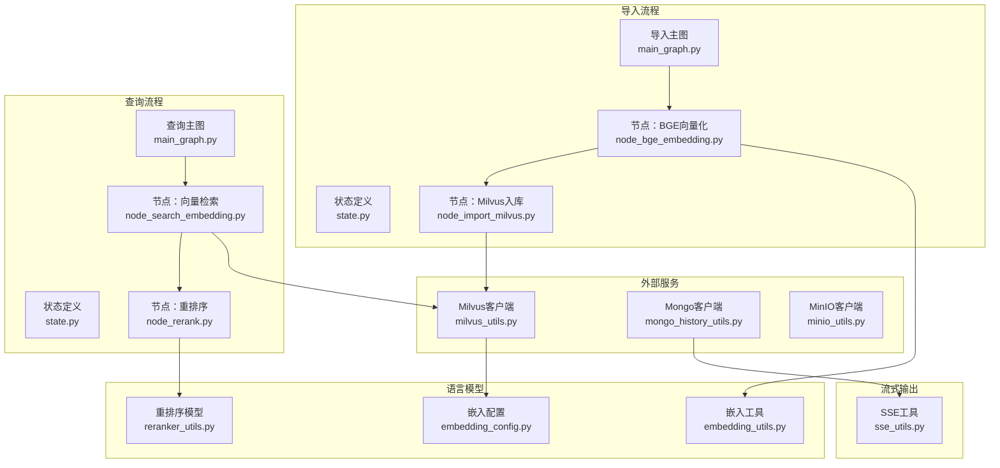
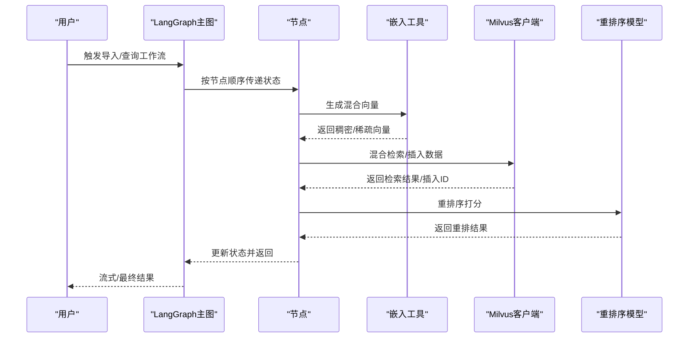
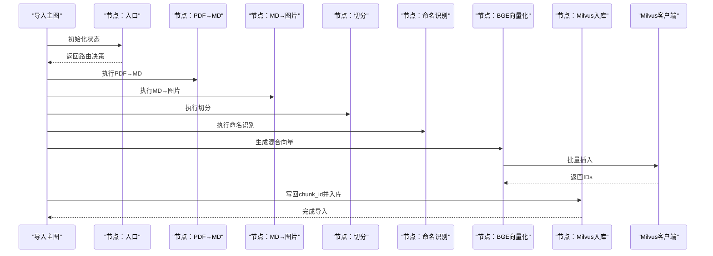
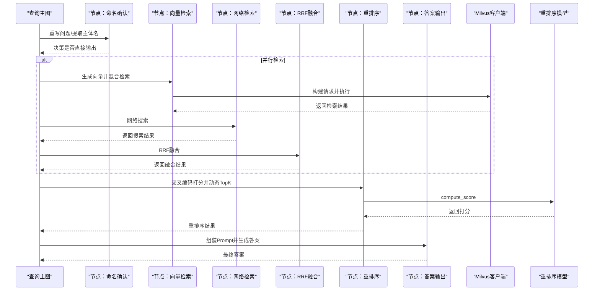
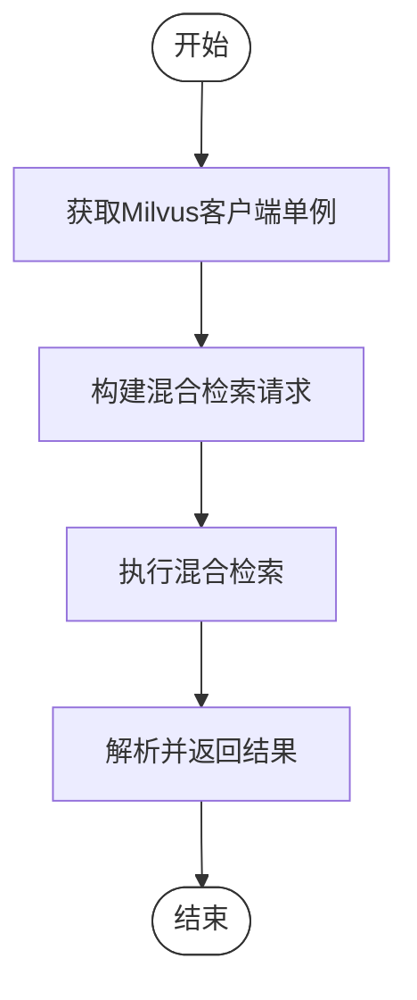
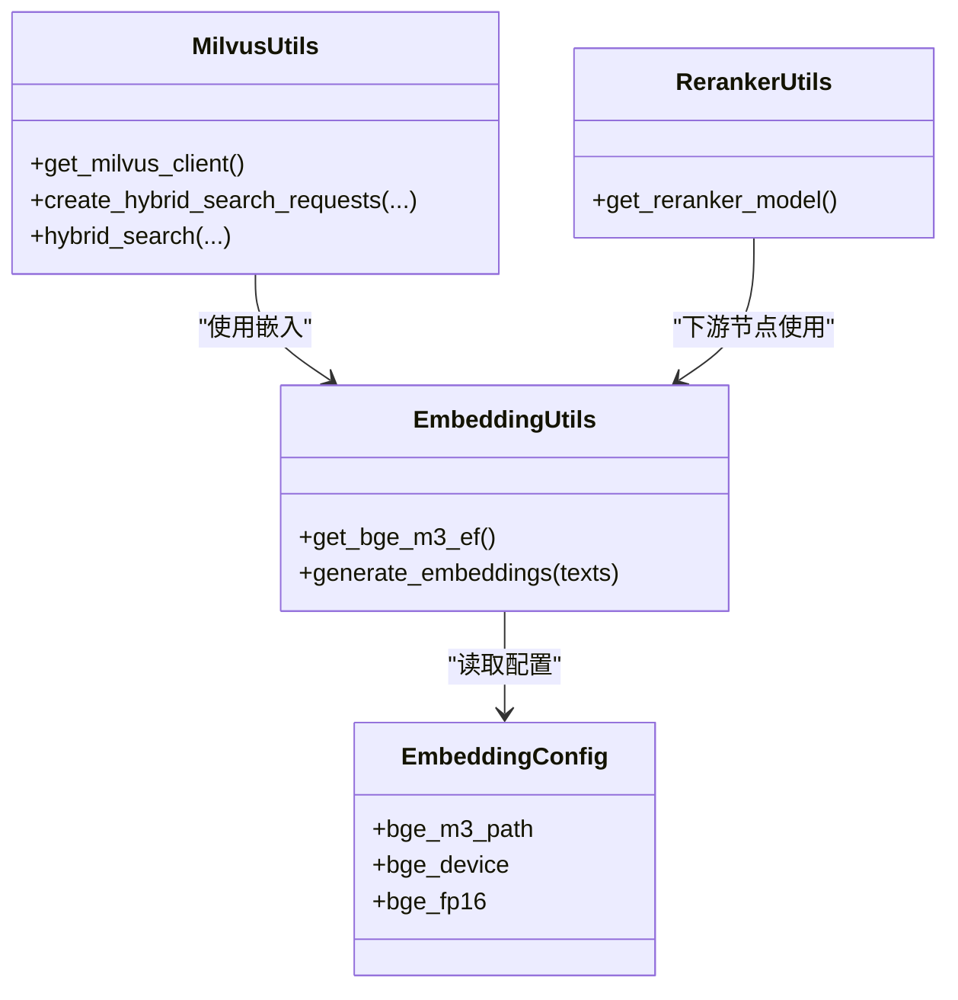
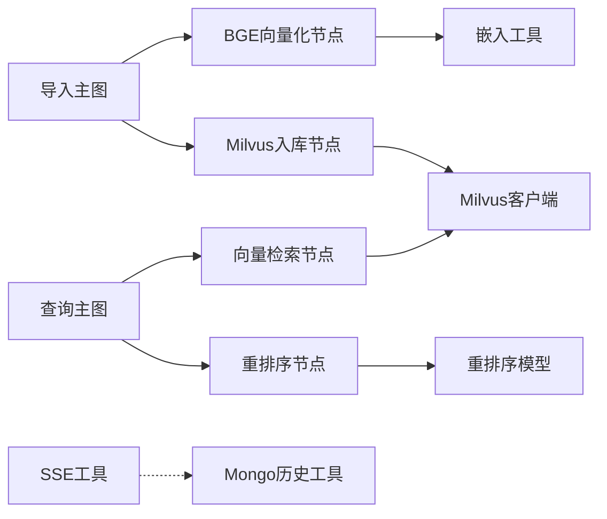

# 组件交互设计

<cite>
**本文引用的文件**   
- [app/import_process/agent/main_graph.py](file://app/import_process/agent/main_graph.py)
- [app/query_process/agent/main_graph.py](file://app/query_process/agent/main_graph.py)
- [app/import_process/agent/state.py](file://app/import_process/agent/state.py)
- [app/query_process/agent/state.py](file://app/query_process/agent/state.py)
- [app/lm/embedding_utils.py](file://app/lm/embedding_utils.py)
- [app/clients/milvus_utils.py](file://app/clients/milvus_utils.py)
- [app/clients/minio_utils.py](file://app/clients/minio_utils.py)
- [app/clients/mongo_history_utils.py](file://app/clients/mongo_history_utils.py)
- [app/conf/embedding_config.py](file://app/conf/embedding_config.py)
- [app/utils/sse_utils.py](file://app/utils/sse_utils.py)
- [app/import_process/agent/nodes/node_bge_embedding.py](file://app/import_process/agent/nodes/node_bge_embedding.py)
- [app/import_process/agent/nodes/node_import_milvus.py](file://app/import_process/agent/nodes/node_import_milvus.py)
- [app/query_process/agent/nodes/node_search_embedding.py](file://app/query_process/agent/nodes/node_search_embedding.py)
- [app/query_process/agent/nodes/node_rerank.py](file://app/query_process/agent/nodes/node_rerank.py)
- [app/lm/reranker_utils.py](file://app/lm/reranker_utils.py)
</cite>

## 目录
1. [简介](#简介)
2. [项目结构](#项目结构)
3. [核心组件](#核心组件)
4. [架构总览](#架构总览)
5. [详细组件分析](#详细组件分析)
6. [依赖关系分析](#依赖关系分析)
7. [性能考量](#性能考量)
8. [故障排查指南](#故障排查指南)
9. [结论](#结论)
10. [附录](#附录)

## 简介
本设计文档聚焦RAG Agent项目中“组件交互”的工程实践，围绕以下目标展开：
- 明确系统内各组件之间的通信模式与交互协议
- 解释外部服务集成的设计原则（客户端封装、连接管理、错误处理）
- 文档化组件间的依赖关系与耦合度控制策略
- 说明异步通信机制与同步调用的协调方式
- 解释组件生命周期管理与资源释放策略
- 提供组件交互图与通信协议图，展示组件间的调用关系与数据交换方式

## 项目结构
项目采用“按流程分层 + 按功能分模块”的组织方式：
- 导入流程（Import Pipeline）：以LangGraph状态机编排多个节点，串联PDF/MD解析、切分、命名实体识别、向量化、Milvus入库等步骤
- 查询流程（Query Pipeline）：以LangGraph状态机编排节点，串联问题重写、向量检索、Web检索、RRF融合、重排序与最终回答生成
- 语言模型与嵌入：封装BGE-M3混合向量模型与交叉编码重排序模型，提供单例与参数化配置
- 外部服务客户端：封装Milvus、MinIO、MongoDB等外部依赖，统一连接管理与错误处理
- SSE流式输出：提供会话级事件推送与资源清理

图表来源
- [app/import_process/agent/main_graph.py:19-65](file://app/import_process/agent/main_graph.py#L19-L65)
- [app/query_process/agent/main_graph.py:12-47](file://app/query_process/agent/main_graph.py#L12-L47)
- [app/import_process/agent/state.py:5-90](file://app/import_process/agent/state.py#L5-L90)
- [app/query_process/agent/state.py:5-68](file://app/query_process/agent/state.py#L5-L68)
- [app/lm/embedding_utils.py:8-48](file://app/lm/embedding_utils.py#L8-L48)
- [app/clients/milvus_utils.py:10-31](file://app/clients/milvus_utils.py#L10-L31)
- [app/clients/mongo_history_utils.py:71-83](file://app/clients/mongo_history_utils.py#L71-L83)
- [app/clients/minio_utils.py:42-43](file://app/clients/minio_utils.py#L42-L43)
- [app/utils/sse_utils.py:17-35](file://app/utils/sse_utils.py#L17-L35)
- [app/import_process/agent/nodes/node_bge_embedding.py:10-84](file://app/import_process/agent/nodes/node_bge_embedding.py#L10-L84)
- [app/import_process/agent/nodes/node_import_milvus.py:114-149](file://app/import_process/agent/nodes/node_import_milvus.py#L114-L149)
- [app/query_process/agent/nodes/node_search_embedding.py:12-72](file://app/query_process/agent/nodes/node_search_embedding.py#L12-L72)
- [app/query_process/agent/nodes/node_rerank.py:162-208](file://app/query_process/agent/nodes/node_rerank.py#L162-L208)
- [app/lm/reranker_utils.py:6-13](file://app/lm/reranker_utils.py#L6-L13)

章节来源
- [app/import_process/agent/main_graph.py:19-65](file://app/import_process/agent/main_graph.py#L19-L65)
- [app/query_process/agent/main_graph.py:12-47](file://app/query_process/agent/main_graph.py#L12-L47)

## 核心组件
- LangGraph主图与状态
  - 导入主图：定义节点与条件边，依据输入文件类型路由到不同分支，最终汇聚到向量化与Milvus入库
  - 查询主图：依据是否已有答案决定直接输出或并行执行多路检索，随后融合与重排序
- 节点职责
  - 导入链路节点：BGE向量化、Milvus入库
  - 查询链路节点：向量检索、重排序
- 外部服务客户端
  - Milvus：单例客户端、混合检索请求构建、混合检索执行
  - MongoDB：会话历史读写工具类，单例懒加载
  - MinIO：桶初始化与策略设置
- 语言模型与配置
  - BGE-M3嵌入：单例模型、混合向量生成
  - 重排序模型：FlagReranker单例
  - 配置：嵌入设备、半精度、模型路径等
- SSE流式输出
  - 会话队列管理、事件打包、异步生成器

章节来源
- [app/import_process/agent/main_graph.py:19-65](file://app/import_process/agent/main_graph.py#L19-L65)
- [app/query_process/agent/main_graph.py:12-47](file://app/query_process/agent/main_graph.py#L12-L47)
- [app/import_process/agent/state.py:5-90](file://app/import_process/agent/state.py#L5-L90)
- [app/query_process/agent/state.py:5-68](file://app/query_process/agent/state.py#L5-L68)
- [app/lm/embedding_utils.py:8-48](file://app/lm/embedding_utils.py#L8-L48)
- [app/clients/milvus_utils.py:10-31](file://app/clients/milvus_utils.py#L10-L31)
- [app/clients/mongo_history_utils.py:71-83](file://app/clients/mongo_history_utils.py#L71-L83)
- [app/clients/minio_utils.py:42-43](file://app/clients/minio_utils.py#L42-L43)
- [app/utils/sse_utils.py:17-35](file://app/utils/sse_utils.py#L17-L35)
- [app/lm/reranker_utils.py:6-13](file://app/lm/reranker_utils.py#L6-L13)

## 架构总览
系统采用“LangGraph状态机编排 + 外部服务客户端封装”的架构：
- 导入流程：PDF/MD → 切分 → 命名实体识别 → BGE向量化 → Milvus入库
- 查询流程：问题重写 → 并行检索（向量+网络）→ RRF融合 → 重排序 → 输出答案
- 外部服务：Milvus（向量检索）、MongoDB（历史会话）、MinIO（对象存储）
- 流式输出：SSE事件推送，支持断连恢复与资源清理

图表来源
- [app/import_process/agent/main_graph.py:19-65](file://app/import_process/agent/main_graph.py#L19-L65)
- [app/query_process/agent/main_graph.py:12-47](file://app/query_process/agent/main_graph.py#L12-L47)
- [app/import_process/agent/nodes/node_bge_embedding.py:10-84](file://app/import_process/agent/nodes/node_bge_embedding.py#L10-L84)
- [app/import_process/agent/nodes/node_import_milvus.py:114-149](file://app/import_process/agent/nodes/node_import_milvus.py#L114-L149)
- [app/query_process/agent/nodes/node_search_embedding.py:12-72](file://app/query_process/agent/nodes/node_search_embedding.py#L12-L72)
- [app/query_process/agent/nodes/node_rerank.py:162-208](file://app/query_process/agent/nodes/node_rerank.py#L162-L208)
- [app/lm/embedding_utils.py:51-96](file://app/lm/embedding_utils.py#L51-L96)
- [app/clients/milvus_utils.py:117-198](file://app/clients/milvus_utils.py#L117-L198)
- [app/lm/reranker_utils.py:6-13](file://app/lm/reranker_utils.py#L6-L13)

## 详细组件分析

### 导入流程组件交互
- 主图与状态
  - 主图定义节点与条件边，依据输入文件类型选择PDF/MD路径
  - 状态包含任务ID、路径、内容、切片、向量等字段
- 节点交互
  - BGE向量化：从状态读取切片，批量生成混合向量，写回状态
  - Milvus入库：创建集合、删除旧数据、批量插入并回填chunk_id

图表来源
- [app/import_process/agent/main_graph.py:19-65](file://app/import_process/agent/main_graph.py#L19-L65)
- [app/import_process/agent/state.py:5-90](file://app/import_process/agent/state.py#L5-L90)
- [app/import_process/agent/nodes/node_bge_embedding.py:10-84](file://app/import_process/agent/nodes/node_bge_embedding.py#L10-L84)
- [app/import_process/agent/nodes/node_import_milvus.py:114-149](file://app/import_process/agent/nodes/node_import_milvus.py#L114-L149)
- [app/clients/milvus_utils.py:117-198](file://app/clients/milvus_utils.py#L117-L198)

章节来源
- [app/import_process/agent/main_graph.py:19-65](file://app/import_process/agent/main_graph.py#L19-L65)
- [app/import_process/agent/state.py:5-90](file://app/import_process/agent/state.py#L5-L90)
- [app/import_process/agent/nodes/node_bge_embedding.py:10-84](file://app/import_process/agent/nodes/node_bge_embedding.py#L10-L84)
- [app/import_process/agent/nodes/node_import_milvus.py:114-149](file://app/import_process/agent/nodes/node_import_milvus.py#L114-L149)
- [app/clients/milvus_utils.py:117-198](file://app/clients/milvus_utils.py#L117-L198)

### 查询流程组件交互
- 主图与状态
  - 主图根据是否有答案决定直接输出或并行检索
  - 状态包含会话ID、原始问题、检索中间结果、重排序结果、最终答案等
- 节点交互
  - 向量检索：生成问题向量，构造混合检索请求，执行混合检索
  - 重排序：合并多路结果，使用交叉编码模型打分并动态TopK截断

图表来源
- [app/query_process/agent/main_graph.py:12-47](file://app/query_process/agent/main_graph.py#L12-L47)
- [app/query_process/agent/state.py:5-68](file://app/query_process/agent/state.py#L5-L68)
- [app/query_process/agent/nodes/node_search_embedding.py:12-72](file://app/query_process/agent/nodes/node_search_embedding.py#L12-L72)
- [app/query_process/agent/nodes/node_rerank.py:162-208](file://app/query_process/agent/nodes/node_rerank.py#L162-L208)
- [app/clients/milvus_utils.py:117-198](file://app/clients/milvus_utils.py#L117-L198)
- [app/lm/reranker_utils.py:6-13](file://app/lm/reranker_utils.py#L6-L13)

章节来源
- [app/query_process/agent/main_graph.py:12-47](file://app/query_process/agent/main_graph.py#L12-L47)
- [app/query_process/agent/state.py:5-68](file://app/query_process/agent/state.py#L5-L68)
- [app/query_process/agent/nodes/node_search_embedding.py:12-72](file://app/query_process/agent/nodes/node_search_embedding.py#L12-L72)
- [app/query_process/agent/nodes/node_rerank.py:162-208](file://app/query_process/agent/nodes/node_rerank.py#L162-L208)
- [app/clients/milvus_utils.py:117-198](file://app/clients/milvus_utils.py#L117-L198)
- [app/lm/reranker_utils.py:6-13](file://app/lm/reranker_utils.py#L6-L13)

### 外部服务集成设计
- Milvus客户端封装
  - 单例模式：避免重复创建连接，降低资源消耗
  - 混合检索：构建稠密/稀疏向量检索请求，使用加权融合器融合结果
  - 批量查询：主键get回退query过滤查询，支持分批查询
- MongoDB历史记录
  - 单例懒加载：模块加载阶段尝试初始化，失败时保留懒加载兜底
  - 复合索引：按会话ID与时间戳排序，优化查询性能
  - 写入/更新/删除：支持新增、更新、批量更新与清空
- MinIO客户端
  - 桶初始化与公开访问策略设置，确保对象可访问
- SSE流式输出
  - 会话队列：按session_id维护队列，事件打包与异步生成器
  - 断连处理：客户端断开、取消、管道错误等异常场景的优雅退出与资源清理

图表来源
- [app/clients/milvus_utils.py:117-198](file://app/clients/milvus_utils.py#L117-L198)

章节来源
- [app/clients/milvus_utils.py:10-31](file://app/clients/milvus_utils.py#L10-L31)
- [app/clients/milvus_utils.py:117-198](file://app/clients/milvus_utils.py#L117-L198)
- [app/clients/mongo_history_utils.py:71-83](file://app/clients/mongo_history_utils.py#L71-L83)
- [app/clients/minio_utils.py:42-43](file://app/clients/minio_utils.py#L42-L43)
- [app/utils/sse_utils.py:17-35](file://app/utils/sse_utils.py#L17-L35)

### 语言模型与配置
- BGE-M3嵌入
  - 单例模型：避免重复加载，支持设备与半精度配置
  - 混合向量：返回稠密与稀疏向量，适配Milvus检索
- 重排序模型
  - 单例FlagReranker：按配置加载，compute_score返回归一化分数
- 配置管理
  - 通过环境变量注入，支持本地路径与远程仓库

图表来源
- [app/lm/embedding_utils.py:8-48](file://app/lm/embedding_utils.py#L8-L48)
- [app/clients/milvus_utils.py:117-198](file://app/clients/milvus_utils.py#L117-L198)
- [app/lm/reranker_utils.py:6-13](file://app/lm/reranker_utils.py#L6-L13)
- [app/conf/embedding_config.py:18-24](file://app/conf/embedding_config.py#L18-L24)

章节来源
- [app/lm/embedding_utils.py:8-48](file://app/lm/embedding_utils.py#L8-L48)
- [app/lm/reranker_utils.py:6-13](file://app/lm/reranker_utils.py#L6-L13)
- [app/conf/embedding_config.py:18-24](file://app/conf/embedding_config.py#L18-L24)

## 依赖关系分析
- 组件耦合度控制
  - LangGraph主图与节点：通过状态字典传递数据，节点间仅依赖状态键，降低直接耦合
  - 外部服务：通过客户端封装与单例模式，避免在节点内直接管理连接
  - 配置：集中于配置模块，避免硬编码与分散配置
- 直接与间接依赖
  - 导入节点依赖嵌入工具与Milvus客户端
  - 查询节点依赖嵌入工具、Milvus客户端与重排序模型
  - SSE工具与MongoDB历史工具独立于主流程，通过会话ID解耦

图表来源
- [app/import_process/agent/main_graph.py:19-65](file://app/import_process/agent/main_graph.py#L19-L65)
- [app/query_process/agent/main_graph.py:12-47](file://app/query_process/agent/main_graph.py#L12-L47)
- [app/import_process/agent/nodes/node_bge_embedding.py:10-84](file://app/import_process/agent/nodes/node_bge_embedding.py#L10-L84)
- [app/import_process/agent/nodes/node_import_milvus.py:114-149](file://app/import_process/agent/nodes/node_import_milvus.py#L114-L149)
- [app/query_process/agent/nodes/node_search_embedding.py:12-72](file://app/query_process/agent/nodes/node_search_embedding.py#L12-L72)
- [app/query_process/agent/nodes/node_rerank.py:162-208](file://app/query_process/agent/nodes/node_rerank.py#L162-L208)
- [app/lm/embedding_utils.py:8-48](file://app/lm/embedding_utils.py#L8-L48)
- [app/clients/milvus_utils.py:117-198](file://app/clients/milvus_utils.py#L117-L198)
- [app/lm/reranker_utils.py:6-13](file://app/lm/reranker_utils.py#L6-L13)
- [app/utils/sse_utils.py:17-35](file://app/utils/sse_utils.py#L17-L35)
- [app/clients/mongo_history_utils.py:71-83](file://app/clients/mongo_history_utils.py#L71-L83)

章节来源
- [app/import_process/agent/main_graph.py:19-65](file://app/import_process/agent/main_graph.py#L19-L65)
- [app/query_process/agent/main_graph.py:12-47](file://app/query_process/agent/main_graph.py#L12-L47)

## 性能考量
- 模型与向量
  - BGE-M3嵌入采用单例与L2归一化，减少重复初始化与提高检索效率
  - 向量生成采用批处理，平衡吞吐与上下文窗口
- Milvus检索
  - HNSW稠密索引与稀疏倒排索引组合，兼顾召回与性能
  - 混合检索使用加权融合器，提升排序质量
- 重排序
  - 交叉编码模型打分与动态TopK截断，控制下游生成成本
- 连接与资源
  - 外部服务客户端单例与懒加载，降低连接开销
  - SSE生成器使用线程池执行阻塞操作，避免阻塞事件循环

## 故障排查指南
- Milvus连接失败
  - 检查MILVUS_URL配置，确认客户端单例初始化是否成功
  - 关注混合检索请求构建与执行过程中的异常日志
- 向量生成异常
  - 校验输入文本列表合法性，关注嵌入工具的异常抛出与日志
- MongoDB历史读写
  - 确认MONGO_URL与MONGO_DB_NAME配置，观察索引创建与写入异常
- SSE断连
  - 检查会话队列是否存在、客户端断开检测与生成器异常处理

章节来源
- [app/clients/milvus_utils.py:10-31](file://app/clients/milvus_utils.py#L10-L31)
- [app/lm/embedding_utils.py:46-48](file://app/lm/embedding_utils.py#L46-L48)
- [app/clients/mongo_history_utils.py:52-56](file://app/clients/mongo_history_utils.py#L52-L56)
- [app/utils/sse_utils.py:99-107](file://app/utils/sse_utils.py#L99-L107)

## 结论
本设计文档梳理了RAG Agent项目中导入与查询两条主流程的组件交互，明确了外部服务集成的设计原则与错误处理策略，给出了异步与同步调用的协调方式，并提供了组件交互图与通信协议图。通过LangGraph状态机编排、客户端封装与单例模式，系统实现了低耦合、高内聚的组件协作，具备良好的扩展性与可维护性。

## 附录
- 状态键参考
  - 导入状态：任务ID、路径、内容、切片、向量、嵌入内容等
  - 查询状态：会话ID、原始问题、检索中间结果、重排序结果、最终答案等
- 关键流程路径
  - 导入：入口 → PDF/MD → 切分 → 命名识别 → 向量化 → Milvus入库
  - 查询：命名确认 → 并行检索 → RRF融合 → 重排序 → 答案输出