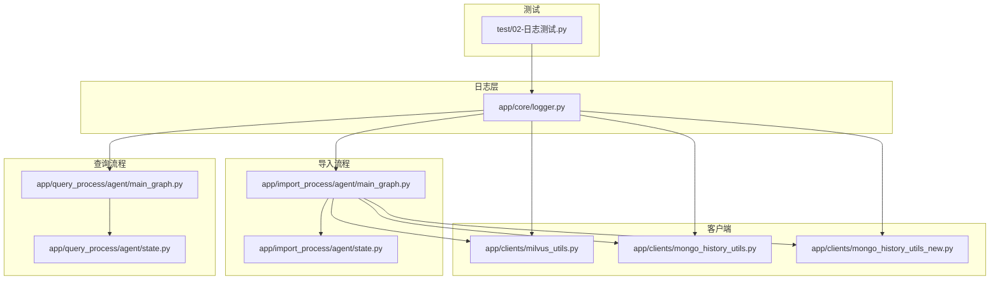
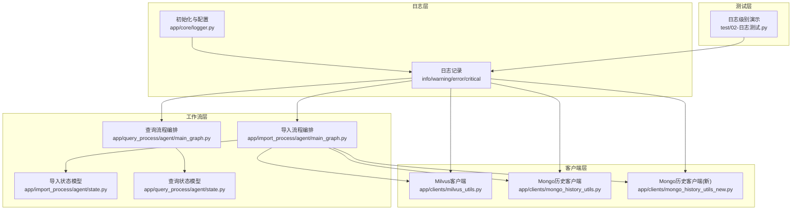
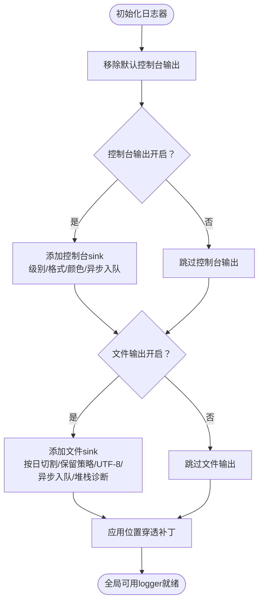
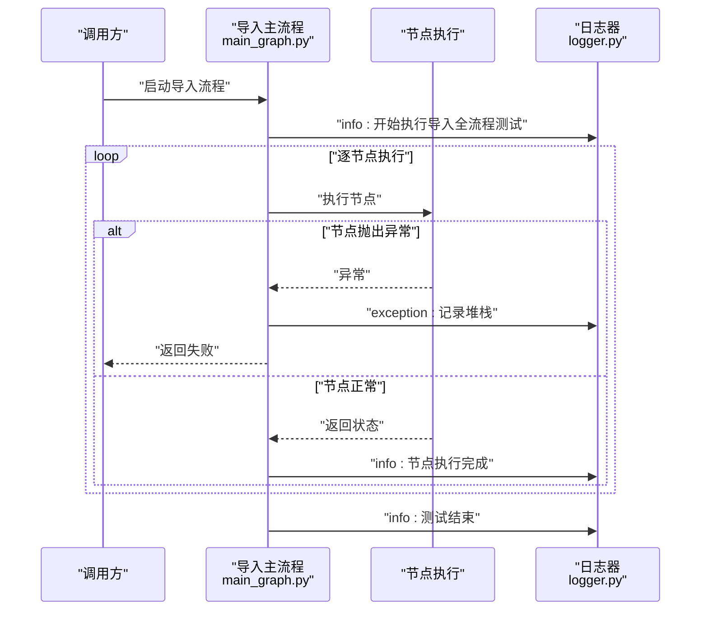
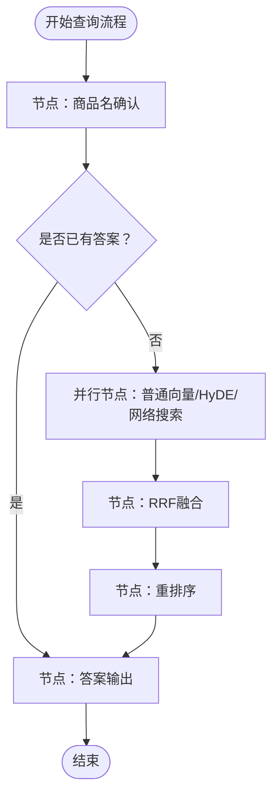
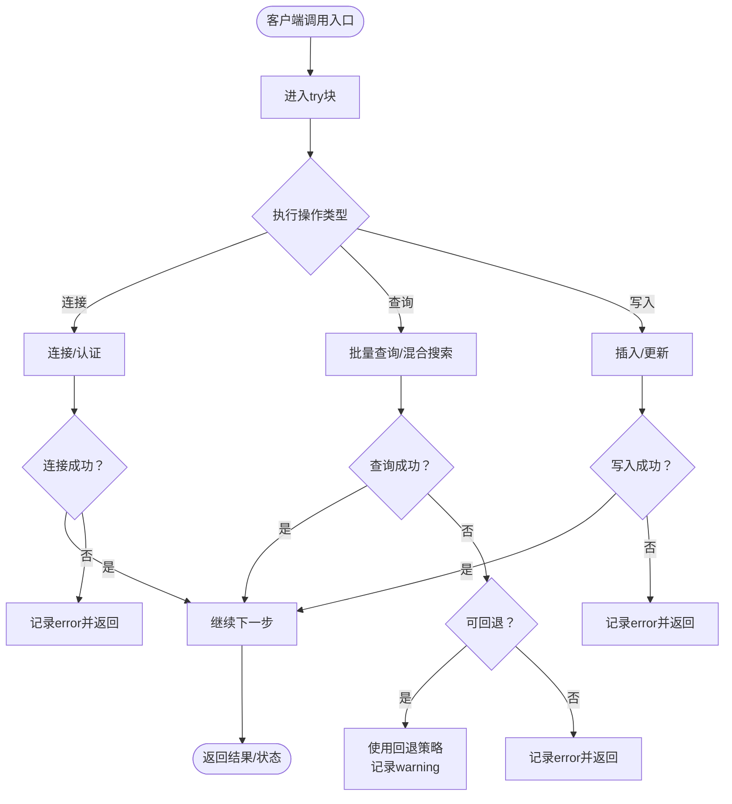
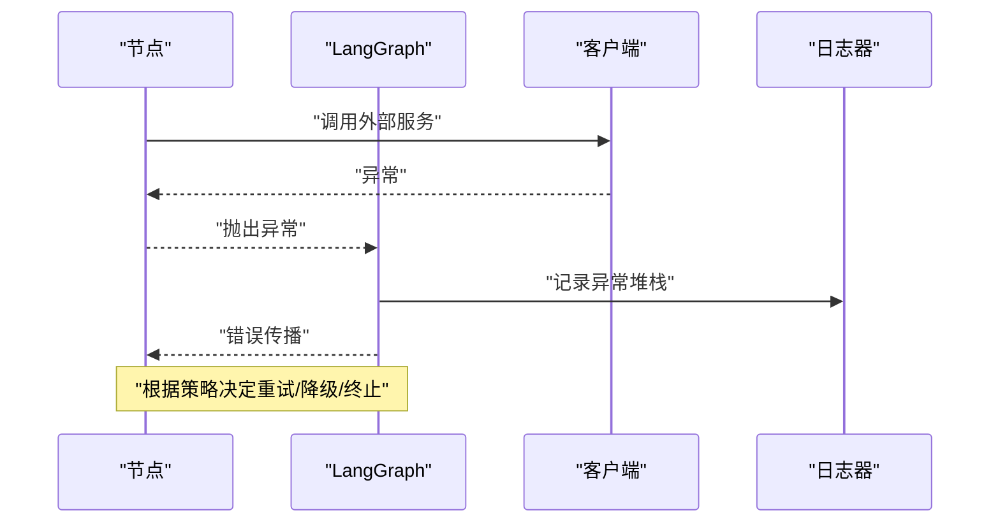
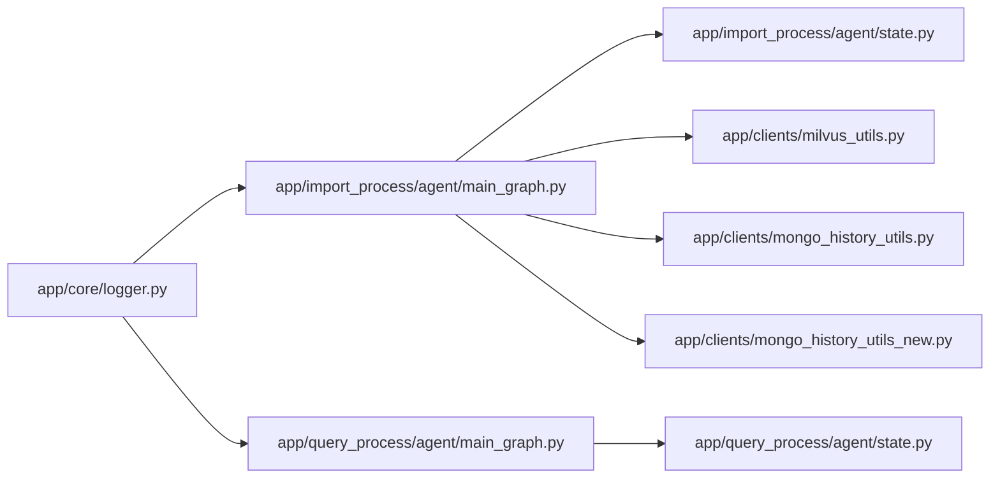

# 错误处理架构

<cite>
**本文引用的文件**
- [app/core/logger.py](file://app/core/logger.py)
- [app/import_process/agent/main_graph.py](file://app/import_process/agent/main_graph.py)
- [app/query_process/agent/main_graph.py](file://app/query_process/agent/main_graph.py)
- [app/import_process/agent/state.py](file://app/import_process/agent/state.py)
- [app/query_process/agent/state.py](file://app/query_process/agent/state.py)
- [app/clients/milvus_utils.py](file://app/clients/milvus_utils.py)
- [app/clients/mongo_history_utils.py](file://app/clients/mongo_history_utils.py)
- [app/clients/mongo_history_utils_new.py](file://app/clients/mongo_history_utils_new.py)
- [test/02-日志测试.py](file://test/02-日志测试.py)
</cite>

## 目录
1. [引言](#引言)
2. [项目结构](#项目结构)
3. [核心组件](#核心组件)
4. [架构总览](#架构总览)
5. [详细组件分析](#详细组件分析)
6. [依赖分析](#依赖分析)
7. [性能考虑](#性能考虑)
8. [故障排查指南](#故障排查指南)
9. [结论](#结论)
10. [附录](#附录)

## 引言
本文件面向RAG Agent项目的错误处理与可观测性，系统性阐述异常分类、异常传播与恢复策略；工作流中的节点级与全局错误处理模式；日志记录策略（格式、级别、存储位置）；错误监控与告警机制现状与建议；以及系统容错设计与降级策略。文档同时提供错误处理流程图与异常传播路径图，帮助读者快速理解从节点到全局的错误处理闭环。

## 项目结构
RAG Agent采用LangGraph编排导入与查询两条主流程，配套统一的日志基础设施与若干外部组件客户端（如Milvus、Mongo）。错误处理贯穿以下层次：
- 日志层：基于loguru的统一日志工具，支持.env配置、异步安全、位置穿透。
- 工作流层：LangGraph状态机在节点执行期间进行条件路由与错误传播。
- 客户端层：各外部组件客户端在连接、查询、写入等环节进行异常捕获与降级提示。
- 监控与告警：当前仓库未见专门的监控告警实现，建议结合日志与外部平台落地。

图表来源
- [app/core/logger.py:1-109](file://app/core/logger.py#L1-L109)
- [app/import_process/agent/main_graph.py:1-134](file://app/import_process/agent/main_graph.py#L1-L134)
- [app/query_process/agent/main_graph.py:1-47](file://app/query_process/agent/main_graph.py#L1-L47)
- [app/import_process/agent/state.py:1-99](file://app/import_process/agent/state.py#L1-L99)
- [app/query_process/agent/state.py:1-97](file://app/query_process/agent/state.py#L1-L97)
- [app/clients/milvus_utils.py](file://app/clients/milvus_utils.py)
- [app/clients/mongo_history_utils.py](file://app/clients/mongo_history_utils.py)
- [app/clients/mongo_history_utils_new.py](file://app/clients/mongo_history_utils_new.py)
- [test/02-日志测试.py:30-56](file://test/02-日志测试.py#L30-L56)

章节来源
- [app/core/logger.py:1-109](file://app/core/logger.py#L1-L109)
- [app/import_process/agent/main_graph.py:1-134](file://app/import_process/agent/main_graph.py#L1-L134)
- [app/query_process/agent/main_graph.py:1-47](file://app/query_process/agent/main_graph.py#L1-L47)
- [app/import_process/agent/state.py:1-99](file://app/import_process/agent/state.py#L1-L99)
- [app/query_process/agent/state.py:1-97](file://app/query_process/agent/state.py#L1-L97)

## 核心组件
- 统一日志器：提供配置驱动的控制台/文件双输出、自动路径与清理、异步安全、位置穿透等功能，确保错误日志可追溯、可审计。
- LangGraph工作流：导入与查询两条主流程，节点间通过条件边与静态边连接，支持在节点执行失败时进行错误传播与恢复。
- 客户端工具：对Milvus、Mongo等外部组件进行连接、查询、写入等操作时进行异常捕获，并根据场景选择警告、错误或异常记录。
- 测试与演示：通过测试脚本展示日志级别的使用与异常捕获行为，便于验证日志配置与错误处理策略。

章节来源
- [app/core/logger.py:46-83](file://app/core/logger.py#L46-L83)
- [app/import_process/agent/main_graph.py:69-134](file://app/import_process/agent/main_graph.py#L69-L134)
- [app/query_process/agent/main_graph.py:1-47](file://app/query_process/agent/main_graph.py#L1-L47)
- [app/clients/milvus_utils.py](file://app/clients/milvus_utils.py)
- [app/clients/mongo_history_utils.py](file://app/clients/mongo_history_utils.py)
- [app/clients/mongo_history_utils_new.py](file://app/clients/mongo_history_utils_new.py)
- [test/02-日志测试.py:30-56](file://test/02-日志测试.py#L30-L56)

## 架构总览
下图展示了错误处理在系统中的总体分布与交互关系：日志层作为统一入口，工作流层负责节点级错误传播，客户端层负责外部依赖的异常捕获与降级提示，测试层验证日志与异常行为。

图表来源
- [app/core/logger.py:46-83](file://app/core/logger.py#L46-L83)
- [app/import_process/agent/main_graph.py:19-65](file://app/import_process/agent/main_graph.py#L19-L65)
- [app/query_process/agent/main_graph.py:12-47](file://app/query_process/agent/main_graph.py#L12-L47)
- [app/import_process/agent/state.py:5-90](file://app/import_process/agent/state.py#L5-L90)
- [app/query_process/agent/state.py:5-68](file://app/query_process/agent/state.py#L5-L68)
- [app/clients/milvus_utils.py](file://app/clients/milvus_utils.py)
- [app/clients/mongo_history_utils.py](file://app/clients/mongo_history_utils.py)
- [app/clients/mongo_history_utils_new.py](file://app/clients/mongo_history_utils_new.py)
- [test/02-日志测试.py:30-56](file://test/02-日志测试.py#L30-L56)

## 详细组件分析

### 日志记录策略
- 配置驱动：通过.env控制台/文件输出开关、日志级别、保留策略，避免硬编码。
- 输出目标：支持同时输出到控制台与文件，文件输出自动按日期切割与清理。
- 异步安全：启用enqueue，适配多线程/异步场景，避免日志错乱。
- 位置穿透：通过自定义拦截器修正调用栈，使日志显示业务模块真实调用位置，提升可追溯性。
- 格式与级别：统一结构化格式，包含时间、级别、文件名、函数名、行号与消息；提供info/warning/error/critical等常见级别，满足不同严重程度的错误记录需求。

图表来源
- [app/core/logger.py:46-83](file://app/core/logger.py#L46-L83)
- [app/core/logger.py:88-103](file://app/core/logger.py#L88-L103)

章节来源
- [app/core/logger.py:21-30](file://app/core/logger.py#L21-L30)
- [app/core/logger.py:37-43](file://app/core/logger.py#L37-L43)
- [app/core/logger.py:55-81](file://app/core/logger.py#L55-L81)
- [app/core/logger.py:88-103](file://app/core/logger.py#L88-L103)
- [test/02-日志测试.py:30-56](file://test/02-日志测试.py#L30-L56)

### 导入流程错误处理（节点级与全局）
- 节点级：LangGraph节点在执行过程中产生的异常会被上层捕获；当前导入流程在主入口处使用异常捕获记录完整堆栈，确保失败可追踪。
- 全局错误：主入口通过异常捕获记录“全流程测试运行失败”，并输出堆栈信息，便于定位具体失败节点与上下文。
- 条件路由：导入流程根据输入类型（PDF/MD）进行条件路由，若输入非法或前置步骤失败，流程可提前结束，避免无效执行。

图表来源
- [app/import_process/agent/main_graph.py:71-134](file://app/import_process/agent/main_graph.py#L71-L134)
- [app/core/logger.py:46-83](file://app/core/logger.py#L46-L83)

章节来源
- [app/import_process/agent/main_graph.py:69-134](file://app/import_process/agent/main_graph.py#L69-L134)
- [app/import_process/agent/state.py:5-90](file://app/import_process/agent/state.py#L5-L90)

### 查询流程错误处理
- 查询流程同样基于LangGraph构建，节点间通过条件边与静态边连接；当前仓库未见显式的节点异常捕获逻辑，建议在关键节点增加异常捕获与降级策略。
- 若某检索/重排序节点失败，可考虑回退到其他检索源或返回空结果并记录warning，避免影响整体流程。

图表来源
- [app/query_process/agent/main_graph.py:12-47](file://app/query_process/agent/main_graph.py#L12-L47)

章节来源
- [app/query_process/agent/main_graph.py:1-47](file://app/query_process/agent/main_graph.py#L1-L47)
- [app/query_process/agent/state.py:5-68](file://app/query_process/agent/state.py#L5-L68)

### 客户端错误处理模式（以Milvus/Mongo为例）
- Milvus客户端：在连接、查询、写入等关键路径均进行异常捕获；对于可恢复的场景（如查询回退）记录warning并切换策略；对于不可恢复的异常记录error并附带堆栈。
- Mongo历史客户端：在事务/写入等关键路径捕获异常，部分场景选择重新抛出以触发上层处理；其余场景记录warning并返回安全状态。

图表来源
- [app/clients/milvus_utils.py](file://app/clients/milvus_utils.py)
- [app/clients/mongo_history_utils.py](file://app/clients/mongo_history_utils.py)
- [app/clients/mongo_history_utils_new.py](file://app/clients/mongo_history_utils_new.py)

章节来源
- [app/clients/milvus_utils.py](file://app/clients/milvus_utils.py)
- [app/clients/mongo_history_utils.py](file://app/clients/mongo_history_utils.py)
- [app/clients/mongo_history_utils_new.py](file://app/clients/mongo_history_utils_new.py)

### 异常分类与传播路径
- 异常分类：依据日志级别进行分类（info/warning/error/critical），其中error及以上级别用于记录需要人工干预或系统恢复的事件。
- 传播路径：节点级异常由节点抛出，上层工作流捕获并记录；客户端异常在各自模块内捕获并决定是否向上抛出或降级；日志器统一格式化输出，保证可追溯性。

图表来源
- [app/import_process/agent/main_graph.py:71-134](file://app/import_process/agent/main_graph.py#L71-L134)
- [app/core/logger.py:46-83](file://app/core/logger.py#L46-L83)
- [app/clients/milvus_utils.py](file://app/clients/milvus_utils.py)

## 依赖分析
- 日志器依赖：所有模块通过统一logger进行日志输出，降低耦合度，提高一致性。
- 工作流依赖：导入/查询流程依赖状态模型与节点实现；节点实现依赖客户端工具与外部服务。
- 客户端依赖：Milvus/Mongo客户端依赖外部服务可用性与配置；异常处理策略直接影响工作流稳定性。

图表来源
- [app/core/logger.py:46-83](file://app/core/logger.py#L46-L83)
- [app/import_process/agent/main_graph.py:19-65](file://app/import_process/agent/main_graph.py#L19-L65)
- [app/query_process/agent/main_graph.py:12-47](file://app/query_process/agent/main_graph.py#L12-L47)
- [app/import_process/agent/state.py:5-90](file://app/import_process/agent/state.py#L5-L90)
- [app/query_process/agent/state.py:5-68](file://app/query_process/agent/state.py#L5-L68)
- [app/clients/milvus_utils.py](file://app/clients/milvus_utils.py)
- [app/clients/mongo_history_utils.py](file://app/clients/mongo_history_utils.py)
- [app/clients/mongo_history_utils_new.py](file://app/clients/mongo_history_utils_new.py)

章节来源
- [app/core/logger.py:46-83](file://app/core/logger.py#L46-L83)
- [app/import_process/agent/main_graph.py:19-65](file://app/import_process/agent/main_graph.py#L19-L65)
- [app/query_process/agent/main_graph.py:12-47](file://app/query_process/agent/main_graph.py#L12-L47)
- [app/import_process/agent/state.py:5-90](file://app/import_process/agent/state.py#L5-L90)
- [app/query_process/agent/state.py:5-68](file://app/query_process/agent/state.py#L5-L68)
- [app/clients/milvus_utils.py](file://app/clients/milvus_utils.py)
- [app/clients/mongo_history_utils.py](file://app/clients/mongo_history_utils.py)
- [app/clients/mongo_history_utils_new.py](file://app/clients/mongo_history_utils_new.py)

## 性能考虑
- 日志性能：启用enqueue与按日切割，避免阻塞主线程；合理设置日志级别，减少高频warning/error带来的I/O开销。
- 客户端性能：在查询失败时采用回退策略（如从query回退到get），减少重复重试；对批量操作进行分批与超时控制，避免长时间阻塞。
- 工作流性能：在节点执行前进行必要的前置校验（如文件存在性），减少无效执行；对长耗时节点提供进度日志与超时保护。

## 故障排查指南
- 日志定位：利用位置穿透功能查看真实调用位置；结合.env配置调整日志级别与输出目标，快速定位问题。
- 客户端排查：关注Milvus/Mongo客户端的异常记录，区分warning与error；对可回退场景优先采用回退策略。
- 工作流排查：在导入/查询主入口增加异常捕获与堆栈记录，明确失败节点与上下文；对条件路由进行边界测试，确保异常路径被覆盖。

章节来源
- [app/core/logger.py:88-103](file://app/core/logger.py#L88-L103)
- [app/clients/milvus_utils.py](file://app/clients/milvus_utils.py)
- [app/clients/mongo_history_utils.py](file://app/clients/mongo_history_utils.py)
- [app/clients/mongo_history_utils_new.py](file://app/clients/mongo_history_utils_new.py)
- [app/import_process/agent/main_graph.py:71-134](file://app/import_process/agent/main_graph.py#L71-L134)
- [app/query_process/agent/main_graph.py:12-47](file://app/query_process/agent/main_graph.py#L12-L47)

## 结论
RAG Agent的错误处理架构以统一日志器为核心，配合LangGraph工作流与客户端工具的异常捕获与降级策略，形成了从节点到全局的闭环。建议在查询流程的关键节点补充异常捕获与降级逻辑，并结合外部监控平台完善告警机制，进一步提升系统的稳定性与可观测性。

## 附录
- 日志级别与使用建议：info用于流程关键节点与结果概览；warning用于可恢复的异常或潜在风险；error用于需要人工干预的失败；critical用于系统级不可恢复事件。
- 监控与告警：当前仓库未发现专门的监控告警实现，建议引入外部平台（如Prometheus/Grafana/ELK）对接日志与指标，建立阈值告警与异常聚合。